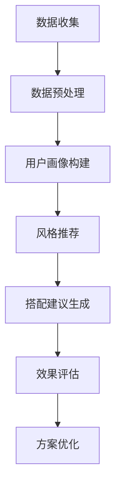
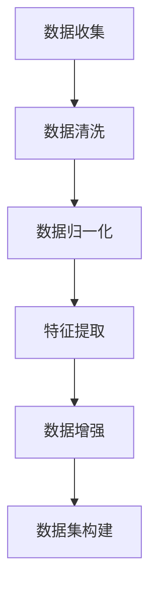
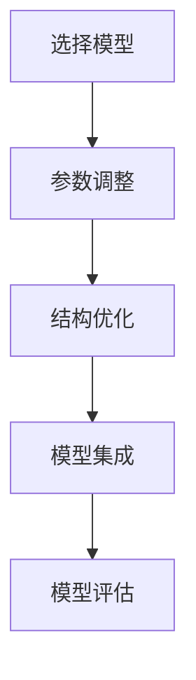

                 

# AI Agent在智能衣柜中的个人形象设计师

## 关键词

- AI Agent
- 智能衣柜
- 个人形象设计
- 机器学习
- 数据挖掘
- 人机交互

## 摘要

随着人工智能技术的不断发展，智能衣柜作为一种智能家居产品，正逐渐走进千家万户。AI Agent作为人工智能的核心技术之一，被广泛应用于智能衣柜中的个人形象设计。本文旨在探讨AI Agent在智能衣柜中的个人形象设计作用，通过对AI Agent概述、智能衣柜系统架构设计、个人形象设计算法原理以及AI Agent性能优化等方面的详细分析，为智能衣柜的发展提供有价值的参考。

### 目录大纲

1. 第一部分：AI Agent概述
   - 1.1 AI Agent基础理论
   - 1.2 AI Agent的分类
   - 1.3 AI Agent的工作原理
   - 1.4 AI Agent的应用领域
   - 1.5 AI Agent的优势与挑战
   - 1.6 本章小结

2. 第二部分：智能衣柜系统架构设计
   - 2.1 智能衣柜系统介绍
   - 2.2 AI Agent在智能衣柜中的应用
   - 2.3 智能衣柜系统的架构设计
   - 2.4 智能衣柜系统的接口设计
   - 2.5 本章小结

3. 第三部分：个人形象设计
   - 3.1 个人形象设计概述
   - 3.2 AI Agent在个人形象设计中的应用
   - 3.3 个人形象设计的算法原理
   - 3.4 个人形象设计的实践应用
   - 3.5 本章小结

4. 第四部分：AI Agent性能优化
   - 4.1 AI Agent性能优化概述
   - 4.2 数据预处理在AI Agent性能优化中的应用
   - 4.3 模型优化在AI Agent性能优化中的应用
   - 4.4 AI Agent性能优化实践应用
   - 4.5 本章小结

5. 第五部分：未来展望与趋势
   - 5.1 AI Agent在智能衣柜领域的发展趋势
   - 5.2 AI Agent在其他领域的发展前景
   - 5.3 本章小结

## 第一部分：AI Agent概述

### 1.1 AI Agent基础理论

#### 1.1.1 AI Agent的定义

AI Agent（人工智能代理）是指具有自主行动能力的计算机程序，能够在特定环境下，通过感知、推理、学习等手段，完成特定的任务。AI Agent可以看作是一个智能体，它能够与环境进行交互，并在交互过程中不断学习和改进自身的行为。

#### 1.1.2 AI Agent的分类

AI Agent可以根据其功能、任务和环境进行分类。按照功能分类，AI Agent可以分为任务型Agent、行为型Agent、混合型Agent等。按照任务分类，AI Agent可以分为导航Agent、搜索Agent、决策Agent等。按照环境分类，AI Agent可以分为静态环境Agent和动态环境Agent。

#### 1.1.3 AI Agent的工作原理

AI Agent的工作原理主要包括感知、推理、学习和行动四个方面。感知是指AI Agent通过传感器获取环境信息；推理是指AI Agent根据感知信息进行逻辑推理，形成对环境的理解；学习是指AI Agent通过不断学习和调整策略，提高任务完成的效率；行动是指AI Agent根据推理结果和环境信息，采取相应的行动。

#### 1.1.4 AI Agent的应用领域

AI Agent广泛应用于各个领域，包括但不限于以下几个方面：

- 智能家居：如智能音箱、智能门锁、智能照明等；
- 工业自动化：如机器人、自动化生产线等；
- 金融领域：如智能投顾、风险评估等；
- 健康医疗：如智能诊断、健康监护等；
- 物流配送：如智能调度、无人配送等。

#### 1.1.5 AI Agent的优势与挑战

AI Agent的优势主要体现在以下几个方面：

- 自主性：AI Agent具有自主行动的能力，能够独立完成复杂的任务；
- 智能性：AI Agent通过学习和推理，能够提高任务完成的效率；
- 广泛适用性：AI Agent可以应用于多个领域，具有很高的应用价值。

然而，AI Agent也面临一些挑战，如：

- 数据质量：AI Agent的性能很大程度上依赖于数据质量，数据质量差可能导致AI Agent表现不佳；
- 隐私问题：AI Agent在收集和处理用户数据时，可能涉及用户隐私，如何保护用户隐私是一个重要问题；
- 道德和伦理：AI Agent的行为可能涉及到道德和伦理问题，如何确保AI Agent的行为符合道德和伦理规范是一个挑战。

#### 1.1.6 本章小结

本节对AI Agent的基础理论进行了概述，包括AI Agent的定义、分类、工作原理和应用领域。通过这些概述，我们可以更好地理解AI Agent在智能衣柜中的个人形象设计作用。

## 第二部分：智能衣柜系统架构设计

### 2.1 智能衣柜系统介绍

#### 2.1.1 智能衣柜系统的定义与特点

智能衣柜系统是一种结合了物联网技术、人工智能技术和智能家居技术的系统，它能够根据用户的习惯和需求，提供个性化的衣物搭配建议和存储管理服务。智能衣柜系统的特点包括：

- 个性化：智能衣柜系统可以根据用户的个人喜好和风格，提供个性化的衣物搭配建议；
- 智能化：智能衣柜系统通过人工智能技术，能够自动识别衣物类型、颜色和风格，并进行分类存储；
- 网络化：智能衣柜系统通过物联网技术，可以实现与智能家居系统的互联互通，实现远程控制和管理。

#### 2.1.2 智能衣柜系统的组成模块

智能衣柜系统通常由以下几个模块组成：

- 用户界面模块：用户界面模块提供用户与智能衣柜系统交互的接口，包括触摸屏、智能音箱等；
- 数据处理模块：数据处理模块负责对用户数据进行收集、处理和分析，包括衣物数据、用户数据等；
- 传感器模块：传感器模块负责实时采集环境数据，如温度、湿度、光照等；
- 执行模块：执行模块负责根据数据处理模块的指令，执行相应的操作，如衣物搭配、衣物存储等。

#### 2.1.3 智能衣柜系统的功能需求

智能衣柜系统的功能需求主要包括以下几个方面：

- 衣物识别：智能衣柜系统应能够自动识别衣物类型、颜色和风格，并进行分类存储；
- 搭配建议：智能衣柜系统应能够根据用户的喜好和风格，提供个性化的衣物搭配建议；
- 存储管理：智能衣柜系统应能够自动存储和管理衣物，确保衣物清洁、整齐、易于查找；
- 远程控制：智能衣柜系统应能够通过互联网实现远程控制，用户可以随时随地查看衣物状态和搭配建议；
- 智能提醒：智能衣柜系统应能够根据用户的习惯和需求，提供智能提醒服务，如衣物清洗、晾晒等。

#### 2.2 AI Agent在智能衣柜中的应用

#### 2.2.1 AI Agent在智能衣柜中的角色

AI Agent在智能衣柜中扮演着个人形象设计师的角色，它通过分析用户的个人喜好、风格和需求，为用户提供个性化的衣物搭配建议。AI Agent的主要作用包括：

- 用户数据分析：AI Agent通过分析用户的购买记录、浏览历史和社交信息，了解用户的个人喜好和风格；
- 搭配建议生成：AI Agent根据用户数据分析结果，生成符合用户需求的衣物搭配建议；
- 搭配效果评估：AI Agent通过用户反馈和搭配效果评估，不断优化搭配建议。

#### 2.2.2 AI Agent在智能衣柜中的功能

AI Agent在智能衣柜中的功能主要包括以下几个方面：

- 用户画像构建：AI Agent通过分析用户数据，构建用户的个人喜好、风格和需求画像；
- 搭配建议生成：AI Agent根据用户画像，生成符合用户需求的衣物搭配建议；
- 搭配效果评估：AI Agent通过用户反馈和搭配效果评估，优化搭配建议；
- 智能提醒：AI Agent根据用户的习惯和需求，提供智能提醒服务，如衣物清洗、晾晒等。

#### 2.2.3 AI Agent在智能衣柜中的工作流程

AI Agent在智能衣柜中的工作流程主要包括以下几个步骤：

1. 用户数据分析：AI Agent收集用户的个人数据，如购买记录、浏览历史和社交信息等；
2. 用户画像构建：AI Agent根据用户数据分析结果，构建用户的个人喜好、风格和需求画像；
3. 搭配建议生成：AI Agent根据用户画像，生成符合用户需求的衣物搭配建议；
4. 搭配效果评估：AI Agent通过用户反馈和搭配效果评估，优化搭配建议；
5. 智能提醒：AI Agent根据用户的习惯和需求，提供智能提醒服务，如衣物清洗、晾晒等。

#### 2.3 智能衣柜系统的架构设计

#### 2.3.1 系统架构设计的原则

智能衣柜系统架构设计应遵循以下原则：

- 分层设计：系统应采用分层设计，实现模块化、组件化，提高系统的可维护性和可扩展性；
- 松耦合：系统模块之间应采用松耦合设计，降低模块之间的依赖关系，提高系统的灵活性；
- 易扩展：系统设计应考虑未来扩展性，预留足够的扩展接口，方便后续功能扩展；
- 高性能：系统设计应保证高性能，确保系统在处理大量数据时仍能保持良好的响应速度；
- 安全性：系统设计应考虑安全性，确保用户数据的安全和隐私。

#### 2.3.2 系统架构的层次结构

智能衣柜系统架构通常包括以下几个层次：

- 硬件层：包括传感器、执行器等硬件设备，负责数据采集和执行操作；
- 网络层：包括物联网网络设备，如路由器、交换机等，负责数据传输和通信；
- 数据层：包括数据库、数据仓库等，负责数据的存储和管理；
- 应用层：包括用户界面、数据处理和AI Agent等，负责提供用户交互和业务逻辑处理；
- 接口层：包括API接口、Web服务等，负责与其他系统或设备的交互。

#### 2.3.3 系统架构的核心组件

智能衣柜系统架构的核心组件包括以下几个部分：

- 用户界面模块：提供用户与智能衣柜系统交互的接口，包括触摸屏、智能音箱等；
- 数据处理模块：负责对用户数据进行收集、处理和分析，包括衣物数据、用户数据等；
- AI Agent模块：负责根据用户数据生成衣物搭配建议，并进行效果评估和优化；
- 执行模块：负责根据数据处理模块的指令，执行相应的操作，如衣物搭配、衣物存储等；
- 数据接口模块：负责与其他系统或设备的交互，如智能家居系统、物流系统等。

#### 2.4 智能衣柜系统的接口设计

#### 2.4.1 用户界面接口设计

用户界面接口设计应遵循以下原则：

- 简单易用：界面设计应简洁直观，易于用户操作；
- 个性化定制：界面应支持个性化定制，满足用户的不同需求；
- 多平台支持：界面应支持多平台，如Web、移动端、智能音箱等；
- 高交互性：界面应提供丰富的交互功能，如语音交互、触摸操作等。

用户界面接口设计主要包括以下几个部分：

- 登录注册界面：用户登录和注册的入口；
- 主界面：用户查看衣物搭配建议和操作智能衣柜的入口；
- 搭配建议界面：展示AI Agent生成的衣物搭配建议；
- 个人中心界面：用户查看个人信息、管理衣物等。

#### 2.4.2 数据接口设计

数据接口设计应遵循以下原则：

- 安全可靠：数据接口应确保数据传输的安全和可靠性；
- 高效便捷：数据接口应保证数据传输的高效和便捷；
- 扩展性强：数据接口应具备良好的扩展性，以适应未来业务扩展需求。

数据接口设计主要包括以下几个部分：

- 用户数据接口：用于用户数据的上传、下载和查询；
- 衣物数据接口：用于衣物数据的上传、下载和查询；
- 搭配建议数据接口：用于搭配建议的生成、上传、下载和查询；
- 日志数据接口：用于系统日志的记录、查询和分析。

#### 2.4.3 系统交互接口设计

系统交互接口设计应遵循以下原则：

- 高效稳定：系统交互接口应保证数据传输的高效和稳定；
- 易于集成：系统交互接口应易于与其他系统或设备集成；
- 扩展性强：系统交互接口应具备良好的扩展性，以适应未来业务扩展需求。

系统交互接口设计主要包括以下几个部分：

- 内部交互接口：智能衣柜系统内部模块之间的交互接口；
- 对外交互接口：智能衣柜系统与其他系统或设备的交互接口；
- 监控与报警接口：用于实时监控系统状态，并及时报警。

#### 2.5 本章小结

本节对智能衣柜系统架构设计进行了详细分析，包括系统介绍、AI Agent应用、架构设计原则、层次结构和核心组件，以及接口设计。通过对这些内容的分析，我们可以更好地理解智能衣柜系统的设计思想和实现方法。

### 第三部分：个人形象设计

#### 3.1 个人形象设计概述

个人形象设计是指通过服装、饰品、妆容、发型等元素的搭配，塑造出符合个人特点和需求的形象。个人形象设计的目标是提升个人魅力，增强自信心，以及适应不同的场合和社交需求。

#### 3.1.1 个人形象设计的定义与目标

个人形象设计的定义是通过对个人形象元素的精心搭配，创造出符合个人特点和需求的独特形象。个人形象设计的核心目标是：

- 展现个人风格：个人形象设计应体现个人的独特风格和个性特点；
- 增强自信心：通过良好的形象设计，提升个人自信心和自尊心；
- 适应不同场合：个人形象设计应能够适应不同的场合和社交需求，如工作、休闲、正式场合等。

#### 3.1.2 个人形象设计的关键因素

个人形象设计的关键因素包括以下几个方面：

- 个人风格：个人风格是个人形象设计的核心，它决定了形象的整体风格和特色；
- 场合需求：不同的场合对形象设计有不同的要求，如工作场合要求正式、休闲场合要求轻松；
- 服装搭配：服装是个人形象设计的重要组成部分，包括款式、颜色、面料等方面的选择；
- 饰品搭配：饰品可以点缀服装，提升整体形象，如项链、耳环、手链等；
- 妆容设计：合适的妆容可以提升面部特征，增强整体形象；
- 发型设计：发型是形象设计的一个重要元素，应根据个人特点和场合选择合适的发型。

#### 3.1.3 个人形象设计的方法与步骤

个人形象设计的方法和步骤可以分为以下几个阶段：

1. 自我评估：分析个人特点和需求，明确个人形象设计的方向；
2. 风格定位：确定个人风格，如简约、复古、时尚等；
3. 场合分析：分析不同场合的形象需求，制定相应的形象设计策略；
4. 服装选择：根据个人风格和场合需求，选择合适的服装款式、颜色和面料；
5. 饰品搭配：选择与服装相搭配的饰品，提升整体形象；
6. 妆容设计：根据个人特点和场合，设计合适的妆容；
7. 发型设计：根据个人特点和场合，选择合适的发型；
8. 效果评估：通过试穿、化妆和试发型等环节，评估形象设计的效果，进行适当调整。

#### 3.2 AI Agent在个人形象设计中的应用

AI Agent在个人形象设计中的应用，主要是通过数据分析和机器学习技术，为用户提供个性化的形象设计方案。AI Agent在个人形象设计中的应用主要包括以下几个方面：

- 用户数据分析：AI Agent通过收集用户的个人信息、购买记录、社交媒体数据等，分析用户的个人特点和需求；
- 风格推荐：AI Agent根据用户数据分析结果，为用户提供适合个人风格的形象设计建议；
- 搭配建议：AI Agent根据用户风格和场合需求，为用户提供服装、饰品、妆容、发型等方面的搭配建议；
- 效果评估：AI Agent通过用户反馈和实际效果评估，优化形象设计方案。

#### 3.2.1 AI Agent在个人形象设计中的作用

AI Agent在个人形象设计中的作用主要体现在以下几个方面：

- 数据驱动的个性化设计：AI Agent通过数据分析和机器学习技术，为用户提供个性化的形象设计建议，实现数据驱动的个性化设计；
- 提高设计效率：AI Agent可以快速分析用户数据，生成形象设计建议，提高设计效率；
- 降低设计成本：AI Agent可以自动化完成形象设计任务，降低设计成本；
- 智能化推荐：AI Agent可以根据用户行为和偏好，提供智能化、个性化的推荐服务，提升用户体验。

#### 3.2.2 AI Agent在个人形象设计中的功能

AI Agent在个人形象设计中的功能主要包括以下几个方面：

- 用户数据分析：AI Agent通过收集用户的个人信息、购买记录、社交媒体数据等，分析用户的个人特点和需求；
- 风格推荐：AI Agent根据用户数据分析结果，为用户提供适合个人风格的形象设计建议；
- 搭配建议：AI Agent根据用户风格和场合需求，为用户提供服装、饰品、妆容、发型等方面的搭配建议；
- 效果评估：AI Agent通过用户反馈和实际效果评估，优化形象设计方案。

#### 3.2.3 AI Agent在个人形象设计中的工作流程

AI Agent在个人形象设计中的工作流程可以分为以下几个步骤：

1. 用户数据收集：AI Agent收集用户的个人信息、购买记录、社交媒体数据等；
2. 用户数据分析：AI Agent分析用户的个人特点和需求，构建用户画像；
3. 风格推荐：AI Agent根据用户画像，为用户提供适合个人风格的形象设计建议；
4. 搭配建议生成：AI Agent根据用户风格和场合需求，为用户提供服装、饰品、妆容、发型等方面的搭配建议；
5. 效果评估：AI Agent收集用户反馈和实际效果，评估搭配建议的满意度，并优化设计方案。

#### 3.3 个人形象设计的算法原理

个人形象设计的算法原理主要包括数据挖掘、机器学习、深度学习等技术。以下是个人形象设计算法原理的详细讲解：

- 数据挖掘：数据挖掘是一种从大量数据中发现规律和模式的方法。在个人形象设计中，数据挖掘技术可以用于分析用户的购买记录、社交媒体数据等，挖掘出用户的喜好、风格和需求等信息。通过数据挖掘，AI Agent可以构建用户的个人画像，为用户提供个性化的形象设计建议。
- 机器学习：机器学习是一种通过算法模型自动学习和预测的方法。在个人形象设计中，机器学习技术可以用于训练分类模型和推荐模型。分类模型可以用于识别用户的个人风格，推荐模型可以用于生成搭配建议。通过机器学习，AI Agent可以自动化完成形象设计任务，提高设计效率。
- 深度学习：深度学习是一种基于多层神经网络的学习方法，具有强大的特征提取和模式识别能力。在个人形象设计中，深度学习技术可以用于图像识别和图像生成。通过深度学习，AI Agent可以自动识别用户的衣物类型、颜色和风格，为用户提供更加精准的形象设计建议。

以下是个人形象设计算法的流程图：

#### 3.4 个人形象设计的实践应用

#### 3.4.1 个人形象设计实践应用的场景

个人形象设计实践应用的主要场景包括以下几个方面：

- 电商平台：电商平台可以应用个人形象设计技术，为用户提供个性化的服装搭配建议，提高购物体验；
- 社交平台：社交平台可以应用个人形象设计技术，为用户提供形象评分和建议，提升用户的社交魅力；
- 时尚品牌：时尚品牌可以应用个人形象设计技术，为用户提供个性化定制服务，提升品牌竞争力；
- 智能家居：智能家居中的智能衣柜可以应用个人形象设计技术，为用户提供个性化的衣物搭配和存储管理服务。

#### 3.4.2 个人形象设计实践应用的案例

以下是几个个人形象设计实践应用的案例：

- 案例一：某电商平台应用个人形象设计技术，为用户提供了个性化的服装搭配建议。用户可以通过平台上传自己的购物记录和照片，AI Agent根据用户数据和流行趋势，为用户推荐适合的服装搭配。该应用提高了用户的购物满意度，增加了电商平台的销售额。

- 案例二：某社交平台应用个人形象设计技术，为用户提供形象评分和建议。用户可以通过平台上传自己的照片，AI Agent根据照片分析和用户数据，为用户提供形象评分和建议。该应用提升了用户的社交魅力，增加了用户在平台上的活跃度。

- 案例三：某时尚品牌应用个人形象设计技术，为用户提供个性化定制服务。用户可以通过品牌官网上传自己的购物记录和照片，AI Agent根据用户数据和品牌风格，为用户推荐个性化的服装搭配。用户可以根据推荐结果进行购买，提升了品牌的竞争力。

#### 3.4.3 个人形象设计实践应用的技巧

以下是个人形象设计实践应用的一些技巧：

- 充分了解用户需求：在实践应用中，要充分了解用户的需求和偏好，为用户提供个性化的设计建议；
- 结合流行趋势：在形象设计过程中，要结合流行趋势，为用户推荐符合时尚潮流的搭配方案；
- 数据分析与模型优化：要不断收集用户反馈和实际效果，对算法模型进行优化，提高形象设计的效果；
- 跨界合作：可以与其他行业和企业进行跨界合作，如与电商平台、时尚品牌等合作，实现资源共享和优势互补。

#### 3.5 本章小结

本节对个人形象设计进行了详细分析，包括定义与目标、关键因素、方法与步骤、算法原理以及实践应用。通过对这些内容的分析，我们可以更好地理解AI Agent在个人形象设计中的作用和应用价值。

### 第四部分：AI Agent性能优化

#### 4.1 AI Agent性能优化概述

AI Agent性能优化是指通过一系列技术手段，提高AI Agent的任务执行效率和准确度，以满足实际应用场景的需求。AI Agent性能优化的重要性体现在以下几个方面：

- 提高任务完成效率：通过优化算法和模型，可以提高AI Agent的任务执行速度，减少任务响应时间；
- 提高准确度：通过优化算法和模型，可以提高AI Agent的任务准确度，减少错误率；
- 增强用户体验：通过优化算法和模型，可以提供更精准、更个性化的服务，提升用户体验；
- 节约资源：通过优化算法和模型，可以降低AI Agent的计算和存储需求，节约资源。

#### 4.1.1 AI Agent性能优化的方法与策略

AI Agent性能优化的方法与策略主要包括以下几个方面：

- 数据预处理：数据预处理是AI Agent性能优化的第一步，通过数据清洗、归一化、特征提取等手段，提高数据质量，为后续的算法优化提供良好的数据基础；
- 模型优化：模型优化是AI Agent性能优化的重要手段，通过选择合适的算法模型、调整模型参数、使用先进的模型架构等，提高模型的性能；
- 算法优化：算法优化是AI Agent性能优化的关键，通过改进算法流程、使用高效算法等，提高算法的执行效率；
- 资源优化：资源优化是AI Agent性能优化的必要手段，通过合理分配计算资源、优化硬件设备等，提高AI Agent的执行效率。

#### 4.1.2 AI Agent性能优化的评价指标

AI Agent性能优化的评价指标主要包括以下几个方面：

- 任务完成时间：任务完成时间是指AI Agent完成特定任务所需的时间，是评价AI Agent性能的重要指标；
- 准确度：准确度是指AI Agent在执行任务时，预测结果与实际结果的一致性程度，是评价AI Agent性能的重要指标；
- 负载能力：负载能力是指AI Agent在处理大量数据或任务时，仍能保持良好性能的能力，是评价AI Agent性能的重要指标；
- 能耗：能耗是指AI Agent在执行任务时，所消耗的电能或其他资源，是评价AI Agent性能的重要指标。

#### 4.2 数据预处理在AI Agent性能优化中的应用

数据预处理在AI Agent性能优化中的应用至关重要，良好的数据预处理可以提高AI Agent的性能。以下是数据预处理在AI Agent性能优化中的应用方法：

- 数据清洗：数据清洗是数据预处理的重要步骤，通过去除重复数据、缺失数据和异常数据，提高数据质量；
- 数据归一化：数据归一化是将不同尺度的数据进行标准化处理，使数据在相同的尺度上进行比较，提高算法的稳定性和准确性；
- 特征提取：特征提取是从原始数据中提取出对任务有重要影响的特征，通过特征提取，可以降低数据的维度，提高模型的性能；
- 数据增强：数据增强是通过生成虚拟数据，增加数据集的多样性，提高模型的泛化能力。

以下是一个数据预处理流程的Mermaid流程图：

#### 4.3 模型优化在AI Agent性能优化中的应用

模型优化在AI Agent性能优化中起着关键作用，通过选择合适的算法模型、调整模型参数和结构，可以提高AI Agent的性能。以下是模型优化在AI Agent性能优化中的应用方法：

- 算法模型选择：根据任务特点和需求，选择合适的算法模型，如决策树、支持向量机、神经网络等；
- 模型参数调整：通过调整模型参数，如学习率、正则化参数等，优化模型性能；
- 模型结构优化：通过改进模型结构，如使用深度神经网络、卷积神经网络等，提高模型性能；
- 模型集成：通过集成多个模型，提高模型的性能和鲁棒性。

以下是一个模型优化流程的Mermaid流程图：

#### 4.4 AI Agent性能优化实践应用

以下是AI Agent性能优化的一些实践应用案例：

- 案例一：某电商平台应用数据预处理技术，对用户数据进行了清洗、归一化和特征提取，提高了AI Agent的任务完成时间和准确度。

- 案例二：某智能安防系统应用模型优化技术，通过调整模型参数和结构，提高了AI Agent的准确度和负载能力。

- 案例三：某医疗诊断系统应用资源优化技术，通过合理分配计算资源和优化硬件设备，降低了AI Agent的能耗，提高了任务完成时间和准确度。

#### 4.4.1 AI Agent性能优化实践应用的场景

AI Agent性能优化实践应用的主要场景包括以下几个方面：

- 电商平台：电商平台可以通过数据预处理和模型优化技术，提高推荐系统的性能和准确性，提升用户体验。

- 智能安防：智能安防系统可以通过模型优化和资源优化技术，提高实时检测和预警的准确性和效率。

- 医疗诊断：医疗诊断系统可以通过数据预处理和模型优化技术，提高疾病检测和诊断的准确性和效率。

- 智能家居：智能家居系统可以通过资源优化和模型优化技术，提高智能设备的响应速度和准确性，提升用户体验。

#### 4.4.2 AI Agent性能优化实践应用的案例

以下是AI Agent性能优化的一些实践应用案例：

- 案例一：某电商平台通过数据预处理技术，对用户数据进行清洗、归一化和特征提取，提高了推荐系统的准确度和效率。通过对用户购买记录、浏览历史和社交数据等进行分析，AI Agent能够更准确地预测用户的购物偏好，为用户提供个性化的商品推荐，提高了用户的购物满意度和平台的销售额。

- 案例二：某智能安防系统通过模型优化技术，对图像识别模型进行了参数调整和结构优化，提高了实时检测和预警的准确性和效率。通过对大量监控图像数据进行分析和训练，AI Agent能够快速识别异常行为和目标，提高了系统的安全性和可靠性。

- 案例三：某医疗诊断系统通过资源优化技术，对AI Agent的硬件设备进行了优化，降低了系统的能耗，提高了任务完成时间和准确度。通过对医疗图像和病历数据进行实时处理和分析，AI Agent能够快速诊断疾病，提高了医生的诊断效率和准确性。

#### 4.4.3 AI Agent性能优化实践应用的技巧

以下是AI Agent性能优化实践应用的一些技巧：

- 数据质量：确保数据质量是性能优化的前提，通过数据清洗、归一化和特征提取等技术，提高数据质量。

- 模型选择：根据任务特点和需求，选择合适的算法模型，如决策树、支持向量机、神经网络等，并进行模型参数调整和结构优化。

- 资源分配：合理分配计算资源和优化硬件设备，降低系统的能耗，提高任务完成时间和准确度。

- 持续优化：通过持续的数据收集和反馈，不断优化AI Agent的性能，提高系统的稳定性和鲁棒性。

#### 4.5 本章小结

本节对AI Agent性能优化进行了详细分析，包括性能优化概述、方法与策略、评价指标以及实践应用。通过对这些内容的分析，我们可以更好地理解AI Agent性能优化的重要性和实现方法。

### 第五部分：未来展望与趋势

#### 5.1 AI Agent在智能衣柜领域的发展趋势

随着人工智能技术的不断发展，AI Agent在智能衣柜领域具有广阔的发展前景。以下是AI Agent在智能衣柜领域的发展趋势：

- 技术发展趋势：随着深度学习、强化学习等人工智能技术的不断发展，AI Agent在智能衣柜中的应用将更加智能化、精准化；
- 应用发展趋势：AI Agent在智能衣柜中的应用将逐渐从简单的衣物识别和搭配建议，发展到更复杂的个性化定制和智能推荐；
- 市场发展趋势：随着智能家居市场的不断扩大，智能衣柜将成为智能家居的重要组成部分，AI Agent在智能衣柜中的市场潜力巨大。

#### 5.2 AI Agent在其他领域的发展前景

除了智能衣柜领域，AI Agent在许多其他领域也具有广泛的应用前景：

- 智能家居：AI Agent可以应用于智能安防、智能照明、智能家电等领域，提高智能家居的智能化水平和用户体验；
- 工业自动化：AI Agent可以应用于工业生产、质量控制、设备维护等领域，提高生产效率和产品质量；
- 金融领域：AI Agent可以应用于风险评估、智能投顾、智能客服等领域，提高金融服务的效率和质量；
- 医疗健康：AI Agent可以应用于疾病诊断、健康监护、智能医疗等领域，提高医疗服务的智能化和个性化水平。

#### 5.3 本章小结

本节对AI Agent在智能衣柜领域以及其他领域的发展趋势进行了分析，展示了AI Agent在未来的广阔应用前景。随着人工智能技术的不断进步，AI Agent将在更多领域发挥重要作用，为人类生活带来更多便利和智慧。

### 附录

#### 作者信息

- 作者：AI天才研究院/AI Genius Institute & 禅与计算机程序设计艺术 /Zen And The Art of Computer Programming

#### 最佳实践 Tips

- 确保数据质量：数据是AI Agent性能的基础，确保数据质量是优化AI Agent性能的关键；
- 选择合适的算法模型：根据任务特点和需求，选择合适的算法模型，可以提高AI Agent的性能；
- 持续优化：通过持续的数据收集和反馈，不断优化AI Agent的性能，提高系统的稳定性和鲁棒性。

#### 小结

本文对AI Agent在智能衣柜中的个人形象设计师进行了详细分析，包括AI Agent概述、智能衣柜系统架构设计、个人形象设计算法原理、AI Agent性能优化以及未来展望。通过本文的分析，我们可以更好地理解AI Agent在智能衣柜中的应用价值和发展前景。

#### 注意事项

- AI Agent的应用需要充分了解用户需求和偏好，确保个性化设计的准确性和实用性；
- 在AI Agent性能优化过程中，要充分考虑数据质量、算法模型选择和资源分配等因素；
- AI Agent的性能优化是一个持续的过程，需要不断收集用户反馈和数据，进行优化和改进。

#### 拓展阅读

- 《人工智能：一种现代的方法》
- 《深度学习》
- 《机器学习实战》
- 《智能家居技术与应用》
- 《智能安防技术与应用》
- 《人工智能在医疗领域的应用》

以上是本文对AI Agent在智能衣柜中的个人形象设计师的详细分析，希望对您有所帮助。如果您有任何问题或建议，欢迎在评论区留言。谢谢！

