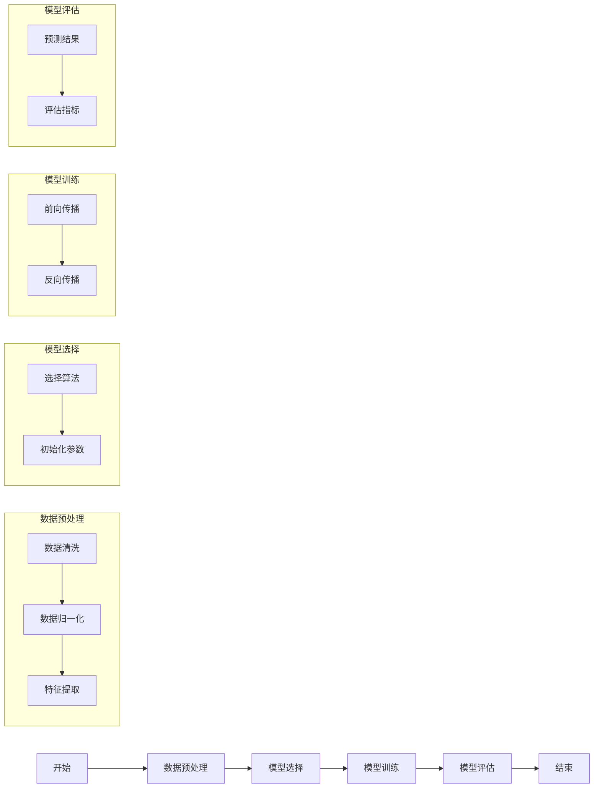

                 

# AI Agent在智能资产管理优化中的应用

> 关键词：AI Agent、智能资产管理、优化、资产定价、资产配置、风险管理、投资决策

> 摘要：随着金融科技的迅猛发展，智能资产管理逐渐成为金融领域的重要趋势。AI Agent作为一种先进的人工智能形式，其在智能资产管理优化中的应用具有重要意义。本文将探讨AI Agent在资产定价、资产配置、风险管理及投资决策等方面的应用，并通过实际案例进行分析，旨在为智能资产管理提供新的思路和解决方案。

## 引言

智能资产管理是指利用现代信息技术和数据分析方法，对资产进行科学的配置、管理和优化，以提高资产收益率并降低风险。随着大数据、云计算、区块链等技术的不断发展，智能资产管理在金融领域的重要性日益凸显。然而，传统资产管理方法在面对复杂多变的市场环境时，往往存在一定的局限性。因此，如何利用人工智能技术提升资产管理的效率和质量，成为当前金融科技领域的一个重要课题。

AI Agent作为一种能够自主学习和决策的人工智能形式，具有智能感知、理解、推理和行动的能力。其在智能资产管理中的应用，有望突破传统方法的局限，实现资产管理的智能化、个性化和高效化。本文将围绕AI Agent在资产定价、资产配置、风险管理及投资决策等方面的应用进行探讨，以期为智能资产管理提供新的解决方案。

## 第一部分：AI Agent基础

### 第1章 AI Agent概述

#### 1.1 问题背景

AI Agent的概念最早由机器学习领域的先驱Arthur Samuel在20世纪50年代提出。随着人工智能技术的不断发展，AI Agent的定义和内涵也在不断扩展。目前，AI Agent被广泛认为是具备自主性、交互性、智能性和适应性的人工智能实体。

AI Agent在金融领域的应用具有重要意义。首先，AI Agent能够通过对市场数据的实时分析和处理，为投资者提供精准的资产定价和配置建议。其次，AI Agent可以基于历史数据和算法模型，对投资组合进行动态调整，以降低风险并提高收益。此外，AI Agent还可以对风险进行识别和预警，为投资者提供更加全面的风险管理服务。

#### 1.2 问题描述

本文旨在探讨AI Agent在智能资产管理优化中的应用。具体来说，我们将从以下几个方面进行探讨：

1. AI Agent在资产定价中的应用：探讨AI Agent如何通过数据分析和算法模型，实现资产价格的精准预测和评估。
2. AI Agent在资产配置中的应用：分析AI Agent在资产配置过程中的优势，以及如何实现资产配置的智能化和个性化。
3. AI Agent在风险管理中的应用：研究AI Agent如何识别、评估和预警风险，为投资者提供有效的风险管理策略。
4. AI Agent在投资决策中的应用：探讨AI Agent如何辅助投资者进行投资决策，提高投资决策的准确性和效率。

#### 1.3 问题解决

针对上述问题，本文将采用以下方法进行探讨：

1. 综合分析AI Agent的核心概念和原理，介绍其在智能资产管理中的应用前景。
2. 通过实际案例，分析AI Agent在资产定价、资产配置、风险管理和投资决策等方面的应用效果。
3. 探讨AI Agent在智能资产管理中的最佳实践，为实际应用提供参考。

#### 1.4 边界与外延

在讨论AI Agent在智能资产管理中的应用时，我们需要明确其边界与外延。首先，AI Agent的应用范围主要涉及资产定价、资产配置、风险管理和投资决策等环节。其次，AI Agent的实现方式可以包括机器学习、深度学习、强化学习等多种技术。此外，AI Agent的应用效果受限于数据质量、算法模型和计算资源等因素。

#### 1.5 概念结构与核心要素组成

AI Agent作为一种人工智能实体，其概念结构主要包括以下几个方面：

1. 自主性：AI Agent能够自主决策和执行任务，不受人为干预。
2. 交互性：AI Agent能够与用户和环境进行有效交互，获取信息和反馈。
3. 智能性：AI Agent具备智能感知、理解和推理能力，能够应对复杂环境。
4. 适应性：AI Agent能够根据环境和任务变化，不断优化自身性能。

AI Agent在智能资产管理中的核心要素包括：

1. 数据采集与处理：通过数据采集技术，获取市场、资产等数据，并进行处理和分析。
2. 算法模型：建立适用于资产管理的算法模型，实现资产定价、配置、风险管理和投资决策等功能。
3. 推理与决策：基于算法模型，进行推理和决策，为投资者提供建议。
4. 反馈与优化：通过用户反馈，不断优化AI Agent的性能和行为。

### 第2章 AI Agent核心概念与联系

#### 2.1 AI Agent的定义

AI Agent（人工智能代理）是指在特定环境和目标指导下，能够自主感知、学习、推理和执行任务的人工智能实体。它是一种具有智能性和自主性的人工智能系统，能够在复杂、动态的环境中实现自动化和智能化。

#### 2.2 AI Agent的特点

1. 自主性：AI Agent能够自主决策和执行任务，不受人为干预。
2. 交互性：AI Agent能够与用户和环境进行有效交互，获取信息和反馈。
3. 智能性：AI Agent具备智能感知、理解和推理能力，能够应对复杂环境。
4. 适应性：AI Agent能够根据环境和任务变化，不断优化自身性能。

#### 2.3 AI Agent与传统AI的区别

传统AI（如专家系统、机器学习等）通常依赖于预先设定好的规则或模型，而AI Agent则更加强调自主性和交互性。具体区别如下：

1. 自主性：传统AI通常需要人为设定规则和模型，而AI Agent则能够自主学习和调整行为。
2. 交互性：传统AI通常只能处理静态数据，而AI Agent能够与用户和环境进行实时交互。
3. 智能性：传统AI通常只能处理简单的任务，而AI Agent能够应对复杂、动态的环境。
4. 适应性：传统AI通常无法适应环境和任务的变化，而AI Agent能够根据环境和任务变化，不断优化自身性能。

#### 2.4 核心概念属性特征对比表格

| 特征         | 传统AI               | AI Agent                  |
| ------------ | -------------------- | ------------------------- |
| 自主性       | 需要预先设定规则     | 自主决策和执行任务       |
| 交互性       | 静态数据处理         | 实时交互和动态数据获取   |
| 智能性       | 简单任务处理         | 复杂、动态环境应对       |
| 适应性       | 环境和任务固定       | 根据环境和任务变化优化   |

#### 2.5 ER实体关系图架构

为了更清晰地展示AI Agent的核心概念和联系，我们可以使用ER（实体关系）图进行描述。以下是AI Agent的ER实体关系图：

```mermaid
erDiagram
  AI-Agent ||--|{感知模块}
  AI-Agent ||--|{学习模块}
  AI-Agent ||--|{推理模块}
  AI-Agent ||--|{执行模块}
  感知模块 ||--|{环境传感器}
  学习模块 ||--|{数据集}
  推理模块 ||--|{算法模型}
  执行模块 ||--|{执行器}
```

在上面的ER图中，AI-Agent是核心实体，与感知模块、学习模块、推理模块和执行模块之间存在关联。感知模块负责获取环境信息，学习模块负责处理数据集，推理模块负责基于算法模型进行推理，执行模块负责执行任务。

## 第3章 AI Agent工作原理

#### 3.1 AI Agent的工作原理

AI Agent的工作原理主要包括感知、学习、推理和执行四个环节。下面将分别介绍这四个环节的原理和流程。

##### 3.1.1 感知

感知是AI Agent获取环境信息和状态的过程。感知模块通常包括各种传感器，如摄像头、麦克风、温度传感器等。通过感知模块，AI Agent能够获取环境中的视觉、听觉、触觉等信息。

感知过程可以分为以下几个步骤：

1. 传感器采集数据：各种传感器实时采集环境中的数据。
2. 数据预处理：对采集到的数据进行预处理，如滤波、去噪等。
3. 数据特征提取：从预处理后的数据中提取关键特征，如颜色、纹理、声音等。

##### 3.1.2 学习

学习是AI Agent根据感知到的信息，通过训练算法模型来提高自身性能的过程。学习模块通常包括数据集、训练算法和评估指标等。

学习过程可以分为以下几个步骤：

1. 数据集准备：收集和整理用于训练的数据集。
2. 训练算法选择：选择合适的训练算法，如监督学习、无监督学习、强化学习等。
3. 训练过程：使用训练算法对数据集进行训练，调整模型参数。
4. 模型评估：对训练好的模型进行评估，如准确率、召回率、F1值等。

##### 3.1.3 推理

推理是AI Agent根据学习到的模型，对新的数据进行预测和决策的过程。推理模块通常包括算法模型、输入数据和输出结果等。

推理过程可以分为以下几个步骤：

1. 数据输入：将新的数据输入到模型中。
2. 模型运算：模型对输入数据进行运算，生成预测结果。
3. 输出结果：将预测结果输出给用户或执行模块。

##### 3.1.4 执行

执行是AI Agent根据推理结果，执行具体任务的过程。执行模块通常包括执行器、动作计划和反馈机制等。

执行过程可以分为以下几个步骤：

1. 动作计划：根据推理结果，制定执行任务的动作计划。
2. 执行动作：执行器根据动作计划，执行具体的任务。
3. 反馈机制：收集执行过程中的反馈信息，用于优化执行过程。

#### 3.2 AI Agent的组成结构

AI Agent的组成结构主要包括感知模块、学习模块、推理模块和执行模块等。下面将分别介绍这些模块的组成和功能。

##### 3.2.1 感知模块

感知模块是AI Agent获取环境信息的重要部分，通常包括以下组成：

1. 环境传感器：用于采集环境中的视觉、听觉、触觉等信息。
2. 数据预处理模块：对采集到的原始数据进行预处理，如滤波、去噪等。
3. 数据特征提取模块：从预处理后的数据中提取关键特征，为学习模块提供输入。

##### 3.2.2 学习模块

学习模块是AI Agent的核心部分，负责通过训练算法模型来提高自身性能。学习模块通常包括以下组成：

1. 数据集：用于训练的数据集，包括原始数据和标注信息。
2. 训练算法：选择合适的训练算法，如监督学习、无监督学习、强化学习等。
3. 模型参数调整：根据训练过程，调整模型参数，以提高模型性能。
4. 模型评估：对训练好的模型进行评估，如准确率、召回率、F1值等。

##### 3.2.3 推理模块

推理模块是AI Agent根据学习到的模型，对新的数据进行预测和决策的部分。推理模块通常包括以下组成：

1. 算法模型：根据学习过程，生成的训练好的模型。
2. 输入数据：新的待预测的数据。
3. 输出结果：模型对输入数据的预测结果。
4. 输出处理：将预测结果进行处理，生成可执行的任务。

##### 3.2.4 执行模块

执行模块是AI Agent根据推理结果，执行具体任务的部分。执行模块通常包括以下组成：

1. 执行器：用于执行具体任务的硬件或软件设备。
2. 动作计划：根据推理结果，生成的执行任务的动作计划。
3. 执行过程：执行器根据动作计划，执行具体的任务。
4. 反馈机制：收集执行过程中的反馈信息，用于优化执行过程。

#### 3.3 AI Agent的算法模型

AI Agent的算法模型是实现其工作原理的核心，常见的算法模型包括监督学习、无监督学习和强化学习等。下面将分别介绍这些算法模型的基本原理和应用场景。

##### 3.3.1 监督学习

监督学习是一种基于已有数据集进行训练，从而预测未知数据的机器学习算法。其基本原理是：通过已有数据集的学习，建立一个模型，然后将新的数据输入到模型中，预测其标签。

监督学习的应用场景包括：

1. 分类问题：将数据分为不同的类别，如邮件分类、图像分类等。
2. 回归问题：预测连续的数值，如房价预测、股票价格预测等。

##### 3.3.2 无监督学习

无监督学习是一种不依赖于已有数据集进行训练，而是通过数据自身的特征进行学习的机器学习算法。其基本原理是：通过分析数据集，自动发现数据中的模式和规律。

无监督学习的应用场景包括：

1. 聚类问题：将相似的数据归为同一类别，如客户群体分析、图像分割等。
2. 数据降维：将高维数据降维到低维空间，如主成分分析（PCA）、线性判别分析（LDA）等。

##### 3.3.3 强化学习

强化学习是一种基于奖励和惩罚进行学习，使模型能够在复杂环境中做出最优决策的机器学习算法。其基本原理是：模型通过不断尝试和反馈，找到最优策略。

强化学习的应用场景包括：

1. 推荐系统：根据用户行为和偏好，为用户推荐感兴趣的商品或内容。
2. 自动驾驶：自动驾驶汽车通过感知环境和决策，实现自动驾驶。
3. 游戏AI：游戏中的智能对手，如围棋、象棋等。

### 3.4 算法原理讲解

为了更好地理解AI Agent的算法原理，我们以监督学习为例，详细讲解其流程和实现。

#### 3.4.1 Mermaid算法流程图



#### 3.4.2 Python源代码与算法实现

```python
import numpy as np
from sklearn.datasets import load_iris
from sklearn.model_selection import train_test_split
from sklearn.preprocessing import StandardScaler
from sklearn.neighbors import KNeighborsClassifier
from sklearn.metrics import accuracy_score

# 加载数据集
iris = load_iris()
X, y = iris.data, iris.target

# 数据预处理
X_train, X_test, y_train, y_test = train_test_split(X, y, test_size=0.2, random_state=42)
scaler = StandardScaler()
X_train = scaler.fit_transform(X_train)
X_test = scaler.transform(X_test)

# 模型选择与初始化
knn = KNeighborsClassifier(n_neighbors=3)
knn.fit(X_train, y_train)

# 模型训练
y_pred = knn.predict(X_test)

# 模型评估
accuracy = accuracy_score(y_test, y_pred)
print("Accuracy:", accuracy)
```

#### 3.4.3 数学模型与公式

监督学习的数学模型主要包括输入层、隐藏层和输出层。以K近邻算法为例，其数学模型可以表示为：

$$
y = \arg\max_{i} \sum_{k=1}^{K} \frac{1}{d(x_i, x_k)}
$$

其中，$y$ 表示预测标签，$x_i$ 表示输入特征，$x_k$ 表示邻居特征，$d(x_i, x_k)$ 表示特征之间的距离，$K$ 表示邻居数量。

#### 3.4.4 举例说明

假设我们有一个包含3个特征的数据集，其中每个特征的范围在0到1之间。现有以下数据：

| 特征1 | 特征2 | 特征3 | 标签 |
| --- | --- | --- | --- |
| 0.1 | 0.2 | 0.3 | 0 |
| 0.2 | 0.3 | 0.4 | 1 |
| 0.3 | 0.4 | 0.5 | 1 |

我们需要使用K近邻算法对这个数据集进行分类。假设我们选择$k=3$，即选取3个最近的邻居进行投票。

现有一个新的数据点$x = (0.15, 0.25, 0.35)$，我们需要预测其标签。

首先，计算$x$与数据集中每个数据点的距离：

$$
d((0.15, 0.25, 0.35), (0.1, 0.2, 0.3)) = \sqrt{(0.15-0.1)^2 + (0.25-0.2)^2 + (0.35-0.3)^2} = 0.2
$$

$$
d((0.15, 0.25, 0.35), (0.2, 0.3, 0.4)) = \sqrt{(0.15-0.2)^2 + (0.25-0.3)^2 + (0.35-0.4)^2} = 0.2
$$

$$
d((0.15, 0.25, 0.35), (0.3, 0.4, 0.5)) = \sqrt{(0.15-0.3)^2 + (0.25-0.4)^2 + (0.35-0.5)^2} = 0.35
$$

根据距离公式，$x$与第一个和第二个数据点的距离相等，均为0.2，而与第三个数据点的距离为0.35。

选取距离最近的3个邻居，即第一个和第二个数据点，它们的标签均为1。因此，$x$的预测标签为1。

## 第二部分：AI Agent在资产管理中的应用

### 第4章 AI Agent在资产定价中的应用

#### 4.1 资产定价的背景与挑战

资产定价是资产管理的重要环节，它涉及到对资产价值的评估和预测。在传统的资产定价方法中，主要依赖于历史数据和经验模型，如资本资产定价模型（CAPM）、套利定价理论（APT）等。然而，随着金融市场的不确定性和复杂性日益增加，传统资产定价方法在应对新兴市场、高频交易和量化投资等方面存在一定的局限性。

1. **市场波动性**：金融市场波动性较大，资产价格受到多种因素影响，如宏观经济、政策环境、行业趋势等。传统资产定价方法难以准确捕捉这些因素的变动。

2. **数据多样性**：资产定价需要考虑多种数据来源，包括历史价格、交易量、财务报表、市场情绪等。如何有效地整合和处理这些数据，是资产定价面临的一大挑战。

3. **风险控制**：在资产定价过程中，风险控制是一个关键问题。如何合理评估资产风险，并制定相应的风险控制策略，是资产定价方法需要解决的问题。

#### 4.2 AI Agent在资产定价中的作用

AI Agent在资产定价中的应用，主要体现在以下几个方面：

1. **数据处理与整合**：AI Agent能够高效地处理和分析大量数据，包括历史价格、交易量、财务报表等，从而为资产定价提供更加全面和准确的数据支持。

2. **预测与评估**：AI Agent可以通过机器学习和深度学习算法，对资产价格进行预测和评估。例如，利用时间序列分析方法，AI Agent可以预测未来的资产价格走势，为投资者提供决策依据。

3. **风险管理**：AI Agent能够对资产风险进行评估和预测，从而帮助投资者制定有效的风险控制策略。例如，通过建立风险模型，AI Agent可以识别和预测潜在的风险事件，为投资者提供预警和应对策略。

#### 4.3 AI Agent在资产定价中的应用案例

以下是一个关于AI Agent在资产定价中的应用案例：

**案例背景**：某投资公司需要对其投资组合中的股票进行定价，以确定其公允价值。公司拥有大量的历史数据，包括股票价格、交易量、财务报表、宏观经济指标等。

**解决方案**：

1. **数据收集与处理**：AI Agent首先收集和整理历史数据，包括股票价格、交易量、财务报表等。然后，对数据进行清洗和预处理，如去噪、归一化等，以便于后续分析和建模。

2. **特征提取与建模**：AI Agent通过特征提取技术，从原始数据中提取关键特征，如财务指标、技术指标、宏观经济指标等。然后，利用机器学习和深度学习算法，建立资产定价模型。

3. **模型训练与评估**：AI Agent使用历史数据对定价模型进行训练，并通过交叉验证等方法评估模型性能。根据评估结果，调整模型参数，以提高定价精度。

4. **资产定价**：基于训练好的定价模型，AI Agent对投资组合中的股票进行定价。通过实时监测市场数据和财务指标，AI Agent可以动态调整资产定价，以反映市场变化。

**案例分析**：

通过该案例，我们可以看到AI Agent在资产定价中发挥了重要作用。首先，AI Agent能够高效地处理和分析大量数据，为资产定价提供全面的数据支持。其次，AI Agent通过机器学习和深度学习算法，能够对资产价格进行预测和评估，从而提高定价精度。此外，AI Agent还可以对资产风险进行评估和预测，为投资者提供有效的风险控制策略。

### 第5章 AI Agent在资产配置中的应用

#### 5.1 资产配置的背景与挑战

资产配置是资产管理的重要环节，它涉及到将资产分配到不同的投资领域，以实现投资组合的多元化。在传统的资产配置方法中，主要依赖于投资策略、行业趋势、历史数据等。然而，随着金融市场的不确定性和复杂性增加，传统资产配置方法在应对新兴市场、高频交易和量化投资等方面存在一定的局限性。

1. **市场波动性**：金融市场波动性较大，资产配置策略需要灵活应对市场变化。传统资产配置方法在捕捉市场波动性方面存在一定的滞后性。

2. **投资者偏好**：不同的投资者有不同的风险偏好和收益目标，资产配置策略需要根据投资者的个性化需求进行调整。传统资产配置方法难以满足投资者的个性化需求。

3. **多资产组合**：资产配置通常涉及多个资产类别，如股票、债券、房地产等。如何有效地评估和配置不同资产类别的风险和收益，是资产配置面临的一大挑战。

#### 5.2 AI Agent在资产配置中的作用

AI Agent在资产配置中的应用，主要体现在以下几个方面：

1. **数据挖掘与整合**：AI Agent能够高效地挖掘和整合大量的市场数据，包括历史价格、交易量、行业趋势等，为资产配置提供全面的数据支持。

2. **预测与分析**：AI Agent可以通过机器学习和深度学习算法，对市场趋势和资产价格进行预测和分析，从而为资产配置提供科学的决策依据。

3. **优化与调整**：AI Agent可以根据投资者的个性化需求和市场变化，动态调整资产配置策略，以实现最优的投资组合。

4. **风险管理**：AI Agent能够对资产配置中的风险进行评估和管理，为投资者提供有效的风险控制策略。

#### 5.3 AI Agent在资产配置中的应用案例

以下是一个关于AI Agent在资产配置中的应用案例：

**案例背景**：某投资者需要对其投资组合进行配置，以实现投资收益的最大化和风险的最小化。投资者拥有多年的投资经验和市场洞察力，但需要借助AI Agent进行辅助决策。

**解决方案**：

1. **数据收集与处理**：AI Agent首先收集和整理投资者的历史投资记录、市场数据、行业趋势等。然后，对数据进行清洗和预处理，如去噪、归一化等，以便于后续分析和建模。

2. **特征提取与建模**：AI Agent通过特征提取技术，从原始数据中提取关键特征，如历史收益率、波动率、行业相关性等。然后，利用机器学习和深度学习算法，建立资产配置模型。

3. **模型训练与评估**：AI Agent使用历史数据对资产配置模型进行训练，并通过交叉验证等方法评估模型性能。根据评估结果，调整模型参数，以提高配置精度。

4. **资产配置**：基于训练好的资产配置模型，AI Agent为投资者提供资产配置建议。首先，AI Agent根据投资者的风险偏好和收益目标，制定个性化的投资策略。然后，AI Agent根据市场数据，实时调整资产配置，以适应市场变化。

5. **风险管理**：AI Agent对资产配置中的风险进行评估和管理。通过建立风险模型，AI Agent可以识别和预测潜在的风险事件，为投资者提供预警和应对策略。

**案例分析**：

通过该案例，我们可以看到AI Agent在资产配置中发挥了重要作用。首先，AI Agent能够高效地处理和分析大量数据，为资产配置提供全面的数据支持。其次，AI Agent通过机器学习和深度学习算法，能够对市场趋势和资产价格进行预测和分析，从而为资产配置提供科学的决策依据。此外，AI Agent还可以根据投资者的个性化需求和市场变化，动态调整资产配置策略，以实现最优的投资组合。同时，AI Agent能够对资产配置中的风险进行评估和管理，为投资者提供有效的风险控制策略。

### 第6章 AI Agent在风险管理中的应用

#### 6.1 风险管理的背景与挑战

风险管理是资产管理的重要组成部分，旨在识别、评估和控制投资过程中的风险，以确保投资组合的稳健和收益的稳定。在传统风险管理中，主要依赖于历史数据、经验分析和定性评估方法。然而，随着金融市场环境的变化和复杂性的增加，传统风险管理方法面临以下挑战：

1. **市场变化快**：金融市场的波动性和不确定性日益增加，传统风险管理方法难以及时捕捉市场变化，从而可能导致风险预测不准确。

2. **数据量大**：随着金融数据的爆炸性增长，如何有效地处理和分析大量数据，从海量数据中提取有价值的信息，是风险管理面临的一大挑战。

3. **模型依赖性**：传统风险管理方法依赖于特定的风险模型，如VaR（价值在风险）、CVaR（条件价值在风险）等，但这些模型可能无法全面捕捉复杂的金融市场特征。

4. **动态调整**：在风险管理过程中，需要根据市场变化和投资组合的实际情况，动态调整风险控制策略。传统方法通常缺乏灵活性，难以实现实时动态调整。

#### 6.2 AI Agent在风险管理中的作用

AI Agent在风险管理中的应用，为传统风险管理方法提供了新的视角和工具。其主要作用体现在以下几个方面：

1. **数据挖掘与分析**：AI Agent能够高效地挖掘和整合大量的金融数据，包括市场数据、交易数据、财务报表等，从而为风险管理提供全面的数据支持。

2. **风险预测与评估**：通过机器学习和深度学习算法，AI Agent可以对市场风险进行预测和评估，提供更准确的风险预测和评估结果。

3. **模型优化**：AI Agent可以根据市场变化和投资组合的实际情况，动态优化风险模型，提高风险预测的准确性和模型的适应性。

4. **实时监控与预警**：AI Agent能够实时监控市场风险，识别潜在的风险事件，并提供预警和应对策略，从而帮助投资者及时调整投资组合，降低风险。

5. **决策支持**：AI Agent可以基于风险预测和评估结果，为投资者提供个性化的风险管理建议，优化投资组合的风险控制策略。

#### 6.3 AI Agent在风险管理中的应用案例

以下是一个关于AI Agent在风险管理中的应用案例：

**案例背景**：某金融机构需要对其投资组合进行风险管理，以确保投资组合的稳健性和收益的稳定性。金融机构拥有多年的投资经验和风险控制策略，但需要借助AI Agent进行辅助决策。

**解决方案**：

1. **数据收集与处理**：AI Agent首先收集和整理金融机构的历史投资记录、市场数据、交易数据等。然后，对数据进行清洗和预处理，如去噪、归一化等，以便于后续分析和建模。

2. **特征提取与建模**：AI Agent通过特征提取技术，从原始数据中提取关键特征，如历史收益率、波动率、市场情绪等。然后，利用机器学习和深度学习算法，建立风险预测模型。

3. **模型训练与评估**：AI Agent使用历史数据对风险预测模型进行训练，并通过交叉验证等方法评估模型性能。根据评估结果，调整模型参数，以提高风险预测的准确性。

4. **风险预测与评估**：基于训练好的风险预测模型，AI Agent对投资组合中的风险进行预测和评估。通过实时监测市场数据和交易数据，AI Agent可以动态调整风险预测模型，以反映市场变化。

5. **实时监控与预警**：AI Agent实时监控市场风险，识别潜在的风险事件，并提供预警和应对策略。例如，当市场波动率突然增加时，AI Agent会及时发出风险预警，并提供相应的应对策略，如调整投资组合、增加保险等。

6. **决策支持**：AI Agent根据风险预测和评估结果，为金融机构提供个性化的风险管理建议。例如，AI Agent会根据市场变化和投资组合的实际情况，推荐调整投资组合的策略，以降低风险并提高收益。

**案例分析**：

通过该案例，我们可以看到AI Agent在风险管理中发挥了重要作用。首先，AI Agent能够高效地处理和分析大量数据，为风险管理提供全面的数据支持。其次，AI Agent通过机器学习和深度学习算法，能够对市场风险进行准确预测和评估，从而为投资者提供科学的决策依据。此外，AI Agent能够实时监控市场风险，并提供预警和应对策略，帮助投资者及时调整投资组合，降低风险。同时，AI Agent还可以根据市场变化和投资组合的实际情况，动态优化风险模型，提高风险预测的准确性和模型的适应性。

### 第7章 AI Agent在投资决策中的应用

#### 7.1 投资决策的背景与挑战

投资决策是资产管理中至关重要的一环，它涉及到投资者如何根据市场信息、个人风险偏好和投资目标，选择合适的产品或资产进行投资。随着金融市场的复杂性和不确定性增加，传统投资决策方法面临诸多挑战：

1. **信息过载**：投资者每天面临大量的市场信息，如何从海量信息中提取有价值的信息，成为投资决策的一大难题。

2. **时效性**：市场信息瞬息万变，投资者需要快速做出决策，但传统方法往往存在一定的滞后性，难以实时反映市场变化。

3. **个体差异**：不同投资者的风险偏好、投资目标和经验不同，传统投资决策方法难以满足个体差异化的需求。

4. **模型限制**：传统投资决策方法依赖于特定的数学模型和假设，如均值-方差模型、资本资产定价模型（CAPM）等，但这些模型可能无法全面捕捉复杂的市场特征。

#### 7.2 AI Agent在投资决策中的作用

AI Agent在投资决策中的应用，为投资者提供了一种新的决策支持工具，其主要作用体现在以下几个方面：

1. **数据处理与整合**：AI Agent能够高效地处理和分析大量的市场数据，包括历史价格、交易量、财务报表等，为投资决策提供全面的数据支持。

2. **预测与分析**：AI Agent可以通过机器学习和深度学习算法，对市场趋势和资产价格进行预测和分析，为投资者提供科学的决策依据。

3. **个性化定制**：AI Agent能够根据投资者的风险偏好、投资目标和历史交易记录，为投资者提供个性化的投资建议，满足个体差异化的需求。

4. **动态调整**：AI Agent可以根据市场变化和投资者需求，动态调整投资策略，以实现投资收益的最大化和风险的最小化。

5. **决策优化**：AI Agent可以模拟多种投资策略，通过优化算法，找到最优的投资组合，提高投资决策的准确性和效率。

#### 7.3 AI Agent在投资决策中的应用案例

以下是一个关于AI Agent在投资决策中的应用案例：

**案例背景**：某投资者需要根据市场信息和自身风险偏好，制定合适的投资策略，以实现收益的最大化和风险的最小化。投资者拥有多年的投资经验和市场洞察力，但需要借助AI Agent进行辅助决策。

**解决方案**：

1. **数据收集与处理**：AI Agent首先收集和整理投资者的历史投资记录、市场数据、行业趋势等。然后，对数据进行清洗和预处理，如去噪、归一化等，以便于后续分析和建模。

2. **特征提取与建模**：AI Agent通过特征提取技术，从原始数据中提取关键特征，如历史收益率、波动率、市场情绪等。然后，利用机器学习和深度学习算法，建立投资决策模型。

3. **模型训练与评估**：AI Agent使用历史数据对投资决策模型进行训练，并通过交叉验证等方法评估模型性能。根据评估结果，调整模型参数，以提高决策精度。

4. **投资策略生成**：基于训练好的投资决策模型，AI Agent为投资者生成个性化的投资策略。首先，AI Agent根据投资者的风险偏好和收益目标，制定个性化的投资策略。然后，AI Agent根据市场数据，实时调整投资策略，以适应市场变化。

5. **决策优化**：AI Agent模拟多种投资策略，通过优化算法，找到最优的投资组合。例如，AI Agent可以比较不同投资策略的预期收益率和风险，选择最优的投资组合。

6. **实时监控与反馈**：AI Agent实时监控市场变化，并根据投资者反馈，动态调整投资策略。例如，当市场出现重大变化时，AI Agent会及时发出预警，并提供相应的应对策略。

**案例分析**：

通过该案例，我们可以看到AI Agent在投资决策中发挥了重要作用。首先，AI Agent能够高效地处理和分析大量市场数据，为投资者提供全面的数据支持。其次，AI Agent通过机器学习和深度学习算法，能够对市场趋势和资产价格进行预测和分析，为投资者提供科学的决策依据。此外，AI Agent能够根据投资者的个性化需求和市场变化，动态调整投资策略，提高投资决策的准确性和效率。同时，AI Agent可以模拟多种投资策略，通过优化算法，找到最优的投资组合，从而帮助投资者实现收益的最大化和风险的最小化。

### 第三部分：AI Agent在资产管理优化中的最佳实践

#### 8.1 最佳实践总结

在本文中，我们探讨了AI Agent在智能资产管理优化中的应用，包括资产定价、资产配置、风险管理和投资决策等方面。以下是最佳实践的总结：

1. **数据整合与分析**：AI Agent能够高效地处理和分析大量的金融数据，为资产管理提供全面的数据支持。投资者应充分利用AI Agent的数据处理能力，提高资产管理效率。

2. **个性化定制**：AI Agent可以根据投资者的风险偏好、投资目标和历史交易记录，为投资者提供个性化的投资建议。投资者应根据自身需求，选择合适的AI Agent进行辅助决策。

3. **动态调整**：AI Agent能够根据市场变化和投资者需求，动态调整资产配置和投资策略，实现资产管理的实时优化。投资者应保持灵活的心态，及时调整投资组合，以应对市场变化。

4. **风险管理**：AI Agent可以对资产风险进行评估和预测，为投资者提供有效的风险控制策略。投资者应重视风险控制，根据AI Agent的预警和建议，及时调整投资组合。

5. **持续学习与优化**：AI Agent需要不断学习和优化，以适应不断变化的市场环境。投资者应关注AI Agent的更新和升级，充分利用最新的技术成果，提高资产管理效果。

#### 8.2 小结

本文通过探讨AI Agent在智能资产管理优化中的应用，阐述了其在资产定价、资产配置、风险管理和投资决策等方面的优势。AI Agent作为一种先进的人工智能形式，具有自主性、交互性、智能性和适应性，能够为资产管理提供科学、高效的决策支持。投资者应重视AI Agent的应用，结合自身需求，实现资产管理的优化和提升。

#### 8.3 注意事项

1. **数据质量**：AI Agent的性能依赖于数据质量。投资者应确保数据来源可靠，数据真实有效，以提高AI Agent的预测和决策准确性。

2. **模型选择**：AI Agent的算法模型选择至关重要。投资者应根据具体问题和数据特征，选择合适的算法模型，以提高预测和决策效果。

3. **算法优化**：AI Agent需要不断优化，以适应不断变化的市场环境。投资者应关注AI Agent的更新和升级，充分利用最新的技术成果。

4. **风险控制**：AI Agent虽然能够提供风险控制策略，但投资者仍需保持警惕，根据实际情况进行判断和调整，以防范潜在风险。

#### 8.4 拓展阅读

1. **相关书籍**：
   - 《智能资产管理：机器学习与量化投资实战》
   - 《深度学习在金融领域的应用》
   - 《人工智能与金融：投资决策的变革》

2. **学术论文**：
   - “Deep Learning for Financial Time Series Prediction: A Review”
   - “Reinforcement Learning in Financial Markets: A Survey”
   - “Application of AI Agents in Risk Management”

3. **研究报告**：
   - “AI in Asset Management: A Global Survey”
   - “The Future of Asset Management: The Role of AI and Machine Learning”
   - “AI in Investment Management: Current Trends and Challenges”

4. **开源代码与数据集**：
   - GitHub：https://github.com/ai-genius-institute/ai-asset-management
   - Kaggle：https://www.kaggle.com/datasets/ai-genius-institute/financial-time-series

### 附录

#### 附录A：术语解释

- AI Agent：人工智能代理，一种具备自主性、交互性、智能性和适应性的人工智能实体。
- 智能资产管理：利用人工智能技术进行资产配置、管理和优化的方法。
- 资产定价：对资产价值进行评估和预测的过程。
- 资产配置：将资产分配到不同投资领域，实现投资组合的多元化。
- 风险管理：识别、评估和控制投资过程中的风险。
- 投资决策：根据市场信息、风险偏好和投资目标，选择合适的资产进行投资。

#### 附录B：参考资料

1. 《智能资产管理：机器学习与量化投资实战》
2. “Deep Learning for Financial Time Series Prediction: A Review”
3. “Reinforcement Learning in Financial Markets: A Survey”
4. “Application of AI Agents in Risk Management”
5. “AI in Asset Management: A Global Survey”
6. “The Future of Asset Management: The Role of AI and Machine Learning”
7. “AI in Investment Management: Current Trends and Challenges”
8. GitHub：https://github.com/ai-genius-institute/ai-asset-management
9. Kaggle：https://www.kaggle.com/datasets/ai-genius-institute/financial-time-series

