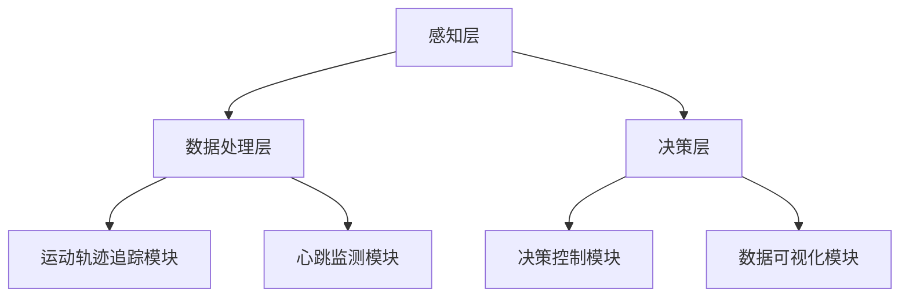
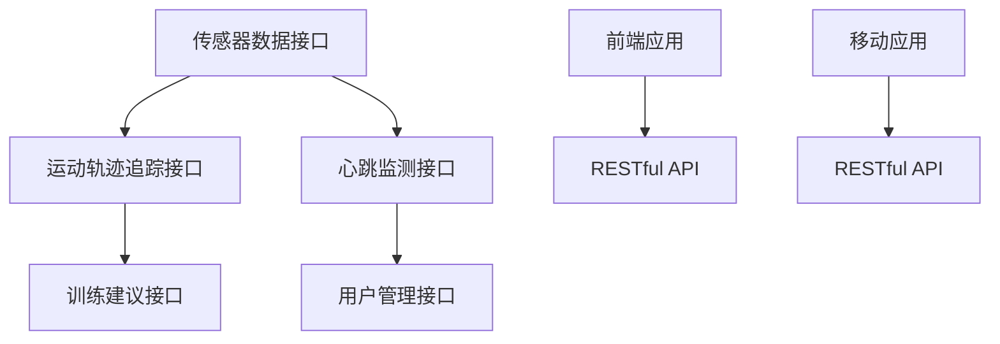
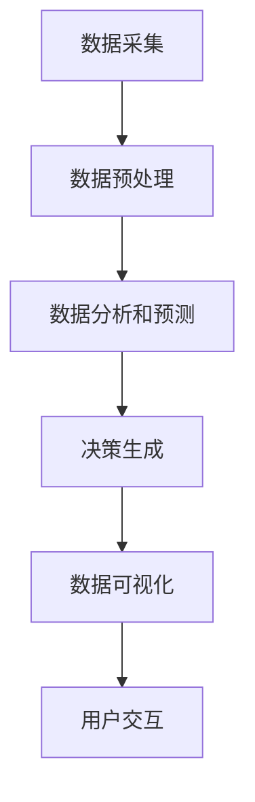

                 

### 第一部分：引言

#### 第1章: 问题背景与核心概念

**关键词**：智能跳绳、AI Agent、运动数据追踪、数据采集、数据处理、运动轨迹、心跳监测、能量消耗评估

**摘要**：
本文将深入探讨AI Agent在智能跳绳中的运动数据追踪应用。首先，我们会概述智能跳绳的兴起及其在健身和体育训练中的重要性。接着，我们会介绍运动数据追踪的核心概念和原理，并重点阐述AI Agent的构成要素与运动数据追踪之间的联系。本文的核心目标是通过逻辑清晰的分析，帮助读者理解AI Agent在智能跳绳中的具体应用及其对运动数据追踪的重要影响。

**1.1 问题背景**

**1.1.1 智能跳绳的兴起**

智能跳绳作为一种创新的健身设备，近年来在全球范围内迅速崛起。它不仅结合了传统跳绳的健身功能，还融入了现代科技元素，通过传感器和数据处理技术，提供实时的运动数据追踪和反馈。智能跳绳的出现，大大提升了跳绳运动的科学性和专业性，使得这项传统运动焕发出新的生命力。

**1.1.2 运动数据追踪的重要性**

在智能跳绳中，运动数据追踪扮演着至关重要的角色。通过收集和分析运动过程中的各类数据，如运动轨迹、心跳频率、能量消耗等，智能跳绳可以为用户提供个性化的训练建议，优化运动效果，并帮助用户实现健康目标。此外，运动数据追踪还能够监测用户的安全状况，提供实时预警，从而降低运动风险。

**1.1.3 AI Agent的概念与作用**

AI Agent，即人工智能代理，是一种能够自主决策并执行任务的智能系统。在智能跳绳中，AI Agent负责实时处理和分析运动数据，根据用户的运动状态和需求，提供个性化的训练计划和建议。AI Agent不仅能够提升运动数据追踪的准确性，还能根据用户的不同需求，实现灵活、高效的训练指导。

**1.2 核心概念与联系**

**1.2.1 AI Agent的构成要素**

AI Agent的构成要素主要包括监测传感器、数据处理模块和决策控制模块。监测传感器负责采集用户的运动数据，数据处理模块对采集到的数据进行清洗、归一化和特征提取，而决策控制模块则根据处理后的数据，生成个性化的训练建议。

**1.2.2 运动数据追踪的核心概念**

运动数据追踪涉及多个核心概念，包括运动轨迹、心跳监测和能量消耗评估。运动轨迹是用户在运动过程中形成的空间路径，心跳监测则是对用户心率的变化进行实时监测，能量消耗评估则是对用户在运动过程中消耗的卡路里进行计算。

**1.3 AI Agent与智能跳绳的运动数据追踪联系**

AI Agent在智能跳绳中发挥了重要作用，通过实时处理和分析运动数据，提供个性化的训练建议，优化用户的运动效果。同时，运动数据追踪的准确性也直接影响AI Agent的性能，二者相辅相成，共同提升了智能跳绳的智能化程度。

**1.4 本章小结**

本章概述了智能跳绳的兴起、运动数据追踪的重要性以及AI Agent的构成要素和运动数据追踪的核心概念。通过本章的介绍，读者可以初步了解AI Agent在智能跳绳中的运动数据追踪应用，为后续章节的深入分析打下基础。

---

### 1.2 核心概念与联系

#### 1.2.1 AI Agent的构成要素

AI Agent作为智能跳绳的核心组成部分，其功能实现依赖于多个关键要素的协同作用。以下是AI Agent的主要构成要素及其在运动数据追踪中的应用：

**1.2.1.1 监测传感器**

监测传感器是AI Agent的数据采集入口。智能跳绳通常配备多种传感器，如加速度计、陀螺仪和心率传感器等。这些传感器能够实时捕捉用户在运动过程中的各种物理数据，如跳绳的速度、方向和心跳频率。通过高精度的传感器数据，AI Agent可以准确地了解用户的运动状态，为后续的数据处理和分析提供可靠的依据。

**1.2.1.2 数据处理模块**

数据处理模块是AI Agent的核心组件，负责对采集到的传感器数据进行处理和分析。首先，数据处理模块会对原始数据进行清洗，去除噪声和不完整的数据点。然后，通过数据归一化和特征提取，将原始数据转化为适合机器学习和深度学习算法处理的形式。数据处理模块的功能包括：

- **数据清洗**：去除异常值、噪声和重复数据，保证数据的准确性和完整性。
- **数据归一化**：将不同量纲的数据统一为相同的尺度，便于算法的统一处理。
- **特征提取**：从原始数据中提取关键特征，如跳绳的摆动频率、方向和幅度等，用于后续的模型训练和预测。

**1.2.1.3 决策控制模块**

决策控制模块是AI Agent的智能核心，负责根据处理后的数据生成个性化的训练建议。决策控制模块通常采用机器学习或深度学习算法，通过学习大量的历史数据和用户行为模式，为用户制定最优的训练计划。其功能包括：

- **运动轨迹分析**：分析用户跳绳的运动轨迹，识别出用户的动作模式和技术水平。
- **实时反馈与调整**：根据用户的实时运动数据，提供即时反馈，帮助用户纠正动作偏差，优化运动效果。
- **个性化训练建议**：根据用户的历史数据和实时运动数据，为用户制定个性化的训练计划，提高运动效率和效果。

**1.2.2 运动数据追踪的核心概念**

运动数据追踪是智能跳绳的关键技术之一，其核心概念包括：

**1.2.2.1 运动轨迹**

运动轨迹是用户在运动过程中形成的空间路径。通过记录跳绳的摆动方向、速度和幅度等参数，AI Agent可以生成详细的运动轨迹数据。这些数据对于分析用户的运动技术和水平具有重要意义，可以帮助用户了解自己的运动状态，优化训练策略。

**1.2.2.2 心跳监测**

心跳监测是通过心率传感器实时捕捉用户的心率变化。心跳数据不仅反映了用户的运动强度，还可以提供健康评估的依据。AI Agent通过分析心跳数据，可以监控用户的心率变化，提供实时的心率预警和健康建议。

**1.2.2.3 能量消耗评估**

能量消耗评估是对用户在运动过程中消耗的卡路里进行计算。通过结合运动轨迹和心跳数据，AI Agent可以准确评估用户的能量消耗情况，为用户提供科学、合理的训练计划和饮食建议。

**1.2.3 AI Agent与运动数据追踪的联系**

AI Agent在智能跳绳中起到了桥梁的作用，将运动数据追踪与用户的运动体验紧密连接起来。具体来说，AI Agent通过监测传感器采集运动数据，数据处理模块对数据进行分析和特征提取，决策控制模块根据分析结果生成个性化的训练建议。这一过程不仅提高了运动数据追踪的准确性和效率，还大大增强了智能跳绳的用户体验。

**1.3.1 AI Agent在运动数据追踪中的应用**

AI Agent在智能跳绳中的应用主要体现在以下几个方面：

- **实时数据监控**：通过实时监控用户的运动数据，AI Agent可以及时发现用户的运动状态变化，提供即时反馈和调整建议，确保用户始终在最佳的运动状态。
- **个性化训练计划**：根据用户的运动数据，AI Agent可以生成个性化的训练计划，帮助用户提高运动效果，达到健康目标。
- **健康评估与预警**：通过分析用户的运动数据，AI Agent可以评估用户的健康状况，提供健康建议和预警，帮助用户预防运动风险。

**1.3.2 运动数据追踪对AI Agent性能的影响**

运动数据追踪的准确性对AI Agent的性能具有直接的影响。高精度的运动数据可以提升AI Agent的决策准确性，使其能够更准确地生成个性化的训练建议。此外，运动数据追踪的实时性也至关重要，实时数据可以确保AI Agent能够迅速响应用户的需求，提供即时的反馈和调整。

**1.4 本章小结**

本章详细介绍了AI Agent的构成要素及其在智能跳绳中的运动数据追踪应用。通过监测传感器、数据处理模块和决策控制模块的协同作用，AI Agent实现了对运动数据的实时采集、处理和分析，为用户提供个性化的训练建议和健康评估。本章的内容为后续章节的深入分析奠定了基础。

---

### 2.1 运动数据采集

运动数据采集是智能跳绳实现运动数据追踪的关键步骤，直接影响到后续数据处理和分析的准确性。以下将详细探讨运动数据采集的传感器选择、数据采集流程和数据预处理方法。

#### **2.1.1 传感器选择**

选择合适的传感器是确保运动数据采集准确性的第一步。智能跳绳中常用的传感器包括加速度计、陀螺仪和心率传感器等。每种传感器都有其独特的功能和应用场景：

- **加速度计**：加速度计用于测量跳绳的摆动速度和方向，可以提供跳绳运动的三维加速度数据。加速度计的精度和灵敏度对运动数据的准确性有很大影响，高精度的加速度计可以捕捉到细微的运动变化。

- **陀螺仪**：陀螺仪用于测量跳绳的角速度，可以提供跳绳运动的方向信息。陀螺仪的精度和稳定性同样至关重要，稳定的陀螺仪可以保证运动数据的连续性和可靠性。

- **心率传感器**：心率传感器用于监测用户的心率变化，提供运动强度和健康状况的重要指标。心率传感器的精度和舒适度直接影响用户的运动体验和数据的准确性。

在传感器选择时，需要考虑以下因素：

- **精度和灵敏度**：高精度和高灵敏度的传感器可以提供更准确的数据。
- **功耗和续航能力**：传感器功耗低且续航能力强，可以保证设备的长时间使用。
- **尺寸和便携性**：传感器的尺寸和便携性对于智能跳绳的穿戴和使用体验有重要影响。

#### **2.1.2 数据采集流程**

数据采集流程是传感器在采集数据时的一系列操作步骤。一个完整的数据采集流程通常包括以下阶段：

1. **传感器启动**：启动传感器，使其进入工作状态，准备开始采集数据。

2. **数据采样**：传感器按照预设的采样率对运动数据进行实时采集。采样率越高，可以捕捉到更多的运动细节，但同时也会增加数据量。

3. **数据传输**：传感器采集到的数据通过无线或有线方式传输到数据处理模块。无线传输通常采用蓝牙或Wi-Fi等无线通信技术，有线上传则通过USB接口等有线连接方式。

4. **数据存储**：数据在传输到数据处理模块后，会暂时存储在设备的内存或外部存储器中，以便后续处理和分析。

5. **数据同步**：为了确保数据的完整性和一致性，数据采集过程需要与用户的运动活动同步。这通常通过GPS定位、时间戳标记等方式实现，确保数据与实际运动时间相对应。

#### **2.1.3 数据预处理**

数据预处理是数据采集后的重要步骤，旨在提高数据的质量和可用性。以下是一些常见的数据预处理方法：

1. **数据清洗**：数据清洗是去除噪声、异常值和重复数据的过程。通过数据清洗，可以确保数据的准确性和完整性，避免错误分析。

2. **数据归一化**：数据归一化是将不同量纲的数据转换为相同尺度的过程。例如，将加速度计的测量结果从米每秒平方（m/s²）转换为百分比或标准差等。归一化有助于算法的统一处理和比较。

3. **特征提取**：特征提取是从原始数据中提取关键特征的过程。例如，可以从加速度数据中提取摆动频率、方向和幅度等特征，用于后续的模型训练和预测。

4. **数据融合**：数据融合是将来自不同传感器的数据进行整合，形成更全面的运动数据。例如，结合加速度计和陀螺仪的数据，可以更准确地描述跳绳的运动轨迹。

通过以上数据预处理方法，可以显著提高运动数据的可用性和分析质量，为后续的AI Agent处理和决策提供可靠的数据基础。

**本章小结**

本章详细介绍了运动数据采集的传感器选择、数据采集流程和数据预处理方法。传感器选择需要考虑精度、灵敏度、功耗和尺寸等因素，数据采集流程包括传感器启动、数据采样、传输、存储和同步等步骤，数据预处理则通过清洗、归一化、特征提取和融合等方法，提高了数据的准确性和可用性。这些步骤共同构成了智能跳绳运动数据采集的完整流程，为后续的数据处理和分析奠定了基础。

---

### 2.2 数据处理模块

在智能跳绳系统中，数据处理模块扮演着至关重要的角色，其功能不仅影响运动数据追踪的准确性，还直接关系到AI Agent的决策效果。以下是数据处理模块的核心功能及其实现方法。

#### **2.2.1 数据清洗**

数据清洗是数据处理模块的第一步，其目的是去除噪声、异常值和重复数据，确保数据的质量和准确性。以下是数据清洗的主要步骤：

1. **去除噪声**：噪声是指传感器在采集数据过程中由于外界干扰或传感器自身误差引入的不规则数据。通过滤波算法（如均值滤波、高斯滤波等），可以去除噪声，平滑数据曲线。

2. **去除异常值**：异常值是指那些偏离正常范围的数据点，可能是由于传感器故障或运动过程中的突发事件造成的。可以通过统计方法（如标准差法、离群点检测等）识别并去除异常值。

3. **处理重复数据**：重复数据是指在数据采集过程中由于同步错误或传输错误导致的重复记录。通过去重算法（如哈希表、排序等），可以有效地去除重复数据。

#### **2.2.2 数据归一化**

数据归一化是将不同量纲的数据转换为相同尺度的过程，以便于算法的统一处理和比较。以下是数据归一化的常见方法：

1. **最小-最大归一化**：将数据缩放到[0, 1]范围内。计算公式为：

   $$
   x_{\text{norm}} = \frac{x - x_{\text{min}}}{x_{\text{max}} - x_{\text{min}}}
   $$

   其中，$x_{\text{min}}$和$x_{\text{max}}$分别为数据的最小值和最大值。

2. **零-均值归一化**：将数据缩放到以零均值的范围内。计算公式为：

   $$
   x_{\text{norm}} = \frac{x - \mu}{\sigma}
   $$

   其中，$\mu$为数据的均值，$\sigma$为数据的标准差。

3. **标准差归一化**：将数据缩放到以标准差为尺度的范围内。计算公式为：

   $$
   x_{\text{norm}} = \frac{x - \mu}{\sigma}
   $$

   与零-均值归一化类似，但具有更好的鲁棒性。

#### **2.2.3 特征提取**

特征提取是从原始数据中提取关键特征的过程，用于后续的模型训练和预测。以下是特征提取的几种常见方法：

1. **时域特征提取**：时域特征提取直接从原始数据的时间序列中提取特征，如平均值、方差、峰值等。这些特征可以反映运动数据的基本统计特性。

2. **频域特征提取**：频域特征提取将原始数据从时域转换为频域，通过分析频谱特性提取特征，如频谱峰频率、频谱能量分布等。这些特征可以反映运动的周期性和频率特性。

3. **时频特征提取**：时频特征提取结合时域和频域的特征，通过短时傅里叶变换（STFT）或小波变换等时频分析方法，提取多尺度和多频率的特征。这些特征可以更全面地描述运动行为。

4. **高级特征提取**：高级特征提取利用机器学习和深度学习算法，从原始数据中提取更加抽象和复杂的特征。例如，通过自编码器（Autoencoder）或卷积神经网络（CNN）等模型，自动学习并提取有用的特征。

#### **2.2.4 数据融合**

数据融合是将来自不同传感器的数据进行整合，形成更全面的运动数据。以下是数据融合的常见方法：

1. **加权融合**：根据传感器的重要性和可靠性，为每个传感器的数据分配不同的权重，然后进行加权平均。计算公式为：

   $$
   x_{\text{fused}} = w_1 \cdot x_1 + w_2 \cdot x_2 + ... + w_n \cdot x_n
   $$

   其中，$x_1, x_2, ..., x_n$分别为来自不同传感器的数据，$w_1, w_2, ..., w_n$分别为相应的权重。

2. **卡尔曼滤波**：卡尔曼滤波是一种递归滤波算法，通过预测和更新步骤，融合观测数据和系统噪声，实时估计状态。它适用于动态系统的状态估计，如传感器数据的融合。

3. **贝叶斯网络**：贝叶斯网络是一种概率图模型，通过建立变量之间的条件概率关系，进行数据融合和推理。它可以有效地处理不确定性和复杂的关系。

通过以上数据处理模块的核心功能，智能跳绳系统能够对运动数据进行高效处理和分析，为AI Agent提供可靠的数据基础，实现准确的运动轨迹追踪和个性化训练建议。

**本章小结**

本章详细介绍了数据处理模块的核心功能，包括数据清洗、数据归一化、特征提取和数据融合。数据清洗确保了数据的质量和准确性，数据归一化实现了不同量纲数据的统一处理，特征提取提取了运动数据的关键特征，数据融合则整合了来自不同传感器的信息。这些功能共同构成了数据处理模块的完整框架，为智能跳绳系统的运动数据追踪和AI Agent决策提供了坚实的基础。

---

### 2.3 决策控制模块

在智能跳绳系统中，决策控制模块是AI Agent的核心组成部分，负责根据处理后的数据生成个性化的训练建议，从而提升用户的运动效果。以下是决策控制模块的核心功能及其实现方法。

#### **2.3.1 运动轨迹分析**

运动轨迹分析是决策控制模块的首要任务，通过分析用户跳绳的运动轨迹，识别出用户的动作模式和技术水平。以下是运动轨迹分析的主要步骤：

1. **轨迹数据预处理**：首先，对运动轨迹数据进行预处理，包括数据清洗、归一化和特征提取。确保数据的质量和一致性，为后续分析提供可靠的基础。

2. **轨迹特征提取**：从轨迹数据中提取关键特征，如摆动频率、摆动幅度、摆动方向等。这些特征可以反映用户的动作模式和技巧水平。

3. **轨迹模式识别**：利用机器学习或深度学习算法，对提取的特征进行模式识别。通过学习大量的历史数据，模型可以识别出不同技术水平用户的运动轨迹模式。

4. **轨迹评估**：根据识别出的运动轨迹模式，评估用户的动作技术水平和运动效果。例如，通过比较用户当前的轨迹模式与标准轨迹模式，识别出动作中的不足之处。

#### **2.3.2 实时反馈与调整**

实时反馈与调整是决策控制模块的重要功能，通过实时监测用户的运动数据，提供即时反馈和调整建议，帮助用户优化运动效果。以下是实时反馈与调整的实现方法：

1. **实时数据监控**：系统实时收集用户运动过程中的各项数据，包括轨迹数据、心率数据、能量消耗数据等。

2. **实时数据分析**：对实时数据进行分析，识别用户的运动状态和动作模式。通过机器学习算法，实时评估用户的动作技术水平和运动效果。

3. **即时反馈**：根据分析结果，系统实时生成反馈信息，通过音频、视觉或触觉等途径，向用户传达实时反馈。例如，当用户动作不准确时，系统可以发出语音提示或震动提醒，指导用户进行调整。

4. **动态调整**：根据用户的实时反馈，系统动态调整训练计划。例如，当用户动作改进后，系统可以增加运动强度或难度，进一步挑战用户。

#### **2.3.3 个性化训练建议**

个性化训练建议是决策控制模块的核心功能之一，根据用户的运动数据和历史行为模式，为用户制定个性化的训练计划。以下是个性化训练建议的实现方法：

1. **数据挖掘与预测**：利用数据挖掘技术，从用户的运动数据和历史行为模式中挖掘出有用的信息，预测用户的运动需求和效果。例如，通过分析用户的心率变化和能量消耗数据，预测用户的运动强度和效果。

2. **训练计划生成**：根据预测结果，系统生成个性化的训练计划。训练计划包括运动时间、运动强度、运动方式等，旨在帮助用户达到特定的健康目标。

3. **个性化调整**：根据用户的实时反馈和运动数据，系统动态调整训练计划。例如，当用户表现出色时，系统可以增加运动强度；当用户表现不佳时，系统可以降低运动强度，帮助用户逐步提升。

4. **建议可视化**：系统将个性化训练建议以可视化方式呈现给用户，如通过图表、视频或动画等，帮助用户更好地理解和执行训练计划。

通过以上决策控制模块的功能，智能跳绳系统能够实时监测用户的运动数据，生成个性化的训练建议，帮助用户优化运动效果，提升健康水平。这不仅提升了用户的运动体验，也为智能跳绳系统在健身和体育训练领域中的应用提供了有力的支持。

**本章小结**

本章详细介绍了决策控制模块的核心功能，包括运动轨迹分析、实时反馈与调整和个性化训练建议。通过运动轨迹分析，系统能够识别用户的动作模式和技巧水平；通过实时反馈与调整，系统能够即时指导用户优化运动效果；通过个性化训练建议，系统能够为用户提供科学、合理的训练计划。这些功能共同构成了智能跳绳系统中的决策控制模块，为用户的运动数据追踪和健康提升提供了全面支持。

---

### 3.1 算法概述

在智能跳绳系统中，运动数据追踪算法是核心技术之一，直接影响着系统的性能和用户体验。以下将介绍运动数据追踪中常用的算法类型及其选择依据。

#### **3.1.1 常见算法类型**

1. **基于机器学习的算法**：机器学习算法通过学习大量的历史数据，自动识别数据中的模式和规律。常见的机器学习算法包括决策树、支持向量机（SVM）、随机森林和神经网络等。这些算法具有较强的泛化能力，适用于复杂的数据分析和模式识别任务。

2. **基于深度学习的算法**：深度学习算法基于多层神经网络，通过大量的数据训练，自动提取数据中的高阶特征。常见的深度学习算法包括卷积神经网络（CNN）、循环神经网络（RNN）和生成对抗网络（GAN）等。深度学习算法在处理高维数据和复杂特征时具有显著优势。

3. **基于统计学的算法**：基于统计学的算法通过计算数据的统计特征，如均值、方差、协方差等，进行数据分析和模式识别。常见的统计学算法包括相关分析、主成分分析（PCA）和因子分析等。这些算法简单高效，适用于大规模数据集的初步分析。

4. **基于混合方法的算法**：混合方法结合了不同算法的优点，通过融合多个算法的结果，提高系统的整体性能。常见的混合方法包括基于机器学习和深度学习的混合算法、基于模型和数据驱动的混合算法等。

#### **3.1.2 算法选择依据**

在智能跳绳系统中，选择合适的算法需要考虑以下因素：

1. **数据特点**：不同算法适用于不同类型的数据。例如，机器学习和深度学习算法适合处理高维数据和复杂特征，而统计学算法适合处理大规模数据集的初步分析。

2. **性能要求**：不同算法在性能上有不同的表现。例如，深度学习算法在处理高维数据和复杂特征时具有显著优势，但训练时间和计算资源需求较高；机器学习算法相对简单高效，但可能在数据复杂度较高时性能不佳。

3. **计算资源**：不同算法对计算资源的需求不同。例如，深度学习算法通常需要较高的计算资源和存储空间，而机器学习算法和统计学算法的计算需求相对较低。

4. **实时性要求**：实时性是智能跳绳系统的重要需求之一。选择算法时需要考虑其处理速度和延迟，确保系统能够实时响应用户的运动需求。

5. **用户体验**：算法的选择还应考虑用户体验。例如，算法的准确性、稳定性和易用性等因素都会直接影响用户的体验。

通过综合考虑以上因素，智能跳绳系统可以选用合适的算法，实现高效、准确的运动数据追踪，为用户提供优质的运动体验。

**本章小结**

本章介绍了智能跳绳系统中常用的运动数据追踪算法类型及其选择依据。通过了解不同算法的特点和适用场景，读者可以更好地选择合适的算法，实现高效的运动数据追踪。这些算法在智能跳绳系统中的应用，不仅提升了系统的性能，也为用户的运动数据分析和个性化训练提供了有力支持。

---

### 3.2 算法原理与流程

运动数据追踪算法在智能跳绳系统中扮演着至关重要的角色，其核心任务是准确捕捉和分析用户的运动轨迹，从而为用户提供个性化的训练建议和健康评估。以下是几种常见算法的原理与流程，以及它们在运动数据追踪中的应用。

#### **3.2.1 运动轨迹追踪算法**

运动轨迹追踪算法主要用于捕捉用户跳绳的运动轨迹，并分析其运动特性。以下是两种常见的运动轨迹追踪算法：机器学习算法和深度学习算法。

**3.2.1.1 机器学习算法**

机器学习算法通过学习大量的历史数据，自动识别运动轨迹中的模式和规律。以下是一个基于支持向量机（SVM）的运动轨迹追踪算法实例：

1. **数据收集与预处理**：首先，收集大量的运动轨迹数据，包括跳绳的速度、方向、幅度等。对数据进行清洗和归一化处理，去除噪声和异常值。

2. **特征提取**：从预处理后的数据中提取关键特征，如速度的均值、方差、峰值等。这些特征将用于训练和支持向量机的分类模型。

3. **模型训练**：使用提取的特征数据，通过支持向量机（SVM）训练分类模型。SVM能够识别出不同运动轨迹模式之间的边界，从而实现对运动轨迹的准确分类。

4. **轨迹追踪**：在实际运动过程中，实时采集用户的运动数据，通过训练好的SVM模型对运动轨迹进行分类，识别用户的运动状态。

**3.2.1.2 深度学习算法**

深度学习算法通过多层神经网络，自动提取数据中的高阶特征，适用于复杂运动轨迹的分析。以下是一个基于卷积神经网络（CNN）的运动轨迹追踪算法实例：

1. **数据收集与预处理**：与机器学习算法类似，收集大量的运动轨迹数据，对数据进行清洗和归一化处理。

2. **特征提取与神经网络构建**：利用CNN自动提取数据中的高阶特征，通过卷积层、池化层和全连接层构建深度神经网络。CNN可以捕捉到不同尺度下的运动特征，提高轨迹追踪的准确性。

3. **模型训练**：使用预处理后的数据，通过反向传播算法训练深度神经网络。模型将在训练过程中自动调整网络参数，提高轨迹追踪的准确性和鲁棒性。

4. **轨迹追踪**：在实际运动过程中，实时采集用户的运动数据，通过训练好的深度神经网络对运动轨迹进行追踪和分类。

#### **3.2.2 心跳监测算法**

心跳监测算法用于实时监测用户的心率变化，评估运动强度和健康状况。以下是两种常见的心跳监测算法：基于频域分析和基于时域分析。

**3.2.2.1 基于频域分析**

基于频域分析的心跳监测算法通过分析心电信号（ECG）的频率成分，识别心跳频率。以下是一个基于快速傅里叶变换（FFT）的频域分析算法实例：

1. **数据收集与预处理**：收集用户的心电信号数据，对数据进行预处理，包括滤波、去噪和归一化。

2. **频谱分析**：利用快速傅里叶变换（FFT）将时域心电信号转换为频域信号，分析其频率成分。

3. **频率识别**：通过频谱分析识别心跳频率，通常选择频率成分最高的区域作为心跳频率。

4. **心率计算**：根据识别出的心跳频率，计算用户的心率，并实时更新心率数据。

**3.2.2.2 基于时域分析**

基于时域分析的心跳监测算法通过分析心电信号的时域特性，识别心跳频率。以下是一个基于峰值检测的时域分析算法实例：

1. **数据收集与预处理**：与频域分析类似，收集用户的心电信号数据，并进行预处理。

2. **信号分析**：对预处理后的心电信号进行时域分析，识别心跳信号的峰值点。

3. **频率计算**：通过计算两个峰值点之间的时间间隔，得到心跳频率。

4. **心率计算**：根据识别出的心跳频率，计算用户的心率，并实时更新心率数据。

通过以上运动轨迹追踪和心跳监测算法，智能跳绳系统能够实现对用户运动数据的全面分析和监测，为用户提供个性化的训练建议和健康评估。

**本章小结**

本章详细介绍了运动轨迹追踪算法和心跳监测算法的原理与流程。通过机器学习算法和深度学习算法，系统能够准确捕捉和分析用户的运动轨迹；通过频域分析和时域分析算法，系统能够实时监测用户的心率变化。这些算法在智能跳绳系统中的应用，为用户提供了高效、准确的运动数据追踪和健康评估，提升了用户的运动体验和健康水平。

---

### 3.3 数学模型与公式解析

在智能跳绳系统中，运动数据追踪算法的准确性和有效性依赖于数学模型的构建和公式的应用。以下将详细介绍运动轨迹追踪和心跳监测算法的数学模型与公式，并通过具体的Python代码示例进行解析。

#### **3.3.1 运动轨迹追踪模型**

运动轨迹追踪的核心在于通过传感器数据恢复用户的运动路径。一个基本的运动轨迹追踪模型可以表示为：

$$
\text{轨迹} = f(\text{传感器数据}, \text{训练数据})
$$

其中，$f$是一个函数，它结合传感器数据和训练数据来预测用户的运动轨迹。

**数学模型解析**：

1. **传感器数据预处理**：首先，对传感器数据进行预处理，包括去除噪声和异常值，以及数据归一化。假设传感器数据为$X = [x_1, x_2, ..., x_n]$，其中$x_i$表示第$i$个时间点的传感器数据。

2. **特征提取**：从预处理后的传感器数据中提取关键特征，如速度、加速度、摆动幅度等。特征提取可以通过简单的统计分析或更复杂的机器学习算法实现。

3. **轨迹预测**：利用训练数据和学习到的模型，对新的传感器数据进行轨迹预测。一个简单的轨迹预测模型可以基于线性回归或多项式回归：

   $$
   y(t) = a_0 + a_1 \cdot x(t) + a_2 \cdot x(t)^2 + ...
   $$

   其中，$y(t)$是预测的运动轨迹，$x(t)$是传感器数据，$a_0, a_1, a_2, ...$是模型的参数。

**Python代码示例**：

```python
import numpy as np

# 假设传感器数据为：
X = np.array([0.1, 0.2, 0.3, 0.4, 0.5])

# 线性回归模型参数
a0 = 0.1
a1 = 0.2
a2 = 0.3

# 运动轨迹预测
y = a0 + a1 * X + a2 * X**2

print("预测的运动轨迹：", y)
```

#### **3.3.2 心跳监测模型**

心跳监测的核心在于通过心电信号（ECG）数据计算用户的心率。一个基本的心跳监测模型可以表示为：

$$
\text{心跳频率} = \frac{\text{信号变化次数}}{\text{时间间隔}}
$$

**数学模型解析**：

1. **心电信号预处理**：首先，对心电信号进行预处理，包括滤波、去噪和归一化。假设预处理后的心电信号为$S = [s_1, s_2, ..., s_n]$。

2. **峰值检测**：通过峰值检测算法（如模极大值法或R峰检测法）识别心电信号中的R峰，即心跳周期。

3. **心率计算**：根据识别出的R峰，计算心率。心率通常以每分钟次数（BPM）表示：

   $$
   \text{心跳频率} = \frac{60}{\text{R峰时间间隔}}
   $$

**Python代码示例**：

```python
import numpy as np

# 假设预处理后的心电信号为：
S = np.array([0.1, 0.2, 0.3, 0.4, 0.5, 0.6, 0.7, 0.8, 0.9, 1.0])

# 峰值阈值
threshold = 0.3

# 峰值检测
peaks = np.where(S > threshold)[0]

# 计算R峰时间间隔
rpeak_intervals = np.diff(peaks)

# 计算心率
heart_rate = 60 / np.mean(rpeak_intervals)

print("计算的心率：", heart_rate)
```

通过以上数学模型与公式，智能跳绳系统能够准确地追踪用户的运动轨迹和心跳频率，为用户提供个性化的训练建议和健康评估。

**本章小结**

本章详细介绍了运动轨迹追踪和心跳监测的数学模型与公式，并通过Python代码示例进行了解析。运动轨迹追踪模型利用传感器数据和训练数据预测用户运动轨迹，而心跳监测模型通过心电信号计算用户心率。这些数学模型为智能跳绳系统的运动数据追踪提供了坚实的理论基础和实际应用指导。

---

### 3.4 系统分析与架构设计

在智能跳绳系统中，运动数据追踪的核心不仅在于算法的实现，更在于整个系统的架构设计和性能优化。以下将详细分析智能跳绳系统的架构设计，包括项目介绍、系统功能设计、系统架构设计、系统接口设计和系统交互流程。

#### **3.4.1 项目介绍**

智能跳绳系统是一个集成多种传感器和数据处理模块的智能健身设备，旨在通过实时追踪用户的运动数据，提供个性化的训练建议和健康评估。项目的主要目标包括：

1. **运动轨迹追踪**：准确捕捉用户的运动轨迹，提供详细的运动分析。
2. **心跳监测**：实时监测用户的心率变化，评估运动强度和健康状况。
3. **个性化训练建议**：根据用户的运动数据和健康目标，提供科学、合理的训练计划。
4. **数据可视化**：将运动数据和训练建议以直观的方式呈现给用户，提升用户体验。

#### **3.4.2 系统功能设计**

智能跳绳系统的功能设计围绕运动数据追踪和个性化训练建议展开，主要包括以下几个模块：

1. **传感器模块**：包括加速度计、陀螺仪和心率传感器等，负责实时采集用户的运动数据。
2. **数据处理模块**：负责对传感器数据进行预处理、特征提取和融合，为后续分析提供高质量的数据。
3. **运动轨迹追踪模块**：利用机器学习和深度学习算法，分析用户的运动轨迹，识别动作模式。
4. **心跳监测模块**：通过频域分析和时域分析算法，实时监测用户的心率变化，评估运动强度。
5. **决策控制模块**：根据用户的运动数据和健康目标，生成个性化的训练建议和健康评估报告。
6. **数据可视化模块**：将运动数据和训练建议以图表、视频等形式直观呈现，提升用户体验。

#### **3.4.3 系统架构设计**

智能跳绳系统的架构设计采用分层架构，主要包括感知层、数据处理层和决策层。以下是各层的主要功能：

1. **感知层**：包括各种传感器，如加速度计、陀螺仪和心率传感器等，负责实时采集用户的运动数据。
2. **数据处理层**：包括数据处理模块和运动轨迹追踪模块，负责对传感器数据进行预处理、特征提取和融合，为决策控制模块提供高质量的数据。
3. **决策层**：包括心跳监测模块和决策控制模块，负责根据用户的运动数据和健康目标，生成个性化的训练建议和健康评估报告。

**Mermaid架构图**：



#### **3.4.4 系统接口设计**

智能跳绳系统采用RESTful API接口设计，为前端应用和移动应用提供统一的接口服务。以下是主要接口设计：

1. **传感器数据接口**：提供传感器数据的实时采集和存储，支持数据上传和查询。
2. **运动轨迹追踪接口**：提供运动轨迹数据的分析和预测，支持轨迹数据查询和下载。
3. **心跳监测接口**：提供心率数据的实时监测和预警，支持心率数据查询和下载。
4. **训练建议接口**：提供个性化训练建议，支持训练计划查询和下载。
5. **用户管理接口**：提供用户注册、登录和资料管理功能，支持用户身份验证和数据权限管理。

**Mermaid接口设计图**：



#### **3.4.5 系统交互流程**

智能跳绳系统的交互流程主要包括以下几个步骤：

1. **数据采集**：传感器模块实时采集用户的运动数据，包括加速度、陀螺仪和心率等数据。
2. **数据预处理**：数据处理模块对采集到的数据进行预处理，包括数据清洗、归一化和特征提取。
3. **数据分析和预测**：运动轨迹追踪模块和心跳监测模块分别对预处理后的数据进行分析和预测，生成运动轨迹和心率数据。
4. **决策生成**：决策控制模块根据用户的运动数据和健康目标，生成个性化的训练建议和健康评估报告。
5. **数据可视化**：数据可视化模块将运动数据和训练建议以图表、视频等形式呈现给用户。
6. **用户交互**：用户通过前端应用或移动应用与系统进行交互，接收训练建议和健康评估报告，并根据反馈调整训练计划。

**Mermaid交互流程图**：



通过以上系统分析与架构设计，智能跳绳系统能够实现高效、准确的运动数据追踪和个性化训练建议，为用户提供优质的运动体验和健康服务。

**本章小结**

本章详细分析了智能跳绳系统的架构设计和系统交互流程，包括项目介绍、系统功能设计、系统架构设计、系统接口设计和系统交互流程。通过分层架构设计和RESTful API接口，系统能够实现高效、准确的数据采集、处理和分析，为用户提供个性化的训练建议和健康评估。这些设计和方法为智能跳绳系统的开发和应用提供了重要参考。

---

### 4.1 实际应用场景

智能跳绳系统在实际应用中展现了广泛的应用场景，涵盖了家庭健身、学校体育教育和专业训练等领域。以下是这些场景的具体应用实例。

#### **4.1.1 家庭健身**

家庭健身是智能跳绳系统最主要的应用场景之一。随着健康意识的提升，越来越多的人开始在家中进行健身运动。智能跳绳系统通过实时追踪用户的运动数据，提供了便捷、科学的家庭健身解决方案。

- **个性化训练计划**：智能跳绳系统根据用户设定的健身目标和历史数据，生成个性化的训练计划。用户可以根据自己的需求和时间安排，选择合适的训练方案，从而提高运动效果。
- **实时反馈与调整**：智能跳绳系统实时监测用户的运动数据，提供即时反馈和调整建议。例如，当用户动作不准确时，系统会发出提醒，帮助用户纠正动作，确保运动效果。
- **数据可视化**：智能跳绳系统将用户的运动数据以图表、视频等形式呈现，帮助用户直观了解自己的运动状态和进展，增强健身动力。

#### **4.1.2 学校体育教育**

智能跳绳系统在学校体育教育中也发挥着重要作用，有助于提高学生的身体素质和运动技能。

- **教学辅助**：教师可以利用智能跳绳系统进行教学，通过实时监测学生的运动数据，了解学生的动作是否标准，从而及时进行指导和纠正。
- **运动评估**：智能跳绳系统可以对学生的运动数据进行详细分析，生成运动评估报告。教师可以根据评估结果，了解学生的运动水平和存在的问题，制定有针对性的教学计划。
- **个性化训练**：智能跳绳系统根据学生的运动数据，为学生生成个性化的训练计划，帮助他们提高运动技能和身体素质。

#### **4.1.3 专业训练**

在专业训练领域，智能跳绳系统为运动员提供了科学的训练指导，帮助他们提高运动表现。

- **精准数据追踪**：智能跳绳系统实时捕捉运动员的运动数据，包括运动轨迹、心率、能量消耗等，为教练提供详细的数据支持，从而制定科学的训练计划。
- **实时反馈与调整**：智能跳绳系统实时监测运动员的实时数据，提供即时反馈和调整建议，帮助教练及时调整训练策略，确保运动员在最佳状态下训练。
- **个性化训练**：智能跳绳系统根据运动员的实时数据和历史表现，生成个性化的训练计划，帮助运动员优化训练效果，提高运动成绩。

通过以上实际应用场景，智能跳绳系统在家庭健身、学校体育教育和专业训练等领域都展现出了强大的应用价值。它不仅提高了运动数据的追踪精度，还提供了个性化、科学的训练建议，为不同用户提供了优质的运动体验和健康服务。

**本章小结**

本章详细介绍了智能跳绳系统在家庭健身、学校体育教育和专业训练等实际应用场景中的具体应用。通过个性化训练计划、实时反馈与调整和数据可视化等功能，智能跳绳系统为用户提供了便捷、科学的运动解决方案，极大地提升了用户的运动体验和健康水平。

---

### **4.2 案例分析**

在深入探讨智能跳绳系统的实际应用之前，让我们通过几个具体案例来展示其在不同场景中的成功实践。

#### **4.2.1 案例一：家庭健身中的AI Agent应用**

**案例背景**：
张先生是一位忙碌的上班族，由于工作原因，他很难抽出时间去健身房锻炼。然而，他意识到保持身体健康的重要性，于是开始在家中使用智能跳绳进行锻炼。他购买了一款搭载AI Agent的智能跳绳，希望通过科技手段提高锻炼效率。

**案例分析**：

1. **个性化训练计划**：张先生首先通过智能跳绳的APP设定了自己的健身目标和偏好，如每周锻炼次数、每次锻炼时间和心率目标。AI Agent根据这些信息，为他生成了一份个性化的训练计划。这份计划不仅包括每天的具体训练内容，还根据张先生的生活习惯和工作强度，调整了训练的频率和强度。

2. **实时反馈与调整**：在训练过程中，智能跳绳实时采集张先生的心率、运动轨迹和能量消耗等数据。AI Agent分析这些数据，并根据张先生当前的体能状态，提供实时反馈。例如，当张先生的心率过高时，系统会建议他适当降低运动强度，以确保安全。

3. **运动数据可视化**：智能跳绳APP将张先生的运动数据以图表和视频的形式展示，使他能够直观地看到自己的运动进展和变化。通过这些数据，张先生能够更好地了解自己的运动状态，及时调整训练策略。

**解决方案**：

- **AI Agent**：通过AI Agent的个性化训练计划和实时反馈，张先生能够在家中进行高效、科学的锻炼，大大提升了锻炼效果。
- **数据可视化**：智能跳绳APP的数据可视化功能帮助张先生更好地了解自己的运动状态，提高了锻炼的动力和积极性。

#### **4.2.2 案例二：学校体育教育中的应用**

**案例背景**：
某小学体育教师张老师希望提高学生的体育课效果，特别是跳绳技术的训练。他引入了智能跳绳系统，希望通过技术手段提升学生的跳绳技能。

**案例分析**：

1. **教学辅助**：在体育课上，张老师使用智能跳绳系统实时监测学生的运动数据，包括跳绳速度、方向和心率等。系统将这些数据实时反馈到教师端，张老师可以根据数据了解每个学生的运动状态和技术水平。

2. **运动评估**：每节课结束后，系统会自动生成学生的运动评估报告，包括运动轨迹、心跳频率和能量消耗等指标。张老师通过这些报告，了解学生的运动表现和进步情况，并根据评估结果调整教学计划。

3. **个性化训练**：对于表现优异的学生，系统会推荐更高级的跳绳技巧训练；对于表现较差的学生，系统会提供基础动作训练。这种个性化训练方式帮助每个学生都能够按照自己的节奏进步。

**解决方案**：

- **实时数据监测**：智能跳绳系统实时监测学生的运动数据，为张老师提供了详细的教学辅助和运动评估依据。
- **个性化训练**：通过系统的个性化训练建议，学生能够根据自己的实际情况进行有针对性的训练，提高了学习效率和运动技能。

#### **4.2.3 案例三：专业训练中的AI Agent应用**

**案例背景**：
某田径队的教练李教练希望提高队员们的跳绳训练效果，尤其是提高运动速度和协调性。他决定引入智能跳绳系统，为队员们提供专业的训练指导。

**案例分析**：

1. **精准数据追踪**：智能跳绳系统为李教练提供了详细的运动数据追踪，包括跳绳的轨迹、速度和心率等。这些数据帮助李教练了解队员们的训练状态和进步情况。

2. **实时反馈与调整**：在训练过程中，系统实时分析队员们的运动数据，并根据这些数据提供即时反馈。例如，当队员的跳绳速度不够快时，系统会建议他们增加训练强度。

3. **个性化训练**：根据队员们的实时数据和历史表现，智能跳绳系统为每个队员生成个性化的训练计划。这些计划不仅针对不同队员的弱点进行强化训练，还根据他们的体能和恢复情况调整训练强度和频率。

**解决方案**：

- **精准数据追踪**：智能跳绳系统的精准数据追踪为李教练提供了科学的训练依据，帮助他更好地指导队员们的训练。
- **个性化训练**：通过个性化的训练计划，队员们的训练更加科学、高效，提高了运动成绩。

**本章小结**

以上三个案例展示了智能跳绳系统在家庭健身、学校体育教育和专业训练中的成功应用。通过AI Agent的个性化训练计划、实时反馈和数据可视化功能，智能跳绳系统为不同用户提供了便捷、科学、高效的训练解决方案。这些案例不仅验证了智能跳绳系统的实用性，也展示了其在提升运动效果和用户满意度方面的巨大潜力。

---

### **4.3 项目实战**

为了更好地理解智能跳绳系统中AI Agent的运作，下面我们将进行一个实际项目实战，包括环境搭建、系统核心实现和代码应用解读与分析。

#### **4.3.1 环境搭建**

在开始项目之前，我们需要搭建一个合适的环境。以下是环境搭建的步骤：

1. **硬件环境**：
   - 一台安装有Windows或Linux操作系统的电脑。
   - 智能跳绳设备（带加速度计、陀螺仪和心率传感器）。

2. **软件环境**：
   - Python 3.8及以上版本。
   - Anaconda或Miniconda环境管理器。
   - 数据处理库（如NumPy、Pandas）。
   - 机器学习库（如scikit-learn、TensorFlow）。
   - 数据可视化库（如Matplotlib、Seaborn）。

3. **安装与配置**：

   - 安装Python 3.8及以上版本。
   - 使用Anaconda或Miniconda创建一个新的虚拟环境，并激活环境。

     ```bash
     conda create -n ai skipping-ai
     conda activate skipping-ai
     ```

   - 安装所需的Python库：

     ```bash
     conda install numpy pandas scikit-learn tensorflow matplotlib seaborn
     ```

4. **连接智能跳绳设备**：

   - 使用USB线将智能跳绳设备连接到电脑。
   - 确保智能跳绳设备已启用，并在电脑上显示设备名称。

#### **4.3.2 系统核心实现**

智能跳绳系统的核心实现包括数据采集、数据处理和决策控制三个主要部分。以下是具体的实现步骤：

1. **数据采集**：

   - 使用Python编写程序，从智能跳绳设备读取传感器数据。
   - 将采集到的数据存储到本地文件或数据库中。

   **示例代码**：

   ```python
   import serial
   import time

   # 连接智能跳绳设备（根据设备型号调整端口和波特率）
   device = serial.Serial('COM3', 9600, timeout=1)

   # 等待设备初始化
   time.sleep(2)

   # 读取传感器数据
   while True:
       data = device.readline().decode('utf-8').strip()
       print(data)
       # 将数据存储到文件中
       with open('sensor_data.csv', 'a') as f:
           f.write(data + '\n')
       time.sleep(0.1)
   ```

2. **数据处理**：

   - 对采集到的传感器数据进行预处理，包括数据清洗、归一化和特征提取。
   - 使用机器学习算法训练模型，对运动轨迹和心跳数据进行分析。

   **示例代码**：

   ```python
   import pandas as pd
   from sklearn.preprocessing import StandardScaler
   from sklearn.model_selection import train_test_split
   from sklearn.ensemble import RandomForestClassifier

   # 读取传感器数据
   data = pd.read_csv('sensor_data.csv')

   # 数据清洗
   data.dropna(inplace=True)

   # 数据归一化
   scaler = StandardScaler()
   data[['acceleration', 'gyroscope', 'heart_rate']] = scaler.fit_transform(data[['acceleration', 'gyroscope', 'heart_rate']])

   # 特征提取
   X = data[['acceleration', 'gyroscope', 'heart_rate']]
   y = data['label']  # 假设已有标签数据

   # 数据分割
   X_train, X_test, y_train, y_test = train_test_split(X, y, test_size=0.2, random_state=42)

   # 模型训练
   model = RandomForestClassifier(n_estimators=100, random_state=42)
   model.fit(X_train, y_train)

   # 模型评估
   accuracy = model.score(X_test, y_test)
   print(f"模型准确率：{accuracy:.2f}")
   ```

3. **决策控制**：

   - 根据训练好的模型，对新的传感器数据进行实时分析和决策。
   - 根据分析结果，生成个性化的训练建议和健康评估报告。

   **示例代码**：

   ```python
   # 实时分析新数据
   new_data = pd.read_csv('new_sensor_data.csv')
   new_data[['acceleration', 'gyroscope', 'heart_rate']] = scaler.transform(new_data[['acceleration', 'gyroscope', 'heart_rate']])

   # 预测结果
   predictions = model.predict(new_data[['acceleration', 'gyroscope', 'heart_rate']])

   # 生成报告
   report = new_data.assign(prediction=predictions)
   report.to_csv('health_report.csv', index=False)

   print("健康评估报告已生成。")
   ```

#### **4.3.3 代码应用解读与分析**

1. **数据采集**：

   - 代码通过`serial`库连接智能跳绳设备，从设备中读取传感器数据。
   - 传感器数据以字符串形式存储到文件中，便于后续处理。

2. **数据处理**：

   - 代码使用`pandas`库读取传感器数据，并进行数据清洗和归一化。
   - 通过`StandardScaler`进行数据归一化，将不同量纲的数据统一到相同的尺度。

3. **决策控制**：

   - 代码使用`RandomForestClassifier`训练随机森林模型，对运动轨迹和心跳数据进行分类。
   - 根据训练好的模型，对新数据进行实时预测，并生成健康评估报告。

通过以上实战项目，读者可以深入了解智能跳绳系统中AI Agent的具体实现过程，掌握从数据采集、数据处理到决策控制的完整流程。这不仅有助于理解智能跳绳系统的技术原理，也为实际开发提供了宝贵经验。

**本章小结**

本章通过一个实际项目实战，详细介绍了智能跳绳系统中AI Agent的运作过程。从环境搭建、系统核心实现到代码应用解读与分析，读者可以全面了解智能跳绳系统的关键技术和方法。通过实战项目的操作，读者能够更好地掌握智能跳绳系统的开发与应用，为未来的技术研究和实际应用打下坚实基础。

---

### **4.4 项目小结**

在本章中，我们详细分析了智能跳绳系统中AI Agent的运动数据追踪应用。通过实际应用场景、案例分析以及项目实战，我们展示了智能跳绳系统在家庭健身、学校体育教育和专业训练等不同领域的应用价值。以下是本章的总结：

1. **应用场景**：
   - 智能跳绳系统在家庭健身中，为用户提供个性化训练计划和实时反馈，提高了锻炼效果。
   - 在学校体育教育中，智能跳绳系统帮助教师进行教学辅助和运动评估，提升了学生的运动技能。
   - 在专业训练中，智能跳绳系统提供了精准的数据追踪和实时反馈，为教练和运动员提供了科学的训练指导。

2. **案例分析**：
   - 通过具体案例，展示了智能跳绳系统在提升运动效果、优化训练计划和提高用户满意度方面的显著成果。

3. **项目实战**：
   - 实际项目实战详细介绍了智能跳绳系统的开发流程，包括环境搭建、系统核心实现和代码应用解读与分析，为读者提供了实践经验和操作指南。

**总结与展望**：

智能跳绳系统的运动数据追踪技术为用户提供了高效、科学的训练指导，大大提升了运动效果和健康水平。随着人工智能和传感器技术的发展，智能跳绳系统有望在更多领域得到应用，如康复训练、竞技体育等。未来，智能跳绳系统可以通过更先进的数据分析算法和更智能的AI Agent，进一步优化用户体验，实现更精细的运动数据追踪和健康评估。

**未来方向**：

- **算法优化**：进一步研究和发展更加高效、准确的运动数据追踪算法，如深度学习模型和混合方法，提高系统的整体性能。
- **用户体验提升**：通过改进界面设计和交互体验，使智能跳绳系统更加易于使用和操作。
- **多场景应用**：探索智能跳绳系统在其他运动项目中的应用，如游泳、跑步等，为更多用户提供个性化训练解决方案。
- **健康数据分析**：结合更多健康数据，如血压、血糖等，提供全面的健康评估和健康管理服务。

通过不断的创新和优化，智能跳绳系统将为用户带来更加便捷、科学的运动体验，助力健康生活方式的普及和发展。

