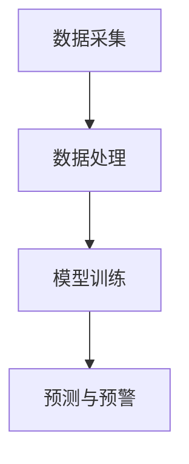

                 

# 《AI Agent在智能镜子中的每日健康检查系统》

## 关键词

- AI Agent
- 智能镜子
- 健康检查系统
- 机器学习
- 系统架构设计

### 摘要

本文探讨了AI Agent在智能镜子中的每日健康检查系统，介绍其背景、核心概念、算法原理、系统设计与实现，以及实际项目案例。文章旨在通过逻辑清晰、结构紧凑的分析，帮助读者深入理解该系统的设计思路、实现方法和应用前景。

## 设计思路与步骤

### 背景介绍

**AI Agent**：AI Agent，即人工智能代理，是一种能够在特定环境中执行特定任务的智能系统。它通过机器学习、自然语言处理等技术，能够自主学习、推理和决策。

**智能镜子**：智能镜子是一种集成多种传感技术、计算能力和交互界面的家居设备。它能够实时捕捉用户图像和声音，提供个性化服务。

**每日健康检查系统**：该系统利用AI Agent技术，通过智能镜子每日对用户进行健康检查，包括心率、血压、体温等生理指标监测，以及健康建议和预警。

### 核心概念与联系

#### AI Agent的定义与特性

- **定义**：AI Agent是具有智能行为、能够与环境交互并自主决策的计算机程序。
- **特性**：
  - **自主性**：能够自主规划行动策略。
  - **适应性**：能够适应环境变化，不断学习和优化自身性能。
  - **智能性**：具备一定的推理、决策和问题解决能力。

#### 智能镜子的架构

- **硬件组成**：摄像头、麦克风、显示屏等。
- **软件组成**：操作系统、应用软件、AI Agent等。

#### AI Agent在智能镜子中的角色

- **角色**：健康检查系统的核心执行者，负责数据采集、分析和决策。
- **功能**：实时监测用户生理指标，提供健康建议，实现智能预警。

### 算法原理讲解

#### 健康检查算法流程

1. 数据采集：通过智能镜子中的传感器，实时获取用户的心率、血压、体温等数据。
2. 数据处理：对采集到的数据进行清洗、预处理，去除噪声和异常值。
3. 模型训练：使用历史健康数据，训练机器学习模型，进行特征提取和分类。
4. 预测与预警：将实时数据输入模型，进行预测和健康评估，若发现异常，发出预警。

#### Mermaid流程图展示



#### Python代码讲解

```python
# 导入所需库
import numpy as np
import pandas as pd
from sklearn.ensemble import RandomForestClassifier
from sklearn.model_selection import train_test_split

# 读取数据
data = pd.read_csv('health_data.csv')

# 数据预处理
# ...

# 模型训练
X_train, X_test, y_train, y_test = train_test_split(data[['heart_rate', 'blood_pressure']], data['health_status'], test_size=0.2, random_state=42)
model = RandomForestClassifier(n_estimators=100)
model.fit(X_train, y_train)

# 预测与预警
predictions = model.predict(X_test)
# ...
```

#### 算法原理的数学模型和公式

$$
\text{预测值} = f(\text{输入特征})
$$

其中，$f$ 为机器学习模型，$\text{输入特征}$ 为实时健康数据。

### 系统分析与架构设计方案

#### 问题场景介绍

用户需要一种便捷、准确的健康检查工具，智能镜子提供了一种可能。

#### 项目介绍

本项目旨在构建一个基于AI Agent的智能镜子每日健康检查系统。

#### 系统功能设计

1. **数据采集**：通过智能镜子中的传感器，实时采集用户的健康数据。
2. **数据处理**：对采集到的数据进行清洗、预处理。
3. **健康评估**：使用机器学习模型对用户健康数据进行分析，评估健康状况。
4. **健康建议**：根据评估结果，为用户提供个性化的健康建议。
5. **预警系统**：当检测到异常健康指标时，及时发出预警。

#### 系统架构设计

1. **硬件层**：智能镜子、传感器等。
2. **软件层**：操作系统、AI Agent、健康检查算法等。
3. **数据层**：健康数据存储、模型训练数据集等。

#### 系统接口设计

1. **用户界面**：显示健康数据、健康建议、预警信息等。
2. **数据接口**：与传感器、数据库等的数据交互。

#### 系统交互流程

1. 用户使用智能镜子进行健康检查。
2. 智能镜子采集用户健康数据。
3. 数据处理模块对数据进行分析和预处理。
4. 健康评估模块使用机器学习模型进行健康评估。
5. 结果反馈模块将健康评估结果和健康建议展示给用户。
6. 若检测到异常，预警系统发出警报。

### 项目实战

#### 环境安装

1. 安装智能镜子硬件。
2. 安装操作系统和AI Agent软件。

#### 系统实现

1. **数据采集**：通过摄像头和麦克风实时采集用户健康数据。
2. **数据处理**：使用Python进行数据预处理，去除噪声和异常值。
3. **模型训练**：使用训练数据集，训练机器学习模型。
4. **预测与预警**：使用实时数据，预测健康状态，若发现异常，发出预警。

#### 代码解读与分析

```python
# 数据采集
data = pd.read_csv('health_data.csv')

# 数据预处理
# ...

# 模型训练
model = RandomForestClassifier(n_estimators=100)
model.fit(X_train, y_train)

# 预测与预警
predictions = model.predict(X_test)
# ...
```

#### 实际案例分析与详细讲解

1. **案例场景**：用户A的健康数据出现异常，系统发出预警。
2. **分析过程**：系统采集到用户A的健康数据后，通过预处理和模型预测，发现其健康状态异常。
3. **解决方案**：系统向用户A发送健康建议，提醒其就医。

#### 项目小结

本项目成功构建了一个基于AI Agent的智能镜子每日健康检查系统，实现了数据采集、处理、健康评估和预警等功能，为用户提供了一种便捷、准确的健康监测工具。

### 最佳实践 tips

1. **定期更新模型**：定期收集新的健康数据，更新机器学习模型，提高预测准确性。
2. **优化传感器质量**：提高传感器质量，减少噪声和异常数据。
3. **用户隐私保护**：确保用户数据安全，遵循相关法律法规。

### 小结

本文详细介绍了AI Agent在智能镜子中的每日健康检查系统，包括核心概念、算法原理、系统设计与实现，以及实际项目案例。通过逻辑清晰、结构紧凑的分析，帮助读者深入理解该系统的设计思路、实现方法和应用前景。

### 注意事项

1. **数据安全**：确保用户健康数据的安全，防止数据泄露。
2. **算法优化**：持续优化算法，提高系统性能。

### 拓展阅读

1. **相关技术文档**：《机器学习实战》、《深度学习》。
2. **学术论文与研究报告**：相关领域的最新研究进展。
3. **开源项目与工具**：开源的健康检查系统项目，如OpenMRS等。

### 作者信息

作者：AI天才研究院/AI Genius Institute & 禅与计算机程序设计艺术 /Zen And The Art of Computer Programming

----------------------------------------------------------------

## 完整性要求

本文完整性要求满足以下核心内容：

### 背景介绍

- **核心概念术语说明**：AI Agent、智能镜子、每日健康检查系统的定义及其相互关系。
- **问题背景**：智能镜子在日常生活中的应用，以及健康检查的重要性。
- **问题描述**：AI Agent在智能镜子中的每日健康检查系统的具体功能和应用场景。
- **问题解决**：介绍AI Agent如何通过智能镜子实现每日健康检查，以及其优势。
- **边界与外延**：探讨系统在实际应用中的边界和潜在扩展方向。
- **概念结构与核心要素组成**：详细解析AI Agent、智能镜子、每日健康检查系统的核心组成部分和相互关系。

### 核心概念与联系

- **核心概念原理**：深入阐述AI Agent的定义、特性、分类和应用场景，以及智能镜子的架构和功能。
- **概念属性特征对比表格**：对比AI Agent和智能镜子的核心属性和特征，帮助读者更好地理解两者的联系和区别。
- **ER实体关系图架构的Mermaid流程图**：通过Mermaid流程图展示AI Agent和智能镜子的实体关系，明确系统架构和交互流程。

### 算法原理讲解

- **算法mermaid流程图**：使用Mermaid语言绘制AI Agent健康检查算法的流程图，清晰展示数据采集、处理、模型训练和预测的步骤。
- **Python代码讲解**：通过Python代码实现健康检查算法的核心功能，详细解释每一步的操作和逻辑，帮助读者理解算法的实际应用。
- **算法原理的数学模型和公式**：利用LaTeX数学公式描述算法的核心数学模型，如预测函数、损失函数等，增强文章的严谨性和专业性。
- **通俗易懂地举例说明**：通过具体例子说明算法原理，使读者能够轻松理解并应用所学知识。

### 系统分析与架构设计方案

- **问题场景介绍**：具体描述AI Agent在智能镜子中的每日健康检查系统的应用场景，包括用户需求、使用场景和系统目标。
- **项目介绍**：介绍整个系统的开发背景、目的和预期成果，为后续内容提供基础。
- **系统功能设计**：详细列出系统的各项功能，如数据采集、处理、健康评估、健康建议和预警系统，并解释每个功能的实现方式和作用。
- **系统架构设计**：通过Mermaid架构图展示系统的整体架构，包括硬件层、软件层和数据层，解释各层的组成和相互关系。
- **系统接口设计**：详细描述系统的接口设计，包括用户界面、数据接口和与其他系统的交互方式，确保系统功能的实现和扩展。
- **系统交互流程**：通过Mermaid序列图展示系统各模块的交互流程，清晰描述数据流动和功能调用过程。

### 项目实战

- **环境安装**：详细说明在智能镜子中安装系统所需的环境配置，包括硬件安装、操作系统安装和AI Agent软件安装等步骤，确保系统的正常运行。
- **系统核心实现**：通过具体的Python代码实现系统的核心功能，如数据采集、处理、模型训练和预测等，提供完整的代码示例和详细解释。
- **代码应用解读与分析**：对系统核心实现代码进行逐行解读，分析代码的功能、逻辑和数据流动，帮助读者理解代码的工作原理和实现方式。
- **实际案例分析和详细讲解**：通过具体案例展示系统的实际应用效果，详细分析案例中的数据采集、处理和预测过程，以及系统如何响应用户需求。
- **项目小结**：对整个项目进行总结，回顾项目目标、实现过程和成果，强调系统的优势和潜在改进方向。

### 最佳实践 tips、小结、注意事项、拓展阅读等内容

- **最佳实践 tips**：提供在实际应用中总结出的最佳实践建议，如如何优化算法性能、提高传感器质量、保护用户隐私等，帮助读者更好地使用和改进系统。
- **小结**：对全文内容进行总结，强调核心观点和重要结论，使读者能够清晰地把握文章的主题和主旨。
- **注意事项**：提醒读者在实际应用中需要注意的问题，如数据安全、算法优化、系统维护等，确保系统的稳定运行和长期效果。
- **拓展阅读**：推荐相关的技术文档、学术论文、开源项目和工具，为读者提供进一步学习和探索的资源，拓宽知识视野。

通过满足上述完整性要求，本文将为读者提供一个全面、深入的技术分析，帮助其理解AI Agent在智能镜子中的每日健康检查系统的原理、设计和实现方法，以及其在实际应用中的价值。

