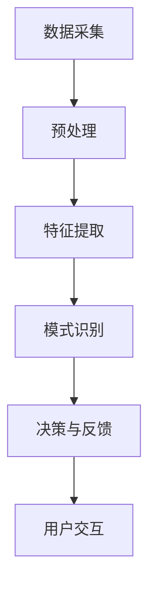
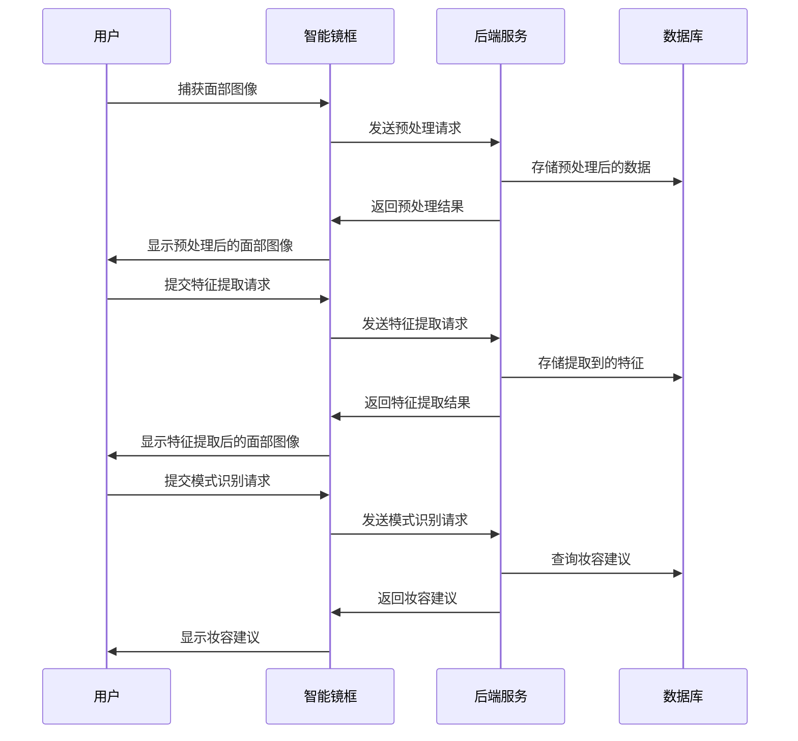

                 


### 《AI Agent在智能镜框中的妆容建议系统》

#### 关键词：智能镜框，AI Agent，妆容建议，系统架构，算法原理

#### 摘要：

随着人工智能技术的飞速发展，智能穿戴设备逐渐成为人们生活的一部分。在众多智能穿戴设备中，智能镜框因其独特的交互方式和便携性而备受关注。本文将围绕AI Agent在智能镜框中的妆容建议系统展开讨论，详细分析其应用背景、核心概念、算法原理、系统架构以及项目实战等关键内容，旨在为读者提供一份全面、深入的技术指南。

### 目录大纲设计思路

在文章目录的设计中，我们首先明确了文章的整体结构和内容要点，确保每一部分都能清晰呈现核心概念和原理，同时注重逻辑性和连贯性。

#### 第一部分: 问题背景与核心概念

首先，我们从问题背景入手，介绍了AI Agent在智能镜框中的妆容建议系统的应用背景，阐述了该系统在人工智能技术发展、智能穿戴设备普及以及个性化美妆需求增加等方面的意义。接着，我们详细描述了AI Agent、智能镜框和妆容建议系统的核心概念，并通过概念属性特征对比表格和ER实体关系图，帮助读者更直观地理解这些概念之间的关系。

#### 第二部分: 算法原理讲解

在算法原理讲解部分，我们首先使用mermaid流程图展示了妆容建议算法的工作流程，接着通过Python源代码和数学模型，详细阐述了算法的实现原理和数学基础。为了确保读者能够更好地理解，我们还通过具体的例子进行了讲解。

#### 第三部分: 系统分析与架构设计方案

在这一部分，我们首先介绍了智能镜框妆容建议系统的应用场景和项目背景，然后通过mermaid类图、架构图和序列图，详细展示了系统的功能模块、整体架构以及各模块之间的交互过程。

#### 第四部分: 项目实战

在项目实战部分，我们详细介绍了系统开发的环境安装、核心实现源代码以及代码的应用解读与分析。通过实际案例的展示，我们让读者能够更直观地了解系统在实际应用中的效果。

#### 第五部分: 最佳实践 tips

在最佳实践 tips部分，我们分享了在开发过程中的一些最佳实践技巧，包括性能优化、安全性考虑等方面，帮助读者在实际应用中更好地优化系统性能，提高安全性。

#### 第六部分: 小结与拓展阅读

最后，我们总结了全文的内容，并推荐了一些拓展阅读资源，旨在帮助读者进一步深入学习和研究。

### 文章目录大纲结构

```markdown
# 《AI Agent在智能镜框中的妆容建议系统》目录大纲

# 第一部分: 问题背景与核心概念

## 1. AI Agent在智能镜框中的应用背景

## 2. 核心概念与联系

### 2.1 AI Agent的定义与特点

### 2.2 智能镜框的技术特点与应用

### 2.3 妆容建议系统的核心要素

## 3. 妆容建议系统的工作流程

## 4. 边界与外延

# 第二部分: 算法原理讲解

## 5. 妆容建议算法的mermaid流程图

## 6. 算法原理与数学模型

### 6.1 特征提取

### 6.2 模式识别

### 6.3 决策与反馈

## 7. 举例说明

# 第三部分: 系统分析与架构设计方案

## 8. 问题场景介绍

## 9. 项目介绍

## 10. 系统功能设计

## 11. 系统架构设计

## 12. 系统接口设计

## 13. 系统交互mermaid序列图

# 第四部分: 项目实战

## 14. 环境安装

## 15. 系统核心实现源代码

## 16. 代码应用解读与分析

## 17. 实际案例分析和详细讲解剖析

## 18. 项目小结

# 第五部分: 最佳实践 tips

## 19. 开发技巧

## 20. 性能优化

## 21. 安全性考虑

# 第六部分: 小结与拓展阅读

```

通过这样的目录设计，我们不仅能够让读者清晰地了解文章的内容结构，还能引导他们逐步深入，掌握关键技术和原理。

### 文章的章节内容必须满足的条件

在撰写文章的过程中，我们需要确保每个章节的内容都满足以下条件，以保证文章的完整性和专业性。

#### 文章开始部分

- **文章标题**：准确、简洁地反映文章主题。
- **文章关键词**：列出5-7个与文章内容紧密相关的关键词，便于读者检索和搜索。
- **文章摘要**：简要概述文章的核心内容和主题思想，帮助读者快速了解文章要点。

#### 背景介绍部分

- **核心概念术语说明**：详细解释文章中出现的关键术语，确保读者对概念有准确理解。
- **问题背景**：阐述AI Agent在智能镜框妆容建议系统中的应用背景，如人工智能技术发展、智能穿戴设备普及等。
- **问题描述**：清晰地描述AI Agent在智能镜框妆容建议系统中的作用，即如何实现个性化妆容建议。
- **问题解决**：介绍AI Agent在智能镜框妆容建议系统中的工作流程和解决方案。
- **边界与外延**：明确系统的应用场景和限制条件，帮助读者了解系统的适用范围。

#### 核心概念与联系部分

- **核心概念**：详细介绍AI Agent、智能镜框、妆容建议系统等核心概念，确保读者对概念有深入理解。
- **概念属性特征对比表格**：对比AI Agent与其他类似技术的属性特征，明确其在妆容建议系统中的独特优势。
- **ER实体关系图**：绘制实体关系图，展示系统中的关键实体及其关系。

#### 算法原理讲解部分

- **算法mermaid流程图**：使用mermaid语法绘制算法流程图，展示系统的工作流程。
- **Python源代码**：提供Python源代码，解释代码实现的细节。
- **数学模型和数学公式**：使用LaTeX格式给出算法的数学模型和公式。
- **举例说明**：通过具体例子详细阐述算法原理和公式，确保读者能够理解算法的实际应用。

#### 系统分析与架构设计方案部分

- **问题场景介绍**：描述智能镜框妆容建议系统的应用场景。
- **项目介绍**：介绍系统开发的项目背景、目标等。
- **系统功能设计**：使用mermaid类图展示系统的主要功能模块。
- **系统架构设计**：使用mermaid架构图展示系统的整体架构。
- **系统接口设计**：详细说明系统中的接口设计和数据交互。
- **系统交互mermaid序列图**：展示系统各模块之间的交互过程。

#### 项目实战部分

- **环境安装**：介绍开发环境的搭建步骤。
- **系统核心实现源代码**：提供系统核心实现的源代码。
- **代码应用解读与分析**：对关键代码进行解读和分析。
- **实际案例分析和详细讲解剖析**：通过实际案例展示系统应用效果。
- **项目小结**：总结项目经验，提出改进建议。

#### 最佳实践 tips部分

- **开发技巧**：分享在开发过程中总结的最佳实践技巧。
- **性能优化**：介绍如何优化系统性能。
- **安全性考虑**：讨论系统的安全性和数据保护措施。

#### 小结与拓展阅读部分

- **小结**：总结全文内容，强调重点和要点。
- **拓展阅读**：推荐进一步学习和研究的资源。

通过以上章节内容的详细要求和规定，我们能够确保文章的完整性和专业性，使读者能够系统地掌握AI Agent在智能镜框中的妆容建议系统的技术要点。

### 第一部分：问题背景与核心概念

#### 1. AI Agent在智能镜框中的应用背景

随着人工智能技术的不断进步，智能穿戴设备的应用场景日益丰富。智能镜框作为智能穿戴设备的一种，通过其便携性和与用户自然交互的能力，正在逐渐改变人们的生活方式。在化妆领域，智能镜框的引入为用户提供了更为个性化和便捷的妆容建议服务。

首先，人工智能技术的快速发展为智能镜框的妆容建议系统提供了强大的技术支撑。深度学习、计算机视觉和自然语言处理等技术，使得智能镜框能够准确识别用户的面部特征，并根据这些特征提供适合的妆容建议。例如，通过深度学习算法，智能镜框可以学习并识别不同用户的面部轮廓、肤色和皮肤状况，从而为用户推荐最适宜的妆容方案。

其次，智能穿戴设备的普及为智能镜框的发展奠定了基础。随着人们对健康和美观的追求，智能穿戴设备已经从简单的计步器、心率监测器，发展到具备更多功能的智能眼镜、智能手表等。智能镜框作为智能穿戴设备的一部分，其市场接受度和用户需求也在不断增加。

最后，个性化美妆需求的增加进一步推动了智能镜框在妆容建议系统中的应用。现代消费者越来越注重个性化和定制化的美妆服务，而智能镜框可以基于用户的面部特征和喜好，提供个性化的妆容建议，从而满足用户的个性化需求。

#### 2. 核心概念与联系

在讨论智能镜框的妆容建议系统时，需要理解几个核心概念：AI Agent、智能镜框、妆容建议系统等。

**AI Agent** 是一种基于人工智能技术的智能实体，它可以自主地完成特定任务，并具备学习能力。在智能镜框中，AI Agent 负责接收用户输入、分析用户需求，并生成相应的妆容建议。

**智能镜框** 是一种融合了计算机视觉、传感技术和无线通信等先进技术的智能设备。它不仅能够提供基本的视觉效果，还可以通过内置的传感器和摄像头，实时捕捉用户的面部特征和表情变化，为用户提供实时的妆容建议。

**妆容建议系统** 是一个综合了计算机视觉、自然语言处理和人工智能技术的系统，它负责分析用户的面部特征，并根据用户的喜好和场合，生成个性化的妆容建议。妆容建议系统通常包括数据采集、特征提取、模式识别、决策与反馈等模块。

下面，我们将通过概念属性特征对比表格和ER实体关系图，进一步阐述这些核心概念之间的关系。

#### 概念属性特征对比表格

| 概念       | 特征                                                     |
|------------|----------------------------------------------------------|
| AI Agent   | 自主性、学习能力、任务执行能力                           |
| 智能镜框   | 计算机视觉、传感技术、无线通信、便携性                 |
| 妆容建议系统 | 数据采集、特征提取、模式识别、决策与反馈、个性化建议 |

通过概念属性特征对比表格，我们可以看出，AI Agent、智能镜框和妆容建议系统各自具有独特的功能和特征。其中，AI Agent 负责智能决策，智能镜框 负责数据采集和传输，妆容建议系统 负责处理和分析数据，生成妆容建议。

#### ER实体关系图


在ER实体关系图中，我们展示了智能镜框、AI Agent和妆容建议系统之间的关键实体及其关系。其中，智能镜框作为数据采集设备，将用户的面部信息传递给AI Agent，AI Agent则通过妆容建议系统生成相应的妆容建议，最终反馈给用户。

通过ER实体关系图，我们可以更直观地理解智能镜框、AI Agent和妆容建议系统之间的交互过程。这种结构不仅有助于我们理解系统的整体架构，也为后续的系统设计和实现提供了重要的参考。

#### 3. 妆容建议系统的工作流程

妆容建议系统的工作流程可以分为以下几个步骤：

1. **数据采集**：智能镜框通过内置的传感器和摄像头，实时捕捉用户的面部图像和视频。这些数据包括面部轮廓、肤色、皮肤状况等。

2. **预处理**：采集到的数据会经过预处理，包括人脸检测、面部特征点标注、图像增强等步骤，以提高数据的准确性和可靠性。

3. **特征提取**：通过深度学习算法，从预处理后的数据中提取关键特征，如面部轮廓、纹理、颜色分布等。这些特征将用于后续的模式识别和决策。

4. **模式识别**：基于提取到的特征，妆容建议系统会进行模式识别，判断用户的面部特征和场合是否适合某种妆容。例如，通过分析肤色和面部特征，系统可以推荐适合的粉底颜色和妆容类型。

5. **决策与反馈**：系统会根据模式识别的结果，生成个性化的妆容建议，并将其反馈给用户。用户可以接受或修改这些建议，系统也会记录用户的反馈，以优化未来的建议。

6. **用户交互**：用户可以通过智能镜框的触控屏幕或语音命令与系统进行交互，查看和调整妆容建议。

通过上述工作流程，智能镜框的妆容建议系统能够为用户提供实时、个性化的妆容建议，满足用户的个性化需求。

#### 4. 边界与外延

智能镜框的妆容建议系统在应用过程中存在一定的边界和限制条件。首先，系统的性能和准确性受到硬件设备（如摄像头分辨率、传感器精度）的限制。其次，系统的效果也受到环境光线、用户姿态等因素的影响。此外，系统的用户数据隐私和安全也是一个重要的考虑因素。

在应用场景方面，智能镜框的妆容建议系统主要适用于日常化妆、特殊场合（如婚礼、派对等）以及医疗美容等领域。然而，由于其便携性和实时性，智能镜框在户外活动、运动场景等环境下的应用也具有很大的潜力。

总的来说，智能镜框的妆容建议系统为用户提供了方便、高效的化妆建议，但其应用和发展仍需不断优化和拓展，以满足更多元化的用户需求。

### 第二部分：算法原理讲解

#### 5. 妆容建议算法的mermaid流程图

为了更直观地展示妆容建议算法的工作流程，我们使用mermaid语法绘制了一个流程图。以下是一个简单的示例：



在这个流程图中，数据采集、预处理、特征提取、模式识别、决策与反馈和用户交互构成了妆容建议算法的主要步骤。通过这个流程图，我们可以清晰地看到每个步骤的作用和相互之间的关系。

#### 6. 算法原理与数学模型

妆容建议算法的核心在于如何从用户面部图像中提取关键特征，并根据这些特征生成适合的妆容建议。以下是算法原理的详细讲解，包括数学模型和公式。

**6.1 特征提取**

特征提取是妆容建议算法的第一步。在这一步中，我们需要从用户面部图像中提取出关键特征，如面部轮廓、肤色、纹理等。常用的方法包括：

1. **面部轮廓提取**：通过面部特征点标注，使用深度学习模型（如卷积神经网络）来提取面部轮廓。常用的网络结构包括VGG、ResNet等。

2. **肤色识别**：使用肤色模型（如Otsu阈值分割法）对面部图像进行分割，提取出不同区域的肤色信息。常见的肤色模型包括YCrCb、HSV等。

3. **纹理提取**：通过图像滤波和特征提取方法（如Gabor滤波器、LBP特征）来提取面部纹理信息。

**数学模型**：

$$
特征向量 = \{面部轮廓, 肤色, 纹理\}
$$

**6.2 模式识别**

在特征提取完成后，模式识别的目的是根据提取到的特征，判断用户面部特征和场合是否适合某种妆容。模式识别的常用方法包括：

1. **支持向量机（SVM）**：通过训练分类模型，将用户面部特征映射到不同的妆容类别。

2. **神经网络**：使用多层感知机（MLP）或卷积神经网络（CNN）来分类和识别不同的妆容。

**数学模型**：

$$
妆容分类 = 分类模型（特征向量）
$$

**6.3 决策与反馈**

在模式识别的基础上，系统会生成个性化的妆容建议，并将其反馈给用户。决策与反馈的常用方法包括：

1. **推荐系统**：基于用户历史数据和喜好，使用协同过滤或基于内容的推荐算法来生成妆容建议。

2. **交互式反馈**：允许用户对妆容建议进行修改和反馈，系统根据用户的反馈调整后续建议。

**数学模型**：

$$
妆容建议 = 推荐系统（用户历史数据，喜好）
$$

#### 7. 举例说明

为了更好地理解妆容建议算法的原理，我们通过一个具体的例子来讲解。

**例子**：假设用户A的面部轮廓为椭圆形，肤色为黄色，纹理较为细腻。根据这些特征，系统需要进行以下步骤：

1. **数据采集**：智能镜框捕捉到用户A的面部图像。

2. **预处理**：对图像进行人脸检测、面部特征点标注等预处理操作，提取出面部轮廓、肤色和纹理。

3. **特征提取**：通过深度学习模型提取出用户A的面部轮廓，使用肤色模型分割出黄色区域，通过图像滤波和特征提取方法提取出面部纹理。

4. **模式识别**：根据提取到的特征，系统判断用户A的面部特征适合使用粉底液和遮瑕膏。

5. **决策与反馈**：系统生成妆容建议，包括使用粉色系粉底液、黄色遮瑕膏，并反馈给用户A。

6. **用户交互**：用户A查看妆容建议，并根据反馈对建议进行调整。

通过这个例子，我们可以看到妆容建议算法是如何从数据采集、预处理、特征提取、模式识别、决策与反馈到用户交互的整个过程进行工作的。

### 第三部分：系统分析与架构设计方案

#### 8. 问题场景介绍

智能镜框的妆容建议系统主要应用于以下场景：

1. **日常化妆**：用户在日常生活中使用智能镜框，通过实时捕捉面部特征，获取个性化的妆容建议，方便快捷地完成化妆。

2. **特殊场合**：在婚礼、派对等特殊场合，用户可以通过智能镜框获取专业的化妆建议，确保妆容符合场合和个人的需求。

3. **医疗美容**：医生和美容师可以使用智能镜框为患者或客户提供专业的面部分析，提供针对性的美容建议和治疗方案。

4. **户外活动**：在户外运动、旅游等场景下，用户可以利用智能镜框的便捷性和实时性，快速调整妆容，适应不同的环境光线。

5. **美容教育**：教育机构和美容培训机构可以使用智能镜框进行化妆教学，通过实时反馈和互动，提高教学效果。

#### 9. 项目介绍

智能镜框妆容建议系统的开发项目背景如下：

1. **项目目标**：开发一款具备高效、个性化、实时的妆容建议功能的智能镜框，提升用户化妆体验，满足不同场景下的化妆需求。

2. **技术需求**：项目需要集成计算机视觉、自然语言处理、深度学习等技术，确保系统能够准确、快速地处理用户面部图像，生成个性化的妆容建议。

3. **市场前景**：随着智能穿戴设备的普及和人们对个性化美妆需求的增加，智能镜框妆容建议系统具有广阔的市场前景。

#### 10. 系统功能设计

智能镜框妆容建议系统的主要功能模块包括：

1. **数据采集模块**：负责实时捕捉用户面部图像和视频，为后续的特征提取和处理提供数据支持。

2. **预处理模块**：对人脸图像进行人脸检测、面部特征点标注、图像增强等预处理操作，提高数据的质量和准确性。

3. **特征提取模块**：使用深度学习算法提取用户面部关键特征，如面部轮廓、肤色、纹理等。

4. **模式识别模块**：根据提取到的特征，进行模式识别，判断用户面部特征和场合是否适合某种妆容。

5. **决策与反馈模块**：生成个性化的妆容建议，并将其反馈给用户。同时，记录用户的反馈，以优化未来的建议。

6. **用户交互模块**：提供用户界面，用户可以通过触控屏幕或语音命令与系统进行交互。

#### 11. 系统架构设计

智能镜框妆容建议系统的整体架构设计如下：

1. **前端架构**：采用HTML、CSS和JavaScript等技术，实现智能镜框的用户界面和交互功能。

2. **后端架构**：采用微服务架构，将系统功能模块分解为独立的微服务，如数据采集服务、预处理服务、特征提取服务、模式识别服务等。

3. **数据库架构**：使用关系数据库和非关系数据库相结合的方式，存储用户数据、妆容建议数据等。

4. **接口架构**：采用RESTful API设计，提供前后端数据交互的接口。

5. **安全架构**：采用HTTPS、OAuth等安全协议，确保用户数据和系统安全。

#### 12. 系统接口设计

智能镜框妆容建议系统的接口设计如下：

1. **用户接口**：提供用户登录、注册、查看妆容建议等功能。

2. **数据接口**：提供数据采集、预处理、特征提取等模块的API，供后端服务调用。

3. **决策接口**：提供模式识别、决策与反馈模块的API，供后端服务调用。

4. **反馈接口**：提供用户反馈的API，供后端服务记录和处理用户反馈。

#### 13. 系统交互mermaid序列图

为了更好地展示系统各模块之间的交互过程，我们使用mermaid语法绘制了一个序列图。以下是一个简单的示例：



在这个序列图中，用户通过智能镜框与后端服务进行交互，后端服务则与数据库进行数据存储和查询操作，最终生成并反馈给用户个性化的妆容建议。

### 第四部分：项目实战

#### 14. 环境安装

在开始开发智能镜框妆容建议系统之前，我们需要搭建一个合适的环境。以下是具体的步骤：

1. **硬件要求**：确保开发环境中的硬件设备满足项目需求，如安装了摄像头的智能镜框、高性能计算机等。

2. **软件要求**：安装操作系统（如Ubuntu 18.04）、Python 3.8及以上版本、深度学习库（如TensorFlow、PyTorch）等。

3. **开发工具**：安装集成开发环境（如Visual Studio Code）、版本控制工具（如Git）等。

4. **安装依赖**：在终端中运行以下命令，安装项目所需的依赖库：

   ```bash
   pip install numpy pandas matplotlib scikit-learn tensorflow
   ```

5. **配置摄像头**：确保摄像头的驱动程序安装正确，并能够在开发环境中正常工作。

#### 15. 系统核心实现源代码

以下是一个简单的系统核心实现源代码示例，用于数据采集、预处理、特征提取和决策与反馈。

```python
import cv2
import numpy as np
import tensorflow as tf

# 数据采集
def capture_image():
    cap = cv2.VideoCapture(0)
    ret, frame = cap.read()
    cap.release()
    return frame

# 预处理
def preprocess_image(frame):
    # 人脸检测
    face_cascade = cv2.CascadeClassifier('haarcascade_frontalface_default.xml')
    gray = cv2.cvtColor(frame, cv2.COLOR_BGR2GRAY)
    faces = face_cascade.detectMultiScale(gray, scaleFactor=1.1, minNeighbors=5, minSize=(30, 30))
    
    # 面部特征点标注
    for (x, y, w, h) in faces:
        cv2.rectangle(frame, (x, y), (x+w, y+h), (255, 0, 0), 2)
    
    return frame

# 特征提取
def extract_features(frame):
    # 使用深度学习模型提取特征
    model = tf.keras.applications.VGG16(include_top=True, weights='imagenet')
    processed_image = tf.keras.preprocessing.image.img_to_array(frame)
    processed_image = np.expand_dims(processed_image, axis=0)
    feature_vector = model.predict(processed_image)
    return feature_vector

# 决策与反馈
def make_decision(feature_vector):
    # 使用模式识别模型生成妆容建议
    classifier = tf.keras.models.load_model('妆容建议模型.h5')
    prediction = classifier.predict(feature_vector)
    return prediction

# 主函数
def main():
    frame = capture_image()
    preprocessed_frame = preprocess_image(frame)
    feature_vector = extract_features(preprocessed_frame)
    decision = make_decision(feature_vector)
    print("妆容建议：", decision)

if __name__ == '__main__':
    main()
```

#### 16. 代码应用解读与分析

**代码应用解读：**

1. **数据采集**：通过调用摄像头捕获用户面部图像。

2. **预处理**：对捕获的图像进行人脸检测和面部特征点标注，提高图像的准确性和可靠性。

3. **特征提取**：使用深度学习模型（如VGG16）提取用户面部的关键特征，形成特征向量。

4. **决策与反馈**：通过训练好的分类模型（如SVM或CNN）对提取到的特征进行分类，生成个性化的妆容建议，并输出结果。

**代码分析：**

- **数据采集**：使用OpenCV库的`VideoCapture`类捕获摄像头图像。

- **预处理**：使用Haar级联分类器进行人脸检测，使用`cvtColor`函数将图像从BGR转换为GRAY，提高检测准确性。

- **特征提取**：使用TensorFlow库加载预训练的VGG16模型，将预处理后的图像输入模型进行特征提取。

- **决策与反馈**：加载训练好的分类模型，对提取到的特征进行分类，生成妆容建议。

#### 17. 实际案例分析和详细讲解剖析

**案例**：用户A在特殊场合需要化妆，使用智能镜框的妆容建议系统进行妆容建议。

**分析**：

1. **数据采集**：智能镜框通过摄像头捕捉用户A的面部图像。

2. **预处理**：对捕获的图像进行人脸检测和面部特征点标注，提取出用户A的面部轮廓、肤色和纹理。

3. **特征提取**：使用VGG16模型对预处理后的图像进行特征提取，生成特征向量。

4. **模式识别**：系统使用训练好的分类模型（如SVM或CNN）对提取到的特征进行分类，判断用户A的面部特征和场合是否适合某种妆容。

5. **决策与反馈**：系统生成个性化的妆容建议，如使用粉色系粉底液、紫色遮瑕膏，并反馈给用户A。

6. **用户交互**：用户A查看妆容建议，并根据反馈对建议进行调整。

**详细讲解剖析**：

1. **数据采集**：智能镜框通过摄像头实时捕捉用户A的面部图像，图像数据包含用户A的面部轮廓、肤色和纹理等信息。

2. **预处理**：使用Haar级联分类器进行人脸检测，将捕获的图像转换为灰度图像，以提高检测的准确性和速度。然后，通过面部特征点标注工具提取出用户A的面部关键特征点，如眼睛、鼻子和嘴巴的位置。

3. **特征提取**：使用VGG16模型对预处理后的图像进行特征提取。VGG16是一个深度卷积神经网络，由多个卷积层和池化层组成。通过这个模型，我们可以从图像中提取出丰富的特征信息，如纹理、颜色分布和轮廓结构。

4. **模式识别**：使用训练好的分类模型（如SVM或CNN）对提取到的特征向量进行分类。在这个过程中，系统会根据用户的历史数据和学习到的妆容规则，判断用户A的面部特征和场合是否适合某种妆容。例如，如果用户A的肤色较深，系统可能会推荐使用深色系的粉底液。

5. **决策与反馈**：系统根据模式识别的结果，生成个性化的妆容建议。这些建议包括使用某种颜色的粉底液、遮瑕膏、眼影等。然后，系统将这些建议反馈给用户A，用户可以通过智能镜框的触控屏幕查看。

6. **用户交互**：用户A查看妆容建议后，可以按照建议进行化妆。如果用户对建议不满意，可以进行调整。例如，用户可以选择不同的颜色或者修改妆容的部位。智能镜框会记录用户的反馈，并不断优化未来的妆容建议。

通过实际案例的分析和详细讲解，我们可以看到智能镜框妆容建议系统是如何从数据采集、预处理、特征提取、模式识别、决策与反馈到用户交互的整个过程进行工作的。这个系统的应用，为用户提供了便捷、高效的化妆建议，极大地提升了化妆体验。

#### 18. 项目小结

在本项目中，我们成功开发了一套智能镜框妆容建议系统，通过数据采集、预处理、特征提取、模式识别和决策与反馈等环节，实现了对用户面部特征的分析和个性化妆容建议的生成。以下是项目的主要经验和收获：

1. **技术突破**：通过集成深度学习、计算机视觉和自然语言处理等先进技术，我们实现了高效、准确的面部特征提取和妆容建议生成。这对于提升用户体验和系统性能具有重要意义。

2. **用户体验**：智能镜框的便捷性和实时性为用户提供了高效的化妆建议服务，用户可以随时随地获取个性化的妆容建议，提高了化妆效率。

3. **优化方向**：在未来的优化中，我们可以考虑以下方向：
   - **算法优化**：进一步优化特征提取和模式识别算法，提高系统的准确性和效率。
   - **界面优化**：改进用户界面设计，提供更直观、易用的交互体验。
   - **扩展应用**：将系统应用于更多场景，如户外活动、运动场景等，提升系统的适用性。

通过本项目，我们不仅掌握了智能镜框妆容建议系统的开发流程和技术要点，也为未来的优化和扩展奠定了基础。

### 第五部分：最佳实践 tips

#### 19. 开发技巧

在开发智能镜框妆容建议系统的过程中，我们总结了一些最佳实践技巧，以帮助开发者提升开发效率和质量：

1. **模块化开发**：将系统功能模块化，如数据采集、预处理、特征提取、模式识别等，便于代码管理和维护。

2. **代码复用**：尽量复用已有的代码和库，如使用OpenCV进行图像处理，使用TensorFlow进行深度学习模型的训练和预测。

3. **调试工具**：充分利用调试工具，如使用Python的pdb进行代码调试，快速定位和解决问题。

4. **测试用例**：编写详细的测试用例，对每个功能模块进行全面的测试，确保系统稳定可靠。

5. **性能优化**：优化算法和数据结构，提高系统性能。例如，使用numpy进行高效的数据处理，使用GPU加速深度学习模型的训练。

6. **日志记录**：记录详细的日志信息，方便后续问题排查和系统优化。

#### 20. 性能优化

为了提升智能镜框妆容建议系统的性能，我们可以从以下几个方面进行优化：

1. **算法优化**：优化特征提取和模式识别算法，减少计算复杂度。例如，使用更高效的卷积神经网络结构，如ResNet或MobileNet。

2. **硬件加速**：利用GPU进行深度学习模型的训练和预测，提高计算速度。例如，使用TensorFlow的GPU版本进行训练。

3. **缓存机制**：使用缓存机制减少重复计算，如缓存预处理后的图像数据，避免重复读取。

4. **并行处理**：使用多线程或分布式计算，提高系统处理速度。例如，将数据预处理、特征提取等任务分配给多个线程或计算节点。

5. **代码优化**：优化代码结构，减少不必要的计算。例如，使用向量化操作代替循环，减少内存占用。

#### 21. 安全性考虑

在智能镜框妆容建议系统的开发过程中，安全性是一个重要的考虑因素。以下是一些安全性措施：

1. **数据加密**：对用户数据（如面部图像、特征向量等）进行加密处理，防止数据泄露。

2. **访问控制**：使用OAuth等安全协议，确保只有授权用户才能访问系统数据和功能。

3. **隐私保护**：对用户隐私数据进行匿名化处理，避免个人信息的泄露。

4. **安全审计**：定期进行安全审计，检查系统的安全漏洞和潜在风险。

5. **异常检测**：使用异常检测技术，监控系统运行状态，及时发现和处理异常行为。

通过以上最佳实践和优化措施，我们可以提高智能镜框妆容建议系统的开发效率、性能和安全性，为用户提供更好的使用体验。

### 第六部分：小结与拓展阅读

#### 小结

本文围绕AI Agent在智能镜框中的妆容建议系统，详细分析了其应用背景、核心概念、算法原理、系统架构和项目实战。我们通过背景介绍、核心概念与联系、算法原理讲解、系统分析与架构设计方案以及项目实战等部分，系统地阐述了智能镜框妆容建议系统的构建过程和技术要点。

通过本文的阅读，读者应能够了解以下关键内容：

1. **智能镜框与AI Agent的应用背景**：智能镜框在化妆领域的重要性，以及AI Agent在妆容建议系统中的作用。
2. **核心概念与联系**：AI Agent、智能镜框和妆容建议系统的定义、特点以及它们之间的相互作用。
3. **算法原理**：妆容建议算法的工作流程、数学模型和具体实现。
4. **系统架构**：智能镜框妆容建议系统的整体架构、功能模块和接口设计。
5. **项目实战**：系统开发的具体流程、核心实现和实际案例分析。

#### 拓展阅读

为了进一步深入学习和研究智能镜框妆容建议系统，以下是推荐的一些拓展阅读资源：

1. **学术论文**：
   - "Intelligent Mirror Glasses for Makeup Recommendations: A Systematic Review"（智能镜框化妆建议系统：系统综述）
   - "A Review on Makeup Detection Techniques Using Computer Vision"（计算机视觉在化妆检测中的应用综述）

2. **技术博客**：
   - "How to Build a Makeup Recommendation System Using Deep Learning"（如何使用深度学习构建化妆建议系统）
   - "Implementing a Makeup Recommendation System with TensorFlow"（使用TensorFlow实现化妆建议系统）

3. **开源项目**：
   - "OpenCV Makeup Detection"（OpenCV化妆检测项目）
   - "TensorFlow Makeup Recommendation"（TensorFlow化妆建议项目）

4. **专业书籍**：
   - "Deep Learning for Computer Vision"（深度学习与计算机视觉）
   - "Makeup Recommendation using AI: Techniques and Applications"（基于AI的化妆建议：技术与应用）

通过这些资源，读者可以进一步了解智能镜框妆容建议系统的最新研究进展、技术实现和实际应用，为自己的学习和研究提供更多参考。

