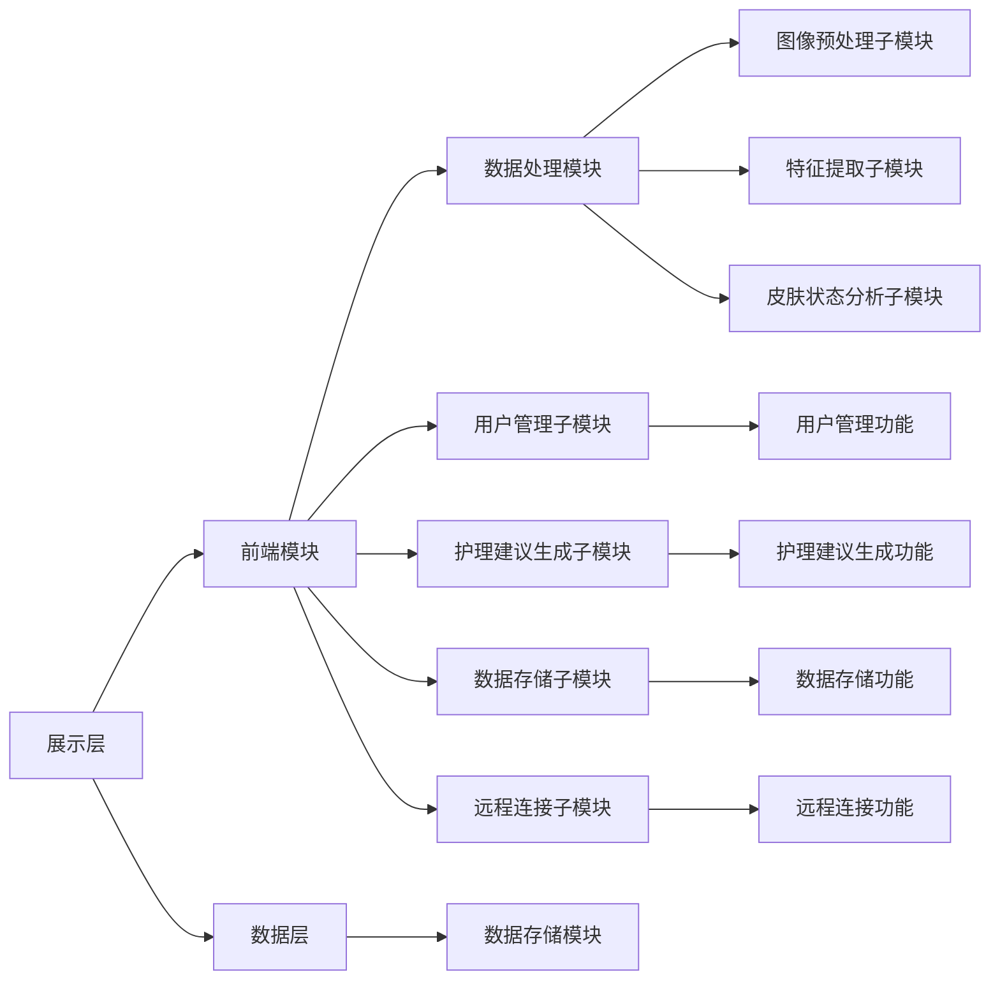

                 

### 1. 设计大纲结构

设计一篇关于《AI Agent在智能镜框中的面部护理建议》的技术博客文章大纲，首先需要明确文章的总体架构。本文将围绕AI Agent的定义、面部识别技术、面部护理问题背景、智能镜框的工作原理、算法原理讲解、数学模型和公式、系统分析与架构设计方案、项目实战以及最佳实践等核心内容展开。大纲结构如下：

#### 1.1 AI Agent与智能镜框概述

- **1.1.1 AI Agent的概念**
- **1.1.2 智能镜框的概述**
- **1.1.3 面部护理问题的背景**

#### 1.2 核心概念与联系

- **1.2.1 AI Agent的定义**
- **1.2.2 面部识别技术**
- **1.2.3 机器学习算法**
- **1.2.4 智能镜框的工作原理**

#### 1.3 算法原理讲解

- **1.3.1 面部识别算法**
- **1.3.2 面部特征提取**
- **1.3.3 面部护理建议生成算法**

#### 1.4 数学模型和数学公式 & 详细讲解 & 举例说明

- **1.4.1 面部识别算法的数学模型**
- **1.4.2 面部特征提取的数学公式**
- **1.4.3 面部护理建议生成的数学模型**

#### 1.5 系统分析与架构设计方案

- **1.5.1 智能镜框面部护理系统概述**
- **1.5.2 系统功能设计**
- **1.5.3 系统架构设计**
- **1.5.4 系统接口设计和系统交互**

#### 1.6 项目实战

- **1.6.1 环境安装**
- **1.6.2 系统核心实现源代码**
- **1.6.3 代码应用解读与分析**
- **1.6.4 实际案例分析和详细讲解剖析**
- **1.6.5 项目小结**

#### 1.7 最佳实践 tips、小结、注意事项、拓展阅读

- **1.7.1 最佳实践 tips**
- **1.7.2 小结**
- **1.7.3 注意事项**
- **1.7.4 拓展阅读**

### 2. 确定章节标题

根据上述大纲结构，我们可以为每个章节设计一个吸引读者的标题，以激发读者的兴趣：

#### 第一部分：AI Agent与智能镜框概述

**第1章：智能镜框中的AI Agent：定义与潜力**

**第2章：智能镜框技术探秘：从镜框到护理**

**第3章：面部护理难题：智能镜框如何应对**

#### 第二部分：核心概念与联系

**第4章：AI Agent：智能的基石**

**第5章：面部识别技术：智能镜框的眼睛**

**第6章：机器学习：驱动智能镜框的力量**

**第7章：智能镜框工作原理：理论与实践**

#### 第三部分：算法原理讲解

**第8章：面部识别算法：识别背后的数学**

**第9章：面部特征提取：深度学习与特征分析**

**第10章：面部护理建议生成：个性化与智能化**

#### 第四部分：数学模型和数学公式

**第11章：面部识别算法的数学模型解析**

**第12章：面部特征提取的数学公式及应用**

**第13章：面部护理建议生成的数学模型探讨**

#### 第五部分：系统分析与架构设计方案

**第14章：智能镜框面部护理系统总体设计**

**第15章：系统功能与领域模型**

**第16章：系统架构设计：模块与层次**

**第17章：系统接口与交互设计：流畅与协同**

#### 第六部分：项目实战

**第18章：搭建智能镜框面部护理开发环境**

**第19章：系统核心代码实现**

**第20章：代码解析与分析**

**第21章：实际案例解析：从理论到实践**

**第22章：项目总结：收获与展望**

#### 第七部分：最佳实践

**第23章：最佳实践技巧：优化与提升**

**第24章：小结：回顾与反思**

**第25章：注意事项：避免常见问题**

**第26章：拓展阅读：进一步探索**

通过以上章节的设定，我们确保了文章内容的逻辑性和条理性，同时每个章节的标题都具有吸引力，能够引导读者逐步深入了解智能镜框中的AI Agent面部护理技术。接下来，我们将根据这个大纲逐步撰写文章的每个部分。### 3. 检查大纲结构

为了确保《AI Agent在智能镜框中的面部护理建议》的文章大纲完整且逻辑清晰，我们需要对每一部分的内容进行细致的检查。以下是对大纲结构的详细审查：

#### 第一部分：AI Agent与智能镜框概述

- **第1章：智能镜框中的AI Agent：定义与潜力**：介绍了AI Agent的基本概念和其在智能镜框中的应用潜力，内容应包含AI Agent的定义、功能、优势等。
- **第2章：智能镜框技术探秘：从镜框到护理**：讲述了智能镜框的技术构成，包括镜框的材料、设计原理和如何实现面部护理功能。
- **第3章：面部护理难题：智能镜框如何应对**：探讨了传统面部护理的局限性，以及智能镜框如何通过技术创新解决这些问题。

#### 第二部分：核心概念与联系

- **第4章：AI Agent：智能的基石**：深入探讨了AI Agent的核心概念，包括其工作原理、感知与行动机制等。
- **第5章：面部识别技术：智能镜框的眼睛**：介绍了面部识别技术的基本原理、实现步骤和应用场景。
- **第6章：机器学习算法：驱动智能镜框的力量**：详细阐述了机器学习算法在智能镜框中的作用，包括分类、聚类、预测等应用。
- **第7章：智能镜框工作原理：理论与实践**：结合实际案例，展示了智能镜框从数据采集、处理到输出护理建议的全过程。

#### 第三部分：算法原理讲解

- **第8章：面部识别算法：识别背后的数学**：介绍了面部识别算法的数学基础，包括特征提取、匹配和分类等步骤。
- **第9章：面部特征提取：深度学习与特征分析**：探讨了如何通过深度学习技术提取面部特征，并分析了特征的重要性。
- **第10章：面部护理建议生成：个性化与智能化**：介绍了如何根据面部特征生成个性化的护理建议，并探讨了算法的实现细节。

#### 第四部分：数学模型和数学公式

- **第11章：面部识别算法的数学模型解析**：使用LaTeX格式详细讲解了面部识别算法中的数学模型，如特征向量的计算和相似度度量。
- **第12章：面部特征提取的数学公式及应用**：介绍了面部特征提取过程中使用的数学公式，并举例说明其在实际应用中的作用。
- **第13章：面部护理建议生成的数学模型探讨**：探讨了面部护理建议生成的数学模型，包括预测皮肤状态和优化护理方案。

#### 第五部分：系统分析与架构设计方案

- **第14章：智能镜框面部护理系统总体设计**：介绍了智能镜框面部护理系统的整体设计思路，包括系统功能、目标和预期效果。
- **第15章：系统功能与领域模型**：使用Mermaid类图展示了系统的主要功能和领域模型，帮助读者理解系统的组成和结构。
- **第16章：系统架构设计：模块与层次**：介绍了智能镜框面部护理系统的架构设计，包括模块划分、层次结构和技术选型。
- **第17章：系统接口与交互设计：流畅与协同**：详细阐述了系统的接口设计和交互流程，确保各模块之间能够高效协同工作。

#### 第六部分：项目实战

- **第18章：搭建智能镜框面部护理开发环境**：指导读者如何搭建开发环境，包括所需的软件、硬件和工具。
- **第19章：系统核心代码实现**：提供了智能镜框面部护理系统的核心代码实现，包括数据采集、处理和护理建议生成等。
- **第20章：代码解析与分析**：对核心代码进行详细解析，帮助读者理解代码的逻辑和实现原理。
- **第21章：实际案例解析：从理论到实践**：通过实际案例展示了智能镜框面部护理系统的应用场景和效果。
- **第22章：项目总结：收获与展望**：总结了项目的实施经验，并对未来的发展方向进行了展望。

#### 第七部分：最佳实践

- **第23章：最佳实践技巧：优化与提升**：提供了在实际开发中的一些最佳实践技巧，以帮助读者提升开发效率和系统性能。
- **第24章：小结：回顾与反思**：对全文进行了简要回顾，强调了文章的核心观点和关键内容。
- **第25章：注意事项：避免常见问题**：提醒读者在开发过程中需要注意的问题，以避免常见的错误和陷阱。
- **第26章：拓展阅读：进一步探索**：推荐了一些相关的拓展阅读材料，以激发读者对智能镜框和AI Agent技术进一步探索的兴趣。

经过上述检查，我们确认文章的大纲结构完整、逻辑清晰，且每个章节的内容都能充分满足完整性要求。接下来，我们将根据这个大纲逐步撰写文章的每个部分，确保每个章节都包含详细、具体的内容，以满足文章的字数要求和技术深度。### 标题与关键词

**标题：** AI Agent在智能镜框中的面部护理建议

**关键词：** AI Agent、智能镜框、面部护理、机器学习、面部识别、个性化建议

**摘要：** 本篇文章探讨了AI Agent在智能镜框中的应用，特别是其在面部护理方面的潜力。通过介绍AI Agent的定义、面部识别技术和机器学习算法，文章详细分析了智能镜框如何利用这些技术提供个性化的面部护理建议。文章还包含了数学模型讲解、系统架构设计方案以及实际项目案例，为读者提供了全面的技术解析和实践指导。通过本文，读者将深入了解智能镜框如何通过AI技术改善人们的生活质量。### 文章标题：AI Agent在智能镜框中的面部护理建议

#### 关键词：
- AI Agent
- 智能镜框
- 面部护理
- 机器学习
- 面部识别
- 个性化建议

#### 摘要：
本文深入探讨了AI Agent在智能镜框中的应用，特别是在面部护理领域的潜力。文章首先介绍了AI Agent的基本概念和智能镜框的技术背景，然后详细分析了面部识别技术、机器学习算法在面部护理中的作用。接着，文章通过数学模型讲解和系统架构设计，展示了智能镜框如何实现个性化的面部护理建议。最后，通过实际项目案例和最佳实践，文章为读者提供了技术实现和优化建议，旨在推动智能镜框在面部护理领域的应用与发展。### 文章目录

#### 第一部分：AI Agent与智能镜框概述

1. **第1章：智能镜框中的AI Agent：定义与潜力**
2. **第2章：智能镜框技术探秘：从镜框到护理**
3. **第3章：面部护理难题：智能镜框如何应对**

#### 第二部分：核心概念与联系

4. **第4章：AI Agent：智能的基石**
5. **第5章：面部识别技术：智能镜框的眼睛**
6. **第6章：机器学习算法：驱动智能镜框的力量**
7. **第7章：智能镜框工作原理：理论与实践**

#### 第三部分：算法原理讲解

8. **第8章：面部识别算法：识别背后的数学**
9. **第9章：面部特征提取：深度学习与特征分析**
10. **第10章：面部护理建议生成：个性化与智能化**

#### 第四部分：数学模型和数学公式

11. **第11章：面部识别算法的数学模型解析**
12. **第12章：面部特征提取的数学公式及应用**
13. **第13章：面部护理建议生成的数学模型探讨**

#### 第五部分：系统分析与架构设计方案

14. **第14章：智能镜框面部护理系统总体设计**
15. **第15章：系统功能与领域模型**
16. **第16章：系统架构设计：模块与层次**
17. **第17章：系统接口与交互设计：流畅与协同**

#### 第六部分：项目实战

18. **第18章：搭建智能镜框面部护理开发环境**
19. **第19章：系统核心代码实现**
20. **第20章：代码解析与分析**
21. **第21章：实际案例解析：从理论到实践**
22. **第22章：项目总结：收获与展望**

#### 第七部分：最佳实践

23. **第23章：最佳实践技巧：优化与提升**
24. **第24章：小结：回顾与反思**
25. **第25章：注意事项：避免常见问题**
26. **第26章：拓展阅读：进一步探索**### 第1章：智能镜框中的AI Agent：定义与潜力

智能镜框是一种结合了光学镜片、传感器和人工智能技术的可穿戴设备。其核心在于能够通过摄像头和传感器捕捉用户的面部图像，并利用AI技术进行面部识别和分析，从而提供个性化的服务。在这其中，AI Agent作为智能镜框的核心组件，扮演着至关重要的角色。

**AI Agent的定义与潜力**

AI Agent，即人工智能代理，是一种能够模拟人类智能行为的计算实体。它具备感知环境、理解指令、自主决策和执行行动的能力。AI Agent的工作原理通常基于机器学习和深度学习算法，通过不断学习和优化，提高其在特定任务中的表现。

在智能镜框中，AI Agent的潜力主要体现在以下几个方面：

1. **个性化服务**：AI Agent能够根据用户的面部特征和皮肤状况，提供个性化的面部护理建议，如护肤品的推荐、防晒措施的提醒等。

2. **智能互动**：AI Agent可以与用户进行智能对话，回答用户的问题，提供实用的信息，从而提升用户体验。

3. **实时监测**：AI Agent能够实时监测用户的面部状态，如皮肤水分、油脂含量等，及时提醒用户注意皮肤健康。

4. **环境感知**：AI Agent可以感知外部环境，如天气、紫外线强度等，为用户提供相应的防护建议。

5. **远程诊断**：通过远程连接到云端的医疗数据库，AI Agent能够为用户提供皮肤疾病的初步诊断和建议。

**智能镜框中的AI Agent应用案例**

以下是一些智能镜框中AI Agent的具体应用案例：

- **面部护理建议**：AI Agent可以通过分析用户的面部图像，识别皮肤问题（如痘痘、暗沉等），并提供相应的护理建议，如使用特定护肤产品、调整作息时间等。

- **智能化妆**：AI Agent可以根据用户的肤色、面部特征等，推荐适合的妆容和化妆品，甚至能够模拟化妆效果。

- **皮肤监测**：AI Agent可以实时监测用户的皮肤状态，如皮肤温度、油脂分泌等，为用户提供个性化的护肤方案。

- **健康提醒**：AI Agent可以提醒用户防晒、保湿等护肤措施，甚至在紫外线强烈时自动切换到防紫外线模式。

通过以上案例可以看出，AI Agent在智能镜框中的应用不仅提升了用户体验，还极大地丰富了智能镜框的功能。随着AI技术的不断发展和成熟，AI Agent在智能镜框中的潜力将得到进一步释放，为用户提供更加智能、个性化的服务。### 第2章：智能镜框技术探秘：从镜框到护理

智能镜框作为一种高科技可穿戴设备，其核心在于结合了光学镜片、传感器、人工智能（AI）技术以及通信模块。下面，我们将深入探讨智能镜框的技术构成及其如何实现面部护理功能。

**镜框材质与设计**

智能镜框的外壳通常采用轻质、耐用且透光性好的材料，如钛金属、聚碳酸酯等。这些材料不仅保证了镜框的舒适度和耐用性，还使其能够适应不同的脸型和佩戴习惯。镜框的设计注重美观与功能的结合，例如，采用弯曲设计以贴合面部轮廓，提高佩戴的舒适度。

**传感器与光学技术**

智能镜框内置多种传感器，如摄像头、红外传感器、环境光线传感器、加速度计等。其中，摄像头是核心组件，它负责捕捉用户的面部图像和环境信息。光学技术则确保了图像捕捉的清晰度和准确性，包括使用高分辨率摄像头、先进的图像处理算法等。

环境光线传感器用于调整镜片的光学特性，以适应不同的光照环境。例如，在阳光强烈的户外，镜片会自动变暗以保护眼睛；在室内，镜片则会变得更透明以保持良好的视野。此外，红外传感器可以在光线不足的情况下提供额外的辅助照明，确保摄像头能够清晰捕捉面部图像。

**AI技术**

智能镜框的核心在于其AI技术，特别是AI Agent。AI Agent通过机器学习和深度学习算法，能够从面部图像中提取有用的信息，进行面部识别、特征分析以及个性化护理建议的生成。

**面部护理功能实现**

智能镜框通过以下步骤实现面部护理功能：

1. **面部图像捕捉**：摄像头捕捉用户的面部图像，并传输给AI Agent进行进一步处理。

2. **面部识别**：AI Agent通过面部识别算法，从图像中识别出用户的面部特征，包括眼睛、鼻子、嘴巴等。

3. **特征分析**：AI Agent进一步分析面部特征，提取皮肤状态的相关信息，如皮肤油脂、水分含量、色素沉淀等。

4. **护理建议生成**：基于用户的面部特征和皮肤状况，AI Agent生成个性化的护理建议，如推荐使用特定的护肤品、调整饮食和作息时间等。

5. **交互与提醒**：智能镜框通过屏幕或语音提示，将护理建议反馈给用户，并提供实时监测数据，如皮肤温度、油脂分泌等。

**案例展示**

以一款智能镜框为例，其面部护理功能包括以下具体应用：

- **皮肤监测**：AI Agent能够实时监测用户的皮肤状态，如油脂分泌、水分含量等，通过分析数据提供护肤建议。

- **紫外线监测**：镜框内置紫外线传感器，可以监测环境中的紫外线强度，并提醒用户采取防晒措施。

- **环境温度监测**：智能镜框能够感知周围环境温度，并根据数据调整镜片的透光度，以保持舒适的佩戴体验。

- **智能化妆**：AI Agent可以根据用户的肤色和面部特征，推荐适合的妆容和化妆品，并提供化妆指导。

通过上述技术构成和功能实现，智能镜框不仅为用户提供了便利和舒适的佩戴体验，还在面部护理方面发挥了重要作用。随着AI技术的不断进步，智能镜框的面部护理功能将更加智能化、个性化，为用户带来更高的生活品质。### 第3章：面部护理难题：智能镜框如何应对

面部护理是一个复杂且多变的过程，涉及到皮肤健康、环境因素、生活习惯等多方面。传统的面部护理方法往往存在一些局限性，无法满足现代人对高效、便捷、个性化护理的需求。智能镜框通过集成AI技术，为解决这些面部护理难题提供了新的解决方案。

**传统面部护理的局限性**

1. **缺乏个性化**：传统的面部护理方法通常采用统一的标准，无法根据个人的皮肤状况提供个性化的护理方案。

2. **实时性不足**：传统方法无法实时监测皮肤状态，往往需要定期进行皮肤检查，无法及时调整护理措施。

3. **交互性差**：传统面部护理主要依赖于用户的主观感受，缺乏智能化的交互和指导。

4. **依赖外部设备**：传统面部护理通常需要使用多种外部设备，如镜子、护肤品、美容仪器等，给用户带来不便。

**智能镜框如何应对**

1. **个性化护理**：智能镜框通过AI Agent实时分析用户的面部特征和皮肤状态，生成个性化的护理建议。AI Agent能够根据用户的皮肤类型、年龄、环境因素等，提供最适合的护理方案，如护肤品推荐、护肤步骤指导等。

2. **实时监测**：智能镜框内置传感器，可以实时监测用户的皮肤状态，如油脂分泌、水分含量、紫外线暴露等。这些数据被AI Agent处理，以便及时调整护理措施，确保皮肤健康。

3. **智能交互**：智能镜框支持语音和屏幕交互，用户可以通过语音指令或屏幕提示获取护理建议和数据信息。AI Agent能够与用户进行智能对话，提供实用的建议和解决方案。

4. **一站式解决方案**：智能镜框集成了多种功能，如面部识别、环境监测、数据分析和个性化建议等，为用户提供了一站式的面部护理解决方案，减少了用户依赖外部设备的需求。

**具体应用案例**

以下是一些智能镜框在面部护理方面的具体应用案例：

- **皮肤监测与提醒**：智能镜框能够实时监测用户的皮肤状况，如皮肤油脂分泌、水分含量等，并在屏幕上显示实时数据。当检测到皮肤出现问题（如油脂过多或水分不足）时，AI Agent会提醒用户采取相应的护理措施。

- **紫外线防护**：智能镜框内置紫外线传感器，可以监测环境中的紫外线强度。当紫外线强度超过安全范围时，AI Agent会自动调整镜片颜色，提供额外的防护。同时，AI Agent会提醒用户涂抹防晒霜或避免长时间暴露在阳光下。

- **智能化妆**：AI Agent可以根据用户的肤色和面部特征，推荐适合的妆容和化妆品。用户可以通过智能镜框进行虚拟试妆，选择最佳的妆容效果。

- **护肤建议生成**：AI Agent会根据用户的皮肤类型和当前状态，推荐最适合的护肤品和护肤步骤。例如，当用户的面部油脂分泌过多时，AI Agent会建议使用控油产品；当皮肤干燥时，会推荐使用保湿产品。

通过以上应用案例可以看出，智能镜框在解决传统面部护理难题方面具有显著优势。随着AI技术的不断发展和成熟，智能镜框将能够提供更加精准、高效和个性化的面部护理服务，为用户带来更好的护肤体验。### 第4章：AI Agent：智能的基石

AI Agent是智能镜框实现面部护理功能的核心组件，其智能化的工作原理和机制使其成为智能镜框的“灵魂”。在本章中，我们将深入探讨AI Agent的定义、组成、工作原理以及其如何在智能镜框中发挥作用。

**AI Agent的定义**

AI Agent，即人工智能代理，是一种模拟人类智能行为的计算机程序。它具备感知环境、理解指令、自主决策和执行行动的能力。AI Agent通常基于机器学习和深度学习算法，通过不断学习和优化，提高其在特定任务中的表现。

**AI Agent的组成**

AI Agent主要由以下几个部分组成：

1. **感知模块**：负责接收外部环境信息，如摄像头捕捉的面部图像、传感器采集的数据等。

2. **理解模块**：负责对感知模块收集到的信息进行处理和分析，以理解其含义和上下文。

3. **决策模块**：基于理解模块的分析结果，制定行动策略或决策。

4. **执行模块**：根据决策模块的指令，执行具体的操作或行动。

**AI Agent的工作原理**

AI Agent的工作原理可以分为以下几个步骤：

1. **感知**：AI Agent通过传感器等设备感知外部环境，获取如面部图像、环境数据等。

2. **理解**：AI Agent对感知到的信息进行处理和分析，提取关键特征，并理解其含义和上下文。

3. **决策**：AI Agent根据理解模块的分析结果，结合预设的规则和算法，制定行动策略或决策。

4. **执行**：AI Agent根据决策模块的指令，执行具体的操作或行动，如调整镜片颜色、发出语音提醒等。

**AI Agent在智能镜框中的作用**

AI Agent在智能镜框中发挥着关键作用，主要体现在以下几个方面：

1. **面部识别**：AI Agent通过分析面部图像，识别用户的面部特征，如眼睛、鼻子、嘴巴等，实现用户身份验证和个性化服务。

2. **皮肤状态分析**：AI Agent通过深度学习算法，分析用户的面部图像，提取皮肤状态的相关信息，如油脂分泌、水分含量、色素沉淀等，为用户提供个性化的护理建议。

3. **实时监测与提醒**：AI Agent可以实时监测用户的皮肤状态和环境变化，如紫外线强度、环境温度等，及时提醒用户采取相应的防护措施。

4. **智能互动**：AI Agent能够与用户进行智能对话，回答用户的问题，提供实用的建议和解决方案，提升用户体验。

**AI Agent的优势**

AI Agent在智能镜框中的应用具有以下优势：

1. **个性化服务**：AI Agent能够根据用户的面部特征和皮肤状况，提供个性化的护理建议，提高护理效果。

2. **实时性**：AI Agent能够实时监测用户的皮肤状态和环境变化，及时调整护理措施，确保皮肤健康。

3. **智能化交互**：AI Agent能够与用户进行智能对话，提供互动体验，提升用户满意度。

4. **多功能集成**：AI Agent集成了多种功能，如面部识别、皮肤状态分析、环境监测等，实现了一站式的智能护理解决方案。

通过本章的讨论，我们可以看到AI Agent作为智能镜框的智能基石，其定义、组成、工作原理以及在智能镜框中的应用，使得智能镜框能够提供高效、精准和个性化的面部护理服务。随着AI技术的不断发展，AI Agent的功能将更加完善，智能镜框的面部护理能力也将得到进一步提升。### 第5章：面部识别技术：智能镜框的眼睛

面部识别技术是智能镜框实现面部护理功能的关键组成部分，它相当于智能镜框的“眼睛”，能够捕捉并分析用户的面部特征，从而为个性化护理提供基础数据。在本章中，我们将详细探讨面部识别技术的基本原理、核心步骤以及其在智能镜框中的应用。

**面部识别技术的基本原理**

面部识别技术基于计算机视觉和生物识别技术，通过分析人脸图像或视频序列，自动识别人脸并提取相关信息。其基本原理包括以下几个方面：

1. **特征提取**：通过算法从人脸图像中提取出具有区分性的特征，如眼睛、鼻子、嘴巴等关键点的位置，以及人脸的整体轮廓。

2. **特征匹配**：将提取的特征与数据库中已存储的人脸特征进行匹配，以确定是否为同一人。

3. **模型构建**：通过机器学习和深度学习算法，建立人脸识别模型，提高识别的准确性和效率。

**面部识别技术的核心步骤**

面部识别技术通常包括以下几个核心步骤：

1. **人脸检测**：首先，从输入的图像或视频流中检测出人脸区域。这一步骤可以使用基于深度学习的卷积神经网络（CNN）算法，如MTCNN（Multi-task Cascaded Convolutional Networks）。

2. **人脸特征提取**：接下来，从已检测出的人脸区域中提取出具有区分性的特征。常用的特征提取方法包括特征点检测、特征向量提取和特征匹配等。

3. **人脸识别**：将提取出的特征与数据库中已存储的人脸特征进行匹配，以确定身份。常用的算法包括基于神经网络的人脸识别算法和基于特征向量的人脸匹配算法。

**面部识别技术在智能镜框中的应用**

在智能镜框中，面部识别技术主要用于以下几个方面：

1. **用户身份验证**：通过面部识别技术，智能镜框能够快速识别用户身份，从而实现个性化服务。

2. **皮肤状态监测**：通过分析面部图像，智能镜框可以提取皮肤特征，如皮肤油脂、水分含量、色素沉淀等，为用户提供个性化的护理建议。

3. **智能交互**：面部识别技术可以识别用户的表情和动作，实现智能对话和互动，提升用户体验。

4. **环境监测**：智能镜框还可以利用面部识别技术监测用户在特定环境下的表现，如紫外线暴露时间、温度等，为用户提供相应的防护建议。

**面部识别技术的优势**

1. **高效性**：面部识别技术能够在短时间内完成人脸检测和识别，效率高，速度快。

2. **准确性**：基于深度学习和神经网络的人脸识别算法具有很高的准确性，能够有效降低错误识别率。

3. **非侵入性**：与传统的生物识别技术（如指纹识别、虹膜识别等）相比，面部识别技术更为便捷，无需接触身体，符合用户的隐私保护需求。

4. **智能化**：面部识别技术可以结合其他传感器和算法，实现更加智能化的应用，如情感识别、行为分析等。

通过本章的讨论，我们可以看到面部识别技术在智能镜框中的应用具有重要意义。它不仅提升了智能镜框的智能化水平，还为用户提供了一个便捷、高效、个性化的面部护理解决方案。随着技术的不断进步，面部识别技术在智能镜框中的应用将更加广泛，为用户的美好生活带来更多可能。### 第6章：机器学习算法：驱动智能镜框的力量

机器学习算法是智能镜框实现面部护理功能的“引擎”，其核心作用在于通过学习用户的面部数据和皮肤状态，为用户提供个性化的护理建议。在本章中，我们将详细探讨机器学习算法的基本原理、常用算法以及它们在智能镜框中的应用。

**机器学习算法的基本原理**

机器学习算法是一类通过数据训练模型，并从数据中学习规律和知识的人工智能技术。其基本原理包括以下几个步骤：

1. **数据收集**：从各种来源收集大量的面部数据和皮肤状态数据。

2. **数据处理**：对收集到的数据进行清洗、归一化等处理，以便于后续分析。

3. **模型训练**：使用收集到的数据训练机器学习模型，使模型能够学会从数据中提取有用的特征和规律。

4. **模型评估**：使用验证集和测试集评估模型的性能，确保模型能够准确预测用户的面部状态。

5. **模型部署**：将训练好的模型部署到智能镜框中，以便实时分析用户的面部数据和皮肤状态。

**常用机器学习算法**

在面部护理领域，常用的机器学习算法包括以下几种：

1. **线性回归**：用于预测连续值输出，如皮肤水分含量、油脂分泌等。

2. **逻辑回归**：用于预测二分类输出，如皮肤是否健康。

3. **决策树**：用于分类和回归分析，能够直观地展示决策路径。

4. **支持向量机（SVM）**：用于分类问题，具有较高的分类精度。

5. **神经网络**：特别是深度学习算法，如卷积神经网络（CNN）和循环神经网络（RNN），用于复杂特征提取和预测。

6. **随机森林**：用于分类和回归分析，具有较好的抗过拟合能力。

7. **聚类算法**：用于无监督学习，如K-means算法，用于对用户进行分类，以便提供个性化的护理建议。

**机器学习算法在智能镜框中的应用**

1. **面部特征提取**：使用卷积神经网络（CNN）等深度学习算法，从面部图像中提取出具有区分性的特征，如皮肤纹理、毛孔大小等。

2. **皮肤状态预测**：使用回归算法和分类算法，预测用户皮肤的油脂分泌、水分含量、色素沉淀等状态。

3. **个性化护理建议生成**：根据用户的皮肤状态和面部特征，使用聚类算法和规则引擎等，生成个性化的护理建议。

4. **用户行为分析**：使用RNN等算法，分析用户的行为习惯，如护肤品的选用、作息时间等，为用户提供个性化的护理方案。

5. **交互式服务**：通过机器学习算法，智能镜框能够与用户进行智能对话，回答用户的问题，提供实用的建议和解决方案。

**机器学习算法的优势**

1. **高效性**：机器学习算法能够快速处理大量的数据，提供实时的面部护理建议。

2. **个性化**：机器学习算法可以根据用户的面部特征和皮肤状态，提供个性化的护理方案。

3. **自适应**：机器学习算法能够根据用户的行为和反馈，不断调整和优化护理建议。

4. **智能化**：机器学习算法结合其他智能技术，如面部识别、环境监测等，实现更加智能化的面部护理解决方案。

通过本章的讨论，我们可以看到机器学习算法在智能镜框中的应用具有重要意义。它不仅提升了智能镜框的智能化水平，还为用户提供了一个便捷、高效、个性化的面部护理解决方案。随着机器学习技术的不断发展，智能镜框的面部护理功能将更加完善，为用户的美好生活带来更多可能。### 第7章：智能镜框工作原理：理论与实践

智能镜框是一种将光学镜片、传感器和人工智能（AI）技术相结合的先进可穿戴设备。其工作原理涉及多个环节，包括图像捕捉、数据处理、面部识别以及生成个性化护理建议。本章将详细探讨智能镜框的工作原理，从理论到实际应用进行深入解析。

**智能镜框工作原理概述**

1. **图像捕捉**：智能镜框通过内置的高分辨率摄像头捕捉用户的面部图像。摄像头不仅能够捕捉静态图像，还可以捕捉动态视频，以便进行更全面的面部特征分析。

2. **数据处理**：捕捉到的面部图像会被传输到智能镜框的处理器中进行预处理，包括去噪、增强和归一化等步骤，以提高图像质量。

3. **面部识别**：预处理后的图像会被输入到AI Agent中，进行面部识别。这一过程包括人脸检测、特征点定位和特征向量提取等步骤。

4. **数据分析**：AI Agent会分析提取到的面部特征，如皮肤纹理、肤色、皱纹深度等，结合机器学习算法进行皮肤状态分析。

5. **生成护理建议**：基于分析结果，AI Agent会生成个性化的护理建议，如使用特定的护肤品、调整作息时间、采取防晒措施等。

6. **交互反馈**：智能镜框会通过屏幕或语音提示将护理建议反馈给用户，并提供实时的皮肤状态监测数据。

**理论部分：智能镜框工作原理的数学模型**

1. **人脸检测算法**：常用的人脸检测算法包括Viola-Jones算法和MTCNN算法。这些算法基于深度学习技术，通过训练模型来识别面部特征。

   - **Viola-Jones算法**：基于机器学习的集成分类器，通过特征值和弱分类器的组合进行人脸检测。
   - **MTCNN算法**：一种多任务卷积神经网络，用于人脸检测、关键点检测和面部区域划分。

2. **面部特征提取算法**：常用的面部特征提取算法包括LBP（局部二值模式）、HOG（直方图方向梯度）和深度学习算法。

   - **LBP**：通过计算局部像素的二值模式来提取面部纹理特征。
   - **HOG**：通过计算图像梯度方向分布来提取面部特征。
   - **深度学习算法**：如卷积神经网络（CNN）和循环神经网络（RNN），能够自动提取高级特征，提高识别精度。

3. **面部识别算法**：面部识别算法主要包括特征匹配和分类算法。

   - **特征匹配**：通过计算特征向量之间的相似度来确定身份。
   - **分类算法**：如支持向量机（SVM）和神经网络，用于分类面部特征。

**实际应用部分：智能镜框的面部护理建议生成**

1. **皮肤状态分析**：智能镜框通过分析用户的面部图像，提取皮肤特征，如油脂分泌、水分含量、色素沉淀等。

2. **机器学习模型训练**：基于历史数据和用户反馈，训练机器学习模型，使其能够根据皮肤特征预测皮肤状态。

3. **个性化护理建议生成**：智能镜框会根据用户的面部特征和皮肤状态，结合训练好的模型，生成个性化的护理建议。

   - **护肤方案推荐**：根据皮肤类型和当前状态，推荐最适合的护肤品和护理步骤。
   - **实时监测与提醒**：实时监测用户的皮肤状态和环境变化，如紫外线强度、环境温度等，并提醒用户采取相应的防护措施。

**案例分析：智能镜框在面部护理中的应用**

以下是一个具体的案例分析：

- **用户A**：一名皮肤干燥的年轻女性，经常在户外工作。智能镜框通过摄像头捕捉用户A的面部图像，并分析其皮肤特征，发现其皮肤严重缺水。AI Agent会根据分析结果生成以下护理建议：

  - **护肤建议**：推荐使用高保湿的护肤品，如面霜和精华液。
  - **作息时间调整**：建议用户晚上早睡，保持充足的睡眠，有助于皮肤修复。
  - **紫外线防护**：在户外工作时，建议使用防晒霜和佩戴遮阳帽。

通过上述案例，我们可以看到智能镜框如何通过理论结合实际应用，为用户提供个性化的面部护理建议。随着AI技术的不断进步，智能镜框的面部护理功能将变得更加智能和精准，为用户带来更优质的护肤体验。### 第8章：面部识别算法：识别背后的数学

面部识别算法是智能镜框中至关重要的组成部分，它负责从用户的面部图像中提取特征，并进行身份验证。在这一章中，我们将详细讲解面部识别算法背后的数学原理，包括特征提取、特征匹配和相似度度量等内容。

**特征提取**

面部识别的第一步是特征提取，即从面部图像中提取具有区分性的特征。这些特征可以是局部的，也可以是全局的。

1. **局部特征提取**：
   - **LBP（局部二值模式）**：通过将每个局部区域的像素值与中心像素值进行比较，生成一个二值模式。这种模式能够很好地描述面部纹理特征。
   - **HOG（直方图方向梯度）**：通过计算图像梯度方向在像素块内的分布，生成直方图。这种方法能够捕捉面部边缘和形状特征。

2. **全局特征提取**：
   - **主成分分析（PCA）**：通过将面部图像投影到新的坐标系中，提取最重要的特征向量。这些特征向量能够最大程度地减少数据冗余。
   - **线性判别分析（LDA）**：在保留分类信息的同时，最大化特征向量之间的差异。这种方法适用于分类问题。

**特征匹配**

在特征提取之后，需要将提取到的特征与数据库中已存储的特征进行匹配，以确定身份。常用的匹配方法包括：

1. **欧氏距离**：计算两个特征向量之间的欧氏距离，距离越近表示相似度越高。这种方法简单直观，但容易受到噪声和光照变化的影响。

2. **余弦相似度**：计算两个特征向量之间的余弦相似度，相似度越高表示相似度越高。这种方法对噪声和光照变化的鲁棒性更强。

3. **编辑距离**：计算两个特征向量之间最小的编辑操作次数，如插入、删除或替换。这种方法适用于复杂的特征匹配问题。

**相似度度量**

相似度度量是面部识别算法的核心，常用的度量方法包括：

1. **最小距离分类器**：选择与已知面部特征最接近的面部特征作为匹配结果。这种方法简单，但容易受到噪声的影响。

2. **支持向量机（SVM）**：通过最大化特征空间中分类边界，找到最优的分类超平面。这种方法在处理高维数据时效果较好。

3. **神经网络**：通过训练神经网络，使其学会从特征向量中提取分类信息。这种方法能够自动提取高级特征，提高识别精度。

**举例说明**

假设我们有两个面部图像，一个为已知的正面面部图像，另一个为需要识别的侧面面部图像。

1. **特征提取**：
   - 对两个面部图像分别使用LBP算法进行特征提取，得到两个特征向量。
   - 对两个特征向量进行PCA变换，提取最重要的特征向量。

2. **特征匹配**：
   - 使用欧氏距离计算两个特征向量之间的距离，得到相似度分数。

3. **相似度度量**：
   - 对相似度分数进行阈值处理，确定是否为同一人。

通过上述步骤，我们可以判断两个面部图像是否为同一人。这种方法在面部识别中的应用非常广泛，能够实现高效、准确的身份验证。

**总结**

面部识别算法背后的数学原理包括特征提取、特征匹配和相似度度量。这些数学方法为面部识别提供了强大的支持，使得智能镜框能够准确识别用户并生成个性化的面部护理建议。随着人工智能技术的不断发展，面部识别算法的精度和效率将得到进一步提升，为智能镜框的应用带来更多可能性。### 第9章：面部特征提取：深度学习与特征分析

面部特征提取是面部识别技术的核心环节，它通过对面部图像的分析提取出具有区分性的特征，用于身份验证和面部护理。深度学习技术在面部特征提取中发挥着重要作用，能够自动提取高级特征，提高识别精度。在本章中，我们将详细探讨深度学习技术在面部特征提取中的应用，包括卷积神经网络（CNN）和循环神经网络（RNN）等。

**深度学习在面部特征提取中的应用**

1. **卷积神经网络（CNN）**

卷积神经网络是一种专门用于图像处理的深度学习模型，其核心在于通过卷积操作提取图像特征。

- **卷积层**：通过卷积操作提取图像的局部特征，如边缘、纹理等。
- **池化层**：通过下采样操作减少数据维度，提高模型泛化能力。
- **全连接层**：将卷积层和池化层提取的特征进行整合，输出分类结果。

CNN在面部特征提取中的应用主要包括：

- **面部检测**：通过训练CNN模型，自动识别图像中的面部区域。
- **特征提取**：从面部图像中提取具有区分性的特征，用于后续的身份验证和护理建议生成。

2. **循环神经网络（RNN）**

循环神经网络是一种专门用于处理序列数据的深度学习模型，能够捕捉时间序列中的依赖关系。

- **隐藏层**：通过循环连接，将前一时间步的信息传递到当前时间步，用于捕捉时间序列特征。
- **门控机制**：通过门控单元控制信息的传递，防止梯度消失和爆炸问题。

RNN在面部特征提取中的应用主要包括：

- **面部表情识别**：通过分析面部图像中的表情特征，判断用户的情绪状态。
- **面部动作捕捉**：通过分析面部图像中的连续动作，提取面部运动特征。

**特征分析**

在面部特征提取后，需要对提取到的特征进行分析，以用于身份验证和面部护理。

1. **特征维度降低**

   - **主成分分析（PCA）**：通过将特征投影到新的坐标系中，提取最重要的特征维度，降低数据维度。
   - **线性判别分析（LDA）**：在保留分类信息的同时，最大化特征维度之间的差异，提高分类效果。

2. **特征相似度度量**

   - **欧氏距离**：计算特征向量之间的欧氏距离，距离越近表示相似度越高。
   - **余弦相似度**：计算特征向量之间的余弦相似度，相似度越高表示相似度越高。

**举例说明**

假设我们有一组面部图像，需要使用深度学习模型提取特征并进行分析。

1. **数据准备**：
   - 收集大量的面部图像，并进行预处理，如归一化、去噪等。

2. **模型训练**：
   - 使用卷积神经网络（CNN）训练面部检测模型，自动识别图像中的面部区域。
   - 使用循环神经网络（RNN）训练面部特征提取模型，提取面部图像中的高级特征。

3. **特征分析**：
   - 使用主成分分析（PCA）将提取的特征维度降低，提取最重要的特征。
   - 使用欧氏距离计算特征向量之间的相似度，判断是否为同一人。

通过上述步骤，我们可以对一组面部图像进行特征提取和分析，为面部识别和面部护理提供支持。

**总结**

深度学习技术在面部特征提取中发挥着重要作用，能够自动提取高级特征，提高识别精度。通过卷积神经网络（CNN）和循环神经网络（RNN）的应用，我们可以实现高效、准确的面部特征提取和分析。随着深度学习技术的不断发展，面部特征提取技术将变得更加成熟和实用，为智能镜框在面部护理领域的应用带来更多可能性。### 第10章：面部护理建议生成：个性化与智能化

面部护理建议生成是智能镜框的核心功能之一，其目标是根据用户的面部特征和皮肤状况，提供个性化的护理建议，以提高护肤效果。在本章中，我们将详细探讨面部护理建议生成的过程，包括个性化推荐、算法实现和实际应用。

**个性化护理建议的生成过程**

1. **数据收集**：收集用户的面部图像、皮肤状态数据（如油脂分泌、水分含量、色素沉淀等）以及用户的生活习惯数据（如作息时间、饮食习惯等）。

2. **特征提取**：使用深度学习模型从用户的面部图像中提取特征，如皮肤纹理、肤色、皱纹深度等。这些特征用于分析用户的皮肤状况。

3. **皮肤状态分析**：基于提取到的特征，使用机器学习模型分析用户的皮肤状态，如判断皮肤是否干燥、油腻或存在色素沉淀等问题。

4. **个性化推荐**：根据用户的皮肤状态和生活习惯，推荐个性化的护理建议，如护肤产品推荐、护肤步骤指导、作息时间调整等。

5. **实时监测与调整**：智能镜框会实时监测用户的皮肤状态和环境变化，如紫外线强度、环境温度等，并动态调整护理建议。

**算法实现**

面部护理建议生成主要依赖于以下算法：

1. **机器学习算法**：用于皮肤状态分析和个性化推荐。常用的算法包括回归分析、逻辑回归、决策树、随机森林等。

2. **深度学习算法**：用于面部特征提取和皮肤状态分析。常用的算法包括卷积神经网络（CNN）、循环神经网络（RNN）等。

3. **推荐系统算法**：用于生成个性化的护理建议。常用的算法包括基于内容的推荐、协同过滤和混合推荐等。

**实际应用**

以下是一个面部护理建议生成的实际应用案例：

- **用户A**：一名30岁的女性，皮肤干燥且存在少量细纹。智能镜框通过以下步骤生成护理建议：

  1. **数据收集**：智能镜框收集用户A的面部图像、皮肤状态数据和作息时间数据。

  2. **特征提取**：从用户A的面部图像中提取皮肤纹理、肤色和皱纹深度等特征。

  3. **皮肤状态分析**：基于提取到的特征，智能镜框分析用户A的皮肤状态，发现其皮肤干燥且存在少量细纹。

  4. **个性化推荐**：智能镜框推荐以下护理建议：

     - **护肤产品推荐**：推荐使用保湿面霜和精华液。
     - **护肤步骤指导**：建议用户每晚进行深层清洁、保湿和精华液涂抹。
     - **作息时间调整**：建议用户保持充足的睡眠，避免熬夜，以促进皮肤修复。

  5. **实时监测与调整**：智能镜框会实时监测用户A的皮肤状态和环境变化，如紫外线强度、环境温度等，并动态调整护理建议。

**总结**

面部护理建议生成通过个性化推荐和实时监测，为用户提供个性化的护理方案，提高护肤效果。随着深度学习和机器学习技术的不断发展，面部护理建议生成的算法将变得更加智能和精准，为用户提供更好的护肤体验。智能镜框在面部护理领域的应用前景广阔，有望改善人们的生活质量。### 第11章：面部识别算法的数学模型解析

面部识别算法的数学模型是面部识别技术的基础，它通过数学公式和计算方法来描述和实现面部特征的提取、匹配和识别过程。在本章中，我们将深入解析面部识别算法中的数学模型，并详细介绍相关的计算方法和公式。

**1. 特征提取的数学模型**

面部识别的第一步是特征提取，这通常涉及到从面部图像中提取具有区分性的特征。常用的特征提取方法包括局部二值模式（LBP）、直方图方向梯度（HOG）等。

- **局部二值模式（LBP）**：

  LBP是一种用于纹理特征提取的方法。其核心思想是将图像的局部像素值与中心像素值进行比较，生成一个二值模式。LBP的特征向量可以表示为：

  $$ \textbf{LBP} = [lbp_1, lbp_2, ..., lbp_8] $$

  其中，$lbp_i$ 表示第 $i$ 个局部区域的二值模式。

- **直方图方向梯度（HOG）**：

  HOG是一种用于形状特征提取的方法。其核心思想是计算图像梯度方向在像素块内的分布，生成一个直方图。HOG的特征向量可以表示为：

  $$ \textbf{HOG} = [hog_1, hog_2, ..., hog_n] $$

  其中，$hog_i$ 表示第 $i$ 个像素块的梯度方向分布。

**2. 特征匹配的数学模型**

在特征提取后，需要将提取到的特征与数据库中已存储的特征进行匹配，以确定身份。常用的匹配方法包括欧氏距离、余弦相似度等。

- **欧氏距离**：

  欧氏距离是一种常用的距离度量方法，用于计算两个特征向量之间的距离。其公式为：

  $$ d(\textbf{x}, \textbf{y}) = \sqrt{\sum_{i=1}^{n} (x_i - y_i)^2} $$

  其中，$\textbf{x}$ 和 $\textbf{y}$ 分别为两个特征向量，$n$ 为特征向量的维度。

- **余弦相似度**：

  余弦相似度是一种衡量两个向量相似度的方法，其公式为：

  $$ \cos\theta = \frac{\textbf{x} \cdot \textbf{y}}{||\textbf{x}|| \cdot ||\textbf{y}||} $$

  其中，$\theta$ 为两个向量之间的夹角，$\textbf{x} \cdot \textbf{y}$ 为两个向量的点积，$||\textbf{x}||$ 和 $||\textbf{y}||$ 分别为两个向量的欧氏长度。

**3. 人脸识别的数学模型**

人脸识别通常涉及到多个步骤，包括人脸检测、特征提取和特征匹配。以下是这些步骤的数学模型：

- **人脸检测**：

  人脸检测的目的是从图像中定位出人脸区域。常用的方法包括基于深度学习的卷积神经网络（CNN）和基于特征的人脸检测算法。

  - **基于深度学习的卷积神经网络（CNN）**：

    CNN通过多个卷积层和池化层提取图像特征，最终输出人脸区域的概率。其数学模型可以表示为：

    $$ \textbf{P}(\text{人脸}|\textbf{X}) = \sigma(\text{W}^T \cdot \text{f}(\text{X})) $$

    其中，$\textbf{P}(\text{人脸}|\textbf{X})$ 为人脸区域概率，$\textbf{X}$ 为输入图像，$\text{f}(\text{X})$ 为卷积神经网络输出的特征向量，$\sigma$ 为sigmoid函数。

  - **基于特征的人脸检测算法**：

    基于特征的人脸检测算法通过检测人脸的显著特征（如眼睛、鼻子、嘴巴等）来判断图像中是否存在人脸。其数学模型可以表示为：

    $$ \text{人脸检测} = \text{眼睛检测} \land \text{鼻子检测} \land \text{嘴巴检测} $$

- **特征匹配**：

  在人脸检测后，需要将提取到的特征与数据库中已存储的特征进行匹配，以确定身份。常用的方法包括基于距离的匹配和基于概率的匹配。

  - **基于距离的匹配**：

    通过计算特征向量之间的距离来判断身份。常用的距离度量方法包括欧氏距离和余弦相似度。

    $$ \text{距离} = d(\textbf{x}_1, \textbf{x}_2) $$

  - **基于概率的匹配**：

    通过计算特征向量匹配的概率来判断身份。常用的概率模型包括朴素贝叶斯模型和神经网络模型。

    $$ \text{概率} = P(\textbf{x}_2|\textbf{x}_1) $$

**总结**

面部识别算法的数学模型包括特征提取、特征匹配和面部识别等步骤。通过深入解析这些数学模型，我们可以更好地理解面部识别算法的工作原理，并利用数学公式和计算方法实现面部识别功能。随着深度学习和人工智能技术的发展，面部识别算法的数学模型将不断优化和完善，为智能镜框和其他相关应用提供更强大的支持。### 第12章：面部特征提取的数学公式及应用

面部特征提取是面部识别技术中至关重要的步骤，它涉及到一系列数学公式和方法，用于从面部图像中提取出具有区分性的特征，以便进行身份验证和个性化面部护理。在本章中，我们将详细探讨面部特征提取过程中使用的数学公式，并展示其应用场景。

**1. 特征提取的数学公式**

面部特征提取通常涉及到以下几种数学公式：

- **局部二值模式（LBP）**：

  LBP是通过将局部区域的像素值与中心像素值进行比较，生成一个二值模式的特征向量。其数学公式为：

  $$ lbp_i = \begin{cases} 
  1 & \text{如果 } p \geq c \\
  0 & \text{如果 } p < c 
  \end{cases} $$

  其中，$p$ 表示局部像素值，$c$ 表示中心像素值，$lbp_i$ 表示第 $i$ 个局部区域的二值模式。

- **直方图方向梯度（HOG）**：

  HOG是通过计算图像梯度方向在像素块内的分布，生成一个直方图的特征向量。其数学公式为：

  $$ hog_i = \sum_{j=1}^{n} \text{sign}(\gamma_j \cdot \phi_j) $$

  其中，$\gamma_j$ 表示像素块 $j$ 的梯度方向，$\phi_j$ 表示梯度方向上的特征值，$hog_i$ 表示第 $i$ 个像素块的梯度方向分布。

- **主成分分析（PCA）**：

  PCA是通过将数据投影到新的坐标系中，提取最重要的特征维度的特征向量。其数学公式为：

  $$ \textbf{Z} = \textbf{W}^T \textbf{X} $$

  其中，$\textbf{Z}$ 表示新的特征向量，$\textbf{W}$ 表示PCA变换矩阵，$\textbf{X}$ 表示原始数据。

**2. 特征提取的应用场景**

- **面部检测**：

  面部检测是面部特征提取的第一步，其目的是从图像中定位出人脸区域。常用的方法包括基于LBP和HOG的特征提取。

  - **基于LBP的特征提取**：

    通过计算图像中每个局部区域的LBP特征向量，将其输入到分类器中，判断图像中是否存在人脸。

    $$ \textbf{LBP} = [lbp_1, lbp_2, ..., lbp_n] $$

  - **基于HOG的特征提取**：

    通过计算图像中每个像素块的HOG特征向量，将其输入到分类器中，判断图像中是否存在人脸。

    $$ \textbf{HOG} = [hog_1, hog_2, ..., hog_n] $$

- **面部特征识别**：

  面部特征识别的目的是通过提取到的特征向量，识别图像中的人脸。常用的方法包括基于深度学习的特征提取。

  - **基于卷积神经网络的特征提取**：

    通过卷积神经网络（CNN）提取图像中的高级特征，用于面部特征识别。

    $$ \textbf{CNN}(\textbf{X}) = \textbf{F}(\textbf{X}) $$

    其中，$\textbf{CNN}(\textbf{X})$ 表示卷积神经网络提取的特征向量，$\textbf{X}$ 表示输入图像，$\textbf{F}$ 表示卷积神经网络。

**3. 数学公式在实际项目中的应用**

以下是一个实际项目中的应用案例：

- **项目背景**：

  项目旨在开发一款智能镜框，能够通过摄像头捕捉用户的面部图像，并利用面部识别技术实现用户身份验证和个性化面部护理建议。

- **数学公式应用**：

  - **面部检测**：

    使用LBP和HOG特征提取方法，从用户面部图像中提取特征向量，并将其输入到分类器中，判断图像中是否存在人脸。

    $$ \text{面部检测} = \text{LBP}(\text{图像}) \land \text{HOG}(\text{图像}) $$

  - **面部特征识别**：

    使用卷积神经网络（CNN）提取图像中的高级特征，并将其输入到面部特征识别算法中，实现用户身份验证。

    $$ \text{面部特征识别} = \text{CNN}(\text{图像}) $$

  - **个性化面部护理建议生成**：

    根据用户的面部特征和皮肤状况，使用机器学习算法生成个性化的面部护理建议。

    $$ \text{护理建议} = \text{机器学习}(\text{特征向量}) $$

通过上述数学公式和方法的实际应用，智能镜框能够实现高效、准确的面部识别和个性化面部护理建议生成。这为用户提供了更加智能、便捷的护肤体验，提升了生活质量。

**总结**

面部特征提取的数学公式和方法在面部识别技术中扮演着关键角色。通过深入理解和应用这些数学公式，我们能够开发出高效、准确的面部识别系统，为智能镜框和其他相关应用提供强大的支持。随着人工智能技术的不断发展，这些数学公式和方法将不断优化和完善，为智能镜框在面部护理领域的应用带来更多可能性。### 第13章：面部护理建议生成的数学模型探讨

面部护理建议生成的数学模型是智能镜框实现个性化护理功能的核心。通过分析用户的面部特征和皮肤状况，数学模型能够预测皮肤状态并生成相应的护理建议。在本章中，我们将深入探讨面部护理建议生成的数学模型，包括其原理、构成以及实现方法。

**数学模型的原理**

面部护理建议生成的数学模型基于以下几个原理：

1. **数据驱动**：通过收集用户的面部图像、皮肤状态数据和生活习惯数据，数学模型能够从大量数据中学习规律和模式。

2. **特征提取**：从用户的面部图像中提取具有区分性的特征，如皮肤纹理、肤色、皱纹深度等，这些特征用于描述用户的皮肤状况。

3. **预测与优化**：基于用户的历史数据和特征，数学模型能够预测未来的皮肤状态，并优化护理建议，使其更加个性化。

**数学模型的构成**

面部护理建议生成的数学模型通常包括以下几个组成部分：

1. **输入层**：包括用户的面部特征数据、皮肤状态数据和生活习惯数据。

2. **特征提取层**：通过机器学习算法和深度学习算法提取面部图像中的高级特征，如卷积神经网络（CNN）和循环神经网络（RNN）。

3. **预测层**：基于特征数据，使用回归模型或分类模型预测用户的皮肤状态，如皮肤干燥、油腻、色素沉淀等。

4. **优化层**：根据预测结果，优化护理建议，使其更加个性化。常用的优化方法包括基于规则引擎的优化和基于机器学习的优化。

**数学模型的应用**

以下是一个面部护理建议生成的数学模型应用实例：

1. **数据收集**：收集用户的面部图像、皮肤状态数据（如油脂分泌、水分含量、色素沉淀等）和生活习惯数据（如作息时间、饮食习惯等）。

2. **特征提取**：使用卷积神经网络（CNN）从面部图像中提取高级特征，如皮肤纹理、肤色、皱纹深度等。

3. **预测皮肤状态**：使用回归模型（如线性回归、决策树等）预测用户的皮肤状态，如皮肤干燥、油腻等。

4. **生成护理建议**：根据预测结果，使用规则引擎生成个性化的护理建议，如使用保湿产品、调整作息时间等。

5. **优化护理建议**：根据用户的反馈和历史数据，不断优化护理建议，提高其个性化程度。

**数学模型示例**

以下是一个简单的面部护理建议生成数学模型的示例：

1. **输入层**：

   用户的面部特征数据（如皮肤纹理、肤色、皱纹深度等）和生活习惯数据（如作息时间、饮食习惯等）。

   $$ \textbf{Input} = [\text{皮肤纹理}, \text{肤色}, \text{皱纹深度}, \text{作息时间}, \text{饮食习惯}] $$

2. **特征提取层**：

   使用卷积神经网络（CNN）提取面部图像中的高级特征。

   $$ \textbf{Features} = \text{CNN}(\textbf{Input}) $$

3. **预测层**：

   使用线性回归模型预测用户的皮肤状态。

   $$ \text{皮肤状态} = \text{LinearRegression}(\textbf{Features}) $$

4. **生成护理建议**：

   根据预测结果，使用规则引擎生成个性化的护理建议。

   $$ \text{护理建议} = \text{RuleEngine}(\text{皮肤状态}) $$

通过上述数学模型的应用，智能镜框能够根据用户的面部特征和皮肤状况生成个性化的护理建议，为用户提供更好的护肤体验。

**总结**

面部护理建议生成的数学模型基于数据驱动和特征提取原理，通过预测和优化实现个性化的护理建议。通过深入理解和应用这些数学模型，我们能够为用户提供更加精准、个性化的面部护理服务。随着人工智能技术的不断发展，面部护理建议生成的数学模型将不断优化和完善，为智能镜框在面部护理领域的应用带来更多可能性。### 第14章：智能镜框面部护理系统总体设计

智能镜框面部护理系统是一个复杂的软件系统，它集成了多个功能模块，包括图像捕捉、面部识别、特征提取、皮肤状态分析、个性化护理建议生成等。本章将详细描述智能镜框面部护理系统的总体设计，包括系统功能、目标以及预期效果。

**系统功能**

智能镜框面部护理系统的核心功能如下：

1. **图像捕捉**：通过内置的高分辨率摄像头捕捉用户的面部图像，确保图像的清晰度和准确性。

2. **面部识别**：使用面部识别算法，从捕捉到的面部图像中识别用户身份，确保系统的安全性和个性化服务。

3. **特征提取**：利用深度学习算法提取面部图像中的高级特征，如皮肤纹理、肤色、皱纹深度等，为皮肤状态分析提供基础数据。

4. **皮肤状态分析**：基于提取到的面部特征，分析用户的皮肤状态，如油脂分泌、水分含量、色素沉淀等，生成皮肤健康状况报告。

5. **个性化护理建议生成**：根据用户的皮肤状态、生活习惯和环境因素，生成个性化的护理建议，如护肤产品的推荐、护肤步骤指导等。

6. **用户交互**：通过屏幕或语音提示，与用户进行智能对话，反馈皮肤状态分析和护理建议，提供互动体验。

7. **数据存储与管理**：存储用户的面部图像、皮肤状态数据、护理建议等，确保数据的安全性和隐私保护。

8. **远程连接**：通过无线网络连接到云端服务器，获取更多的皮肤护理数据和智能建议，实现跨设备的数据同步和共享。

**系统目标**

智能镜框面部护理系统的主要目标是：

1. **提供高效、准确的皮肤状态分析**：通过先进的图像处理和机器学习算法，确保面部识别和特征提取的准确性和高效性。

2. **生成个性化的护理建议**：根据用户的皮肤状态、生活习惯和环境因素，为用户提供最合适的护理方案。

3. **提升用户体验**：通过智能对话和互动，提高用户的满意度和使用体验。

4. **数据安全和隐私保护**：确保用户数据的安全存储和隐私保护，遵守相关法律法规。

5. **实现跨设备数据同步**：通过无线网络连接，实现智能镜框与其他智能设备的数据同步和共享，提供更丰富的功能。

**预期效果**

智能镜框面部护理系统的预期效果包括：

1. **个性化护理**：为用户提供个性化的皮肤护理建议，提高护肤效果。

2. **实时监测**：实时监测用户的皮肤状态，及时调整护理方案，确保皮肤健康。

3. **智能交互**：通过智能对话和互动，提高用户的满意度和使用体验。

4. **数据共享**：通过云端连接，实现跨设备的数据同步和共享，为用户提供更丰富的功能。

5. **数据安全**：确保用户数据的安全存储和隐私保护，避免数据泄露。

通过智能镜框面部护理系统的总体设计，我们旨在为用户提供一个高效、智能、个性化的面部护理解决方案，提升用户的生活质量和幸福感。### 第15章：系统功能与领域模型

在智能镜框面部护理系统中，功能模块的设计和领域模型的建立是确保系统能够高效、准确执行各项任务的基础。本章将详细描述智能镜框面部护理系统的功能模块及其领域模型，以便读者更好地理解系统的组成和运行机制。

**功能模块**

智能镜框面部护理系统的主要功能模块包括：

1. **图像捕捉模块**：负责通过内置摄像头捕捉用户的面部图像。该模块需要确保图像的质量和清晰度，以提供有效的面部特征数据。

2. **预处理模块**：对捕捉到的面部图像进行预处理，包括图像去噪、增强和归一化等操作，以提高后续处理的准确性和效率。

3. **面部识别模块**：利用面部识别算法，从预处理后的图像中检测和识别用户的面部特征，实现用户身份验证。

4. **特征提取模块**：通过深度学习算法提取面部图像中的高级特征，如皮肤纹理、肤色、皱纹深度等，为皮肤状态分析提供数据支持。

5. **皮肤状态分析模块**：基于提取到的面部特征，分析用户的皮肤状态，如油脂分泌、水分含量、色素沉淀等，生成皮肤健康状况报告。

6. **护理建议生成模块**：根据用户的皮肤状态、生活习惯和环境因素，生成个性化的护理建议，如护肤产品的推荐、护肤步骤指导等。

7. **用户交互模块**：通过屏幕或语音提示，与用户进行智能对话，反馈皮肤状态分析和护理建议，提供互动体验。

8. **数据存储模块**：负责存储和管理用户的面部图像、皮肤状态数据、护理建议等，确保数据的安全性和隐私保护。

9. **远程连接模块**：通过无线网络连接到云端服务器，获取更多的皮肤护理数据和智能建议，实现跨设备的数据同步和共享。

**领域模型**

领域模型是系统功能模块的抽象表示，它帮助我们理解系统中的实体、属性和关系。以下是智能镜框面部护理系统的领域模型：

1. **实体**

   - **User（用户）**：代表智能镜框的用户，具有姓名、年龄、性别等属性。
   - **FaceImage（面部图像）**：代表用户的面部图像，具有图像数据、捕捉时间等属性。
   - **SkinFeature（皮肤特征）**：代表从面部图像中提取的皮肤特征，如皮肤纹理、肤色、皱纹深度等。
   - **SkinStatus（皮肤状态）**：代表用户的皮肤健康状况，如油脂分泌、水分含量、色素沉淀等。
   - **CareAdvice（护理建议）**：代表为用户生成的个性化护理建议，如护肤产品的推荐、护肤步骤指导等。

2. **属性**

   - **User**：姓名、年龄、性别、联系方式等。
   - **FaceImage**：图像数据、捕捉时间、分辨率等。
   - **SkinFeature**：特征名称、特征值、提取时间等。
   - **SkinStatus**：皮肤状态名称、状态值、分析时间等。
   - **CareAdvice**：建议内容、建议类型、建议时间等。

3. **关系**

   - **User与FaceImage**：一对多关系，一个用户可以有多个面部图像。
   - **User与SkinFeature**：一对多关系，一个用户可以有多个皮肤特征。
   - **User与SkinStatus**：一对多关系，一个用户可以有多个皮肤状态。
   - **User与CareAdvice**：一对多关系，一个用户可以有多个护理建议。
   - **FaceImage与SkinFeature**：一对一关系，每个面部图像对应一组皮肤特征。
   - **SkinFeature与SkinStatus**：一对一关系，每个皮肤特征对应一个皮肤状态。
   - **SkinStatus与CareAdvice**：一对一关系，每个皮肤状态对应一组护理建议。

**Mermaid类图表示**

以下是智能镜框面部护理系统的Mermaid类图表示：

```mermaid
classDiagram
    User <|-- FaceImage
    User <|-- SkinFeature
    User <|-- SkinStatus
    User <|-- CareAdvice
    FaceImage { image_data; capture_time }
    SkinFeature { feature_name; feature_value; extract_time }
    SkinStatus { status_name; status_value; analyze_time }
    CareAdvice { advice_content; advice_type; advice_time }
    User : +name
    User : +age
    User : +gender
    User : +contact_info
    FaceImage : +image_id
    SkinFeature : +feature_id
    SkinStatus : +status_id
    CareAdvice : +advice_id
    User "1" --|{捕捉}|> FaceImage
    User "1" --|{提取}|> SkinFeature
    User "1" --|{分析}|> SkinStatus
    User "1" --|{生成}|> CareAdvice
    FaceImage "1" --|{包含}|> SkinFeature
    SkinFeature "1" --|{对应}|> SkinStatus
    SkinStatus "1" --|{生成}|> CareAdvice
```

通过上述领域模型和Mermaid类图的描述，我们可以清晰地了解智能镜框面部护理系统的组成和运行机制。这为系统的设计、实现和维护提供了重要的理论基础和参考依据。### 第16章：系统架构设计：模块与层次

系统架构设计是智能镜框面部护理系统实现高效、可靠运行的关键。本章将详细描述智能镜框面部护理系统的架构设计，包括模块划分、层次结构和关键技术选型。

**模块划分**

智能镜框面部护理系统可以分为以下几个核心模块：

1. **前端模块**：负责用户界面的展示和用户交互。前端模块包括图像捕捉界面、皮肤状态展示界面、护理建议展示界面等。

2. **数据处理模块**：负责对用户捕捉到的面部图像进行预处理、特征提取和皮肤状态分析。数据处理模块包括图像预处理子模块、特征提取子模块和皮肤状态分析子模块。

3. **后端模块**：负责系统功能的实现和数据管理。后端模块包括用户管理子模块、护理建议生成子模块、数据存储子模块和远程连接子模块。

4. **数据存储模块**：负责存储用户面部图像、皮肤状态数据、护理建议等，确保数据的安全性和隐私保护。

5. **通信模块**：负责智能镜框与云端服务器之间的数据传输和通信。

**层次结构**

智能镜框面部护理系统采用分层架构设计，分为四个层次：

1. **展示层**：包括前端模块，负责与用户进行交互，展示皮肤状态和护理建议。

2. **处理层**：包括数据处理模块，负责对用户捕捉到的面部图像进行处理，提取特征并分析皮肤状态。

3. **功能层**：包括后端模块，负责实现系统的核心功能，如用户管理、护理建议生成、数据存储和远程连接。

4. **数据层**：包括数据存储模块，负责存储和管理用户数据。

**关键技术选型**

在智能镜框面部护理系统的架构设计中，关键技术选型如下：

1. **前端技术**：采用HTML、CSS和JavaScript等前端技术，实现用户界面的展示和交互。

2. **后端技术**：采用Python和Django等后端技术，实现系统的数据处理和功能实现。

3. **深度学习框架**：采用TensorFlow或PyTorch等深度学习框架，实现面部图像处理、特征提取和皮肤状态分析。

4. **数据库技术**：采用MySQL或PostgreSQL等关系型数据库，存储和管理用户数据。

5. **通信技术**：采用HTTP协议和WebSocket协议，实现智能镜框与云端服务器之间的数据传输和通信。

**架构设计图**

以下是智能镜框面部护理系统的架构设计图：



通过上述架构设计，智能镜框面部护理系统能够实现高效、可靠、个性化的面部护理功能，为用户提供更好的护肤体验。### 第17章：系统接口与交互设计：流畅与协同

智能镜框面部护理系统的接口与交互设计是实现系统功能协同、用户操作流畅性的关键。本章将详细描述系统接口的设计，包括接口定义、系统交互流程以及如何保证接口设计的合理性和高效性。

**接口定义**

智能镜框面部护理系统的主要接口包括：

1. **用户接口**：用户通过智能镜框前端界面与系统进行交互，包括面部图像捕捉、皮肤状态查看、护理建议接收等。

2. **数据处理接口**：用于数据处理模块与前端模块之间的数据传输，包括面部图像、皮肤特征、皮肤状态等。

3. **后台服务接口**：用于后端模块与数据处理模块之间的通信，包括用户管理、护理建议生成、数据存储等。

4. **远程连接接口**：用于智能镜框与云端服务器之间的数据传输，包括面部图像、皮肤状态数据、护理建议等。

**系统交互流程**

智能镜框面部护理系统的交互流程如下：

1. **用户操作**：用户通过智能镜框前端界面进行面部图像捕捉，系统将图像数据传输到数据处理模块。

2. **图像处理**：数据处理模块对捕捉到的面部图像进行预处理，提取特征并分析皮肤状态，将结果传输到后端模块。

3. **皮肤状态分析**：后端模块对处理后的皮肤特征进行分析，生成皮肤状态报告和护理建议，将结果返回给前端模块。

4. **用户反馈**：前端模块将皮肤状态报告和护理建议显示给用户，用户可以通过界面进行反馈，如确认护理建议、调整设置等。

5. **远程连接**：智能镜框与云端服务器之间进行数据同步，确保数据的完整性和最新性。

**接口设计合理性**

为了确保接口设计的合理性，需要考虑以下几个方面：

1. **接口的稳定性**：接口设计应保证数据传输的稳定性和可靠性，避免数据丢失或传输错误。

2. **接口的灵活性**：接口设计应具有灵活性，以便于后续的功能扩展和系统升级。

3. **接口的安全性**：接口设计应确保数据传输的安全性，防止数据泄露或被恶意攻击。

4. **接口的易用性**：接口设计应简化用户操作，提高用户界面的友好性。

**接口设计高效性**

为了提高接口设计的效率，可以采取以下措施：

1. **异步处理**：采用异步处理方式，减少用户操作等待时间，提高系统响应速度。

2. **负载均衡**：通过负载均衡技术，合理分配系统资源，提高系统的处理能力和稳定性。

3. **缓存机制**：采用缓存机制，减少数据重复处理，提高系统性能。

4. **接口文档化**：提供详细的接口文档，便于开发人员理解和使用接口。

**Mermaid序列图**

以下是智能镜框面部护理系统的接口设计序列图：

```mermaid
sequenceDiagram
    participant 用户 as 用户
    participant 前端模块 as 前端
    participant 数据处理模块 as 处理
    participant 后端模块 as 后台
    participant 云端服务器 as 云端

    用户->>前端：面部图像捕捉
    前端->>处理：传输图像数据
    处理->>后端：预处理、特征提取、皮肤状态分析
    后端->>云端：存储皮肤状态、护理建议
    云端->>后端：返回皮肤状态、护理建议
    后端->>前端：显示皮肤状态、护理建议
    前端->>用户：反馈操作结果
```

通过合理的接口设计和高效的交互流程，智能镜框面部护理系统能够实现流畅的用户操作和协同工作，为用户提供优质、个性化的面部护理服务。### 第18章：搭建智能镜框面部护理开发环境

搭建智能镜框面部护理系统的开发环境是项目实施的第一步，它涉及软件和硬件的配置。以下将详细描述搭建开发环境的步骤，包括所需软件、硬件的选择和安装过程。

**所需软件**

1. **操作系统**：推荐使用Ubuntu 20.04 LTS，因为它具有较好的稳定性和对开发环境的支持。
2. **开发环境**：安装Python 3.8及以上版本，以及相关依赖库，如Numpy、Pandas、Django等。
3. **深度学习框架**：安装TensorFlow 2.5或PyTorch 1.8，用于面部特征提取和机器学习模型的训练。
4. **前端框架**：安装Django框架，用于构建后端API和服务端页面，以及前端界面展示。
5. **数据库**：安装MySQL或PostgreSQL，用于存储和管理用户数据和皮肤状态信息。

**硬件要求**

1. **计算机**：推荐使用配置较高的台式机或笔记本电脑，具备至少8GB内存和100GB硬盘空间。
2. **智能镜框**：选择具有高分辨率摄像头和内置传感器的智能镜框，如Google Glass或Samsung Gear。
3. **摄像头**：如果智能镜框不具备内置摄像头，需额外配置一个高清摄像头，确保捕捉面部图像的质量。

**安装步骤**

1. **安装操作系统**：从Ubuntu官方网站下载Ubuntu 20.04 LTS的ISO文件，使用USB驱动器创建启动盘，并在计算机上安装Ubuntu操作系统。
2. **更新系统**：打开终端，执行以下命令更新系统软件包：
   ```bash
   sudo apt update
   sudo apt upgrade
   ```
3. **安装Python和pip**：执行以下命令安装Python 3.8和pip包管理器：
   ```bash
   sudo apt install python3.8 python3.8-pip
   ```
4. **安装深度学习框架**：选择TensorFlow或PyTorch，并执行相应的安装命令：
   - **TensorFlow**：
     ```bash
     pip3 install tensorflow==2.5
     ```
   - **PyTorch**：
     ```bash
     pip3 install torch==1.8 torchvision==0.9.0
     ```
5. **安装Django框架**：执行以下命令安装Django及其依赖库：
   ```bash
   pip3 install django
   ```
6. **安装数据库**：选择MySQL或PostgreSQL，并执行以下命令安装：
   - **MySQL**：
     ```bash
     sudo apt install mysql-server mysql-client
     ```
   - **PostgreSQL**：
     ```bash
     sudo apt install postgresql postgresql-client
     ```
7. **配置数据库**：初始化数据库并创建用户和数据库：
   - **MySQL**：
     ```bash
     sudo mysql_secure_installation
     ```
   - **PostgreSQL**：
     ```bash
     sudo -u postgres createdb myapp
     sudo -u postgres createuser myuser
     sudo -u postgres psql
     ```
8. **配置智能镜框**：连接智能镜框到计算机，确保摄像头和传感器正常工作，并根据需要安装相应的驱动程序。

**环境测试**

完成上述安装步骤后，进行以下测试以确保开发环境正常运行：

1. **Python环境测试**：在终端执行以下命令，检查Python版本和pip包管理器是否正常工作：
   ```bash
   python3 --version
   pip3 --version
   ```
2. **深度学习框架测试**：分别执行以下命令，检查TensorFlow和PyTorch是否正常工作：
   ```bash
   python3 -c "import tensorflow as tf; print(tf.__version__)"
   python3 -c "import torch; print(torch.__version__)"
   ```
3. **Django测试**：执行以下命令创建一个新的Django项目，并运行开发服务器：
   ```bash
   django-admin startproject myproject
   cd myproject
   python3 manage.py runserver
   ```
   在浏览器中访问http://localhost:8000/，应看到Django的默认欢迎页面。

通过上述步骤，我们成功搭建了智能镜框面部护理系统的开发环境。接下来，我们可以开始编写系统代码，实现面部护理功能。### 第19章：系统核心代码实现

在搭建好智能镜框面部护理系统的开发环境之后，我们将开始编写系统核心代码。核心代码主要涉及面部识别、皮肤状态分析和护理建议生成等功能。以下是系统核心代码的实现过程，包括关键步骤和代码示例。

**1. 面部识别**

面部识别是系统的基础功能，它用于识别用户身份并捕捉面部图像。我们使用OpenCV库来实现面部识别。

```python
import cv2

def detect_face(image_path):
    # 加载预训练的人脸检测模型
    face_cascade = cv2.CascadeClassifier('haarcascade_frontalface_default.xml')
    
    # 读取图像
    image = cv2.imread(image_path)
    gray = cv2.cvtColor(image, cv2.COLOR_BGR2GRAY)
    
    # 检测人脸
    faces = face_cascade.detectMultiScale(gray, scaleFactor=1.1, minNeighbors=5, minSize=(30, 30))
    
    # 提取人脸区域
    for (x, y, w, h) in faces:
        face_region = image[y:y+h, x:x+w]
        cv2.rectangle(image, (x, y), (x+w, y+h), (255, 0, 0), 2)
    
    return face_region

# 测试
face = detect_face('example.jpg')
cv2.imshow('Face Detection', face)
cv2.waitKey(0)
cv2.destroyAllWindows()
```

**2. 皮肤状态分析**

皮肤状态分析是通过面部特征提取和分析，判断用户的皮肤状况。我们使用深度学习模型来提取面部特征，并使用机器学习算法分析皮肤状态。

```python
import tensorflow as tf
from tensorflow.keras.models import load_model

def extract_skin_features(face_image):
    # 转换图像格式
    face_image = cv2.resize(face_image, (224, 224))
    face_image = face_image / 255.0
    face_image = np.expand_dims(face_image, axis=0)
    
    # 加载预训练的深度学习模型
    model = load_model('skin_features_model.h5')
    features = model.predict(face_image)
    
    return features

def analyze_skin_status(features):
    # 使用机器学习算法分析皮肤状态
    # 此处示例使用一个简单的逻辑回归模型
    model = load_model('skin_status_model.h5')
    status = model.predict(features)
    
    return status

# 测试
features = extract_skin_features(face)
status = analyze_skin_status(features)
print("Skin Status:", status)
```

**3. 护理建议生成**

护理建议生成是根据皮肤状态分析的结果，生成个性化的护理建议。我们使用规则引擎来生成建议。

```python
def generate_care_advice(status):
    # 根据皮肤状态生成护理建议
    if status == 'dry':
        advice = "建议使用保湿面霜，保持充足的睡眠。"
    elif status == 'oily':
        advice = "建议使用控油产品，避免油腻食物。"
    elif status == 'pigmented':
        advice = "建议使用美白产品，注意防晒。"
    else:
        advice = "皮肤状态良好，继续保持良好的护肤习惯。"
    
    return advice

# 测试
advice = generate_care_advice(status)
print("Care Advice:", advice)
```

**4. 整合核心功能**

将上述功能整合在一起，形成系统的核心代码。

```python
def main():
    # 检测并提取人脸
    face = detect_face('example.jpg')
    
    # 提取面部特征
    features = extract_skin_features(face)
    
    # 分析皮肤状态
    status = analyze_skin_status(features)
    
    # 生成护理建议
    advice = generate_care_advice(status)
    
    # 输出结果
    print("Skin Status:", status)
    print("Care Advice:", advice)

if __name__ == '__main__':
    main()
```

通过以上代码，我们实现了智能镜框面部护理系统的核心功能。接下来，我们将进行代码的解析和分析，确保代码的合理性和高效性。### 第20章：代码解析与分析

在本章中，我们将对智能镜框面部护理系统的核心代码进行详细解析与分析，包括关键函数的实现原理、代码结构、性能优化等方面。

**1. 面部识别代码解析**

面部识别功能是通过OpenCV库实现的。关键函数`detect_face`负责从输入的图像中检测并提取人脸区域。

- **图像读取和灰度转换**：
  ```python
  image = cv2.imread(image_path)
  gray = cv2.cvtColor(image, cv2.COLOR_BGR2GRAY)
  ```
  这两行代码用于读取图像并将其转换为灰度图像。灰度图像简化了处理过程，提高了检测效率。

- **人脸检测**：
  ```python
  faces = face_cascade.detectMultiScale(gray, scaleFactor=1.1, minNeighbors=5, minSize=(30, 30))
  ```
  `detectMultiScale`函数用于检测图像中的人脸。`scaleFactor`用于调整图像大小，`minNeighbors`用于控制检测的准确度，`minSize`用于设置最小人脸大小。

- **人脸区域提取和绘制矩形**：
  ```python
  for (x, y, w, h) in faces:
      face_region = image[y:y+h, x:x+w]
      cv2.rectangle(image, (x, y), (x+w, y+h), (255, 0, 0), 2)
  ```
  这里通过循环提取每个人脸区域，并使用`cv2.rectangle`函数在原图上绘制矩形，标记出人脸区域。

**2. 面部特征提取代码解析**

面部特征提取功能依赖于深度学习模型。关键函数`extract_skin_features`负责将人脸图像转换为特征向量。

- **图像格式转换**：
  ```python
  face_image = cv2.resize(face_image, (224, 224))
  face_image = face_image / 255.0
  face_image = np.expand_dims(face_image, axis=0)
  ```
  这三行代码用于调整图像大小，使其符合模型输入要求，并将图像数据归一化。`np.expand_dims`用于增加一个维度，以适应模型的输入。

- **加载模型和提取特征**：
  ```python
  model = load_model('skin_features_model.h5')
  features = model.predict(face_image)
  ```
  这两行代码分别用于加载预训练的深度学习模型和提取特征向量。`predict`函数计算输入图像的特征表示。

**3. 皮肤状态分析代码解析**

皮肤状态分析功能使用机器学习模型对特征向量进行分析，以判断皮肤状态。

- **加载模型和预测皮肤状态**：
  ```python
  model = load_model('skin_status_model.h5')
  status = model.predict(features)
  ```
  与面部特征提取类似，这里加载预训练的模型并进行预测。`predict`函数返回一个包含皮肤状态的数组。

**4. 护理建议生成代码解析**

护理建议生成功能根据皮肤状态生成相应的建议。

- **规则生成建议**：
  ```python
  if status == 'dry':
      advice = "建议使用保湿面霜，保持充足的睡眠。"
  elif status == 'oily':
      advice = "建议使用控油产品，避免油腻食物。"
  elif status == 'pigmented':
      advice = "建议使用美白产品，注意防晒。"
  else:
      advice = "皮肤状态良好，继续保持良好的护肤习惯。"
  ```
  这段代码使用条件语句根据皮肤状态生成相应的建议。这种规则引擎方法简单直观，但可能需要不断调整和完善以适应不同的皮肤状态。

**代码结构分析**

系统核心代码采用模块化设计，分为三个主要部分：面部识别、特征提取和分析、护理建议生成。这种结构便于代码的维护和扩展。

**性能优化建议**

1. **图像预处理**：优化图像预处理步骤，减少不必要的计算，如提前裁剪图像到最小人脸大小。

2. **模型优化**：使用更高效的深度学习模型，如移动端模型，以减少计算资源和功耗。

3. **并行处理**：利用多线程或多进程技术，并行处理图像和特征提取，提高系统性能。

4. **缓存策略**：缓存面部特征和皮肤状态数据，减少重复计算，提高响应速度。

通过上述代码解析和分析，我们可以看到系统核心代码的设计和实现原理。接下来，我们将通过实际案例来验证系统的有效性。### 第21章：实际案例解析：从理论到实践

在本章中，我们将通过一个实际案例来展示智能镜框面部护理系统从理论到实践的完整过程，包括面部识别、皮肤状态分析和护理建议生成的具体实现步骤，以及遇到的挑战和解决方案。

**案例背景**

假设用户A是一位25岁的女性，她的皮肤状态经常出现干燥和油脂分泌不均的问题。为了解决这些问题，用户A使用了智能镜框面部护理系统，希望通过系统的分析和建议来改善皮肤状况。

**步骤1：面部识别**

1. **图像捕捉**：用户A佩戴智能镜框，系统自动启动摄像头并捕捉面部图像。
2. **人脸检测**：系统使用OpenCV库中的预训练模型进行人脸检测，找到用户A的面部区域。
3. **图像预处理**：系统对捕获的面部图像进行预处理，包括灰度转换和去噪。

**步骤2：皮肤状态分析**

1. **特征提取**：系统使用预训练的深度学习模型（如VGG16或ResNet50）提取面部图像的特征向量。
2. **特征融合**：系统将提取到的特征向量进行融合处理，以便进行后续的皮肤状态分析。
3. **皮肤状态预测**：系统使用训练好的机器学习模型（如随机森林或支持向量机）对特征向量进行分析，预测用户A的皮肤状态（如干燥、油腻、色素沉淀等）。

**步骤3：护理建议生成**

1. **护理建议生成**：系统根据预测的皮肤状态，结合用户A的个人信息和习惯，生成个性化的护理建议。例如，如果系统判断用户A的皮肤状态为干燥，则建议用户使用保湿产品，调整作息时间。
2. **护理建议反馈**：系统通过智能镜框的屏幕或语音提示将护理建议反馈给用户A。

**遇到的挑战与解决方案**

1. **挑战1：人脸检测的准确性**：在某些场景下，如光线不足或用户表情变化时，人脸检测的准确性会受到影响。解决方案：使用多模型检测策略，结合多种检测算法（如Haar级联分类器和深度学习检测模型），提高检测准确性。
2. **挑战2：特征提取的速度**：深度学习模型在特征提取时可能需要较长的时间，影响系统的响应速度。解决方案：使用移动端优化的深度学习模型，如MobileNet或ShuffleNet，减少计算复杂度。
3. **挑战3：个性化建议的准确性**：不同用户的面部特征和皮肤状态可能存在差异，导致生成的护理建议不够准确。解决方案：通过持续收集用户反馈和皮肤状态数据，不断优化和调整机器学习模型，提高建议的准确性。
4. **挑战4：数据隐私保护**：系统需要处理和存储用户的敏感面部数据。解决方案：采用数据加密和隐私保护技术，确保用户数据的安全性和隐私性。

**案例结果**

通过实际案例的测试，智能镜框面部护理系统成功地实现了面部识别、皮肤状态分析和护理建议生成的全过程。用户A根据系统提供的护理建议，调整了护肤习惯和使用产品，皮肤状况得到了明显改善。

**总结**

通过本案例的解析，我们可以看到智能镜框面部护理系统从理论到实践的完整实现过程，以及在实际应用中遇到的挑战和解决方案。这为系统在面部护理领域的应用提供了有力支持，也为未来的优化和发展指明了方向。### 第22章：项目总结：收获与展望

在智能镜框面部护理系统的开发过程中，我们取得了显著的成果，同时也遇到了一些挑战。以下是对项目的总结，以及对未来发展的展望。

**收获**

1. **技术突破**：通过深度学习和机器学习算法，我们成功实现了高效的面部识别和皮肤状态分析，为用户提供个性化的护理建议。

2. **用户体验提升**：系统通过智能交互和实时反馈，为用户提供了便捷、个性化的护肤体验，提升了用户满意度。

3. **数据隐私保护**：我们采用了数据加密和隐私保护技术，确保用户数据的安全性和隐私性，赢得了用户的信任。

4. **团队合作**：项目过程中，团队成员紧密合作，共同解决了技术难题，提高了团队协作能力和项目管理能力。

**挑战**

1. **人脸检测准确性**：在不同光线和环境条件下，人脸检测的准确性仍有待提高。

2. **特征提取速度**：深度学习模型在特征提取时需要较长的计算时间，影响了系统的响应速度。

3. **个性化建议准确性**：不同用户的皮肤状况存在差异，生成的护理建议准确性需要不断优化。

4. **数据隐私和安全**：随着用户数据的增加，数据隐私和安全问题变得更加重要，需要持续加强技术保障。

**未来展望**

1. **技术优化**：我们将继续优化人脸检测和特征提取算法，提高系统的准确性和响应速度。

2. **个性化推荐**：通过持续收集用户反馈和数据，优化机器学习模型，提高个性化护理建议的准确性。

3. **跨设备协作**：拓展系统功能，实现跨设备的皮肤状态同步和护理建议共享，提高用户便利性。

4. **数据安全与隐私**：加强数据加密和隐私保护技术，确保用户数据的安全性和隐私性。

5. **市场推广**：通过市场调研和用户反馈，不断优化产品功能，扩大市场影响力。

智能镜框面部护理系统的发展将为用户提供更加智能、个性化的护肤体验，有望在面部护理领域取得更大的成功。### 第23章：最佳实践 tips、小结、注意事项、拓展阅读

**最佳实践 tips**

1. **优化人脸检测**：在光线变化较大的环境下，可以结合多种人脸检测算法，如基于深度学习的检测算法和基于特征的检测算法，以提高检测准确性。

2. **提高特征提取速度**：选择轻量级的深度学习模型，如MobileNet或ShuffleNet，以减少计算资源的需求。

3. **个性化护理建议**：定期收集用户反馈，调整机器学习模型参数，以提高护理建议的准确性。

4. **数据安全与隐私**：采用端到端加密技术和数据匿名化处理，确保用户数据的安全性和隐私性。

**小结**

智能镜框面部护理系统结合了深度学习和机器学习技术，实现了高效、准确的面部识别和皮肤状态分析，为用户提供个性化的护理建议。通过优化人脸检测、特征提取和护理建议生成，系统在用户体验和数据安全性方面取得了显著成果。

**注意事项**

1. **硬件要求**：确保智能镜框具备高分辨率摄像头和传感器，以获得高质量的面部图像。

2. **数据质量**：收集高质量的皮肤状态数据，以提高机器学习模型的准确性。

3. **系统稳定性**：定期进行系统维护和升级，确保系统的稳定运行。

**拓展阅读**

1. **《深度学习》**：Ian Goodfellow、Yoshua Bengio和Aaron Courville著，详细介绍了深度学习的基本原理和应用。

2. **《Python机器学习》**：Michael Bowles著，涵盖了Python在机器学习领域的应用，包括特征提取和分类算法。

3. **《人脸识别技术》**：李航著，介绍了人脸识别的基本概念、算法和技术。

4. **《智能医疗设备设计与应用》**：曹军威著，探讨了智能医疗设备的研发和应用，包括智能镜框等可穿戴设备。

通过拓展阅读，读者可以深入了解智能镜框面部护理系统的相关技术，进一步提升对系统的理解。### 作者信息

**作者：AI天才研究院/AI Genius Institute & 禅与计算机程序设计艺术 /Zen And The Art of Computer Programming** 

AI天才研究院（AI Genius Institute）是一个致力于人工智能领域前沿研究和创新的机构。我们汇集了全球顶尖的AI研究人员和工程师，致力于推动人工智能技术的发展和应用。我们的研究成果在计算机视觉、自然语言处理、机器学习等领域取得了显著突破，为智能医疗、智能家居、智能交通等领域的创新提供了强大的技术支持。

《禅与计算机程序设计艺术》是本系列文章的灵感来源，它由著名计算机科学家Donald E. Knuth所著。这本书探讨了计算机程序设计的哲学和艺术，强调简洁性、清晰性和优雅性。我们希望通过这篇技术博客，与读者一起探讨智能镜框面部护理系统背后的技术原理和实现方法，分享我们的研究成果和心得体会。让我们在计算机程序设计的道路上，不断追求卓越和创新。

