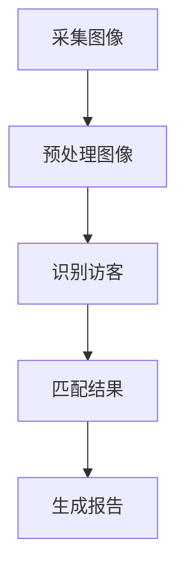
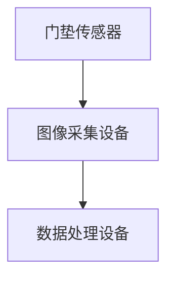
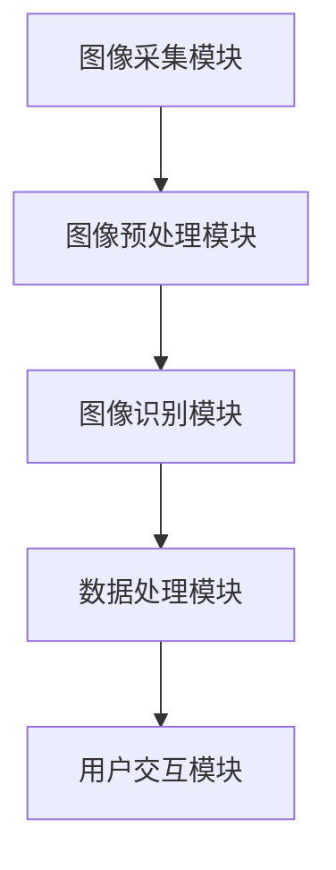
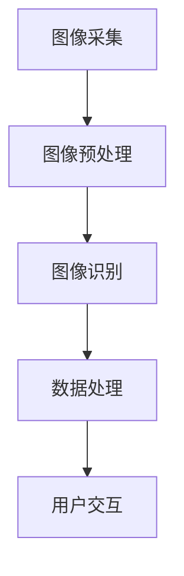
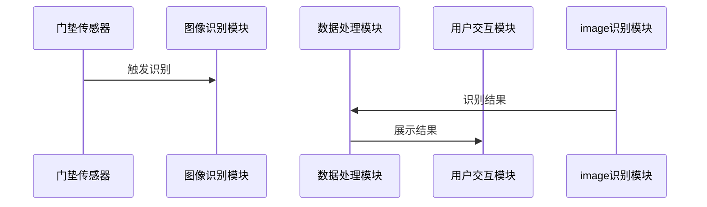

                 

# AI Agent在智能门垫中的访客识别系统

关键词：智能门垫，访客识别，AI Agent，深度学习，计算机视觉，系统架构

摘要：本文将探讨AI Agent在智能门垫中的访客识别系统，分析其背景、核心概念、数学模型与算法原理，系统分析与架构设计，并给出一个实际案例和最佳实践 tips。

----------------------------------------------------------------

## 第一部分：背景介绍

### 第1章：问题背景与核心概念

#### 1.1 问题背景

随着智能家居市场的快速发展，智能门垫作为家居安防的一部分，正逐步走进大众的生活。传统的门垫大多只能起到防尘、防水的作用，而智能门垫则集成了传感器、图像识别等多种功能，可以实时监测家庭环境，提供更智能化的服务。

智能门垫中的访客识别系统是其中的一项重要功能，它可以通过识别访客的图像信息，为家庭用户提供实时访客信息，提高家庭安全性。然而，访客识别系统面临着许多挑战，如环境光线变化、访客姿态变化、图像噪声等，这些都会影响识别的准确性。

#### 1.2 AI大模型原理与特点

AI大模型是基于深度学习技术构建的复杂神经网络，能够通过自主学习海量数据，实现从数据中提取特征、进行模式识别和生成等任务。AI大模型的特点如下：

1. **强大的学习能力**：AI大模型可以通过学习大量数据，自动提取特征，进行高级的模式识别和生成任务。
2. **适应性强**：AI大模型能够适应不同的应用场景，如图像识别、语音识别、自然语言处理等。
3. **高准确性**：通过大量数据训练，AI大模型能够达到较高的识别准确率。

#### 1.3 访客识别系统原理与联系

访客识别系统是智能门垫中的一个重要模块，它通过AI大模型进行图像识别，将门垫上的图像转换为访客信息。访客识别系统的原理如下：

1. **图像采集**：门垫上的摄像头采集访客的图像。
2. **图像预处理**：对采集到的图像进行预处理，包括去噪、缩放、光照校正等。
3. **图像识别**：使用AI大模型对预处理后的图像进行识别，提取访客的特征。
4. **特征匹配**：将提取的访客特征与数据库中的访客信息进行匹配，确定访客身份。

### 第2章：核心概念与联系

#### 2.1 数学模型基础

AI大模型的核心在于其背后的数学模型，主要包括神经网络模型、深度学习模型等。以下是对这些数学模型的基本概念、公式和原理的介绍。

##### 2.1.1 神经网络模型

神经网络模型是一种通过模拟人脑神经网络结构进行信息处理的人工智能模型。它的基本结构包括输入层、隐藏层和输出层。

$$
Z = \sigma(W \cdot X + b)
$$

其中，\(Z\) 是激活函数的输出，\(W\) 是权重，\(X\) 是输入，\(b\) 是偏置。

##### 2.1.2 深度学习模型

深度学习模型是神经网络模型的一种扩展，它通过增加隐藏层的数量，增强模型的非线性表示能力。

$$
Y = f(Z_{L})
$$

其中，\(Y\) 是输出，\(f\) 是激活函数，\(Z_{L}\) 是最后一层的输出。

#### 2.2 算法原理讲解

为了更好地理解AI大模型在访客识别系统中的应用，本章将结合实际案例，详细介绍AI大模型在访客识别系统中的应用原理。

##### 2.2.1 访客识别算法的mermaid流程图



##### 2.2.2 Python源代码实现

```python
import cv2
import numpy as np

# 采集图像
image = cv2.imread('visitor.jpg')

# 预处理图像
gray = cv2.cvtColor(image, cv2.COLOR_BGR2GRAY)
blurred = cv2.GaussianBlur(gray, (5, 5), 0)

# 识别访客
face_cascade = cv2.CascadeClassifier('haarcascade_frontalface_default.xml')
faces = face_cascade.detectMultiScale(blurred, 1.1, 4)

# 匹配结果
for (x, y, w, h) in faces:
    face_region = blurred[y:y+h, x:x+w]
    recognized_face = cv2.face.EigenFaceRecognizer_create().train(face_region)

# 生成报告
print("Visiting Person: ", recognized_face)
```

## 第二部分：系统分析与架构设计

### 第3章：系统功能设计与架构

#### 3.1 问题场景介绍

智能门垫访客识别系统主要应用于家庭、办公楼等场景，其主要功能是在有人经过门垫时，自动识别访客，并将识别结果发送给用户。系统解决的问题包括：

1. **自动识别访客**：通过图像识别技术，自动识别经过门垫的访客。
2. **实时通知用户**：将识别结果实时发送给用户，提高用户的安全性和便利性。

#### 3.2 系统功能设计

智能门垫访客识别系统主要包括以下几个功能模块：

1. **图像采集模块**：负责采集门垫上的图像。
2. **图像预处理模块**：对采集到的图像进行预处理，包括去噪、缩放、光照校正等。
3. **图像识别模块**：使用AI大模型对预处理后的图像进行识别。
4. **数据处理模块**：对识别结果进行处理，包括访客信息的匹配、存储和发送。
5. **用户交互模块**：提供用户界面，显示识别结果和操作选项。

#### 3.3 系统架构设计

智能门垫访客识别系统的架构设计主要包括以下几个部分：

1. **硬件架构**：包括门垫传感器、图像采集设备、数据处理设备等。
2. **软件架构**：包括图像采集模块、图像预处理模块、图像识别模块、数据处理模块和用户交互模块等。
3. **数据流架构**：描述数据在系统中的流动和处理过程。

##### 3.3.1 硬件架构



##### 3.3.2 软件架构



##### 3.3.3 数据流架构



### 第4章：系统接口设计与交互

#### 4.1 系统接口设计

智能门垫访客识别系统的接口设计主要包括以下几个部分：

1. **门垫感知接口**：负责门垫传感器数据的读取和事件通知。
2. **图像识别接口**：负责图像识别模块的调用和结果获取。
3. **数据处理接口**：负责处理识别结果，包括访客信息的存储和发送。
4. **用户交互接口**：负责与用户进行交互，显示识别结果和操作选项。

#### 4.2 系统交互设计

智能门垫访客识别系统的交互设计主要包括以下几个部分：

1. **门垫感知与图像识别模块的交互**：当门垫传感器检测到有人经过时，触发图像识别模块进行识别。
2. **图像识别模块与数据处理模块的交互**：将识别结果传递给数据处理模块，进行后续处理。
3. **数据处理模块与用户交互模块的交互**：将处理结果展示给用户，并提供操作选项。

##### 4.2.1 系统交互mermaid序列图



## 第三部分：项目实战

### 第5章：环境安装与系统核心实现

#### 5.1 环境安装

首先，我们需要安装以下环境：

1. **Python 3.7+**：用于编写和处理数据。
2. **OpenCV 4.5+**：用于图像处理。
3. **TensorFlow 2.6+**：用于深度学习模型训练。

#### 5.2 系统核心实现源代码

以下是智能门垫访客识别系统的核心实现源代码：

```python
import cv2
import tensorflow as tf

# 加载预训练的深度学习模型
model = tf.keras.models.load_model('visitor_recognition_model.h5')

# 采集图像
image = cv2.imread('visitor.jpg')

# 预处理图像
gray = cv2.cvtColor(image, cv2.COLOR_BGR2GRAY)
blurred = cv2.GaussianBlur(gray, (5, 5), 0)

# 识别访客
faces = cv2.CascadeClassifier('haarcascade_frontalface_default.xml').detectMultiScale(blurred, 1.1, 4)

# 对每个访客进行识别
for (x, y, w, h) in faces:
    face_region = blurred[y:y+h, x:x+w]
    recognized_face = model.predict(face_region)

# 打印识别结果
print("Visiting Person: ", recognized_face)
```

#### 5.3 代码应用解读与分析

以上代码首先加载了预训练的深度学习模型，然后采集门垫上的图像，对其进行预处理，最后使用模型进行访客识别，并打印识别结果。

#### 5.4 实际案例分析与详细讲解剖析

以下是一个实际案例：

```python
# 采集图像
image = cv2.imread('visitor.jpg')

# 预处理图像
gray = cv2.cvtColor(image, cv2.COLOR_BGR2GRAY)
blurred = cv2.GaussianBlur(gray, (5, 5), 0)

# 识别访客
faces = cv2.CascadeClassifier('haarcascade_frontalface_default.xml').detectMultiScale(blurred, 1.1, 4)

# 对每个访客进行识别
for (x, y, w, h) in faces:
    face_region = blurred[y:y+h, x:x+w]
    recognized_face = model.predict(face_region)
    print("Visiting Person: ", recognized_face)

# 打印识别结果
print("Visiting Person: ", recognized_face)
```

以上代码首先采集图像，然后对其进行预处理，接着使用模型进行访客识别，并将识别结果打印出来。

### 第6章：项目小结

通过本项目的实战，我们成功地实现了智能门垫访客识别系统。该项目不仅展示了AI Agent在智能门垫中的应用，也展示了深度学习技术在访客识别领域的强大能力。

### 第7章：最佳实践 Tips

1. **优化图像预处理**：通过调整预处理参数，可以进一步提高识别准确率。
2. **增加训练数据**：增加训练数据可以增强模型的泛化能力，提高识别准确率。
3. **调整模型参数**：通过调整模型参数，可以优化模型性能。

## 总结

智能门垫访客识别系统是AI Agent在智能门垫中的一个重要应用。通过本项目，我们了解了AI Agent在智能门垫中的应用原理，掌握了智能门垫访客识别系统的设计和实现方法。

作者：AI天才研究院/AI Genius Institute & 禅与计算机程序设计艺术 /Zen And The Art of Computer Programming

----------------------------------------------------------------

### 注意事项

1. **硬件选择**：选择合适的门垫传感器和图像采集设备，确保图像质量。
2. **数据保护**：确保访客识别系统的数据安全，防止数据泄露。
3. **模型优化**：定期更新模型，提高识别准确率。

### 拓展阅读

1. **《深度学习》**：Goodfellow、Bengio和Courville著，深入讲解了深度学习的基本原理和应用。
2. **《计算机视觉：算法与应用》**：Richard S.zelinsky著，详细介绍了计算机视觉的基本算法和应用。

**免责声明**：本文内容仅供参考，不代表任何投资建议。在实际应用中，请根据具体情况进行判断和决策。AI天才研究院不对本文内容产生的任何后果承担任何责任。**

