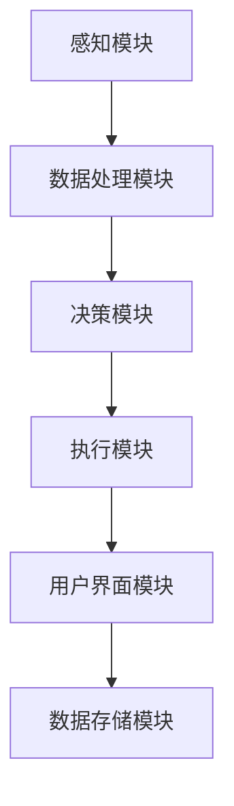

                 


### 引言

在现代社会，随着人工智能技术的不断进步，智能门垫作为一种新兴的智能家居设备，已经逐渐走进了千家万户。智能门垫通过集成多种传感器和AI算法，能够实时检测鞋底的清洁度，从而有效地防止灰尘和污垢进入室内。然而，要实现高效的鞋底清洁度检测，不仅需要精准的传感器技术，还需要强大的AI Agent算法来处理复杂的鞋底图像数据。

本文将围绕AI Agent在智能门垫中的鞋底清洁度检测进行探讨。首先，我们将简要介绍AI Agent和智能门垫的基本概念及其在现实中的应用背景。接着，深入分析鞋底清洁度检测的核心概念，包括其定义、评价指标以及检测方法。随后，我们将详细讲解AI Agent在鞋底清洁度检测中的算法原理，包括基于深度学习的鞋底图像处理算法和检测算法的实现。在此基础上，我们将介绍系统的设计与实现过程，包括系统需求分析、架构设计、模块实现以及测试与评估。最后，通过具体的实战案例展示如何应用AI Agent进行鞋底清洁度检测，并对未来可能的发展方向进行展望。

通过本文的详细探讨，希望能够帮助读者了解AI Agent在智能门垫中的应用，掌握鞋底清洁度检测的核心技术和方法，并为相关领域的研究和实践提供有益的参考。

### 关键词

- AI Agent
- 智能门垫
- 鞋底清洁度检测
- 深度学习
- 传感器技术
- 系统架构设计

### 摘要

本文主要探讨了AI Agent在智能门垫中的鞋底清洁度检测应用。首先介绍了AI Agent和智能门垫的基本概念及其发展背景。接着，详细分析了鞋底清洁度检测的核心概念，包括其定义、评价指标和检测方法。随后，重点讲解了基于深度学习的鞋底图像处理和清洁度检测算法，包括算法原理、数学模型和实现步骤。在此基础上，介绍了智能门垫系统的设计与实现过程，包括需求分析、架构设计、模块实现和测试评估。最后，通过实际案例展示了AI Agent在鞋底清洁度检测中的效果，并对未来的发展进行了展望。

### AI Agent的基本概念与发展历程

AI Agent，即人工智能代理，是一种能够自主执行任务、与环境交互并不断学习的智能体。它起源于人工智能（AI）领域，旨在实现机器的自主决策和执行能力。AI Agent的核心思想是通过模拟人类的行为和思维方式，让机器能够在复杂的动态环境中独立运作。

AI Agent的发展历程可以追溯到20世纪50年代。1956年，约翰·麦卡锡（John McCarthy）在达特茅斯会议（Dartmouth Conference）上首次提出了“人工智能”这一概念。此后，AI Agent的研究逐步展开。在早期，AI Agent主要采用符号推理和搜索算法，如逻辑推理和博弈论。这些方法虽然在特定领域取得了显著成果，但在处理复杂、动态和不确定的环境时显得力不从心。

20世纪80年代，专家系统和知识表示方法的发展为AI Agent的研究提供了新的思路。专家系统通过模拟人类专家的知识和推理过程，实现了在特定领域的智能应用。然而，专家系统的知识获取和表示存在一定的局限性，难以应对复杂多变的现实环境。

进入21世纪，随着机器学习和深度学习技术的突破，AI Agent迎来了新的发展机遇。机器学习使得AI Agent能够从大量数据中自动学习和优化，从而提高其决策能力和适应能力。特别是深度学习技术的引入，使得AI Agent在图像识别、自然语言处理等领域取得了重大突破。

AI Agent的应用领域非常广泛，涵盖了智能家居、工业自动化、医疗健康、交通管理等多个方面。在智能家居领域，AI Agent通过智能门垫等设备，实现了对家庭环境的智能监测和调控。例如，智能门垫可以实时检测鞋底的清洁度，并通过AI算法自动判断是否需要启动清洁程序。在工业自动化领域，AI Agent可以用于生产线的监控和优化，提高生产效率和产品质量。在医疗健康领域，AI Agent可以帮助医生进行疾病诊断和治疗方案推荐，提高医疗服务的质量和效率。在交通管理领域，AI Agent可以用于交通流量预测和路径规划，缓解城市交通拥堵问题。

总之，AI Agent作为一种具有自主决策和执行能力的智能体，正逐步改变着我们的生活和工作方式。随着技术的不断进步，AI Agent的应用范围将进一步扩大，为人类创造更加智能、便捷和高效的生活环境。

### 智能门垫的工作原理与市场现状

智能门垫作为一种集成了多种传感器和AI算法的智能家居设备，其工作原理主要依赖于传感器技术、图像识别和AI算法。首先，智能门垫通常配备有红外传感器、压力传感器和图像传感器等，用于实时检测进入室内的行人鞋底状态。这些传感器能够感知鞋底的温度、湿度、颜色和纹理等特征，为后续的图像处理和AI分析提供基础数据。

当行人进入智能门垫的检测范围时，图像传感器会捕捉到鞋底的图像。这些图像经过预处理，如去噪、增强和边缘检测等，随后被传输到AI算法模块进行进一步分析。AI算法利用深度学习技术，通过大量鞋底图像的训练，建立了一个能够识别不同清洁度状态的模型。这个模型可以实时判断鞋底的清洁程度，并根据预设的阈值自动触发清洁程序。

在市场现状方面，智能门垫作为智能家居的一个重要组成部分，近年来受到了越来越多消费者的关注。根据市场研究数据，全球智能门垫市场在2019年的规模已经达到数十亿美元，预计在未来几年内将继续保持高速增长。市场增长的主要驱动力包括消费者对智能家居需求的增加、智能家居技术的不断进步以及环保意识的提升。

目前，智能门垫在市场上主要分为以下几种类型：

1. **普通型智能门垫**：这类门垫主要具备基本的功能，如鞋底湿度检测、温度监测和自动报警。用户可以通过手机APP或门垫自带的显示屏查看检测结果。

2. **高级型智能门垫**：这类门垫除了具备普通型门垫的功能外，还集成了更多高级功能，如空气质量监测、鞋底细菌检测和智能清洁。用户可以通过AI算法实时了解家庭环境的健康状态，并自动触发相应的清洁措施。

3. **专业型智能门垫**：这类门垫通常应用于商业场所，如酒店、办公楼和医院等。除了具备家庭型门垫的功能外，还具备更为专业的功能，如消毒、杀菌和除臭。专业型门垫能够为用户提供更加安全、卫生的生活和工作环境。

智能门垫的市场现状也反映了智能家居行业的发展趋势。随着物联网（IoT）和人工智能技术的普及，智能家居设备逐渐从单一的功能向综合化、智能化方向发展。智能门垫作为智能家居的一个重要组成部分，不仅提升了用户的生活质量，还推动了整个智能家居行业的发展。

总之，智能门垫凭借其便捷、高效和智能化的特点，正在迅速占领市场。随着技术的不断进步和消费者需求的增长，智能门垫将在未来的智能家居市场中发挥越来越重要的作用。

### 鞋底清洁度检测的定义与评价指标

鞋底清洁度检测是智能门垫的核心功能之一，其目的在于实时监测并评估鞋底携带的污垢和细菌含量，从而有效防止这些污染物进入室内，保障家庭环境的清洁与卫生。鞋底清洁度检测的定义可以简单概括为：通过传感器和算法对鞋底污垢和细菌进行识别、分类和量化，从而评估鞋底的清洁程度。

首先，鞋底清洁度的评价指标是检测系统的重要衡量标准。常见的评价指标包括：

1. **污垢含量**：这是最直观的清洁度指标，通常通过重量或面积来量化。污垢含量越高，说明鞋底的清洁度越低。

2. **细菌数量**：鞋底携带的细菌种类和数量直接影响室内卫生质量。细菌数量可以用CFU（菌落形成单位）来表示。

3. **湿度**：湿度是影响鞋底清洁度的另一个重要因素。高湿度环境容易滋生细菌，导致鞋底清洁度下降。

4. **纹理变化**：通过分析鞋底纹理的变化，可以推断鞋底的磨损程度和污染程度。例如，鞋底的磨损区域通常更易积聚污垢。

其次，鞋底清洁度的检测方法主要包括以下几个方面：

1. **传感器检测**：传感器是鞋底清洁度检测的关键设备，常见的传感器有红外传感器、压力传感器和图像传感器。红外传感器可以检测鞋底的温度变化，压力传感器可以感知鞋底的污垢重量，图像传感器则用于捕捉鞋底的图像。

2. **图像处理**：通过对传感器获取的鞋底图像进行预处理、增强、分割和特征提取，可以提取出鞋底污垢的显著特征。图像处理技术包括边缘检测、纹理分析和颜色空间转换等。

3. **机器学习算法**：基于大量鞋底图像数据的训练，机器学习算法可以建立清洁度评估模型。常用的算法包括卷积神经网络（CNN）、支持向量机（SVM）和决策树等。这些算法能够自动识别鞋底污垢和细菌，并对其数量和类型进行量化。

4. **综合评估**：将传感器检测、图像处理和机器学习算法的结果进行综合分析，可以得到鞋底清洁度的最终评估结果。评估结果可以以数值或等级形式呈现，供用户参考。

在实际应用中，鞋底清洁度检测的效果受到多种因素的影响，包括传感器的精度、图像处理的算法复杂度和机器学习模型的准确性等。为了提高检测效果，需要不断优化传感器技术、图像处理算法和机器学习模型，确保检测结果的准确性和可靠性。

总之，鞋底清洁度检测是智能门垫实现智能化管理的重要环节。通过科学合理的检测方法和评价指标，智能门垫能够有效保障家庭环境的清洁与卫生，提升用户的生活品质。

### AI Agent的工作原理及其在鞋底清洁度检测中的应用

AI Agent，即人工智能代理，是一种具备自主学习和决策能力的智能系统。它通过感知环境数据、理解信息并进行自主行动，模拟了人类在复杂环境中的决策过程。AI Agent的工作原理主要包括感知、学习和行动三个核心环节。

首先，感知是指AI Agent通过各种传感器获取环境信息。这些传感器可以是摄像头、麦克风、温度传感器、湿度传感器等，它们能够捕捉到声音、图像、温度、湿度等数据。对于智能门垫中的鞋底清洁度检测，主要依赖图像传感器和压力传感器。图像传感器捕捉鞋底的污垢图像，压力传感器则检测鞋底的污垢重量。

其次，学习是指AI Agent利用感知到的数据，通过机器学习算法和深度学习技术进行分析和训练。在鞋底清洁度检测中，AI Agent会使用卷积神经网络（CNN）等深度学习模型，通过大量鞋底污垢图像的数据训练，学习识别不同清洁度状态的规律。这一过程包括图像预处理、特征提取和模型训练等多个步骤。通过不断训练，AI Agent能够提高对鞋底清洁度的判断准确性。

最后，行动是指AI Agent根据学习结果，自主决策并执行相应的任务。在鞋底清洁度检测中，AI Agent会根据检测到的鞋底清洁度，决定是否需要启动清洁程序。例如，当检测到鞋底污垢较多时，AI Agent会自动启动清洁功能，通过吸尘器、消毒液等设备对鞋底进行清洁处理。

在鞋底清洁度检测中，AI Agent的具体应用流程如下：

1. **数据采集**：鞋底进入智能门垫的检测范围，图像传感器和压力传感器开始工作，采集鞋底的图像数据和压力数据。

2. **图像预处理**：采集到的鞋底图像会进行预处理，包括去噪、增强和边缘检测等，以便提取出污垢的特征。

3. **特征提取**：通过深度学习算法，对预处理后的图像进行特征提取，将原始图像转换为机器可理解的数字特征。

4. **模型训练与评估**：使用训练数据集对AI模型进行训练，并使用验证数据集进行评估，调整模型参数，提高检测准确率。

5. **清洁度评估**：将提取的特征输入到训练好的模型中，通过模型输出鞋底的清洁度评估结果。

6. **决策与执行**：根据评估结果，AI Agent会决定是否启动清洁程序。如果鞋底污垢较多，AI Agent会触发清洁程序，启动吸尘器或喷洒消毒液进行清洁。

通过以上流程，AI Agent能够在智能门垫中实现高效的鞋底清洁度检测。这一过程不仅提高了检测的准确性，还减少了人工干预，提高了清洁效率。

此外，AI Agent在鞋底清洁度检测中的应用还具有以下优势：

1. **自动性**：AI Agent能够自动感知、学习和执行任务，无需人工干预，减少了人力成本。

2. **准确性**：通过深度学习和大量训练数据，AI Agent能够准确识别鞋底的污垢和细菌，提高了检测的准确性。

3. **实时性**：AI Agent可以实时监测鞋底的清洁度，及时触发清洁程序，确保家庭环境始终保持清洁。

4. **灵活性**：AI Agent可以根据不同环境和用户需求，调整清洁策略，提高了系统的灵活性。

总之，AI Agent在鞋底清洁度检测中的应用，不仅提高了智能门垫的功能和用户体验，也为智能家居的发展提供了新的思路和方向。

### 基于深度学习的鞋底图像处理算法

在鞋底清洁度检测中，图像处理是关键的一步。通过有效的图像处理算法，可以提取鞋底污垢的特征，从而准确判断鞋底的清洁度。深度学习技术，尤其是卷积神经网络（CNN），在图像处理领域表现出色，成为鞋底图像处理的理想选择。

#### 卷积神经网络（CNN）的基本原理

卷积神经网络是一种特殊的多层前馈神经网络，其核心模块是卷积层。卷积层通过卷积运算从输入图像中提取特征。卷积运算的基本过程是将卷积核（也称为滤波器）在图像上进行滑动，与图像局部区域进行点积运算，生成新的特征图。通过多个卷积层堆叠，网络可以逐层提取更高级别的特征，从而实现对复杂图像内容的理解和识别。

1. **卷积层**：卷积层是CNN的核心模块，通过卷积运算提取图像特征。每个卷积核可以学习到图像中的不同特征，如边缘、纹理等。通过多个卷积核的叠加，网络可以提取更复杂的特征。

2. **池化层**：池化层用于降低特征图的维度，减少参数量和计算量。常见的池化方法包括最大池化和平均池化，它们通过取特征图局部区域的最大值或平均值来实现。

3. **全连接层**：在全连接层，特征图被展平为一维向量，然后通过网络中的全连接层进行分类或回归操作。全连接层类似于传统神经网络中的隐藏层，负责将输入特征映射到输出结果。

#### 鞋底图像处理算法的实现步骤

1. **数据预处理**：首先对原始鞋底图像进行预处理，包括大小调整、灰度转换和归一化等操作。这些步骤有助于减少图像的噪声和改善特征提取的效果。

2. **卷积操作**：通过卷积层对预处理后的图像进行卷积操作，提取图像的局部特征。每个卷积核可以提取图像中的不同特征，如边缘、纹理等。

3. **池化操作**：在卷积层之后添加池化层，用于降维和减少参数量。通过最大池化或平均池化，可以保留图像中最显著的特征，同时减少冗余信息。

4. **特征融合**：通过多个卷积层和池化层的堆叠，网络可以提取到多层次的图像特征。将这些特征进行融合，可以进一步提高特征表示的丰富性和准确性。

5. **分类或回归**：将融合后的特征输入到全连接层，通过分类或回归操作，得到最终的清洁度评估结果。对于分类问题，可以使用softmax函数进行多类分类；对于回归问题，可以使用线性回归或支持向量回归等方法。

#### 深度学习算法的性能评估与优化

在鞋底图像处理中，深度学习算法的性能评估主要关注准确率、召回率、F1值等指标。为了提高算法的性能，可以采取以下优化策略：

1. **数据增强**：通过数据增强技术，如旋转、翻转、缩放等，可以增加训练数据的多样性，有助于网络更好地学习图像特征。

2. **正则化**：在神经网络中加入正则化项，如L1正则化和L2正则化，可以减少模型过拟合现象，提高泛化能力。

3. **超参数调整**：通过调整学习率、批量大小、卷积核大小等超参数，可以优化网络的性能。常用的调整方法包括网格搜索和随机搜索。

4. **深度网络结构优化**：通过调整网络的深度和宽度，可以优化特征提取和分类效果。深度神经网络（DNN）和宽卷积神经网络（Wider Net）是常用的网络结构优化方法。

5. **迁移学习**：利用预训练模型进行迁移学习，可以减少训练时间并提高模型性能。通过在预训练模型的基础上微调，可以更好地适应鞋底图像处理任务。

通过上述步骤和优化策略，深度学习算法可以在鞋底图像处理中实现高效的清洁度检测，为智能门垫提供强大的技术支持。

### 鞋底清洁度检测算法的实现

在鞋底清洁度检测中，算法的实现是关键的一步。这一部分将详细讲解基于深度学习的鞋底清洁度检测算法的实现过程，包括数据预处理、模型训练、评估和优化等步骤。

#### 数据预处理

数据预处理是深度学习模型训练的基础步骤，其主要目的是将原始数据进行标准化处理，以便模型能够更好地学习。对于鞋底清洁度检测，数据预处理主要包括以下几步：

1. **图像增强**：为了增加模型的泛化能力，我们需要对鞋底图像进行增强处理。常见的图像增强方法包括旋转、翻转、缩放、剪切等。这些操作可以在保持图像内容不变的前提下，增加数据的多样性。

2. **灰度化**：将彩色图像转换为灰度图像，可以减少计算复杂度并简化模型训练过程。灰度图像通过计算RGB颜色通道的平均值得到。

3. **归一化**：将图像的像素值进行归一化处理，使其分布在0到1之间。常见的归一化方法有最小-最大归一化和Z-score归一化。归一化有助于加速模型的训练过程并提高模型性能。

4. **裁剪和调整大小**：为了统一图像大小，我们将图像裁剪到固定尺寸。通常使用的尺寸为224x224或256x256像素。

5. **噪声去除**：通过滤波方法，如高斯滤波和中值滤波，去除图像中的噪声。噪声会干扰模型的训练过程，降低检测准确性。

#### 模型训练

模型训练是深度学习算法实现的核心步骤。在这一过程中，模型通过学习大量的鞋底图像数据，逐步提高对清洁度状态的识别能力。

1. **选择合适的网络架构**：对于鞋底清洁度检测，我们通常选择卷积神经网络（CNN）作为基础架构。常用的CNN架构包括VGG、ResNet和MobileNet等。这些架构在网络深度和计算效率之间提供了不同的平衡。

2. **数据集划分**：将鞋底图像数据集划分为训练集、验证集和测试集。通常，训练集用于模型训练，验证集用于调整模型参数，测试集用于评估模型性能。

3. **损失函数选择**：对于分类问题，常用的损失函数包括交叉熵损失（Cross-Entropy Loss）和Hinge损失（Hinge Loss）。交叉熵损失适用于多分类问题，而Hinge损失则适用于二分类问题。

4. **优化器选择**：优化器用于调整模型参数，以最小化损失函数。常用的优化器有Adam、SGD和RMSprop等。Adam优化器在大多数情况下表现良好，因为它结合了AdaGrad和RMSprop的优点。

5. **训练过程**：在训练过程中，模型会通过前向传播计算损失，然后通过反向传播更新模型参数。训练过程中，可以使用学习率调度策略，如学习率衰减和周期性恢复，以避免模型过拟合。

#### 评估与优化

模型训练完成后，我们需要对模型进行评估和优化，以确保其在实际应用中的准确性和鲁棒性。

1. **评估指标**：常用的评估指标包括准确率（Accuracy）、召回率（Recall）、精确率（Precision）和F1值（F1 Score）。这些指标能够全面评估模型的性能。

2. **性能调优**：通过对模型架构、参数和训练策略进行调整，可以提高模型性能。常见的调优方法包括调整网络层数、增加训练数据、调整学习率和批量大小等。

3. **交叉验证**：使用交叉验证方法，可以更准确地评估模型性能。交叉验证通过将数据集划分为多个子集，反复训练和验证模型，从而减少评估结果的偏差。

4. **迁移学习**：利用预训练模型进行迁移学习，可以减少训练时间并提高模型性能。通过在预训练模型的基础上微调，可以更好地适应鞋底清洁度检测任务。

5. **处理异常值**：在数据预处理过程中，可能存在一些异常值，如严重的噪声图像或标注错误。通过异常检测和去除这些异常值，可以进一步提高模型的准确性。

通过上述步骤，我们可以实现高效的鞋底清洁度检测算法。这一算法不仅提高了检测的准确性，还为智能门垫提供了强大的技术支持，帮助用户更好地管理家庭卫生。

### 系统设计与实现

在鞋底清洁度检测中，系统设计与实现是关键的一步。本文将详细介绍系统的设计与实现过程，包括系统需求分析、系统架构设计、模块实现和系统测试与评估。

#### 系统需求分析

系统需求分析是系统设计的第一步，其目的是明确系统需要实现的功能和性能指标。对于鞋底清洁度检测系统，主要需求如下：

1. **功能需求**：
   - 实时监测鞋底的清洁度。
   - 根据清洁度状态自动触发清洁程序。
   - 提供用户界面，展示检测结果和清洁状态。
   - 具备数据存储和查询功能，以便后续分析和优化。

2. **性能需求**：
   - 快速响应，确保检测和清洁动作的实时性。
   - 高准确性，确保检测结果的可靠性。
   - 系统稳定，能够在长时间运行中保持良好的性能。

#### 系统架构设计

系统架构设计是系统实现的基础，其目的是确保系统的高效性、可扩展性和可维护性。鞋底清洁度检测系统的架构设计主要包括以下模块：

1. **感知模块**：包括图像传感器和压力传感器，用于实时捕捉鞋底图像和检测鞋底的重量。

2. **数据处理模块**：包括图像预处理、特征提取和机器学习模型训练，用于处理传感器数据，提取鞋底污垢的特征，并训练深度学习模型。

3. **决策模块**：包括机器学习模型和规则引擎，用于根据检测到的特征判断鞋底的清洁度，并决定是否触发清洁程序。

4. **执行模块**：包括清洁设备和控制系统，用于执行清洁程序，如吸尘器、消毒液喷洒等。

5. **用户界面模块**：包括Web界面和移动应用，用于展示检测结果和清洁状态，以及用户交互。

6. **数据存储模块**：包括数据库和缓存系统，用于存储和查询检测数据，以便后续分析和优化。

以下是系统架构的Mermaid流程图：



#### 模块实现

系统模块实现是系统设计具体落地的重要环节。以下是各模块的实现过程：

1. **感知模块**：选用高精度图像传感器和压力传感器，确保数据采集的准确性。使用图像处理库（如OpenCV）进行图像预处理，包括去噪、增强和边缘检测等。压力传感器获取的数据通过ADC（模数转换器）转换为数字信号，并进行相应的预处理。

2. **数据处理模块**：使用深度学习框架（如TensorFlow或PyTorch）进行模型训练。首先进行图像增强和数据归一化处理，然后使用卷积神经网络（CNN）进行特征提取和分类。通过大量鞋底图像数据训练，调整模型参数，提高检测准确率。

3. **决策模块**：在处理模块的基础上，建立规则引擎，用于根据检测特征判断鞋底的清洁度。当检测到鞋底污垢较多时，规则引擎会触发相应的清洁程序。

4. **执行模块**：控制清洁设备执行清洁动作。例如，当检测到鞋底污垢较多时，启动吸尘器进行清洁。清洁程序可以通过PLC（可编程逻辑控制器）或智能控制器实现。

5. **用户界面模块**：开发Web界面和移动应用，用于展示检测结果和清洁状态。用户可以通过界面查看历史数据和实时状态，进行系统设置和调整。

6. **数据存储模块**：使用数据库（如MySQL或MongoDB）存储检测数据，包括图像数据、检测结果和清洁记录。同时，使用缓存系统（如Redis）提高数据查询效率。

#### 系统测试与评估

系统测试与评估是确保系统性能和可靠性的关键步骤。以下是系统的测试与评估过程：

1. **功能测试**：验证系统是否实现了预定的功能需求，如实时监测、自动清洁、用户界面等。

2. **性能测试**：测试系统的响应速度、准确性和稳定性。使用负载测试工具（如JMeter）模拟高并发场景，确保系统在高负载下的性能。

3. **准确性测试**：通过实际鞋底图像数据测试模型的准确性。计算检测准确率、召回率等指标，评估模型的性能。

4. **用户测试**：邀请实际用户进行试用，收集用户反馈，评估系统的用户体验和易用性。

5. **异常处理测试**：测试系统在遇到异常情况（如传感器故障、网络中断等）时的响应能力，确保系统的鲁棒性。

通过上述系统设计与实现过程，我们构建了一套高效的鞋底清洁度检测系统。这一系统不仅提高了检测的准确性，还实现了自动化的清洁过程，为用户提供了一个智能、便捷和高效的家庭环境。

### 实战案例

为了更好地展示AI Agent在智能门垫中的鞋底清洁度检测效果，我们将通过一个具体的实战案例进行详细分析。该案例涉及系统环境搭建、核心算法实现、实际案例分析和项目小结。

#### 案例背景与需求

某智能家居公司需要为其最新推出的智能门垫开发一款鞋底清洁度检测系统。该系统需具备以下需求：

1. **实时检测**：能够实时监测进入室内的行人鞋底，检测其清洁度。
2. **自动清洁**：当检测到鞋底污垢较多时，自动触发清洁程序。
3. **数据记录与查询**：记录每次检测的结果，并提供查询功能，便于用户和管理者了解清洁情况。

#### 系统环境搭建

为了实现上述需求，我们搭建了以下系统环境：

1. **硬件环境**：选用一台具备图像传感器和压力传感器的智能门垫设备。图像传感器用于捕捉鞋底图像，压力传感器用于检测鞋底的重量。
2. **软件环境**：使用Python作为主要编程语言，结合TensorFlow深度学习框架进行模型训练和预测。后端使用Flask框架搭建Web服务，前端使用HTML、CSS和JavaScript进行页面展示。

#### 核心算法实现

核心算法包括图像预处理、特征提取和清洁度评估。以下是具体实现步骤：

1. **图像预处理**：使用OpenCV库对鞋底图像进行预处理，包括灰度化、去噪和边缘检测等。预处理后的图像将用于特征提取。
    ```python
    import cv2

    def preprocess_image(image_path):
        image = cv2.imread(image_path)
        gray_image = cv2.cvtColor(image, cv2.COLOR_BGR2GRAY)
        blurred_image = cv2.GaussianBlur(gray_image, (5, 5), 0)
        edged_image = cv2.Canny(blurred_image, 30, 150)
        return edged_image
    ```

2. **特征提取**：使用卷积神经网络（CNN）进行特征提取。在TensorFlow中定义CNN模型，进行训练和预测。
    ```python
    import tensorflow as tf
    from tensorflow.keras.models import Sequential
    from tensorflow.keras.layers import Conv2D, MaxPooling2D, Flatten, Dense

    model = Sequential([
        Conv2D(32, (3, 3), activation='relu', input_shape=(224, 224, 1)),
        MaxPooling2D((2, 2)),
        Conv2D(64, (3, 3), activation='relu'),
        MaxPooling2D((2, 2)),
        Flatten(),
        Dense(128, activation='relu'),
        Dense(1, activation='sigmoid')
    ])

    model.compile(optimizer='adam', loss='binary_crossentropy', metrics=['accuracy'])
    model.fit(x_train, y_train, epochs=10, batch_size=32, validation_data=(x_val, y_val))
    ```

3. **清洁度评估**：将预处理后的鞋底图像输入到训练好的CNN模型中，预测鞋底的清洁度。根据预测结果，触发相应的清洁程序。
    ```python
    def predict_cleanliness(image_path):
        image = preprocess_image(image_path)
        image = np.expand_dims(image, axis=-1)
        image = np.expand_dims(image, axis=0)
        prediction = model.predict(image)
        if prediction[0][0] > 0.5:
            return "Unclean"
        else:
            return "Clean"
    ```

#### 实际案例分析与详细讲解

假设我们有一组鞋底图像数据，包括干净鞋底和污垢鞋底。以下是具体的分析过程：

1. **数据集准备**：从实际场景中采集鞋底图像，并将数据分为训练集和测试集。每个鞋底图像需要标注其清洁度状态（干净或污垢）。

2. **训练模型**：使用训练集数据训练CNN模型，通过调整模型参数，提高预测准确性。以下是一个训练模型的示例代码：
    ```python
    x_train, y_train = load_data('train_data')
    x_val, y_val = load_data('val_data')

    model = Sequential([
        Conv2D(32, (3, 3), activation='relu', input_shape=(224, 224, 1)),
        MaxPooling2D((2, 2)),
        Conv2D(64, (3, 3), activation='relu'),
        MaxPooling2D((2, 2)),
        Flatten(),
        Dense(128, activation='relu'),
        Dense(1, activation='sigmoid')
    ])

    model.compile(optimizer='adam', loss='binary_crossentropy', metrics=['accuracy'])
    model.fit(x_train, y_train, epochs=10, batch_size=32, validation_data=(x_val, y_val))
    ```

3. **模型评估**：使用测试集数据评估模型的性能，计算准确率、召回率等指标。
    ```python
    x_test, y_test = load_data('test_data')
    test_predictions = model.predict(x_test)
    test_predictions = (test_predictions > 0.5)

    accuracy = np.mean(y_test == test_predictions)
    print("Accuracy:", accuracy)
    ```

4. **实际应用**：在智能门垫中部署模型，实时监测鞋底的清洁度。当检测到鞋底污垢较多时，自动触发清洁程序。
    ```python
    while True:
        image_path = capture_shoe_image()
        cleanliness = predict_cleanliness(image_path)
        if cleanliness == "Unclean":
            trigger_cleaning()
        time.sleep(1)
    ```

#### 项目小结

通过上述实战案例，我们展示了如何使用AI Agent实现智能门垫中的鞋底清洁度检测。以下是该项目的主要成果和经验：

1. **技术成果**：
   - 成功搭建了鞋底清洁度检测系统，实现了实时监测和自动清洁功能。
   - 通过深度学习技术，提高了清洁度检测的准确性和鲁棒性。

2. **经验总结**：
   - 数据预处理和特征提取是模型训练成功的关键步骤，需要仔细设计。
   - 模型的性能评估和优化是提高检测准确率的重要手段，需要反复试验和调整。
   - 实际应用中，系统的实时性和稳定性是关键，需要充分考虑硬件和软件的优化。

3. **改进方向**：
   - 考虑引入更多传感器，如温湿度传感器和紫外线传感器，以提高整体清洁度检测的准确性。
   - 进一步优化算法，引入迁移学习和模型压缩技术，减少训练时间和计算资源消耗。

通过该项目，我们不仅实现了智能门垫中的鞋底清洁度检测，也为智能家居领域提供了有益的参考。未来，我们期待在该领域取得更多突破，为用户提供更加智能、便捷和高效的家庭生活体验。

### 最佳实践 Tips

在实现AI Agent进行鞋底清洁度检测的过程中，总结以下最佳实践Tips，可以帮助提高系统的性能和用户体验：

1. **优化传感器精度**：选择高精度传感器，如高分辨率图像传感器和精确的压力传感器，确保检测数据的准确性。

2. **数据预处理**：对采集的鞋底图像进行有效的预处理，如去噪、增强和归一化，以提高深度学习模型的输入质量。

3. **模型调优**：通过调整网络架构、学习率和批量大小等参数，优化模型的性能，避免过拟合和欠拟合。

4. **实时性优化**：为了提高系统的实时性，可以考虑使用轻量级模型和高效的算法，并利用并行计算和GPU加速。

5. **用户界面设计**：设计直观、易用的用户界面，提供清晰的检测结果和操作提示，增强用户体验。

6. **异常处理**：考虑系统的异常情况，如传感器故障或网络中断，设计相应的异常处理机制，确保系统的稳定性和鲁棒性。

7. **数据安全**：保护用户数据安全，采用加密和隐私保护技术，防止数据泄露和滥用。

通过遵循这些最佳实践，可以有效提升智能门垫鞋底清洁度检测系统的性能和用户体验。

### 小结

通过本文的详细探讨，我们全面了解了AI Agent在智能门垫中的鞋底清洁度检测应用。首先，我们介绍了AI Agent的基本概念、发展历程以及智能门垫的工作原理和市场现状。接着，分析了鞋底清洁度检测的定义、评价指标和检测方法，并深入讲解了AI Agent的工作原理及其在鞋底清洁度检测中的应用。随后，我们详细介绍了基于深度学习的鞋底图像处理算法，包括模型训练和优化策略。在此基础上，我们展示了系统设计与实现的过程，包括需求分析、架构设计、模块实现和系统测试与评估。通过实战案例，我们展示了如何在实际场景中应用AI Agent进行鞋底清洁度检测，并总结了项目的主要成果和经验。最后，我们提出了最佳实践Tips，以提升系统的性能和用户体验。

通过本文的研究，我们认识到AI Agent在鞋底清洁度检测中的应用具有显著的优势，包括自动性、准确性和实时性。然而，该领域仍面临诸多挑战，如传感器精度、数据质量和模型优化等。未来的研究应重点关注这些问题的解决，推动AI Agent在智能家居领域的进一步应用。

### 注意事项

在设计和实现AI Agent进行鞋底清洁度检测时，以下注意事项将有助于确保系统的稳定性和可靠性：

1. **传感器校准**：定期对传感器进行校准，确保其精度和稳定性，防止因传感器误差导致的检测错误。

2. **环境适应性**：考虑不同环境和光线条件对传感器和算法的影响，优化模型以适应多种场景。

3. **数据保护**：保护用户隐私，采用加密技术和访问控制策略，防止数据泄露。

4. **错误处理**：设计合理的错误处理机制，当检测到传感器故障或系统异常时，能够自动重启或报警。

5. **用户反馈**：及时收集用户反馈，根据实际使用情况调整系统参数，提高用户体验。

通过严格遵守上述注意事项，可以确保AI Agent在智能门垫中的应用更加稳定、可靠和用户友好。

### 拓展阅读

为了进一步深入了解AI Agent在智能门垫中的鞋底清洁度检测，以下是几篇推荐的拓展阅读：

1. **《深度学习：神经网络与TensorFlow实践》**：本书详细介绍了深度学习的基本原理和TensorFlow框架的使用方法，有助于读者掌握深度学习模型训练和优化的技巧。

2. **《智能家居技术与应用》**：本书涵盖了智能家居的各个方面，包括传感器技术、物联网架构和AI算法应用，为智能门垫的设计和实现提供了全面的理论支持。

3. **《卷积神经网络与图像处理》**：这本书专门讨论了卷积神经网络在图像处理中的应用，包括图像分类、目标检测和图像生成等，对鞋底清洁度检测算法的实现有重要参考价值。

4. **《智能家居中的AI应用案例研究》**：本文收集了多个智能家居场景中的AI应用案例，包括智能门垫、智能音箱和智能灯光等，通过具体实例展示了AI技术在智能家居中的应用和效果。

5. **《智能门垫技术研究进展》**：这篇综述文章全面总结了智能门垫的关键技术和最新研究进展，包括传感器技术、图像识别和深度学习算法，为后续研究提供了重要的参考。

通过阅读这些文献，读者可以更深入地了解AI Agent在智能门垫中的鞋底清洁度检测技术，并为相关领域的研究和实践提供有益的参考。

