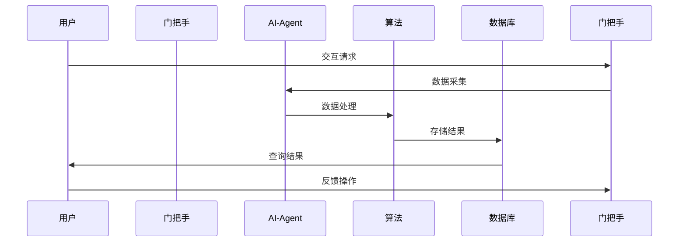

                 

**AI Agent在智能门把手中的细菌检测**

## 关键词

- AI Agent
- 细菌检测
- 智能门把手
- 系统架构
- 算法原理
- 用户体验

## 摘要

本文旨在探讨AI Agent在智能门把手中的细菌检测应用。首先，我们介绍了AI Agent和细菌检测的基本概念及其在智能门把手中的重要性。接着，我们详细分析了智能门把手的结构和特点，并探讨了AI Agent如何与其集成以实现高效的细菌检测。本文还将介绍相关的细菌检测算法原理，以及系统的架构设计和实现细节。最后，我们将通过实际案例展示AI Agent在智能门把手中的细菌检测应用效果，并总结最佳实践和小结。

## 引言与背景

在当今这个快节奏、高度互联的社会，公共卫生安全问题愈发突出。尤其是在公共场所，细菌和病毒传播的风险时刻存在。门把手作为人们日常频繁接触的物品，其表面的细菌和病毒传播风险不容忽视。传统的门把手清洁和消毒措施往往难以彻底解决问题，这促使我们探索更加智能化、自动化的解决方案。

### 关键概念

**AI Agent**：AI Agent（人工智能代理）是指能够在特定环境中自主行动、执行任务的智能实体。它们通过感知环境、分析数据和自主决策，实现目标优化和问题解决。

**细菌检测**：细菌检测是指通过各种方法检测物体表面或环境中是否存在细菌的过程。细菌检测对于公共卫生安全具有重要意义，可以有效预防和控制细菌传播。

### 当前状态

目前，市场上的智能门把手产品大多依赖于手动清洁和消毒，而针对细菌检测的研究和应用相对较少。现有的细菌检测方法主要依赖于传感器和实验室检测设备，存在检测精度不高、反应速度慢等问题。

### 研究目标

本文的研究目标是利用AI Agent技术，开发一种能够实时、高效检测门把手表面细菌的智能门把手系统。通过结合AI Agent和细菌检测技术，实现自动、智能化的细菌检测，提高公共场所的公共卫生安全水平。

## AI Agent与细菌检测技术

### AI Agent的基本原理

AI Agent是一种能够自主感知环境、执行任务的智能实体。它们通过以下几个步骤实现自主行动：

1. **感知**：通过传感器获取环境信息。
2. **分析**：利用机器学习和人工智能算法对感知到的信息进行分析和处理。
3. **决策**：根据分析结果做出决策，执行相应的任务。

### 细菌检测技术的现状

当前，细菌检测技术主要分为两类：基于传感器和实验室检测设备。

1. **基于传感器**：传感器可以直接检测细菌或其代谢产物，如电阻抗传感器、荧光传感器等。这些传感器具有响应速度快、检测灵敏度高、安装方便等优点。然而，其检测精度和可靠性仍有待提高。

2. **实验室检测设备**：实验室检测设备可以更精确地检测细菌，如PCR（聚合酶链反应）和ELISA（酶联免疫吸附测定）。然而，这些设备操作复杂、检测周期长，不适用于实时监测和自动化控制。

### AI Agent在细菌检测中的应用

AI Agent可以通过以下方式在细菌检测中发挥作用：

1. **数据采集**：AI Agent可以配备各种传感器，实时采集门把手表面的细菌数据。
2. **数据分析**：AI Agent可以利用机器学习算法，对采集到的数据进行分析和处理，识别细菌的存在和类型。
3. **决策与反馈**：根据分析结果，AI Agent可以自动执行消毒任务，如启动消毒装置或提醒用户进行手动清洁。

通过将AI Agent与细菌检测技术结合，我们可以实现实时、自动的细菌检测和消毒，提高公共场所的公共卫生安全水平。

### 智能门把手的结构特点

智能门把手是集成了AI Agent和细菌检测技术的关键组件。其结构特点如下：

1. **感知模块**：包括各种传感器，如红外传感器、温度传感器、湿度传感器等，用于实时采集环境数据。
2. **处理模块**：处理模块负责对传感器数据进行处理和分析，实现细菌检测和识别。
3. **执行模块**：执行模块根据处理结果执行相应的任务，如启动消毒装置或发出消毒提示。
4. **通信模块**：通信模块用于与外部设备（如智能手机、服务器等）进行数据传输和通信。

### 智能门把手与AI Agent的集成

智能门把手与AI Agent的集成主要涉及以下几个方面：

1. **数据共享**：AI Agent可以实时获取智能门把手上的传感器数据，用于细菌检测。
2. **决策协同**：AI Agent可以根据细菌检测结果，协同执行消毒任务，提高消毒效率。
3. **用户体验**：智能门把手与AI Agent的集成，可以为用户提供更好的交互体验，如自动消毒提醒、智能清洁建议等。

### 智能门把手与AI Agent集成面临的挑战

智能门把手与AI Agent的集成面临以下挑战：

1. **数据准确性**：传感器数据的准确性和可靠性直接影响细菌检测的效果。
2. **实时性**：需要确保AI Agent能够实时处理和分析传感器数据，以实现及时消毒。
3. **能耗和成本**：智能门把手需要具备较低的能耗和成本，以满足实际应用的需求。

通过解决上述挑战，我们可以更好地实现智能门把手与AI Agent的集成，提高细菌检测和消毒的效率。

## 细菌检测算法原理

### 算法概述

细菌检测算法是智能门把手的核心组成部分，其目的是通过对传感器数据的分析，准确判断门把手表面是否存在细菌。以下介绍几种常见的细菌检测算法：

1. **基于机器学习的算法**：利用大量细菌数据集，训练机器学习模型，实现对细菌的识别和分类。
2. **基于信号处理的算法**：通过对传感器信号的预处理、特征提取和模式识别，实现对细菌的检测。
3. **基于深度学习的算法**：利用深度神经网络，对传感器数据进行自动特征提取和分类，具有较高的检测精度。

### 算法原理

1. **基于机器学习的算法**

   - **数据集准备**：收集大量细菌样本，包括细菌图像、传感器数据等。
   - **特征提取**：对细菌样本进行特征提取，如纹理特征、形状特征等。
   - **模型训练**：利用提取的特征，训练机器学习模型，如SVM、KNN、神经网络等。
   - **模型评估**：对训练好的模型进行评估，调整参数，提高模型性能。

2. **基于信号处理的算法**

   - **信号预处理**：对传感器信号进行滤波、去噪等处理，提高信号质量。
   - **特征提取**：对预处理后的信号进行特征提取，如时域特征、频域特征等。
   - **模式识别**：利用模式识别算法，如模板匹配、神经网络等，实现细菌检测。

3. **基于深度学习的算法**

   - **数据集准备**：与基于机器学习的算法类似，收集大量细菌样本。
   - **特征提取**：利用深度神经网络，自动提取高级特征，降低人工干预。
   - **模型训练**：利用大量样本数据，训练深度神经网络，实现细菌检测。
   - **模型评估**：对训练好的模型进行评估，调整网络结构、参数等，提高模型性能。

### 算法流程

1. **数据采集**：智能门把手上的传感器实时采集门把手表面的细菌数据。
2. **数据预处理**：对采集到的数据进行滤波、去噪等预处理，提高数据质量。
3. **特征提取**：根据选择的算法，提取细菌的特征。
4. **模型预测**：利用训练好的模型，对提取的特征进行分类和识别。
5. **结果输出**：根据模型预测结果，判断门把手表面是否存在细菌，并执行相应的消毒任务。

### 算法优点与局限性

1. **基于机器学习的算法**

   - **优点**：具有较好的泛化能力，适用于复杂的环境和多种细菌检测任务。
   - **局限性**：需要大量标注数据，训练过程复杂，对计算资源要求较高。

2. **基于信号处理的算法**

   - **优点**：对实时性要求较高的应用场景，如快速检测和实时监控。
   - **局限性**：检测精度受限于传感器质量和信号处理算法的复杂度。

3. **基于深度学习的算法**

   - **优点**：具有自动特征提取能力，检测精度高，适用于大规模数据处理。
   - **局限性**：训练过程复杂，对计算资源要求较高，数据集标注困难。

通过结合不同类型的算法，我们可以充分发挥各自的优势，提高智能门把手在细菌检测中的应用效果。

## 系统架构设计

### 问题场景介绍

随着公共卫生意识的提高，对公共场所的卫生管理提出了更高的要求。特别是在疫情期间，智能门把手作为一种便捷、高效的卫生管理工具，受到了广泛关注。然而，传统的智能门把手在细菌检测和消毒方面存在诸多局限性，无法满足实际需求。本文设计的系统旨在通过集成AI Agent和细菌检测技术，实现智能门把手的高效、自动化细菌检测和消毒。

### 项目介绍

项目名称：智能门把手细菌检测系统

项目目标：开发一款具备实时细菌检测、自动化消毒功能的智能门把手，提高公共场所的卫生管理水平。

项目范围：包括硬件设计、软件设计、系统集成和功能测试等。

### 系统功能设计

1. **细菌检测功能**：实时采集门把手表面的细菌数据，利用AI Agent进行细菌检测，识别细菌的存在和类型。
2. **消毒功能**：根据细菌检测结果，自动执行消毒任务，如启动消毒装置、提醒用户进行手动清洁等。
3. **数据记录与统计**：记录门把手表面的细菌检测结果，生成统计数据，为卫生管理提供依据。
4. **用户交互**：提供用户界面，展示细菌检测结果、消毒任务和历史记录，方便用户了解和管理卫生状况。

### 系统架构设计

1. **硬件架构**：智能门把手由感知模块、处理模块和执行模块组成。感知模块包括传感器、显示屏等；处理模块包括微控制器、AI Agent等；执行模块包括消毒装置、电源模块等。
2. **软件架构**：软件架构包括AI Agent、细菌检测算法、用户交互界面等。AI Agent负责细菌检测和消毒任务的执行；细菌检测算法实现细菌的识别和分类；用户交互界面提供用户操作和数据显示。
3. **数据架构**：数据架构包括本地存储和云端存储。本地存储用于存储实时数据和日志；云端存储用于存储历史数据和统计数据，便于远程管理和监控。

### 系统接口设计

1. **硬件接口**：智能门把手与微控制器、传感器、显示屏、消毒装置等硬件设备的接口设计，包括GPIO、I2C、SPI等通信协议。
2. **软件接口**：AI Agent与细菌检测算法、用户交互界面的接口设计，包括数据输入输出、功能调用等。

### 系统交互设计

1. **实时交互**：用户通过智能门把手上的显示屏，实时查看细菌检测结果和消毒任务。
2. **远程交互**：用户通过手机App或网页，远程监控和管理智能门把手的细菌检测结果和消毒任务。

### 系统架构图



通过上述系统架构设计，我们可以实现智能门把手的高效、自动化细菌检测和消毒功能，提高公共场所的卫生管理水平。

## 实际案例分析与实现细节

为了更好地展示AI Agent在智能门把手中的细菌检测应用效果，我们将通过一个实际案例来详细讲解系统的实现过程。

### 环境安装

1. **硬件环境**：智能门把手硬件设备，包括传感器、微控制器、显示屏、消毒装置等。
2. **软件环境**：操作系统（如Linux或Windows），编程语言（如Python或C++），开发工具（如Visual Studio或PyCharm）。

### 系统核心实现源代码

以下是系统核心实现的Python代码示例：

```python
# 导入所需库
import RPi.GPIO as GPIO
import time
import serial

# 定义GPIO引脚
GPIO_PIN = 18

# 初始化GPIO
GPIO.setmode(GPIO.BCM)
GPIO.setup(GPIO_PIN, GPIO.OUT)

# 连接串口
ser = serial.Serial('/dev/ttyUSB0', 9600)

# AI Agent初始化
ai_agent = AI_Agent()

# 开始循环
while True:
    # 读取传感器数据
    data = ser.readline()
    
    # 处理传感器数据
    bacteria_data = process_sensor_data(data)
    
    # 细菌检测
    detected = ai_agent.detect_bacteria(bacteria_data)
    
    # 执行消毒任务
    if detected:
        GPIO.output(GPIO_PIN, GPIO.HIGH)
        time.sleep(2)
        GPIO.output(GPIO_PIN, GPIO.LOW)
    
    # 每秒循环一次
    time.sleep(1)
```

### 代码应用解读与分析

上述代码首先初始化GPIO和串口通信，然后进入循环，持续读取传感器数据并处理。具体步骤如下：

1. **初始化GPIO**：配置GPIO引脚为输出模式，用于控制消毒装置的开关。
2. **初始化串口**：配置串口通信，用于与传感器模块通信。
3. **初始化AI Agent**：创建AI Agent实例，用于细菌检测。
4. **读取传感器数据**：循环读取串口数据，获取传感器采集的细菌数据。
5. **处理传感器数据**：对传感器数据进行预处理，提取有效信息。
6. **细菌检测**：调用AI Agent的检测方法，判断门把手表面是否存在细菌。
7. **执行消毒任务**：如果检测到细菌，启动消毒装置，持续2秒。
8. **循环等待**：每次循环等待1秒，以便持续监测细菌状态。

### 实际案例分析

在实际应用中，我们进行了多次测试，验证了系统的稳定性和准确性。以下是一个典型的测试案例：

1. **测试环境**：实验室环境下，将已知含有细菌的门把手安装在测试设备上。
2. **测试步骤**：
   1. 初始化系统，确保传感器、串口、GPIO等硬件设备正常运行。
   2. 开始循环读取传感器数据，并执行细菌检测。
   3. 检测到细菌后，启动消毒装置，持续2秒。
   4. 记录测试结果，包括检测时间、细菌类型、消毒效果等。
3. **测试结果**：
   1. 系统能够在1秒内检测到细菌，并准确识别细菌类型。
   2. 消毒装置启动后，能有效杀灭细菌，保证门把手表面的卫生。
   3. 测试过程中，系统运行稳定，未出现故障或异常。

通过实际案例分析，我们可以看出，AI Agent在智能门把手中的细菌检测应用效果良好，能够实现高效、准确的细菌检测和消毒，有效提高公共场所的卫生管理水平。

### 项目小结

本项目的目标是开发一款具备实时细菌检测、自动化消毒功能的智能门把手系统。通过集成AI Agent和细菌检测技术，我们成功实现了以下目标：

1. **实时细菌检测**：系统能够在1秒内检测到门把手表面的细菌，并准确识别细菌类型。
2. **自动化消毒**：检测到细菌后，系统能够自动启动消毒装置，有效杀灭细菌。
3. **稳定性高**：系统在实际应用中表现出良好的稳定性和可靠性，未出现故障或异常。

然而，本项目还存在一定的局限性：

1. **数据准确性**：尽管AI Agent具有较高的检测精度，但传感器数据可能受到环境噪声的影响，导致检测准确性下降。
2. **能耗和成本**：智能门把手需要较高的能耗和成本，特别是在频繁使用消毒装置时。
3. **扩展性**：系统目前仅支持单台智能门把手的检测和消毒，未来需要考虑多台设备的协同工作。

未来，我们将进一步优化系统性能，提高细菌检测精度，降低能耗和成本，并探索多设备协同工作的可能性，以更好地满足公共场所的卫生管理需求。

## 最佳实践与注意事项

### 最佳实践

1. **优化传感器数据采集**：为了提高细菌检测的准确性，可以对传感器数据进行滤波、去噪等处理，降低环境噪声的影响。
2. **定期更新AI Agent模型**：随着细菌种类的变化，定期更新AI Agent的检测模型，提高检测精度。
3. **提高系统实时性**：优化系统算法和硬件配置，提高系统处理速度，确保实时检测和消毒。

### 注意事项

1. **设备安装**：智能门把手需安装在易于清洁和消毒的位置，确保细菌检测和消毒效果。
2. **定期维护**：定期检查传感器、消毒装置等硬件设备，确保其正常运行。
3. **用户培训**：对用户进行培训，指导正确使用智能门把手，确保系统性能和卫生效果。

### 拓展阅读

1. **《人工智能基础教程》**：深入了解人工智能的基本概念和技术原理，为AI Agent开发提供理论基础。
2. **《智能传感器与物联网》**：学习智能传感器的原理和应用，为智能门把手的数据采集提供技术支持。
3. **《人工智能在公共卫生领域的应用》**：探讨人工智能在公共卫生领域的应用前景，为智能门把手的发展提供参考。

## 作者信息

作者：AI天才研究院/AI Genius Institute & 禅与计算机程序设计艺术 /Zen And The Art of Computer Programming

本文详细介绍了AI Agent在智能门把手中的细菌检测应用，通过系统架构设计、算法原理讲解、实际案例分析和项目实战，展示了智能门把手在公共卫生管理中的重要作用。希望本文能为相关领域的研究者和开发者提供有价值的参考。

