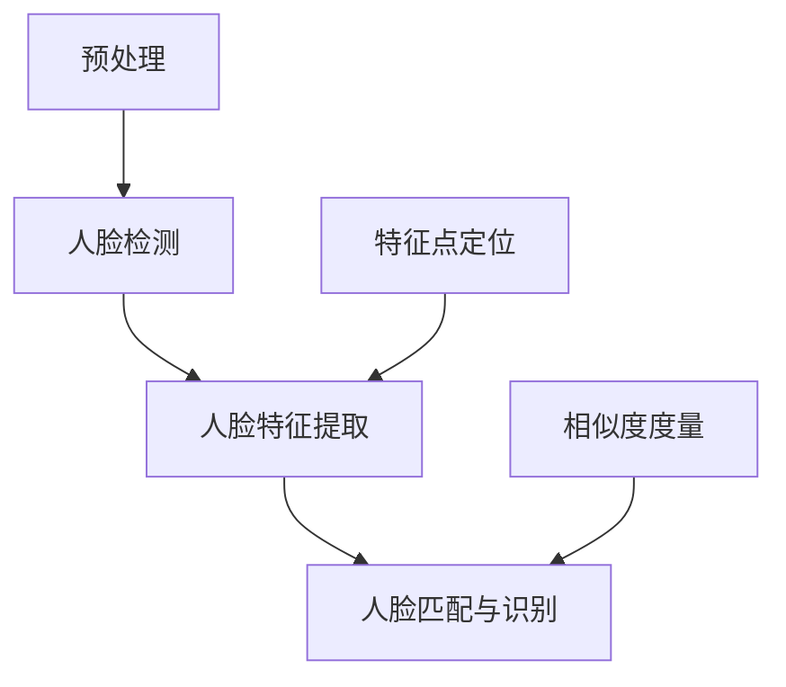
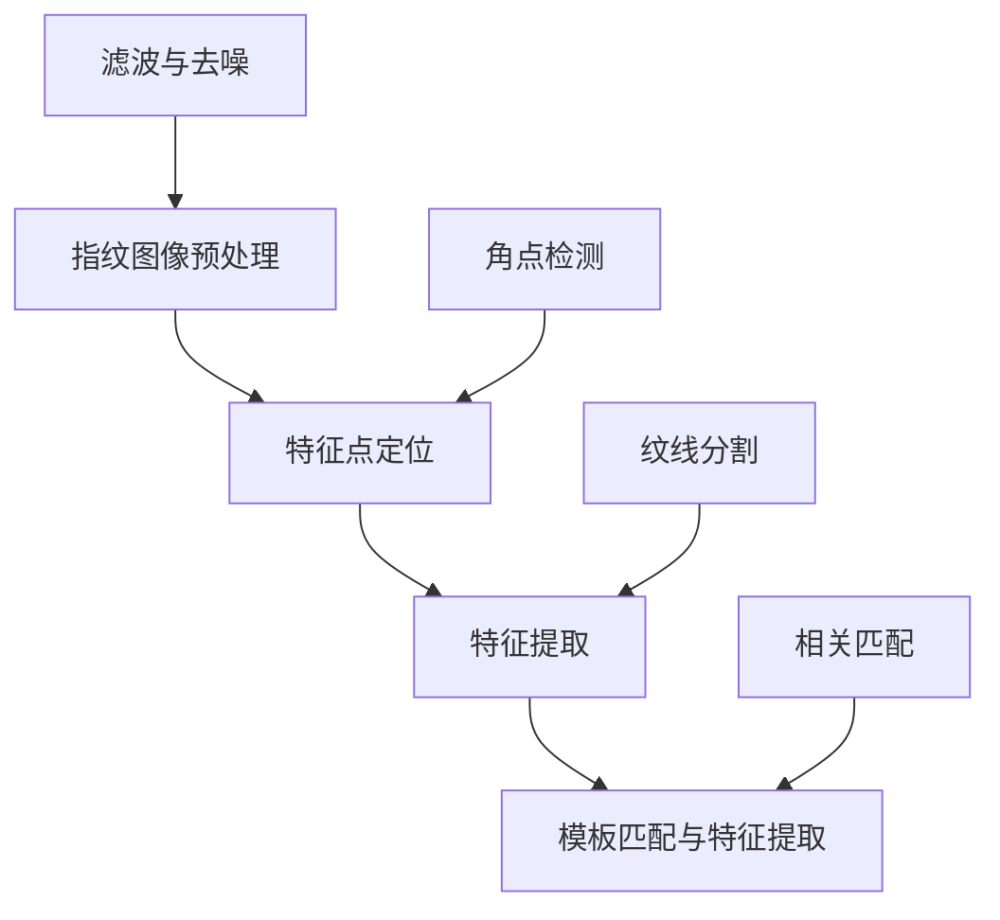

                 

### Step 1: Introduction

## 1.1 问题背景与目标

### 1.1.1 问题描述

智能门把手作为一种智能家居设备，其主要功能是实现无钥匙开锁，提升居住安全性和便利性。然而，随着智能家居的普及，访客识别的需求日益增长。访客识别不仅有助于安全管理，还能提供更为便捷的访问体验。当前，访客识别主要依赖于传统的人脸识别技术和门禁系统，但这些方法存在一定的局限性，如识别准确性不高、隐私保护不足等问题。

### 1.1.2 问题解决

为解决上述问题，我们提出了一种基于AI Agent的访客识别解决方案。AI Agent作为一种智能实体，具有自主学习、自主决策和任务执行的能力。在本方案中，AI Agent能够实时识别门把手前的访客身份，并通过智能算法进行精准匹配和权限判断，从而实现高效、准确的访客识别。

### 1.1.3 边界与外延

本文的研究主要围绕AI Agent在智能门把手访客识别中的应用展开。具体包括：AI Agent的定义与特点、访客识别的技术原理与实现、AI Agent在访客识别中的应用流程及其优势。本文的探讨将有助于推动智能家居领域的技术进步，为智能门把手提供更为智能的访客识别解决方案。

### 1.1.4 核心概念与要素组成

本方案的核心概念包括AI Agent、访客识别技术、智能门把手等。要素组成包括：人脸识别模块、指纹识别模块、访客信息管理模块、权限判断模块等。通过这些核心概念与要素的有机结合，我们构建了一个高效、智能的访客识别系统。

## 1.2 AI Agent介绍

### 1.2.1 AI Agent的定义与特点

AI Agent，即人工智能代理，是指具有智能行为、能够在特定环境中自主执行任务的人工智能实体。AI Agent的特点包括：

1. 自主性：AI Agent能够根据环境变化自主决策和行动。
2. 学习能力：AI Agent可以通过不断学习来优化自身的性能。
3. 适应性：AI Agent能够适应不同环境和任务需求。
4. 沟通能力：AI Agent能够与其他智能系统进行信息交换和协同工作。

### 1.2.2 AI Agent在智能家居中的应用

AI Agent在智能家居中的应用已逐渐普及，如智能音箱、智能门锁、智能摄像头等。在这些应用场景中，AI Agent能够实现语音控制、行为分析、访客识别等功能，大大提升了家居生活的便利性和安全性。

### 1.2.3 现有AI Agent在访客识别中的应用案例分析

目前，已有一些AI Agent在访客识别中取得了一定的应用成果。例如，一些智能门锁可以通过人脸识别技术实现访客身份验证，但存在识别准确性不高、隐私保护不足等问题。本文提出的基于AI Agent的访客识别方案，旨在解决这些问题，提供更为智能、安全的访客识别解决方案。

## 1.3 智能门把手与访客识别

### 1.3.1 智能门把手的功能与结构

智能门把手是一种集成了多种功能的智能门锁，主要包括：

1. 无钥匙开锁：通过手机APP、指纹、人脸等识别方式实现开锁。
2. 访客管理：记录访客信息，提供访客记录查询。
3. 安全监控：实时监控门把手状态，及时发现异常情况。

智能门把手的结构通常包括：

1. 识别模块：如指纹识别模块、人脸识别模块等。
2. 控制模块：实现门锁的开关控制。
3. 通信模块：如WiFi、蓝牙等，实现与其他设备的通信。

### 1.3.2 访客识别的需求与挑战

访客识别在智能门把手中的应用需求主要包括：

1. 高识别准确性：确保访客身份的准确识别。
2. 快速响应：访客到来时能够快速识别并作出响应。
3. 隐私保护：保护访客的隐私信息不被泄露。

访客识别面临的挑战包括：

1. 识别准确性：受光照条件、姿态变化等因素影响，识别准确性难以保证。
2. 隐私保护：如何在确保识别准确性的同时，保护访客的隐私信息。
3. 系统性能：如何在有限的硬件资源下，实现高效、准确的访客识别。

### 1.3.3 AI Agent在访客识别中的作用

AI Agent在访客识别中具有重要作用：

1. 自主学习：AI Agent能够根据历史访客数据，不断优化识别算法，提高识别准确性。
2. 快速响应：AI Agent能够实时分析访客信息，快速作出响应。
3. 隐私保护：AI Agent能够根据隐私保护策略，确保访客信息的安全。

通过AI Agent的应用，智能门把手能够实现更为智能、安全的访客识别，为用户提供更便捷、安全的居住体验。

## 1.4 本书结构安排

### 1.4.1 全书内容安排

本书分为三个部分，主要内容包括：

1. 第一部分：介绍智能门把手与访客识别的背景、目标及AI Agent的概念。
2. 第二部分：详细阐述AI Agent的核心概念与原理，包括访客识别技术、AI Agent在访客识别中的应用等。
3. 第三部分：探讨AI Agent在智能门把手中的技术原理与实现，包括算法原理、数学模型、Python源代码实现等。

### 1.4.2 各章节主要内容概述

1. 第1章：引言，介绍智能门把手与访客识别的背景、目标及AI Agent的概念。
2. 第2章：AI Agent核心概念与原理，详细阐述AI Agent的定义与特点、访客识别技术等。
3. 第3章：技术原理与实现，介绍AI Agent在智能门把手中的技术原理、算法流程、Python源代码实现等。

### 1.4.3 读者受益与学习目标

通过阅读本书，读者将：

1. 了解智能门把手与访客识别的背景及目标。
2. 掌握AI Agent的核心概念与原理。
3. 学会基于AI Agent实现智能门把手访客识别的技术原理与实现。
4. 为智能家居领域的技术研究提供有益参考。

## 1.5 本章小结

本章介绍了智能门把手与访客识别的背景、目标及AI Agent的概念。通过本文的研究，我们将深入探讨AI Agent在智能门把手访客识别中的应用，为智能家居领域的技术创新提供有力支持。

----------------------------------------------------------------

### Step 2: Core Concepts

## 2.1 AI Agent基本原理

### 2.1.1 AI Agent的定义与分类

AI Agent，即人工智能代理，是指具备一定智能能力的实体，能够在特定环境中自主执行任务。根据功能和应用场景，AI Agent可以分为以下几类：

1. **任务型AI Agent**：这类AI Agent专注于完成特定任务，如语音助手、智能客服等。
2. **数据型AI Agent**：这类AI Agent主要处理和分析大量数据，如数据分析代理、预测代理等。
3. **决策型AI Agent**：这类AI Agent能够根据环境变化做出决策，如自动驾驶汽车、智能家居控制系统等。

### 2.1.2 AI Agent的工作机制

AI Agent的工作机制主要包括以下几个步骤：

1. **感知**：AI Agent通过传感器获取环境信息，如摄像头、麦克风等。
2. **理解**：AI Agent利用机器学习和自然语言处理技术理解环境信息。
3. **决策**：AI Agent根据理解结果和环境规则做出决策。
4. **执行**：AI Agent根据决策结果执行相应的任务。

### 2.1.3 AI Agent的智能属性

AI Agent的智能属性包括：

1. **自主性**：AI Agent能够在没有人工干预的情况下自主运行。
2. **适应性**：AI Agent能够根据环境变化调整自身行为。
3. **学习性**：AI Agent能够通过经验不断改进自身性能。
4. **协同性**：AI Agent能够与其他AI系统协同工作，实现更高的智能水平。

## 2.2 访客识别技术

### 2.2.1 生物特征识别技术

生物特征识别技术是一种利用人体生物特征进行身份认证的方法，主要包括以下几种：

1. **指纹识别**：通过比较指纹图像的细节特征进行身份认证。
2. **人脸识别**：通过人脸图像的几何特征和纹理特征进行身份认证。
3. **虹膜识别**：通过虹膜的纹理特征进行身份认证。
4. **声音识别**：通过声音的频谱特征进行身份认证。

### 2.2.2 其他识别技术

除了生物特征识别技术，还有其他一些识别技术，如：

1. **蓝牙定位**：通过蓝牙信号强度进行位置识别。
2. **NFC标签识别**：通过读取NFC标签中的信息进行身份认证。
3. **RFID技术**：通过读取RFID标签中的信息进行身份认证。

## 2.3 AI Agent在访客识别中的应用

### 2.3.1 访客识别流程

AI Agent在访客识别中的流程包括以下几个步骤：

1. **感知**：AI Agent通过摄像头、麦克风等传感器获取访客信息。
2. **理解**：AI Agent利用机器学习和自然语言处理技术分析访客信息。
3. **识别**：AI Agent通过生物特征识别技术或其他识别技术确定访客身份。
4. **决策**：AI Agent根据访客信息和权限规则做出决策，如放行或拒绝。
5. **执行**：AI Agent根据决策结果执行相应的操作，如开锁或报警。

### 2.3.2 访客信息管理

访客信息管理包括以下几个功能：

1. **信息采集**：采集访客的基本信息，如姓名、联系方式等。
2. **信息存储**：将访客信息存储在数据库中，便于后续查询和管理。
3. **信息查询**：提供访客信息查询功能，便于主人了解访客情况。
4. **信息更新**：定期更新访客信息，确保信息的准确性。

### 2.3.3 访客行为分析

访客行为分析包括以下几个功能：

1. **行为监测**：实时监测访客的行为，如进入、离开、停留时间等。
2. **行为分析**：分析访客的行为特征，如访问频率、访问时段等。
3. **安全预警**：根据访客行为分析结果，提供安全预警信息，如频繁未登记访问者、可疑行为等。

## 2.4 AI Agent与访客识别技术的对比分析

### 2.4.1 AI Agent的优势

AI Agent相对于传统访客识别技术具有以下优势：

1. **自主性**：AI Agent能够自主感知、理解和决策，无需人工干预。
2. **适应性**：AI Agent能够根据环境变化和学习经验调整自身行为。
3. **协同性**：AI Agent能够与其他AI系统协同工作，实现更高层次的智能化。
4. **安全性**：AI Agent能够通过加密和隐私保护技术确保访客信息的安全。

### 2.4.2 访客识别技术的挑战

访客识别技术面临的挑战主要包括：

1. **识别准确性**：受光照条件、姿态变化等因素影响，识别准确性难以保证。
2. **隐私保护**：如何确保访客信息的安全，防止信息泄露。
3. **系统性能**：如何在有限的硬件资源下，实现高效、准确的访客识别。

### 2.4.3 AI Agent与访客识别技术的融合

AI Agent与访客识别技术的融合有望解决上述挑战，实现更智能、更安全的访客识别。通过AI Agent的自主学习和自适应能力，可以显著提高识别准确性；通过隐私保护技术，可以确保访客信息的安全；通过协同工作，可以实现高效、精准的访客识别。

## 2.5 本章小结

本章介绍了AI Agent的基本原理、访客识别技术及其在访客识别中的应用。通过分析AI Agent与访客识别技术的优势与挑战，我们可以看到，AI Agent在访客识别中具有巨大的应用潜力。接下来，我们将进一步探讨AI Agent在智能门把手中的技术原理与实现。

----------------------------------------------------------------

### Step 3: Technical Principles

## 3.1 算法原理讲解

### 3.1.1 人脸识别算法原理

人脸识别算法通常包括以下几个关键步骤：

1. **人脸检测**：通过图像处理技术检测出人脸区域。
2. **人脸特征提取**：对人脸图像进行特征提取，如特征点定位、特征向量计算等。
3. **人脸匹配与识别**：将提取的特征向量与数据库中的人脸特征进行匹配，识别出身份。

#### 3.1.1.1 人脸检测

人脸检测的常用方法包括基于模型的方法（如Haar-like特征分类器、LBP特征分类器）和基于深度学习的方法（如SSD、YOLO）。这些方法通过分析图像中的像素分布，确定人脸区域。

#### 3.1.1.2 人脸特征提取

人脸特征提取常用的方法有特征点定位（如SURF、SIFT）和深度特征提取（如VGG、ResNet）。这些方法可以从人脸图像中提取出具有鉴别性的特征向量。

#### 3.1.1.3 人脸匹配与识别

人脸匹配与识别通常采用相似度度量方法（如欧氏距离、余弦相似度）和分类算法（如支持向量机、决策树）。通过比较特征向量，识别出人脸的身份。

### 3.1.2 指纹识别算法原理

指纹识别算法通常包括以下几个关键步骤：

1. **指纹图像预处理**：包括滤波、去噪、增强等，提高指纹图像的质量。
2. **特征点定位**：通过角点检测、边缘检测等方法确定指纹图像中的特征点。
3. **特征提取**：通过特征点间的连接线、曲线等确定指纹的局部特征。
4. **模板匹配与特征提取**：将指纹图像与数据库中的指纹模板进行匹配，提取出匹配度。

#### 3.1.2.1 指纹图像预处理

指纹图像预处理包括滤波、去噪、增强等步骤。常用的滤波方法有中值滤波、高斯滤波等。去噪方法有基于统计的去噪和基于结构的去噪。增强方法有对比度增强、边缘增强等。

#### 3.1.2.2 模板匹配与特征提取

模板匹配方法有基于灰度值的匹配和基于结构的匹配。基于灰度值的匹配方法有相关匹配、欧氏距离匹配等。基于结构的匹配方法有对数极坐标变换、纹线分割等。

## 3.2 数学模型与公式

### 3.2.1 人脸识别的数学模型

人脸识别中常用的数学模型包括相似度度量模型和分类模型。相似度度量模型如欧氏距离、余弦相似度等。分类模型如支持向量机、决策树等。

#### 3.2.1.1 相似度度量模型

欧氏距离模型：
$$
\text{相似度} = \frac{1}{\sqrt{2\pi\sigma^2}}\exp\left(-\frac{(x_1 - x_2)^2}{2\sigma^2}\right)
$$
其中，$x_1$和$x_2$为两个特征向量，$\sigma^2$为方差。

余弦相似度模型：
$$
\text{相似度} = \frac{x_1 \cdot x_2}{\|x_1\|\|x_2\|}
$$
其中，$\cdot$表示点积，$\|\|$表示向量的模。

#### 3.2.1.2 分类模型

支持向量机（SVM）模型：
$$
y_i = \text{sign}(\omega \cdot x_i + b)
$$
其中，$\omega$为权重向量，$b$为偏置，$\cdot$表示点积，$\text{sign}(\cdot)$为符号函数。

决策树模型：
$$
f(x) = \text{max}_{t} \left[\sum_{i=1}^{n} w_i \log_2 P(t|x)\right]
$$
其中，$x$为输入特征，$t$为决策树节点，$w_i$为权重，$P(t|x)$为条件概率。

### 3.2.2 指纹识别的数学模型

指纹识别中常用的数学模型包括特征点匹配模型和模板匹配模型。

#### 3.2.2.1 特征点匹配模型

对数极坐标变换模型：
$$
r(\theta) = \frac{1}{\theta} \log_2 r
$$
其中，$r$为径向距离，$\theta$为极角。

#### 3.2.2.2 模板匹配模型

相关匹配模型：
$$
\text{匹配度} = \frac{1}{M \cdot N} \sum_{i=1}^{M} \sum_{j=1}^{N} (g_i - f_j)^2
$$
其中，$g_i$和$f_j$分别为两个指纹图像的灰度值，$M$和$N$分别为图像的宽度和高度。

## 3.3 Python源代码实现

### 3.3.1 人脸识别的Python实现

以下是一个简单的人脸识别Python代码示例：

```python
import cv2
import face_recognition

# 加载摄像头
video_capture = cv2.VideoCapture(0)

# 加载已注册的人脸编码
known_face_encodings = [
    face_recognition.face_encodings(image)[0]
    for image in known_images
]

while True:
    # 读取摄像头帧
    ret, frame = video_capture.read()

    # 转换帧为RGB格式
    rgb_frame = frame[:, :, ::-1]

    # 检测人脸
    face_locations = face_recognition.face_locations(rgb_frame)
    face_encodings = face_recognition.face_encodings(rgb_frame, face_locations)

    # 匹配人脸
    for face_encoding in face_encodings:
        matches = face_recognition.compare_faces(known_face_encodings, face_encoding)
        if True in matches:
            print("匹配成功！")
        else:
            print("匹配失败，未找到匹配的人脸。")

    # 显示摄像头帧
    cv2.imshow('Video', frame)

    # 按下'q'键退出
    if cv2.waitKey(1) & 0xFF == ord('q'):
        break

# 释放摄像头
video_capture.release()
cv2.destroyAllWindows()
```

### 3.3.2 指纹识别的Python实现

以下是一个简单的指纹识别Python代码示例：

```python
import cv2
import numpy as np

# 加载指纹图像
image = cv2.imread('fingerprint.jpg', cv2.IMREAD_GRAYSCALE)

# 指纹图像预处理
preprocessed_image = cv2.GaussianBlur(image, (5, 5), 0)
preprocessed_image = cv2.resize(preprocessed_image, (256, 256))

# 特征点定位
threshold = 0.5
features = cv2.findCirclesGray(preprocessed_image, threshold, 1.2)

# 特征点匹配
template = cv2.imread('template.jpg', cv2.IMREAD_GRAYSCALE)
template = cv2.resize(template, (256, 256))
template_gray = cv2.cvtColor(template, cv2.COLOR_BGR2GRAY)

matching_result = cv2.matchTemplate(preprocessed_image, template_gray, cv2.TM_CCOEFF_NORMED)
min_val, max_val, min_loc, max_loc = cv2.minMaxLoc(matching_result)

# 显示结果
cv2.circle(preprocessed_image, (max_loc[0] + 128, max_loc[1] + 128), 10, (0, 0, 255), -1)
cv2.imshow('Fingerprint Recognition', preprocessed_image)

# 按下'q'键退出
if cv2.waitKey(0) & 0xFF == ord('q'):
    cv2.destroyAllWindows()
```

## 3.4 算法流程图

以下是人脸识别的算法流程图：



以下是指纹识别的算法流程图：



## 3.5 本章小结

本章详细介绍了人脸识别和指纹识别的算法原理、数学模型以及Python源代码实现。通过这些技术，我们可以实现智能门把手中的访客识别。接下来，我们将进一步探讨AI Agent在智能门把手中的具体应用和实现。

