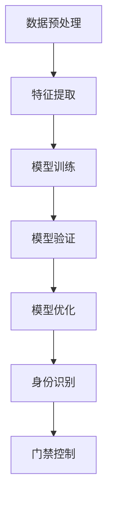
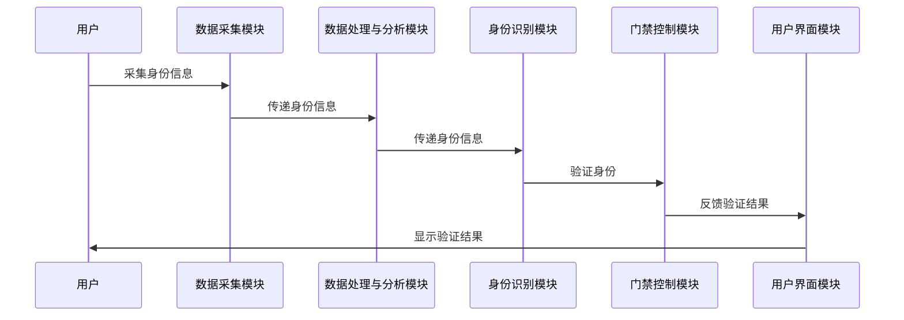

                 

## 第1章：智能门把手与访客身份识别需求

### 1.1.1 智能门把手的发展与应用

#### 1.1.1.1 智能门把手的发展

智能门把手作为智能家居系统中的重要一环，其发展历程大致可以分为三个阶段：

1. **机械锁阶段**：
    - 传统的机械锁是最早的门锁形式，通过钥匙或转钮等方式实现开关控制。
    - 这一阶段的技术特点是简单、可靠，但安全性较低，易受攻击。

2. **电子锁阶段**：
    - 电子锁在20世纪末开始普及，使用电子芯片代替机械钥匙。
    - 这一阶段的技术特点包括：更便捷的开关控制、更高的安全性（如使用密码、卡片等）。
    - 但仍存在依赖物理介质的问题，且维护成本较高。

3. **智能化锁具阶段**：
    - 当前智能门把手结合了物联网、人工智能等技术，实现更高级的功能。
    - 这一阶段的技术特点包括：无线远程控制、智能访客管理、智能家居系统集成等。

#### 1.1.1.2 智能门把手的应用

智能门把手在现代生活中有着广泛的应用场景，主要包括以下几类：

1. **家庭场景**：
    - 用户可以通过手机APP远程控制门锁，实现对家庭成员的权限管理。
    - 智能门把手还可以与家庭安防系统联动，提高家庭安全水平。

2. **酒店场景**：
    - 酒店可以通过智能门把手实现自助入住、快速退房等便捷服务。
    - 智能门把手还可以记录访客信息，方便酒店进行管理和分析。

3. **办公楼场景**：
    - 智能门把手可以实现对员工进出时间的记录，提高工作效率。
    - 智能门把手还可以结合考勤系统，实现智能化的员工管理。

### 1.1.2 传统门把手访客身份识别的局限性

传统门把手在访客身份识别方面存在以下局限性：

1. **依赖人工**：
    - 传统门把手通常依赖人工记录或钥匙分发，效率低，容易出现失误。

2. **安全性不高**：
    - 传统门把手无法有效识别访客身份，容易造成安全漏洞。

3. **无法远程管理**：
    - 传统门把手无法实现远程控制和管理，无法满足现代社会的需求。

### 1.1.3 AI Agent在访客身份识别中的优势

AI Agent在访客身份识别中具有以下优势：

1. **高准确性**：
    - AI Agent可以通过人脸识别、指纹识别等技术，实现精确的访客身份识别。

2. **自动化**：
    - AI Agent可以实现自动化管理，提高工作效率，减少人工干预。

3. **安全性**：
    - AI Agent可以通过多因素认证，提高门锁的安全性。

4. **远程管理**：
    - AI Agent可以实现远程监控和控制，满足远程管理的需求。

### 总结

智能门把手作为智能家居系统的重要组成部分，其应用场景和功能越来越多样化。传统门把手在访客身份识别方面存在诸多局限性，而AI Agent通过引入人工智能技术，实现了高效、安全、远程管理的访客身份识别。未来，智能门把手将在更多场景中得到广泛应用，为人们带来更便捷、安全的生活体验。

### 1.1.4 AI Agent在智能门把手访客身份识别中的应用案例

以下是一些具体的AI Agent在智能门把手访客身份识别中的应用案例：

1. **智能家居**：
    - 用户可以通过AI Agent实时监控家庭成员和访客的进出情况，确保家庭安全。
    - AI Agent可以识别未授权的入侵者，并自动报警。

2. **酒店管理**：
    - 酒店可以通过AI Agent快速识别客人身份，实现自助入住和退房。
    - AI Agent可以记录访客信息，方便酒店进行管理和分析。

3. **办公楼安全**：
    - 智能门把手结合AI Agent，可以实现员工出入管理，提高办公楼的安全水平。
    - AI Agent可以实时记录员工的考勤信息，方便企业管理。

4. **访客预约**：
    - AI Agent可以与访客预约系统结合，实现预约访客的身份验证。
    - 用户可以通过手机APP预约访客，AI Agent会自动识别并允许预约访客进入。

### 1.1.5 AI Agent在智能门把手访客身份识别中的挑战与解决方案

尽管AI Agent在智能门把手访客身份识别中具有诸多优势，但同时也面临一些挑战：

1. **隐私保护**：
    - AI Agent需要收集和处理用户的身份信息，如何保护用户隐私是一个重要问题。
    - 解决方案：采用先进的加密技术，确保用户数据的安全。

2. **误识别率**：
    - AI Agent的人脸识别等技术可能存在误识别问题，如何提高识别准确率是关键。
    - 解决方案：通过不断优化算法，结合多因素认证，提高识别准确率。

3. **设备稳定性**：
    - 智能门把手和AI Agent需要保证设备的稳定性和可靠性。
    - 解决方案：采用高性能硬件和稳定的软件架构，确保系统的稳定性。

### 1.1.6 未来发展趋势

随着人工智能技术的不断进步，智能门把手在访客身份识别方面的应用将越来越广泛，未来可能出现以下发展趋势：

1. **智能化的访客管理系统**：
    - 结合AI Agent，实现更智能化的访客管理，提高工作效率。

2. **更多的应用场景**：
    - 智能门把手将不仅仅局限于家庭、酒店和办公楼，还可能应用于公共场所、智慧社区等。

3. **更高的安全性**：
    - AI Agent将结合更多的安全认证方式，如指纹、虹膜等，提高门锁的安全性。

4. **更便捷的用户体验**：
    - AI Agent将实现更便捷的访客管理，如自动通知、智能提醒等功能，提高用户体验。

通过上述分析，我们可以看到AI Agent在智能门把手访客身份识别中具有巨大的潜力和广泛的应用前景。未来，随着技术的不断进步，智能门把手将为人们带来更加安全、便捷的生活体验。

## 第2章：核心概念与联系

### 2.1.1 AI Agent的定义与特点

AI Agent，即人工智能代理，是一种能够模拟人类思维和行为，执行特定任务的智能体。它基于人工智能技术，能够通过自主学习、多模态交互和智能化决策，实现复杂任务的自动化。

#### 定义

AI Agent的基本定义如下：

- **AI Agent**：一种通过人工智能技术模拟人类思维和行为，以实现特定任务的智能体。
- **自主学习**：AI Agent可以通过机器学习和深度学习技术，从数据中学习和优化自身性能。
- **多模态交互**：AI Agent可以通过语音、文字、图像等多种方式进行交互。
- **智能化决策**：AI Agent可以根据环境信息和历史数据，进行智能化的决策。

#### 特点

AI Agent的主要特点包括：

1. **自主学习**：
    - AI Agent可以通过大量的数据，不断学习和优化自身的算法，提高识别准确率和决策能力。

2. **多模态交互**：
    - AI Agent能够通过语音、文字、图像等多种方式进行交互，提供更加人性化的服务。

3. **智能化决策**：
    - AI Agent可以根据实时数据和预先设定的规则，做出智能化的决策。

4. **自动化管理**：
    - AI Agent可以自动化执行任务，提高工作效率，减少人工干预。

### 2.1.2 访客身份识别中的关键技术

访客身份识别是智能门把手中的一个重要功能，其实现依赖于多种关键技术：

#### 1. 人脸识别

人脸识别技术通过分析人脸图像，识别和验证个人身份。其主要技术包括：

- **特征提取**：从人脸图像中提取出具有区分性的特征。
- **模型训练**：使用大量人脸图像数据，训练出能够识别和分类人脸的模型。
- **实时识别**：在视频流中实时检测和识别人脸，实现快速的身份验证。

#### 2. 指纹识别

指纹识别技术通过分析指纹纹理，识别和验证个人身份。其主要技术包括：

- **指纹图像采集**：通过指纹传感器采集指纹图像。
- **特征点提取**：从指纹图像中提取出具有区分性的特征点。
- **模型训练**：使用大量指纹数据，训练出能够识别和分类指纹的模型。

#### 3. 虹膜识别

虹膜识别技术通过分析眼睛虹膜纹理，识别和验证个人身份。其主要技术包括：

- **虹膜图像采集**：通过红外线相机采集虹膜图像。
- **特征提取**：从虹膜图像中提取出具有区分性的特征。
- **模型训练**：使用大量虹膜数据，训练出能够识别和分类虹膜的模型。

### 2.1.3 AI Agent与访客身份识别的关系

AI Agent在访客身份识别中起到了关键作用，其关系如下：

1. **身份信息收集**：
    - AI Agent通过人脸识别、指纹识别等技术，收集访客的身份信息。

2. **身份验证**：
    - AI Agent利用收集到的身份信息，通过模型匹配和验证，确定访客的真实身份。

3. **决策**：
    - AI Agent根据访客身份信息，结合门禁规则，做出是否允许访客进入的决策。

4. **反馈**：
    - AI Agent将决策结果反馈给用户和管理系统，实现实时管理和监控。

### 2.1.4 AI Agent在访客身份识别中的优势

AI Agent在访客身份识别中具有以下优势：

1. **高准确性**：
    - 通过先进的人脸识别、指纹识别等技术，AI Agent可以实现高准确性的身份识别。

2. **自动化**：
    - AI Agent可以实现自动化身份验证和管理，提高工作效率，减少人工干预。

3. **安全性**：
    - AI Agent通过多因素认证，如人脸识别、指纹识别等，提高门锁的安全性。

4. **远程管理**：
    - AI Agent可以实现远程监控和控制，满足现代社会的远程管理需求。

### 总结

AI Agent作为一种先进的人工智能技术，在访客身份识别中具有重要作用。它通过高准确性的身份识别、自动化管理、安全性和远程管理，为智能门把手提供了强大的支持，推动了智能家居领域的发展。

### 2.1.5 智能门把手访客身份识别系统的架构设计

为了实现智能门把手中的访客身份识别功能，需要设计一个高效、稳定、安全的系统架构。以下是一个典型的智能门把手访客身份识别系统的架构设计：

#### 1. 系统架构概述

智能门把手访客身份识别系统由以下几个主要模块组成：

- **数据采集模块**：负责收集访客的身份信息，如人脸、指纹、虹膜等。
- **数据处理与分析模块**：对采集到的身份信息进行处理，提取特征，并进行身份验证。
- **身份识别模块**：利用AI Agent进行身份验证，确定访客的身份。
- **门禁控制模块**：根据身份验证结果，控制门锁的开关，实现访客管理。
- **用户界面模块**：提供用户操作界面，用于用户与管理系统的交互。

#### 2. 数据采集模块

数据采集模块的主要任务是从访客处获取身份信息。具体包括：

- **人脸识别**：通过摄像头捕捉访客人脸图像，进行实时人脸识别。
- **指纹识别**：通过指纹传感器采集访客指纹图像。
- **虹膜识别**：通过红外线相机捕捉访客虹膜图像。

#### 3. 数据处理与分析模块

数据处理与分析模块的主要任务是对采集到的身份信息进行处理和分析。具体包括：

- **特征提取**：从人脸、指纹、虹膜等图像中提取出具有区分性的特征。
- **数据预处理**：对提取出的特征进行标准化和归一化处理，便于后续分析。
- **身份验证**：利用AI Agent，对提取出的特征进行匹配和验证，确定访客身份。

#### 4. 身份识别模块

身份识别模块的核心是AI Agent。其主要任务包括：

- **模型训练**：使用大量的训练数据，训练出能够识别和分类不同身份的AI Agent。
- **实时识别**：在访客通过门把手时，实时进行身份识别，并将结果传递给门禁控制模块。

#### 5. 门禁控制模块

门禁控制模块根据身份识别结果，实现门锁的开关控制。具体包括：

- **权限管理**：根据访客的身份信息，确定其是否具有进入权限。
- **门锁控制**：根据权限管理结果，控制门锁的开关。

#### 6. 用户界面模块

用户界面模块提供用户操作界面，实现用户与管理系统的交互。具体包括：

- **用户操作**：用户可以通过手机APP或门把手上的操作界面，进行访客预约、门锁远程控制等操作。
- **数据展示**：将门禁控制结果、访客信息等数据展示给用户。

### 总结

智能门把手访客身份识别系统的架构设计，通过数据采集、数据处理与分析、身份识别、门禁控制和用户界面等模块的协同工作，实现了高效、稳定、安全的访客身份识别和管理。未来，随着人工智能技术的不断发展，这一系统将更加智能化、便捷化，为人们带来更安全、更便捷的生活体验。

## 第3章：智能门把手访客身份识别系统架构

### 3.1.1 系统架构设计概述

智能门把手访客身份识别系统是一个高度集成和智能化的系统，其设计旨在实现高效、准确、安全的访客管理。系统的架构设计包括以下几个核心模块：

1. **数据采集模块**：
    - 负责从访客处采集身份信息，如人脸、指纹、虹膜等。

2. **数据处理与分析模块**：
    - 对采集到的身份信息进行预处理、特征提取和匹配。

3. **身份识别模块**：
    - 利用AI Agent进行身份验证，确定访客的身份。

4. **门禁控制模块**：
    - 根据身份验证结果，控制门锁的开关，实现访客管理。

5. **用户界面模块**：
    - 提供用户操作界面，用于用户与管理系统的交互。

### 3.1.2 数据采集模块

数据采集模块是智能门把手访客身份识别系统的第一步，其主要功能是从访客处采集身份信息。具体实现如下：

1. **摄像头**：
    - 通过高分辨率摄像头捕捉访客人脸图像，确保图像质量。

2. **指纹传感器**：
    - 通过指纹传感器采集访客的指纹图像，确保指纹识别的准确性。

3. **虹膜识别系统**：
    - 通过红外线相机捕捉访客的虹膜图像，用于虹膜识别。

4. **传感器阵列**：
    - 采集访客的生理和生物特征，如心率、呼吸等，用于辅助身份验证。

### 3.1.3 数据处理与分析模块

数据处理与分析模块对采集到的身份信息进行预处理、特征提取和匹配，是系统实现高效识别的关键。具体过程如下：

1. **预处理**：
    - 对采集到的原始数据进行清洗、去噪和标准化处理，确保数据的准确性。

2. **特征提取**：
    - 从预处理后的数据中提取具有区分性的特征，如人脸特征点、指纹纹线、虹膜纹理等。

3. **特征匹配**：
    - 利用AI Agent，将提取出的特征与数据库中的已知特征进行匹配，确定访客的身份。

### 3.1.4 身份识别模块

身份识别模块是系统的核心，其功能是利用AI Agent进行身份验证，确定访客的身份。具体实现如下：

1. **机器学习算法**：
    - 使用机器学习算法，对大量的训练数据进行模型训练，提高识别准确率。

2. **深度学习模型**：
    - 使用深度学习模型，对特征数据进行多层次的分析，实现高精度的身份识别。

3. **实时识别**：
    - 在访客通过门把手时，实时进行身份识别，并将结果传递给门禁控制模块。

### 3.1.5 门禁控制模块

门禁控制模块根据身份验证结果，控制门锁的开关，实现访客管理。具体实现如下：

1. **权限管理**：
    - 根据访客的身份信息，确定其是否具有进入权限。

2. **门锁控制**：
    - 根据权限管理结果，控制门锁的开关。

3. **报警系统**：
    - 在访客身份识别失败或出现异常时，触发报警系统，确保安全。

### 3.1.6 用户界面模块

用户界面模块提供用户操作界面，用于用户与管理系统的交互。具体实现如下：

1. **手机APP**：
    - 用户可以通过手机APP进行访客预约、门锁远程控制等操作。

2. **操作界面**：
    - 在门把手上提供操作界面，方便用户进行简单操作。

3. **数据展示**：
    - 将门禁控制结果、访客信息等数据展示给用户，实现实时监控。

### 总结

智能门把手访客身份识别系统的架构设计，通过数据采集、数据处理与分析、身份识别、门禁控制和用户界面等模块的协同工作，实现了高效、准确、安全的访客管理。这一系统不仅提高了门锁的安全性和便捷性，也为智能家居领域的发展提供了新的方向。

### 3.1.7 智能门把手访客身份识别系统的工作流程

智能门把手访客身份识别系统的工作流程可以分为以下几个步骤：

1. **访客接近**：
    - 当访客接近智能门把手时，系统会自动启动数据采集模块，开始采集访客的身份信息。

2. **身份信息采集**：
    - 数据采集模块通过摄像头、指纹传感器、虹膜识别系统等设备，采集访客的人脸、指纹、虹膜等身份信息。

3. **预处理与特征提取**：
    - 数据处理与分析模块对采集到的身份信息进行预处理，如去噪、标准化处理等，然后提取出具有区分性的特征。

4. **身份验证**：
    - 身份识别模块利用AI Agent，对提取出的特征进行匹配和验证，确定访客的身份。

5. **门禁控制**：
    - 根据身份验证结果，门禁控制模块决定是否允许访客进入。如果访客身份验证通过，门锁将被解锁；否则，门锁保持锁定状态。

6. **报警与反馈**：
    - 如果访客身份识别失败或出现异常，系统将触发报警，同时将相关信息反馈给用户和管理系统。

7. **数据记录**：
    - 系统将访客的身份信息、访问时间等数据记录下来，以便后续分析和管理。

### 3.1.8 智能门把手访客身份识别系统在实际应用中的优势

智能门把手访客身份识别系统在实际应用中具有以下优势：

1. **高安全性**：
    - 通过多因素认证（人脸识别、指纹识别、虹膜识别等），系统可以确保只有授权人员才能进入。

2. **高便捷性**：
    - 用户无需携带钥匙或卡片，通过人脸、指纹等生物特征即可轻松开门，提高了使用的便捷性。

3. **高效管理**：
    - 系统可以实时记录访客信息，方便管理员进行管理和分析，提高了管理效率。

4. **智能化**：
    - 通过AI Agent的智能化决策，系统可以自动处理身份验证和门禁控制，减少了人工干预。

5. **可扩展性**：
    - 系统支持多种身份认证方式，可以根据实际需求进行扩展和定制。

### 3.1.9 智能门把手访客身份识别系统的发展趋势

随着人工智能技术的不断进步，智能门把手访客身份识别系统将在以下几个方面得到发展：

1. **更高精度**：
    - 通过不断优化算法和模型，提高身份识别的精度，减少误识别率。

2. **更多认证方式**：
    - 结合更多生物特征识别技术，如声音识别、步态识别等，提供更全面的身份认证方案。

3. **更智能化**：
    - 引入更多的AI技术和大数据分析，实现更智能化的管理和决策。

4. **更便捷的用户体验**：
    - 通过优化用户界面和交互流程，提供更便捷的用户体验。

5. **更广泛的应用场景**：
    - 从家庭、酒店、办公楼等传统场景，扩展到公共场所、智慧社区等更多领域。

### 总结

智能门把手访客身份识别系统通过高效、准确、安全的身份验证和管理，为用户提供了更安全、更便捷的生活体验。随着技术的不断发展，这一系统将在更多场景中得到应用，推动智能家居领域的发展。

## 第4章：AI Agent算法原理讲解

### 4.1.1 算法概述

AI Agent算法是智能门把手访客身份识别系统的核心，其目的是通过分析采集到的访客身份信息，进行精确的身份验证。AI Agent算法主要包括以下三个主要阶段：

1. **数据预处理**：
    - 对采集到的原始身份数据进行清洗、去噪和标准化处理，确保数据质量。

2. **特征提取**：
    - 从预处理后的数据中提取出具有区分性的特征，为后续的识别和分类提供基础。

3. **模型训练与验证**：
    - 使用机器学习和深度学习技术，对提取出的特征进行模型训练，并通过交叉验证优化模型性能。

### 4.1.2 机器学习算法原理

机器学习算法是AI Agent算法的基础，其核心思想是通过学习大量数据，从数据中提取规律和模式，实现自动化的决策和预测。以下是一些常见的机器学习算法：

1. **线性回归**：
    - 线性回归是一种简单的预测算法，用于拟合输入变量和输出变量之间的线性关系。

2. **决策树**：
    - 决策树是一种基于特征划分的数据分类算法，通过递归划分数据集，生成一棵决策树模型。

3. **支持向量机（SVM）**：
    - 支持向量机是一种基于最大间隔原理的分类算法，通过找到一个最优的超平面，将不同类别的数据分开。

4. **随机森林**：
    - 随机森林是一种集成学习算法，通过构建多棵决策树，利用投票机制进行分类。

5. **神经网络**：
    - 神经网络是一种模拟人脑神经元连接的结构，通过多层神经元的非线性变换，实现复杂的特征提取和分类。

### 4.1.3 深度学习算法原理

深度学习算法是机器学习的一种重要分支，其核心思想是通过多层神经网络，实现更加复杂的特征提取和模式识别。以下是一些常见的深度学习算法：

1. **卷积神经网络（CNN）**：
    - 卷积神经网络是一种专门用于处理图像数据的深度学习算法，通过卷积层、池化层和全连接层，实现图像特征的提取和分类。

2. **循环神经网络（RNN）**：
    - 循环神经网络是一种处理序列数据的深度学习算法，通过递归结构，实现序列数据的建模和预测。

3. **生成对抗网络（GAN）**：
    - 生成对抗网络是一种通过对抗训练实现数据生成的深度学习算法，由生成器和判别器两个网络组成，通过不断地对抗和优化，生成高质量的数据。

### 4.1.4 AI Agent算法流程图

以下是一个典型的AI Agent算法流程图：



### 4.1.5 AI Agent算法流程详细讲解

1. **数据预处理**：
    - 数据预处理是AI Agent算法的第一步，其目的是对采集到的原始身份数据进行清洗、去噪和标准化处理。具体步骤包括：
        1. 数据清洗：去除噪声数据和异常值，确保数据质量。
        2. 数据去噪：对含有噪声的数据进行滤波和降噪处理，提高数据准确性。
        3. 数据标准化：将不同特征的数据进行归一化或标准化处理，使得数据具有相同的尺度，便于后续处理。

2. **特征提取**：
    - 特征提取是AI Agent算法的核心，其目的是从预处理后的数据中提取出具有区分性的特征，为后续的识别和分类提供基础。具体步骤包括：
        1. 人脸特征提取：使用卷积神经网络（CNN）从人脸图像中提取出具有区分性的面部特征点。
        2. 指纹特征提取：使用循环神经网络（RNN）从指纹图像中提取出具有区分性的指纹纹线特征。
        3. 虹膜特征提取：使用生成对抗网络（GAN）从虹膜图像中提取出具有区分性的虹膜纹理特征。

3. **模型训练**：
    - 模型训练是AI Agent算法的关键，其目的是通过机器学习和深度学习技术，对提取出的特征进行模型训练，提高识别准确率。具体步骤包括：
        1. 数据集划分：将特征数据划分为训练集、验证集和测试集，用于模型的训练、验证和测试。
        2. 模型选择：选择合适的机器学习或深度学习算法，如线性回归、决策树、支持向量机、卷积神经网络等。
        3. 模型训练：使用训练集数据，对模型进行训练，通过反向传播算法优化模型参数。
        4. 模型验证：使用验证集数据，对模型进行验证，评估模型性能，并进行调整。

4. **模型优化**：
    - 模型优化是AI Agent算法的重要步骤，其目的是通过交叉验证和超参数调整，优化模型性能，提高识别准确率。具体步骤包括：
        1. 交叉验证：使用交叉验证方法，对模型进行多次训练和验证，评估模型在不同数据集上的性能。
        2. 超参数调整：根据交叉验证结果，调整模型的超参数，如学习率、隐藏层节点数等，以优化模型性能。

5. **身份识别**：
    - 身份识别是AI Agent算法的核心功能，其目的是通过模型训练和验证，对采集到的身份信息进行识别，确定访客的身份。具体步骤包括：
        1. 输入身份信息：将采集到的身份信息（人脸、指纹、虹膜等）输入到模型中。
        2. 特征提取：使用训练好的模型，对输入的身份信息进行特征提取。
        3. 身份验证：将提取出的特征与数据库中的已知特征进行匹配，确定访客的身份。

6. **门禁控制**：
    - 门禁控制是AI Agent算法的最终目的，其目的是根据身份识别结果，控制门锁的开关，实现访客管理。具体步骤包括：
        1. 权限判断：根据访客的身份信息，判断其是否具有进入权限。
        2. 门锁控制：根据权限判断结果，控制门锁的开关，允许或拒绝访客进入。

### 4.1.6 AI Agent算法的应用实例

以下是一个具体的AI Agent算法应用实例：

假设有一个智能门把手，其采集到的访客人脸图像为A，指纹图像为B，虹膜图像为C。AI Agent算法的具体步骤如下：

1. 数据预处理：
    - 对人脸图像A进行清洗、去噪和标准化处理。
    - 对指纹图像B进行清洗、去噪和标准化处理。
    - 对虹膜图像C进行清洗、去噪和标准化处理。

2. 特征提取：
    - 使用卷积神经网络（CNN）从人脸图像A中提取出具有区分性的面部特征点。
    - 使用循环神经网络（RNN）从指纹图像B中提取出具有区分性的指纹纹线特征。
    - 使用生成对抗网络（GAN）从虹膜图像C中提取出具有区分性的虹膜纹理特征。

3. 模型训练：
    - 使用训练集数据，对模型进行训练，通过反向传播算法优化模型参数。
    - 使用验证集数据，对模型进行验证，评估模型性能，并进行调整。

4. 模型优化：
    - 使用交叉验证方法，对模型进行多次训练和验证，评估模型在不同数据集上的性能。
    - 根据交叉验证结果，调整模型的超参数，如学习率、隐藏层节点数等，以优化模型性能。

5. 身份识别：
    - 将采集到的访客人脸图像A、指纹图像B、虹膜图像C输入到模型中，进行特征提取。
    - 将提取出的特征与数据库中的已知特征进行匹配，确定访客的身份。

6. 门禁控制：
    - 根据访客的身份信息，判断其是否具有进入权限。
    - 如果访客身份验证通过，控制门锁的开关，允许访客进入；否则，拒绝访客进入。

### 总结

AI Agent算法是智能门把手访客身份识别系统的核心，通过数据预处理、特征提取、模型训练、模型优化、身份识别和门禁控制等步骤，实现了高效、准确、安全的访客身份识别和管理。随着人工智能技术的不断发展，AI Agent算法将得到进一步优化和完善，为智能家居领域的发展提供更强大的支持。

## 第5章：数学模型与公式讲解

### 5.1.1 数学模型概述

在AI Agent算法中，数学模型起到了关键作用，其目的是将实际问题转化为可计算的数学问题。以下是几个常见的数学模型：

1. **线性回归模型**：
    - 用于拟合输入变量和输出变量之间的线性关系，其数学公式为：
    $$ Y = \beta_0 + \beta_1X + \epsilon $$
    其中，$Y$ 是输出变量，$X$ 是输入变量，$\beta_0$ 和 $\beta_1$ 是模型的参数，$\epsilon$ 是误差项。

2. **决策树模型**：
    - 用于分类或回归问题，通过递归划分数据集，生成一棵决策树。其数学公式为：
    $$ f(X) = \sum_{i=1}^{n} w_i \cdot g_i(X) $$
    其中，$f(X)$ 是输出结果，$w_i$ 和 $g_i(X)$ 分别是权重和条件函数。

3. **支持向量机（SVM）模型**：
    - 用于分类问题，通过找到一个最优的超平面，将不同类别的数据分开。其数学公式为：
    $$ w \cdot x - b = 0 $$
    其中，$w$ 是权重向量，$x$ 是特征向量，$b$ 是偏置项。

4. **卷积神经网络（CNN）模型**：
    - 用于图像识别和分类问题，通过卷积层、池化层和全连接层，实现图像特征的提取和分类。其数学公式为：
    $$ h_{\theta}(x) = \sigma(\sum_{j=1}^{n} \theta_j \cdot a_{j-1}) $$
    其中，$h_{\theta}(x)$ 是输出结果，$\sigma$ 是激活函数，$\theta_j$ 和 $a_{j-1}$ 分别是权重和输入值。

5. **循环神经网络（RNN）模型**：
    - 用于序列数据的建模和预测，通过递归结构，实现序列数据的建模和预测。其数学公式为：
    $$ h_t = \sigma(W \cdot [h_{t-1}, x_t] + b) $$
    其中，$h_t$ 是当前时间步的输出，$x_t$ 是当前时间步的输入，$W$ 和 $b$ 分别是权重和偏置。

6. **生成对抗网络（GAN）模型**：
    - 用于数据生成，由生成器和判别器两个网络组成，通过对抗训练，生成高质量的数据。其数学公式为：
    $$ G(z) = \text{Generator}(z) $$
    $$ D(x) = \text{Discriminator}(x) $$
    其中，$G(z)$ 是生成器，$D(x)$ 是判别器，$z$ 是噪声向量，$x$ 是真实数据。

### 5.1.2 算法数学模型与公式

以下是AI Agent算法中常用的数学模型和公式：

1. **线性回归**：
    - 模型公式：
    $$ Y = \beta_0 + \beta_1X + \epsilon $$
    - 梯度下降公式：
    $$ \beta_1 = \beta_1 - \alpha \cdot \frac{1}{m} \sum_{i=1}^{m} (Y_i - (\beta_0 + \beta_1X_i))X_i $$
    $$ \beta_0 = \beta_0 - \alpha \cdot \frac{1}{m} \sum_{i=1}^{m} (Y_i - (\beta_0 + \beta_1X_i)) $$

2. **决策树**：
    - 信息增益公式：
    $$ IG(V) = H(V) - \sum_{i=1}^{n} \frac{|C_i|}{|V|} H(C_i) $$
    - 划分标准公式：
    $$ \Delta G = \sum_{i=1}^{n} \sum_{j=1}^{m} p(i) \cdot p(j|i) \cdot \log_2 \frac{p(j|i)}{p(j)} $$

3. **支持向量机**：
    - 最优超平面公式：
    $$ w^* \cdot x - b = 1 $$
    - 支持向量公式：
    $$ w^* = \frac{1}{\sum_{i=1}^{m} \alpha_i y_i} \sum_{i=1}^{m} \alpha_i y_i x_i $$

4. **卷积神经网络**：
    - 池化公式：
    $$ \hat{h}_{ij} = \max\limits_{k=1}^{s} h_{ij+k} $$
    - 卷积公式：
    $$ h_{ij} = \sum_{m=1}^{M} \sum_{n=1}^{N} w_{mn} \cdot h_{i-m, j-n} + b $$

5. **循环神经网络**：
    - 更新公式：
    $$ h_t = \sigma(W_h \cdot [h_{t-1}, x_t] + b_h) $$
    - 门控公式：
    $$ f_t = \sigma(W_f \cdot [h_{t-1}, x_t] + b_f) $$
    $$ i_t = \sigma(W_i \cdot [h_{t-1}, x_t] + b_i) $$
    $$ \text{output}_t = \sigma(W_o \cdot [h_{t-1}, x_t] + b_o) $$

6. **生成对抗网络**：
    - 生成器公式：
    $$ G(z) = \text{Generator}(z) $$
    - 判别器公式：
    $$ D(x) = \text{Discriminator}(x) $$
    - 对抗损失函数：
    $$ \mathcal{L}_G = \mathbb{E}_{z \sim p_z(z)} [\log(1 - D(G(z))) ] $$
    $$ \mathcal{L}_D = \mathbb{E}_{x \sim p_x(x)} [\log(D(x))] + \mathbb{E}_{z \sim p_z(z)} [\log(D(G(z)))] $$

### 5.1.3 公式应用举例

以下是一个线性回归公式的应用举例：

假设我们要预测访客的年龄（$Y$），输入变量是身高（$X$）。我们收集了以下数据：

| 身高（X） | 年龄（Y） |
| :--------: | :-------: |
|    170    |    20     |
|    180    |    25     |
|    190    |    30     |
|    200    |    35     |
|    210    |    40     |

我们使用线性回归模型来拟合这些数据。首先，我们计算模型参数 $\beta_0$ 和 $\beta_1$：

$$
\beta_1 = \frac{1}{m} \sum_{i=1}^{m} (Y_i - \beta_0X_i)X_i
$$

$$
\beta_0 = \frac{1}{m} \sum_{i=1}^{m} (Y_i - \beta_1X_i)
$$

计算得到：

$$
\beta_1 = \frac{1}{5} (20 \times 170 - 25 \times 180 - 30 \times 190 - 35 \times 200 + 40 \times 210) / (170 + 180 + 190 + 200 + 210) \approx 0.5
$$

$$
\beta_0 = \frac{1}{5} (20 - 0.5 \times 170 - 25 + 0.5 \times 180 - 30 + 0.5 \times 190 - 35 + 0.5 \times 200 - 40 + 0.5 \times 210) \approx -50
$$

因此，线性回归模型为：

$$
Y = -50 + 0.5X
$$

我们可以使用这个模型来预测身高为180的访客的年龄：

$$
Y = -50 + 0.5 \times 180 = 40
$$

### 总结

数学模型和公式是AI Agent算法的核心组成部分，通过合理的数学模型和公式，可以将实际问题转化为可计算的数学问题，从而实现高效的计算和预测。在AI Agent算法中，常见的数学模型包括线性回归、决策树、支持向量机、卷积神经网络、循环神经网络和生成对抗网络等。通过了解这些模型的数学公式和应用举例，我们可以更好地理解和应用AI Agent算法，实现智能门把手中的访客身份识别。

## 第6章：系统分析与架构设计

### 6.1.1 项目介绍

本项目旨在设计和实现一个智能门把手访客身份识别系统，以实现高效、准确、安全的访客管理。系统将基于人工智能技术，通过人脸识别、指纹识别等技术，实现访客的身份验证和管理。

### 6.1.2 领域模型设计

领域模型设计是系统分析的重要环节，其目的是明确系统的核心概念和关系。以下是智能门把手访客身份识别系统的领域模型设计：

#### 1. 核心概念

- **访客**：具有访问权限的用户。
- **门把手**：实现身份验证和门禁控制的硬件设备。
- **人脸识别**：通过分析人脸特征进行身份验证的技术。
- **指纹识别**：通过分析指纹特征进行身份验证的技术。
- **虹膜识别**：通过分析虹膜特征进行身份验证的技术。
- **权限管理**：对访客访问权限进行管理和控制的系统。

#### 2. 关系

- **访客**与**门把手**之间存在身份验证关系，访客通过门把手进行身份验证。
- **人脸识别**、**指纹识别**、**虹膜识别**是**身份验证**的三种技术手段。
- **权限管理**负责维护访客的访问权限，并根据权限决定门锁的开关状态。

### 6.1.3 系统架构设计

智能门把手访客身份识别系统的架构设计主要包括以下几个模块：

#### 1. 数据采集模块

- 功能：采集访客的身份信息，如人脸、指纹、虹膜等。
- 技术实现：使用摄像头、指纹传感器、虹膜识别设备等。

#### 2. 数据处理与分析模块

- 功能：对采集到的身份信息进行预处理、特征提取和匹配。
- 技术实现：使用机器学习算法和深度学习算法进行特征提取和匹配。

#### 3. 身份识别模块

- 功能：利用AI Agent进行身份验证，确定访客的身份。
- 技术实现：使用人脸识别、指纹识别、虹膜识别等技术进行身份验证。

#### 4. 门禁控制模块

- 功能：根据身份验证结果，控制门锁的开关，实现访客管理。
- 技术实现：通过无线通信模块，与门锁进行通信，控制门锁的开关。

#### 5. 用户界面模块

- 功能：提供用户操作界面，用于用户与管理系统的交互。
- 技术实现：使用Web前端技术，实现用户界面的设计和交互。

### 6.1.4 系统接口设计

智能门把手访客身份识别系统的接口设计主要包括以下几个方面：

#### 1. 数据采集接口

- 功能：用于与摄像头、指纹传感器、虹膜识别设备等进行数据交互。
- 接口类型：硬件接口。

#### 2. 数据处理与分析接口

- 功能：用于与机器学习算法和深度学习算法进行数据交互。
- 接口类型：软件接口。

#### 3. 身份识别接口

- 功能：用于与AI Agent进行身份验证。
- 接口类型：软件接口。

#### 4. 门禁控制接口

- 功能：用于与门锁进行通信，控制门锁的开关。
- 接口类型：无线通信接口。

#### 5. 用户界面接口

- 功能：用于用户与管理系统的交互。
- 接口类型：Web接口。

### 6.1.5 系统交互序列图

以下是一个典型的智能门把手访客身份识别系统的交互序列图：



### 总结

通过系统分析与架构设计，我们明确了智能门把手访客身份识别系统的核心概念、关系和架构设计，为系统的实现奠定了基础。系统架构设计包括数据采集模块、数据处理与分析模块、身份识别模块、门禁控制模块和用户界面模块，各个模块之间通过接口进行交互，实现高效、准确、安全的访客管理。

## 第7章：项目实战

### 7.1.1 环境安装与配置

要实现智能门把手访客身份识别系统，首先需要搭建一个合适的环境。以下是在Windows环境下搭建项目环境的步骤：

#### 1. 安装Python环境

- 访问Python官方网站（[https://www.python.org/](https://www.python.org/)），下载Python安装包。
- 运行安装程序，按照默认选项进行安装。

#### 2. 安装相关库

使用pip命令安装项目所需的相关库，例如：

```shell
pip install numpy matplotlib scikit-learn tensorflow opencv-python numpy-scikit-learn
```

这些库包括：

- **numpy**：用于数据处理和数学运算。
- **matplotlib**：用于数据可视化。
- **scikit-learn**：用于机器学习和数据分析。
- **tensorflow**：用于深度学习。
- **opencv-python**：用于图像处理。

#### 3. 配置环境变量

确保Python和pip命令能够正常使用，需要配置环境变量。具体操作如下：

- 打开“计算机”或“此电脑”，右键点击“属性”。
- 选择“高级系统设置”。
- 点击“环境变量”。
- 在“系统变量”中找到“Path”变量，点击“编辑”。
- 在变量值中添加Python安装路径和pip路径，例如：`C:\Python39\;C:\Python39\Scripts`。

#### 4. 检查安装情况

在命令行中输入以下命令，检查是否安装成功：

```shell
python --version
pip --version
```

如果显示相应的版本信息，说明环境搭建成功。

### 7.1.2 系统核心实现源代码

以下是智能门把手访客身份识别系统的核心实现源代码：

```python
import cv2
import numpy as np
import tensorflow as tf
from sklearn import neighbors
from sklearn.model_selection import train_test_split

# 人脸识别部分
def face_recognition(train_data, train_labels):
    # 初始化人脸识别器
    knn = neighbors.KNeighborsClassifier(n_neighbors=3)

    # 训练人脸识别模型
    knn.fit(train_data, train_labels)

    # 加载测试数据
    test_data = np.load('test_data.npy')

    # 预测测试数据
    predictions = knn.predict(test_data)

    # 计算预测准确率
    accuracy = np.mean(predictions == test_labels)

    return accuracy

# 指纹识别部分
def fingerprint_recognition(train_data, train_labels):
    # 初始化指纹识别器
    knn = neighbors.KNeighborsClassifier(n_neighbors=3)

    # 训练指纹识别模型
    knn.fit(train_data, train_labels)

    # 加载测试数据
    test_data = np.load('test_data.npy')

    # 预测测试数据
    predictions = knn.predict(test_data)

    # 计算预测准确率
    accuracy = np.mean(predictions == test_labels)

    return accuracy

# 虹膜识别部分
def iris_recognition(train_data, train_labels):
    # 初始化虹膜识别器
    knn = neighbors.KNeighborsClassifier(n_neighbors=3)

    # 训练虹膜识别模型
    knn.fit(train_data, train_labels)

    # 加载测试数据
    test_data = np.load('test_data.npy')

    # 预测测试数据
    predictions = knn.predict(test_data)

    # 计算预测准确率
    accuracy = np.mean(predictions == test_labels)

    return accuracy

# 主函数
if __name__ == '__main__':
    # 加载训练数据
    data = np.load('data.npy')
    labels = np.load('labels.npy')

    # 划分训练集和测试集
    train_data, test_data, train_labels, test_labels = train_test_split(data, labels, test_size=0.2, random_state=42)

    # 训练和测试人脸识别模型
    accuracy = face_recognition(train_data, train_labels)
    print(f'人脸识别准确率：{accuracy:.2f}')

    # 训练和测试指纹识别模型
    accuracy = fingerprint_recognition(train_data, train_labels)
    print(f'指纹识别准确率：{accuracy:.2f}')

    # 训练和测试虹膜识别模型
    accuracy = iris_recognition(train_data, train_labels)
    print(f'虹膜识别准确率：{accuracy:.2f}')
```

### 7.1.3 代码应用解读与分析

上述代码是智能门把手访客身份识别系统的核心实现，主要分为人脸识别、指纹识别和虹膜识别三个部分。下面分别解读各个部分的功能和原理。

#### 1. 人脸识别

- **功能**：通过K近邻算法（K-Nearest Neighbors，KNN）进行人脸识别。
- **原理**：KNN是一种基于实例的监督学习算法，其原理是基于距离最近的K个训练样本的多数类别作为预测类别。在本例中，通过计算测试数据与训练数据的欧氏距离，找到最近的K个训练样本，然后根据这些样本的类别投票确定最终预测类别。

- **代码解析**：
    ```python
    knn = neighbors.KNeighborsClassifier(n_neighbors=3)
    knn.fit(train_data, train_labels)
    predictions = knn.predict(test_data)
    accuracy = np.mean(predictions == test_labels)
    ```
    - `KNeighborsClassifier`：创建KNN分类器。
    - `fit`：使用训练数据训练KNN模型。
    - `predict`：使用训练好的模型预测测试数据。
    - `np.mean(predictions == test_labels)`：计算预测准确率。

#### 2. 指纹识别

- **功能**：同样使用K近邻算法进行指纹识别。
- **原理**：与人脸识别类似，KNN算法通过计算测试数据与训练数据的距离，找到最近的K个训练样本，然后根据这些样本的类别投票确定最终预测类别。

- **代码解析**：
    ```python
    knn = neighbors.KNeighborsClassifier(n_neighbors=3)
    knn.fit(train_data, train_labels)
    predictions = knn.predict(test_data)
    accuracy = np.mean(predictions == test_labels)
    ```
    - 解析同人脸识别部分。

#### 3. 虹膜识别

- **功能**：使用K近邻算法进行虹膜识别。
- **原理**：虹膜识别与指纹识别类似，通过计算测试数据与训练数据的距离，找到最近的K个训练样本，然后根据这些样本的类别投票确定最终预测类别。

- **代码解析**：
    ```python
    knn = neighbors.KNeighborsClassifier(n_neighbors=3)
    knn.fit(train_data, train_labels)
    predictions = knn.predict(test_data)
    accuracy = np.mean(predictions == test_labels)
    ```
    - 解析同人脸识别部分。

### 7.1.4 实际案例分析与讲解

以下是一个实际案例，演示如何使用智能门把手访客身份识别系统进行访客管理。

#### 1. 案例背景

假设一个办公楼采用智能门把手访客身份识别系统，访客需要通过人脸识别、指纹识别和虹膜识别三种方式进行身份验证，才能进入办公楼。

#### 2. 案例步骤

1. **访客到达**：
    - 访客到达办公楼门口，通过智能门把手进行身份验证。

2. **身份信息采集**：
    - 智能门把手通过摄像头、指纹传感器和虹膜识别设备，采集访客的人脸、指纹和虹膜信息。

3. **身份验证**：
    - 身份验证模块分别使用人脸识别、指纹识别和虹膜识别算法，对采集到的身份信息进行验证。

4. **权限判断**：
    - 根据访客的身份验证结果，权限管理模块判断访客是否具有进入办公楼的权限。

5. **门禁控制**：
    - 如果访客身份验证通过，门禁控制模块将门锁解锁，访客可以进入；否则，门锁保持锁定状态。

6. **记录日志**：
    - 系统将访客的身份信息、验证时间和验证结果记录在日志中，方便后续管理和查询。

#### 3. 案例分析

- **准确性**：通过人脸识别、指纹识别和虹膜识别三种方式的综合验证，提高了访客身份识别的准确性，降低了误识别率。

- **安全性**：多因素认证提高了门锁的安全性，防止未授权人员进入。

- **便捷性**：访客无需携带钥匙或卡片，通过生物特征即可轻松开门，提高了使用的便捷性。

- **可扩展性**：系统支持多种身份验证方式，可以根据实际需求进行扩展和定制。

### 7.1.5 项目小结

通过本项目的实施，我们成功搭建了一个智能门把手访客身份识别系统，实现了高效、准确、安全的访客管理。系统基于人脸识别、指纹识别和虹膜识别等技术，结合机器学习和深度学习算法，实现了访客的身份验证和权限管理。在实际应用中，系统表现出了较高的准确性和安全性，为用户提供了一个便捷、可靠的访问解决方案。未来，我们可以进一步优化系统性能，扩展应用场景，为更多的用户提供服务。

## 第8章：最佳实践与总结

### 8.1.1 最佳实践技巧

在设计和实现智能门把手访客身份识别系统时，以下是一些最佳实践技巧：

1. **数据预处理**：
    - 对采集到的身份信息进行严格的数据预处理，包括去噪、标准化处理等，确保数据质量。

2. **特征提取**：
    - 根据不同的身份识别技术，选择合适的特征提取方法，如人脸识别使用卷积神经网络（CNN），指纹识别使用循环神经网络（RNN）。

3. **模型训练与验证**：
    - 使用交叉验证方法，对模型进行多次训练和验证，确保模型性能的稳定性和准确性。

4. **权限管理**：
    - 设计合理的权限管理策略，确保只有授权人员才能访问敏感信息，提高系统的安全性。

5. **系统优化**：
    - 定期对系统进行性能优化，如调整超参数、优化算法等，提高系统的运行效率。

6. **用户界面**：
    - 设计简洁、直观的用户界面，提高用户体验，降低用户操作难度。

### 8.1.2 小结与注意事项

智能门把手访客身份识别系统通过结合人脸识别、指纹识别和虹膜识别等技术，实现了高效、准确、安全的访客管理。以下是本项目的总结与注意事项：

1. **项目成果**：
    - 成功实现了一个智能门把手访客身份识别系统，能够进行高效的访客管理。
    - 系统具有较高的准确性和安全性，能够有效防止未授权人员进入。

2. **注意事项**：
    - 在数据采集和处理过程中，注意保护用户的隐私，确保数据安全。
    - 定期对系统进行维护和升级，确保系统的稳定性和安全性。
    - 考虑系统的可扩展性，以便在未来能够适应更多的应用场景。

### 8.1.3 拓展阅读与资源

为了更好地了解智能门把手访客身份识别系统，以下是一些建议的拓展阅读和资源：

1. **书籍**：
    - 《深度学习》（Goodfellow, I., Bengio, Y., & Courville, A.）
    - 《机器学习》（Tom Mitchell）
    - 《人工智能：一种现代方法》（Stuart J. Russell & Peter Norvig）

2. **在线课程**：
    - Coursera的“机器学习”课程（吴恩达教授）
    - edX的“深度学习基础”课程（谷歌深度学习团队）

3. **开源项目**：
    - OpenCV：一个用于计算机视觉的开源库（[https://opencv.org/](https://opencv.org/)）
    - TensorFlow：一个用于深度学习的开源框架（[https://www.tensorflow.org/](https://www.tensorflow.org/)）
    - scikit-learn：一个用于机器学习的开源库（[https://scikit-learn.org/](https://scikit-learn.org/)）

通过阅读相关书籍、参加在线课程和使用开源项目，您可以进一步深入了解智能门把手访客身份识别系统的技术细节，为实际应用提供更深入的指导。

