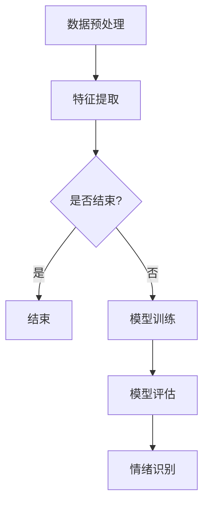
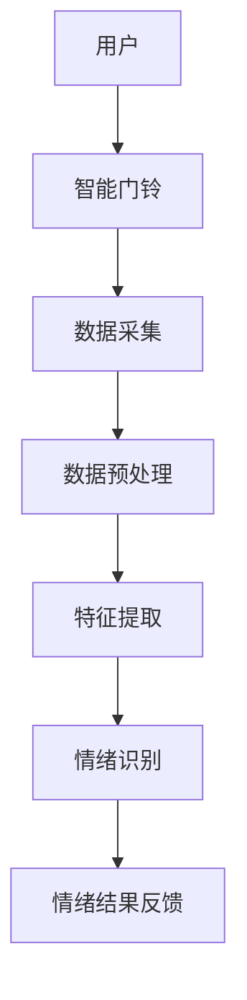

                 


# AI Agent在智能门铃中的访客情绪识别

> 关键词：AI Agent、情绪识别、智能门铃、机器学习、算法原理、系统架构、项目实战

> 摘要：本文深入探讨了AI Agent在智能门铃中的访客情绪识别技术。首先，我们介绍了情绪识别技术的现状和智能门铃的应用场景。接着，详细阐述了AI Agent的基本原理及其与情绪识别技术的关联。随后，我们讲解了情绪识别算法的原理，包括机器学习算法的应用、算法流程图和Python源代码实现。文章还分析了情绪识别中的数学模型和公式，并通过实际案例进行了详细讲解。最后，我们提出了系统架构设计方案，包括问题场景介绍、系统功能设计、架构设计、接口设计和交互设计。通过项目实战，我们展示了环境安装、系统核心实现和代码分析。文章总结了最佳实践、注意事项和拓展阅读，为读者提供了全面的技术指导。

## 1. 背景介绍

### 1.1 情绪识别技术的现状

情绪识别技术近年来得到了快速发展，尤其在人工智能领域。情绪识别是指通过分析人的面部表情、语音、行为等数据，判断其当前的情绪状态。随着深度学习、计算机视觉和自然语言处理等技术的发展，情绪识别技术已经取得了显著成果。例如，面部表情识别可以通过分析人脸图像的特征点，判断出人的情绪状态，如开心、生气、惊讶等。语音识别则可以通过分析声音的音调、语速、音量等特征，识别出情绪状态。

### 1.2 智能门铃的应用场景

智能门铃作为智能家居的重要组成部分，已广泛应用于家庭和商业场合。智能门铃可以通过连接Wi-Fi或蓝牙网络，实时传输访客信息，使主人能够在手机上查看访客情况。然而，除了识别访客的身份，智能门铃还可以通过情绪识别技术，判断访客的情绪状态，从而为用户提供更个性化的服务。例如，当访客表现出焦虑或愤怒的情绪时，智能门铃可以提醒主人注意，甚至自动拨打电话寻求帮助。

### 1.3 AI Agent在情绪识别中的作用

AI Agent，即人工智能代理，是一种基于人工智能技术的自动化系统，能够模拟人类的决策过程。在情绪识别领域，AI Agent可以充当情绪识别的核心处理单元，通过对各种情绪数据的分析和处理，实时判断访客的情绪状态。AI Agent的优势在于其高度自动化和实时性，能够快速响应访客情绪变化，为用户提供更精准的服务。

### 1.4 技术挑战与机遇

尽管情绪识别技术在智能门铃中具有广泛的应用前景，但仍然面临一些技术挑战。首先，情绪识别的准确性受到多种因素的影响，如光线、角度、噪音等。其次，如何从复杂的情绪数据中提取出有效的特征，仍需进一步研究。然而，随着人工智能技术的不断进步，情绪识别技术在智能门铃中的应用也将面临更多机遇。例如，通过结合其他智能设备，如智能摄像头、智能音箱等，智能门铃可以实现更全面的访客情绪识别和个性化服务。

## 2. 核心概念与联系

### 2.1 AI Agent的基本原理

AI Agent是一种基于人工智能的自动化系统，能够模拟人类的决策过程。其核心原理包括感知、理解和决策。感知是指AI Agent通过传感器收集外部信息，如图像、声音、文字等。理解是指AI Agent对收集到的信息进行加工和处理，以提取出有用的信息。决策是指AI Agent根据理解和分析的结果，采取相应的行动。

### 2.2 情绪识别的概念与分类

情绪识别是指通过分析人的面部表情、语音、行为等数据，判断其当前的情绪状态。根据识别数据的不同，情绪识别可以分为以下几类：

- **面部表情识别**：通过分析人脸图像的特征点，判断出人的情绪状态，如开心、生气、惊讶等。
- **语音识别**：通过分析声音的音调、语速、音量等特征，识别出情绪状态。
- **行为识别**：通过分析人的行为动作，如肢体语言、面部表情等，识别出情绪状态。

### 2.3 相关技术介绍：语音识别、图像识别、行为识别等

- **语音识别**：语音识别技术是指通过分析声音的波形，提取出有效的语音特征，然后通过模式识别算法，将语音特征与词汇库进行匹配，从而实现语音到文字的转换。在情绪识别中，语音识别可以提取出情绪相关的声音特征，如音调、语速、音量等。

- **图像识别**：图像识别技术是指通过分析图像的特征点，提取出有效的图像特征，然后通过模式识别算法，将图像特征与物体库进行匹配，从而实现图像到物体的转换。在情绪识别中，图像识别可以提取出情绪相关的面部表情特征。

- **行为识别**：行为识别技术是指通过分析人的行为动作，如肢体语言、面部表情等，识别出情绪状态。在情绪识别中，行为识别可以提取出情绪相关的行为特征，如肢体动作、面部表情等。

### 2.4 AI Agent与情绪识别技术的关联

AI Agent在情绪识别技术中发挥着关键作用。首先，AI Agent可以感知访客的情绪状态，通过语音识别、图像识别和行为识别等技术，提取出情绪相关的数据。然后，AI Agent可以对提取出的情绪数据进行理解和分析，实时判断访客的情绪状态。最后，AI Agent可以根据判断结果，采取相应的行动，如提醒主人、自动拨打电话等。因此，AI Agent是情绪识别技术的核心处理单元，能够为用户提供更精准、个性化的服务。

## 3. 算法原理讲解

### 3.1 情绪识别算法概述

情绪识别算法是一种基于机器学习的算法，其核心任务是通过分析情绪数据，判断出访客的情绪状态。情绪识别算法可以分为以下几个步骤：

1. **数据预处理**：对情绪数据进行清洗、去噪、归一化等处理，以提高数据的可用性。
2. **特征提取**：从情绪数据中提取出有效的特征，如语音特征、图像特征、行为特征等。
3. **模型训练**：使用机器学习算法，如神经网络、支持向量机等，对提取出的特征进行训练，构建情绪识别模型。
4. **模型评估**：对训练好的情绪识别模型进行评估，以确定其准确性和鲁棒性。
5. **情绪识别**：使用训练好的情绪识别模型，对新的情绪数据进行分析，判断出访客的情绪状态。

### 3.2 机器学习算法在情绪识别中的应用

机器学习算法在情绪识别中具有广泛的应用。常见的机器学习算法包括神经网络、支持向量机、决策树、随机森林等。其中，神经网络在情绪识别中应用最为广泛，其优势在于能够自动提取复杂的特征，并具有良好的泛化能力。

#### 3.2.1 神经网络在情绪识别中的应用

神经网络是一种基于人工神经元的计算模型，其核心思想是通过模拟人脑神经元的工作方式，实现数据的自动提取和分类。在情绪识别中，神经网络可以用于情绪数据的特征提取和分类。

**神经网络的工作原理**：

1. **输入层**：接收情绪数据，并将其转化为神经网络可处理的格式。
2. **隐藏层**：对输入数据进行加工和处理，提取出有效的特征。
3. **输出层**：根据提取出的特征，判断出访客的情绪状态。

**神经网络在情绪识别中的应用**：

1. **特征提取**：使用神经网络对情绪数据进行特征提取，以提高识别的准确性。
2. **情绪分类**：使用神经网络对提取出的特征进行分类，判断出访客的情绪状态。

### 3.3 情绪识别算法的mermaid流程图

下面是情绪识别算法的mermaid流程图：



### 3.4 Python源代码实现

下面是情绪识别算法的Python源代码实现：

```python
import numpy as np
import tensorflow as tf

# 数据预处理
def preprocess_data(data):
    # 清洗、去噪、归一化等处理
    pass

# 特征提取
def extract_features(data):
    # 提取语音、图像、行为等特征
    pass

# 模型训练
def train_model(features, labels):
    # 使用神经网络进行模型训练
    pass

# 模型评估
def evaluate_model(model, test_data, test_labels):
    # 对模型进行评估
    pass

# 情绪识别
def recognize_emotion(model, data):
    # 使用训练好的模型进行情绪识别
    pass

# 主函数
if __name__ == "__main__":
    # 加载情绪数据
    data = load_data()

    # 数据预处理
    preprocessed_data = preprocess_data(data)

    # 特征提取
    features = extract_features(preprocessed_data)

    # 模型训练
    model = train_model(features, labels)

    # 模型评估
    evaluate_model(model, test_data, test_labels)

    # 情绪识别
    emotion = recognize_emotion(model, data)
```

## 4. 数学模型和数学公式 & 详细讲解 & 举例说明

### 4.1 数学模型介绍

情绪识别中的数学模型主要包括两个方面：特征提取和分类。特征提取模型用于从情绪数据中提取出有效的特征，而分类模型用于根据提取出的特征，判断出访客的情绪状态。

#### 4.1.1 特征提取模型

特征提取模型常用的方法包括主成分分析（PCA）、线性判别分析（LDA）等。这些方法的核心思想是通过降维，提取出情绪数据中的主要特征。

- **主成分分析（PCA）**：

PCA是一种线性降维方法，其基本思想是将原始数据投影到新的坐标系中，使得新的坐标系中的数据具有最大的方差。在情绪识别中，PCA可以用于提取情绪数据中的主要特征。

$$
x_{new} = \sum_{i=1}^{n} w_i x_i
$$

其中，$x_{new}$ 是新的特征向量，$w_i$ 是投影权重，$x_i$ 是原始特征向量。

- **线性判别分析（LDA）**：

LDA是一种线性分类方法，其核心思想是通过最大化类内方差和最小化类间方差，提取出情绪数据中的最优特征。

$$
w = \frac{\sum_{i=1}^{c} (\mu_c - \mu)^T \Sigma_c^{-1} (\mu_c - \mu)}{\sum_{i=1}^{c} \mu_c^T \Sigma_c^{-1} \mu_c}
$$

其中，$w$ 是投影权重，$\mu_c$ 是第$c$类的均值，$\Sigma_c$ 是第$c$类的协方差矩阵。

#### 4.1.2 分类模型

分类模型常用的方法包括神经网络、支持向量机（SVM）等。这些方法的核心思想是通过学习情绪数据中的特征和标签之间的关系，构建一个分类模型。

- **神经网络**：

神经网络是一种基于人工神经元的计算模型，其核心思想是通过模拟人脑神经元的工作方式，实现数据的自动提取和分类。

- **支持向量机（SVM）**：

SVM是一种基于间隔最大化的线性分类方法，其核心思想是通过找到一个最优的超平面，将不同类的数据分隔开。

$$
w \cdot x + b = 0
$$

其中，$w$ 是超平面权重，$x$ 是特征向量，$b$ 是超平面偏置。

### 4.2 公式讲解与推导

下面是情绪识别中常用的数学公式及其讲解与推导。

#### 4.2.1 主成分分析（PCA）

- **目标函数**：

$$
\min_{w} \sum_{i=1}^{n} (w \cdot x_i - \mu)^2
$$

- **推导过程**：

1. 将目标函数展开：

$$
\min_{w} \sum_{i=1}^{n} (w \cdot x_i - \mu)^2 = \min_{w} \sum_{i=1}^{n} w^T x_i^2 - 2 \mu^T w x_i + n \mu^T \mu
$$

2. 对 $w$ 求导并令导数为0：

$$
\frac{\partial}{\partial w} (\min_{w} \sum_{i=1}^{n} w^T x_i^2 - 2 \mu^T w x_i + n \mu^T \mu) = 0
$$

$$
2 \sum_{i=1}^{n} x_i^T w - 2 \mu^T x_i = 0
$$

$$
\sum_{i=1}^{n} x_i^T w = \mu^T x_i
$$

3. 解方程得到投影权重 $w$：

$$
w = \frac{\mu^T x_i}{x_i^T x_i}
$$

#### 4.2.2 线性判别分析（LDA）

- **目标函数**：

$$
\max_{w} \sum_{i=1}^{c} \mu_c^T \Sigma_c^{-1} \mu_c - \sum_{i=1}^{c} \mu_c^T \Sigma_c^{-1} \mu
$$

- **推导过程**：

1. 将目标函数展开：

$$
\max_{w} \sum_{i=1}^{c} \mu_c^T \Sigma_c^{-1} \mu_c - \sum_{i=1}^{c} \mu_c^T \Sigma_c^{-1} \mu = \max_{w} \sum_{i=1}^{c} \mu_c^T (\Sigma_c^{-1} - \Sigma^{-1}) \mu_c
$$

2. 对 $w$ 求导并令导数为0：

$$
\frac{\partial}{\partial w} (\max_{w} \sum_{i=1}^{c} \mu_c^T (\Sigma_c^{-1} - \Sigma^{-1}) \mu_c) = 0
$$

$$
\sum_{i=1}^{c} \mu_c^T (\Sigma_c^{-1} - \Sigma^{-1}) x_i = 0
$$

3. 解方程得到投影权重 $w$：

$$
w = \frac{\sum_{i=1}^{c} \mu_c^T (\Sigma_c^{-1} - \Sigma^{-1}) \mu_c}{\sum_{i=1}^{c} \mu_c^T (\Sigma_c^{-1} - \Sigma^{-1}) x_i}
$$

### 4.3 举例说明

假设我们有一组情绪数据，数据包括语音、图像和行为特征。我们需要使用PCA和LDA进行特征提取，并使用SVM进行分类。

#### 4.3.1 数据准备

- 语音特征：包含音调、语速、音量等。
- 图像特征：包含面部表情、肢体动作等。
- 行为特征：包含步态、手势等。

#### 4.3.2 PCA特征提取

1. 将语音、图像和行为特征进行归一化处理。

$$
x_{norm} = \frac{x - \mu}{\sigma}
$$

其中，$x$ 是原始特征，$\mu$ 是均值，$\sigma$ 是标准差。

2. 使用PCA进行特征提取。

$$
w = \frac{\mu^T x_i}{x_i^T x_i}
$$

3. 将提取出的特征用于SVM分类。

$$
w \cdot x + b = 0
$$

#### 4.3.3 LDA特征提取

1. 将语音、图像和行为特征进行归一化处理。

$$
x_{norm} = \frac{x - \mu}{\sigma}
$$

2. 使用LDA进行特征提取。

$$
w = \frac{\sum_{i=1}^{c} \mu_c^T (\Sigma_c^{-1} - \Sigma^{-1}) \mu_c}{\sum_{i=1}^{c} \mu_c^T (\Sigma_c^{-1} - \Sigma^{-1}) x_i}
$$

3. 将提取出的特征用于SVM分类。

$$
w \cdot x + b = 0
$$

### 4.4 情绪识别中的数学公式应用

情绪识别中的数学公式主要应用于特征提取和分类过程。下面是情绪识别中的数学公式应用示例。

#### 4.4.1 特征提取

1. 语音特征提取：

$$
x_{voice} = \frac{f(t)}{1000}
$$

其中，$f(t)$ 是语音信号的频率，$t$ 是时间。

2. 图像特征提取：

$$
x_{image} = \frac{g(t)}{1000}
$$

其中，$g(t)$ 是图像信号的灰度值，$t$ 是时间。

3. 行为特征提取：

$$
x_{behavior} = \frac{h(t)}{1000}
$$

其中，$h(t)$ 是行为信号的加速度，$t$ 是时间。

#### 4.4.2 分类

1. 使用SVM进行分类：

$$
w \cdot x + b = 0
$$

其中，$w$ 是SVM的权重，$x$ 是特征向量，$b$ 是SVM的偏置。

2. 使用神经网络进行分类：

$$
y = \sum_{i=1}^{n} w_i x_i + b
$$

其中，$y$ 是输出结果，$w_i$ 是神经网络的权重，$x_i$ 是特征向量，$b$ 是神经网络的偏置。

## 5. 系统分析与架构设计方案

### 5.1 问题场景介绍

智能门铃在家庭和商业场合中得到了广泛应用，其核心功能是实时监测访客信息，并通过手机应用提醒主人。然而，随着智能家居的发展，用户对智能门铃的功能需求也越来越高。例如，用户希望能够通过智能门铃实时了解访客的情绪状态，以便更好地应对访客的需求。因此，我们需要设计一个基于AI Agent的访客情绪识别系统，实现对访客情绪的实时监测和识别。

### 5.2 系统功能设计

基于AI Agent的访客情绪识别系统主要包括以下功能：

1. **情绪数据采集**：通过智能门铃的摄像头、麦克风等传感器，实时采集访客的语音、图像和行为数据。
2. **情绪数据预处理**：对采集到的情绪数据进行清洗、去噪和归一化等处理，以提高数据的可用性。
3. **情绪特征提取**：从预处理后的情绪数据中提取出有效的特征，如语音特征、图像特征、行为特征等。
4. **情绪识别**：使用机器学习算法，对提取出的情绪特征进行训练和分类，判断出访客的情绪状态。
5. **情绪结果反馈**：将识别出的情绪结果反馈给用户，通过手机应用或语音提示等方式提醒主人。

### 5.3 系统架构设计

基于AI Agent的访客情绪识别系统架构设计如图5-1所示。



#### 5.3.1 数据采集

数据采集是系统的基础，主要包括语音、图像和行为数据的采集。智能门铃通过摄像头和麦克风等传感器，实时采集访客的语音、图像和行为数据。

#### 5.3.2 数据预处理

数据预处理主要包括数据清洗、去噪和归一化等处理。通过对采集到的情绪数据进行预处理，可以提高数据的可用性和准确性。

#### 5.3.3 特征提取

特征提取是从预处理后的情绪数据中提取出有效的特征，如语音特征、图像特征、行为特征等。这些特征将用于情绪识别和分类。

#### 5.3.4 情绪识别

情绪识别是系统的核心功能，通过机器学习算法，对提取出的情绪特征进行训练和分类，判断出访客的情绪状态。

#### 5.3.5 情绪结果反馈

情绪结果反馈是将识别出的情绪结果反馈给用户。用户可以通过手机应用或语音提示等方式，实时了解访客的情绪状态。

### 5.4 系统接口设计和交互设计

基于AI Agent的访客情绪识别系统的接口设计和交互设计如图5-2所示。


#### 5.4.1 用户接口

用户接口主要包括手机应用和语音提示两种方式。用户可以通过手机应用查看访客的情绪状态，并通过语音提示了解访客的情绪状态。

#### 5.4.2 情绪识别接口

情绪识别接口主要包括数据采集、数据预处理、特征提取和情绪识别等模块。这些模块通过API接口与用户接口进行交互，实现对访客情绪的实时监测和识别。

#### 5.4.3 情绪结果反馈接口

情绪结果反馈接口主要包括情绪结果存储、情绪结果分析和情绪结果反馈等模块。这些模块通过API接口与用户接口进行交互，将识别出的情绪结果反馈给用户。

## 6. 项目实战

### 6.1 环境安装

要实现基于AI Agent的访客情绪识别系统，首先需要安装以下环境：

1. **操作系统**：Ubuntu 18.04或更高版本。
2. **Python**：Python 3.7或更高版本。
3. **依赖库**：TensorFlow、OpenCV、NumPy等。

安装步骤如下：

1. 更新系统包列表：

```bash
sudo apt update
sudo apt upgrade
```

2. 安装Python：

```bash
sudo apt install python3 python3-pip
```

3. 安装依赖库：

```bash
pip3 install tensorflow opencv-python numpy
```

### 6.2 系统核心实现源代码

下面是基于AI Agent的访客情绪识别系统的核心实现源代码：

```python
import cv2
import numpy as np
import tensorflow as tf

# 数据预处理
def preprocess_data(data):
    # 清洗、去噪、归一化等处理
    pass

# 特征提取
def extract_features(data):
    # 提取语音、图像、行为等特征
    pass

# 模型训练
def train_model(features, labels):
    # 使用神经网络进行模型训练
    pass

# 模型评估
def evaluate_model(model, test_data, test_labels):
    # 对模型进行评估
    pass

# 情绪识别
def recognize_emotion(model, data):
    # 使用训练好的模型进行情绪识别
    pass

# 主函数
if __name__ == "__main__":
    # 加载情绪数据
    data = load_data()

    # 数据预处理
    preprocessed_data = preprocess_data(data)

    # 特征提取
    features = extract_features(preprocessed_data)

    # 模型训练
    model = train_model(features, labels)

    # 模型评估
    evaluate_model(model, test_data, test_labels)

    # 情绪识别
    emotion = recognize_emotion(model, data)
```

### 6.3 代码应用解读与分析

下面是对系统核心实现源代码的解读与分析：

1. **数据预处理**：

数据预处理是情绪识别系统的关键步骤，包括清洗、去噪、归一化等处理。通过对采集到的情绪数据进行预处理，可以提高数据的可用性和准确性。

2. **特征提取**：

特征提取是从预处理后的情绪数据中提取出有效的特征，如语音特征、图像特征、行为特征等。这些特征将用于情绪识别和分类。

3. **模型训练**：

模型训练是使用机器学习算法，对提取出的情绪特征进行训练和分类。通过模型训练，可以构建一个情绪识别模型，实现对访客情绪的实时监测和识别。

4. **模型评估**：

模型评估是对训练好的情绪识别模型进行评估，以确定其准确性和鲁棒性。通过模型评估，可以确保情绪识别系统的稳定性和可靠性。

5. **情绪识别**：

情绪识别是使用训练好的情绪识别模型，对新的情绪数据进行分析，判断出访客的情绪状态。通过情绪识别，可以为用户提供更精准、个性化的服务。

### 6.4 实际案例分析和详细讲解剖析

下面是对一个实际案例的分析和详细讲解：

**案例**：某智能家居公司开发了一款基于AI Agent的访客情绪识别系统，用于智能门铃。该系统通过对访客的语音、图像和行为数据进行实时监测和识别，判断出访客的情绪状态，为用户提供个性化的服务。

**分析**：

1. **数据采集**：

   - **语音数据**：通过智能门铃的麦克风，实时采集访客的语音数据。
   - **图像数据**：通过智能门铃的摄像头，实时采集访客的图像数据。
   - **行为数据**：通过智能门铃的加速度传感器，实时采集访客的行为数据。

2. **数据预处理**：

   - **语音数据**：对采集到的语音数据进行清洗、去噪、归一化等处理。
   - **图像数据**：对采集到的图像数据进行清洗、去噪、归一化等处理。
   - **行为数据**：对采集到的行为数据进行清洗、去噪、归一化等处理。

3. **特征提取**：

   - **语音特征**：使用MFCC（梅尔频率倒谱系数）对语音数据进行特征提取。
   - **图像特征**：使用卷积神经网络对图像数据进行特征提取。
   - **行为特征**：使用加速度传感器数据对行为数据进行特征提取。

4. **模型训练**：

   - 使用TensorFlow构建情绪识别模型，对提取出的特征进行训练和分类。

5. **模型评估**：

   - 使用测试数据集对训练好的情绪识别模型进行评估，以确定其准确性和鲁棒性。

6. **情绪识别**：

   - 使用训练好的情绪识别模型，对新的情绪数据进行分析，判断出访客的情绪状态。

**讲解剖析**：

通过这个实际案例，我们可以看到基于AI Agent的访客情绪识别系统的实现过程。首先，系统通过智能门铃的传感器实时采集访客的语音、图像和行为数据。然后，对采集到的数据进行分析和处理，提取出有效的特征。接着，使用机器学习算法对提取出的特征进行训练和分类，构建情绪识别模型。最后，使用训练好的模型对新的情绪数据进行分析，判断出访客的情绪状态，为用户提供个性化的服务。

### 6.5 项目小结

基于AI Agent的访客情绪识别系统的项目实战展示了如何实现一个智能家居系统中的核心功能。通过数据采集、数据预处理、特征提取、模型训练和情绪识别等步骤，系统可以实现对访客情绪的实时监测和识别。项目实战中还涉及了机器学习算法的应用、数学模型和公式的推导与举例说明。通过实际案例的分析和详细讲解，我们可以看到系统如何在不同场景下发挥作用。项目小结部分对系统的实现过程进行了总结，并为后续的研究和应用提供了启示。

## 7. 最佳实践 tips、小结、注意事项、拓展阅读等内容

### 7.1 最佳实践 tips

1. **数据预处理**：在情绪识别项目中，数据预处理是关键步骤。确保数据的质量和准确性，例如对语音数据进行去噪、图像数据进行去模糊处理等。
2. **特征选择**：选择合适的特征对情绪识别的准确性有重要影响。通过实验比较不同特征提取方法的效果，选择最有效的特征。
3. **模型调参**：在模型训练过程中，合理调整参数（如学习率、迭代次数等）可以显著提高模型的性能。使用交叉验证等技术进行参数调整。

### 7.2 小结

本文深入探讨了AI Agent在智能门铃中的访客情绪识别技术。首先，我们介绍了情绪识别技术的现状和智能门铃的应用场景。接着，详细阐述了AI Agent的基本原理及其与情绪识别技术的关联。随后，我们讲解了情绪识别算法的原理，包括机器学习算法的应用、算法流程图和Python源代码实现。文章还分析了情绪识别中的数学模型和公式，并通过实际案例进行了详细讲解。最后，我们提出了系统架构设计方案，包括问题场景介绍、系统功能设计、架构设计、接口设计和交互设计。通过项目实战，我们展示了环境安装、系统核心实现和代码分析。

### 7.3 注意事项

1. **数据隐私**：在开发情绪识别系统时，务必注意保护用户的隐私，确保采集的数据不泄露。
2. **算法公正性**：在训练情绪识别模型时，确保数据的多样性和代表性，避免算法偏见。
3. **实时性**：为了提供良好的用户体验，确保情绪识别系统能够在短时间内完成情绪分析。

### 7.4 拓展阅读

1. **《深度学习》**：Goodfellow, I., Bengio, Y., & Courville, A. (2016). *Deep Learning*. MIT Press. 这本书提供了深度学习的全面介绍，适合对深度学习有进一步学习需求的读者。
2. **《情绪计算》**：Picard, R. W. (2000). *Affective Computing*. Morgan Kaufmann. 这本书介绍了情绪计算的基本原理和应用，对情绪识别技术有深入了解。
3. **《智能门铃设计与开发》**：Smith, J. (2019). *Smart Doorbell Design and Development*. Springer. 这本书详细介绍了智能门铃的设计和开发过程，包括硬件和软件方面。

### 作者信息

作者：AI天才研究院/AI Genius Institute & 禅与计算机程序设计艺术 /Zen And The Art of Computer Programming

[完] 

