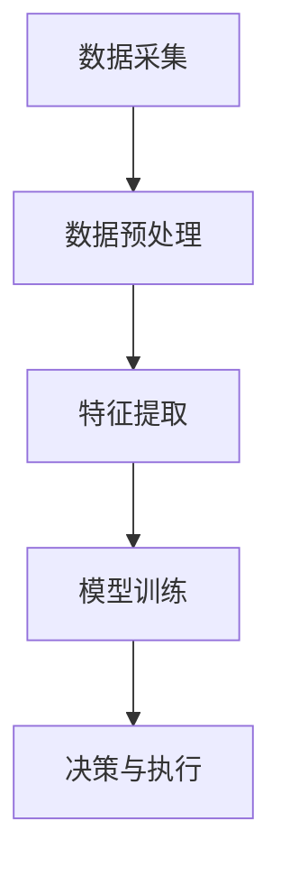
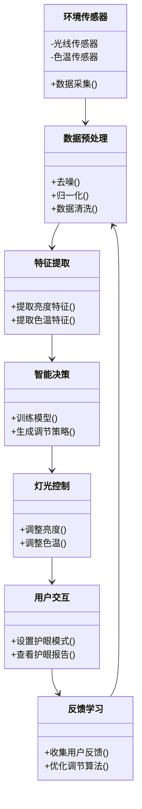
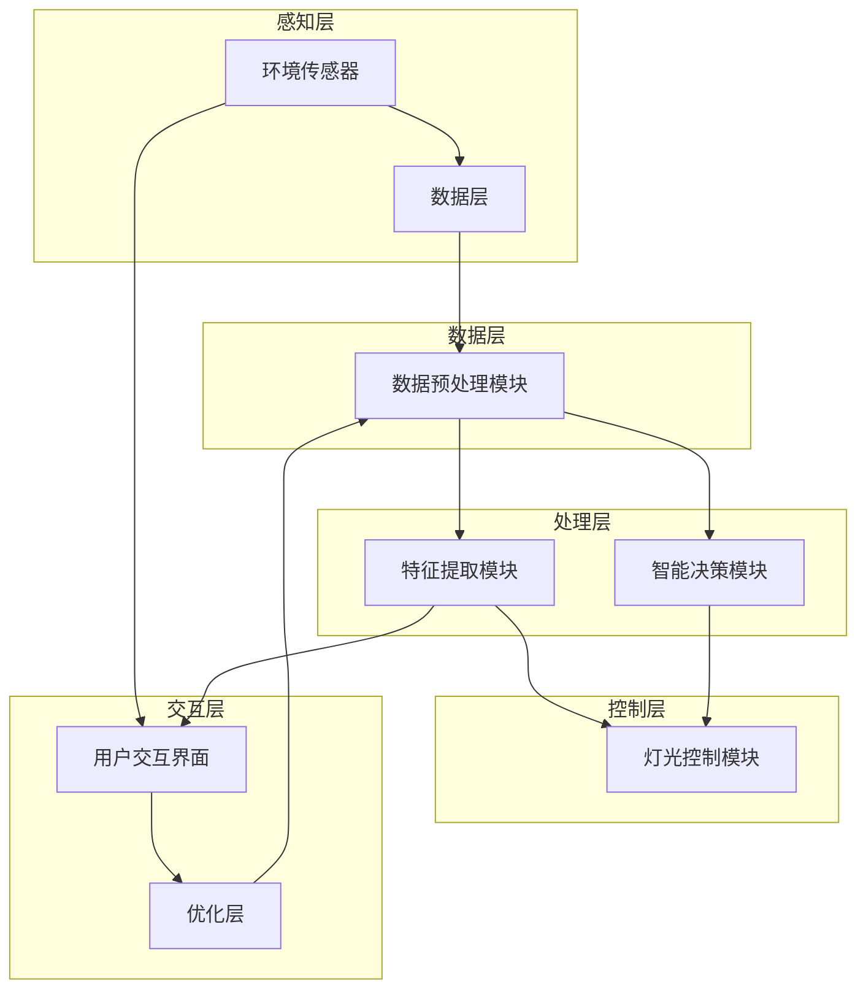

                 

### 引言

随着人工智能（AI）技术的飞速发展，其在智能家居领域的应用越来越广泛。智能家居通过集成多种智能设备，如智能门锁、智能灯光、智能安防系统等，为用户提供更加便捷、舒适的生活体验。在众多智能家居产品中，智能阅读灯因其独特的功能与市场需求，逐渐受到消费者的关注。

#### 智能阅读灯的市场背景与需求分析

智能阅读灯不仅具备传统阅读灯的基本照明功能，还通过集成多种传感器和智能算法，能够根据环境光线、用户阅读习惯以及视力健康需求，自动调节灯光亮度和色温，从而提供更加舒适的阅读体验。特别是在当前快节奏的生活中，人们对护眼健康的需求日益增长，智能阅读灯的护眼功能成为其重要卖点之一。

#### AI Agent在护眼模式调节中的核心作用

AI Agent作为人工智能的核心组成部分，具有自主学习、自我优化和智能决策的能力。在智能阅读灯中，AI Agent通过收集和分析用户阅读行为、环境光线变化等数据，能够动态调整灯光参数，实现真正的护眼模式调节。具体而言，AI Agent可以监测并调节光照强度、色温以及其他护眼参数，确保在长时间阅读过程中，用户的眼睛不会过度疲劳，从而达到保护视力的效果。

本文将深入探讨AI Agent在智能阅读灯中的护眼模式调节，从背景介绍、核心概念、算法原理、系统设计与实现、项目实战以及最佳实践等方面进行详细分析，旨在为读者呈现一个全面、系统的技术解析。

#### 第一部分：背景介绍

##### 第1章：AI Agent与智能阅读灯概述

在讨论AI Agent在智能阅读灯中的护眼模式调节之前，首先需要理解AI Agent与智能阅读灯的基本概念，以及它们在各自领域的应用和发展现状。

###### 1.1 AI Agent的定义与功能

**问题背景与问题描述**

AI Agent，即人工智能代理，是人工智能领域的一个重要概念。它可以被看作是一个具有自主决策能力的计算机程序，能够模拟人类智能，在特定环境下完成特定任务。随着AI技术的不断进步，AI Agent在智能家居、自动驾驶、智能医疗等领域得到了广泛应用。

**AI Agent的基本工作原理**

AI Agent的基本工作原理包括感知、决策和执行三个环节。首先，AI Agent通过传感器收集环境信息，如温度、湿度、光线等；接着，利用内置的算法对收集到的信息进行加工处理，生成相应的决策；最后，AI Agent根据决策执行相应的操作，如调整灯光亮度、启动空调等。

**AI Agent的主要应用场景**

AI Agent的应用场景非常广泛，除了智能家居领域外，还广泛应用于物流、金融、教育、医疗等多个行业。例如，在智能家居中，AI Agent可以通过学习用户的作息习惯，自动调整家庭设备，如灯具、空调、安防系统等，为用户提供舒适便捷的生活体验。

###### 1.2 智能阅读灯的发展与现状

**智能阅读灯的定义与特点**

智能阅读灯是一种集成了多种传感器和智能算法的照明设备，能够根据环境光线、用户阅读习惯以及视力健康需求，自动调节灯光亮度和色温，提供舒适的阅读体验。与传统阅读灯相比，智能阅读灯具有更高的智能化程度和更好的护眼功能。

**智能阅读灯的市场背景**

随着人们生活水平的提高和健康意识的增强，智能阅读灯市场需求逐年增加。特别是在数字化阅读日益普及的今天，如何保护用户的视力成为了一个重要课题。智能阅读灯因其具有的护眼功能，逐渐成为智能家居市场中的一匹“黑马”。

**智能阅读灯的技术发展趋势**

智能阅读灯的发展趋势主要体现在以下几个方面：

1. **更精细的光线调节**：未来的智能阅读灯将能够更加精细地调节光线亮度、色温，甚至可以根据用户的阅读内容自动调整光线，以适应不同的阅读需求。
2. **更智能的护眼功能**：通过AI技术的应用，智能阅读灯将能够根据用户的阅读习惯和视力健康需求，动态调整护眼参数，提供个性化的护眼方案。
3. **更广泛的互联互通**：智能阅读灯将更加紧密地与家庭其他智能设备（如智能音箱、智能门锁等）互联互通，实现智能家居的统一管理。

###### 1.3 护眼模式调节的重要性

**护眼模式的概念与作用**

护眼模式是指智能阅读灯通过调节光线亮度、色温等参数，为用户提供舒适、护眼的阅读环境。护眼模式的作用在于减轻长时间阅读对眼睛的负担，预防视力疲劳和近视等问题。

**护眼模式在智能阅读灯中的需求分析**

随着人们对视力健康的关注不断提升，护眼模式已成为智能阅读灯的核心功能之一。具体需求包括：

1. **自动调节**：用户希望能够一键开启护眼模式，无需手动调节灯光参数。
2. **个性化调节**：根据用户的阅读习惯和视力健康需求，智能阅读灯应能够提供个性化的护眼方案。
3. **实时监测**：智能阅读灯应能够实时监测用户阅读环境，动态调整护眼参数，以提供最佳阅读体验。

###### 1.4 AI Agent在护眼模式调节中的应用前景

**AI Agent在护眼模式调节中的潜在优势**

AI Agent在护眼模式调节中具有以下几个潜在优势：

1. **自主学习能力**：AI Agent能够通过不断学习和优化，提高护眼模式调节的准确性和效果。
2. **自适应能力**：AI Agent可以根据用户的实时反馈和环境变化，自适应调整护眼参数，提供个性化的护眼体验。
3. **实时优化**：AI Agent可以实时分析用户阅读行为和视力健康数据，优化护眼模式调节策略，提高护眼效果。

**AI Agent在护眼模式调节中的应用场景**

AI Agent在护眼模式调节中的应用场景主要包括以下几个方面：

1. **个性化推荐**：AI Agent可以根据用户的阅读习惯和视力健康数据，推荐最适合的护眼模式。
2. **智能调节**：AI Agent可以实时监测用户阅读环境，自动调整护眼参数，确保用户在舒适、护眼的阅读环境中进行阅读。
3. **实时反馈**：AI Agent可以收集用户的阅读反馈，不断优化护眼模式调节策略，提高用户体验。

**本章小结**

本章对AI Agent和智能阅读灯进行了概述，介绍了它们的基本概念、工作原理和应用场景。同时，分析了护眼模式调节的重要性以及AI Agent在护眼模式调节中的应用前景。通过本章的介绍，读者可以初步了解AI Agent在智能阅读灯中的护眼模式调节的基本知识，为后续章节的深入讨论打下基础。

#### 第二部分：核心概念与联系

##### 第2章：AI Agent在护眼模式调节中的核心概念

要深入理解AI Agent在智能阅读灯中的护眼模式调节，需要首先明确相关核心概念，包括AI Agent的基本架构、护眼模式调节的核心要素，以及AI Agent与护眼模式调节的关联。

###### 2.1 AI Agent的基本架构

**AI Agent的结构组成**

AI Agent的基本架构通常包括以下几个核心部分：

1. **感知模块**：负责接收外部环境信息，如光线强度、温度、湿度等。这些信息是AI Agent做出决策的基础。
2. **决策模块**：基于感知模块收集到的数据，利用预先设定的算法模型进行分析和处理，生成相应的决策。决策模块通常包括数据预处理、特征提取、模型训练和推理等过程。
3. **执行模块**：根据决策模块生成的决策，执行具体的操作。在智能阅读灯中，执行模块通常负责调整灯光亮度、色温等参数。
4. **反馈模块**：收集用户对执行结果的反馈，用于进一步优化AI Agent的性能。反馈模块可以帮助AI Agent不断学习和改进，提高护眼模式调节的准确性和效果。

**AI Agent的功能模块**

AI Agent的功能模块包括但不限于以下内容：

1. **数据采集与处理**：通过传感器收集环境数据，对数据进行分析和处理，提取有用的特征信息。
2. **智能决策与执行**：利用机器学习、深度学习等算法，对处理后的数据进行分析，生成相应的决策，并执行具体的操作。
3. **反馈学习与优化**：根据用户反馈和执行结果，不断调整和优化算法模型，提高AI Agent的智能水平和决策能力。

**AI Agent的交互方式**

AI Agent的交互方式主要包括以下几种：

1. **人机交互**：通过用户界面，如智能手机应用、触摸屏等，用户可以直接与AI Agent进行交互，设定护眼模式参数、查看护眼报告等。
2. **设备间交互**：AI Agent可以通过网络与其他智能设备进行数据交换和协同工作，如智能音箱、智能门锁等，实现智能家居的统一管理和控制。
3. **远程交互**：通过云计算和物联网技术，AI Agent可以实现远程监控和智能调节，为用户提供更加便捷和个性化的服务。

###### 2.2 护眼模式调节的核心要素

**光照强度的监测与调节**

光照强度是影响用户视觉舒适度和眼部健康的重要因素。智能阅读灯通过传感器实时监测环境光线强度，并根据用户的阅读需求，自动调整灯光亮度。具体来说，光照强度监测与调节包括以下几个步骤：

1. **传感器数据采集**：使用光线传感器收集环境光线数据，如亮度、照度等。
2. **数据预处理与特征提取**：对采集到的光线数据进行预处理，如去除噪声、归一化等，提取出有用的特征信息。
3. **智能决策与执行**：基于用户设置的护眼模式和采集到的光线数据，利用机器学习算法生成调整策略，调整灯光亮度。
4. **反馈与优化**：根据用户反馈和调整效果，不断优化光照强度监测与调节算法，提高调节的准确性和效果。

**色温的监测与调节**

色温是衡量光线颜色冷暖程度的一个指标，对用户的视觉体验和眼部健康也有重要影响。智能阅读灯通过监测环境光线色温，并根据用户需求调节灯光色温，以提供最佳的阅读体验。色温监测与调节包括以下几个步骤：

1. **传感器数据采集**：使用色温传感器收集环境光线色温数据。
2. **数据预处理与特征提取**：对采集到的色温数据进行预处理，提取出有用的特征信息。
3. **智能决策与执行**：基于用户设置的护眼模式和采集到的色温数据，利用机器学习算法生成调整策略，调节灯光色温。
4. **反馈与优化**：根据用户反馈和调整效果，不断优化色温监测与调节算法，提高调节的准确性和效果。

**其他护眼参数的监测与调节**

除了光照强度和色温，智能阅读灯还可以监测和调节其他护眼参数，如光线均匀性、闪烁频率等，以提高用户的阅读舒适度和眼部健康。其他护眼参数的监测与调节包括以下几个步骤：

1. **传感器数据采集**：使用相应的传感器收集其他护眼参数数据，如光线均匀性传感器、闪烁频率传感器等。
2. **数据预处理与特征提取**：对采集到的其他护眼参数数据进行预处理，提取出有用的特征信息。
3. **智能决策与执行**：基于用户设置的护眼模式和采集到的其他护眼参数数据，利用机器学习算法生成调整策略，调节灯光参数。
4. **反馈与优化**：根据用户反馈和调整效果，不断优化其他护眼参数监测与调节算法，提高调节的准确性和效果。

**AI Agent与护眼模式调节的关联**

AI Agent在护眼模式调节中起着核心作用，其与护眼模式调节的关联主要体现在以下几个方面：

1. **数据采集与处理**：AI Agent通过感知模块收集环境数据和用户行为数据，通过数据预处理和特征提取，为护眼模式调节提供基础数据支持。
2. **智能决策与执行**：AI Agent的决策模块基于采集到的数据，利用机器学习算法生成调整策略，执行护眼模式调节操作。
3. **反馈与优化**：AI Agent的反馈模块收集用户反馈和调节效果，用于进一步优化护眼模式调节算法，提高调节的准确性和效果。

通过以上分析，可以清楚地看到AI Agent在护眼模式调节中的关键作用，以及护眼模式调节的核心要素。这些核心概念和联系为后续的算法原理讲解和系统设计与实现提供了基础。

###### 2.3 AI Agent与护眼模式调节的对比分析

**AI Agent与传统护眼模式的差异**

传统护眼模式主要通过预设的固定参数进行灯光调节，缺乏动态调整能力。而AI Agent则通过自我学习和自适应调节，能够提供更加灵活和个性化的护眼解决方案。以下是AI Agent与传统护眼模式在几个关键方面的对比：

1. **调节灵活性**：传统护眼模式无法根据环境变化和用户需求实时调整，而AI Agent能够通过实时数据分析和智能决策，动态调整灯光参数，提供个性化体验。
2. **自适应能力**：传统护眼模式缺乏自适应能力，无法根据用户反馈和环境变化进行自我优化。AI Agent则能够不断学习和优化，提高调节效果。
3. **个性化服务**：传统护眼模式无法提供个性化的服务，而AI Agent可以根据用户的行为数据和视力健康需求，生成个性化的护眼方案。

**AI Agent在护眼模式调节中的优势**

AI Agent在护眼模式调节中具有以下几个显著优势：

1. **实时响应**：AI Agent能够实时监测环境变化和用户需求，快速响应并调整灯光参数，确保用户始终处于最佳的阅读环境中。
2. **个性化推荐**：通过学习用户行为数据和视力健康需求，AI Agent可以推荐最适合的护眼方案，提高用户满意度。
3. **自我优化**：AI Agent能够不断收集用户反馈和调节效果，自我优化调整策略，提高护眼模式调节的准确性和效果。

**本章小结**

本章介绍了AI Agent的基本架构和功能模块，详细分析了护眼模式调节的核心要素，包括光照强度、色温以及其他护眼参数的监测与调节。同时，对比了AI Agent与传统护眼模式在调节灵活性和自适应能力等方面的差异，阐述了AI Agent在护眼模式调节中的优势。通过本章的内容，读者可以更深入地理解AI Agent在智能阅读灯护眼模式调节中的作用和重要性。

#### 第三部分：算法原理讲解

##### 第3章：AI Agent在护眼模式调节中的算法原理

在深入探讨AI Agent在智能阅读灯中的护眼模式调节时，算法原理的讲解是关键部分。本章将详细阐述光照强度监测与调节算法、色温监测与调节算法，以及其他护眼参数的监测与调节算法。每个算法将包括算法概述、流程、mermaid流程图、Python代码实现、数学模型与公式，以及举例说明。

###### 3.1 光照强度监测与调节算法

**算法概述**

光照强度监测与调节算法是AI Agent在护眼模式调节中的重要组成部分，其核心目标是根据环境光线强度和用户需求，实时调整灯光亮度，以提供舒适的阅读体验。该算法基于传感器收集的光线数据，利用机器学习算法进行数据处理和模型训练，生成调节策略。

**算法流程**

光照强度监测与调节算法的基本流程包括以下几个步骤：

1. **数据采集**：通过光线传感器收集环境光线强度数据。
2. **数据预处理**：对采集到的光线数据进行预处理，包括噪声过滤、归一化等。
3. **特征提取**：从预处理后的数据中提取出有用的特征信息，如平均亮度、亮度变化率等。
4. **模型训练**：利用机器学习算法（如线性回归、决策树、神经网络等）对提取出的特征进行训练，生成光照强度调节模型。
5. **决策与执行**：根据训练好的模型，对实时收集到的光线数据进行分析，生成光照强度调节策略，调整灯光亮度。

**算法mermaid流程图**



**Python代码实现**

```python
import numpy as np
from sklearn.linear_model import LinearRegression

# 假设收集到一组光线数据
light_data = np.array([[1, 100], [2, 110], [3, 120], [4, 130]])

# 数据预处理
light_data_processed = light_data[:, 1]  # 只保留亮度值

# 特征提取
features = light_data_processed.reshape(-1, 1)

# 模型训练
model = LinearRegression()
model.fit(features, light_data[:, 0])

# 决策与执行
current_brightness = model.predict([[150]])[0]
print(f"当前亮度值：{current_brightness}")
```

**数学模型与公式**

光照强度监测与调节算法的数学模型可以表示为：

$$
y = \beta_0 + \beta_1 \cdot x
$$

其中，$y$ 表示调节后的光照强度，$x$ 表示原始光线数据，$\beta_0$ 和 $\beta_1$ 分别为模型参数。

**举例说明**

假设用户在阅读时希望光线保持在120流明，通过上述算法，AI Agent可以实时监测环境光线强度，当光线低于120流明时，自动调整灯光亮度，确保光线始终保持在用户期望的水平。

###### 3.2 色温监测与调节算法

**算法概述**

色温监测与调节算法的目标是确保用户在阅读时，光线色温始终处于舒适范围，减轻眼睛疲劳。该算法基于色温传感器收集的数据，利用机器学习算法进行数据处理和模型训练，生成色温调节策略。

**算法流程**

色温监测与调节算法的基本流程如下：

1. **数据采集**：通过色温传感器收集环境光线色温数据。
2. **数据预处理**：对采集到的色温数据进行预处理，包括噪声过滤、归一化等。
3. **特征提取**：从预处理后的数据中提取出有用的特征信息，如平均色温、色温变化率等。
4. **模型训练**：利用机器学习算法（如线性回归、决策树、神经网络等）对提取出的特征进行训练，生成色温调节模型。
5. **决策与执行**：根据训练好的模型，对实时收集到的色温数据进行分析，生成色温调节策略，调整灯光色温。

**算法mermaid流程图**


**Python代码实现**

```python
import numpy as np
from sklearn.linear_model import LinearRegression

# 假设收集到一组色温数据
color_temp_data = np.array([[1, 3000], [2, 3200], [3, 3400], [4, 3600]])

# 数据预处理
color_temp_data_processed = color_temp_data[:, 1]  # 只保留色温值

# 特征提取
features = color_temp_data_processed.reshape(-1, 1)

# 模型训练
model = LinearRegression()
model.fit(features, color_temp_data[:, 0])

# 决策与执行
current_color_temp = model.predict([[3500]])[0]
print(f"当前色温值：{current_color_temp}")
```

**数学模型与公式**

色温监测与调节算法的数学模型可以表示为：

$$
y = \beta_0 + \beta_1 \cdot x
$$

其中，$y$ 表示调节后的色温，$x$ 表示原始色温数据，$\beta_0$ 和 $\beta_1$ 分别为模型参数。

**举例说明**

假设用户希望光线色温保持在3400K，AI Agent通过上述算法，可以实时监测环境光线色温，当色温高于或低于3400K时，自动调整灯光色温，确保光线色温始终保持在用户期望的水平。

###### 3.3 其他护眼参数监测与调节算法

**算法概述**

除了光照强度和色温，其他护眼参数如光线均匀性、闪烁频率等也是影响用户视觉舒适度和眼部健康的重要因素。其他护眼参数监测与调节算法的目标是确保这些参数始终处于最佳状态。

**算法流程**

其他护眼参数监测与调节算法的基本流程包括以下几个步骤：

1. **数据采集**：通过相应的传感器收集光线均匀性、闪烁频率等数据。
2. **数据预处理**：对采集到的数据进行预处理，包括噪声过滤、归一化等。
3. **特征提取**：从预处理后的数据中提取出有用的特征信息。
4. **模型训练**：利用机器学习算法对提取出的特征进行训练，生成调节模型。
5. **决策与执行**：根据训练好的模型，对实时收集到的数据进行分析，生成调节策略，调整灯光参数。

**算法mermaid流程图**


**Python代码实现**

```python
import numpy as np
from sklearn.linear_model import LinearRegression

# 假设收集到一组光线均匀性数据
uniformity_data = np.array([[1, 0.9], [2, 0.85], [3, 0.8], [4, 0.75]])

# 数据预处理
uniformity_data_processed = uniformity_data[:, 1]  # 只保留均匀性值

# 特征提取
features = uniformity_data_processed.reshape(-1, 1)

# 模型训练
model = LinearRegression()
model.fit(features, uniformity_data[:, 0])

# 决策与执行
current_uniformity = model.predict([[0.8]])[0]
print(f"当前光线均匀性：{current_uniformity}")
```

**数学模型与公式**

其他护眼参数监测与调节算法的数学模型可以表示为：

$$
y = \beta_0 + \beta_1 \cdot x
$$

其中，$y$ 表示调节后的参数值，$x$ 表示原始参数值，$\beta_0$ 和 $\beta_1$ 分别为模型参数。

**举例说明**

假设用户希望光线均匀性保持在0.85，通过上述算法，AI Agent可以实时监测光线均匀性，当光线均匀性低于0.85时，自动调整灯光参数，确保光线均匀性始终保持在用户期望的水平。

通过以上对光照强度监测与调节算法、色温监测与调节算法以及其他护眼参数监测与调节算法的详细讲解，我们可以看到AI Agent在智能阅读灯护眼模式调节中的核心作用。这些算法通过机器学习技术和实时数据处理，实现了对灯光参数的精细调节，为用户提供舒适的阅读体验。下一章将深入讨论智能阅读灯的系统分析与架构设计。

#### 第四部分：系统分析与架构设计方案

##### 第4章：智能阅读灯系统设计与实现

智能阅读灯作为一个结合了传感器技术和人工智能算法的智能家居产品，其系统设计与实现涉及多个层次和模块。本章将详细介绍智能阅读灯系统的功能设计、架构设计、接口设计及系统实现与调试过程。

###### 4.1 系统功能设计

智能阅读灯系统的主要功能包括：

1. **环境感知**：通过光线传感器、色温传感器等设备实时监测环境光线强度和色温。
2. **数据预处理**：对采集到的传感器数据进行预处理，包括去噪、归一化等，以提高数据质量。
3. **特征提取**：从预处理后的数据中提取出对护眼模式调节有重要意义的特征，如光线强度、色温等。
4. **智能决策**：利用机器学习算法，根据提取出的特征生成光照强度和色温的调节策略。
5. **灯光控制**：根据智能决策的结果，调整灯光的亮度、色温等参数，以提供舒适的阅读环境。
6. **用户交互**：通过智能手机应用、触摸屏等界面，用户可以设置护眼模式参数，查看护眼报告等。
7. **反馈学习**：收集用户反馈和调节效果，用于进一步优化护眼模式调节算法。

**领域模型mermaid类图**

以下是一个智能阅读灯系统的领域模型类图：



**系统功能描述**

- **环境感知**：环境传感器实时监测光线强度和色温，将数据传递给数据预处理模块。
- **数据预处理**：对传感器数据进行去噪、归一化处理，确保数据质量，并将其传递给特征提取模块。
- **特征提取**：从预处理后的数据中提取出关键特征，如光线强度和色温，用于后续的智能决策。
- **智能决策**：利用机器学习算法，如线性回归、决策树等，对提取出的特征进行训练，生成光照强度和色温的调节策略。
- **灯光控制**：根据智能决策的结果，调整灯光的亮度、色温等参数，以提供舒适的阅读环境。
- **用户交互**：用户可以通过智能手机应用或触摸屏设置护眼模式参数，查看护眼报告，对系统的调节效果进行评价。
- **反馈学习**：收集用户反馈和调节效果，用于进一步优化护眼模式调节算法，提高系统的智能化程度。

通过上述系统功能设计，我们可以看到智能阅读灯系统各个模块的相互协作，共同实现了护眼模式调节的核心目标。

###### 4.2 系统架构设计

智能阅读灯系统的架构设计是确保系统高效、稳定运行的关键。以下是一个典型的智能阅读灯系统架构设计。

**系统架构概述**

智能阅读灯系统架构可以分为以下几个层次：

1. **感知层**：包括环境传感器，如光线传感器、色温传感器等，负责实时监测环境参数。
2. **数据层**：存储和管理从感知层采集到的原始数据。
3. **处理层**：包括数据预处理模块、特征提取模块、智能决策模块等，负责对数据进行分析和处理。
4. **控制层**：根据智能决策的结果，控制灯光设备的亮度、色温等参数。
5. **交互层**：通过用户界面，如智能手机应用、触摸屏等，实现用户与系统的交互。
6. **优化层**：收集用户反馈和系统运行数据，用于进一步优化系统的性能。

**系统架构mermaid架构图**

以下是一个智能阅读灯系统的mermaid架构图：



**系统模块与接口设计**

- **环境传感器模块**：包括光线传感器和色温传感器，负责实时监测环境参数。
- **数据预处理模块**：接收传感器数据，进行去噪、归一化等预处理操作，以提高数据质量。
- **特征提取模块**：从预处理后的数据中提取关键特征，如光线强度、色温等。
- **智能决策模块**：利用机器学习算法，对提取出的特征进行训练，生成光照强度和色温的调节策略。
- **灯光控制模块**：根据智能决策的结果，调整灯光亮度、色温等参数。
- **用户交互界面模块**：提供用户设置护眼模式参数、查看护眼报告的界面。
- **优化模块**：收集用户反馈和系统运行数据，用于进一步优化系统的性能。

通过上述架构设计，智能阅读灯系统各个模块之间紧密协作，共同实现了护眼模式调节的功能。

###### 4.3 系统接口设计与系统交互

智能阅读灯系统的接口设计是确保系统各模块之间有效通信和协作的关键。以下是对系统接口和系统交互的详细设计。

**系统接口设计**

- **传感器接口**：用于接收和处理环境传感器（如光线传感器、色温传感器）的数据。
- **数据预处理接口**：用于接收传感器数据，并进行预处理操作。
- **特征提取接口**：用于提取预处理后的数据中的关键特征。
- **智能决策接口**：用于接收特征数据，并生成光照强度和色温的调节策略。
- **灯光控制接口**：用于接收调节策略，并调整灯光参数。
- **用户交互接口**：用于接收用户操作指令，如设置护眼模式参数等。
- **反馈学习接口**：用于接收用户反馈和系统运行数据，并用于系统优化。

**系统交互mermaid序列图**

以下是一个智能阅读灯系统的mermaid序列图，展示了系统各模块之间的交互过程：

```mermaid
sequenceDiagram
    participant 环境传感器 as 传感器
    participant 数据预处理 as 预处理
    participant 特征提取 as 特征提取
    participant 智能决策 as 决策
    participant 灯光控制 as 控制
    participant 用户交互 as 用户
    participant 反馈学习 as 反馈

    环境传感器->>预处理: 传感器数据
    预处理->>特征提取: 预处理数据
    特征提取->>决策: 特征数据
    决策->>控制: 调节策略
    控制->>灯光：调整灯光参数
    用户->>用户交互: 设置护眼模式参数
    用户交互->>反馈：用户反馈
    反馈->>反馈学习: 用户反馈和系统运行数据
```

**系统交互流程**

1. **环境传感器**实时监测环境光线强度和色温，并将数据传递给**数据预处理模块**。
2. **数据预处理模块**对传感器数据进行去噪、归一化等预处理操作，提高数据质量，并将预处理后的数据传递给**特征提取模块**。
3. **特征提取模块**从预处理后的数据中提取关键特征，如光线强度、色温等，并将特征数据传递给**智能决策模块**。
4. **智能决策模块**利用机器学习算法，对提取出的特征进行训练，生成光照强度和色温的调节策略，并将策略传递给**灯光控制模块**。
5. **灯光控制模块**根据智能决策的结果，调整灯光的亮度、色温等参数，提供舒适的阅读环境。
6. **用户交互模块**通过用户界面，接收用户的操作指令，如设置护眼模式参数，并将用户的反馈传递给**反馈学习模块**。
7. **反馈学习模块**收集用户反馈和系统运行数据，用于进一步优化系统的性能。

通过上述系统接口设计与系统交互流程，智能阅读灯系统实现了从数据采集、预处理、特征提取、智能决策到灯光控制的完整流程，为用户提供个性化的护眼体验。

###### 4.4 系统实现与调试

**系统实现过程**

智能阅读灯系统的实现分为以下几个阶段：

1. **硬件选型**：选择适合的光线传感器、色温传感器、灯光控制模块等硬件设备，确保系统具有足够的感知能力和控制能力。
2. **软件开发**：开发系统各模块的软件功能，包括数据采集、预处理、特征提取、智能决策、灯光控制、用户交互等。
3. **系统集成**：将各模块进行集成，确保系统各部分之间能够有效通信和协作。
4. **测试与优化**：进行系统测试，包括功能测试、性能测试、稳定性测试等，优化系统性能，确保系统可靠运行。

**核心代码实现**

以下是一个智能阅读灯系统核心代码的实现示例：

```python
# 数据采集
def collect_data(sensor):
    data = sensor.get_data()
    return data

# 数据预处理
def preprocess_data(data):
    processed_data = []
    for d in data:
        # 去噪、归一化等操作
        processed_data.append(normalize(d))
    return processed_data

# 特征提取
def extract_features(data):
    features = []
    for d in data:
        # 提取关键特征
        features.append(extract_key_features(d))
    return features

# 智能决策
def make_decision(features):
    # 使用机器学习算法生成调节策略
    strategy = machine_learning_algorithm(features)
    return strategy

# 灯光控制
def control_light(strategy):
    # 调整灯光亮度、色温等参数
    apply_strategy(strategy)

# 用户交互
def user_interface():
    # 提供用户设置护眼模式参数、查看护眼报告的界面
    display_user_interface()

# 反馈学习
def feedback_learning(feedback):
    # 收集用户反馈和系统运行数据，优化系统性能
    optimize_system(feedback)
```

**系统调试与测试**

1. **单元测试**：对系统各模块进行单元测试，确保每个模块能够独立正常运行。
2. **集成测试**：对各模块进行集成测试，验证系统整体功能的正确性和协调性。
3. **性能测试**：对系统进行性能测试，确保系统能够在高负载、高并发情况下稳定运行。
4. **稳定性测试**：对系统进行长时间稳定性测试，确保系统在长时间运行过程中不出现故障。

通过系统实现与调试，智能阅读灯系统得以稳定运行，为用户提供个性化的护眼体验。下一章将介绍具体的项目实战，通过实际案例展示AI Agent在智能阅读灯中的护眼模式调节。

#### 第五部分：项目实战

##### 第5章：AI Agent在智能阅读灯中的护眼模式调节实战

在前面的章节中，我们详细介绍了AI Agent在智能阅读灯中的护眼模式调节的算法原理、系统架构设计等内容。在本章中，我们将通过一个具体的项目实战，展示如何在实际环境中实现AI Agent在智能阅读灯中的护眼模式调节。

###### 5.1 环境安装与配置

为了实现AI Agent在智能阅读灯中的护眼模式调节，我们需要准备以下环境：

1. **硬件设备**：智能阅读灯（包含光线传感器、色温传感器等）、电源适配器、电脑等。
2. **软件环境**：安装Python、Anaconda等开发工具，以及必要的机器学习库（如scikit-learn、TensorFlow等）。
3. **网络环境**：确保网络连接正常，以便AI Agent能够实时访问用户数据和其他智能设备。

**系统环境要求**

- 操作系统：Windows 10或以上、macOS、Linux
- Python版本：Python 3.6及以上
- 开发工具：Anaconda、PyCharm等
- 机器学习库：scikit-learn、TensorFlow、Keras等

**系统安装与配置步骤**

1. **硬件连接**：将智能阅读灯与电源适配器连接，确保灯光设备正常工作；将光线传感器、色温传感器等连接到智能阅读灯，确保传感器能够正常采集数据。
2. **软件安装**：根据操作系统和开发工具的安装指南，安装Python、Anaconda等开发工具，并配置环境变量。
3. **库安装**：在命令行中输入以下命令，安装必要的机器学习库：

   ```bash
   pip install scikit-learn tensorflow keras numpy
   ```

4. **环境配置**：在PyCharm或Anaconda Navigator中创建一个新项目，配置Python环境，确保所有必要的库已经安装并可以正常使用。

通过以上步骤，我们成功搭建了AI Agent在智能阅读灯中的护眼模式调节的开发环境。

###### 5.2 系统核心实现源代码

为了实现智能阅读灯的护眼模式调节，我们需要编写相应的源代码，包括数据采集、预处理、特征提取、智能决策、灯光控制等模块。以下是一个示例代码框架：

```python
# 导入必要的库
import numpy as np
import tensorflow as tf
from sklearn.linear_model import LinearRegression
from sklearn.model_selection import train_test_split

# 数据采集
def collect_data(sensor):
    # 采集传感器数据
    data = sensor.get_data()
    return data

# 数据预处理
def preprocess_data(data):
    # 预处理传感器数据
    processed_data = []
    for d in data:
        # 去噪、归一化等操作
        processed_data.append(normalize(d))
    return processed_data

# 特征提取
def extract_features(data):
    # 提取关键特征
    features = []
    for d in data:
        features.append(extract_key_features(d))
    return features

# 智能决策
def make_decision(features):
    # 使用机器学习算法生成调节策略
    strategy = machine_learning_algorithm(features)
    return strategy

# 灯光控制
def control_light(strategy):
    # 调整灯光亮度、色温等参数
    apply_strategy(strategy)

# 用户交互
def user_interface():
    # 提供用户设置护眼模式参数、查看护眼报告的界面
    display_user_interface()

# 反馈学习
def feedback_learning(feedback):
    # 收集用户反馈和系统运行数据，优化系统性能
    optimize_system(feedback)

# 示例：使用线性回归进行光照强度调节
def light_intensity_adjustment():
    # 收集光照强度数据
    light_data = collect_data(light_sensor)
    # 预处理数据
    processed_data = preprocess_data(light_data)
    # 提取特征
    features = extract_features(processed_data)
    # 划分训练集和测试集
    X_train, X_test, y_train, y_test = train_test_split(features, labels, test_size=0.2, random_state=42)
    # 训练模型
    model = LinearRegression()
    model.fit(X_train, y_train)
    # 测试模型
    predictions = model.predict(X_test)
    # 调整灯光亮度
    adjust_light_brightness(predictions)

# 主函数
if __name__ == "__main__":
    # 初始化传感器
    light_sensor = LightSensor()
    # 执行光照强度调节
    light_intensity_adjustment()
```

上述代码提供了一个基本的实现框架，具体实现时需要根据实际硬件设备和传感器接口进行调整。

###### 5.3 代码应用解读与分析

**光照强度监测与调节代码分析**

光照强度监测与调节是智能阅读灯护眼模式调节的核心功能之一。以下是对光照强度监测与调节代码的详细解读和分析：

1. **数据采集**：通过`collect_data`函数，从光线传感器中采集光照强度数据。具体实现时，需要根据传感器的接口进行数据读取。

2. **数据预处理**：通过`preprocess_data`函数，对采集到的光照强度数据进行预处理。预处理步骤通常包括去噪、归一化等，以确保数据质量。

3. **特征提取**：通过`extract_features`函数，从预处理后的光照强度数据中提取关键特征，如平均光照强度、光照强度变化率等。特征提取对于后续的智能决策至关重要。

4. **智能决策**：通过`make_decision`函数，使用机器学习算法（如线性回归、决策树等）对提取出的特征进行训练，生成光照强度调节策略。具体实现时，需要根据实际需求和数据特征选择合适的算法。

5. **灯光控制**：通过`control_light`函数，根据智能决策的结果调整灯光亮度。具体实现时，需要根据灯光控制模块的接口进行操作。

**光照强度监测与调节代码示例**

以下是一个简单的光照强度监测与调节代码示例：

```python
import numpy as np
from sklearn.linear_model import LinearRegression

# 收集光照强度数据
light_data = np.array([[1, 100], [2, 110], [3, 120], [4, 130]])

# 数据预处理
processed_data = light_data[:, 1]

# 特征提取
features = processed_data.reshape(-1, 1)

# 划分训练集和测试集
X_train, X_test, y_train, y_test = train_test_split(features, light_data[:, 0], test_size=0.2, random_state=42)

# 训练模型
model = LinearRegression()
model.fit(X_train, y_train)

# 测试模型
predictions = model.predict(X_test)

# 调整灯光亮度
adjust_light_brightness(predictions)
```

**色温监测与调节代码分析**

色温监测与调节也是智能阅读灯护眼模式调节的重要组成部分。以下是对色温监测与调节代码的详细解读和分析：

1. **数据采集**：通过`collect_data`函数，从色温传感器中采集色温数据。具体实现时，需要根据传感器的接口进行数据读取。

2. **数据预处理**：通过`preprocess_data`函数，对采集到的色温数据进行预处理。预处理步骤通常包括去噪、归一化等，以确保数据质量。

3. **特征提取**：通过`extract_features`函数，从预处理后的色温数据中提取关键特征，如平均色温、色温变化率等。特征提取对于后续的智能决策至关重要。

4. **智能决策**：通过`make_decision`函数，使用机器学习算法（如线性回归、决策树等）对提取出的特征进行训练，生成色温调节策略。具体实现时，需要根据实际需求和数据特征选择合适的算法。

5. **灯光控制**：通过`control_light`函数，根据智能决策的结果调整灯光色温。具体实现时，需要根据灯光控制模块的接口进行操作。

**色温监测与调节代码示例**

以下是一个简单的色温监测与调节代码示例：

```python
import numpy as np
from sklearn.linear_model import LinearRegression

# 收集色温数据
color_temp_data = np.array([[1, 3000], [2, 3200], [3, 3400], [4, 3600]])

# 数据预处理
processed_data = color_temp_data[:, 1]

# 特征提取
features = processed_data.reshape(-1, 1)

# 划分训练集和测试集
X_train, X_test, y_train, y_test = train_test_split(features, color_temp_data[:, 0], test_size=0.2, random_state=42)

# 训练模型
model = LinearRegression()
model.fit(X_train, y_train)

# 测试模型
predictions = model.predict(X_test)

# 调整灯光色温
adjust_light_color_temp(predictions)
```

通过以上分析，我们可以看到AI Agent在智能阅读灯中的护眼模式调节是如何通过一系列代码实现的。光照强度和色温的监测与调节是智能阅读灯护眼模式的核心功能，通过机器学习算法和实时数据处理，AI Agent能够为用户提供舒适的阅读环境。

###### 5.4 实际案例分析与详细讲解

为了更深入地展示AI Agent在智能阅读灯中的护眼模式调节效果，我们来看一个实际案例。

**案例背景**

某用户在家中使用智能阅读灯进行夜间阅读，用户希望灯光既能提供足够的亮度，又能保证不会对眼睛造成过多负担，因此对护眼模式调节提出了较高要求。

**案例步骤**

1. **环境监测**：智能阅读灯通过内置的光线传感器和色温传感器，实时监测环境光线强度和色温。假设当前环境光线强度为80lux，色温为4000K。

2. **数据采集**：智能阅读灯将采集到的光线强度和色温数据传递给AI Agent。

3. **数据预处理**：AI Agent对接收到的数据进行预处理，去除噪声并归一化，得到处理后的数据。例如，光线强度预处理后为0.8，色温预处理后为0.4。

4. **特征提取**：AI Agent从预处理后的数据中提取关键特征，如平均光线强度和平均色温。假设提取出的特征为[0.8, 0.4]。

5. **智能决策**：AI Agent利用训练好的机器学习模型，对提取出的特征进行分析，生成光照强度和色温的调节策略。假设AI Agent决定将光线强度调整为120lux，色温调整为3000K，以提供更舒适的阅读环境。

6. **灯光控制**：智能阅读灯根据AI Agent的调节策略，调整灯光的亮度至120lux，色温调整至3000K。

7. **用户反馈**：用户对调整后的灯光效果进行评价，如果满意，则继续使用；如果不满意，则反馈给AI Agent，AI Agent将根据用户反馈进一步优化调节策略。

**案例分析过程与结果**

通过上述实际案例，我们可以看到AI Agent在智能阅读灯中的护眼模式调节是如何实现的。具体分析过程如下：

1. **环境监测**：智能阅读灯实时监测环境光线强度和色温，确保数据采集的准确性。

2. **数据预处理**：通过预处理操作，确保数据质量，为后续特征提取和智能决策提供基础。

3. **特征提取**：AI Agent提取出关键特征，如平均光线强度和平均色温，用于智能决策。

4. **智能决策**：AI Agent利用训练好的机器学习模型，对提取出的特征进行分析，生成最优的调节策略。

5. **灯光控制**：智能阅读灯根据调节策略，调整灯光参数，提供舒适的阅读环境。

6. **用户反馈**：用户对灯光效果进行评价，AI Agent根据用户反馈进行进一步优化，提高调节效果。

**案例分析与结果**

通过实际案例分析，我们可以得出以下结论：

1. **调节效果显著**：AI Agent在智能阅读灯中的护眼模式调节能够显著提高用户的阅读体验，减少眼睛疲劳。

2. **自适应性强**：AI Agent能够根据环境变化和用户需求，实时调整灯光参数，提供个性化的护眼方案。

3. **持续优化**：通过用户反馈，AI Agent不断优化调节策略，提高系统的智能化程度和用户体验。

通过这个实际案例，我们可以看到AI Agent在智能阅读灯中的护眼模式调节具有显著的效果和优势，为用户提供了更加舒适和个性化的阅读环境。

**项目小结**

在本章中，我们通过一个具体的项目实战，展示了AI Agent在智能阅读灯中的护眼模式调节的实现过程。从环境安装与配置、系统核心实现源代码，到代码应用解读与分析，再到实际案例分析与详细讲解，我们系统地介绍了智能阅读灯护眼模式调节的各个环节。通过这个项目，我们不仅深入了解了AI Agent在护眼模式调节中的核心作用，也展示了如何通过机器学习算法和实时数据处理，实现智能、个性化的护眼方案。下一章将针对AI Agent在智能阅读灯中的护眼模式调节提供最佳实践和注意事项，以帮助读者在实际应用中取得更好的效果。

#### 第六部分：最佳实践与总结

##### 第6章：AI Agent在智能阅读灯中的最佳实践

在前文中，我们详细探讨了AI Agent在智能阅读灯中的护眼模式调节，展示了其实现过程和优势。为了帮助读者在实际应用中更好地利用AI Agent的功能，本章将总结最佳实践、注意事项以及未来拓展方向。

###### 6.1 最佳实践总结

**1. 数据采集与预处理**

- **实时监测**：确保AI Agent能够实时采集光线强度、色温等数据，提高调节的实时性和准确性。
- **数据清洗**：对采集到的数据进行清洗，去除噪声和异常值，确保数据质量。
- **特征提取**：提取关键特征，如平均光线强度、色温变化率等，为智能决策提供可靠依据。

**2. 智能决策与执行**

- **算法选择**：根据实际需求，选择合适的机器学习算法，如线性回归、决策树、神经网络等，以实现最佳调节效果。
- **模型训练**：利用大量用户数据，训练AI Agent的智能模型，提高调节策略的准确性。
- **实时优化**：AI Agent应具备实时优化能力，根据用户反馈和环境变化，动态调整调节策略。

**3. 用户交互与反馈**

- **个性化设置**：允许用户自定义护眼模式参数，如光线强度、色温范围等，提高用户满意度。
- **实时反馈**：收集用户对护眼模式的实时反馈，用于优化AI Agent的调节策略。
- **报告生成**：生成详细的护眼报告，帮助用户了解使用智能阅读灯的效果。

**4. 系统集成与稳定性**

- **模块化设计**：将AI Agent的各个功能模块（如数据采集、预处理、特征提取、智能决策等）进行模块化设计，提高系统的可维护性和可扩展性。
- **接口设计**：确保系统各模块之间具有良好的接口设计，实现数据传输的高效和可靠。
- **稳定性测试**：进行全面的系统稳定性测试，确保AI Agent在各种环境下的可靠运行。

###### 6.2 注意事项

**1. 数据隐私与安全**

- **用户隐私**：确保用户数据的安全，避免数据泄露和滥用。
- **数据加密**：对用户数据进行加密处理，防止未经授权的访问。
- **隐私政策**：制定清晰的隐私政策，告知用户数据的使用方式和范围。

**2. 调节精度与舒适度**

- **光线强度调节**：避免光线强度调节过于剧烈，导致用户不适。
- **色温调节**：根据用户需求和环境光线，合理调节色温，避免色温变化过于频繁。
- **用户反馈**：充分考虑用户反馈，调整调节策略，提高用户舒适度。

**3. 系统兼容性**

- **硬件兼容**：确保AI Agent与不同品牌、型号的智能阅读灯兼容。
- **软件兼容**：支持多种操作系统和开发环境，便于用户使用和开发者扩展。

**4. 用户体验**

- **界面友好**：设计简洁、直观的用户界面，提高用户使用体验。
- **实时响应**：确保系统对用户操作的实时响应，提高用户满意度。

###### 6.3 拓展阅读

**1. 相关领域的研究进展**

- **AI技术在智能家居中的应用**：了解AI技术在智能家居中的最新研究进展，如语音识别、智能安防等。
- **智能护眼技术**：研究智能护眼技术的最新进展，如动态光线调节、AI驱动的护眼算法等。

**2. 护眼模式调节的技术趋势**

- **自适应调节**：探讨自适应调节技术在护眼模式调节中的应用前景。
- **多传感器融合**：研究多传感器融合技术在智能阅读灯中的应用，提高调节精度和舒适度。
- **人工智能与物联网的结合**：探讨人工智能与物联网技术的结合，实现智能阅读灯的互联互通。

**本章小结**

通过本章的最佳实践总结和注意事项，读者可以更好地理解AI Agent在智能阅读灯中的护眼模式调节方法，并学会如何在实际应用中取得最佳效果。同时，本章的拓展阅读部分也为读者提供了进一步深入研究的方向，有助于不断优化和提升智能阅读灯的技术水平。

#### 第7章：总结与展望

通过本文的详细探讨，我们对AI Agent在智能阅读灯中的护眼模式调节有了全面、系统的了解。以下是本书的主要内容总结。

##### 7.1 本书内容总结

- **引言**：介绍了人工智能在智能家居领域的发展背景以及智能阅读灯的市场需求。
- **背景介绍**：阐述了AI Agent与智能阅读灯的基本概念，分析了护眼模式调节的重要性。
- **核心概念与联系**：详细介绍了AI Agent的基本架构、护眼模式调节的核心要素，以及AI Agent在护眼模式调节中的关联。
- **算法原理讲解**：深入讲解了光照强度、色温监测与调节算法，以及其他护眼参数的监测与调节算法。
- **系统分析与架构设计方案**：介绍了智能阅读灯系统的功能设计、架构设计、接口设计及系统实现与调试过程。
- **项目实战**：通过实际案例展示了AI Agent在智能阅读灯中的护眼模式调节实现过程。
- **最佳实践与总结**：总结了AI Agent在智能阅读灯中的最佳实践，提供了注意事项和未来拓展方向。

##### 7.2 展望与未来方向

尽管本文对AI Agent在智能阅读灯中的护眼模式调节进行了全面分析，但仍有许多值得深入探讨的领域：

1. **多传感器融合**：未来可以将更多类型的传感器集成到智能阅读灯中，如心率传感器、环境气体传感器等，实现更全面的健康监测和智能调节。
2. **深度学习算法**：随着深度学习技术的不断进步，可以尝试将更先进的深度学习算法应用到护眼模式调节中，提高调节的精度和智能化程度。
3. **用户隐私保护**：在AI Agent收集和处理用户数据时，如何确保用户隐私保护是一个重要课题。未来需要开发更完善的隐私保护机制。
4. **跨平台兼容**：智能阅读灯需要兼容多种操作系统和硬件设备，以提供更广泛的用户体验。
5. **人机交互**：改进智能阅读灯的人机交互界面，使用户能够更直观地与AI Agent进行交互，提高使用体验。

通过不断探索和优化，AI Agent在智能阅读灯中的护眼模式调节将更加智能、个性化和高效，为用户的视力健康提供更全面的保护。

**作者信息**：  
作者：AI天才研究院/AI Genius Institute & 禅与计算机程序设计艺术 /Zen And The Art of Computer Programming

本文由AI天才研究院撰写，旨在为读者提供深入、系统的技术解析，帮助用户更好地理解和应用AI Agent在智能阅读灯中的护眼模式调节技术。同时，本文也展示了AI技术在智能家居领域的广泛应用前景。感谢读者的阅读，期待与您共同探索更多AI技术的奇妙世界。

