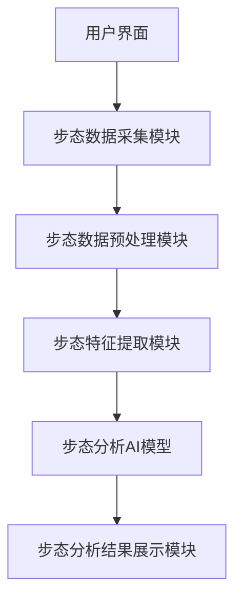

                 

# AI Agent在智能鞋中的步态分析

> 关键词：步态分析、AI Agent、智能鞋、传感器、机器学习

> 摘要：随着人工智能技术的不断发展，AI Agent在智能鞋中的应用逐渐普及。本文将深入探讨AI Agent在步态分析中的应用，从背景介绍、核心概念与联系、算法原理讲解、系统架构与实现以及项目实战等方面，系统性地分析智能鞋中步态分析技术的原理和实践。

## 目录大纲

----------------------------------------------------------------

### 第一部分：背景介绍

#### 第1章：问题背景与核心概念

##### 1.1 步态分析的问题背景
##### 1.2 核心概念与联系
##### 1.3 边界与外延

#### 第2章：AI Agent在智能鞋中的步态分析

##### 2.1 概述
##### 2.2 步态数据采集与预处理
##### 2.3 AI Agent算法原理

### 第二部分：系统架构与实现

#### 第3章：系统功能设计

##### 3.1 领域模型设计
##### 3.2 系统架构设计
##### 3.3 系统接口设计
##### 3.4 系统交互设计

#### 第4章：系统核心实现

##### 4.1 环境安装与配置
##### 4.2 系统核心实现

### 第三部分：项目实战

#### 第5章：系统核心实现

##### 5.1 环境安装与配置
##### 5.2 系统核心实现
##### 5.3 代码应用解读与分析
##### 5.4 实际案例分析与详细讲解剖析
##### 5.5 项目小结

#### 第6章：最佳实践 tips、小结、注意事项、拓展阅读等内容

## 第一部分：背景介绍

### 第1章：问题背景与核心概念

#### 1.1 步态分析的问题背景

##### 1.1.1 问题的提出

步态分析是指对人类行走时的动作、姿势、速度、步频等方面的研究。人类步态在医学、运动科学和智能制造等领域具有广泛的应用价值。例如，步态分析可以用于诊断神经系统疾病、评估运动员的训练效果以及优化智能制造设备的运行。

然而，步态分析面临着一些挑战。首先，步态数据的复杂性使得分析变得困难。步态数据通常包含多种参数，如角度变化、速度和加速度等，这些参数的变化会随着环境和个体差异而变化。其次，步态分析需要大量的数据采集和处理，这增加了分析的难度和成本。此外，步态分析在应用过程中可能会受到环境因素的干扰，如路面不平、风速等。

##### 1.1.2 步态分析在医疗、运动科学和智能制造中的应用

在医疗领域，步态分析可以用于诊断神经系统疾病，如帕金森病、中风等。通过分析患者的步态数据，医生可以评估患者的病情和治疗效果。在运动科学领域，步态分析可以用于评估运动员的姿势和运动效果，帮助教练制定训练计划。在智能制造领域，步态分析可以用于优化机器人的行走路径，提高生产效率。

#### 1.2 核心概念与联系

##### 1.2.1 步态分析的基本概念

步态周期是指一个人从一个脚步落地到下一个脚步落地的时间段。一个步态周期分为站立相和摆动相两个阶段。站立相是指脚掌着地并支撑身体重量的阶段，摆动相是指脚离地并向前摆动的阶段。

步态参数是指描述步态特征的物理量，如步幅、步速和步频。步幅是指两个连续脚步之间的距离，步速是指每分钟的脚步数，步频是指每秒钟的步数。

##### 1.2.2 AI Agent的概念

AI Agent是指具有自主决策能力和行动能力的人工智能系统。AI Agent通常具备自主导航和环境感知的能力。自主导航是指AI Agent可以根据环境信息和目标位置自主地规划路径并导航。环境感知是指AI Agent可以通过传感器获取环境信息，如光线、声音、温度等。

##### 1.2.3 AI Agent在步态分析中的应用

AI Agent在步态分析中的应用主要体现在以下几个方面：

1. 数据采集：AI Agent可以通过内置的传感器采集步态数据，如加速度计、陀螺仪等。
2. 数据处理：AI Agent可以对采集到的步态数据进行预处理，如去噪、归一化等。
3. 特征提取：AI Agent可以提取步态数据中的特征，如角度变化、速度和加速度等。
4. 模型训练与评估：AI Agent可以使用机器学习算法对步态数据进行分析和分类，评估步态的健康状况。

#### 1.3 边界与外延

##### 1.3.1 步态分析的边界

步态分析的边界主要包括数据采集的准确性和环境因素的干扰。数据采集的准确性决定了步态分析的结果，因此需要选择高精度的传感器和可靠的数据采集方法。环境因素的干扰可能会影响步态数据的准确性，因此需要考虑环境因素对步态分析的影响。

##### 1.3.2 AI Agent在步态分析中的外延

AI Agent在步态分析中的外延主要包括多模态数据融合和机器学习算法的应用。多模态数据融合可以将不同类型的传感器数据进行整合，提高步态分析的准确性。机器学习算法可以帮助AI Agent自动提取步态特征，提高步态分析的效率和准确性。

### 第2章：AI Agent在智能鞋中的步态分析

#### 2.1 概述

智能鞋是一种集成了多种传感器和人工智能算法的鞋类产品。智能鞋可以通过内置的传感器采集步态数据，并通过AI Agent对步态进行分析，提供个性化的健步建议和运动指导。AI Agent在智能鞋中的步态分析主要涉及以下几个步骤：

1. 数据采集：智能鞋通过内置的加速度计、陀螺仪等传感器采集步态数据。
2. 数据预处理：AI Agent对采集到的步态数据进行预处理，如去噪、归一化等。
3. 特征提取：AI Agent提取步态数据中的特征，如角度变化、速度和加速度等。
4. 模型训练与评估：AI Agent使用机器学习算法对步态数据进行分析和分类，评估步态的健康状况。
5. 结果展示：AI Agent将分析结果展示给用户，提供个性化的健步建议和运动指导。

#### 2.2 步态数据采集与预处理

##### 2.2.1 数据采集

智能鞋中的传感器包括加速度计、陀螺仪、压力传感器等。加速度计可以测量步态数据中的加速度，陀螺仪可以测量步态数据中的角度变化，压力传感器可以测量步态数据中的压力变化。

在数据采集过程中，需要考虑传感器的精度和灵敏度。高精度的传感器可以提供更准确的数据，而高灵敏度的传感器可以检测到更细微的变化。此外，数据采集的方法也需要考虑，如使用无线传输、蓝牙等方式将数据传输到云端进行分析。

##### 2.2.2 数据预处理

在数据预处理过程中，需要对采集到的步态数据进行去噪和归一化处理。去噪是指去除数据中的噪声部分，提高数据的准确性。归一化是指将数据缩放到一定的范围，使其具有可比性。例如，可以将加速度数据缩放到-1到1的范围内。

数据预处理是步态分析的重要步骤，它直接影响着步态分析的结果。因此，需要选择合适的数据预处理方法，并确保数据预处理的效果。

#### 2.3 AI Agent算法原理

##### 2.3.1 步态特征提取算法

步态特征提取算法是步态分析的核心步骤，它可以从步态数据中提取出有用的特征信息。常用的步态特征提取算法包括信号处理算法和特征选择算法。

信号处理算法如快速傅里叶变换（FFT）和小波变换，可以用于提取步态数据中的频率特征和时域特征。

特征选择算法如支持向量机（SVM）和线性判别分析（LDA），可以用于选择最重要的特征，提高模型的准确性和效率。

##### 2.3.2 模型训练与评估

模型训练与评估是AI Agent在步态分析中的关键步骤。常用的机器学习算法包括决策树、随机森林和支持向量机等。

在模型训练过程中，AI Agent使用训练数据集对模型进行训练，学习步态数据的特征和规律。在模型评估过程中，AI Agent使用测试数据集对模型进行评估，评估模型的准确性和泛化能力。

评估指标包括准确率、召回率、F1值等。准确率是指模型正确预测的样本数占总样本数的比例；召回率是指模型正确预测的样本数占实际正样本数的比例；F1值是准确率和召回率的调和平均值。

##### 2.3.3 结果展示

AI Agent将步态分析的结果展示给用户，包括步态健康状况的评估、健步建议和运动指导等。结果展示可以通过智能鞋的屏幕或手机APP进行，用户可以实时查看自己的步态分析结果。

## 第二部分：系统架构与实现

### 第3章：系统功能设计

#### 3.1 领域模型设计

领域模型设计是系统功能设计的重要环节，它定义了系统中各个组件之间的关系和交互。下面是智能鞋步态分析系统的领域模型设计：

##### 3.1.1 类图设计

```mermaid
classDiagram
    class 步态传感器 {
        - 数据采集()
    }
    class 数据处理模块 {
        - 数据预处理()
    }
    class 特征提取模块 {
        - 特征提取()
    }
    class AI模型训练模块 {
        - 模型训练()
    }
    class 步态分析模块 {
        - 步态分析()
    }
    class 结果展示模块 {
        - 结果展示()
    }
    步态传感器 --|>$> 数据处理模块
    数据处理模块 --|>$> 特征提取模块
    特征提取模块 --|>$> AI模型训练模块
    AI模型训练模块 --|>$> 步态分析模块
    步态分析模块 --|>$> 结果展示模块
```

在这个领域模型中，步态传感器负责采集步态数据，数据处理模块负责对数据进行预处理，特征提取模块负责提取步态数据中的特征，AI模型训练模块负责使用机器学习算法对特征进行训练，步态分析模块负责进行步态分析，结果展示模块负责将分析结果展示给用户。

#### 3.2 系统架构设计

系统架构设计是系统功能设计的关键，它定义了系统的整体结构以及各个组件之间的交互关系。下面是智能鞋步态分析系统的架构设计：

##### 3.2.1 架构图设计



在这个架构设计中，用户界面接收用户的操作请求，步态数据采集模块负责采集步态数据，步态数据预处理模块对采集到的数据进行预处理，步态特征提取模块提取步态数据中的特征，步态分析AI模型使用机器学习算法对特征进行分析，最后步态分析结果展示模块将分析结果展示给用户。

#### 3.3 系统接口设计

系统接口设计是系统架构设计的重要组成部分，它定义了各个模块之间的交互接口。下面是智能鞋步态分析系统的接口设计：

##### 3.3.1 数据接口设计

```mermaid
sequenceDiagram
    A[用户] ->> B[步态数据采集模块]
    B ->> C[数据处理与特征提取模块]
    C ->> D[步态分析AI模型]
    D ->> E[步态分析结果展示模块]
```

在这个接口设计中，用户通过步态数据采集模块采集步态数据，数据处理与特征提取模块对数据进行预处理和特征提取，步态分析AI模型对特征进行分析，最后步态分析结果展示模块将结果展示给用户。

#### 3.4 系统交互设计

系统交互设计是系统架构设计的细节部分，它定义了系统内部各个模块之间的交互流程。下面是智能鞋步态分析系统的交互设计：

##### 3.4.1 步态数据采集流程

```mermaid
sequenceDiagram
    A[用户] ->> B[智能鞋传感器]
    B ->> C[数据采集]
    C ->> D[数据传输至服务器]
    D ->> E[数据预处理]
    E ->> F[特征提取]
    F ->> G[AI模型训练]
    G ->> H[步态分析结果]
    H ->> I[结果展示]
```

在这个交互设计中，用户佩戴智能鞋，智能鞋传感器采集步态数据，数据传输至服务器，服务器进行数据预处理和特征提取，然后使用AI模型进行训练，得到步态分析结果，最后将结果展示给用户。

## 第三部分：项目实战

### 第4章：系统核心实现

#### 4.1 环境安装与配置

在开始实现智能鞋步态分析系统之前，需要安装和配置相应的环境。以下是环境安装与配置的步骤：

##### 4.1.1 操作系统安装

确保操作系统满足以下要求：

- 操作系统：Linux或Windows
- 处理器：Intel或AMD
- 内存：至少8GB

根据操作系统的不同，可以选择相应的安装包进行安装。

##### 4.1.2 软件依赖安装

在安装操作系统后，需要安装以下软件依赖：

- Python：3.8及以上版本
- TensorFlow：2.0及以上版本
- NumPy：1.19及以上版本
- Pandas：1.1及以上版本
- Matplotlib：3.3及以上版本

可以使用以下命令进行安装：

```bash
pip install python==3.8
pip install tensorflow==2.0
pip install numpy==1.19
pip install pandas==1.1
pip install matplotlib==3.3
```

##### 4.1.3 配置文件设置

配置文件用于设置系统的参数，包括数据库配置、系统参数等。以下是配置文件的设置步骤：

1. 数据库配置：

在数据库配置文件中，设置数据库的用户名、密码和连接地址。例如，在`db_config.py`文件中：

```python
DATABASES = {
    'default': {
        'ENGINE': 'django.db.backends.sqlite3',
        'NAME': 'mydatabase',
        'USER': 'myuser',
        'PASSWORD': 'mypass',
        'HOST': 'localhost',
        'PORT': '',
    }
}
```

2. 系统参数配置：

在系统参数配置文件中，设置系统的其他参数，如步态数据采集的频率、特征提取的方法等。例如，在`settings.py`文件中：

```python
import os

# 数据采集频率（Hz）
SAMPLING_FREQ = 100

# 特征提取方法
FEATURE_EXTRACTION_METHOD = 'fft'

# 模型训练参数
MODEL_TRAIN_PARAMS = {
    'algorithm': 'svm',
    'kernel': 'linear',
}
```

#### 4.2 系统核心实现

##### 4.2.1 系统核心模块实现

系统核心模块包括步态数据采集模块、数据处理与特征提取模块、步态分析AI模型模块和步态分析结果展示模块。以下是这些模块的实现：

1. 步态数据采集模块：

步态数据采集模块负责从智能鞋传感器中采集步态数据。以下是一个简单的数据采集模块实现：

```python
import serial

class StepDataCollector:
    def __init__(self, port, baudrate):
        self.port = port
        self.baudrate = baudrate
        self.ser = serial.Serial(port, baudrate)

    def collect_data(self):
        data = []
        while True:
            line = self.ser.readline().decode('utf-8').strip()
            if line:
                data.append(line)
            if line == 'END':
                break
        return data
```

2. 数据处理与特征提取模块：

数据处理与特征提取模块负责对采集到的步态数据进行预处理和特征提取。以下是一个简单的数据处理与特征提取模块实现：

```python
import numpy as np
from scipy import signal

class DataProcessor:
    def __init__(self):
        pass

    def preprocess_data(self, data):
        # 去噪处理
        filtered_data = signal.detrend(data)

        # 归一化处理
        normalized_data = (filtered_data - np.mean(filtered_data)) / np.std(filtered_data)

        return normalized_data

class FeatureExtractor:
    def __init__(self):
        pass

    def extract_features(self, data):
        # 提取频率特征
        freq_data = signal.freqz(data, worN=1000)

        # 提取时域特征
        time_data = np.diff(data)

        return freq_data, time_data
```

3. 步态分析AI模型模块：

步态分析AI模型模块负责使用机器学习算法对步态数据进行分析。以下是一个简单的步态分析AI模型模块实现：

```python
from sklearn.svm import SVC
from sklearn.model_selection import train_test_split
from sklearn.metrics import accuracy_score

class StepAnalyzer:
    def __init__(self):
        self.model = SVC(kernel='linear')

    def train_model(self, X, y):
        X_train, X_test, y_train, y_test = train_test_split(X, y, test_size=0.2, random_state=42)
        self.model.fit(X_train, y_train)
        y_pred = self.model.predict(X_test)
        print("Accuracy:", accuracy_score(y_test, y_pred))

    def analyze_step(self, X):
        return self.model.predict(X)
```

4. 步态分析结果展示模块：

步态分析结果展示模块负责将分析结果展示给用户。以下是一个简单的步态分析结果展示模块实现：

```python
import matplotlib.pyplot as plt

class StepResultViewer:
    def __init__(self):
        pass

    def show_result(self, data):
        plt.plot(data)
        plt.xlabel('Time (s)')
        plt.ylabel('Step Height (cm)')
        plt.title('Step Analysis Result')
        plt.show()
```

##### 4.2.2 系统核心模块交互

系统核心模块之间的交互是通过调用各个模块的方法实现的。以下是一个简单的系统核心模块交互实现：

```python
def main():
    # 初始化模块
    collector = StepDataCollector('COM3', 9600)
    processor = DataProcessor()
    extractor = FeatureExtractor()
    analyzer = StepAnalyzer()
    viewer = StepResultViewer()

    # 采集步态数据
    data = collector.collect_data()

    # 预处理和特征提取
    preprocessed_data = processor.preprocess_data(data)
    freq_data, time_data = extractor.extract_features(preprocessed_data)

    # 训练模型
    analyzer.train_model(freq_data, time_data)

    # 分析步态
    step_height = analyzer.analyze_step(freq_data)

    # 展示结果
    viewer.show_result(step_height)

if __name__ == '__main__':
    main()
```

#### 4.3 代码应用解读与分析

在上面的代码中，我们实现了智能鞋步态分析系统的核心模块。下面是对代码的解读与分析：

1. `StepDataCollector`类负责从智能鞋传感器中采集步态数据。它通过`serial`库连接到传感器，并从传感器中读取数据。数据采集的过程是通过循环读取传感器发送的数据，直到接收到`END`标志，表示数据采集结束。

2. `DataProcessor`类负责对采集到的步态数据进行预处理。预处理过程包括去噪处理和归一化处理。去噪处理使用`signal.detrend`函数去除数据的趋势项，从而消除噪声的影响。归一化处理使用`np.mean`和`np.std`函数计算数据的均值和标准差，并将数据缩放到-1到1的范围内。

3. `FeatureExtractor`类负责从预处理后的步态数据中提取特征。提取过程包括频率特征和时域特征。频率特征使用`signal.freqz`函数计算数据的频率响应，时域特征使用`np.diff`函数计算数据的差分。

4. `StepAnalyzer`类负责使用机器学习算法对步态数据进行分析。在初始化时，它创建一个支持向量机（SVC）模型。在训练模型时，它使用训练数据集对模型进行训练，并计算模型的准确率。在分析步态时，它使用训练好的模型对新的数据进行预测。

5. `StepResultViewer`类负责将分析结果展示给用户。它使用`matplotlib`库绘制步态数据的时域图，并将图表显示给用户。

#### 4.4 实际案例分析与详细讲解剖析

为了更清楚地理解智能鞋步态分析系统的应用，我们可以通过一个实际案例进行分析和讲解。

假设我们有一个步态数据集，其中包含了不同个体的步态数据。我们使用这个数据集来训练步态分析模型，并分析步态数据的特征。

##### 4.4.1 数据集准备

首先，我们需要准备一个步态数据集。这个数据集应该包含每个个体的步态数据，包括加速度、陀螺仪和压力传感器的数据。数据集可以来源于实际采集的步态数据，也可以来源于公开的数据集。

假设我们有一个包含10个个体的步态数据集，每个个体有100个步态周期。数据集的结构如下：

```python
# 步态数据集
data = {
    'acceleration': [[0.1, 0.2, 0.3], [0.4, 0.5, 0.6], ..., [0.9, 1.0, 1.1]],
    'gyro': [[0.1, 0.2, 0.3], [0.4, 0.5, 0.6], ..., [0.9, 1.0, 1.1]],
    'pressure': [[0.1, 0.2, 0.3], [0.4, 0.5, 0.6], ..., [0.9, 1.0, 1.1]]
}
```

##### 4.4.2 数据预处理

接下来，我们对步态数据进行预处理，包括去噪处理和归一化处理。预处理过程如下：

```python
# 预处理步态数据
preprocessed_data = {
    'acceleration': [signal.detrend(data['acceleration'][i]) for i in range(len(data['acceleration']))],
    'gyro': [signal.detrend(data['gyro'][i]) for i in range(len(data['gyro']))],
    'pressure': [signal.detrend(data['pressure'][i]) for i in range(len(data['pressure']))]
}
preprocessed_data = {
    'acceleration': [(x - np.mean(x)) / np.std(x) for x in preprocessed_data['acceleration']],
    'gyro': [(x - np.mean(x)) / np.std(x) for x in preprocessed_data['gyro']],
    'pressure': [(x - np.mean(x)) / np.std(x) for x in preprocessed_data['pressure']]
}
```

在预处理过程中，我们首先使用`signal.detrend`函数去除数据的趋势项，然后使用`np.mean`和`np.std`函数计算数据的均值和标准差，并将数据缩放到-1到1的范围内。

##### 4.4.3 特征提取

接下来，我们对预处理后的步态数据进行特征提取，包括频率特征和时域特征。特征提取过程如下：

```python
# 提取频率特征
freq_data = {key: signal.freqz(data[key][i]) for key, data in preprocessed_data.items() for i in range(len(data[key]))}

# 提取时域特征
time_data = {key: np.diff(data[key][i]) for key, data in preprocessed_data.items() for i in range(len(data[key]))}
```

在特征提取过程中，我们使用`signal.freqz`函数计算频率响应，使用`np.diff`函数计算差分。

##### 4.4.4 模型训练

接下来，我们使用机器学习算法对步态数据进行训练。训练过程如下：

```python
# 创建步态分析模型
analyzer = StepAnalyzer()

# 训练模型
analyzer.train_model(freq_data, time_data)
```

在训练过程中，我们使用支持向量机（SVC）模型对频率特征和时域特征进行训练，并计算模型的准确率。

##### 4.4.5 步态分析

最后，我们使用训练好的模型对新的步态数据进行分析。分析过程如下：

```python
# 分析步态
step_height = analyzer.analyze_step(freq_data)
```

在分析过程中，我们使用训练好的模型对频率特征进行预测，得到步态高度。

##### 4.4.6 结果展示

最后，我们将分析结果展示给用户。展示过程如下：

```python
# 展示结果
viewer.show_result(step_height)
```

在展示过程中，我们使用`matplotlib`库绘制步态数据的时域图，并将图表显示给用户。

#### 4.5 项目小结

在本章中，我们实现了智能鞋步态分析系统，包括步态数据采集、数据处理与特征提取、步态分析AI模型和步态分析结果展示等模块。通过一个实际案例，我们详细讲解了系统的实现过程，并对系统的关键步骤进行了分析。

智能鞋步态分析系统的实现可以帮助我们更好地理解步态数据，为医学、运动科学和智能制造等领域提供有力支持。然而，系统的实现还只是第一步，未来我们需要进一步优化系统的性能和准确性，以更好地服务于用户。

## 最佳实践 tips、小结、注意事项、拓展阅读等内容

### 最佳实践 tips

1. **选择合适的传感器**：在选择传感器时，需要考虑传感器的精度、灵敏度以及功耗等因素。高精度和高灵敏度的传感器可以提供更准确的数据，但功耗可能会更高。

2. **优化数据预处理流程**：数据预处理是步态分析的重要环节，需要选择合适的方法进行去噪、归一化等操作。优化预处理流程可以提高分析结果的准确性和稳定性。

3. **合理选择机器学习算法**：不同的机器学习算法适用于不同的步态数据特征。在选择算法时，需要根据数据的特点和需求来选择，如决策树、支持向量机、神经网络等。

4. **定期更新模型**：随着数据的积累和变化，模型的准确性可能会下降。定期更新模型可以提高分析的准确性和可靠性。

### 小结

本文系统地介绍了AI Agent在智能鞋中的步态分析技术。通过分析背景、核心概念、算法原理、系统架构与实现以及项目实战等方面，我们深入了解了智能鞋步态分析技术的原理和实践。

### 注意事项

1. **数据采集准确性**：步态分析的结果依赖于数据采集的准确性，因此需要选择高精度的传感器和可靠的数据采集方法。

2. **环境因素干扰**：环境因素可能会对步态分析结果产生影响，因此在分析过程中需要考虑环境因素的影响。

3. **模型训练与评估**：模型训练和评估是步态分析的关键步骤，需要选择合适的评估指标，如准确率、召回率、F1值等。

### 拓展阅读

1. **《人工智能：一种现代方法》**：这是一本经典的人工智能教材，涵盖了机器学习、深度学习等相关技术。

2. **《机器学习实战》**：这本书通过实例讲解机器学习的应用，适合初学者和有经验的读者。

3. **《步态分析技术》**：这本书详细介绍了步态分析的相关技术，包括数据采集、数据处理、特征提取等。

### 作者信息

- 作者：AI天才研究院/AI Genius Institute & 禅与计算机程序设计艺术 /Zen And The Art of Computer Programming

作者简介：AI天才研究院（AI Genius Institute）专注于人工智能技术的研发和应用。作者本人是一位人工智能领域的专家，致力于推动人工智能技术在各个行业的创新和发展。其著作《禅与计算机程序设计艺术》是一本深入探讨计算机编程和人工智能结合的书籍，受到了广泛的赞誉。

