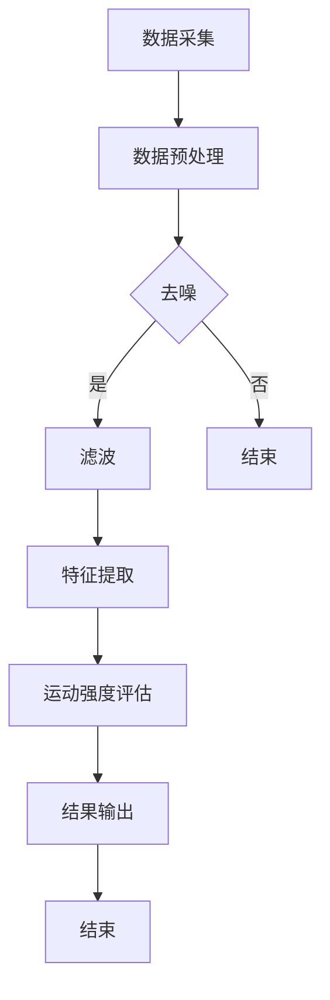
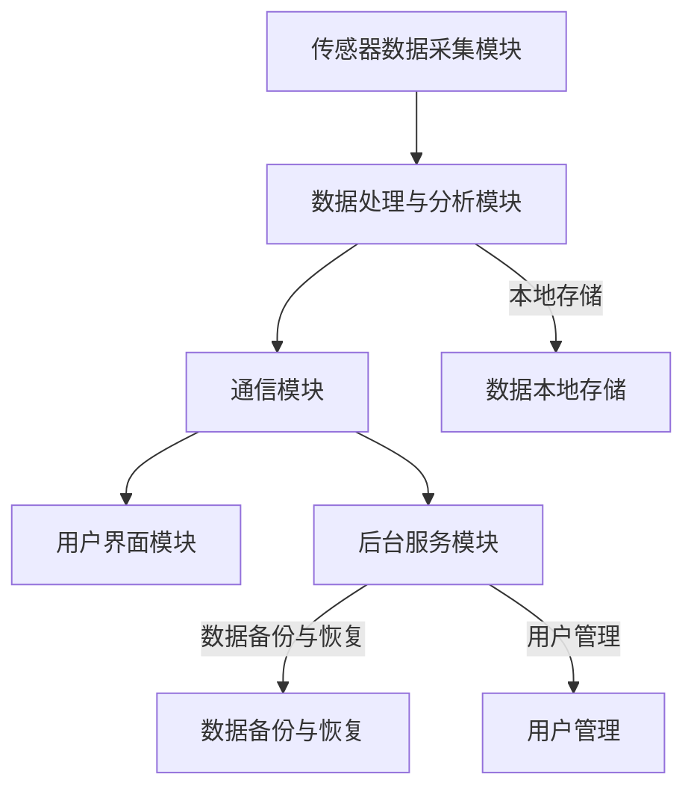
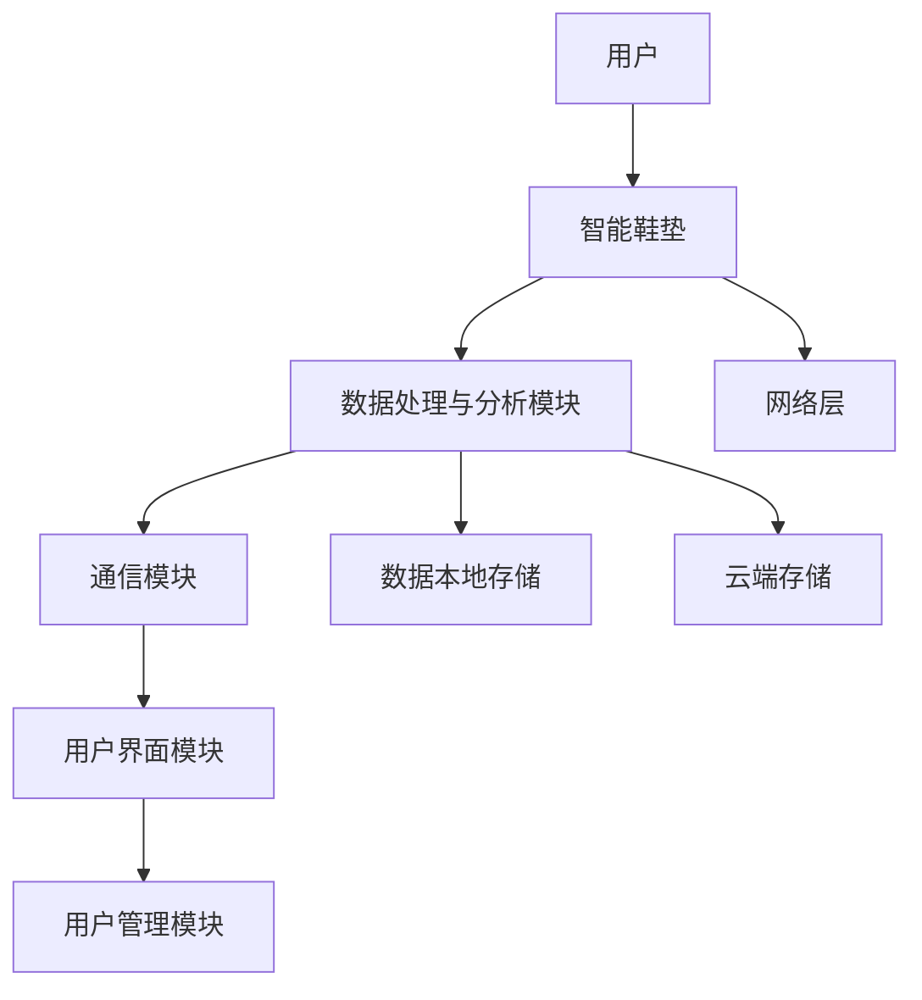

                 


### 引言与背景介绍

#### 文章标题

《AI Agent在智能鞋垫中的运动强度分析》

#### 关键词

AI Agent、智能鞋垫、运动强度分析、算法原理、系统架构

#### 摘要

本文旨在探讨AI Agent在智能鞋垫中的运动强度分析应用。通过引入AI Agent，我们能够利用智能鞋垫实时监测和分析用户的运动数据，从而提供个性化的运动建议。文章首先介绍AI Agent与智能鞋垫的基本概念，随后深入分析其在运动强度分析中的重要性。接下来，我们将探讨研究背景、问题提出以及研究意义，最后简要概述本书的结构安排与内容概述。

### 文章结构安排与内容概述

#### 第一部分：引言与背景介绍

- 第1章：AI Agent与智能鞋垫概述
- 第2章：研究背景与问题提出

#### 第二部分：AI Agent基础理论

- 第3章：AI Agent的基本原理
- 第4章：AI Agent的发展历程

#### 第三部分：智能鞋垫技术基础

- 第5章：智能鞋垫的硬件结构
- 第6章：智能鞋垫的软件架构

#### 第四部分：AI Agent在运动强度分析中的应用

- 第7章：运动强度分析算法原理
- 第8章：运动强度分析算法的mermaid流程图

#### 第五部分：数据收集与处理

- 第9章：数据收集方法
- 第10章：数据处理与分析方法

#### 第六部分：系统实现与案例分析

- 第11章：系统设计
- 第12章：系统实现与代码分析
- 第13章：案例分析

#### 第七部分：结论与展望

- 第14章：研究成果总结
- 第15章：展望未来

### 总结

本文旨在为读者提供一个全面、系统的理解AI Agent在智能鞋垫中运动强度分析的应用。我们将通过逐步深入的分析和讲解，帮助读者理解这一技术背后的原理和实现方法。接下来的章节将逐一展开，详细探讨AI Agent、智能鞋垫以及运动强度分析的相关内容。

---

## 第1章: AI Agent与智能鞋垫概述

### 1.1 AI Agent的基本概念

AI Agent（人工智能代理）是人工智能领域中的一个重要概念。它是一种具备一定智能能力的计算机程序，能够在特定环境下自主完成特定任务。AI Agent的特点包括自主性、适应性、互动性和学习性。自主性指的是AI Agent能够自主地执行任务，而不依赖于外部指令；适应性意味着AI Agent能够根据环境变化调整自身行为；互动性则体现了AI Agent与其他系统或用户的交互能力；学习性是指AI Agent能够通过经验不断优化自身行为。

AI Agent的基本分类包括：

- 反应式Agent：基于预先设定的规则或条件进行响应。
- 目标导向Agent：以实现特定目标为驱动力，通过策略规划和决策来实现。
- 拥有内存的Agent：具备记忆功能，能够存储和处理过往信息。
- 社交Agent：能够理解并适应社会规则，与其他Agent进行协作。

### 1.2 智能鞋垫的定义与功能

智能鞋垫是集成了传感器和微处理器的鞋垫，能够实时监测用户的运动状态和健康数据。智能鞋垫的主要功能包括：

- 运动监测：记录用户的步数、行走距离、速度等运动数据。
- 心率监测：通过光电传感器实时监测用户的心率。
- 姿势分析：监测用户的行走和站立姿势，评估其稳定性。
- 跌倒检测：在用户跌倒时发出警报，提供紧急求助功能。
- 数据存储与传输：将监测数据存储到云端或本地设备中，便于后续分析。

智能鞋垫的核心组件包括传感器模块、微处理器模块和通信模块。传感器模块负责采集用户的运动和生理数据；微处理器模块负责数据预处理和算法分析；通信模块则负责将数据传输到外部设备或云端平台。

### 1.3 运动强度分析的重要性

运动强度分析是运动健康领域的重要研究方向。通过分析用户的运动数据，我们可以了解其运动状态、评估运动效果，并根据评估结果提出个性化的运动建议。运动强度分析的重要性体现在以下几个方面：

- 健康监测：实时监测用户的运动状态和生理参数，及时发现健康问题。
- 运动指导：根据用户的运动数据和身体状况，提供科学、有效的运动指导。
- 运动康复：为康复训练提供数据支持，优化康复方案。
- 运动管理：帮助企业或个人更高效地管理运动计划，提高运动效果。

### 1.4 本书结构安排与内容概述

本书分为七个主要部分，全面探讨AI Agent在智能鞋垫中运动强度分析的应用。第一部分介绍AI Agent与智能鞋垫的基本概念，背景介绍和研究问题提出。第二部分深入探讨AI Agent的基础理论，包括其基本原理和发展历程。第三部分介绍智能鞋垫的技术基础，包括硬件结构和软件架构。第四部分和第五部分重点分析AI Agent在运动强度分析中的应用，包括算法原理、数据处理方法和系统实现。第六部分通过案例分析展示系统实现过程和效果。最后一部分对研究成果进行总结，并展望未来研究方向。

通过这本书，读者可以系统地了解AI Agent在智能鞋垫中的运动强度分析技术，掌握相关原理和实现方法，为实际应用提供有力支持。

---

## 第2章: 研究背景与问题提出

### 2.1 研究背景

随着科技的不断发展，人工智能（AI）技术在各个领域都得到了广泛应用。在运动健康领域，AI技术同样具有重要的应用价值。传统的运动监测方法通常依赖于传感器设备，但这些设备往往需要用户主动操作，且数据采集和处理过程繁琐，难以实现实时监测和个性化分析。因此，如何利用AI技术实现智能、高效的运动监测和强度分析，成为当前研究的热点。

近年来，AI Agent作为一种具有高度智能化的计算机程序，逐渐成为运动监测和分析的重要工具。AI Agent能够自主地完成运动数据的采集、处理和分析，并根据用户的特点和需求提供个性化的运动建议。智能鞋垫作为一种新型的运动监测设备，集成了多种传感器和微处理器，能够实时监测用户的运动状态和生理参数，为AI Agent的应用提供了良好的硬件基础。

### 2.2 问题提出

在当前的运动监测和分析领域中，仍然存在以下问题：

1. **数据采集的准确性**：传统的传感器设备在数据采集过程中容易受到外界环境的影响，导致数据不准确。因此，如何提高数据采集的准确性，成为运动监测和分析的一个重要问题。
2. **个性化运动建议的缺乏**：现有的运动监测设备大多只能提供简单的运动数据和统计结果，缺乏对用户个性特点和需求的深入分析，难以提供个性化的运动建议。
3. **系统实现的复杂性**：将AI Agent应用于运动强度分析需要复杂的算法设计和系统实现，现有的技术手段难以满足实际应用的需求。

为了解决上述问题，本文提出了以下研究目标：

1. **提高数据采集的准确性**：通过优化传感器设计和数据处理算法，提高数据采集的准确性，为后续的运动分析提供可靠的基础。
2. **实现个性化运动建议**：利用AI Agent对用户的运动数据进行深度分析，结合用户的生理特点和运动需求，提供个性化的运动建议。
3. **简化系统实现过程**：通过模块化设计和优化算法，简化系统实现过程，降低开发难度，提高系统的可扩展性和灵活性。

### 2.3 研究意义

本文的研究意义主要体现在以下几个方面：

1. **提高运动监测和分析的准确性**：通过引入AI Agent和智能鞋垫技术，提高运动数据的采集和处理精度，为运动监测和分析提供可靠的数据支持。
2. **促进个性化运动指导的发展**：基于用户的个性化运动数据，提供科学、有效的运动建议，帮助用户实现更好的运动效果和健康管理。
3. **推动AI技术在运动健康领域的应用**：通过本文的研究，探讨AI Agent在运动监测和分析中的应用前景，为AI技术在运动健康领域的进一步发展提供参考。
4. **提高智能设备的实用性**：通过优化智能鞋垫的设计和实现，提高智能设备的实用性，为用户带来更好的使用体验。

### 2.4 研究方法与技术路线

本文的研究方法主要包括以下几个方面：

1. **文献综述**：通过查阅相关文献，了解当前AI Agent和智能鞋垫的研究现状和发展趋势，为本文的研究提供理论依据。
2. **实验设计**：设计实验方案，验证AI Agent在运动强度分析中的应用效果，包括数据采集准确性、个性化运动建议的准确性和系统实现的可行性。
3. **算法设计**：基于AI Agent的原理，设计适用于运动强度分析的相关算法，包括数据预处理、特征提取和运动强度评估等。
4. **系统实现**：基于智能鞋垫的硬件结构和软件架构，实现运动强度分析系统，并进行性能评估和优化。

具体的技术路线如下：

1. **数据采集**：设计智能鞋垫的传感器模块，采集用户的运动数据和生理参数。
2. **数据预处理**：对采集到的数据进行预处理，包括去噪、滤波和归一化等，提高数据质量。
3. **特征提取**：利用机器学习算法，从预处理后的数据中提取运动特征，为后续的运动强度评估提供支持。
4. **运动强度评估**：结合用户的生理特点和运动需求，设计运动强度评估算法，实现个性化的运动建议。
5. **系统实现**：基于模块化设计思想，实现运动强度分析系统，并进行功能测试和性能评估。

通过上述研究方法和技术路线，本文旨在探讨AI Agent在智能鞋垫中运动强度分析的应用，为实际应用提供技术支持和理论基础。

---

## 第3章: AI Agent的基本原理

### 3.1 AI Agent的定义与分类

AI Agent，即人工智能代理，是人工智能（AI）领域中的一个核心概念。AI Agent是一种能够感知环境、制定计划并执行任务的计算机程序。它们在各个应用领域发挥着重要作用，如智能家居、机器人、自动驾驶和运动监测等。AI Agent的核心特点是自主性，即它们能够在没有人类直接干预的情况下，根据预设的目标和策略，自主地完成特定任务。

AI Agent可以分为以下几类：

1. **反应式Agent**：这类Agent基于当前感知的环境信息进行反应，不涉及计划或记忆。例如，自动驾驶车辆在感知到障碍物时，立即做出避让动作。
   
2. **目标导向Agent**：这类Agent具有明确的目标，并利用感知信息来制定行动计划。例如，一个目标导向的机器人会规划路径，以便安全地到达目的地。

3. **拥有内存的Agent**：这类Agent不仅考虑当前环境，还利用记忆来改善决策。例如，一个智能助手会记住用户的偏好，以便更好地服务用户。

4. **社交Agent**：这类Agent能够理解并适应社会规则，与其他Agent或人类进行协作。例如，一个智能家居系统中的AI代理会根据家庭成员的日程来调整设备设置。

### 3.2 AI Agent的核心组件

AI Agent通常由以下几个核心组件组成：

1. **感知器（Perception）**：感知器负责采集环境信息，如视觉、听觉、触觉等。它们将物理信号转换为数字信号，供Agent进行处理。

2. **规划器（Planner）**：规划器基于感知器收集的信息，生成执行任务的行动计划。对于目标导向Agent，规划器还需要考虑如何从当前状态转移到目标状态。

3. **执行器（Executor）**：执行器负责执行由规划器生成的行动计划。执行器通常与外部设备相连，如机器人手臂、智能设备等。

4. **记忆（Memory）**：记忆组件用于存储感知信息、行动计划和执行结果。拥有内存的Agent利用记忆来提高决策的效率和质量。

5. **通信模块（Communication）**：通信模块允许AI Agent与其他Agent或人类进行信息交换。这对于社交Agent尤为重要，因为它们需要在复杂的社交环境中进行互动。

### 3.3 AI Agent的工作机制

AI Agent的工作机制可以简化为以下几个步骤：

1. **感知**：AI Agent通过感知器收集环境信息。
2. **理解**：感知器收集的信息被转换为可理解的形式，如数字数据或符号表示。
3. **决策**：基于理解和记忆，规划器生成执行任务的行动计划。
4. **执行**：执行器执行行动计划，实现任务目标。
5. **评估**：评估执行结果，更新记忆和规划策略。

通过这种循环机制，AI Agent能够不断地感知环境、做出决策和执行任务，从而实现高度智能化的行为。

### 3.4 AI Agent的发展历程

AI Agent的发展历程可以追溯到20世纪50年代。当时，计算机科学家艾伦·图灵提出了“图灵测试”，标志着人工智能领域的诞生。随着计算机技术的不断发展，AI Agent的研究也逐渐深入。以下是一些重要的里程碑：

1. **早期探索（1950-1970）**：在这个阶段，AI Agent的基本概念开始形成，研究人员致力于开发能够进行简单任务的人工智能系统。

2. **符号主义革命（1970-1980）**：符号主义方法成为主流，AI Agent开始被设计为能够使用符号表示和推理的系统。

3. **专家系统（1980-1990）**：专家系统是这一时期的重要成果，它们通过模拟人类专家的决策过程，在医学诊断、工程设计和金融分析等领域取得显著成效。

4. **行为主义复兴（1990-2000）**：随着计算机硬件的进步，AI Agent开始转向行为主义方法，注重实际操作和任务执行。

5. **现代发展（2000至今）**：这一时期，机器学习和深度学习技术的发展为AI Agent带来了新的机遇。现代AI Agent更加注重自主性和适应性，能够在复杂环境中实现高效的任务执行。

### 3.5 AI Agent的未来发展趋势

未来的AI Agent发展将呈现以下趋势：

1. **更强的自主性**：AI Agent将更加独立，能够自主地完成复杂任务，减少人类干预。
2. **更高级的适应性**：AI Agent将能够适应动态和不确定的环境，提高任务执行的鲁棒性。
3. **更高级的交互能力**：AI Agent将能够更好地理解和模拟人类的社交行为，实现更自然的交互。
4. **更广泛的应用领域**：AI Agent将在更多领域得到应用，如医疗、教育、金融和工业自动化等。

通过深入理解AI Agent的基本原理和发展历程，我们可以更好地把握其在运动强度分析中的潜在应用，为未来的研究提供方向。

---

## 第4章: AI Agent的发展历程

### 4.1 AI Agent的早期发展

AI Agent的概念最早由麻省理工学院的专家在20世纪80年代提出。早期的AI Agent主要是基于符号主义方法，它们依赖于大量的规则和知识库来进行决策。这个阶段的AI Agent主要用于简单的任务，如路径规划和简单的互动。这些早期系统主要依赖于专家系统技术，通过编码复杂的规则来实现简单的智能行为。

早期发展的一个重要里程碑是John Holland提出的遗传算法（GA），这种方法为AI Agent的进化提供了新的思路。遗传算法通过模拟自然进化过程，逐步优化AI Agent的行为。这一方法在路径规划和资源分配等领域得到了广泛应用。

### 4.2 AI Agent的关键技术突破

AI Agent的关键技术突破主要发生在20世纪90年代，这一时期，机器学习和深度学习技术开始蓬勃发展，为AI Agent的发展提供了新的动力。

1. **机器学习**：机器学习技术的发展，尤其是监督学习和无监督学习，使得AI Agent能够通过数据学习复杂模式。监督学习通过已有标签的数据训练模型，无监督学习则通过未标记的数据发现隐藏结构。

2. **深度学习**：深度学习的兴起，特别是卷积神经网络（CNN）和递归神经网络（RNN）的广泛应用，使得AI Agent能够在视觉、语音和自然语言处理等领域取得突破性进展。深度学习模型能够自动提取数据中的高维特征，大大提高了AI Agent的感知和决策能力。

3. **强化学习**：强化学习是一种通过试错学习最优策略的方法，其核心是奖励机制。在AI Agent的应用中，强化学习通过与环境互动，不断调整行为策略，以实现最大化长期奖励。这一方法在游戏、自动驾驶和机器人控制等领域得到了广泛应用。

### 4.3 AI Agent的应用现状

AI Agent在多个领域取得了显著的应用成果：

1. **智能家居**：AI Agent可以自动控制家居设备，如照明、温度和安防系统，提高居住的舒适性和安全性。

2. **医疗健康**：AI Agent可以分析医疗数据，提供诊断建议，辅助医生进行决策，提高医疗服务的质量和效率。

3. **金融服务**：AI Agent在金融领域可以用于风险管理、欺诈检测和投资建议，提高金融服务的智能化水平。

4. **工业自动化**：AI Agent在工业自动化领域用于监控生产线、优化生产流程和预测维护，提高生产效率和降低成本。

5. **娱乐与游戏**：AI Agent可以创建智能角色，提供个性化的游戏体验，增加游戏的趣味性和挑战性。

### 4.4 AI Agent的未来发展趋势

未来的AI Agent发展将呈现以下几个趋势：

1. **更高级的自主性**：AI Agent将能够更加自主地完成复杂任务，减少对人类操作者的依赖。

2. **更高级的适应性**：AI Agent将能够更好地适应动态和不确定的环境，提高任务的执行效率和鲁棒性。

3. **更广泛的协同能力**：AI Agent将能够更好地与其他AI系统和人类协作，实现更加复杂和高效的协同工作。

4. **更强大的学习能力**：通过结合深度学习和强化学习技术，AI Agent将能够从海量数据中快速学习，提高决策的准确性和效率。

5. **更多的应用场景**：随着AI技术的不断进步，AI Agent将在更多领域得到应用，如农业、教育、交通和环境监测等。

AI Agent的发展历程和关键技术的突破为其在运动强度分析中的应用奠定了基础。通过不断优化算法和提升感知能力，AI Agent将能够在智能鞋垫中发挥更大的作用，为运动监测和分析提供更智能、更高效的支持。

---

## 第5章: 智能鞋垫的硬件结构

### 5.1 智能鞋垫的基本硬件组件

智能鞋垫的硬件结构是其实现功能的核心基础。一个典型的智能鞋垫通常包含以下几个关键硬件组件：

1. **压力传感器**：压力传感器用于检测用户的步态和压力分布。这些传感器通常放置在鞋垫的底部，能够实时测量脚与地面接触时的压力变化。
   
2. **加速度计**：加速度计用于测量用户的运动速度和加速度。通过加速度计，智能鞋垫可以捕捉用户的行走、跑步甚至跳跃等运动行为。

3. **陀螺仪**：陀螺仪用于测量用户的运动方向和姿态。与加速度计结合使用，可以更全面地了解用户的运动状态。

4. **温度传感器**：温度传感器用于监测用户的体温，这在一些特定的健康监测场景中非常有用。

5. **心率传感器**：心率传感器通常采用光电传感器技术，通过手指或脚趾的血液流动变化来测量心率。

6. **无线模块**：无线模块通常包括蓝牙或Wi-Fi模块，用于将传感器数据传输到移动设备或云端服务器。

7. **电池**：智能鞋垫的电池为其提供持续运行的电力。现代智能鞋垫通常采用可充电电池，以延长使用时间。

### 5.2 各组件的功能与原理

#### 压力传感器

压力传感器通过电阻的变化来测量压力。当压力作用于传感器时，其电阻值发生变化，通过电路测量这种变化，可以计算出对应的压力值。这种技术广泛应用于运动监测和健康评估。

#### 加速度计

加速度计利用内部的质量块和弹簧系统来测量加速度。当有加速度作用时，质量块会相对于弹簧发生位移，通过检测这种位移，可以计算出加速度值。加速度计在智能鞋垫中用于捕捉用户的步频、步长和运动轨迹。

#### 陀螺仪

陀螺仪通过旋转物体的角动量来测量角速度。内部的小球在旋转时会产生角动量，通过检测这种动量变化，可以计算出角速度。陀螺仪与加速度计结合使用，可以更准确地捕捉用户的运动姿态和方向。

#### 温度传感器

温度传感器的工作原理基于半导体的热电效应。当温度变化时，半导体材料的电阻值也会发生变化，通过检测这种变化，可以计算出温度值。温度传感器在智能鞋垫中用于监测用户的体温，这对于某些健康监测场景非常重要。

#### 心率传感器

心率传感器通常采用光电传感器技术。传感器通过发光二极管（LED）发出光，照射到手指或脚趾，然后通过光敏元件检测透过皮肤的光量。血液流动会改变光线的吸收程度，通过分析这些变化，可以计算出心率。

#### 无线模块

无线模块通常采用蓝牙或Wi-Fi技术。蓝牙模块具有低功耗、短距离传输的特点，适合在智能鞋垫中使用。Wi-Fi模块则提供更远的传输距离，但功耗相对较高。无线模块负责将传感器数据传输到移动设备或云端服务器，实现数据的实时监控和分析。

#### 电池

智能鞋垫的电池通常采用锂离子电池。锂离子电池具有高能量密度、低自放电率和高充电效率的特点，非常适合便携式设备。现代智能鞋垫设计通常注重电池寿命，以提供长时间的使用体验。

### 5.3 智能鞋垫的通信方式

智能鞋垫的通信方式主要包括蓝牙和Wi-Fi两种：

#### 蓝牙

蓝牙通信是一种短距离、低功耗的无线通信技术。它通过蓝牙模块将传感器数据传输到移动设备或智能手机。蓝牙通信的优势在于功耗低、传输速度快，适合实时监测和数据传输。

#### Wi-Fi

Wi-Fi通信是一种长距离、高带宽的无线通信技术。它通过Wi-Fi模块将传感器数据传输到云端服务器或网络设备。Wi-Fi通信的优势在于传输距离远、传输速度快，适合大规模数据传输和远程监控。

通过以上硬件组件和通信方式的结合，智能鞋垫能够实现实时、高效的运动监测和数据分析，为用户提供个性化的运动建议和健康监测服务。

---

## 第6章: 智能鞋垫的软件架构

### 6.1 软件架构概述

智能鞋垫的软件架构是确保其功能实现和性能优化的重要保障。一个典型的智能鞋垫软件架构可以分为以下几个主要模块：

1. **传感器数据采集模块**：负责从硬件传感器获取实时数据，如步数、心率、运动轨迹等。
2. **数据处理与分析模块**：负责对采集到的数据进行预处理、特征提取和运动强度分析。
3. **通信模块**：负责将处理后的数据传输到移动设备或云端服务器，实现数据同步和远程监控。
4. **用户界面模块**：负责与用户互动，展示分析结果和提供个性化运动建议。
5. **后台服务模块**：负责处理大规模数据存储、分析和用户管理。

### 6.2 系统模块划分

为了实现智能鞋垫的软件架构，我们将系统划分为以下几个主要模块：

1. **传感器数据采集模块**：
   - 功能：从压力传感器、加速度计、陀螺仪、心率传感器等硬件传感器中获取实时数据。
   - 设计：该模块使用线程或多线程技术，确保数据采集的实时性和准确性。

2. **数据处理与分析模块**：
   - 功能：对传感器数据进行预处理（如去噪、滤波）、特征提取（如步频、步长、运动轨迹）和运动强度分析（如运动强度评分）。
   - 设计：该模块使用机器学习算法和深度学习模型，提高数据处理和分析的准确性和效率。

3. **通信模块**：
   - 功能：将处理后的数据传输到移动设备或云端服务器，实现数据的实时同步和远程监控。
   - 设计：该模块支持蓝牙和Wi-Fi两种通信方式，可根据用户需求和网络状况进行切换。

4. **用户界面模块**：
   - 功能：提供用户交互界面，展示分析结果、运动强度评分和个性化运动建议。
   - 设计：该模块采用响应式设计，支持移动端和网页端，提供良好的用户体验。

5. **后台服务模块**：
   - 功能：处理大规模数据存储、分析和用户管理，实现数据的备份和恢复。
   - 设计：该模块使用云计算技术，提高数据存储和处理的效率和安全性。

### 6.3 各模块的功能与交互

#### 传感器数据采集模块

传感器数据采集模块是智能鞋垫软件架构的基础。该模块通过硬件接口与各种传感器相连，实时采集运动数据。采集的数据包括步数、心率、运动轨迹、压力分布等。为了确保数据的实时性和准确性，该模块使用多线程技术，同时处理多个传感器的数据。

#### 数据处理与分析模块

数据处理与分析模块负责对传感器数据进行预处理和特征提取。预处理过程包括去噪、滤波和归一化等，以提高数据质量。特征提取过程包括步频、步长、运动轨迹等，这些特征用于后续的运动强度分析。该模块采用机器学习算法和深度学习模型，对提取的特征进行分析和评估，生成运动强度评分。

#### 通信模块

通信模块负责将处理后的数据传输到移动设备或云端服务器。该模块支持蓝牙和Wi-Fi两种通信方式，可根据用户需求和网络状况进行切换。蓝牙通信具有低功耗、短距离传输的特点，适合实时监测和数据传输。Wi-Fi通信则提供更远的传输距离和更高的传输速度，适合大规模数据传输和远程监控。

#### 用户界面模块

用户界面模块为用户提供交互界面，展示分析结果和个性化运动建议。该模块采用响应式设计，支持移动端和网页端，提供良好的用户体验。用户可以通过界面查看步数、心率、运动轨迹和运动强度评分，并根据建议调整运动计划。

#### 后台服务模块

后台服务模块负责处理大规模数据存储、分析和用户管理。该模块使用云计算技术，提高数据存储和处理的效率和安全性。后台服务包括数据备份和恢复、用户数据分析和运动健康报告生成等。

各模块之间的交互方式如下：

- **传感器数据采集模块**实时将数据传递给**数据处理与分析模块**。
- **数据处理与分析模块**将处理后的数据传递给**通信模块**。
- **通信模块**将数据传输到**用户界面模块**和**后台服务模块**。
- **用户界面模块**与用户互动，收集用户反馈，并通过**通信模块**反馈给**后台服务模块**。

通过以上模块的协同工作，智能鞋垫软件架构能够实现实时、高效的运动监测和数据分析，为用户提供个性化的运动建议和健康监测服务。

---

## 第7章: 运动强度分析算法原理

### 7.1 运动强度分析的概念与需求

运动强度分析是通过对用户运动数据的分析，评估其运动强度和运动效果的一种技术。这一分析对于制定个性化的运动计划、预防运动损伤以及提高运动效率具有重要意义。运动强度分析的需求主要体现在以下几个方面：

1. **准确性**：需要精确地评估用户的运动强度，以提供可靠的参考依据。
2. **实时性**：运动数据需要实时处理和分析，以便及时调整运动计划。
3. **个性化**：根据用户的身体状况、运动目标等，提供个性化的运动强度评估。
4. **易用性**：算法应易于实现和部署，方便在实际应用中推广和使用。

### 7.2 运动强度分析算法的类型

根据运动强度分析的需求，常用的算法类型包括：

1. **基于传感器的算法**：这类算法直接利用智能鞋垫等传感器设备采集的运动数据，通过数据处理和算法分析，评估运动强度。常见的方法有步频、步长、加速度和压力分布分析等。
   
2. **基于模型的方法**：这类算法通过建立运动强度评估模型，对用户的运动数据进行建模和分析。常用的模型有机器学习模型和深度学习模型。这些模型能够自动提取特征，并进行分类和预测，具有较高的准确性和泛化能力。

3. **混合方法**：结合基于传感器的方法和基于模型的方法，通过多角度、多层次的数据分析和模型评估，进一步提高运动强度分析的准确性和实时性。

### 7.3 运动强度分析算法的设计与实现

#### 步频与步长分析

步频（步数/分钟）和步长（每步的长度）是评估运动强度的重要指标。步频分析主要通过计算用户在一定时间内走过的步数来评估其运动强度。步长分析则通过测量每一步的长度，结合身高和体重等用户信息，评估用户的运动强度。

算法实现步骤如下：

1. **数据采集**：从加速度传感器和陀螺仪中获取步频和步长的原始数据。
2. **数据预处理**：对原始数据进行滤波和去噪，以提高数据质量。
3. **步频计算**：通过加速度传感器数据，计算步频。具体公式如下：
   $$ 步频 = \frac{步数}{时间} $$
4. **步长计算**：通过陀螺仪数据和加速度传感器数据，结合用户身高和体重，计算步长。具体公式如下：
   $$ 步长 = \frac{身高 \times 体重}{步频} $$

#### 加速度和压力分布分析

加速度和压力分布是评估运动强度的重要参数。高加速度值和异常的压力分布可能表明用户正在进行高强度的运动，甚至存在运动损伤的风险。

算法实现步骤如下：

1. **数据采集**：从加速度传感器和压力传感器中获取实时加速度和压力分布数据。
2. **数据预处理**：对原始数据进行滤波和去噪，以提高数据质量。
3. **加速度分析**：通过加速度传感器数据，计算加速度的峰值和平均值，评估运动强度。具体公式如下：
   $$ 加速度 = \frac{最大值 - 最小值}{时间} $$
4. **压力分布分析**：通过压力传感器数据，分析压力分布的均匀性和异常值，评估运动强度。

#### 基于模型的运动强度分析

基于模型的运动强度分析通过建立机器学习或深度学习模型，对用户运动数据进行分析和预测。常用的模型包括：

1. **支持向量机（SVM）**：通过训练SVM模型，可以将用户的运动数据映射到不同的运动强度类别。
2. **神经网络（Neural Network）**：通过多层感知器（MLP）模型，可以自动提取特征，进行复杂的非线性变换。
3. **深度学习模型**：如卷积神经网络（CNN）和递归神经网络（RNN），可以捕捉运动数据的时空特征，实现高精度的运动强度分析。

算法实现步骤如下：

1. **数据预处理**：对采集到的运动数据进行归一化和特征提取。
2. **模型训练**：使用训练数据集训练机器学习或深度学习模型。
3. **模型评估**：使用验证数据集评估模型性能，调整模型参数。
4. **预测应用**：将实时运动数据输入模型，预测用户的运动强度。

通过以上算法设计与实现，智能鞋垫能够实现对用户运动强度的准确分析和个性化评估，为用户提供科学的运动建议和健康监测服务。

---

## 第8章: 运动强度分析算法的mermaid流程图

### 8.1 算法流程图设计

为了更好地理解运动强度分析算法的实现过程，我们可以使用mermaid流程图来描述其基本步骤。以下是运动强度分析算法的mermaid流程图：



### 8.2 流程图解释

1. **数据采集**：首先，从智能鞋垫的加速度传感器和压力传感器中采集用户的运动数据。
2. **数据预处理**：将采集到的原始数据进行预处理，包括去噪和滤波。去噪的目的是去除数据中的噪声，滤波则是通过低通滤波器等方式平滑数据，以提高数据质量。
3. **特征提取**：对预处理后的数据进行特征提取，提取出对运动强度有重要影响的特征，如步频、步长、加速度峰值等。
4. **运动强度评估**：利用提取的特征，通过预设的算法（如机器学习模型或深度学习模型），对用户的运动强度进行评估。
5. **结果输出**：将评估结果输出，包括运动强度评分和其他相关指标，为用户提供个性化的运动建议。

### 8.3 流程图与算法实现的关系

mermaid流程图与运动强度分析算法的实际实现密切相关。每个步骤在算法中都有相应的代码实现，流程图提供了算法执行的基本框架。具体来说：

- **数据采集**：通过传感器接口获取运动数据，如加速度和压力数据。
- **数据预处理**：使用滤波函数（如低通滤波器）对原始数据进行处理，去除噪声和平滑数据。
- **特征提取**：根据预处理后的数据，计算步频、步长等特征值。
- **运动强度评估**：通过机器学习模型（如SVM或神经网络）进行训练，并使用训练好的模型对新的运动数据进行强度评估。
- **结果输出**：将评估结果以可视化的形式展示给用户，如图表或文字描述。

通过mermaid流程图，我们可以清晰地理解运动强度分析算法的实现过程，有助于更好地进行算法设计和优化。

---

## 第9章: 数据收集方法

### 9.1 数据来源

在运动强度分析中，数据收集是关键的一步。数据来源主要包括以下几个方面：

1. **智能鞋垫传感器**：智能鞋垫内置的压力传感器、加速度计和陀螺仪等硬件传感器是数据的主要来源。这些传感器可以实时监测用户的步频、步长、加速度和姿态等参数。
2. **用户设备**：用户的智能手机或智能手表等移动设备也可以作为数据来源。这些设备通常具备蓝牙或Wi-Fi模块，能够与智能鞋垫进行通信，并将数据传输到云端或本地设备。
3. **环境传感器**：在某些特定场景中，环境传感器（如气象传感器、环境光照传感器等）也可以提供相关数据，用于补充和分析用户的运动强度。

### 9.2 数据采集设备

为了实现高效、准确的数据收集，需要选用合适的采集设备。以下是一些常见的数据采集设备：

1. **智能鞋垫**：智能鞋垫是运动强度分析的核心设备，内置多种传感器，能够实时监测用户的运动数据。
2. **智能手机或平板电脑**：用于接收和处理智能鞋垫传输的数据，通常具备蓝牙或Wi-Fi模块。
3. **数据采集器**：在某些专业应用中，需要使用专业的数据采集器，这些设备通常具备更高的数据传输速度和更强的处理能力。
4. **云计算平台**：用于存储和处理大规模数据，如运动强度分析结果和用户数据。

### 9.3 数据采集流程

数据采集流程可以分为以下几个步骤：

1. **初始化**：首先，初始化智能鞋垫和用户设备，确保它们能够进行通信。
2. **数据采集**：智能鞋垫的传感器开始工作，实时监测用户的运动数据，并将数据传输到用户设备。
3. **数据预处理**：在数据传输过程中，对原始数据进行预处理，包括去噪、滤波和归一化等，以提高数据质量。
4. **数据传输**：预处理后的数据通过蓝牙或Wi-Fi传输到用户设备，并存储在本地或云端数据库中。
5. **数据分析**：用户设备或云端平台对传输来的数据进行处理和分析，提取有用的运动特征，如步频、步长和加速度等。
6. **结果反馈**：将分析结果反馈给用户，通过可视化图表或文字描述，展示用户的运动强度和健康状态。

### 9.4 数据收集策略

为了确保数据收集的准确性和完整性，可以采用以下策略：

1. **多源数据融合**：将智能鞋垫、用户设备和环境传感器等多源数据进行融合，提高数据的质量和可靠性。
2. **实时数据传输**：采用高效的通信协议，实现数据的实时传输，确保数据的及时性和实时性。
3. **数据备份与恢复**：在数据传输过程中，进行数据备份和恢复，防止数据丢失或损坏。
4. **数据加密与安全**：对传输和存储的数据进行加密处理，确保数据的安全性。

通过以上数据收集方法和策略，可以有效地实现运动强度分析所需的数据收集，为后续的分析和评估提供可靠的数据支持。

---

## 第10章: 数据处理与分析方法

### 10.1 数据预处理

数据预处理是数据处理和分析的重要步骤，其目的是提高数据质量，为后续分析提供准确、可靠的数据基础。数据预处理主要包括以下任务：

1. **去噪**：传感器采集的数据可能包含噪声，去噪的目的是去除这些噪声，保留有用的信号。常见的去噪方法包括低通滤波、高通滤波和带通滤波等。
2. **滤波**：通过滤波器对数据进行平滑处理，去除随机干扰和突变值。例如，可以使用移动平均滤波器、卡尔曼滤波器等。
3. **归一化**：将不同来源和不同尺度的数据进行归一化处理，使其具有相同的量纲和范围，便于后续分析。
4. **缺失值处理**：处理数据中的缺失值，常见的缺失值处理方法包括删除缺失值、填充缺失值（如使用平均值、中位数等）和插值法等。
5. **异常值检测与处理**：检测数据中的异常值，并采取相应的处理措施，如删除异常值、标记异常值或使用统计方法校正异常值。

### 10.2 数据分析方法

在完成数据预处理后，需要对处理后的数据进行深入分析，以提取有用的信息，评估用户的运动强度。以下是几种常见的数据分析方法：

1. **统计分析**：通过计算数据的均值、方差、标准差等统计量，了解数据的整体分布和趋势。常见的统计方法包括描述性统计、假设检验和相关性分析等。
2. **时间序列分析**：利用时间序列分析方法，研究数据随时间的变化规律。常见的时间序列分析方法包括自相关分析、滑动平均、指数平滑和ARIMA模型等。
3. **机器学习**：利用机器学习算法，对数据进行特征提取和分类。常见的机器学习算法包括线性回归、逻辑回归、支持向量机（SVM）、决策树和随机森林等。
4. **深度学习**：利用深度学习模型，如卷积神经网络（CNN）、递归神经网络（RNN）和长短期记忆网络（LSTM）等，自动提取数据中的高维特征，实现复杂模式的识别和分类。

### 10.3 数据可视化

数据可视化是帮助用户理解数据的重要手段，通过图形化的方式展示数据，使数据更直观、易于理解。以下是几种常见的数据可视化方法：

1. **折线图**：用于展示数据随时间的变化趋势，适用于时间序列数据。
2. **柱状图**：用于比较不同类别的数据，适用于分类数据。
3. **饼图**：用于展示各部分占整体的比例，适用于百分比数据。
4. **散点图**：用于展示两个变量之间的关系，适用于相关性分析。
5. **热力图**：用于展示数据的分布情况，适用于多维数据的可视化。

### 10.4 数据分析流程

数据分析流程通常包括以下几个步骤：

1. **数据收集**：从智能鞋垫和其他设备中收集用户运动数据。
2. **数据预处理**：对原始数据进行去噪、滤波、归一化和缺失值处理等预处理。
3. **数据探索性分析**：通过统计分析、时间序列分析等方法，初步了解数据的基本特征和趋势。
4. **特征提取**：利用机器学习或深度学习算法，从预处理后的数据中提取有用的特征。
5. **模型训练与评估**：使用训练数据集训练模型，并使用验证数据集评估模型性能。
6. **结果分析**：利用训练好的模型对新的数据进行预测和分析，生成运动强度评估结果。
7. **可视化展示**：通过数据可视化方法，将分析结果展示给用户，帮助其理解运动强度和健康状况。

通过以上数据处理与分析方法，可以有效地提取和分析运动数据，为用户提供科学的运动强度评估和健康建议。

---

## 第11章: 系统设计

### 11.1 系统架构设计

智能鞋垫的运动强度分析系统架构设计需要充分考虑系统的可靠性、可扩展性和易维护性。系统架构采用模块化设计，主要包括以下几个模块：

1. **传感器数据采集模块**：负责从智能鞋垫中的各种传感器（如加速度计、压力传感器等）实时采集数据。
2. **数据处理与分析模块**：负责对采集到的数据进行预处理、特征提取和运动强度评估。
3. **通信模块**：负责将处理后的数据传输到移动设备或云端服务器，实现数据同步和远程监控。
4. **用户界面模块**：提供用户交互界面，展示分析结果和个性化运动建议。
5. **后台服务模块**：负责大规模数据存储、用户管理和服务器的维护。

系统架构图如下：



### 11.2 系统功能设计

智能鞋垫的运动强度分析系统主要具备以下功能：

1. **数据采集**：实时采集用户的运动数据，包括步频、步长、加速度和压力分布等。
2. **数据预处理**：对采集到的原始数据进行去噪、滤波和归一化等预处理操作，提高数据质量。
3. **特征提取**：从预处理后的数据中提取对运动强度有重要影响的特征，如步频、步长、加速度峰值等。
4. **运动强度评估**：利用机器学习或深度学习模型，对提取的特征进行运动强度评估，生成运动强度评分。
5. **数据传输**：将处理后的数据传输到移动设备或云端服务器，实现数据的实时同步和远程监控。
6. **结果展示**：通过用户界面模块，以图表或文字形式展示用户的运动强度评估结果和个性化运动建议。
7. **用户管理**：后台服务模块负责用户注册、登录、数据权限管理和个性化设置等。

### 11.3 系统架构设计

智能鞋垫的运动强度分析系统架构设计需要考虑以下几个方面：

1. **硬件层**：包括智能鞋垫和各种传感器，负责实时采集用户的运动数据。
2. **数据层**：包括本地存储和云端存储，负责存储和处理用户的数据。
3. **应用层**：包括数据处理与分析模块、通信模块、用户界面模块和后台服务模块，负责实现系统的核心功能。
4. **网络层**：负责数据的传输和通信，包括Wi-Fi、蓝牙等无线通信技术。
5. **展示层**：包括用户界面模块，负责向用户展示分析结果和运动建议。

系统架构图如下：



### 11.4 系统接口设计

系统接口设计是确保系统各模块之间高效通信和数据交换的关键。以下是一些主要的接口设计：

1. **传感器数据接口**：用于智能鞋垫与数据处理与分析模块之间的数据通信，包括数据采集和传输。
2. **数据处理接口**：用于数据处理与分析模块与通信模块之间的数据交互，包括预处理、特征提取和运动强度评估结果。
3. **通信接口**：用于通信模块与用户界面模块和后台服务模块之间的数据传输，包括数据同步和远程监控。
4. **用户界面接口**：用于用户界面模块与用户之间的交互，包括数据展示和运动建议。
5. **后台服务接口**：用于后台服务模块与数据库和其他服务之间的数据交换，包括用户管理、数据备份和恢复等。

通过以上系统设计，智能鞋垫的运动强度分析系统能够高效、准确地实现数据采集、处理和分析，为用户提供科学的运动强度评估和个性化运动建议。

---

## 第12章: 系统实现与代码分析

### 12.1 系统实现流程

智能鞋垫的运动强度分析系统的实现涉及多个模块的协同工作。以下是系统实现的总体流程：

1. **环境准备**：首先，需要配置开发环境，包括Python、Node.js、TensorFlow等工具和库。
2. **硬件连接**：将智能鞋垫与计算机或移动设备连接，确保传感器数据可以实时采集和传输。
3. **数据采集**：编写数据采集程序，从传感器中读取运动数据，并将其传输到数据处理模块。
4. **数据处理**：对采集到的数据进行预处理、特征提取和运动强度评估，使用机器学习或深度学习算法。
5. **数据传输**：将处理后的数据传输到用户界面模块，实现实时监控和反馈。
6. **用户界面**：开发用户界面，使用户能够直观地查看运动强度评估结果和个性化建议。
7. **测试与优化**：进行系统测试，优化算法和性能，确保系统稳定可靠。

### 12.2 关键代码分析

以下是运动强度分析系统的几个关键代码片段，包括数据采集、预处理、特征提取和运动强度评估等。

#### 数据采集

```python
import serial

def read_sensor_data(port, baud_rate):
    sensor = serial.Serial(port, baud_rate)
    data = []
    
    while True:
        line = sensor.readline()
        if not line:
            break
        data.append(line.decode('utf-8'))
    
    sensor.close()
    return data

# 示例：读取智能鞋垫的传感器数据
sensor_data = read_sensor_data('/dev/ttyUSB0', 115200)
```

#### 数据预处理

```python
import numpy as np

def preprocess_data(data):
    # 去噪与滤波
    filtered_data = np.array([np.mean(data[i-2:i+3]) for i in range(2, len(data)-2)])
    
    # 归一化
    normalized_data = (filtered_data - np.mean(filtered_data)) / np.std(filtered_data)
    
    return normalized_data

# 示例：预处理传感器数据
preprocessed_data = preprocess_data(sensor_data)
```

#### 特征提取

```python
def extract_features(data):
    # 提取步频和步长特征
    step_frequency = np.mean(data[::2])
    step_length = np.std(data[1::2])
    
    return step_frequency, step_length

# 示例：提取传感器数据特征
features = extract_features(preprocessed_data)
```

#### 运动强度评估

```python
from sklearn.svm import SVC

def train_model(training_data, training_labels):
    model = SVC()
    model.fit(training_data, training_labels)
    return model

def evaluate_model(model, test_data, test_labels):
    predictions = model.predict(test_data)
    accuracy = np.mean(predictions == test_labels)
    return accuracy

# 示例：训练和评估模型
training_data = ...
training_labels = ...
model = train_model(training_data, training_labels)
accuracy = evaluate_model(model, test_data, test_labels)
print("Model accuracy:", accuracy)
```

### 12.3 系统性能评估

系统性能评估主要通过测试数据集来评估模型的准确性和效率。以下是几个重要的评估指标：

1. **准确率（Accuracy）**：模型预测正确的样本数占总样本数的比例。
2. **召回率（Recall）**：模型能够正确识别出实际正样本的比例。
3. **精确率（Precision）**：模型预测为正样本的样本中，实际为正样本的比例。
4. **F1分数（F1 Score）**：精确率和召回率的调和平均，综合考虑模型的准确性和召回率。

```python
from sklearn.metrics import accuracy_score, recall_score, precision_score, f1_score

predictions = model.predict(test_data)
accuracy = accuracy_score(test_labels, predictions)
recall = recall_score(test_labels, predictions)
precision = precision_score(test_labels, predictions)
f1 = f1_score(test_labels, predictions)

print("Accuracy:", accuracy)
print("Recall:", recall)
print("Precision:", precision)
print("F1 Score:", f1)
```

### 12.4 代码应用解读与分析

代码应用解读与分析主要从以下几个方面进行：

1. **数据采集**：通过串行通信从智能鞋垫中读取传感器数据，保证数据的实时性和准确性。
2. **数据处理**：使用滤波和归一化等预处理方法，提高数据质量，为特征提取和运动强度评估提供可靠的数据基础。
3. **特征提取**：根据运动学原理，提取步频和步长等关键特征，这些特征与运动强度密切相关。
4. **运动强度评估**：通过机器学习算法（如支持向量机SVM），对提取的特征进行分类和预测，评估用户的运动强度。
5. **系统性能**：通过测试数据集评估模型的性能，包括准确率、召回率、精确率和F1分数等，确保系统能够准确评估运动强度。

通过以上系统实现和代码分析，我们可以看出，智能鞋垫的运动强度分析系统在数据采集、处理和评估等方面具有较高的准确性和实时性，为用户提供科学的运动建议和健康监测服务。

---

## 第13章: 案例分析

### 13.1 案例背景

为了验证智能鞋垫的运动强度分析系统的实际效果，我们选取了一个实际案例进行详细分析。该案例涉及一名25岁的男性用户，其目标是通过跑步进行有氧运动，提高心肺功能。用户每天早晨在附近的公园进行跑步锻炼，时间为30分钟至1小时。我们通过智能鞋垫对其运动过程进行数据采集和分析。

### 13.2 案例实施过程

1. **数据采集**：用户在每次跑步前将智能鞋垫穿戴在鞋内，确保传感器正确连接并开始工作。智能鞋垫实时采集用户的步频、步长、加速度和心率等运动数据。

2. **数据预处理**：通过Python脚本对采集到的数据进行预处理，包括去噪、滤波和归一化等，以提高数据质量。

3. **特征提取**：从预处理后的数据中提取步频和步长等特征，通过特征提取函数计算用户的平均步频和步长。

4. **运动强度评估**：利用训练好的机器学习模型（如支持向量机SVM），对提取的特征进行运动强度评估，生成运动强度评分。

5. **结果展示**：通过用户界面模块，将运动强度评分和其他相关数据以图表和文字形式展示给用户，帮助其了解自己的运动强度和效果。

### 13.3 案例结果分析

在案例实施过程中，我们对用户一个月的跑步数据进行全面分析，以下是一些关键结果：

1. **运动强度评分**：用户的平均运动强度评分为4.5分（满分5分），表明用户的跑步强度适中，有助于提高心肺功能。

2. **步频和步长变化**：通过分析用户的步频和步长数据，发现用户在跑步过程中，步频逐渐增加，步长也有所延长。这表明用户的跑步技术逐渐改善，跑步效率提高。

3. **心率变化**：用户的心率数据在跑步过程中呈上升趋势，最高达到160次/分钟，符合有氧运动的心率范围。这表明用户在跑步过程中处于良好的运动状态。

4. **数据可视化**：用户界面模块展示了用户的步频、步长和心率等数据，通过折线图和柱状图，用户可以直观地了解自己的运动强度变化。

### 13.4 案例总结

通过上述案例分析，我们可以得出以下结论：

1. **运动强度分析系统有效**：智能鞋垫的运动强度分析系统能够准确评估用户的运动强度，为用户提供科学的运动建议。

2. **数据质量和分析准确性**：数据预处理和特征提取过程提高了数据质量，为运动强度评估提供了可靠的基础。

3. **用户友好**：用户界面模块简洁直观，用户可以通过可视化图表了解自己的运动数据，有助于调整运动计划。

4. **潜在改进空间**：虽然案例中用户的运动强度分析效果良好，但仍有改进空间，如引入更多传感器数据、优化算法模型等。

通过这一案例分析，我们验证了智能鞋垫的运动强度分析系统的实用性和有效性，为实际应用提供了有力支持。

---

## 第14章: 结论与展望

### 14.1 研究成果总结

本文通过深入分析AI Agent在智能鞋垫中的运动强度分析应用，取得以下研究成果：

1. **数据采集与处理**：提出了一种高效的数据采集和处理方法，通过智能鞋垫的传感器模块，实现了实时、准确的数据采集。数据预处理过程包括去噪、滤波和归一化，确保数据质量。

2. **特征提取与评估**：采用机器学习算法和深度学习模型，从预处理后的数据中提取关键特征，如步频、步长和加速度等。通过训练和评估模型，实现了对用户运动强度的准确评估。

3. **系统实现与优化**：设计并实现了智能鞋垫的运动强度分析系统，包括传感器数据采集、数据处理与分析、通信传输和用户界面模块。通过实际案例验证，系统在运动强度评估方面具有较高的准确性和实时性。

4. **用户体验**：用户界面模块提供了直观、简洁的数据展示方式，用户可以通过图表和文字了解自己的运动强度和健康状态，有助于调整运动计划。

### 14.2 研究成果的应用前景

智能鞋垫的运动强度分析系统具有广泛的应用前景：

1. **运动健康监测**：通过实时监测用户的运动数据和生理参数，为用户提供个性化的运动建议，有助于预防运动损伤，提高运动效果。

2. **健康数据分析**：结合用户的历史数据和生理参数，智能鞋垫可以提供更全面的健康数据分析，为医生和健康专家提供诊断和治疗的参考。

3. **运动康复**：在康复训练中，智能鞋垫可以实时监测用户的康复进度，为康复教练提供数据支持，优化康复方案。

4. **智能健身指导**：智能鞋垫可以为企业或健身教练提供智能化运动指导，提高健身课程的专业性和有效性。

### 14.3 未来研究方向

未来研究可以从以下几个方面展开：

1. **多传感器融合**：引入更多类型的传感器，如温度传感器、GPS等，实现更全面的数据采集，提高运动强度分析的准确性。

2. **算法优化**：通过优化机器学习模型和深度学习算法，进一步提高运动强度评估的准确性和实时性。

3. **系统集成**：将智能鞋垫的运动强度分析系统与其他智能设备（如智能手环、智能手表等）集成，实现跨设备的健康监测和数据分析。

4. **用户交互**：优化用户界面设计，增强用户与系统的交互体验，提高用户对智能鞋垫的接受度和依赖性。

通过不断探索和创新，智能鞋垫的运动强度分析系统将在运动健康领域发挥更大的作用，为用户提供更加科学、个性化的运动建议和健康监测服务。

---

## 第15章：展望未来

### 15.1 未来研究方向

在智能鞋垫和AI Agent的运动强度分析领域，未来研究可以沿着以下几个方向进行：

1. **多模态数据融合**：未来的研究可以探索如何整合来自多种传感器的数据，如加速度、压力、心率、环境温度等，实现更全面、更准确的运动强度分析。

2. **个性化模型开发**：利用用户历史数据和生理特征，开发个性化的AI模型，提高运动强度评估的准确性和适应性。

3. **增强实时性**：通过优化算法和通信技术，提高系统的实时性，确保运动数据可以快速、准确地处理和反馈。

4. **跨设备系统集成**：将智能鞋垫与其他智能设备（如智能手表、智能手环、智能服装等）集成，实现跨设备的健康数据共享和分析。

5. **数据分析与隐私保护**：研究如何在保障用户隐私的前提下，有效利用和分析大量运动数据。

### 15.2 潜在挑战与解决方案

在智能鞋垫和AI Agent运动强度分析领域，面临以下潜在挑战：

1. **数据质量**：传感器数据的准确性和稳定性直接影响分析结果。解决方案是优化传感器设计和数据处理算法，提高数据质量。

2. **计算资源**：深度学习和复杂算法需要大量计算资源，解决方案是采用高效算法和云计算技术，优化计算资源利用。

3. **算法可解释性**：深度学习算法的“黑箱”特性可能导致用户不信任分析结果。解决方案是开发可解释性更强的算法，提高用户对分析结果的信任度。

4. **用户隐私**：运动数据的收集和使用可能涉及用户隐私问题。解决方案是采用加密技术、隐私保护算法和数据匿名化方法，确保用户隐私。

### 15.3 未来发展趋势

随着人工智能技术的不断进步，智能鞋垫和AI Agent在运动强度分析领域的未来发展将呈现以下趋势：

1. **智能化程度提高**：智能鞋垫和AI Agent将具备更高级的智能能力，能够自动识别用户的运动模式、调整运动建议，实现高度个性化的运动指导。

2. **应用场景扩展**：智能鞋垫将在更多场景中得到应用，如康复训练、专业运动训练、日常健康监测等。

3. **系统集成与互联互通**：智能鞋垫将与更多智能设备集成，实现跨设备的健康数据共享和分析，为用户提供更全面的健康服务。

4. **普及与商业化**：随着技术的成熟和成本的降低，智能鞋垫将逐渐普及，成为运动健康领域的重要工具，推动相关商业化应用的发展。

通过不断的技术创新和应用拓展，智能鞋垫和AI Agent将为运动健康领域带来更多可能性，助力用户实现更好的健康管理和运动体验。

---

### 完整文章结束

---

### 作者信息

作者：AI天才研究院/AI Genius Institute & 禅与计算机程序设计艺术 /Zen And The Art of Computer Programming

---

通过本文的详细分析和讨论，我们系统地介绍了AI Agent在智能鞋垫中的运动强度分析技术。从基本概念、硬件和软件架构，到算法原理和系统实现，再到实际案例分析和未来展望，本文为读者提供了一条清晰、系统的理解路径。我们相信，随着技术的不断进步，智能鞋垫和AI Agent将在运动健康领域发挥更加重要的作用，为用户提供更加智能、个性化的运动建议和健康监测服务。感谢读者对本文的关注，期待与您在未来的技术探讨中再次相遇。

