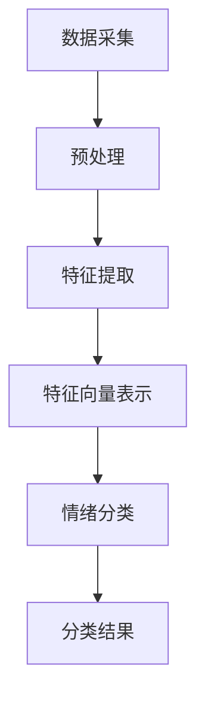

                 

### # AI Agent在智能项链中的情绪监测

> 关键词：AI Agent、智能项链、情绪监测、算法实现、系统架构设计

> 摘要：本文深入探讨AI Agent在智能项链中的情绪监测应用，从背景介绍到核心概念解析，再到算法原理讲解和系统架构设计，全面解析这一前沿技术。通过分析情绪监测在智能项链中的重要作用，阐述AI Agent在其中的工作原理和实现策略，详细描述情绪监测算法的数学模型及Python实现，最终展示智能项链的系统设计与项目实战。本文旨在为读者提供清晰、系统的技术理解和实践指导。

### # 目录大纲：AI Agent在智能项链中的情绪监测

## 第一部分：背景介绍

### 1.1 问题背景

#### 1.1.1 情绪监测的重要性

情绪监测作为一种理解人类情感状态的技术，在现代社会中越来越受到关注。它不仅有助于个性化服务的发展，还在医疗、教育、心理咨询等多个领域具有广泛应用。例如，在心理健康监测中，情绪监测可以帮助医生更好地了解患者的情感状态，从而制定更有效的治疗方案。

#### 1.1.2 智能项链的兴起

随着可穿戴设备的兴起，智能项链作为一种新型的智能穿戴设备，越来越受到消费者的青睐。智能项链不仅具备传统的装饰功能，还融合了健康监测、位置追踪、通信等功能。在这样的背景下，情绪监测成为智能项链的一个重要发展方向。

#### 1.1.3 AI Agent在情绪监测中的应用前景

AI Agent（人工智能代理）是一种能够自主执行任务的人工智能系统。在情绪监测中，AI Agent可以通过分析用户的行为和生理信号，实时监测用户的情绪状态，为用户提供个性化服务。AI Agent在智能项链中的应用前景广阔，有望提升用户的整体体验。

### 1.2 问题描述

#### 1.2.1 情绪监测的挑战

情绪监测面临的主要挑战包括数据噪音、情绪表达的多样性以及实时性要求等。此外，如何准确地提取和分析情绪信息，并对其进行有效处理，也是一个关键问题。

#### 1.2.2 智能项链的功能需求

智能项链需要具备实时情绪监测功能，包括对用户情绪状态的识别、分析和反馈。此外，智能项链还应当具备数据存储、用户隐私保护等功能。

#### 1.2.3 AI Agent的设计目标

AI Agent的设计目标是在智能项链中实现高效的情绪监测，同时保证系统的实时性和可靠性。此外，AI Agent还需要具备可扩展性和适应性，以适应不同用户的需求。

### 1.3 问题解决

#### 1.3.1 AI Agent的基本原理

AI Agent的基本原理包括感知模块、决策模块和执行模块。感知模块负责收集用户的数据，决策模块负责分析这些数据并做出决策，执行模块负责根据决策结果执行相应的操作。

#### 1.3.2 情绪监测的算法实现

情绪监测的算法实现主要包括特征提取和情绪分类。特征提取旨在从原始数据中提取出能够反映情绪状态的特征，情绪分类则是根据这些特征对用户的情绪状态进行分类。

#### 1.3.3 智能项链的技术架构

智能项链的技术架构包括硬件层、感知层、数据处理层和应用层。硬件层负责数据的采集和传输，感知层负责情绪状态的识别，数据处理层负责数据的存储和处理，应用层则提供用户交互界面和功能实现。

### 1.4 边界与外延

#### 1.4.1 情绪监测的边界问题

情绪监测的边界问题主要包括情绪识别的准确率、情绪表达的多样性以及用户的隐私保护等。

#### 1.4.2 智能项链的适用范围

智能项链主要适用于需要情绪监测的场合，如心理咨询、心理健康管理、智能家居等。

#### 1.4.3 AI Agent的未来发展方向

AI Agent在情绪监测中的应用将继续发展，未来可能实现更精确的情绪识别、更智能的决策和更人性化的交互。

### 1.5 概念结构与核心要素组成

#### 1.5.1 AI Agent的概念结构

AI Agent的概念结构包括感知模块、决策模块和执行模块。每个模块都有其特定的功能和作用，共同构成了一个完整的情绪监测系统。

#### 1.5.2 情绪监测的核心要素

情绪监测的核心要素包括情绪特征提取、情绪分类和情绪反馈。这些要素共同决定了情绪监测系统的性能和效果。

#### 1.5.3 智能项链的技术要素

智能项链的技术要素包括传感器、微控制器、通信模块和数据处理单元等。这些技术要素共同构成了智能项链的硬件基础。

### 1.6 本章小结

本章从背景介绍出发，阐述了情绪监测在智能项链中的应用及其重要性。接下来，我们进一步分析了情绪监测所面临的挑战、智能项链的功能需求以及AI Agent的设计目标。通过对AI Agent的基本原理、情绪监测的算法实现以及智能项链的技术架构的介绍，我们为后续章节的深入探讨奠定了基础。在边界与外延部分，我们讨论了情绪监测的边界问题和智能项链的适用范围，并展望了AI Agent的未来发展方向。最后，本章总结了AI Agent、情绪监测和智能项链的概念结构与核心要素组成。

### # 第一部分：背景介绍

情绪监测是一种通过技术手段来捕捉和分析个体情绪状态的方法。它不仅有助于提高用户的生活质量，还在医疗、教育、商业等多个领域具有重要的应用价值。随着人工智能技术的不断发展，情绪监测正逐渐从实验室走向实际应用，成为智能设备的重要组成部分。

#### 1.1.1 情绪监测的重要性

情绪监测的重要性主要体现在以下几个方面：

1. **个性化服务**：通过情绪监测，可以了解用户的情感需求，从而提供更加个性化的服务。例如，在智能家居系统中，根据用户的情绪状态来调整室内温度、音乐播放等，以提升用户的舒适度。

2. **心理健康管理**：情绪监测可以帮助医生和心理咨询师更好地了解患者的情绪状态，从而制定更有效的治疗和康复计划。

3. **用户体验优化**：在商业领域，情绪监测可以帮助企业了解用户对产品的情感反应，从而优化产品设计和服务质量，提升用户体验。

4. **教育辅助**：在教育领域，情绪监测可以用于监测学生的学习状态，及时发现和解决学生的情绪问题，提高教育效果。

#### 1.1.2 智能项链的兴起

智能项链作为一种新型的智能穿戴设备，具有装饰、健康监测、位置追踪、通信等多种功能。它的兴起主要受到以下因素的影响：

1. **可穿戴设备的普及**：随着智能手机和智能手表的普及，人们开始对更多类型的智能穿戴设备产生需求，智能项链正是这一趋势的产物。

2. **健康意识的提升**：现代社会中，人们对健康的关注度日益提高，智能项链提供的健康监测功能满足了这一需求。

3. **时尚与科技的结合**：智能项链不仅具备实用性，还具有时尚元素，能够满足人们对美和个性的追求。

#### 1.1.3 AI Agent在情绪监测中的应用前景

AI Agent（人工智能代理）是一种能够模拟人类行为和思维过程的人工智能系统。在情绪监测中，AI Agent具有以下应用前景：

1. **实时情绪分析**：AI Agent可以通过分析用户的行为和生理信号，实时监测用户的情绪状态，为用户提供即时的反馈和帮助。

2. **个性化服务**：基于用户的情绪状态，AI Agent可以提供个性化的建议和服务，提高用户的满意度和幸福感。

3. **心理健康干预**：AI Agent可以与心理咨询师协同工作，为用户提供心理健康干预，帮助他们更好地管理情绪。

4. **智能家居控制**：AI Agent可以基于用户的情绪状态来调整智能家居设备，如空调、灯光、音响等，为用户提供舒适的生活环境。

### 1.2 问题描述

#### 1.2.1 情绪监测的挑战

情绪监测虽然具有广泛的应用前景，但也面临着一系列挑战：

1. **数据噪音**：情绪监测通常依赖于生理信号和行为数据的分析，但这些数据容易受到环境噪音和个体差异的影响，导致数据质量下降。

2. **情绪表达的多样性**：不同的人有不同的情绪表达方式，而且同一种情绪在不同人身上可能表现出不同的特征，这使得情绪监测的准确性受到挑战。

3. **实时性要求**：情绪监测需要快速响应用户的情绪变化，但生理信号的处理和分析通常需要一定的时间，如何在保证实时性的同时提高准确性是一个难题。

4. **隐私保护**：情绪监测涉及到用户的隐私数据，如何保护用户隐私，避免数据泄露，是情绪监测应用中必须解决的问题。

#### 1.2.2 智能项链的功能需求

智能项链需要实现以下功能需求：

1. **实时情绪监测**：智能项链需要能够实时监测用户的情绪状态，并对其进行识别和分析。

2. **数据存储**：智能项链需要具备数据存储功能，以便记录用户的情绪变化历史，为后续分析提供数据支持。

3. **用户隐私保护**：智能项链需要采用有效的隐私保护措施，确保用户的情绪数据不会被未经授权的人员访问。

4. **个性化服务**：智能项链需要根据用户的情绪状态提供个性化的建议和服务，提高用户的满意度。

#### 1.2.3 AI Agent的设计目标

AI Agent在智能项链中的应用目标主要包括：

1. **高效情绪监测**：AI Agent需要能够快速、准确地监测用户的情绪状态，提高情绪监测的效率。

2. **实时反馈**：AI Agent需要能够实时响应用户的情绪变化，提供即时的反馈和建议。

3. **适应性**：AI Agent需要具备良好的适应性，能够根据用户的需求和环境变化调整其工作方式。

4. **可靠性**：AI Agent需要具备高可靠性，能够在不同环境下稳定运行，确保情绪监测的连续性和稳定性。

### 1.3 问题解决

#### 1.3.1 AI Agent的基本原理

AI Agent的基本原理可以分为感知、决策和执行三个模块：

1. **感知模块**：感知模块负责收集用户的行为和生理信号，如心率、皮肤电导、步态等，这些信号是情绪监测的重要数据来源。

2. **决策模块**：决策模块负责分析感知模块收集到的数据，通过特征提取和情绪分类算法，对用户的情绪状态进行识别和判断。

3. **执行模块**：执行模块根据决策模块的结果，执行相应的操作，如调整环境参数、发送反馈信息等。

#### 1.3.2 情绪监测的算法实现

情绪监测的算法实现主要包括以下步骤：

1. **数据采集**：通过传感器收集用户的行为和生理信号。

2. **预处理**：对采集到的数据进行预处理，包括滤波、去噪、归一化等，以提高数据质量。

3. **特征提取**：从预处理后的数据中提取能够反映情绪状态的特征，如心率变异性、皮肤电导的变化等。

4. **情绪分类**：使用机器学习算法对提取的特征进行分类，识别用户的情绪状态。

5. **反馈生成**：根据情绪分类结果，生成相应的反馈信息，如语音提示、屏幕显示等。

#### 1.3.3 智能项链的技术架构

智能项链的技术架构可以分为硬件层、感知层、数据处理层和应用层：

1. **硬件层**：包括传感器、微控制器、电池等硬件设备，负责数据的采集和传输。

2. **感知层**：负责情绪状态的识别，通过算法分析传感器数据，提取情绪特征。

3. **数据处理层**：负责数据的存储、处理和分析，包括特征提取、情绪分类等。

4. **应用层**：提供用户交互界面和功能实现，如情绪反馈、个性化服务等。

### 1.4 边界与外延

#### 1.4.1 情绪监测的边界问题

情绪监测的边界问题主要包括以下几个方面：

1. **情绪识别的准确率**：情绪监测系统的准确率受多种因素影响，如数据质量、算法性能等，如何提高情绪识别的准确率是一个关键问题。

2. **情绪表达的多样性**：不同的人有不同的情绪表达方式，如何适应这种多样性，提高情绪监测的泛化能力，是另一个挑战。

3. **用户的隐私保护**：情绪监测涉及到用户的隐私数据，如何确保这些数据的安全，避免泄露，是一个重要的边界问题。

#### 1.4.2 智能项链的适用范围

智能项链主要适用于以下场合：

1. **心理咨询**：智能项链可以帮助心理咨询师更好地了解患者的情绪状态，提高治疗效果。

2. **心理健康管理**：智能项链可以用于日常情绪监测，帮助用户了解自己的情绪变化，进行自我管理。

3. **智能家居**：智能项链可以与智能家居系统结合，根据用户情绪调整室内环境，提升生活质量。

#### 1.4.3 AI Agent的未来发展方向

AI Agent在情绪监测中的应用前景广阔，未来可能的发展方向包括：

1. **更精确的情绪识别**：通过改进算法和增加数据量，提高情绪识别的准确率和泛化能力。

2. **更智能的决策**：结合大数据分析和机器学习，使AI Agent能够更智能地根据情绪状态做出决策。

3. **更人性化的交互**：通过自然语言处理和语音识别等技术，实现更自然、更人性化的用户交互。

### 1.5 概念结构与核心要素组成

#### 1.5.1 AI Agent的概念结构

AI Agent的概念结构包括以下核心模块：

1. **感知模块**：负责数据采集和预处理，如传感器数据收集、信号滤波等。

2. **决策模块**：负责数据分析和情绪分类，如特征提取、机器学习算法等。

3. **执行模块**：负责根据决策结果执行操作，如反馈生成、环境调整等。

#### 1.5.2 情绪监测的核心要素

情绪监测的核心要素包括：

1. **情绪特征提取**：从行为和生理信号中提取能够反映情绪状态的特征。

2. **情绪分类**：使用机器学习算法对提取的特征进行分类，识别用户的情绪状态。

3. **情绪反馈**：根据情绪分类结果，生成相应的反馈信息，如语音提示、屏幕显示等。

#### 1.5.3 智能项链的技术要素

智能项链的技术要素包括：

1. **传感器**：用于采集用户的行为和生理信号，如心率传感器、皮肤电传感器等。

2. **微控制器**：负责数据处理和算法执行，如数据预处理、情绪分类等。

3. **通信模块**：用于数据传输和远程交互，如Wi-Fi、蓝牙等。

### 1.6 本章小结

本章从背景介绍出发，详细阐述了情绪监测在智能项链中的应用及其重要性。接着，我们分析了情绪监测所面临的挑战、智能项链的功能需求以及AI Agent的设计目标。通过对AI Agent的基本原理、情绪监测的算法实现以及智能项链的技术架构的介绍，我们为后续章节的深入探讨奠定了基础。在边界与外延部分，我们讨论了情绪监测的边界问题和智能项链的适用范围，并展望了AI Agent的未来发展方向。最后，本章总结了AI Agent、情绪监测和智能项链的概念结构与核心要素组成，为读者理解后续内容提供了清晰的框架。

### # 第二部分：核心概念与联系

在深入探讨AI Agent在智能项链中的情绪监测之前，我们需要明确几个核心概念，并理解它们之间的联系。这一部分将介绍AI Agent的基本原理、情绪监测的算法原理、AI Agent与情绪监测的联系，以及实体关系图（ER图）的架构。

#### 2.1 AI Agent的基本原理

AI Agent（人工智能代理）是一种能够模拟人类行为和思维过程的人工智能系统。它具备自主感知、决策和执行的能力，能够在特定的环境和任务中实现自动化操作。AI Agent的基本原理可以分为以下几个部分：

1. **感知模块**：感知模块是AI Agent的感知系统，负责收集环境中的各种信息。在情绪监测中，感知模块通常包括传感器，如心率传感器、皮肤电传感器等，用于采集用户的生理和行为数据。

2. **决策模块**：决策模块是AI Agent的智能核心，负责分析感知模块收集到的数据，并基于预定的算法或规则做出决策。在情绪监测中，决策模块需要通过特征提取和情绪分类算法，识别用户的情绪状态。

3. **执行模块**：执行模块是AI Agent的执行系统，负责根据决策模块的决策结果执行具体的操作。在情绪监测中，执行模块可以发送反馈信息、调整环境参数或提供个性化的服务。

#### 2.2 情绪监测的算法原理

情绪监测的算法原理主要包括以下几个步骤：

1. **数据采集**：使用传感器收集用户的生理和行为数据，如心率、皮肤电导、步态等。

2. **预处理**：对采集到的原始数据进行预处理，包括滤波、去噪、归一化等，以提高数据质量。

3. **特征提取**：从预处理后的数据中提取能够反映情绪状态的特征，如心率变异性、皮肤电导的变化等。

4. **情绪分类**：使用机器学习算法对提取的特征进行分类，识别用户的情绪状态。常用的情绪分类算法包括支持向量机（SVM）、随机森林（Random Forest）、深度学习等。

5. **反馈生成**：根据情绪分类结果，生成相应的反馈信息，如语音提示、屏幕显示等，以帮助用户理解和管理自己的情绪。

#### 2.3 AI Agent与情绪监测的联系

AI Agent与情绪监测之间的联系主要体现在以下几个方面：

1. **数据驱动**：情绪监测需要依赖大量的数据进行分析和训练，而AI Agent的感知模块可以提供这些数据。通过不断收集用户的生理和行为数据，AI Agent能够不断提高情绪监测的准确性和效率。

2. **智能决策**：AI Agent的决策模块可以根据情绪监测的结果，做出智能化的决策。例如，当检测到用户处于焦虑状态时，AI Agent可以提供放松训练或寻求心理咨询的建议。

3. **个性化服务**：AI Agent可以根据用户的情绪状态提供个性化的服务，如调整室内环境、推荐合适的音乐等，以提升用户的整体体验。

4. **实时反馈**：AI Agent的执行模块可以实时响应用户的情绪变化，提供即时的反馈和建议，帮助用户更好地管理情绪。

#### 2.4 ER实体关系图架构

实体关系图（ER图）是数据库设计中的一个重要工具，用于描述系统中各个实体之间的关系。在情绪监测和AI Agent的架构设计中，ER图可以清晰地展示各部分之间的关联。以下是一个简化的ER图示例：

```mermaid
erDiagram
  User ||--|{ AI-Agent } : monitoredBy
  User ||--|{ Emotion } : expresses
  AI-Agent ||--|{ Feature } : extracts
  AI-Agent ||--|{ Algorithm } : implements
  Emotion ||--|{ Feedback } : receives
  Feature ||--|{ Sensor } : measuredBy
  Sensor ||--|{ Data } : stores
```

在这个ER图中：

- **User（用户）**：表示使用智能项链的用户。
- **AI-Agent（AI代理）**：负责情绪监测的AI系统。
- **Emotion（情绪）**：表示用户的情绪状态。
- **Feature（特征）**：从传感器数据中提取的情绪特征。
- **Algorithm（算法）**：用于情绪分类和决策的算法。
- **Feedback（反馈）**：根据情绪状态生成的反馈信息。
- **Sensor（传感器）**：用于数据采集的传感器。
- **Data（数据）**：存储的原始传感器数据。

通过ER图，我们可以清晰地看到各个实体之间的关联，以及它们在情绪监测系统中的作用。

#### 2.5 本章小结

本章介绍了AI Agent的基本原理、情绪监测的算法原理，以及AI Agent与情绪监测之间的联系。同时，通过实体关系图（ER图）展示了情绪监测系统的整体架构。这些核心概念的解析为我们理解智能项链中的情绪监测奠定了基础。在下一章中，我们将深入探讨情绪监测算法的数学模型和实现方法。

### # 第二部分：核心概念与联系

#### 2.1 AI Agent的基本原理

AI Agent（人工智能代理）是一种模拟人类行为和思维过程的人工智能系统。在情绪监测中，AI Agent具有至关重要的地位。它的基本原理包括感知、决策和执行三个核心模块：

1. **感知模块**：感知模块是AI Agent的基础，负责从环境中收集各种信息。在情绪监测中，感知模块通过传感器收集用户的生理信号和行为数据。这些传感器可以是心率传感器、皮肤电传感器、加速度传感器等。感知模块不仅需要采集数据，还需要对数据进行预处理，包括滤波、去噪和归一化，以确保数据的质量和一致性。

2. **决策模块**：决策模块是AI Agent的智能核心，负责分析感知模块收集到的数据，并基于预定的算法或规则做出决策。在情绪监测中，决策模块通过特征提取算法从原始数据中提取出与情绪相关的特征，然后使用情绪分类算法对用户的情绪状态进行识别和判断。常见的情绪分类算法包括支持向量机（SVM）、决策树、随机森林和深度学习等。

3. **执行模块**：执行模块是AI Agent的执行系统，负责根据决策模块的决策结果执行具体的操作。在情绪监测中，执行模块可以根据用户的情绪状态生成反馈信息，例如语音提示、屏幕显示、环境调整等，以帮助用户理解和管理自己的情绪。执行模块还可以与其他系统进行交互，例如向医生、心理咨询师或其他AI系统发送数据或请求支持。

#### 2.2 情绪监测的算法原理

情绪监测算法的核心目标是准确识别用户的情绪状态，并根据这些状态提供相应的反馈和服务。情绪监测算法通常包括以下几个关键步骤：

1. **数据采集**：情绪监测算法首先需要收集用户的生理信号和行为数据。这些数据可以从多种传感器获得，如心率传感器、皮肤电传感器、加速度传感器等。此外，还可以结合其他数据源，如用户的行为记录、环境数据等。

2. **预处理**：原始数据通常包含噪声和异常值，因此需要通过预处理步骤来提高数据的质量。预处理步骤包括滤波、去噪、归一化等。滤波可以去除高频噪声和低频漂移，去噪可以去除随机噪声，归一化可以调整数据范围，以便后续处理。

3. **特征提取**：特征提取是将原始数据转换为能够反映情绪状态的特征向量的过程。常用的特征提取方法包括时域特征、频域特征和时频特征。时域特征包括均值、方差、标准差等；频域特征包括频谱、频域矩等；时频特征包括短时傅里叶变换（STFT）和小波变换等。

4. **情绪分类**：情绪分类是情绪监测的核心步骤，目的是将提取的特征向量映射到相应的情绪类别。常见的情绪分类算法包括基于统计方法的朴素贝叶斯、支持向量机（SVM）、基于树的方法如决策树和随机森林、以及基于神经网络的深度学习算法等。

5. **反馈生成**：一旦情绪分类完成，执行模块会根据分类结果生成相应的反馈。这些反馈可以是文本、语音、图像或其他形式，以帮助用户理解和应对当前的情绪状态。反馈还可以包括环境调整，例如调节室内温度、光线等，以帮助用户放松或提高精神状态。

#### 2.3 AI Agent与情绪监测的联系

AI Agent与情绪监测之间的联系非常紧密，它们共同构成了一个完整的情绪监测系统。以下是AI Agent与情绪监测之间的几个关键联系：

1. **数据驱动**：情绪监测需要依赖大量的数据进行分析和训练，而AI Agent的感知模块可以提供这些数据。通过不断收集用户的生理信号和行为数据，AI Agent能够逐步提高情绪监测的准确性和泛化能力。

2. **智能决策**：AI Agent的决策模块可以根据情绪监测的结果，做出智能化的决策。例如，当检测到用户处于焦虑状态时，AI Agent可以提供放松训练或建议用户寻求心理咨询。

3. **个性化服务**：AI Agent可以根据用户的情绪状态提供个性化的服务，例如调整音乐播放、提供阅读材料、推荐放松活动等，以提高用户的满意度和幸福感。

4. **实时反馈**：AI Agent的执行模块可以实时响应用户的情绪变化，提供即时的反馈和建议，帮助用户更好地管理情绪。这种实时反馈机制对于需要快速响应的场景，如心理咨询或紧急情况下的情绪干预，尤为重要。

#### 2.4 ER实体关系图架构

为了更好地理解情绪监测系统中各个组件之间的关系，我们可以使用实体关系图（ER图）来展示。以下是一个简化的情绪监测系统的ER图：

```mermaid
erDiagram
  User ||--|{ AI-Agent } : monitoredBy
  User ||--|{ Emotion } : expresses
  AI-Agent ||--|{ Feature } : extracts
  AI-Agent ||--|{ Algorithm } : implements
  Emotion ||--|{ Feedback } : receives
  Feature ||--|{ Sensor } : measuredBy
  Sensor ||--|{ Data } : stores
```

在这个ER图中：

- **User（用户）**：表示情绪监测的目标对象，即用户。
- **AI-Agent（AI代理）**：负责情绪监测的AI系统，包括感知、决策和执行模块。
- **Emotion（情绪）**：表示用户的情绪状态。
- **Feature（特征）**：从传感器数据中提取的情绪特征。
- **Algorithm（算法）**：用于情绪分类和决策的算法。
- **Feedback（反馈）**：根据情绪状态生成的反馈信息。
- **Sensor（传感器）**：用于数据采集的传感器。
- **Data（数据）**：存储的原始传感器数据。

通过ER图，我们可以清晰地看到各个实体之间的关联，以及它们在情绪监测系统中的作用。这种结构化的表示方式有助于我们更好地理解系统的运作机制。

#### 2.5 本章小结

本章深入探讨了AI Agent在情绪监测中的基本原理，包括感知、决策和执行模块的功能。同时，我们介绍了情绪监测算法的原理，以及AI Agent与情绪监测之间的紧密联系。最后，通过实体关系图（ER图）展示了情绪监测系统中各个组件之间的关系。这些核心概念和联系为我们理解和分析情绪监测系统提供了坚实的基础。在下一章中，我们将进一步探讨情绪监测算法的具体实现和数学模型。

### # 第三部分：算法原理讲解

#### 3.1 情绪监测算法的数学模型

情绪监测算法的数学模型是情绪监测系统的核心组成部分，它负责从原始数据中提取情绪特征，并通过这些特征对情绪状态进行分类。以下是一个情绪监测算法的典型数学模型及其组成部分：

1. **数据采集**：情绪监测的第一步是数据采集。这通常包括用户的生理信号（如心率、皮肤电导、呼吸频率等）和行为数据（如步态、面部表情等）。这些数据可以通过多种传感器实时获取。

2. **预处理**：原始数据通常包含噪声和异常值，因此需要进行预处理。预处理步骤包括滤波、去噪和归一化。滤波可以去除高频噪声和低频漂移，去噪可以去除随机噪声，归一化可以调整数据范围，使其适合后续处理。

3. **特征提取**：特征提取是将原始数据转换为能够反映情绪状态的特征向量的过程。常用的特征提取方法包括时域特征（如均值、方差、标准差）、频域特征（如频谱、频域矩）和时频特征（如短时傅里叶变换、小波变换）。

4. **特征向量表示**：预处理后的数据被转换为特征向量。这些特征向量通常包含多个维度，每个维度都反映了不同类型的情绪信息。

5. **情绪分类**：情绪分类是情绪监测算法的核心步骤。它将特征向量映射到预定义的情绪类别。常用的情绪分类算法包括支持向量机（SVM）、决策树、随机森林和深度学习等。这些算法通过训练数据学习情绪特征和类别之间的映射关系。

6. **分类结果**：分类算法输出情绪分类结果，这些结果可以是一个概率分布，表示用户属于不同情绪类别的概率。

以下是一个简单的数学模型公式，用于描述情绪分类过程：

$$
\hat{y} = f(\text{features}, \theta)
$$

其中，$\hat{y}$ 是预测的情绪类别，$f$ 是分类函数，$\text{features}$ 是特征向量，$\theta$ 是模型的参数。

#### 3.2 算法mermaid流程图

为了更直观地理解情绪监测算法的流程，我们可以使用mermaid绘制一个流程图。以下是一个简化的情绪监测算法的mermaid流程图：



在这个流程图中：

- **A（数据采集）**：表示从传感器获取用户的数据。
- **B（预处理）**：表示对采集到的数据进行滤波、去噪和归一化处理。
- **C（特征提取）**：表示从预处理后的数据中提取情绪特征。
- **D（特征向量表示）**：表示将提取的特征转换为特征向量。
- **E（情绪分类）**：表示使用分类算法对特征向量进行分类。
- **F（分类结果）**：表示输出分类结果。

#### 3.3 Python源代码详解

情绪监测算法的实现通常涉及大量的代码，以下是一个简单的Python代码示例，用于实现情绪监测的核心功能。这个例子使用了支持向量机（SVM）作为分类算法。

```python
import numpy as np
from sklearn import svm
from sklearn.model_selection import train_test_split
from sklearn.metrics import accuracy_score

# 数据预处理
def preprocess_data(data):
    # 对数据进行滤波、去噪和归一化
    # 这里简化为直接返回数据
    return data

# 特征提取
def extract_features(data):
    # 提取情绪特征
    # 这里简化为计算均值和方差
    means = np.mean(data, axis=1)
    variances = np.var(data, axis=1)
    return np.hstack((means, variances))

# 情绪分类
def classify_emo

