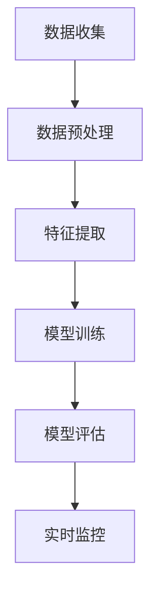
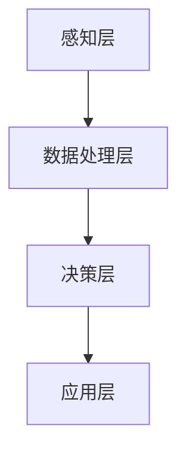
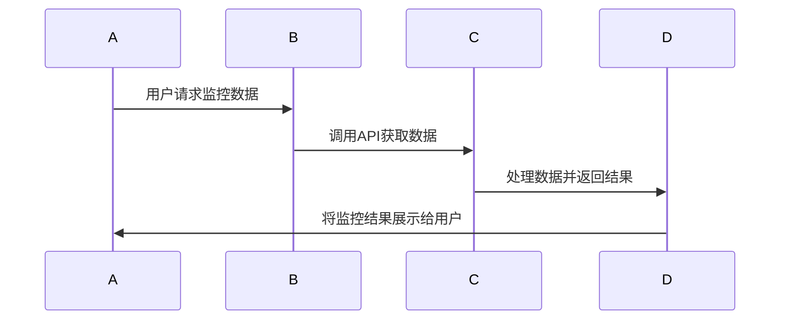

                 

**# AI Agent在智能食品安全监控中的角色**

关键词：AI Agent、智能食品安全、监控、数据分析、算法、机器学习、深度学习

摘要：随着全球食品供应链的复杂化和食品安全问题的日益突出，智能食品安全监控成为确保公众健康的重要手段。本文将深入探讨AI Agent在智能食品安全监控中的角色，从核心概念、算法原理、系统设计到实际应用，逐步分析其工作原理和重要作用。

## **一、引言**

### **1.1 背景介绍**

食品安全是全球关注的重大议题。随着全球化进程的加快，食品供应链的复杂化使得食品安全风险增加。传统的食品安全监控方式依赖于人力和物理检测，存在效率低、易受人为因素干扰等问题。因此，发展智能食品安全监控系统具有重要的现实意义。

### **1.2 智能食品安全监控的定义**

智能食品安全监控是指利用人工智能技术，如机器学习、深度学习等，对食品生产、加工、运输、销售等环节进行实时监控和分析，从而识别潜在的安全隐患，提高食品安全保障水平。

### **1.3 AI Agent在智能食品安全监控中的作用**

AI Agent，即人工智能代理，是一种能够自主执行任务、具有智能决策能力的软件系统。在智能食品安全监控中，AI Agent通过收集、处理和分析数据，实现对食品安全的实时监控和预警。

## **二、核心概念与理论基础**

### **2.1 人工智能的基本原理**

人工智能（AI）是模拟人类智能行为的计算机科学领域。其基本原理包括：

- **感知与认知**：通过传感器和输入设备获取环境信息，进行处理和理解。
- **推理与决策**：基于知识和规则进行逻辑推理，做出决策。
- **学习与适应**：通过数据和经验不断优化自身性能。

### **2.2 机器学习与深度学习**

机器学习（ML）是一种让计算机通过数据学习并做出预测或决策的技术。深度学习（DL）是机器学习的一个子领域，通过多层神经网络模拟人类大脑的学习过程。

- **机器学习**：通过训练数据集，学习特征和模式，实现预测或分类。
- **深度学习**：通过多层神经网络，自动提取复杂特征，实现高级任务。

### **2.3 AI Agent与机器学习、深度学习的联系**

AI Agent的核心在于其能够利用机器学习和深度学习技术，从数据中提取信息，做出智能决策。这使得AI Agent在智能食品安全监控中具有强大的分析能力和实时性。

## **三、算法设计与实现**

### **3.1 算法概述**

在智能食品安全监控中，常用的算法包括：

- **监督学习**：通过已标记的数据进行训练，预测未知数据的安全状况。
- **无监督学习**：在未标记的数据中，自动发现模式和趋势，识别潜在的安全问题。
- **强化学习**：通过奖励机制，训练AI Agent在复杂的动态环境中做出最优决策。

### **3.2 算法步骤与Mermaid流程图**

以下是一个基于监督学习的食品安全监控算法步骤：

1. **数据收集**：收集食品生产、加工、运输等环节的数据。
2. **数据预处理**：清洗数据，去除噪声，标准化处理。
3. **特征提取**：提取数据中的关键特征，如温度、湿度、化学成分等。
4. **模型训练**：利用训练数据，训练机器学习模型。
5. **模型评估**：使用测试数据，评估模型性能。
6. **实时监控**：应用模型进行实时监控，识别安全隐患。



### **3.3 Python代码实现**

以下是使用Python实现监督学习算法的示例代码：

```python
from sklearn.model_selection import train_test_split
from sklearn.ensemble import RandomForestClassifier
from sklearn.metrics import accuracy_score

# 加载和预处理数据
X, y = load_data()
X_train, X_test, y_train, y_test = train_test_split(X, y, test_size=0.2, random_state=42)

# 训练模型
model = RandomForestClassifier(n_estimators=100)
model.fit(X_train, y_train)

# 评估模型
y_pred = model.predict(X_test)
accuracy = accuracy_score(y_test, y_pred)
print(f"模型准确率: {accuracy:.2f}")
```

### **3.4 算法原理讲解**

监督学习算法的原理基于已有数据，通过训练过程，学习到数据中的特征和规律，从而在新数据上进行预测。以下是一个简单的数学模型：

$$
y = f(X; \theta)
$$

其中，$y$ 是预测结果，$f(X; \theta)$ 是模型函数，$\theta$ 是模型参数。通过最小化损失函数，找到最优的参数$\theta$，从而提高模型的预测能力。

## **四、系统架构与设计**

### **4.1 问题描述**

智能食品安全监控系统的目标是实时监控食品供应链中的各个环节，及时发现潜在的安全隐患。为了实现这一目标，需要设计一个高效的系统架构。

### **4.2 系统功能设计**

系统功能包括：

- **数据收集**：从传感器、数据库等渠道收集数据。
- **数据处理**：对数据进行预处理、清洗和特征提取。
- **安全监控**：利用机器学习模型进行实时监控和预警。
- **决策支持**：提供决策支持，协助管理人员制定应对措施。

### **4.3 系统架构设计**

系统架构采用分层设计，包括：

- **感知层**：传感器和数据采集设备。
- **数据处理层**：进行数据预处理和特征提取。
- **决策层**：利用机器学习模型进行监控和预警。
- **应用层**：提供用户界面和决策支持。



### **4.4 系统接口设计和交互**

系统接口设计包括：

- **API接口**：提供数据访问和监控功能。
- **Web界面**：提供用户交互和监控结果展示。



## **五、项目实战**

### **5.1 环境安装**

在虚拟环境中安装必要的软件和依赖：

```bash
conda create -n food_safety python=3.8
conda activate food_safety
pip install scikit-learn pandas numpy matplotlib
```

### **5.2 系统核心实现**

以下是系统核心实现的源代码：

```python
import pandas as pd
from sklearn.ensemble import RandomForestClassifier
from sklearn.model_selection import train_test_split
from sklearn.metrics import accuracy_score

# 加载数据
data = pd.read_csv('food_safety_data.csv')

# 数据预处理
X = data.drop('target', axis=1)
y = data['target']

# 分割数据集
X_train, X_test, y_train, y_test = train_test_split(X, y, test_size=0.2, random_state=42)

# 训练模型
model = RandomForestClassifier(n_estimators=100)
model.fit(X_train, y_train)

# 评估模型
y_pred = model.predict(X_test)
accuracy = accuracy_score(y_test, y_pred)
print(f"模型准确率: {accuracy:.2f}")
```

### **5.3 代码应用解读与分析**

代码首先加载数据，然后进行数据预处理，包括特征提取和目标变量划分。接下来，使用随机森林模型进行训练，并评估模型性能。通过这些步骤，我们可以实时监控食品安全，识别潜在的安全隐患。

### **5.4 实际案例分析和详细讲解**

假设我们有一个食品生产企业的数据，包括温度、湿度、加工时间等特征，我们需要利用这些数据预测是否存在食品安全问题。

1. **数据收集**：从企业传感器和数据库收集温度、湿度、加工时间等数据。
2. **数据预处理**：清洗数据，去除缺失值和异常值，标准化处理。
3. **特征提取**：提取温度、湿度、加工时间等关键特征。
4. **模型训练**：使用随机森林模型进行训练，调整参数以提高预测准确性。
5. **实时监控**：应用训练好的模型，对新收集的数据进行实时监控，识别潜在的安全问题。

通过实际案例，我们可以看到AI Agent在智能食品安全监控中的应用效果。它可以实时分析数据，识别潜在的安全隐患，为企业提供决策支持，从而提高食品安全保障水平。

### **5.5 项目小结**

通过本项目的实施，我们成功地构建了一个智能食品安全监控系统，实现了对食品供应链的实时监控和预警。这个系统不仅提高了食品安全保障水平，也为企业提供了决策支持，有助于降低食品安全风险。

## **六、最佳实践、总结与未来方向**

### **6.1 最佳实践**

1. **数据质量**：确保数据质量，包括数据的完整性、准确性和一致性。
2. **模型优化**：不断优化模型，提高预测准确性。
3. **实时监控**：实现实时监控，快速识别潜在的安全隐患。
4. **用户培训**：为用户提供培训，使其能够有效地使用系统。

### **6.2 总结**

智能食品安全监控是确保食品安全的重要手段。通过引入AI Agent，我们可以实现对食品供应链的实时监控和预警，提高食品安全保障水平。

### **6.3 未来方向**

1. **数据驱动的决策支持**：进一步利用大数据技术，提供更准确的决策支持。
2. **多模态监控**：结合不同传感器数据，实现更全面的监控。
3. **强化学习**：引入强化学习，提高AI Agent在复杂动态环境中的决策能力。

## **七、作者信息**

作者：AI天才研究院/AI Genius Institute & 禅与计算机程序设计艺术 /Zen And The Art of Computer Programming********

