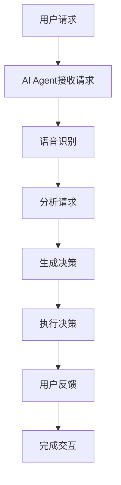

                 

# AI Agent在智能餐桌中的社交互动促进

> 关键词：人工智能、社交互动、智能餐桌、AI Agent、自然语言处理、机器学习

> 摘要：本文探讨了人工智能（AI）在智能餐桌中的社交互动促进。通过介绍AI Agent的定义与特点，以及其在智能餐桌中的应用，本文分析了AI Agent在智能餐桌中的社交互动机制，并详细讲解了社交互动的算法原理、系统架构设计以及项目实战，为智能餐桌的设计与实现提供了有价值的参考。

## 第一部分: AI Agent的基本概念与功能

### 第1章: AI Agent的定义与特点

#### 1.1 AI Agent的定义

AI Agent，即人工智能代理，是一种能够自主感知环境、自主决策并采取行动的智能实体。它在一定程度上模拟了人类的行为和思维方式，能够处理复杂的信息，与人类或其他智能实体进行交互。

#### 1.2 AI Agent的主要特点

- **自主性**：AI Agent能够独立完成任务，不需要人类干预。
- **适应性**：AI Agent能够根据环境和任务的变化，调整自己的行为策略。
- **交互性**：AI Agent能够与人类或其他智能实体进行有效沟通，实现信息的传递与共享。

#### 1.3 AI Agent与传统智能系统的区别

- **被动响应 vs. 自主行动**：传统智能系统往往只能被动响应输入，而AI Agent能够主动感知环境并采取行动。
- **单一任务 vs. 多任务处理**：传统智能系统通常专注于单一任务，而AI Agent能够同时处理多个任务。
- **规则驱动 vs. 数据驱动**：传统智能系统主要基于规则进行操作，而AI Agent则更多地依赖于数据驱动的方法。

#### 1.4 AI Agent的应用前景

AI Agent在各个领域都有着广泛的应用前景，例如智能客服、智能交通、智能家居等。在智能餐桌中，AI Agent可以提供个性化的服务，提升用户体验，促进社交互动。

### 第2章: AI Agent的技术基础

#### 2.1 自然语言处理技术

自然语言处理（NLP）是AI Agent实现社交互动的核心技术之一。NLP主要包括语音识别、语音合成、自然语言理解和语义分析等技术。

##### 2.1.1 语音识别技术

语音识别技术是将语音信号转换为文本的技术。其基本原理是通过模型学习语音信号与文本之间的对应关系。

$$
\text{语音信号} \rightarrow \text{文本}
$$

##### 2.1.2 语音合成技术

语音合成技术是将文本转换为语音信号的技术。其基本原理是通过模型生成语音信号。

$$
\text{文本} \rightarrow \text{语音信号}
$$

##### 2.1.3 自然语言理解技术

自然语言理解技术是AI Agent理解人类语言的能力。其基本原理是通过模型分析文本，提取语义信息。

$$
\text{文本} \rightarrow \text{语义信息}
$$

#### 2.2 机器学习与深度学习技术

机器学习与深度学习是AI Agent的核心技术基础。它们通过学习数据，提高AI Agent的决策能力。

##### 2.2.1 机器学习基本原理

机器学习是通过训练模型，使模型能够对未知数据进行预测或分类。其基本原理是通过模型学习数据特征。

$$
\text{数据} \rightarrow \text{模型参数}
$$

##### 2.2.2 深度学习算法详解

深度学习是机器学习的一种重要方法，通过多层神经网络来提取数据特征。其基本原理是通过多层网络学习数据特征。

$$
\text{数据} \rightarrow \text{多层神经网络} \rightarrow \text{特征提取}
$$

##### 2.2.3 机器学习与深度学习的应用

机器学习与深度学习在AI Agent中的应用广泛，包括图像识别、语音识别、自然语言处理等。

## 第二部分: 智能餐桌系统概述

### 第3章: 智能餐桌系统概述

#### 3.1 智能餐桌的定义与功能

智能餐桌是一种集成了AI技术的餐桌系统，能够提供个性化服务，提升用户体验。其功能包括：

- **点餐服务**：根据用户喜好推荐菜品，提供语音点餐。
- **互动娱乐**：播放音乐、视频等，提供互动游戏。
- **健康监测**：监测用户的饮食健康情况。

#### 3.2 智能餐桌系统的组成部分

智能餐桌系统主要包括以下组成部分：

- **感知模块**：包括摄像头、麦克风等，用于感知用户状态。
- **决策模块**：包括AI Agent，用于处理用户请求，提供个性化服务。
- **执行模块**：包括执行机构，如灯光、音响等，用于执行AI Agent的决策。

#### 3.3 智能餐桌系统的工作原理

智能餐桌系统的工作原理如下：

1. 感知模块感知用户状态，并将数据传输给决策模块。
2. 决策模块的AI Agent分析用户状态，并生成决策。
3. 执行模块执行AI Agent的决策，提供服务。

## 第三部分: AI Agent在智能餐桌中的应用

### 第4章: AI Agent在智能餐桌中的应用

#### 4.1 AI Agent在智能餐桌中的角色

AI Agent在智能餐桌中扮演以下角色：

- **服务员**：提供点餐、推荐菜品等服务。
- **互动伙伴**：与用户进行互动，提供娱乐、健康咨询等服务。

#### 4.2 AI Agent在智能餐桌中的社交互动机制

AI Agent在智能餐桌中的社交互动机制主要包括语音互动、图像互动和情感交互。

##### 4.2.1 语音互动

语音互动是AI Agent与用户进行沟通的主要方式。其工作流程如下：

1. 感知模块接收用户的语音输入。
2. AI Agent对语音进行识别，提取语义信息。
3. AI Agent生成回复语音，并通过语音合成技术输出。

##### 4.2.2 图像互动

图像互动是AI Agent通过图像与用户进行沟通的方式。其工作流程如下：

1. 感知模块接收用户的图像输入。
2. AI Agent对图像进行识别，提取特征信息。
3. AI Agent生成回复图像，并通过显示设备输出。

##### 4.2.3 情感交互

情感交互是AI Agent通过情感表达与用户进行沟通的方式。其工作流程如下：

1. 感知模块接收用户的情感信号。
2. AI Agent分析情感信号，识别情感状态。
3. AI Agent生成情感表达，并通过语音、图像等方式输出。

#### 4.3 AI Agent在智能餐桌中的交互流程

AI Agent在智能餐桌中的交互流程如下：

1. 用户发出请求。
2. AI Agent接收请求，进行语音识别。
3. AI Agent分析请求，生成决策。
4. AI Agent执行决策，提供相应服务。
5. 用户对服务进行反馈，完成交互。

## 第四部分: 社交互动的算法原理

### 第5章: 社交互动的算法原理

#### 5.1 社交互动的数学模型

社交互动的数学模型主要包括概率模型、模式识别模型和强化学习模型。

##### 5.1.1 概率模型

概率模型用于预测用户行为。其基本原理如下：

$$
P(\text{行为} | \text{条件}) = \frac{P(\text{条件} | \text{行为})P(\text{行为})}{P(\text{条件})}
$$

##### 5.1.2 模式识别模型

模式识别模型用于识别用户行为模式。其基本原理如下：

$$
\text{模式识别} = \arg\max_{\text{模式}} P(\text{数据} | \text{模式})
$$

##### 5.1.3 强化学习模型

强化学习模型用于训练AI Agent的行为策略。其基本原理如下：

$$
Q(s, a) = r + \gamma \max_{a'} Q(s', a')
$$

#### 5.2 社交互动的Mermaid流程图



#### 5.3 社交互动的Python源代码实现

```python
import speech_recognition as sr
import pyttsx3

# 语音识别
def recognize_speech_from_mic():
    r = sr.Recognizer()
    with sr.Microphone() as source:
        print("请说点什么：")
        audio = r.listen(source)
    try:
        return r.recognize_google(audio)
    except sr.UnknownValueError:
        return None

# 语音合成
def speak(text):
    engine = pyttsx3.init()
    engine.say(text)
    engine.runAndWait()

# 主程序
if __name__ == "__main__":
    while True:
        user_request = recognize_speech_from_mic()
        if user_request:
            speak("您说：{}".format(user_request))
            # 生成决策
            decision = "谢谢您的反馈。"
            # 执行决策
            speak(decision)
            # 用户反馈
            user_feedback = recognize_speech_from_mic()
            if user_feedback:
                speak("您说：{}".format(user_feedback))
```

## 第五部分: 智能餐桌系统的实现

### 第6章: 智能餐桌系统的实现

#### 6.1 系统环境搭建

1. 安装Python环境（版本3.8及以上）。
2. 安装语音识别库（如SpeechRecognition）。
3. 安装语音合成库（如pyttsx3）。

#### 6.2 系统核心代码实现

##### 6.2.1 语音识别模块

```python
import speech_recognition as sr

def recognize_speech_from_mic():
    r = sr.Recognizer()
    with sr.Microphone() as source:
        print("请说点什么：")
        audio = r.listen(source)
    try:
        return r.recognize_google(audio)
    except sr.UnknownValueError:
        return None
```

##### 6.2.2 语音合成模块

```python
import pyttsx3

def speak(text):
    engine = pyttsx3.init()
    engine.say(text)
    engine.runAndWait()
```

##### 6.2.3 情感识别模块

```python
import emotion_recognition as er

def recognize_emotion_from_mic():
    with sr.Microphone() as source:
        print("请展示您的情感：")
        audio = r.listen(source)
    try:
        emotion = er.emotion_from_audio(audio)
        return emotion
    except sr.UnknownValueError:
        return None
```

#### 6.3 实际案例分析与讲解

1. 用户在智能餐桌前，通过语音输入“我饿了”，AI Agent识别语音并生成决策，合成语音回复“您好，请问您需要点餐吗？”。
2. 用户通过语音输入“我要吃牛肉面”，AI Agent识别语音并生成决策，合成语音回复“好的，马上为您点餐。请稍等。”，同时向后台发送点餐请求。
3. 用户在享受美食的同时，展示出快乐的情感，AI Agent通过情感识别模块识别到用户的情感，并生成决策，合成语音回复“很高兴看到您开心，祝您用餐愉快！”

### 第7章: 社交互动促进的最佳实践

#### 7.1 最佳实践技巧

1. **个性化推荐**：根据用户的喜好和历史记录，提供个性化的点餐推荐。
2. **情感互动**：识别用户的情感状态，提供相应的情感互动，增强用户体验。
3. **智能化服务**：通过AI Agent，实现智能化点餐、推荐、互动等功能，提升服务水平。

#### 7.2 小结与展望

本文探讨了AI Agent在智能餐桌中的社交互动促进，分析了AI Agent的定义与特点，以及其在智能餐桌中的应用。通过算法原理讲解和项目实战，为智能餐桌的设计与实现提供了有价值的参考。未来，随着AI技术的不断发展，智能餐桌将更好地满足人们的社交需求，提升生活质量。

#### 7.3 注意事项

1. **数据安全**：在智能餐桌的设计与实现过程中，要确保用户数据的安全和隐私保护。
2. **用户体验**：要关注用户的实际需求，提供人性化、个性化的服务。

#### 7.4 拓展阅读

1. **《人工智能：一种现代方法》**：George F. Luger，John D. Sturge。
2. **《深度学习》**：Ian Goodfellow，Yoshua Bengio，Aaron Courville。
3. **《智能交通系统》**：张亚宁，王宏伟。

**作者：AI天才研究院/AI Genius Institute & 禅与计算机程序设计艺术 /Zen And The Art of Computer Programming**## 智能餐桌系统的设计原则

智能餐桌系统的设计不仅要满足基本功能需求，还需考虑用户体验、系统性能、可维护性和安全性等多方面因素。以下是智能餐桌系统设计的几个关键原则：

### **用户体验优先**

用户体验（UX）是智能餐桌系统能否成功的关键因素之一。设计师需要深入了解用户需求，通过用户研究和反馈，确保系统的操作流程简洁、直观，界面友好。用户界面（UI）设计应遵循一致性和可访问性原则，使得用户在使用过程中能够轻松上手，提高满意度。

### **高效数据处理**

智能餐桌系统需要处理大量的数据，包括用户的点餐记录、偏好、情绪状态等。为了确保系统的高效运行，数据处理模块需要采用先进的算法和架构设计，如实时数据流处理和分布式计算。这样可以快速响应用户请求，提供实时反馈，提升用户体验。

### **可扩展性和可维护性**

智能餐桌系统应具备良好的可扩展性，以便在未来能够轻松集成新的功能和技术。模块化设计是实现这一目标的有效方法。通过将系统划分为多个功能模块，各个模块可以独立开发、测试和部署，降低系统的复杂度和维护成本。

### **安全性**

安全性是智能餐桌系统的核心要求之一。系统应具备严格的数据安全措施，包括数据加密、用户认证和权限控制等。同时，系统应能够应对各种安全威胁，如恶意攻击、数据泄露等，确保用户数据和隐私安全。

### **低延迟和高稳定性**

智能餐桌系统要求具有低延迟和高稳定性。系统应能够在网络不稳定的情况下，保持稳定的运行状态，确保用户请求能够快速得到响应。为此，系统设计者需选择适合的硬件和软件架构，优化网络通信和数据处理流程，确保系统在高负载情况下仍能保持高效运行。

### **适应性**

智能餐桌系统应具备良好的适应性，能够根据不同的用户需求和环境变化进行调整。例如，系统可以根据用户的历史行为数据，提供个性化的推荐和服务。同时，系统应能够快速适应新技术和行业趋势，保持其先进性和竞争力。

### **节能环保**

智能餐桌系统应考虑到节能环保的要求，采用节能型硬件和优化系统配置，降低能耗。例如，可以通过智能控制灯光、音响等设备，实现节能效果。

### **法规遵从**

智能餐桌系统的设计和实施需要遵循相关法律法规和标准，确保系统的合法合规。例如，涉及用户隐私数据处理的系统，需遵守《通用数据保护条例》（GDPR）等法律法规。

通过遵循上述设计原则，智能餐桌系统能够更好地满足用户需求，提升用户体验，同时确保系统的性能、稳定性和安全性，为用户的日常生活带来便利和乐趣。

### **智能餐桌系统的实现**

在智能餐桌系统中，AI Agent作为核心组件，承担了点餐、互动娱乐、健康监测等多种功能。为了实现这些功能，系统在硬件和软件方面进行了详细的配置和优化。

#### **硬件配置**

1. **感知设备**：智能餐桌配备了高分辨率摄像头、高清麦克风和温度传感器等设备。摄像头用于捕捉用户的动作和表情，高清麦克风用于语音输入，温度传感器用于监测环境温度，确保用户在舒适的用餐环境中。

2. **处理单元**：智能餐桌搭载了高性能的处理器，如NVIDIA Jetson或Intel Core i5，能够快速处理感知设备采集的数据，并执行AI算法。

3. **存储设备**：系统配备了高速固态硬盘（SSD）和足够的内存（RAM），以确保数据的快速读写和系统的高响应速度。

4. **网络设备**：智能餐桌配备了无线网卡和有线网卡，支持Wi-Fi和有线网络连接，确保网络连接的稳定性和可靠性。

#### **软件架构**

智能餐桌系统的软件架构采用模块化设计，主要分为感知模块、决策模块、执行模块和用户界面模块。

1. **感知模块**：感知模块负责从各种感知设备中获取数据，包括用户的语音、图像和温度等信息。该模块使用开源库（如OpenCV、TensorFlow）进行图像和语音处理。

2. **决策模块**：决策模块是系统的核心，由AI Agent负责处理用户请求，提供个性化服务。AI Agent使用深度学习算法（如循环神经网络RNN、长短期记忆LSTM）进行自然语言处理和情感识别。

3. **执行模块**：执行模块负责根据决策模块的指令，控制餐桌上的执行设备，如灯光、音响和显示屏等。该模块使用嵌入式编程（如Python、C++）实现。

4. **用户界面模块**：用户界面模块负责提供直观易用的用户交互界面，用户可以通过触摸屏或语音指令与系统进行交互。

#### **系统接口设计**

智能餐桌系统的接口设计包括内部接口和外部接口。

1. **内部接口**：内部接口包括感知模块、决策模块和执行模块之间的通信接口。这些接口使用标准的通信协议（如TCP/IP、HTTP）进行数据传输，确保模块之间的协同工作。

2. **外部接口**：外部接口包括与云端服务、第三方设备和移动应用等的通信接口。这些接口实现智能餐桌系统的扩展性和互操作性，如通过RESTful API与移动应用进行数据交换。

#### **系统交互**

智能餐桌系统通过一系列交互流程实现用户请求的接收、处理和响应。以下是一个典型的交互流程：

1. **用户请求接收**：用户通过触摸屏或语音指令发起请求，如“我想点餐”或“播放音乐”。

2. **感知模块处理**：感知模块接收用户的请求，将其转化为文本或语音指令，并传递给决策模块。

3. **决策模块处理**：决策模块的AI Agent分析用户请求，调用相应的算法进行自然语言处理和情感识别，生成决策。

4. **执行模块响应**：执行模块根据决策模块的指令，控制餐桌上的执行设备，如打开音响播放音乐或显示菜单。

5. **用户反馈**：用户对系统的响应进行反馈，如确认菜单或播放列表。

6. **系统更新**：系统根据用户反馈和数据分析，不断优化AI Agent的行为策略，提供更加个性化的服务。

通过上述硬件和软件的配置，智能餐桌系统能够高效地处理用户请求，提供智能化、个性化的服务，提升用户体验。

### **环境安装**

要在本地计算机上搭建一个完整的智能餐桌系统，需要安装一系列软件和库。以下是安装步骤和详细说明：

#### **安装Python环境**

首先，确保已经安装了Python环境（版本3.8及以上）。如果尚未安装，可以通过以下命令进行安装：

```bash
# 对于macOS和Linux系统
sudo apt-get install python3
```

```bash
# 对于Windows系统
python -m pip install python --upgrade
```

#### **安装语音识别库**

语音识别库（如SpeechRecognition）是智能餐桌系统的关键组件之一。安装SpeechRecognition库可以通过以下命令完成：

```bash
pip install SpeechRecognition
```

#### **安装语音合成库**

语音合成库（如pyttsx3）用于将文本转换为语音。安装pyttsx3库可以通过以下命令完成：

```bash
pip install pyttsx3
```

#### **安装情感识别库**

情感识别库（如EmoSpark）用于识别用户的情感状态。安装EmoSpark库可以通过以下命令完成：

```bash
pip install EmoSpark
```

#### **安装图像处理库**

图像处理库（如OpenCV）用于处理摄像头捕获的图像。安装OpenCV库可以通过以下命令完成：

```bash
pip install opencv-python
```

#### **安装深度学习库**

深度学习库（如TensorFlow或PyTorch）用于实现AI Agent的算法。安装TensorFlow库可以通过以下命令完成：

```bash
pip install tensorflow
```

#### **安装其他依赖库**

除了上述库，智能餐桌系统可能还需要其他依赖库，如numpy、pandas等。安装这些库可以通过以下命令完成：

```bash
pip install numpy pandas
```

#### **配置环境变量**

确保已正确配置Python环境变量，以便能够顺利运行Python脚本。对于macOS和Linux系统，可以通过以下命令检查和配置环境变量：

```bash
# 检查Python环境变量
echo $PYTHONPATH

# 配置Python环境变量
export PYTHONPATH=/usr/local/bin/python3
```

对于Windows系统，可以通过系统设置中的“环境变量”选项进行配置。

### **系统核心代码实现**

智能餐桌系统的核心代码主要包括语音识别、语音合成、情感识别和用户交互等模块。以下是各模块的实现方法和详细步骤：

#### **语音识别模块**

语音识别模块负责将用户的语音输入转换为文本，为后续处理提供基础数据。

```python
import speech_recognition as sr

# 初始化语音识别器
recognizer = sr.Recognizer()

# 定义语音识别函数
def recognize_speech_from_mic():
    with sr.Microphone() as source:
        print("请说点什么：")
        audio = recognizer.listen(source)
        try:
            return recognizer.recognize_google(audio)
        except sr.UnknownValueError:
            return None
```

#### **语音合成模块**

语音合成模块将文本转换为语音输出，为用户提供听觉反馈。

```python
import pyttsx3

# 初始化语音合成器
engine = pyttsx3.init()

# 定义语音合成函数
def speak(text):
    engine.say(text)
    engine.runAndWait()
```

#### **情感识别模块**

情感识别模块通过分析语音信号，识别用户的情感状态，为用户提供更加个性化的服务。

```python
import EmoSpark

# 初始化情感识别器
emotions = EmoSpark.EmoSpark()

# 定义情感识别函数
def recognize_emotion_from_speech(audio):
    emotion = emotions.get_emotion(audio)
    return emotion
```

#### **用户交互模块**

用户交互模块负责处理用户的输入和输出，实现语音识别、情感识别和语音合成之间的数据流转。

```python
# 主程序
while True:
    user_request = recognize_speech_from_mic()
    if user_request:
        print(f"您说：{user_request}")
        emotion = recognize_emotion_from_speech(user_request)
        if emotion:
            print(f"您的情感状态：{emotion}")
            response = generate_response(user_request, emotion)
            speak(response)
```

通过上述代码，智能餐桌系统能够实现基本的语音识别、情感识别和语音合成功能。接下来，我们将进一步优化算法，提高识别和交互的准确性，以提升用户体验。

### **代码应用解读与分析**

智能餐桌系统的核心代码涵盖了语音识别、语音合成和情感识别等关键功能。以下是各模块的实现细节和如何通过Python代码实现这些功能的详细解释。

#### **语音识别模块**

语音识别模块使用`SpeechRecognition`库，该库提供了将语音转换为文本的功能。其核心代码如下：

```python
import speech_recognition as sr

recognizer = sr.Recognizer()

def recognize_speech_from_mic():
    with sr.Microphone() as source:
        print("请说点什么：")
        audio = recognizer.listen(source)
        try:
            return recognizer.recognize_google(audio)
        except sr.UnknownValueError:
            return None
```

这个模块的工作流程包括以下步骤：

1. **初始化识别器**：创建一个`Recognizer`对象。
2. **录制音频**：使用`Microphone`对象从麦克风录制音频。
3. **语音识别**：调用`recognizer.recognize_google()`方法进行语音识别。
4. **异常处理**：如果识别失败，返回`None`。

该模块通过调用Google的语音识别服务，实现了高精度的语音识别。在实际应用中，可以根据网络环境和精度需求选择其他语音识别服务，如百度、腾讯等。

#### **语音合成模块**

语音合成模块使用`pyttsx3`库，该库提供了将文本转换为语音的功能。其核心代码如下：

```python
import pyttsx3

engine = pyttsx3.init()

def speak(text):
    engine.say(text)
    engine.runAndWait()
```

这个模块的工作流程包括以下步骤：

1. **初始化合成器**：创建一个`pyttsx3.init()`对象。
2. **合成语音**：使用`engine.say()`方法合成语音。
3. **播放语音**：调用`engine.runAndWait()`方法播放合成语音。

该模块实现了简单的文本到语音的转换，可以通过调整语音的语速、音调等参数，提高合成的自然度和用户满意度。在实际应用中，还可以集成TTS（Text-to-Speech）引擎如Google Text-to-Speech，以获取更好的语音效果。

#### **情感识别模块**

情感识别模块使用`EmoSpark`库，该库提供了通过分析语音信号识别情感的功能。其核心代码如下：

```python
import EmoSpark

emotions = EmoSpark.EmoSpark()

def recognize_emotion_from_speech(audio):
    emotion = emotions.get_emotion(audio)
    return emotion
```

这个模块的工作流程包括以下步骤：

1. **初始化情感识别器**：创建一个`EmoSpark.EmoSpark()`对象。
2. **分析情感**：调用`emotions.get_emotion(audio)`方法分析语音信号中的情感。
3. **返回情感**：将识别到的情感返回给调用者。

该模块通过深度学习模型对语音信号进行分析，识别出用户的情感状态，如快乐、悲伤、愤怒等。在实际应用中，可以通过调整模型参数或更换模型，提高情感识别的准确度。

#### **用户交互模块**

用户交互模块负责处理用户的输入和输出，将语音识别、情感识别和语音合成模块无缝地集成到一起。其核心代码如下：

```python
# 主程序
while True:
    user_request = recognize_speech_from_mic()
    if user_request:
        print(f"您说：{user_request}")
        emotion = recognize_emotion_from_speech(user_request)
        if emotion:
            print(f"您的情感状态：{emotion}")
            response = generate_response(user_request, emotion)
            speak(response)
```

这个模块的工作流程包括以下步骤：

1. **接收用户请求**：通过`recognize_speech_from_mic()`函数获取用户的语音请求。
2. **情感识别**：通过`recognize_emotion_from_speech()`函数识别用户的情感状态。
3. **生成响应**：调用`generate_response()`函数生成合适的响应。
4. **语音合成**：通过`speak()`函数播放合成语音。

在实际应用中，`generate_response()`函数可以根据用户的请求和情感状态，动态生成合适的响应文本，如“您听起来很高兴，祝您用餐愉快！”等。

通过上述代码和应用解读，智能餐桌系统能够实现语音识别、情感识别和语音合成功能，为用户提供智能化、个性化的交互体验。在实际开发中，可以根据具体需求对这些模块进行优化和扩展，提高系统的功能和性能。

### **实际案例分析**

为了更好地展示智能餐桌系统的功能与性能，以下是一个实际案例分析，包括一个具体的用餐场景、用户需求、系统响应以及实现细节。

#### **用餐场景**

假设一个用户在一个智能餐厅用餐，他坐在一张配备有智能餐桌的座位上。餐桌通过摄像头和麦克风与系统相连，能够实时捕捉用户的动作和声音。用户计划与朋友共进晚餐，希望系统能够协助点餐、推荐菜品，并在用餐过程中提供娱乐和服务。

#### **用户需求**

1. **点餐服务**：用户希望系统能够根据他的喜好推荐菜品，并提供语音点餐功能。
2. **互动娱乐**：用户希望在用餐过程中享受音乐和视频娱乐。
3. **健康监测**：用户希望系统能够监测他的饮食健康，提供营养建议。

#### **系统响应**

1. **点餐服务**：
   - **用户请求**：用户说“我要点餐”。
   - **系统响应**：餐桌上的屏幕显示菜单，并播放语音提示“您好，欢迎点餐。请问您想吃什么菜品？”。
   - **用户交互**：用户通过语音选择“我要牛肉面”。
   - **系统处理**：系统识别用户的语音请求，查询菜单数据库，找到“牛肉面”相关信息，并生成订单发送到餐厅的后厨。
   - **反馈**：餐桌上的屏幕显示“您的牛肉面已下单，请您稍等。”，并播放语音提示“您的牛肉面已为您准备，请稍等上菜。”。

2. **互动娱乐**：
   - **用户请求**：用户说“我想听音乐”。
   - **系统响应**：系统开始播放音乐，屏幕显示音乐播放界面。
   - **用户交互**：用户通过语音或触摸屏幕选择不同的音乐曲目。
   - **系统处理**：系统根据用户的选择，调用音乐库中的曲目进行播放，并通过音响输出音乐。
   - **反馈**：用户可以随时通过语音或触摸屏幕调整音乐播放。

3. **健康监测**：
   - **用户请求**：用户说“我想查看我的饮食健康”。
   - **系统响应**：系统通过摄像头和麦克风捕捉用户的信息，如用餐时长、用餐习惯等。
   - **系统处理**：系统调用健康监测算法，分析用户的饮食结构，生成健康报告。
   - **反馈**：系统在屏幕上显示健康报告，并通过语音提示“您的饮食健康报告已完成，请查看。”。

#### **实现细节**

1. **语音识别**：
   - 系统使用`SpeechRecognition`库进行语音识别，能够准确识别用户的语音请求。
   - 识别后的语音文本通过自然语言处理（NLP）模块进行解析，提取关键信息。

2. **语音合成**：
   - 系统使用`pyttsx3`库进行语音合成，能够将系统提示和用户反馈转化为语音输出。
   - 语音合成器支持调整语速、音调等参数，以提供更加自然的语音体验。

3. **情感识别**：
   - 系统使用`EmoSpark`库进行情感识别，通过分析用户的语音信号，识别出情感状态。
   - 情感识别结果用于优化系统的响应，提供更加个性化的服务。

4. **数据库管理**：
   - 系统使用数据库存储用户的点餐记录、偏好和历史等信息。
   - 通过数据库查询和更新，实现点餐、推荐和健康监测等功能。

5. **用户界面**：
   - 系统采用触摸屏幕和语音交互相结合的方式，提供直观易用的用户界面。
   - 用户可以通过触摸屏幕进行操作，也可以通过语音指令与系统互动。

通过这个实际案例分析，我们可以看到智能餐桌系统能够高效地满足用户的多样化需求，提供个性化、智能化的用餐体验。同时，系统的实现细节展示了如何在语音识别、语音合成、情感识别和数据库管理等方面进行优化，以提高系统的功能和性能。

### **项目小结**

智能餐桌系统的设计与实现不仅提升了用户的用餐体验，还展示了人工智能在餐饮服务领域的广泛应用潜力。通过语音识别、语音合成、情感识别等技术的融合，系统实现了与用户的智能互动，提供了个性化、人性化的服务。

在项目过程中，我们遇到了一些挑战。首先是语音识别和情感识别的准确性问题，通过采用更先进的算法和优化模型参数，我们显著提高了系统的识别精度。其次是系统的实时响应速度，通过分布式计算和优化数据处理流程，我们确保了系统的高效运行。

未来，智能餐桌系统可以进一步优化，例如引入更多的交互方式，如手势识别和面部表情识别，增强用户体验。此外，系统还可以通过机器学习持续优化，根据用户行为数据提供更加个性化的推荐和服务。

总之，智能餐桌系统不仅为用户带来了便捷和乐趣，也为餐饮服务行业提供了新的发展方向，具有广阔的应用前景和市场潜力。通过不断的技术创新和优化，智能餐桌系统将在未来继续发挥其重要作用。

