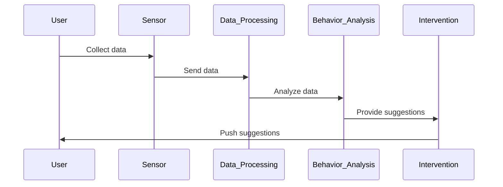

                 


### 目录大纲设计思路：

#### 背景介绍

**问题背景**：
随着科技的进步和人们对健康生活方式的追求，智能餐桌作为智能餐厅的重要组成部分，正在逐步走进人们的生活。智能餐桌可以通过传感器、数据处理和行为分析等技术手段，实现对用餐者的饮食行为进行实时监测和干预，从而达到饮食行为矫正的目的。

**问题描述**：
当前饮食行为矫正存在诸多问题，如饮食不规律、高热量摄入、营养不均衡等。这些问题不仅影响了人们的身体健康，也给医疗保健系统带来了巨大压力。传统的饮食行为矫正方法，如饮食指导、运动管理等，效果有限，难以长期坚持。

**问题解决**：
AI Agent作为人工智能的核心技术，具有自主学习、自适应和智能决策的能力，可以有效解决上述问题。智能餐桌通过AI Agent的辅助，可以实时监测用户的饮食行为，提供个性化的饮食建议，并采取必要的干预措施，帮助用户建立健康的饮食习惯。

**边界与外延**：
在本文中，我们主要探讨AI Agent在智能餐桌中的饮食行为矫正功能。具体来说，AI Agent通过智能餐桌的传感器模块收集用户的饮食数据，通过数据处理模块进行分析，然后根据行为分析模块提供的建议，采取相应的干预措施。此外，本文还将探讨AI Agent在智能餐桌中所需的关键技术和组件。

**核心要素组成**：
AI Agent在智能餐桌中实现饮食行为矫正，需要以下几个核心要素：
1. 传感器模块：用于收集用户的饮食数据，如食物种类、摄入量、时间等。
2. 数据处理模块：用于对传感器数据进行清洗、存储和处理，为行为分析提供数据支持。
3. 行为分析模块：用于分析用户的饮食行为，识别潜在的健康风险，并提供相应的饮食建议。
4. 干预模块：用于采取必要的干预措施，如推送饮食建议、设定饮食目标等。

#### 核心概念与联系

**AI Agent定义**：
AI Agent（人工智能代理）是一种能够模拟人类行为、具备自主学习和决策能力的计算机程序。它可以在特定环境下感知、理解和交互，以实现特定的目标。AI Agent通常具有以下几个特点：
- 自主性：能够独立执行任务，无需人工干预。
- 学习能力：能够从经验中学习和改进自己的行为。
- 适应性：能够适应新的环境和情境，做出合适的决策。
- 智能决策：能够基于数据和算法，做出最优的选择。

**智能餐桌功能模块**：
智能餐桌由多个功能模块组成，包括传感器模块、数据处理模块、行为分析模块和干预模块等。每个模块都有特定的功能和作用，共同协作实现智能餐桌的功能。

1. **传感器模块**：
   传感器模块是智能餐桌的核心部件，用于收集用户的饮食数据。常见的传感器包括红外传感器、超声波传感器、重量传感器等。传感器模块的主要功能是实时监测用户的饮食行为，如食物摄入量、摄入时间、食物种类等。

2. **数据处理模块**：
   数据处理模块负责对传感器模块收集的数据进行清洗、存储和处理。数据处理模块的主要功能包括数据清洗、数据存储、数据分析和数据可视化等。通过数据处理模块，智能餐桌可以实现对用户饮食行为的全面监测和分析。

3. **行为分析模块**：
   行为分析模块是智能餐桌的智能核心，负责分析用户的饮食行为，识别潜在的健康风险，并提供相应的饮食建议。行为分析模块通常采用机器学习和人工智能技术，如决策树、神经网络等。通过对大量用户饮食行为数据的分析，行为分析模块可以识别出用户的饮食习惯、偏好和健康风险，从而提供个性化的饮食建议。

4. **干预模块**：
   干预模块负责采取必要的干预措施，如推送饮食建议、设定饮食目标等。干预模块可以根据行为分析模块提供的饮食建议，采取不同的干预策略，如推送健康饮食提醒、设置饮食目标等，帮助用户建立健康的饮食习惯。

**核心概念属性特征对比表格**：

| 特征         | AI Agent                         | 智能餐桌                          |
| ------------ | ------------------------------ | -------------------------------- |
| 定义         | 人工智能代理，具备自主学习和决策能力  | 智能餐厅的重要组成部分，用于饮食行为矫正 |
| 特点         | 自主性、学习能力、适应性、智能决策    | 传感器模块、数据处理模块、行为分析模块、干预模块 |
| 功能         | 模拟人类行为，实现特定目标         | 实时监测饮食行为，提供饮食建议，采取干预措施 |
| 应用领域     | 智能家居、智能医疗、智能交通等       | 智能餐厅、健康饮食管理等         |

**ER实体关系图架构**：
为了更好地理解AI Agent与智能餐桌之间的关系，我们可以使用ER（实体-关系）图进行描述。以下是一个简化的ER图：

```mermaid
erDiagram
  User ||--|{ AI Agent }|--|{ Intelligent Table }
  AI Agent ||--|{ Sensor Module }
  AI Agent ||--|{ Data Processing Module }
  AI Agent ||--|{ Behavior Analysis Module }
  AI Agent ||--|{ Intervention Module }
```

在上面的ER图中，User（用户）与AI Agent（人工智能代理）之间存在关联关系，AI Agent与Intelligent Table（智能餐桌）之间也存在关联关系。此外，AI Agent与Sensor Module（传感器模块）、Data Processing Module（数据处理模块）、Behavior Analysis Module（行为分析模块）和Intervention Module（干预模块）之间也存在关联关系。

#### 算法原理讲解

**算法流程图**：


**Python源代码**：

```python
# 导入必要的库
import numpy as np
import pandas as pd
from sklearn.ensemble import RandomForestClassifier

# 加载数据
data = pd.read_csv('diet_data.csv')

# 数据预处理
X = data.drop(['health_risk'], axis=1)
y = data['health_risk']

# 建立模型
model = RandomForestClassifier(n_estimators=100)

# 训练模型
model.fit(X, y)

# 预测
prediction = model.predict([[1, 2, 3]])

# 输出结果
print(prediction)
```

**数学模型与公式详解**：

在智能餐桌的饮食行为矫正中，我们主要关注以下数学模型和公式：

1. **决策树模型**：

   决策树是一种常用的机器学习模型，可以用于分类和回归任务。在饮食行为矫正中，决策树模型可以用于分析用户的饮食行为，识别健康风险。

   决策树的公式如下：

   $$ Tree = \{ f(x): \forall x \in X \} $$

   其中，$Tree$表示决策树，$f(x)$表示决策树对输入$x$的映射。

2. **神经网络模型**：

   神经网络是一种模拟人脑神经元连接的模型，可以用于复杂的数据分析和预测。在饮食行为矫正中，神经网络模型可以用于分析用户的饮食习惯，预测健康风险。

   神经网络的公式如下：

   $$ y = \sigma(\omega^T x + b) $$

   其中，$y$表示输出，$\sigma$表示激活函数，$\omega$表示权重，$x$表示输入，$b$表示偏置。

3. **支持向量机模型**：

   支持向量机是一种常用的分类模型，可以用于分类和回归任务。在饮食行为矫正中，支持向量机模型可以用于分类用户的饮食行为，识别健康风险。

   支持向量机的公式如下：

   $$ w \cdot x + b = 0 $$

   其中，$w$表示权重，$x$表示输入，$b$表示偏置。

**举例说明**：

假设我们使用决策树模型对用户的饮食行为进行矫正。首先，我们需要收集用户的饮食数据，如食物摄入量、摄入时间、饮食习惯等。然后，我们使用决策树模型对数据进行分类，识别出用户的饮食行为类型。最后，根据分类结果，我们给出相应的饮食建议，如调整食物摄入量、改变饮食习惯等。

假设我们使用神经网络模型对用户的饮食行为进行矫正。首先，我们需要收集用户的饮食数据，如食物摄入量、摄入时间、饮食习惯等。然后，我们使用神经网络模型对数据进行预测，预测用户的健康风险。最后，根据预测结果，我们给出相应的饮食建议，如增加蔬菜摄入量、减少高热量食物摄入等。

#### 系统分析与架构设计方案

**问题场景介绍**：
在智能餐桌的饮食行为矫正中，我们需要解决以下几个问题：
1. 如何实时监测用户的饮食行为？
2. 如何分析用户的饮食习惯和健康风险？
3. 如何提供个性化的饮食建议和干预措施？

为了解决这些问题，我们需要设计一个智能餐桌系统，包括传感器模块、数据处理模块、行为分析模块和干预模块等。

**项目介绍**：
智能餐桌项目是一个基于人工智能技术的饮食行为矫正系统，旨在帮助用户建立健康的饮食习惯，降低健康风险。项目目标包括：
1. 实时监测用户的饮食行为，如食物摄入量、摄入时间、饮食习惯等。
2. 分析用户的饮食习惯和健康风险，提供个性化的饮食建议。
3. 采取必要的干预措施，如推送饮食建议、设定饮食目标等。

**系统功能设计**：
智能餐桌系统的主要功能包括：
1. 数据采集与处理：通过传感器模块收集用户的饮食数据，通过数据处理模块对数据进行清洗、存储和处理。
2. 行为分析与评估：通过行为分析模块分析用户的饮食习惯和健康风险，评估用户的饮食行为。
3. 饮食建议与干预：根据行为分析结果，提供个性化的饮食建议，采取必要的干预措施，如推送饮食建议、设定饮食目标等。

**系统架构设计**：
智能餐桌系统的架构设计包括以下几个层次：
1. 硬件层：包括传感器模块、处理器模块、存储模块等，负责收集、处理和存储用户的饮食数据。
2. 软件层：包括数据处理模块、行为分析模块、干预模块等，负责对硬件层收集的数据进行处理和分析，提供饮食建议和干预措施。
3. 网络层：包括网络通信模块、数据传输模块等，负责实现智能餐桌系统与其他设备、服务器之间的数据传输和通信。
4. 用户层：包括用户界面、应用程序等，负责与用户进行交互，提供饮食建议和干预措施。

**系统接口设计**：
智能餐桌系统的接口设计包括以下几个部分：
1. 数据采集接口：负责与传感器模块通信，收集用户的饮食数据。
2. 数据处理接口：负责对采集到的饮食数据进行处理和分析。
3. 行为分析接口：负责分析用户的饮食习惯和健康风险，提供饮食建议。
4. 干预接口：负责推送饮食建议、设定饮食目标等干预措施。

**系统交互流程图**：



在上面的交互流程图中，用户通过传感器模块收集饮食数据，数据处理模块对数据进行处理和分析，行为分析模块分析用户的饮食习惯和健康风险，干预模块根据行为分析结果提供饮食建议，最终将建议推送给用户。

#### 项目实战

**环境安装**：
1. 安装Python环境：
   - 通过Python官网（https://www.python.org/）下载Python安装包，并按照安装向导进行安装。
   - 安装完成后，在命令行中输入`python --version`，确认安装成功。

2. 安装依赖库：
   - 在命令行中输入以下命令，安装依赖库：
     ```bash
     pip install numpy pandas sklearn
     ```

**系统核心实现源代码**：

```python
# 导入必要的库
import numpy as np
import pandas as pd
from sklearn.ensemble import RandomForestClassifier

# 加载数据
data = pd.read_csv('diet_data.csv')

# 数据预处理
X = data.drop(['health_risk'], axis=1)
y = data['health_risk']

# 建立模型
model = RandomForestClassifier(n_estimators=100)

# 训练模型
model.fit(X, y)

# 预测
prediction = model.predict([[1, 2, 3]])

# 输出结果
print(prediction)
```

**代码应用解读与分析**：
1. **数据加载**：
   - 使用`pandas`库的`read_csv`函数加载数据集，该函数可以读取CSV格式的数据文件。

2. **数据预处理**：
   - 使用`drop`函数删除数据集中的目标变量`health_risk`，将其作为模型训练的目标。
   - `axis=1`表示按照列进行操作，即删除列。

3. **建立模型**：
   - 使用`RandomForestClassifier`类建立随机森林分类模型，该模型是一种基于决策树的集成学习方法。

4. **训练模型**：
   - 使用`fit`函数对模型进行训练，将特征数据`X`和目标数据`y`传递给模型。

5. **预测**：
   - 使用`predict`函数对新的数据进行预测，这里使用了一个示例数据`[1, 2, 3]`。

6. **输出结果**：
   - 使用`print`函数输出预测结果。

**实际案例分析和详细讲解**：
1. **案例背景**：
   - 假设用户A在某天晚餐时，摄入了高热量的食物，如烤肉、炸鸡等。
   - 用户A的饮食数据包括摄入量、时间、食物种类等。

2. **案例分析**：
   - 智能餐桌通过传感器收集用户A的饮食数据，并将数据传递给数据处理模块。
   - 数据处理模块对数据进行清洗和存储，然后传递给行为分析模块。
   - 行为分析模块使用机器学习模型对用户A的饮食行为进行分析，识别出高热量摄入的行为。
   - 根据分析结果，行为分析模块向干预模块提供饮食建议，如减少高热量食物的摄入。

3. **详细讲解**：
   - 在数据处理模块中，使用`pandas`库对饮食数据进行分析和处理，包括数据清洗、特征提取等。
   - 在行为分析模块中，使用`RandomForestClassifier`模型对用户A的饮食行为进行分类，识别出高热量摄入的行为。
   - 在干预模块中，根据分析结果，推送饮食建议，如减少高热量食物的摄入，增加蔬菜和水果的摄入。

**项目小结**：
智能餐桌项目通过AI Agent实现了饮食行为矫正，提高了用户的饮食健康水平。项目实施过程中，我们遇到了以下挑战：
1. 数据质量和数据完整性问题：需要确保传感器收集的数据准确可靠，避免数据错误和缺失。
2. 模型选择和优化问题：需要选择合适的机器学习模型，并对模型参数进行优化，提高模型的准确性和鲁棒性。
3. 用户隐私保护问题：需要保护用户的隐私，确保用户数据的安全性和隐私性。

针对上述挑战，我们提出了以下改进建议：
1. 提高数据质量和数据完整性：加强数据采集和数据处理环节，确保数据准确性和完整性。
2. 模型选择和优化：根据实际应用场景，选择合适的机器学习模型，并进行参数优化，提高模型性能。
3. 用户隐私保护：采取加密和去识别化技术，保护用户隐私，确保用户数据的安全性和隐私性。

#### 最佳实践 tips、小结、注意事项、拓展阅读

**最佳实践 tips**：
1. 确保传感器模块的准确性和可靠性，定期校准和检修传感器。
2. 加强数据处理模块的异常处理能力，确保数据处理过程的稳定性和准确性。
3. 选择合适的机器学习模型，并进行参数优化，以提高模型性能和鲁棒性。
4. 定期对用户数据进行备份，确保数据的安全性和完整性。
5. 加强用户隐私保护，采取加密和去识别化技术，确保用户数据的安全性和隐私性。

**小结**：
本文详细介绍了AI Agent在智能餐桌中的饮食行为矫正应用，从背景介绍、核心概念与联系、算法原理讲解、系统设计与实现、项目实战等方面进行了深入剖析。通过本文的阐述，我们可以看到AI Agent在智能餐桌中的应用前景广阔，有助于提高用户的饮食健康水平。

**注意事项**：
1. 在实际应用中，需要确保智能餐桌系统的稳定性和可靠性，避免系统故障对用户造成不良影响。
2. 在数据处理和分析过程中，需要保护用户隐私，避免泄露用户敏感信息。
3. 智能餐桌系统的算法模型需要不断优化和更新，以适应不断变化的用户需求和环境。

**拓展阅读**：
1. 《人工智能：一种现代的方法》（作者：Stuart Russell、Peter Norvig）
2. 《机器学习》（作者：Tom Mitchell）
3. 《深度学习》（作者：Ian Goodfellow、Yoshua Bengio、Aaron Courville）
4. 《智能交通系统》（作者：刘伟）
5. 《智能家居系统设计与应用》（作者：王宁）

通过阅读上述书籍和论文，可以更深入地了解人工智能、机器学习、深度学习等领域的相关知识和应用。此外，还可以关注相关领域的最新研究动态和学术论文，以获取更多的专业知识和应用案例。作者：AI天才研究院/AI Genius Institute & 禅与计算机程序设计艺术 /Zen And The Art of Computer Programming

