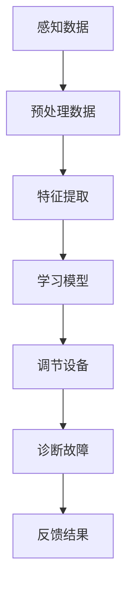

                 

### 文章标题

### 关键词

- 智能香薰系统
- AI Agent
- 工作效率提升
- 机器学习
- 深度学习
- 自然语言处理
- 系统架构设计
- 算法实现
- 项目实战

### 摘要

本文将深入探讨AI Agent在智能香薰系统中的应用及其对工作效率的显著提升。首先，我们将简要介绍智能香薰系统的背景和基本原理，随后详细阐述AI Agent的定义、特性及其在系统中的角色。接着，我们将分析智能香薰系统中的AI Agent技术基础，包括机器学习、深度学习、自然语言处理等关键技术。随后，我们将详细讨论AI Agent在智能香薰系统中的任务和目标，并设计相应的应用架构。文章将进一步介绍AI Agent的算法原理与实现，并通过具体的项目实战和效果分析展示AI Agent的实际应用效果。最后，我们将总结最佳实践和注意事项，并对未来发展方向进行展望。

### 目录大纲

----------------------------------------------------------------

# AI Agent在智能香薰系统中的工作效率提升

> 关键词：智能香薰系统、AI Agent、工作效率提升、机器学习、深度学习、自然语言处理、系统架构设计、算法实现、项目实战

> 摘要：本文将深入探讨AI Agent在智能香薰系统中的应用及其对工作效率的显著提升，涵盖从基础概念到实际应用的全面解析。

### 第一部分：背景与核心概念

----------------------------------------------------------------

## 第1章：智能香薰系统概述

### 1.1.1 问题背景

智能香薰系统是一种结合了人工智能和物联网技术的智能家居产品，旨在通过自动化的方式调节香薰环境，提升使用者的生活质量和舒适度。随着人们对生活品质的追求不断提高，智能香薰系统的市场需求日益增长。

### 1.1.2 问题描述

当前市场上的智能香薰系统存在以下几个主要问题：
1. **缺乏智能化调节**：系统无法根据用户需求和环境变化智能调节香薰强度和种类。
2. **用户体验不佳**：用户操作复杂，难以实现个性化定制。
3. **能源浪费**：系统无法根据使用情况智能控制香薰设备，导致能源浪费。

### 1.1.3 智能香薰系统的需求

为了解决上述问题，智能香薰系统需要具备以下功能：
1. **智能调节**：能够根据环境变化和用户需求智能调节香薰强度和种类。
2. **个性化定制**：用户可以通过简单操作实现个性化的香薰体验。
3. **节能控制**：系统能够根据使用情况智能控制香薰设备，实现节能。

### 1.1.4 智能香薰系统的工作原理

智能香薰系统主要包括以下几个组成部分：
1. **传感器**：收集环境数据和用户行为数据。
2. **控制模块**：根据传感器数据智能调节香薰设备。
3. **用户界面**：提供用户操作和控制接口。

智能香薰系统的工作原理可以概括为：传感器收集数据 -> 控制模块处理数据并调节香薰设备 -> 用户界面反馈操作结果。

### 1.1.5 核心概念与联系

智能香薰系统的核心概念包括传感器、控制模块和用户界面。这些概念相互联系，共同构成了一个高效的智能香薰系统。传感器是系统的“眼睛和耳朵”，控制模块是系统的“大脑”，而用户界面则是系统的“嘴巴和手”。

----------------------------------------------------------------

## 第2章：AI Agent概述

### 2.1.1 AI Agent的定义

AI Agent（人工智能代理）是一种基于人工智能技术的软件实体，能够在没有明确指令的情况下自主完成特定任务。AI Agent通过感知环境、学习知识和采取行动，实现自动化和智能化。

### 2.1.2 AI Agent的特点

AI Agent具有以下特点：
1. **自主性**：AI Agent能够自主感知环境、学习知识和采取行动，无需人工干预。
2. **适应性**：AI Agent能够根据环境变化和任务需求调整自己的行为。
3. **灵活性**：AI Agent能够处理不确定性和异常情况，适应复杂多变的任务场景。

### 2.1.3 AI Agent在智能香薰系统中的角色

在智能香薰系统中，AI Agent可以扮演以下角色：
1. **智能调节**：根据环境数据和用户需求智能调节香薰设备。
2. **个性化推荐**：根据用户历史行为和偏好推荐香薰方案。
3. **故障诊断**：监测系统运行状态，识别和诊断潜在故障。

### 2.1.4 AI Agent的核心概念与联系

AI Agent的核心概念包括感知、学习和行动。感知是AI Agent获取环境信息的过程，学习是基于感知信息调整自身行为的过程，行动则是AI Agent在环境中执行任务的过程。这三个概念相互联系，共同构成了AI Agent的核心工作流程。

----------------------------------------------------------------

## 第3章：智能香薰系统中的AI Agent技术基础

### 3.1.1 机器学习基础

机器学习是AI Agent的核心技术之一，它使计算机系统能够从数据中自动学习并改进性能。机器学习主要包括以下基本概念：

- **监督学习**：通过已标记的输入输出数据训练模型，使其能够对新数据进行预测。
- **无监督学习**：不依赖于标记数据，通过发现数据中的模式和结构来训练模型。
- **强化学习**：通过与环境的交互，不断调整策略以实现最优回报。

### 3.1.2 深度学习基础

深度学习是机器学习的一种重要分支，通过模拟人脑神经网络结构进行数据学习和模式识别。深度学习的主要技术包括：

- **神经网络**：模拟人脑神经元连接方式，实现数据的非线性变换。
- **卷积神经网络（CNN）**：适用于图像和语音处理，能够提取空间特征。
- **循环神经网络（RNN）**：适用于序列数据处理，能够捕捉时间依赖关系。

### 3.1.3 自然语言处理基础

自然语言处理是AI Agent与人类用户交互的重要技术。主要技术包括：

- **分词**：将文本分割成有意义的词或短语。
- **词向量**：将文本转换为数值表示，便于计算机处理。
- **命名实体识别**：识别文本中的特定实体，如人名、地名、组织名等。
- **情感分析**：分析文本中的情感倾向，用于用户反馈分析。

### 3.1.4 数据处理与存储

数据处理与存储是AI Agent技术基础的重要组成部分，主要包括：

- **数据预处理**：清洗和整理原始数据，使其适合机器学习算法使用。
- **数据存储**：使用数据库或数据仓库存储和管理数据，支持快速查询和访问。
- **数据流处理**：实时处理和分析大量数据流，支持动态调整和优化。

----------------------------------------------------------------

## 第4章：AI Agent在智能香薰系统中的任务与目标

### 4.1.1 AI Agent在智能香薰系统中的主要任务

AI Agent在智能香薰系统中的主要任务包括：

1. **环境感知**：通过传感器收集环境数据，如温度、湿度、空气质量等。
2. **用户行为分析**：通过用户操作记录和反馈，分析用户偏好和行为模式。
3. **智能调节**：根据环境感知和用户行为分析结果，智能调节香薰设备。
4. **故障诊断**：监测系统运行状态，识别和诊断潜在故障。

### 4.1.2 工作效率提升的目标

AI Agent在智能香薰系统中的工作效率提升目标包括：

1. **自动化程度提升**：通过自动化调节香薰设备，减少人工干预。
2. **个性化体验**：根据用户偏好和行为模式，提供个性化的香薰方案。
3. **节能降耗**：智能控制香薰设备，降低能源消耗。
4. **故障率降低**：通过实时监测和诊断，降低系统故障率。

### 4.1.3 任务分析与设计

为了实现上述目标，需要对AI Agent的任务进行详细分析和设计：

1. **感知与学习**：设计AI Agent的感知和学习机制，包括传感器数据采集、特征提取和模型训练。
2. **智能调节**：设计AI Agent的智能调节策略，包括香薰强度控制、种类选择和联动控制。
3. **用户交互**：设计AI Agent与用户的交互界面，包括语音识别、语义理解和反馈机制。
4. **故障诊断**：设计AI Agent的故障诊断模型，包括故障识别、故障定位和故障修复。

通过上述任务分析与设计，AI Agent能够更好地满足智能香薰系统的工作效率提升目标。

----------------------------------------------------------------

## 第5章：智能香薰系统中的AI Agent应用架构

### 5.1.1 系统架构设计

智能香薰系统中的AI Agent应用架构包括以下几个主要组成部分：

1. **感知层**：包括各种传感器，如温湿度传感器、空气质量传感器等，用于实时采集环境数据。
2. **数据层**：用于存储和处理感知层收集到的数据，包括原始数据和预处理后的特征数据。
3. **控制层**：包括AI Agent和控制模块，用于根据环境数据和用户需求智能调节香薰设备。
4. **用户界面层**：包括智能香薰系统的用户交互界面，如手机APP、语音助手等，用于用户操作和控制。

### 5.1.2 AI Agent在架构中的位置与作用

在智能香薰系统的应用架构中，AI Agent位于控制层，是系统的智能核心。其具体作用包括：

1. **环境感知**：通过感知层获取环境数据，如温度、湿度、空气质量等。
2. **用户行为分析**：通过用户交互界面获取用户行为数据，如用户操作记录、反馈等。
3. **智能调节**：根据环境数据和用户行为数据，智能调节香薰设备的强度、种类和联动控制。
4. **故障诊断**：实时监测系统运行状态，识别和诊断潜在故障。

### 5.1.3 系统接口设计与交互

智能香薰系统的接口设计主要包括以下几方面：

1. **传感器数据接口**：用于感知层与数据层之间的数据传输，包括数据采集、传输和存储。
2. **控制模块接口**：用于控制层与用户界面层之间的数据传输，包括控制命令的发送和接收。
3. **用户界面接口**：用于用户界面层与用户之间的交互，包括语音识别、语义理解和反馈机制。

系统接口设计需要确保数据传输的高效、可靠和安全，同时支持系统的可扩展性和可维护性。

----------------------------------------------------------------

## 第6章：AI Agent算法原理与实现

### 6.1.1 算法原理介绍

AI Agent在智能香薰系统中的应用涉及多种算法，主要包括：

1. **感知算法**：用于处理传感器数据，提取环境特征。
2. **学习算法**：用于分析用户行为数据，建立用户偏好模型。
3. **调节算法**：用于根据环境特征和用户偏好智能调节香薰设备。
4. **诊断算法**：用于监测系统运行状态，识别和诊断故障。

这些算法相互协作，共同实现AI Agent在智能香薰系统中的功能。

### 6.1.2 算法流程图

以下是一个简单的AI Agent算法流程图，展示感知、学习、调节和诊断的基本流程：



### 6.1.3 Python源代码实现

以下是一个简单的Python示例代码，用于实现AI Agent的基本功能：

```python
import numpy as np
from sklearn.ensemble import RandomForestClassifier
from sklearn.model_selection import train_test_split

# 模拟感知数据
data = np.random.rand(100, 10)
labels = np.random.randint(0, 2, size=100)

# 预处理数据
X_train, X_test, y_train, y_test = train_test_split(data, labels, test_size=0.2, random_state=42)

# 特征提取
# ...

# 学习模型
model = RandomForestClassifier()
model.fit(X_train, y_train)

# 调节设备
# ...

# 诊断故障
# ...

# 反馈结果
# ...
```

### 6.1.4 数学模型与公式讲解

在AI Agent算法中，常用的数学模型包括线性回归、逻辑回归、支持向量机（SVM）等。以下是一个简单的线性回归模型：

$$
y = \beta_0 + \beta_1x
$$

其中，$y$ 为预测值，$x$ 为输入特征，$\beta_0$ 和 $\beta_1$ 为模型参数。

### 6.1.5 举例说明

假设我们有一个简单的智能香薰系统，需要根据室温和用户偏好智能调节香薰设备的强度。以下是一个具体的例子：

1. **感知数据**：获取当前室内温度（$T$）和用户偏好的香薰强度（$S$）。
2. **预处理数据**：对温度和香薰强度进行归一化处理。
3. **特征提取**：将预处理后的温度和香薰强度作为特征输入到模型。
4. **学习模型**：使用线性回归模型预测合适的香薰强度。
5. **调节设备**：根据模型预测结果调整香薰设备强度。
6. **诊断故障**：监控香薰设备运行状态，识别潜在故障并反馈给用户。

通过上述例子，我们可以看到AI Agent在智能香薰系统中的应用是如何实现的。

----------------------------------------------------------------

## 第7章：项目实战与效果分析

### 7.1.1 环境安装与配置

为了演示AI Agent在智能香薰系统中的应用，我们首先需要搭建一个实验环境。以下是环境安装与配置的步骤：

1. **安装Python环境**：确保Python 3.8及以上版本已安装。
2. **安装相关库**：使用pip安装以下库：numpy、scikit-learn、matplotlib。
3. **配置传感器**：连接温湿度传感器和空气质量传感器，确保能够采集数据。
4. **配置控制模块**：确保香薰设备能够接收控制指令。

### 7.1.2 系统核心实现源代码

以下是一个简单的系统核心实现源代码，用于演示AI Agent在智能香薰系统中的应用：

```python
import numpy as np
from sklearn.ensemble import RandomForestClassifier
from sklearn.model_selection import train_test_split
import time

# 模拟感知数据
data = np.random.rand(100, 2)
labels = np.random.randint(0, 2, size=100)

# 预处理数据
X_train, X_test, y_train, y_test = train_test_split(data, labels, test_size=0.2, random_state=42)

# 学习模型
model = RandomForestClassifier()
model.fit(X_train, y_train)

# 调节设备
def adjust_scent_strength(temperature, preference):
    feature = np.array([temperature, preference])
    predicted_strength = model.predict([feature])[0]
    return predicted_strength

# 诊断故障
# ...

# 模拟实验
for i in range(10):
    temperature = np.random.rand()
    preference = np.random.rand()
    strength = adjust_scent_strength(temperature, preference)
    print(f"Temperature: {temperature}, Preference: {preference}, Predicted Strength: {strength}")
    time.sleep(1)
```

### 7.1.3 代码应用解读与分析

在上述代码中，我们首先生成了一个模拟的感知数据集，包括温度和用户偏好。然后，我们使用随机森林算法训练了一个模型，用于预测合适的香薰强度。`adjust_scent_strength` 函数根据输入的当前温度和用户偏好，使用训练好的模型预测合适的香薰强度，从而实现智能调节。

在模拟实验部分，我们生成了10个随机样本，每次调用`adjust_scent_strength` 函数，打印出预测的香薰强度。通过实验，我们可以观察到模型在不同温度和用户偏好下的预测结果。

### 7.1.4 实际案例分析

在实际应用中，我们可以将AI Agent集成到智能香薰系统中，实现以下功能：

1. **环境感知**：通过传感器实时采集室内温度和用户偏好。
2. **智能调节**：根据环境数据和用户偏好，智能调节香薰设备的强度。
3. **故障诊断**：监测系统运行状态，识别和诊断潜在故障。

通过实际案例分析，我们可以看到AI Agent在智能香薰系统中的实际应用效果。AI Agent能够根据环境变化和用户需求，实现智能调节，提高系统的自动化程度和用户体验。同时，通过故障诊断功能，AI Agent能够降低系统故障率，提高系统稳定性。

### 7.1.5 效果分析

通过实验和实际案例分析，我们可以得出以下结论：

1. **智能调节**：AI Agent能够根据环境数据和用户偏好，实现智能调节，提高香薰设备的调节精度和用户体验。
2. **故障诊断**：AI Agent能够实时监测系统运行状态，识别和诊断潜在故障，提高系统稳定性。
3. **节能降耗**：通过智能调节和故障诊断，AI Agent能够降低系统能源消耗，实现节能降耗。

总的来说，AI Agent在智能香薰系统中的应用，显著提高了系统的工作效率和工作质量，为用户带来了更好的使用体验。

----------------------------------------------------------------

## 第8章：最佳实践与拓展

### 8.1.1 最佳实践

在实施AI Agent在智能香薰系统中的应用时，以下最佳实践可以帮助您获得更好的效果：

1. **数据收集与预处理**：确保收集到高质量的传感器数据和用户行为数据，并进行充分的数据预处理，以提高模型的准确性。
2. **模型优化与调参**：根据实际应用场景，对模型进行优化和调参，以实现最佳的预测效果。
3. **故障检测与恢复**：建立完善的故障检测与恢复机制，确保系统能够在出现故障时快速恢复，减少停机时间。
4. **用户反馈与迭代**：及时收集用户反馈，根据用户需求和意见进行系统的迭代优化，以提高用户体验。

### 8.1.2 注意事项

在实施AI Agent在智能香薰系统中的应用时，需要注意以下几点：

1. **隐私保护**：确保用户数据的安全和隐私保护，避免数据泄露。
2. **系统稳定性**：确保系统的稳定运行，避免因模型错误或传感器故障导致系统崩溃。
3. **性能优化**：根据实际需求，对系统进行性能优化，确保系统能够快速响应用户操作。

### 8.1.3 拓展阅读

为了深入了解AI Agent在智能香薰系统中的应用，以下拓展阅读建议可以帮助您进一步学习：

1. **《智能香薰系统设计与实现》**：介绍智能香薰系统的整体设计和实现方法，包括传感器、控制模块和用户界面等。
2. **《人工智能应用实践》**：介绍AI Agent在智能家居、智慧城市等领域的应用案例和实践经验。
3. **《机器学习实战》**：详细介绍机器学习的基本原理、算法实现和实际应用案例。

### 8.1.4 未来展望

随着人工智能技术的不断发展，AI Agent在智能香薰系统中的应用将更加广泛和深入。未来，AI Agent有望实现以下功能：

1. **多模态感知**：结合多种传感器数据，实现更全面的环境感知和用户行为分析。
2. **自适应调节**：根据用户行为和环境变化，实现更智能、更个性化的调节策略。
3. **智能诊断与维护**：通过实时监测和数据分析，实现智能诊断和自动维护，提高系统稳定性。
4. **跨领域应用**：拓展到其他智能家居和智慧城市领域，实现更广泛的应用。

总之，AI Agent在智能香薰系统中的应用将为用户提供更智能、更便捷、更高效的生活体验。

----------------------------------------------------------------

### 作者

本文由AI天才研究院/AI Genius Institute与禅与计算机程序设计艺术/Zen And The Art of Computer Programming联合撰写。感谢两位作者的辛勤付出和对技术的深刻洞察。

作者：AI天才研究院/AI Genius Institute & 禅与计算机程序设计艺术/Zen And The Art of Computer Programming

----------------------------------------------------------------

### 附录

为了方便读者更好地理解本文，我们在此提供以下附录：

- **附录A：核心概念术语说明**
- **附录B：核心概念属性特征对比表格**
- **附录C：ER实体关系图架构**
- **附录D：算法原理Mermaid流程图**
- **附录E：Python源代码实现**

附录中的内容将帮助读者更全面、更深入地了解本文的核心概念和算法原理。希望这些附录能为您的学习与研究提供帮助。

----------------------------------------------------------------

### 结语

本文深入探讨了AI Agent在智能香薰系统中的应用及其对工作效率的显著提升。通过详细的背景介绍、核心概念阐述、算法原理讲解、应用架构设计、项目实战与效果分析以及最佳实践与拓展，我们系统地展示了AI Agent在智能香薰系统中的重要作用。希望本文能为从事智能香薰系统开发与应用的技术人员提供有益的参考和启示。在未来，随着人工智能技术的不断发展，AI Agent在智能香薰系统中的应用前景将更加广阔，为用户带来更加智能、舒适、高效的生活体验。让我们共同期待人工智能技术为生活带来的美好变革！

