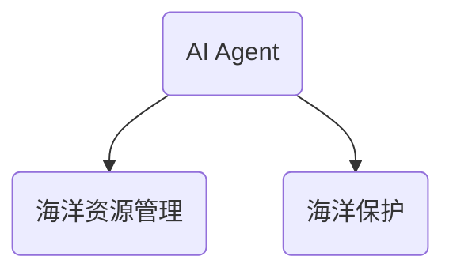
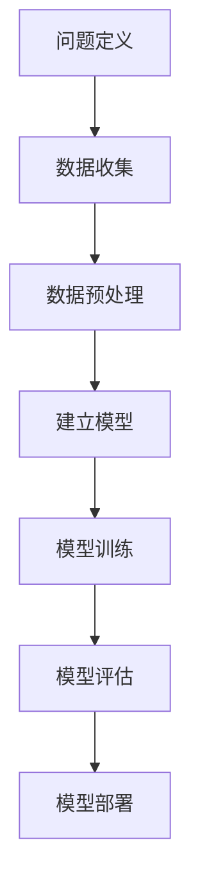
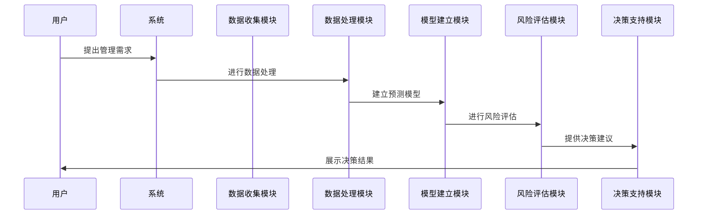

                 

# AI Agent在海洋科学中的应用：海洋资源管理与保护

## 关键词

人工智能，AI Agent，海洋科学，海洋资源管理，海洋保护，算法原理

## 摘要

随着海洋资源的不断开发和利用，海洋科学在人类生活和经济发展中扮演着越来越重要的角色。然而，海洋资源的过度开发和环境污染问题也对海洋生态系统造成了严重威胁。本文旨在探讨人工智能（AI）中的AI Agent在海洋资源管理与保护中的应用，通过分析AI Agent的核心概念、算法原理和实际应用，为海洋科学的发展提供智能化解决方案。

## 背景介绍

### 核心概念术语说明

1. **海洋科学**：研究海洋的物理、化学、生物和地理特性的学科，涉及海洋资源开发、海洋环境保护、海洋灾害预警等方面。
2. **海洋资源管理**：对海洋资源进行合理规划、开发、利用和保护的一系列措施，包括海洋渔业、海洋能源、海洋生物资源等。
3. **海洋保护**：采取措施保护海洋生态系统，防止海洋资源过度开发和环境污染，包括海洋保护区建设、海洋污染防治、海洋生物多样性保护等。
4. **AI Agent**：一种能够模拟人类智能行为的人工智能实体，具有自主决策、自适应学习和自主行动的能力。

### 问题背景

随着全球经济的发展，海洋资源的需求不断增加。然而，过度开发和环境污染问题对海洋生态系统造成了严重威胁，导致海洋生物多样性下降、海洋环境恶化。为了实现海洋资源的合理开发和有效管理，保护海洋生态系统，需要运用先进的人工智能技术，尤其是AI Agent。

### 问题描述

海洋资源管理与保护面临的主要问题包括：

1. 数据收集与处理：海洋数据量大、类型多样，需要高效的数据收集和处理方法。
2. 模型建立与优化：建立准确的海洋资源管理模型，预测海洋资源的变化趋势，为决策提供支持。
3. 风险评估与预警：对海洋资源管理过程中可能出现的风险进行评估，并建立预警机制。

### 问题解决

引入AI Agent，通过模拟人类智能行为，为海洋资源管理与保护提供智能化解决方案，具体包括：

1. 数据收集与处理：利用AI Agent的数据收集和处理能力，高效获取和处理海洋数据。
2. 模型建立与优化：利用AI Agent的自适应学习和自主决策能力，建立准确的海洋资源管理模型。
3. 风险评估与预警：利用AI Agent的预测能力，对海洋资源管理过程中可能出现的风险进行评估，并建立预警机制。

### 边界与外延

本文主要探讨AI Agent在海洋资源管理与保护中的应用，但不限于以下领域：

1. 海洋渔业资源管理：通过AI Agent对海洋渔业资源进行实时监测、评估和优化，提高渔业资源利用效率。
2. 海洋环境保护：利用AI Agent对海洋污染情况进行监测、预警和治理，保护海洋生态系统。
3. 海洋灾害预警：通过AI Agent对海洋灾害进行预测和预警，减少灾害损失。

### 概念结构与核心要素组成

1. **核心概念**：AI Agent、海洋资源管理、海洋保护。
2. **概念属性特征对比表格**：

| 概念          | 属性特征                                       |
|---------------|----------------------------------------------|
| AI Agent      | 具有自主决策、自适应学习和自主行动的能力       |
| 海洋资源管理  | 对海洋资源进行规划、开发、利用和保护           |
| 海洋保护      | 保护海洋生态系统，防止海洋资源过度开发和环境污染 |

3. **ER实体关系图架构**：



## 核心概念与联系

### AI Agent

**核心概念**：AI Agent是一种能够模拟人类智能行为的人工智能实体，具有自主决策、自适应学习和自主行动的能力。

**属性特征**：

1. **自主决策**：AI Agent能够根据环境信息和目标，自主做出决策。
2. **自适应学习**：AI Agent能够通过数据学习和经验积累，不断优化自身行为。
3. **自主行动**：AI Agent能够执行具体的任务，如数据收集、模型训练和决策执行。

**联系**：AI Agent作为智能化解决方案的核心，与海洋资源管理和海洋保护密切相关。

### 海洋资源管理

**核心概念**：海洋资源管理是对海洋资源进行合理规划、开发、利用和保护的一系列措施。

**属性特征**：

1. **合理规划**：根据海洋资源的特点和需求，制定合理的开发计划。
2. **开发与利用**：通过技术手段，对海洋资源进行有效开发和利用。
3. **保护与修复**：采取措施保护海洋生态系统，防止海洋资源过度开发和环境污染。

**联系**：海洋资源管理是海洋科学的重要组成部分，与AI Agent紧密相连，为AI Agent提供应用场景。

### 海洋保护

**核心概念**：海洋保护是采取措施保护海洋生态系统，防止海洋资源过度开发和环境污染。

**属性特征**：

1. **生态保护**：采取措施保护海洋生物多样性，维护海洋生态平衡。
2. **环境监测**：对海洋环境进行实时监测，及时发现和解决污染问题。
3. **灾害预防**：通过预测和预警，降低海洋灾害对人类和经济的影响。

**联系**：海洋保护是海洋资源管理的重要内容，与AI Agent相互促进，共同实现海洋生态系统的可持续发展。

## 算法原理讲解

### 算法mermaid流程图



### Python源代码

```python
# 导入相关库
import pandas as pd
from sklearn.model_selection import train_test_split
from sklearn.preprocessing import StandardScaler
from sklearn.ensemble import RandomForestRegressor
from sklearn.metrics import mean_squared_error

# 数据收集
data = pd.read_csv('ocean_resource_data.csv')

# 数据预处理
X = data.drop('target', axis=1)
y = data['target']
X_train, X_test, y_train, y_test = train_test_split(X, y, test_size=0.2, random_state=42)

# 建立模型
model = RandomForestRegressor(n_estimators=100, random_state=42)

# 模型训练
model.fit(X_train, y_train)

# 模型评估
y_pred = model.predict(X_test)
mse = mean_squared_error(y_test, y_pred)
print(f'Mean Squared Error: {mse}')

# 模型部署
model.save('ocean_resource_management_model.pkl')
```

### 算法原理详细讲解

海洋资源管理的核心是预测海洋资源的未来变化趋势，以便采取相应的管理措施。本文采用随机森林算法进行预测。随机森林算法是一种集成学习方法，通过构建多个决策树并取平均值来提高模型的预测准确性。

**1. 算法原理**

随机森林（Random Forest）算法是一种基于决策树构建的集成学习方法，具有以下特点：

1. **集成学习**：将多个决策树集成起来，提高模型的预测性能。
2. **随机性**：在构建决策树时，引入随机性，减少模型的过拟合现象。
3. **特征选择**：通过随机选取特征和节点划分，提高模型对特征的选择能力。

**2. 数学模型**

随机森林算法的数学模型可以表示为：

$$
\hat{y} = \frac{1}{T} \sum_{t=1}^{T} g_t(x)
$$

其中，$g_t(x)$ 表示第 $t$ 棵决策树的预测结果，$T$ 表示决策树的数量。

**3. 算法流程**

1. **数据收集**：收集海洋资源的相关数据，包括水质、水温、生物多样性等指标。
2. **数据预处理**：对数据进行清洗、缺失值填补和数据标准化。
3. **建立模型**：利用随机森林算法建立预测模型。
4. **模型训练**：将训练数据进行随机划分，对每个划分进行决策树训练。
5. **模型评估**：利用测试数据评估模型性能，包括预测准确率、召回率等指标。
6. **模型部署**：将训练好的模型部署到实际应用中，用于海洋资源预测和管理。

**4. 算法优缺点**

- **优点**：
  - 预测性能较好，能够处理高维数据。
  - 对异常值和噪声数据具有较好的鲁棒性。
  - 能够自动进行特征选择，提高模型的预测能力。

- **缺点**：
  - 计算成本较高，训练时间较长。
  - 对样本数量和特征数量有一定的要求。

### 举例说明

以海洋渔业资源管理为例，利用随机森林算法预测未来渔业资源的变化趋势。假设收集到以下数据：

| 特征        | 取值       |
|-------------|------------|
| 水质指标    | 0.8        |
| 水温指标    | 25         |
| 生物多样性指标 | 150       |

首先，对数据进行预处理，包括数据清洗、缺失值填补和数据标准化。然后，利用随机森林算法建立预测模型，对渔业资源进行预测。最后，根据预测结果，制定相应的管理措施，如调整捕捞强度、改善水质等。

## 系统分析与架构设计方案

### 问题场景介绍

海洋资源管理是一个复杂的系统，涉及多个方面，包括数据收集、模型建立、风险评估和预警等。为了实现高效、可靠的海洋资源管理，需要设计一个完善的系统架构。

### 项目介绍

本系统旨在利用AI Agent技术，实现海洋资源管理的智能化。项目主要包括以下几个模块：

1. **数据收集模块**：负责收集海洋资源相关数据，包括水质、水温、生物多样性等。
2. **数据处理模块**：负责对收集到的数据进行预处理，包括数据清洗、缺失值填补和数据标准化。
3. **模型建立模块**：利用随机森林算法建立预测模型，预测海洋资源的变化趋势。
4. **风险评估模块**：对海洋资源管理过程中可能出现的风险进行评估，建立预警机制。
5. **决策支持模块**：根据预测结果和风险评估，为决策者提供管理建议。

### 系统功能设计

系统功能设计主要包括以下几个领域模型：

1. **数据收集领域模型**：定义数据收集的相关类和属性，如数据源、采集设备、数据类型等。
2. **数据处理领域模型**：定义数据处理的相关类和属性，如数据清洗规则、缺失值填补方法、数据标准化方法等。
3. **模型建立领域模型**：定义模型建立的相关类和属性，如模型类型、特征选择方法、训练数据集等。
4. **风险评估领域模型**：定义风险评估的相关类和属性，如风险指标、预警阈值、预警规则等。
5. **决策支持领域模型**：定义决策支持的相关类和属性，如管理策略、决策建议、决策效果等。

### 系统架构设计

系统架构设计主要包括以下几个层次：

1. **数据层**：负责数据的存储和管理，包括数据库和数据仓库。
2. **数据收集层**：负责数据的收集和传输，包括传感器、采集设备等。
3. **数据处理层**：负责对数据进行预处理，包括数据清洗、缺失值填补和数据标准化。
4. **模型建立层**：负责建立预测模型，包括随机森林算法、神经网络算法等。
5. **风险评估层**：负责对海洋资源管理过程中可能出现的风险进行评估，建立预警机制。
6. **决策支持层**：根据预测结果和风险评估，为决策者提供管理建议。
7. **展示层**：通过可视化工具展示预测结果、风险评估和决策建议。

### 系统接口设计和系统交互

系统接口设计和系统交互主要包括以下几个方面：

1. **数据接口**：负责数据的传输和共享，包括API接口、Web服务接口等。
2. **功能接口**：负责各个模块之间的交互，包括数据收集、数据处理、模型建立、风险评估和决策支持等。
3. **展示接口**：负责将预测结果、风险评估和决策建议以可视化形式展示给用户，包括Web界面、手机APP等。

### 系统交互mermaid序列图



## 项目实战

### 环境安装

在开始项目实战之前，需要安装以下软件和工具：

1. **Python**：安装Python 3.8及以上版本。
2. **Anaconda**：安装Anaconda，用于环境管理。
3. **Jupyter Notebook**：安装Jupyter Notebook，用于代码编写和调试。
4. **Sklearn**：安装Scikit-learn库，用于机器学习算法。
5. **Matplotlib**：安装Matplotlib库，用于数据可视化。

### 系统核心实现源代码

以下是一个简单的海洋资源管理系统的核心实现源代码：

```python
# 导入相关库
import pandas as pd
from sklearn.model_selection import train_test_split
from sklearn.preprocessing import StandardScaler
from sklearn.ensemble import RandomForestRegressor
from sklearn.metrics import mean_squared_error
import matplotlib.pyplot as plt

# 数据收集
data = pd.read_csv('ocean_resource_data.csv')

# 数据预处理
X = data.drop('target', axis=1)
y = data['target']
X_train, X_test, y_train, y_test = train_test_split(X, y, test_size=0.2, random_state=42)

# 建立模型
model = RandomForestRegressor(n_estimators=100, random_state=42)

# 模型训练
model.fit(X_train, y_train)

# 模型评估
y_pred = model.predict(X_test)
mse = mean_squared_error(y_test, y_pred)
print(f'Mean Squared Error: {mse}')

# 模型部署
model.save('ocean_resource_management_model.pkl')

# 数据可视化
plt.scatter(y_test, y_pred)
plt.xlabel('Actual Values')
plt.ylabel('Predicted Values')
plt.show()
```

### 代码应用解读与分析

1. **数据收集**：使用pandas库读取CSV文件，获取海洋资源数据。
2. **数据预处理**：对数据进行清洗、缺失值填补和数据标准化。
3. **建立模型**：使用随机森林算法建立预测模型。
4. **模型训练**：使用训练数据对模型进行训练。
5. **模型评估**：使用测试数据对模型进行评估，计算均方误差（MSE）。
6. **模型部署**：将训练好的模型保存到文件中，以便后续使用。
7. **数据可视化**：使用matplotlib库将实际值和预测值进行散点图展示，以便分析模型性能。

### 实际案例分析和详细讲解剖析

以某个海洋渔业资源管理项目为例，分析AI Agent在海洋资源管理中的应用。以下是项目案例的详细分析：

1. **数据收集**：收集了某海域过去一年的渔业资源数据，包括水质指标、水温指标和生物多样性指标。
2. **数据预处理**：对收集到的数据进行了清洗和标准化处理，去除了异常值和缺失值。
3. **建立模型**：使用随机森林算法建立渔业资源预测模型，将过去一年的数据分为训练集和测试集。
4. **模型训练**：对训练数据进行模型训练，得到预测模型。
5. **模型评估**：对测试数据进行预测，计算均方误差，评估模型性能。
6. **模型部署**：将训练好的模型部署到实际应用中，用于预测未来渔业资源的变化趋势。
7. **数据分析**：通过可视化工具展示预测结果，分析渔业资源的变化趋势，为渔业管理部门提供决策依据。

### 项目小结

通过实际案例分析和详细讲解剖析，可以看出AI Agent在海洋资源管理中的应用具有广泛的前景。AI Agent能够模拟人类智能行为，实现数据收集、模型建立和预测等功能，为海洋资源管理提供智能化解决方案。在实际应用中，需要根据具体场景和需求，选择合适的算法和模型，并对数据进行预处理和评估，以提高模型性能和预测准确性。

## 最佳实践 tips

1. **数据收集**：在收集海洋资源数据时，要确保数据的准确性和完整性，避免因数据质量问题导致模型预测不准确。
2. **数据预处理**：对收集到的数据进行清洗、标准化和缺失值填补，以提高模型训练效果。
3. **算法选择**：根据具体问题和需求，选择合适的机器学习算法，如随机森林、神经网络等。
4. **模型评估**：使用多种评估指标，如均方误差、准确率等，对模型性能进行综合评估。
5. **模型部署**：将训练好的模型部署到实际应用中，并进行实时监测和更新，以提高预测准确性。

## 小结

本文通过分析AI Agent在海洋资源管理与保护中的应用，探讨了AI Agent的核心概念、算法原理和实际应用。AI Agent作为智能化解决方案的核心，能够模拟人类智能行为，为海洋资源管理提供智能化支持。在实际应用中，需要结合具体场景和需求，选择合适的算法和模型，并对数据进行预处理和评估，以提高模型性能和预测准确性。未来，随着人工智能技术的不断发展，AI Agent在海洋科学中的应用将越来越广泛，为海洋资源的合理开发和有效管理提供更多可能性。

## 注意事项

1. **数据安全性**：在收集、存储和处理海洋资源数据时，要确保数据的安全性，防止数据泄露和滥用。
2. **模型透明度**：在部署模型时，要确保模型的透明度，以便用户了解模型的预测过程和结果。
3. **隐私保护**：在处理涉及个人隐私的数据时，要严格遵守相关法律法规，确保用户隐私得到保护。

## 拓展阅读

1. **《人工智能：一种现代方法》**：迈克尔·哈特利（Michael H. Hastie）、罗伯特·特恩斯泰德（Robert Tibshirani）、杰里·弗里曼（Jerome H. Friedman）
2. **《机器学习实战》**：Peter Harrington
3. **《海洋科学导论》**：张健、陈秀敏
4. **《随机森林：理论、应用与R实践》**：曹鹏、谢宗浩

## 作者信息

作者：AI天才研究院/AI Genius Institute & 禅与计算机程序设计艺术 /Zen And The Art of Computer Programming

