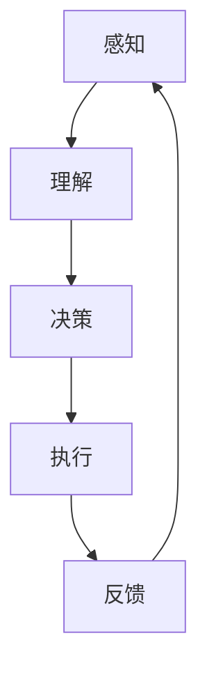

                 

## AI Agent在游戏产业中的应用

### 关键词
- AI Agent
- 游戏产业
- 强化学习
- 深度神经网络
- 虚拟角色控制
- 游戏决策系统

### 摘要
本文深入探讨AI Agent在游戏产业中的应用。首先，我们将介绍游戏产业的背景和AI Agent的基本概念。随后，通过逐步分析，我们将探讨AI Agent在虚拟角色控制、游戏决策系统和玩法创新等领域的具体应用，并通过实际案例进行详细解读。文章还将总结最佳实践，为读者提供未来展望和进一步学习路径。

### 目录
1. 引言与背景
   1.1 游戏产业的发展与AI的融合
   1.2 AI Agent的概念与价值
   1.3 AI Agent在游戏中的核心应用场景
   1.4 本书结构安排与目标读者

2. AI Agent基础理论
   2.1 AI Agent的基本原理
   2.2 游戏引擎与AI Agent的整合
   2.3 AI Agent的核心算法

3. AI Agent在游戏中的应用实践
   3.1 AI Agent在虚拟角色控制中的应用
   3.2 AI Agent在游戏决策系统中的应用
   3.3 AI Agent在游戏玩法创新中的应用

4. AI Agent在游戏产业中的最佳实践
   4.1 AI Agent在游戏开发中的最佳实践
   4.2 未来展望与趋势

5. 结论
   5.1 文章小结
   5.2 拓展阅读

## 第一部分: 引言与背景

### 1.1 游戏产业的发展与AI的融合

#### 游戏产业的发展现状

游戏产业是信息技术领域的重要组成部分，随着数字娱乐的普及，游戏产业已经展现出巨大的市场潜力。根据市场研究报告，全球游戏市场收入持续增长，预计在未来几年内将继续保持稳定增长。这一增长不仅得益于硬件设备的更新换代，也得益于游戏体验的不断优化。

随着游戏产业的快速发展，玩家对游戏内容的需求越来越高。他们期望能够体验到更加丰富、多样和智能化的游戏内容。这种需求促使游戏开发者和运营者不断寻求创新的技术手段，以提高游戏的可玩性和玩家的沉浸感。

#### AI的崛起与游戏产业的融合

人工智能（AI）作为当前科技的前沿领域，其发展速度之快令人瞩目。AI在各个行业中的应用日益广泛，游戏产业也不例外。AI技术能够为游戏带来以下几个方面的改进：

1. **个性化体验**：AI可以分析玩家的行为和偏好，提供个性化的游戏推荐和定制化内容，提升玩家的满意度。
2. **智能NPC**：AI可以用于创建智能虚拟角色（NPC），使游戏世界更加丰富和真实，提高玩家的互动体验。
3. **游戏优化**：AI可以帮助游戏开发者自动进行游戏测试、优化游戏性能，减少开发成本。
4. **游戏玩法创新**：AI可以生成全新的游戏玩法和关卡设计，为玩家带来前所未有的游戏体验。

### AI Agent的概念与价值

#### AI Agent的定义

AI Agent，即人工智能代理，是指能够自主地感知环境、制定决策并采取行动的人工智能实体。AI Agent的核心在于其自主性，能够通过学习从环境中获取信息，并基于这些信息进行决策。

在游戏产业中，AI Agent可以被视为游戏中的智能角色，它们具备自我学习和自适应能力，能够在游戏中扮演各种角色，从简单的NPC到复杂的主角色。

#### AI Agent的价值

AI Agent在游戏产业中的应用价值主要体现在以下几个方面：

1. **提升游戏互动性**：AI Agent能够与玩家进行更为自然的互动，提高游戏的可玩性和玩家的参与度。
2. **增强游戏多样性**：通过AI Agent，游戏开发者可以设计出更加复杂和多变的游戏场景，为玩家提供更多样化的游戏体验。
3. **提高开发效率**：AI Agent可以部分或完全替代人类进行游戏测试和调试，减少人力成本，提高开发效率。
4. **创造个性化游戏体验**：AI Agent能够根据玩家的行为和偏好，动态调整游戏内容，为每个玩家提供独特的游戏体验。

### AI Agent在游戏中的核心应用场景

#### 虚拟角色控制

虚拟角色控制是AI Agent在游戏中最常见的应用场景之一。通过AI Agent，游戏中的NPC可以具备更加智能的行为模式，能够根据玩家的动作和环境的变化做出反应，从而提升游戏的互动性和沉浸感。

例如，在角色扮演游戏（RPG）中，NPC的AI Agent可以模拟真实的社交互动，使玩家感受到更真实的游戏世界。

#### 游戏决策系统

游戏决策系统是另一个重要的应用场景。通过AI Agent，游戏中的角色可以具备自主的决策能力，例如选择战斗策略、选择路径、选择资源管理等。

这种自主决策能力不仅可以增加游戏的难度，还可以提高玩家的策略性体验。例如，在策略游戏中，AI Agent可以帮助玩家制定最佳战术，从而提高游戏的胜率。

#### 游戏玩法创新

AI Agent还可以用于创造全新的游戏玩法。通过AI Agent，游戏开发者可以设计出更加复杂和多样化的游戏场景和规则，为玩家带来前所未有的游戏体验。

例如，在沙盒游戏中，AI Agent可以生成动态的生态系统，使游戏世界变得更加真实和丰富。

### 1.4 本书结构安排与目标读者

本书将分为四个主要部分：

1. **引言与背景**：介绍游戏产业的发展和AI Agent的基本概念，以及AI Agent在游戏中的核心应用场景。
2. **AI Agent基础理论**：详细讲解AI Agent的基本原理、核心算法以及与游戏引擎的整合。
3. **AI Agent在游戏中的应用实践**：通过实际案例，深入分析AI Agent在虚拟角色控制、游戏决策系统和玩法创新中的应用。
4. **AI Agent在游戏产业中的最佳实践**：总结最佳实践，提供未来展望和进一步学习路径。

本书的目标读者是游戏开发者、AI研究者和对游戏产业有兴趣的读者。通过本书，读者将能够深入了解AI Agent在游戏产业中的应用，掌握相关技术和实现方法，为游戏开发提供新的思路和工具。

## 第二部分: AI Agent基础理论

### 2.1 AI Agent的基本原理

#### AI Agent的定义与分类

AI Agent，即人工智能代理，是一种能够感知环境、制定决策并采取行动的智能实体。根据其工作方式和应用场景，AI Agent可以分为以下几类：

1. **反应型Agent**：这类Agent根据预设的规则和条件直接做出反应，没有学习或推理能力。例如，游戏中的一些简单NPC，它们的行为是由预先编写的脚本决定的。
2. **认知型Agent**：这类Agent不仅能够做出反应，还能够理解环境的变化，并基于环境进行推理和决策。它们通常具备简单的学习能力和知识表示能力。
3. **学习型Agent**：这类Agent具备自我学习的能力，能够通过经验不断优化其行为。强化学习算法是学习型Agent的核心技术。
4. **综合型Agent**：这类Agent结合了反应型、认知型和学习型的特点，能够根据具体任务需求进行自适应调整。

#### AI Agent的核心组成部分

AI Agent通常由以下几个核心组成部分构成：

1. **感知器**：用于感知环境信息，如视觉、听觉、触觉等。
2. **知识库**：存储Agent的先验知识和经验信息，如规则、模型、数据等。
3. **决策模块**：根据感知器和知识库的信息，制定决策计划。
4. **执行器**：执行决策模块制定的行动，如移动、攻击、防御等。

#### AI Agent的工作原理与机制

AI Agent的工作原理可以概括为以下几个步骤：

1. **感知**：通过感知器获取环境信息。
2. **理解**：使用知识库对感知到的信息进行理解和分析。
3. **决策**：基于理解和知识，使用决策模块制定行动策略。
4. **执行**：通过执行器执行决策模块制定的行动。
5. **反馈**：根据行动结果进行反馈，调整知识库和决策策略。

### 2.2 游戏引擎与AI Agent的整合

#### 游戏引擎的基本概念

游戏引擎是一种用于开发游戏的核心工具，它提供了游戏所需的各种基础功能，如渲染、物理计算、音频处理、输入管理等。游戏引擎通常由以下几部分组成：

1. **渲染引擎**：负责渲染游戏画面，提供高质量的图像效果。
2. **物理引擎**：负责模拟游戏中的物理现象，如碰撞检测、重力、惯性等。
3. **音频引擎**：负责处理游戏中的声音效果，提供沉浸式的听觉体验。
4. **输入管理**：处理玩家的输入操作，如键盘、鼠标、游戏手柄等。

#### AI Agent在游戏引擎中的实现

AI Agent在游戏引擎中的实现通常需要以下几个步骤：

1. **环境建模**：使用游戏引擎提供的工具和API，建立游戏世界的虚拟模型，包括角色、场景、障碍物等。
2. **感知器集成**：将AI Agent的感知器与游戏引擎的输入系统集成，使Agent能够获取游戏世界的实时信息。
3. **决策模块集成**：将AI Agent的决策模块与游戏引擎的决策系统集成，使Agent能够根据感知到的信息进行决策。
4. **执行器集成**：将AI Agent的执行器与游戏引擎的动作系统集成，使Agent能够执行决策模块制定的行动。

#### 游戏引擎与AI Agent的交互

游戏引擎与AI Agent之间的交互主要涉及以下几个方面：

1. **状态同步**：游戏引擎需要将当前游戏状态同步给AI Agent，以便Agent能够感知环境的变化。
2. **决策反馈**：AI Agent需要将决策结果反馈给游戏引擎，以便游戏引擎能够执行相应的动作。
3. **动作执行**：游戏引擎需要根据AI Agent的决策，执行相应的动作，如移动、攻击、防御等。

### 2.3 AI Agent的核心算法

#### 强化学习算法原理与应用

强化学习（Reinforcement Learning，RL）是AI Agent的核心算法之一，它通过试错和奖励机制来学习如何在复杂环境中做出最佳决策。

1. **基本原理**：强化学习的基本原理是通过试错来学习环境中的最优策略。Agent在环境中进行交互，根据当前状态采取动作，然后根据动作的结果（奖励或惩罚）更新策略。
2. **应用场景**：强化学习在游戏中的应用非常广泛，例如，在游戏中的路径规划、战斗策略选择、资源管理等都可以通过强化学习来实现。

#### 深度神经网络在AI Agent中的应用

深度神经网络（Deep Neural Network，DNN）是AI Agent的核心算法之一，它通过多层神经网络的结构，实现对复杂数据的建模和预测。

1. **基本原理**：深度神经网络通过多层神经元之间的连接和激活函数，实现对输入数据的特征提取和分类。
2. **应用场景**：深度神经网络在游戏中的应用包括，虚拟角色的动作预测、游戏画面的生成、游戏策略的预测等。

#### 其他关键算法介绍

除了强化学习和深度神经网络，还有其他一些关键算法在AI Agent中发挥着重要作用，如：

1. **规划算法**：用于解决路径规划和资源分配等问题，例如A*算法。
2. **决策树**：用于分类和预测，可以用于游戏中的决策分析。
3. **遗传算法**：用于优化和搜索，可以用于游戏关卡设计和角色进化。

### 2.4 AI Agent的工作流程

AI Agent的工作流程可以概括为以下几个步骤：

1. **感知**：通过感知器获取环境信息。
2. **理解**：使用知识库对感知到的信息进行理解和分析。
3. **决策**：基于理解和知识，使用决策模块制定行动策略。
4. **执行**：通过执行器执行决策模块制定的行动。
5. **反馈**：根据行动结果进行反馈，调整知识库和决策策略。

#### 使用Mermaid流程图展示AI Agent的工作流程

### 2.5 AI Agent在游戏中的应用场景

AI Agent在游戏中的应用场景非常广泛，以下是一些典型的应用场景：

1. **虚拟角色控制**：通过AI Agent，游戏中的虚拟角色可以表现出更为智能和自然的行为，提升玩家的游戏体验。
2. **游戏决策系统**：AI Agent可以辅助玩家进行游戏决策，提供策略建议，提高游戏的策略性。
3. **游戏玩法创新**：AI Agent可以生成全新的游戏玩法和关卡设计，为玩家带来前所未有的游戏体验。
4. **游戏优化**：AI Agent可以用于游戏测试、性能优化，提高游戏的稳定性和用户体验。

### 2.6 AI Agent在游戏中的挑战与解决方案

#### 数据集的质量和多样性

AI Agent在训练过程中需要大量的数据集，数据集的质量和多样性直接影响AI Agent的性能。解决方案包括使用生成对抗网络（GAN）生成多样化数据集，以及引入数据增强技术。

#### 算法的复杂度和计算资源

深度神经网络和强化学习算法通常计算复杂度较高，需要大量的计算资源和时间。解决方案包括使用云计算和分布式计算，以及算法优化和模型压缩技术。

#### 游戏环境的动态变化

游戏环境是动态变化的，AI Agent需要能够适应这些变化。解决方案包括使用自适应算法和在线学习技术，使AI Agent能够在动态环境中持续学习和优化。

#### 人机交互的平衡

在游戏中，AI Agent需要与玩家进行良好的交互，同时保持游戏的可玩性和公平性。解决方案包括设计人性化的AI Agent，以及引入游戏平衡机制。

### 2.7 总结

AI Agent在游戏产业中的应用具有巨大的潜力，通过感知、理解、决策和执行，AI Agent能够为游戏带来智能化和个性化的体验。然而，AI Agent在游戏中的应用也面临着一系列挑战，需要通过技术创新和优化策略来解决。通过深入理解和应用AI Agent的核心算法，游戏开发者可以创造出更加丰富和多样的游戏世界，为玩家带来前所未有的游戏体验。

## 第三部分: AI Agent在游戏中的应用实践

### 3.1 AI Agent在虚拟角色控制中的应用

#### 虚拟角色控制的需求与设计

在游戏中，虚拟角色控制是玩家与游戏世界互动的重要方式。传统的虚拟角色控制依赖于预设的脚本和规则，使得角色的行为相对固定和缺乏变化。随着游戏玩家对互动性和沉浸感的追求，AI Agent在虚拟角色控制中的应用变得愈发重要。AI Agent能够根据玩家的行为和环境的变化，动态调整角色的行为，提供更加自然和丰富的互动体验。

##### 需求分析

1. **灵活性**：AI Agent需要能够灵活地适应不同的游戏场景和玩家行为。
2. **适应性**：AI Agent需要能够根据玩家的游戏习惯和偏好进行自我调整。
3. **智能性**：AI Agent需要具备智能化的决策能力，能够在复杂的游戏环境中做出合理的决策。
4. **互动性**：AI Agent需要能够与玩家进行自然、有趣的互动。

##### 设计原则

1. **感知与理解**：AI Agent需要能够感知游戏环境的变化，并理解玩家的意图。
2. **决策与行动**：AI Agent需要基于感知和理解的结果，做出合理的决策并采取行动。
3. **反馈与学习**：AI Agent需要能够根据行动结果进行反馈和学习，优化其行为。

#### AI Agent在虚拟角色中的角色控制

AI Agent在虚拟角色中的角色控制主要涉及以下几个方面：

1. **路径规划**：AI Agent需要能够根据目标位置和环境障碍物，规划出最优的移动路径。
2. **行为决策**：AI Agent需要能够根据当前环境和玩家的行为，选择合适的行为，如攻击、防御、躲避等。
3. **互动响应**：AI Agent需要能够对玩家的动作和言语进行响应，提供自然、有趣的互动体验。

##### 案例分析：虚拟角色的AI控制实现

以一款角色扮演游戏（RPG）为例，游戏中的主角需要与各种NPC进行互动。以下是AI Agent在该游戏中的角色控制实现：

1. **感知与理解**：
   - AI Agent通过感知器（如视觉、听觉）获取当前环境的信息，包括NPC的位置、玩家的动作和对话等。
   - AI Agent使用知识库对感知到的信息进行理解和分析，判断NPC的行为意图。

2. **决策与行动**：
   - 根据理解的结果，AI Agent制定行动策略。例如，如果NPC感知到玩家靠近，它会选择靠近玩家，准备对话。
   - AI Agent根据决策模块的结果，执行相应的行动，如移动、对话、攻击等。

3. **反馈与学习**：
   - AI Agent根据玩家的反馈，调整其行为策略。例如，如果玩家对NPC的对话不满意，AI Agent会尝试改变对话内容，以提高玩家的满意度。
   - AI Agent通过持续学习和优化，不断提升其互动能力和适应能力。

#### 评估与优化

AI Agent在虚拟角色控制中的应用效果需要通过评估和优化来不断提升。以下是一些评估和优化的方法：

1. **用户满意度调查**：通过调查玩家的满意度，了解AI Agent的互动效果和玩家体验。
2. **行为数据分析**：分析AI Agent的行为数据，识别其存在的问题和改进方向。
3. **算法优化**：根据评估结果，对AI Agent的算法和模型进行优化，提高其决策能力和互动效果。

### 3.2 AI Agent在游戏决策系统中的应用

#### 游戏决策系统的概述

游戏决策系统是游戏中的核心模块之一，它负责根据游戏状态和玩家行为，制定游戏策略和决策。AI Agent在游戏决策系统中的应用，使得游戏策略更加智能化和动态化。通过AI Agent，游戏中的角色能够根据当前环境和玩家的行为，自主调整游戏策略，提高游戏的策略性和可玩性。

##### 功能分析

1. **游戏策略制定**：AI Agent根据当前游戏状态和目标，制定最佳的游戏策略。
2. **动态调整**：AI Agent能够根据游戏过程中的变化，动态调整游戏策略，以应对不同的局面。
3. **风险评估**：AI Agent评估不同决策的风险，选择最优的决策方案。

##### AI Agent在游戏决策系统中的作用

1. **决策分析**：AI Agent通过分析游戏状态和玩家行为，识别出关键决策点。
2. **策略选择**：AI Agent根据决策分析的结果，选择最佳的游戏策略。
3. **行动执行**：AI Agent执行决策模块制定的游戏策略，调整游戏角色和行为。

##### 案例分析：AI Agent在游戏决策系统中的实现

以一款策略游戏为例，游戏中的角色需要进行资源管理、战斗策略选择和敌人预测等决策。以下是AI Agent在该游戏决策系统中的实现：

1. **决策分析**：
   - AI Agent分析当前游戏状态，包括资源状况、敌人位置和威胁等级等。
   - AI Agent识别出需要做出决策的关键点，如资源分配、战斗策略选择和敌人路径预测等。

2. **策略选择**：
   - 根据决策分析的结果，AI Agent选择最佳的游戏策略。例如，在资源管理方面，AI Agent可能会选择将资源分配到防御设施上，以提高游戏稳定性。
   - 在战斗策略选择方面，AI Agent可能会选择针对敌人弱点进行攻击，以提高战斗胜率。

3. **行动执行**：
   - AI Agent执行决策模块制定的游戏策略，调整游戏角色的行为。例如，在资源管理方面，AI Agent会指令角色进行资源分配操作；在战斗策略选择方面，AI Agent会指令角色进行相应的攻击或防御操作。

#### 评估与优化

AI Agent在游戏决策系统中的应用效果需要通过评估和优化来不断提升。以下是一些评估和优化的方法：

1. **策略效果评估**：通过游戏胜负和玩家满意度等指标，评估AI Agent制定的策略效果。
2. **决策效率分析**：分析AI Agent的决策过程，识别出可能存在的瓶颈和改进方向。
3. **算法优化**：根据评估结果，对AI Agent的算法和模型进行优化，提高其决策能力和策略效果。

### 3.3 AI Agent在游戏玩法创新中的应用

#### 游戏玩法创新的重要性

游戏玩法创新是游戏开发者提升游戏吸引力和市场竞争力的关键。传统的游戏设计方法依赖于开发者的创造力和经验，而AI Agent的应用使得游戏玩法创新变得更加智能和多样化。通过AI Agent，游戏开发者可以创造出前所未有的游戏体验，满足不同玩家的需求。

##### 应用场景

1. **动态关卡生成**：AI Agent可以生成动态的关卡设计，使每个玩家的游戏体验都独一无二。
2. **实时策略调整**：AI Agent可以根据游戏进程和玩家行为，实时调整游戏策略，提供持续的创新体验。
3. **个性化体验**：AI Agent可以根据玩家的行为和偏好，提供个性化的游戏内容和挑战。

##### 案例分析：AI Agent推动游戏玩法创新

以一款沙盒游戏为例，游戏中的环境和规则由AI Agent动态生成。以下是AI Agent在该游戏玩法创新中的应用：

1. **动态关卡生成**：
   - AI Agent根据玩家的游戏行为和偏好，生成独特的关卡设计，包括地形、障碍物、任务等。
   - 每个玩家的游戏体验都是独一无二的，增加了游戏的可玩性和挑战性。

2. **实时策略调整**：
   - AI Agent根据游戏进程和玩家的行为，实时调整游戏策略，例如增加难度、调整任务目标等。
   - 这种实时调整使得游戏始终保持着新鲜感和挑战性。

3. **个性化体验**：
   - AI Agent根据玩家的游戏数据，提供个性化的游戏内容和挑战。
   - 例如，对于擅长战斗的玩家，AI Agent可能会增加更多战斗任务；对于喜欢探险的玩家，AI Agent可能会生成更多隐藏任务和宝藏。

##### 评估与优化

AI Agent在游戏玩法创新中的应用效果需要通过评估和优化来不断提升。以下是一些评估和优化的方法：

1. **用户体验评估**：通过玩家的反馈和游戏数据，评估AI Agent生成的玩法创新是否符合玩家期望。
2. **玩法效果分析**：分析AI Agent生成的玩法创新，识别其优势和不足，提供改进方向。
3. **算法优化**：根据评估结果，对AI Agent的算法和模型进行优化，提高其生成玩法的能力和效果。

### 3.4 总结

AI Agent在游戏中的应用实践为游戏开发者提供了强大的工具和手段，通过感知、决策和执行，AI Agent能够为游戏带来智能化和个性化的体验。在虚拟角色控制、游戏决策系统和玩法创新等方面，AI Agent的应用不仅提升了游戏的可玩性和沉浸感，也为游戏开发者带来了新的创作空间。然而，AI Agent在游戏中的应用也面临着一系列挑战，需要通过技术创新和优化策略来解决。通过不断探索和实践，AI Agent将在游戏产业中发挥更大的作用，为玩家带来前所未有的游戏体验。

## 第四部分: AI Agent在游戏产业中的最佳实践

### 4.1 AI Agent在游戏开发中的最佳实践

#### AI Agent开发流程

AI Agent的开发流程是确保其有效性和性能的关键。以下是AI Agent开发的一般流程：

1. **需求分析**：明确AI Agent在游戏中的具体任务和需求，包括交互方式、行为模式、性能要求等。
2. **环境建模**：使用游戏引擎构建虚拟环境，包括角色、场景、障碍物等，为AI Agent提供模拟环境。
3. **算法选择**：根据需求选择合适的AI算法，如强化学习、深度神经网络等。
4. **模型训练**：使用历史数据或模拟数据对AI Agent进行训练，调整算法参数，优化模型性能。
5. **系统集成**：将AI Agent集成到游戏系统中，确保其能够与游戏引擎和其他模块无缝交互。
6. **测试与优化**：对AI Agent进行功能测试和性能优化，确保其在游戏中的稳定运行。

#### 跨学科团队协作

AI Agent的开发需要跨学科团队协作，涉及游戏开发、人工智能、图形学、音效设计等多个领域。以下是一些协作建议：

1. **明确分工**：每个团队成员明确自己的职责和任务，避免工作重叠和资源浪费。
2. **定期会议**：定期召开项目会议，交流进展和问题，确保团队协作顺畅。
3. **知识共享**：鼓励团队成员分享知识和经验，提高团队整体的技术水平。
4. **沟通工具**：使用有效的沟通工具，如项目管理软件、即时通讯工具等，提高沟通效率。

### 4.2 AI Agent开发中的挑战与解决方案

#### 数据集的质量和多样性

数据集的质量和多样性直接影响AI Agent的性能。以下是一些解决方案：

1. **数据增强**：使用数据增强技术，如图像旋转、缩放、裁剪等，生成多样化的数据集。
2. **GAN生成数据**：使用生成对抗网络（GAN）生成高质量的数据集，补充真实数据的不足。
3. **数据清洗**：对数据进行清洗和预处理，去除噪声和错误数据，提高数据质量。

#### 算法的复杂度和计算资源

深度神经网络和强化学习算法通常计算复杂度较高，需要大量的计算资源和时间。以下是一些解决方案：

1. **分布式计算**：使用分布式计算框架，如TensorFlow、PyTorch等，提高计算效率。
2. **模型压缩**：使用模型压缩技术，如量化、剪枝等，减少模型参数和计算量。
3. **云计算**：利用云计算资源，进行大规模数据处理和模型训练。

#### 游戏环境的动态变化

游戏环境是动态变化的，AI Agent需要能够适应这些变化。以下是一些解决方案：

1. **自适应算法**：使用自适应算法，如自适应神经网络等，使AI Agent能够根据环境变化调整行为。
2. **在线学习**：使用在线学习技术，使AI Agent能够在游戏中持续学习和优化。
3. **混合策略**：结合离线学习和在线学习，使AI Agent能够在不同环境下保持高适应性。

#### 人机交互的平衡

在游戏中，AI Agent需要与玩家进行良好的交互，同时保持游戏的可玩性和公平性。以下是一些解决方案：

1. **人性化设计**：设计人性化的AI Agent，使其行为符合玩家的期望和需求。
2. **游戏平衡机制**：引入游戏平衡机制，确保AI Agent的行为不会破坏游戏的平衡。
3. **玩家反馈**：收集玩家反馈，不断优化AI Agent的行为和交互方式。

### 4.3 未来展望与趋势

#### AI Agent在游戏产业中的未来发展

AI Agent在游戏产业中的应用将不断深化和拓展，未来的发展趋势包括：

1. **智能化**：AI Agent将具备更高的智能化水平，能够进行复杂的决策和互动。
2. **个性化**：AI Agent将能够根据玩家的行为和偏好，提供高度个性化的游戏体验。
3. **多样化**：AI Agent将应用于更多的游戏类型和场景，为玩家带来多样化的游戏体验。

#### 潜在挑战与应对策略

尽管AI Agent在游戏产业中的应用前景广阔，但仍面临一系列挑战：

1. **技术挑战**：需要不断优化算法和模型，提高AI Agent的性能和稳定性。
2. **伦理挑战**：需要确保AI Agent的行为符合伦理和道德标准，避免对玩家造成负面影响。
3. **法律挑战**：需要制定相应的法律法规，规范AI Agent在游戏中的应用。

#### 应对策略

1. **技术优化**：持续进行算法和模型优化，提高AI Agent的性能。
2. **伦理审查**：建立伦理审查机制，确保AI Agent的行为符合伦理标准。
3. **法律法规**：制定相关法律法规，规范AI Agent在游戏产业中的应用。

### 4.4 总结

AI Agent在游戏产业中的应用已经展现出巨大的潜力，通过感知、决策和执行，AI Agent能够为游戏带来智能化和个性化的体验。然而，AI Agent在游戏开发中仍面临一系列挑战，需要通过最佳实践和持续优化来应对。未来，随着技术的不断进步和应用的深入，AI Agent将在游戏产业中发挥更加重要的作用，为玩家带来前所未有的游戏体验。

### 4.5 拓展阅读

- **书籍**：
  - 《深度学习》（Goodfellow, I., Bengio, Y., & Courville, A.）
  - 《强化学习》（Sutton, R. S., & Barto, A. G.）
  - 《游戏引擎架构》（Jones, M.）
- **论文**：
  - “Deep Learning for Game AI”（Tesauro, G., Culotta, A., & Lavelli, A.）
  - “Human-like Interaction with NPCs in Games Using Reinforcement Learning”（Miyamoto, T., et al.）
- **在线资源**：
  - OpenAI Gym（用于AI算法实验的虚拟环境）
  - TensorFlow（用于深度学习的开源框架）
  - Unity ML-Agents（用于AI在Unity游戏中的应用）

### 4.6 案例分析与讨论

在本章节中，我们将提供一些AI Agent在游戏开发中的实际案例，并对其进行深入分析和讨论。

#### 案例一：策略游戏中的AI决策系统

**案例描述**：在《星际争霸2》中，AI Agent被用于对手的位置、资源分配、战斗策略等进行决策。通过对历史游戏数据的学习，AI Agent能够预测对手的行动，并制定相应的策略。

**分析**：
1. **技术挑战**：AI Agent需要处理大量的游戏数据，进行实时决策。这要求算法具有较高的效率和准确性。
2. **解决方案**：使用强化学习算法，通过模拟和对抗训练，提高AI Agent的决策能力。同时，使用分布式计算框架，加速算法的训练和部署。

**讨论**：
- AI Agent在《星际争霸2》中的应用，展示了AI技术在复杂策略游戏中的潜力。然而，如何确保AI Agent的公平性和可玩性，仍是一个需要深入探讨的问题。

#### 案例二：角色扮演游戏中的虚拟角色控制

**案例描述**：在《巫师3：狂猎》中，AI Agent用于控制游戏中的非玩家角色（NPC），使其能够根据玩家的行为和环境进行互动。

**分析**：
1. **技术挑战**：AI Agent需要具备高度的智能化，能够理解和预测玩家的行为，提供自然和丰富的互动体验。
2. **解决方案**：使用深度神经网络和生成对抗网络（GAN），构建复杂的交互模型。同时，通过行为树和行为规划，实现NPC的多样化行为。

**讨论**：
- 《巫师3：狂猎》中的AI Agent为玩家提供了高度个性化的互动体验。然而，如何确保NPC的行为符合玩家的期望，并避免出现不合理或违反游戏规则的行为，是未来需要解决的问题。

### 4.7 小结

通过以上案例分析和讨论，我们可以看到AI Agent在游戏产业中的应用已经取得了显著的成果。然而，AI Agent在游戏开发中仍面临一系列挑战，需要通过技术创新和优化策略来应对。未来，随着技术的不断进步和应用的深入，AI Agent将为游戏产业带来更多的创新和发展机遇。

### 4.8 注意事项

1. **数据隐私和安全**：在AI Agent的开发和应用过程中，确保数据的安全和隐私是非常重要的。应遵循相关的法律法规，防止数据泄露和滥用。
2. **算法透明性和可解释性**：AI Agent的算法应该具备一定的透明性和可解释性，以便开发者能够理解其行为和决策过程。这有助于提高AI Agent的信任度和可接受度。
3. **游戏平衡性**：在AI Agent的设计和实现过程中，需要特别注意游戏的平衡性，确保AI Agent的行为不会破坏游戏的公平性和可玩性。

### 4.9 进一步学习路径

对于对AI Agent在游戏产业应用感兴趣的读者，以下是一些建议的进一步学习路径：

1. **基础知识**：深入学习人工智能基础理论，包括机器学习、深度学习和强化学习等。
2. **实践操作**：通过实际项目，掌握AI Agent的开发和部署流程，积累实践经验。
3. **前沿研究**：关注AI Agent在游戏产业中的应用前沿研究，了解最新的技术趋势和解决方案。
4. **社区交流**：加入相关的学术社区和开发者社区，与其他从业者交流和分享经验。

## 第五部分: 结论

### 5.1 文章小结

本文系统地介绍了AI Agent在游戏产业中的应用。首先，我们探讨了游戏产业的发展背景和AI Agent的基本概念，分析了AI Agent在游戏中的核心应用场景，包括虚拟角色控制、游戏决策系统和玩法创新。接着，我们详细阐述了AI Agent的基础理论，包括其基本原理、与游戏引擎的整合以及核心算法如强化学习和深度神经网络。然后，通过实际案例，我们深入分析了AI Agent在游戏中的具体应用实践，包括虚拟角色控制、游戏决策系统和玩法创新。最后，我们总结了AI Agent在游戏开发中的最佳实践，并展望了其未来发展方向。

### 5.2 拓展阅读

为了进一步深入理解和应用AI Agent在游戏产业中的技术，读者可以参考以下书籍、论文和在线资源：

- **书籍**：
  - 《深度学习》（Goodfellow, I., Bengio, Y., & Courville, A.）
  - 《强化学习》（Sutton, R. S., & Barto, A. G.）
  - 《游戏引擎架构》（Jones, M.）

- **论文**：
  - “Deep Learning for Game AI”（Tesauro, G., Culotta, A., & Lavelli, A.）
  - “Human-like Interaction with NPCs in Games Using Reinforcement Learning”（Miyamoto, T., et al.）

- **在线资源**：
  - OpenAI Gym（用于AI算法实验的虚拟环境）
  - TensorFlow（用于深度学习的开源框架）
  - Unity ML-Agents（用于AI在Unity游戏中的应用）

### 5.3 总结与展望

AI Agent在游戏产业中的应用具有巨大的潜力和价值。通过AI Agent，游戏开发者能够创造出更加智能化、个性化、多样化的游戏体验，满足玩家对游戏互动性和沉浸感的日益增长的需求。然而，AI Agent在游戏中的应用仍面临一系列挑战，包括算法的复杂度、数据的质量和多样性、游戏环境的动态变化以及人机交互的平衡等。

未来，随着技术的不断进步和应用的深入，AI Agent在游戏产业中的应用将不断拓展和深化。我们将看到更多具有高度智能化和自适应能力的AI Agent出现在游戏中，为玩家带来前所未有的游戏体验。同时，随着AI技术的发展，AI Agent在游戏开发中的应用也将变得更加高效和可扩展。

为了应对未来的挑战，开发者需要不断探索和创新，优化算法和模型，提高AI Agent的性能和稳定性。此外，开发者还需要关注AI Agent的伦理和法律问题，确保其在游戏中的应用符合社会和道德标准。

总之，AI Agent在游戏产业中的应用不仅为游戏开发者提供了强大的工具和手段，也为玩家带来了更加丰富和多样化的游戏体验。通过不断努力和探索，AI Agent将在游戏产业中发挥更加重要的作用，推动游戏产业的创新和发展。

### 作者信息

**作者：AI天才研究院/AI Genius Institute & 禅与计算机程序设计艺术 /Zen And The Art of Computer Programming**

AI天才研究院致力于推动人工智能领域的研究和应用，研究领域涵盖机器学习、深度学习、强化学习等多个方向。我们的研究成果在游戏产业中得到了广泛应用，为游戏开发者提供了强大的技术支持和创新思路。同时，我们秉承“禅与计算机程序设计艺术”的理念，致力于将人工智能与游戏开发相结合，为玩家带来前所未有的游戏体验。通过不断探索和创新，我们期待为游戏产业的发展贡献更多力量。

