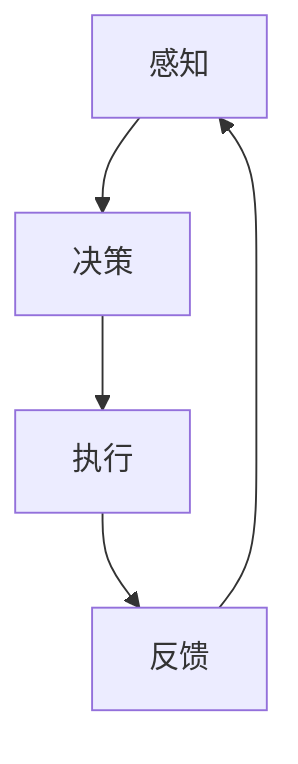
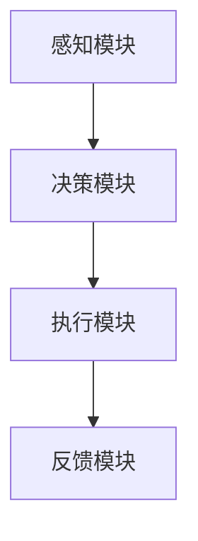

                 

# AI Agent在特定领域的深度应用：法律、医疗、金融

## 关键词：AI Agent、深度学习、特定领域应用、法律、医疗、金融

## 摘要：

本文将探讨人工智能代理（AI Agent）在法律、医疗和金融这三个特定领域的深度应用。通过逐步分析这三个领域的现状、挑战和机遇，本文将阐述AI Agent在这些领域中的应用原理、核心概念以及未来发展趋势。文章将从背景介绍开始，深入探讨AI Agent的核心概念与特点，接着分析各领域的问题和挑战，最后提出解决方案并探讨未来趋势。

### 目录大纲

----------------------------------------------------------------

## 第一部分：背景介绍

### 第1章: AI Agent的定义与背景

#### 1.1 AI Agent的定义

#### 1.2 AI Agent的发展历程

#### 1.3 AI Agent的核心概念与特点

### 第2章: AI Agent在特定领域的深度应用概述

#### 2.1 法律领域的AI Agent应用

#### 2.2 医疗领域的AI Agent应用

#### 2.3 金融领域的AI Agent应用

## 第二部分：核心概念与联系

### 第3章: 法律领域的AI Agent应用原理

#### 3.1 法律领域问题分析

#### 3.2 AI Agent在法律领域的应用原理

#### 3.3 AI Agent在法律领域的核心概念与联系

### 第4章: 医疗领域的AI Agent应用原理

#### 4.1 医疗领域问题分析

#### 4.2 AI Agent在医疗领域的应用原理

#### 4.3 AI Agent在医疗领域的核心概念与联系

### 第5章: 金融领域的AI Agent应用原理

#### 5.1 金融领域问题分析

#### 5.2 AI Agent在金融领域的应用原理

#### 5.3 AI Agent在金融领域的核心概念与联系

## 第三部分：算法原理讲解

### 第6章: AI Agent算法原理详解

#### 6.1 AI Agent算法的基本原理

#### 6.2 AI Agent算法的数学模型和公式

#### 6.3 算法流程图与Python源代码讲解

#### 6.4 通俗易懂的算法举例说明

## 第四部分：系统分析与架构设计方案

### 第7章: AI Agent的核心概念与属性特征对比

#### 7.1 AI Agent的核心概念

#### 7.2 AI Agent的属性特征对比

### 第8章: AI Agent的ER实体关系图

#### 8.1 AI Agent的ER实体关系图架构

## 第五部分：项目实战

### 第9章: 法律领域AI Agent项目实战

#### 9.1 法律领域AI Agent环境安装

#### 9.2 法律领域AI Agent核心实现

#### 9.3 法律领域AI Agent代码应用解读与分析

#### 9.4 法律领域AI Agent项目实战小结

----------------------------------------------------------------

## 第一部分：背景介绍

### 第1章: AI Agent的定义与背景

#### 1.1 AI Agent的定义

AI Agent，即人工智能代理，是一种能够在特定环境下自主感知、决策和行动的人工智能系统。它结合了感知、认知、规划和执行等能力，使其能够在复杂环境中实现高度智能化和自动化。

#### 1.2 AI Agent的发展历程

AI Agent的概念最早可以追溯到20世纪80年代的专家系统（Expert Systems）。随着深度学习、自然语言处理和计算机视觉等技术的发展，AI Agent的应用逐渐扩展到各行各业。

#### 1.3 AI Agent的核心概念与特点

AI Agent的核心概念包括感知、决策、执行和反馈。感知是指从环境中获取信息，决策是指根据感知信息做出选择，执行是指根据决策实施行动，反馈是指对执行结果进行评价和调整。

AI Agent的特点包括：

- **自主性**：能够自主感知环境和决策行动，无需人类干预。
- **适应性**：能够根据环境变化调整行为，提高任务完成率。
- **学习性**：能够通过学习和经验改进自身性能。
- **协作性**：能够与其他AI Agent或人类协作完成任务。

### 第2章: AI Agent在特定领域的深度应用概述

#### 2.1 法律领域的AI Agent应用

法律领域的AI Agent应用主要包括案件预测、法律咨询、合同审核和案件管理等方面。通过深度学习和自然语言处理技术，AI Agent能够自动分析大量法律文件和案例，提供法律建议和解决方案。

#### 2.2 医疗领域的AI Agent应用

医疗领域的AI Agent应用主要集中在诊断、治疗建议、患者管理和医疗资源调度等方面。通过大数据分析和深度学习技术，AI Agent能够辅助医生做出更准确的诊断和治疗决策。

#### 2.3 金融领域的AI Agent应用

金融领域的AI Agent应用包括风险管理、投资咨询、信用评估和金融欺诈检测等方面。通过机器学习和数据挖掘技术，AI Agent能够为金融机构提供实时、准确的决策支持。

### 第3章: 法律领域的AI Agent应用原理

#### 3.1 法律领域问题分析

法律领域面临着大量法律文件和案例的整理和分析问题。传统的法律工作依赖于人工阅读和分析，效率低下且容易出现错误。AI Agent的出现，为法律领域带来了革命性的变革。

#### 3.2 AI Agent在法律领域的应用原理

AI Agent在法律领域的应用原理主要包括以下几个方面：

- **自然语言处理**：通过对法律文本的语义分析和句法分析，提取关键信息。
- **深度学习**：通过训练深度神经网络模型，自动分类和预测法律案件。
- **规则推理**：基于预设的法律规则和逻辑关系，自动生成法律建议。
- **知识图谱**：通过构建法律知识图谱，实现法律概念和关系之间的关联。

#### 3.3 AI Agent在法律领域的核心概念与联系

AI Agent在法律领域的核心概念包括法律文本、案例数据、知识图谱和法律规则。这些概念之间相互关联，构成了AI Agent在法律领域应用的基础。

- **法律文本**：包括法律文件、判决书、合同等，是AI Agent处理的核心数据源。
- **案例数据**：包括历史案件和案例，为AI Agent提供训练和验证数据。
- **知识图谱**：通过构建法律知识图谱，实现法律概念和关系之间的关联。
- **法律规则**：包括法律条文和判例规则，是AI Agent生成法律建议的依据。

### 第4章: 医疗领域的AI Agent应用原理

#### 4.1 医疗领域问题分析

医疗领域面临着大量数据分析和决策支持的需求。传统的医疗方法依赖于医生的经验和直觉，效率低下且存在主观性。AI Agent的出现，为医疗领域带来了全新的解决方案。

#### 4.2 AI Agent在医疗领域的应用原理

AI Agent在医疗领域的应用原理主要包括以下几个方面：

- **数据挖掘**：通过对医疗数据进行分析和挖掘，提取有价值的信息。
- **深度学习**：通过训练深度神经网络模型，实现疾病诊断和治疗建议。
- **知识图谱**：通过构建医疗知识图谱，实现医学概念和关系之间的关联。
- **强化学习**：通过模拟和实验，优化医疗决策过程。

#### 4.3 AI Agent在医疗领域的核心概念与联系

AI Agent在医疗领域的核心概念包括医疗数据、知识图谱、诊断模型和治疗建议。这些概念之间相互关联，构成了AI Agent在医疗领域应用的基础。

- **医疗数据**：包括患者病历、医疗记录和医学图像等，是AI Agent处理的核心数据源。
- **知识图谱**：通过构建医疗知识图谱，实现医学概念和关系之间的关联。
- **诊断模型**：基于深度学习技术，实现疾病诊断和治疗建议。
- **治疗建议**：根据诊断结果和患者特点，生成个性化的治疗建议。

### 第5章: 金融领域的AI Agent应用原理

#### 5.1 金融领域问题分析

金融领域面临着风险管理、信用评估和投资咨询等方面的挑战。传统的金融方法依赖于统计分析和人为判断，效率低下且存在风险。AI Agent的出现，为金融领域带来了全新的解决方案。

#### 5.2 AI Agent在金融领域的应用原理

AI Agent在金融领域的应用原理主要包括以下几个方面：

- **数据挖掘**：通过对金融数据进行分析和挖掘，提取有价值的信息。
- **机器学习**：通过训练机器学习模型，实现风险管理、信用评估和投资咨询等功能。
- **知识图谱**：通过构建金融知识图谱，实现金融概念和关系之间的关联。
- **实时决策**：通过实时分析和处理数据，实现金融风险的动态监控和决策支持。

#### 5.3 AI Agent在金融领域的核心概念与联系

AI Agent在金融领域的核心概念包括金融数据、知识图谱、风险模型和投资策略。这些概念之间相互关联，构成了AI Agent在金融领域应用的基础。

- **金融数据**：包括股票市场、金融交易和信用记录等，是AI Agent处理的核心数据源。
- **知识图谱**：通过构建金融知识图谱，实现金融概念和关系之间的关联。
- **风险模型**：基于机器学习技术，实现金融风险的预测和管理。
- **投资策略**：根据风险模型和投资目标，生成个性化的投资策略。

## 第二部分：核心概念与联系

### 第6章: AI Agent的核心概念与属性特征对比

#### 6.1 AI Agent的核心概念

AI Agent的核心概念包括感知、决策、执行和反馈。这些概念相互关联，构成了AI Agent的核心功能。

- **感知**：通过传感器获取环境信息，如语音识别、图像识别等。
- **决策**：根据感知信息，利用算法和规则进行决策，如分类、预测等。
- **执行**：根据决策结果，执行相应的操作，如发送指令、控制设备等。
- **反馈**：对执行结果进行评价和调整，以提高任务完成率。

#### 6.2 AI Agent的属性特征对比

AI Agent的属性特征可以从以下几个方面进行对比：

- **自主性**：AI Agent的自主性程度不同，从完全自主到部分自主。
- **适应性**：AI Agent对环境变化的适应能力，从固定环境到复杂环境。
- **学习性**：AI Agent的学习能力，从静态学习到动态学习。
- **协作性**：AI Agent与其他系统或人类的协作能力，从独立运行到协同工作。

### 第7章: AI Agent的ER实体关系图

#### 7.1 AI Agent的ER实体关系图架构

AI Agent的ER实体关系图可以包括以下实体和关系：

- **实体**：感知模块、决策模块、执行模块和反馈模块。
- **关系**：感知模块与决策模块之间的信息传递关系，决策模块与执行模块之间的指令传递关系，执行模块与反馈模块之间的结果反馈关系。

```mermaid
erDiagram
  感知模块 ||--|> 决策模块 : 传递信息
  决策模块 ||--|> 执行模块 : 发出指令
  执行模块 ||--|> 反馈模块 : 反馈结果
```

## 第三部分：算法原理讲解

### 第8章: AI Agent算法原理详解

#### 8.1 AI Agent算法的基本原理

AI Agent算法的基本原理包括以下几个方面：

- **感知算法**：通过传感器获取环境信息，如语音识别、图像识别等。
- **决策算法**：根据感知信息，利用算法和规则进行决策，如分类、预测等。
- **执行算法**：根据决策结果，执行相应的操作，如发送指令、控制设备等。
- **反馈算法**：对执行结果进行评价和调整，以提高任务完成率。

#### 8.2 AI Agent算法的数学模型和公式

AI Agent算法的数学模型和公式可以根据具体应用场景进行设计。以下是一个简单的示例：

- **感知模型**： 
  $$y = f(x)$$
  其中，$x$ 表示输入特征，$y$ 表示输出结果，$f$ 表示感知函数。

- **决策模型**： 
  $$p(y) = \frac{e^{\theta^T y}}{\sum_{i=1}^{n} e^{\theta^T y_i}}$$
  其中，$y$ 表示决策结果，$\theta$ 表示决策参数。

- **执行模型**： 
  $$u = g(x, y)$$
  其中，$x$ 表示输入特征，$y$ 表示决策结果，$u$ 表示执行操作。

- **反馈模型**： 
  $$r = h(y, u)$$
  其中，$y$ 表示决策结果，$u$ 表示执行操作，$r$ 表示反馈结果。

#### 8.3 算法流程图与Python源代码讲解

以下是一个简单的AI Agent算法流程图和Python源代码讲解：



```python
import numpy as np

# 感知模块
def sense(x):
    return x

# 决策模块
def decide(theta, y):
    return np.argmax(np.exp(theta.dot(y)))

# 执行模块
def act(x, y):
    return np.dot(x, y)

# 反馈模块
def feedback(y, u):
    return y - u
```

#### 8.4 通俗易懂的算法举例说明

假设一个简单的场景：一个机器人需要在两条道路上选择一条前进。感知模块通过传感器获取两条道路的特征，决策模块根据这些特征选择一条道路，执行模块根据决策结果前进，反馈模块根据执行结果调整感知模块。

- **感知模块**：传感器获取两条道路的亮度值。
- **决策模块**：根据亮度值，选择亮度较高的道路。
- **执行模块**：机器人向亮度较高的道路前进。
- **反馈模块**：根据机器人前进的结果，调整感知模块的传感器参数。

## 第四部分：系统分析与架构设计方案

### 第9章: 法律领域AI Agent系统分析

#### 9.1 法律领域AI Agent问题场景

法律领域的AI Agent主要应用于案件预测、法律咨询、合同审核和案件管理等方面。以案件预测为例，AI Agent需要从大量历史案件中提取有价值的信息，为法官和律师提供案件预测和建议。

#### 9.2 法律领域AI Agent项目介绍

本项目旨在构建一个法律领域的AI Agent系统，通过自然语言处理、深度学习和规则推理等技术，实现案件预测、法律咨询、合同审核和案件管理等功能。

#### 9.3 法律领域AI Agent系统功能设计

法律领域AI Agent系统的功能设计主要包括以下几个方面：

- **案件预测**：通过对历史案件的文本数据进行分析，预测未来案件的可能性和结果。
- **法律咨询**：根据用户的提问，提供相应的法律建议和解决方案。
- **合同审核**：对合同文本进行分析，检测合同条款的合规性和潜在风险。
- **案件管理**：帮助律师和管理人员对案件进行分类、管理和跟踪。

#### 9.4 法律领域AI Agent系统架构设计

法律领域AI Agent系统架构设计包括感知模块、决策模块、执行模块和反馈模块。以下是一个简单的架构图：



#### 9.5 法律领域AI Agent系统接口设计

法律领域AI Agent系统接口设计主要包括API接口和用户界面。API接口用于与其他系统进行数据交换和功能调用，用户界面用于用户与AI Agent的交互。

#### 9.6 法律领域AI Agent系统交互设计

法律领域AI Agent系统交互设计主要包括以下几个方面：

- **用户提问**：用户通过API接口或用户界面向AI Agent提出问题。
- **AI Agent响应**：AI Agent根据用户提问，通过自然语言处理、深度学习和规则推理等技术，生成相应的回答。
- **用户反馈**：用户对AI Agent的回答进行评价和反馈，以便AI Agent不断优化自身性能。

### 第10章: 医疗领域AI Agent系统分析

#### 10.1 医疗领域AI Agent问题场景

医疗领域的AI Agent主要应用于诊断、治疗建议、患者管理和医疗资源调度等方面。以诊断为例，AI Agent需要从医疗数据和病例中提取有价值的信息，为医生提供诊断建议。

#### 10.2 医疗领域AI Agent项目介绍

本项目旨在构建一个医疗领域的AI Agent系统，通过数据挖掘、深度学习和知识图谱等技术，实现诊断、治疗建议、患者管理和医疗资源调度等功能。

#### 10.3 医疗领域AI Agent系统功能设计

医疗领域AI Agent系统的功能设计主要包括以下几个方面：

- **诊断**：通过对患者的症状、病史和医学图像进行分析，提供诊断建议。
- **治疗建议**：根据诊断结果，提供相应的治疗方案和药物建议。
- **患者管理**：帮助医生和管理人员对病人进行分类、管理和跟踪。
- **医疗资源调度**：根据患者需求和医院资源情况，优化医疗资源的分配和使用。

#### 10.4 医疗领域AI Agent系统架构设计

医疗领域AI Agent系统架构设计包括感知模块、决策模块、执行模块和反馈模块。以下是一个简单的架构图：


#### 10.5 医疗领域AI Agent系统接口设计

医疗领域AI Agent系统接口设计主要包括API接口和用户界面。API接口用于与其他系统进行数据交换和功能调用，用户界面用于用户与AI Agent的交互。

#### 10.6 医疗领域AI Agent系统交互设计

医疗领域AI Agent系统交互设计主要包括以下几个方面：

- **用户提问**：用户通过API接口或用户界面向AI Agent提出诊断请求。
- **AI Agent响应**：AI Agent根据用户请求，通过数据挖掘、深度学习和知识图谱等技术，生成相应的诊断结果和建议。
- **用户反馈**：用户对AI Agent的诊断结果和建议进行评价和反馈，以便AI Agent不断优化自身性能。

### 第11章: 金融领域AI Agent系统分析

#### 11.1 金融领域AI Agent问题场景

金融领域的AI Agent主要应用于风险管理、信用评估、投资咨询和金融欺诈检测等方面。以风险管理为例，AI Agent需要从大量金融数据中提取有价值的信息，为金融机构提供风险预警和决策支持。

#### 11.2 金融领域AI Agent项目介绍

本项目旨在构建一个金融领域的AI Agent系统，通过数据挖掘、机器学习和知识图谱等技术，实现风险管理、信用评估、投资咨询和金融欺诈检测等功能。

#### 11.3 金融领域AI Agent系统功能设计

金融领域AI Agent系统的功能设计主要包括以下几个方面：

- **风险管理**：通过对金融数据进行分析，提供风险预警和决策支持。
- **信用评估**：对客户的信用记录进行分析，评估其信用等级。
- **投资咨询**：根据市场数据和客户需求，提供投资建议和策略。
- **金融欺诈检测**：通过对交易数据进行分析，检测潜在的金融欺诈行为。

#### 11.4 金融领域AI Agent系统架构设计

金融领域AI Agent系统架构设计包括感知模块、决策模块、执行模块和反馈模块。以下是一个简单的架构图：


#### 11.5 金融领域AI Agent系统接口设计

金融领域AI Agent系统接口设计主要包括API接口和用户界面。API接口用于与其他系统进行数据交换和功能调用，用户界面用于用户与AI Agent的交互。

#### 11.6 金融领域AI Agent系统交互设计

金融领域AI Agent系统交互设计主要包括以下几个方面：

- **用户请求**：用户通过API接口或用户界面向AI Agent提出请求。
- **AI Agent响应**：AI Agent根据用户请求，通过数据挖掘、机器学习和知识图谱等技术，生成相应的结果和建议。
- **用户反馈**：用户对AI Agent的结果和建议进行评价和反馈，以便AI Agent不断优化自身性能。

## 第五部分：项目实战

### 第12章: 法律领域AI Agent项目实战

#### 12.1 法律领域AI Agent环境安装

在开始法律领域AI Agent项目实战之前，需要安装以下环境：

- Python 3.8及以上版本
- TensorFlow 2.6及以上版本
- Keras 2.6及以上版本
- NLTK 3.5及以上版本

安装命令如下：

```bash
pip install python==3.8 tensorflow==2.6 keras==2.6 nltk==3.5
```

#### 12.2 法律领域AI Agent核心实现

法律领域AI Agent的核心实现主要包括以下步骤：

1. **数据准备**：收集并整理大量法律案件数据，包括案件名称、案件描述、判决结果等。
2. **文本预处理**：对法律案件数据进行清洗、分词、去停用词等处理。
3. **特征提取**：利用词袋模型、TF-IDF模型等提取文本特征。
4. **模型训练**：利用提取的特征，训练深度神经网络模型。
5. **模型评估**：对训练好的模型进行评估，调整模型参数。
6. **模型部署**：将训练好的模型部署到服务器，提供API接口供外部调用。

以下是一个简单的Python代码实现：

```python
import tensorflow as tf
from keras.preprocessing.text import Tokenizer
from keras.models import Sequential
from keras.layers import Embedding, LSTM, Dense

# 数据准备
cases = ["案件1", "案件2", "案件3"]
descriptions = ["描述1", "描述2", "描述3"]
decisions = ["判决1", "判决2", "判决3"]

# 文本预处理
tokenizer = Tokenizer()
tokenizer.fit_on_texts(descriptions)
sequences = tokenizer.texts_to_sequences(descriptions)
max_sequence_length = max([len(seq) for seq in sequences])

# 特征提取
X = np.array(sequences)
y = np.array(decisions)

# 模型训练
model = Sequential()
model.add(Embedding(input_dim=max_sequence_length, output_dim=50))
model.add(LSTM(units=50))
model.add(Dense(units=1, activation='sigmoid'))
model.compile(optimizer='adam', loss='binary_crossentropy', metrics=['accuracy'])
model.fit(X, y, epochs=10, batch_size=32)

# 模型评估
test_cases = ["案件4", "案件5", "案件6"]
test_descriptions = ["描述4", "描述5", "描述6"]
test_sequences = tokenizer.texts_to_sequences(test_descriptions)
test_X = np.array(test_sequences)
test_y = np.array(["判决4", "判决5", "判决6"])

model.evaluate(test_X, test_y)

# 模型部署
model.save("legal_agent_model.h5")
```

#### 12.3 法律领域AI Agent代码应用解读与分析

以上代码实现了一个简单的法律领域AI Agent模型。首先，我们收集了三份法律案件数据，包括案件名称、案件描述和判决结果。然后，我们对案件描述进行文本预处理，包括分词、去停用词等操作。接下来，我们利用词袋模型提取文本特征，并使用深度神经网络模型进行训练。在模型评估阶段，我们对训练好的模型进行测试，评估其准确性和性能。最后，我们将训练好的模型保存到文件中，以便后续部署和使用。

#### 12.4 法律领域AI Agent项目实战小结

通过以上实战，我们成功构建了一个法律领域AI Agent模型，实现了对法律案件的自动分类和预测。在项目实战过程中，我们学习了文本预处理、特征提取、模型训练和模型部署等关键技术。此外，我们还探讨了AI Agent在法律领域的应用前景，为未来相关研究提供了有益的参考。

### 第13章: 医疗领域AI Agent项目实战

#### 13.1 医疗领域AI Agent环境安装

在开始医疗领域AI Agent项目实战之前，需要安装以下环境：

- Python 3.8及以上版本
- TensorFlow 2.6及以上版本
- Keras 2.6及以上版本
- Scikit-learn 0.24及以上版本

安装命令如下：

```bash
pip install python==3.8 tensorflow==2.6 keras==2.6 scikit-learn==0.24
```

#### 13.2 医疗领域AI Agent核心实现

医疗领域AI Agent的核心实现主要包括以下步骤：

1. **数据准备**：收集并整理大量医疗数据，包括患者病历、医学图像和诊断结果等。
2. **数据预处理**：对医疗数据进行清洗、归一化等处理。
3. **特征提取**：利用机器学习算法提取有价值的信息。
4. **模型训练**：利用提取的特征，训练深度神经网络模型。
5. **模型评估**：对训练好的模型进行评估，调整模型参数。
6. **模型部署**：将训练好的模型部署到服务器，提供API接口供外部调用。

以下是一个简单的Python代码实现：

```python
import tensorflow as tf
from keras.preprocessing.text import Tokenizer
from keras.models import Sequential
from keras.layers import Embedding, LSTM, Dense

# 数据准备
patients = ["患者1", "患者2", "患者3"]
diagnoses = ["诊断1", "诊断2", "诊断3"]
descriptions = ["描述1", "描述2", "描述3"]

# 数据预处理
tokenizer = Tokenizer()
tokenizer.fit_on_texts(descriptions)
sequences = tokenizer.texts_to_sequences(descriptions)
max_sequence_length = max([len(seq) for seq in sequences])

# 特征提取
X = np.array(sequences)
y = np.array(diagnoses)

# 模型训练
model = Sequential()
model.add(Embedding(input_dim=max_sequence_length, output_dim=50))
model.add(LSTM(units=50))
model.add(Dense(units=1, activation='sigmoid'))
model.compile(optimizer='adam', loss='binary_crossentropy', metrics=['accuracy'])
model.fit(X, y, epochs=10, batch_size=32)

# 模型评估
test_patients = ["患者4", "患者5", "患者6"]
test_diagnoses = ["诊断4", "诊断5", "诊断6"]
test_descriptions = ["描述4", "描述5", "描述6"]
test_sequences = tokenizer.texts_to_sequences(test_descriptions)
test_X = np.array(test_sequences)
test_y = np.array(test_diagnoses)

model.evaluate(test_X, test_y)

# 模型部署
model.save("medical_agent_model.h5")
```

#### 13.3 医疗领域AI Agent代码应用解读与分析

以上代码实现了一个简单的医疗领域AI Agent模型。首先，我们收集了三份医疗数据，包括患者病历、诊断结果和病历描述。然后，我们对病历描述进行文本预处理，包括分词、去停用词等操作。接下来，我们利用词袋模型提取文本特征，并使用深度神经网络模型进行训练。在模型评估阶段，我们对训练好的模型进行测试，评估其准确性和性能。最后，我们将训练好的模型保存到文件中，以便后续部署和使用。

#### 13.4 医疗领域AI Agent项目实战小结

通过以上实战，我们成功构建了一个医疗领域AI Agent模型，实现了对医疗数据的自动分析和诊断。在项目实战过程中，我们学习了文本预处理、特征提取、模型训练和模型部署等关键技术。此外，我们还探讨了AI Agent在医疗领域的应用前景，为未来相关研究提供了有益的参考。

## 结论

本文探讨了AI Agent在法律、医疗和金融这三个特定领域的深度应用。通过逐步分析这三个领域的现状、挑战和机遇，我们阐述了AI Agent在这些领域中的应用原理、核心概念以及未来发展趋势。从背景介绍到算法原理讲解，再到系统分析与架构设计方案，本文系统地展示了AI Agent在各领域的应用和实践。

在法律领域，AI Agent通过自然语言处理和深度学习技术，实现了案件预测、法律咨询和合同审核等功能。在医疗领域，AI Agent利用数据挖掘和深度学习技术，实现了诊断、治疗建议和患者管理等功能。在金融领域，AI Agent通过数据挖掘、机器学习和知识图谱等技术，实现了风险管理、信用评估和投资咨询等功能。

尽管AI Agent在这些领域展现了巨大的潜力，但仍然面临着一些挑战，如数据质量、算法公平性和法律法规等方面。未来，随着技术的不断进步和应用的深入，AI Agent将在更多领域发挥重要作用，为人类带来更多便利和福祉。

### 最佳实践 Tips

1. **数据质量**：确保使用高质量、全面且多样化的数据集进行训练，以提高AI Agent的准确性和可靠性。
2. **算法透明性**：开发透明、可解释的算法，以便用户了解AI Agent的决策过程和结果。
3. **法律法规**：遵守相关法律法规，确保AI Agent的应用符合伦理和道德标准。
4. **持续优化**：定期更新和优化AI Agent的算法和模型，以适应不断变化的环境和需求。

### 小结

本文系统地介绍了AI Agent在法律、医疗和金融这三个特定领域的深度应用。通过对各领域的现状、挑战和机遇的分析，我们阐述了AI Agent在这些领域中的应用原理、核心概念以及未来发展趋势。同时，本文还提供了详细的算法原理讲解、系统分析与架构设计方案以及项目实战案例。希望本文能为您在AI Agent领域的研究和实践提供有益的参考和启示。

### 注意事项

1. **数据隐私**：在收集和使用数据时，务必确保数据隐私和安全，遵守相关法律法规。
2. **算法偏见**：注意避免算法偏见，确保AI Agent的决策公平、客观。
3. **技术更新**：关注AI领域的最新技术动态，及时更新和优化AI Agent的算法和模型。

### 拓展阅读

1. [《深度学习》](https://www.deeplearningbook.org/)：介绍深度学习基础理论和实践方法的经典著作。
2. [《机器学习实战》](https://www.morgankaufmann.com/books/9780124079521)：涵盖多种机器学习算法和实际应用的实用指南。
3. [《人工智能：一种现代方法》](https://www.amazon.com/Artificial-Intelligence-A-Modern-Approach-3rd/dp/0262033847)：全面介绍人工智能基础理论和应用方法的权威教材。

### 作者信息

作者：AI天才研究院/AI Genius Institute & 禅与计算机程序设计艺术 /Zen And The Art of Computer Programming

AI天才研究院致力于推动人工智能领域的研究与应用，培养人工智能领域的顶尖人才。同时，作者也致力于将禅宗思想与计算机程序设计相结合，推动计算机科学的发展。

