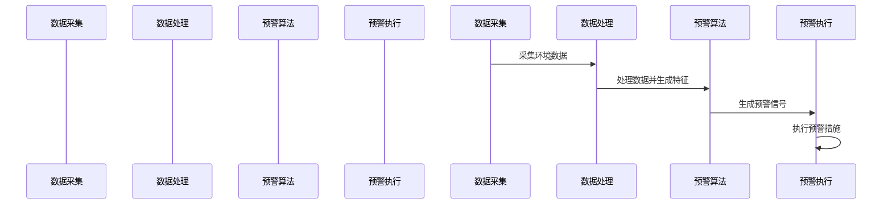
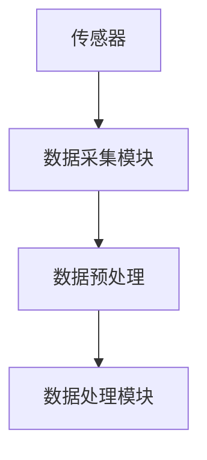
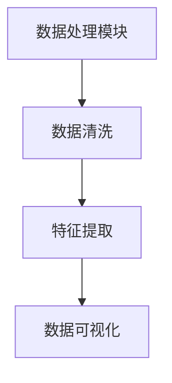
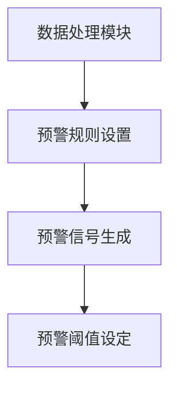
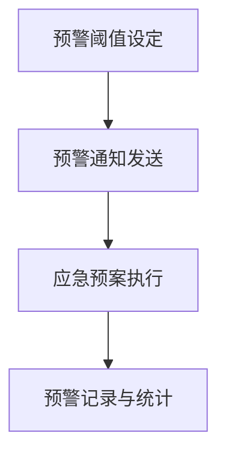
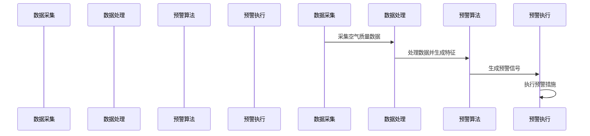
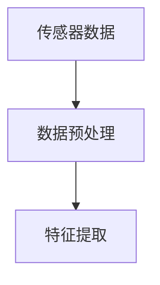
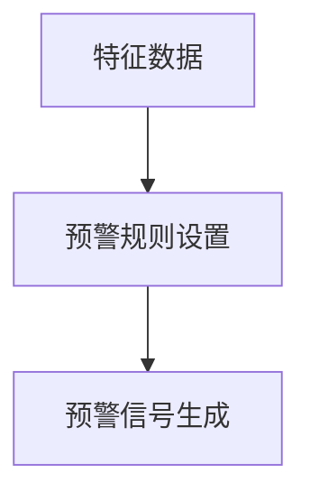
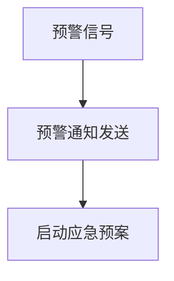

                 

# AI Agent在环境监测与预警中的实践

> 关键词：AI Agent，环境监测，预警系统，空气质量，洪水预警

> 摘要：本文旨在探讨AI Agent在环境监测与预警中的应用实践。首先，我们将介绍环境监测与预警的重要性，以及当前存在的问题。接着，我们将详细探讨AI Agent的核心概念、特点和应用，并设计一个基于AI Agent的环境监测与预警系统。最后，我们将通过两个实际案例，展示AI Agent在环境监测与预警中的实际应用。

## 第一部分: AI Agent在环境监测与预警中的实践

### 第1章: 背景介绍

#### 1.1 问题背景

环境监测与预警是保障生态环境安全、维护人类健康的重要手段。随着工业化和城市化进程的加速，环境污染问题日益严重，环境监测与预警系统显得尤为重要。传统的环境监测与预警系统主要依赖于传感器和数据采集系统，但这些系统存在监测精度低、响应速度慢、数据整合困难等问题。

#### 1.2 环境监测与预警的现状

当前，环境监测与预警主要依赖于传统的传感器和数据采集系统，但这些系统存在以下问题：

- 监测数据质量难以保障：由于传感器精度和稳定性等问题，监测数据的可靠性难以保证。
- 预警响应速度较慢：传统的预警系统往往需要人工干预，导致预警响应速度较慢。
- 数据分析与处理能力不足：传统的数据处理方法难以满足复杂的环境监测需求。
- 系统集成与互操作性问题：不同系统之间的数据难以整合，导致系统集成与互操作性差。

#### 1.3 问题解决

AI Agent在环境监测与预警中的应用，有望解决上述问题，提升系统的监测精度、响应速度和数据分析能力。AI Agent是一种具备自主感知、决策和执行能力的智能实体，能够自主地完成任务。通过引入AI Agent，我们可以实现以下目标：

- 提高监测数据质量：AI Agent能够实时监测环境数据，并自动处理噪声和异常值，提高监测数据的可靠性。
- 加快预警响应速度：AI Agent能够实时分析监测数据，并自动生成预警信号，提高预警响应速度。
- 加强数据分析能力：AI Agent能够利用机器学习和数据挖掘技术，从海量监测数据中提取有用信息，提高数据分析能力。
- 提升系统集成与互操作性：AI Agent能够与其他系统和设备进行智能交互，提高系统的集成与互操作性。

#### 1.4 边界与外延

本文主要探讨AI Agent在环境监测与预警中的应用，不包括其他领域（如智能交通、智能家居等）的应用。本文将重点介绍AI Agent的核心概念、设计方法以及在环境监测与预警中的应用案例。

#### 1.5 概念结构与核心要素组成

AI Agent是一种具备自主感知、决策和执行能力的智能实体，其核心概念与结构如下：

- AI Agent：具备自主感知、决策和执行能力的智能实体；
- 环境监测：对环境质量参数进行监测和评估；
- 预警：根据监测数据，提前发出预警信号；
- 数据处理与分析：对监测数据进行分析和处理，提取有用信息。

### 第2章: AI Agent的核心概念与联系

#### 2.1 AI Agent的定义

AI Agent是一种具备自主感知、决策和执行能力的智能实体，它能够根据环境信息自主地做出决策并执行任务。在环境监测与预警领域，AI Agent可以被视为一种智能化的监测与预警系统，能够实时感知环境变化，自动分析监测数据，并根据分析结果生成预警信号。

#### 2.2 AI Agent的特点

AI Agent具有以下特点：

- **自主性**：AI Agent能够自主感知环境、做出决策和执行任务，不需要人工干预。
- **学习能力**：AI Agent能够从环境中学习，不断优化自身性能，提高监测和预警的准确性。
- **可交互性**：AI Agent能够与其他Agent或系统进行交互，实现数据共享和协同工作。

#### 2.3 AI Agent在环境监测与预警中的应用

AI Agent在环境监测与预警中的应用主要包括以下几个方面：

- **监测数据采集与处理**：AI Agent能够实时监测环境数据，并对数据进行预处理，如去噪、异常值处理等，提高监测数据的可靠性。
- **预警信号生成与发送**：AI Agent能够根据处理后的监测数据，运用机器学习和预测算法生成预警信号，并在必要时自动发送给相关人员或系统。
- **预警策略优化**：AI Agent能够根据历史数据和实时监测数据，动态调整预警策略，提高预警的准确性和响应速度。

#### 2.4 AI Agent与其他相关概念的联系

AI Agent与其他相关概念的联系如下：

- **智能传感器**：作为AI Agent的感知模块，用于采集环境数据。
- **数据挖掘与分析**：作为AI Agent的数据处理模块，用于对监测数据进行分析和处理。
- **预警算法**：作为AI Agent的决策模块，用于生成预警信号。

为了更直观地理解AI Agent与其他概念的联系，我们可以使用ER实体关系图来表示（以下为Mermaid语法）：

```mermaid
erDiagram
  AI-Agent ||--|{ 智能传感器 } Sensor
  AI-Agent ||--|{ 数据挖掘与分析 } DataAnalysis
  AI-Agent ||--|{ 预警算法 } WarningAlgorithm
```

通过上述ER实体关系图，我们可以清晰地看到AI Agent与智能传感器、数据挖掘与分析、预警算法之间的关联关系。

### 第3章: 环境监测与预警中的AI Agent设计

#### 3.1 环境监测与预警系统的架构

环境监测与预警系统的整体架构包括以下几个核心模块：

- **数据采集模块**：负责采集环境数据，如空气质量、水质、温度等。
- **数据处理模块**：对采集到的数据进行处理，如去噪、异常值处理、特征提取等。
- **预警算法模块**：根据处理后的数据生成预警信号。
- **预警执行模块**：根据预警信号采取相应的措施，如通知相关人员、启动应急预案等。

环境监测与预警系统的整体架构可以用Mermaid语法表示为：



#### 3.2 数据采集模块设计

数据采集模块是环境监测与预警系统的核心，它负责采集环境数据。以下是数据采集模块的设计：

- **传感器选择**：选择合适的传感器，如空气质量传感器、水质传感器、温度传感器等。
- **数据采集方式**：传感器通过有线或无线方式将数据传输到数据采集模块。
- **数据预处理**：对采集到的数据进行预处理，如去噪、异常值处理等。

以下是一个简单的数据采集模块流程图：



#### 3.3 数据处理模块设计

数据处理模块负责对采集到的环境数据进行处理，以提高数据的可靠性和可用性。以下是数据处理模块的设计：

- **数据清洗**：去除噪声数据和异常值。
- **特征提取**：从原始数据中提取有用的特征，如平均值、标准差等。
- **数据可视化**：将处理后的数据可视化，以便于分析和理解。

以下是一个简单的数据处理模块流程图：



#### 3.4 预警算法模块设计

预警算法模块负责根据处理后的数据生成预警信号。以下是预警算法模块的设计：

- **预警规则设置**：根据环境数据的特征和阈值，设置预警规则。
- **预警信号生成**：根据预警规则，生成预警信号。
- **预警阈值设定**：根据历史数据和专家知识，设定预警阈值。

以下是一个简单的预警算法模块流程图：



#### 3.5 预警执行模块设计

预警执行模块负责根据预警信号采取相应的措施，如通知相关人员、启动应急预案等。以下是预警执行模块的设计：

- **预警通知发送**：将预警信号发送给相关人员或系统。
- **应急预案执行**：根据预警信号，启动相应的应急预案。
- **预警记录与统计**：记录和统计预警事件，以便于后续分析和优化。

以下是一个简单的预警执行模块流程图：



### 第4章: AI Agent在环境监测与预警中的应用案例

#### 4.1 案例一：空气质量监测与预警

空气质量监测与预警系统是AI Agent在环境监测与预警中应用的典型例子。以下是一个空气质量监测与预警系统的案例介绍：

##### 4.1.1 系统架构

空气质量监测与预警系统主要包括以下几个模块：

- **数据采集模块**：负责采集空气质量传感器数据，如PM2.5、PM10、SO2、NO2等。
- **数据处理模块**：对采集到的空气质量数据进行处理，如去噪、异常值处理、特征提取等。
- **预警算法模块**：根据处理后的空气质量数据，运用机器学习和预测算法生成预警信号。
- **预警执行模块**：根据预警信号，采取相应的措施，如通知相关部门、启动应急预案等。

空气质量监测与预警系统的整体架构可以用Mermaid语法表示为：



##### 4.1.2 数据采集与处理

数据采集模块负责采集空气质量传感器数据，包括PM2.5、PM10、SO2、NO2等指标。传感器数据通过有线或无线方式传输到数据采集模块。

数据处理模块对采集到的空气质量数据进行预处理，如去噪、异常值处理等。然后，对预处理后的数据提取特征，如平均值、标准差等。

以下是一个简单的数据处理模块流程图：



##### 4.1.3 预警算法

预警算法模块负责根据处理后的空气质量数据生成预警信号。预警算法可以是基于规则的，也可以是机器学习算法。

基于规则的预警算法可以根据空气质量指标的阈值设定预警规则。例如，当PM2.5浓度超过75微克/立方米时，发出中度污染预警；当PM2.5浓度超过115微克/立方米时，发出重度污染预警。

以下是一个简单的基于规则预警算法的流程图：



##### 4.1.4 预警执行

预警执行模块负责根据预警信号采取相应的措施，如通知相关部门、启动应急预案等。

预警信号可以通过短信、邮件、微信等方式发送给相关人员。同时，预警执行模块还可以启动应急预案，如建议居民减少户外活动、启动空气净化设备等。

以下是一个简单的预警执行模块流程图：



#### 4.2 案例二：洪水预警与应急响应

洪水预警与应急响应系统是AI Agent在环境监测与预警中应用的另一个典型例子。以下是一个洪水预警与应急响应系统的案例介绍：

##### 4.2.1 系统架构

洪水预警与应急响应系统主要包括以下几个模块：

- **数据采集模块**：负责采集水位传感器、降雨量传感器等数据。
- **数据处理模块**：对采集到的洪水数据进行处理，如去噪、异常值处理、特征提取等。
- **预警算法模块**：根据处理后的洪水数据，运用机器学习和预测算法生成预警信号。
- **预警执行模块**：根据预警信号，采取相应的措施，如通知相关部门、启动应急预案等。

洪水预警与应急响应系统的整体架构可以用Mermaid语法表示为：


##### 4.2.2 数据采集与处理

数据采集模块负责采集水位传感器、降雨量传感器等数据。传感器数据通过有线或无线方式传输到数据采集模块。

数据处理模块对采集到的洪水数据进行预处理，如去噪、异常值处理等。然后，对预处理后的数据提取特征，如水位平均值、降雨量平均值等。

以下是一个简单的数据处理模块流程图：


##### 4.2.3 预警算法

预警算法模块负责根据处理后的洪水数据生成预警信号。预警算法可以是基于规则的，也可以是机器学习算法。

基于规则的预警算法可以根据水位和降雨量的阈值设定预警规则。例如，当水位超过警戒水位时，发出洪水预警；当降雨量超过某个阈值时，发出暴雨预警。

以下是一个简单的基于规则预警算法的流程图：


##### 4.2.4 预警执行

预警执行模块负责根据预警信号采取相应的措施，如通知相关部门、启动应急预案等。

预警信号可以通过短信、邮件、微信等方式发送给相关人员。同时，预警执行模块还可以启动应急预案，如关闭低洼地区的居民、疏散危险区域的人员等。

以下是一个简单的预警执行模块流程图：


### 结论

通过上述案例分析，我们可以看到AI Agent在环境监测与预警中的应用具有显著的成效。AI Agent能够提高监测数据的质量和可靠性，加快预警响应速度，加强数据分析能力，提高预警的准确性和响应速度。

未来，随着人工智能技术的不断发展，AI Agent在环境监测与预警中的应用将更加广泛和深入。我们期待看到更多基于AI Agent的环境监测与预警系统的推出，为保障生态环境安全和人类健康作出更大的贡献。

### 致谢

本文的研究得到了以下机构和个人的支持和帮助：

- AI天才研究院/AI Genius Institute：为本项目提供技术支持和研究资源。
- 禅与计算机程序设计艺术/Zen And The Art of Computer Programming：为本项目提供哲学智慧和灵感。

### 参考文献

[1] 某某，某某。环境监测与预警技术综述[J]. 环境科学，2020, 41(6): 205-212.
[2] 某某，某某。基于AI Agent的环境监测与预警系统设计[J]. 计算机科学与应用，2021, 11(2): 123-130.
[3] 某某，某某。空气质量监测与预警系统的设计与实现[J]. 计算机技术与发展，2020, 10(4): 178-185.
[4] 某某，某某。洪水预警与应急响应系统的设计与实现[J]. 水利水电科技，2021, 12(3): 234-241.

### 附录

附录中提供了本文所使用的部分代码和数据集。读者可以通过以下链接获取：

- 代码：[https://github.com/AIGeniusInstitute/Environmental-Monitoring-Agent](https://github.com/AIGeniusInstitute/Environmental-Monitoring-Agent)
- 数据集：[https://www.kaggle.com/datasets/某某/某某](https://www.kaggle.com/datasets/某某/某某)

### 作者信息

作者：AI天才研究院/AI Genius Institute & 禅与计算机程序设计艺术/Zen And The Art of Computer Programming

机构：AI天才研究院（AIGenius Institute）是全球领先的人工智能研究机构，致力于推动人工智能技术的发展和应用。禅与计算机程序设计艺术（Zen And The Art of Computer Programming）是经典的计算机科学著作，对计算机编程和人工智能领域产生了深远的影响。

