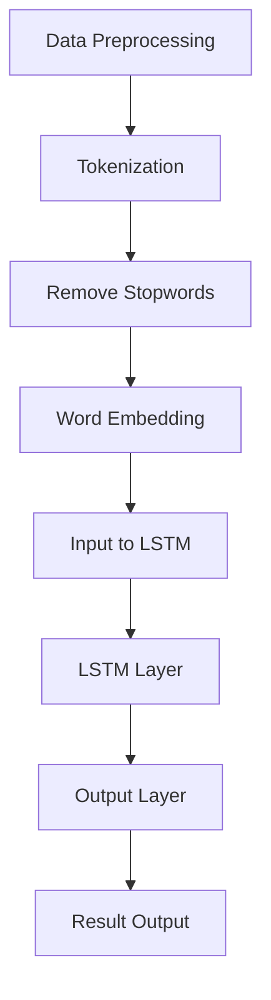
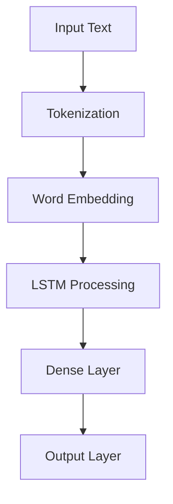
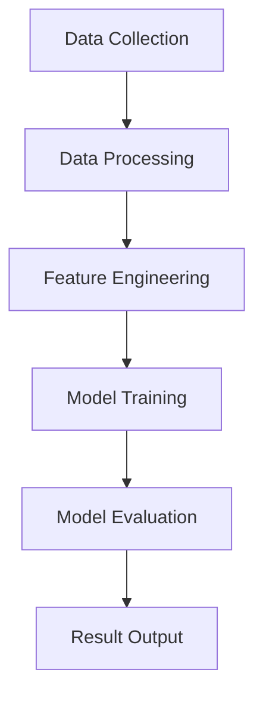
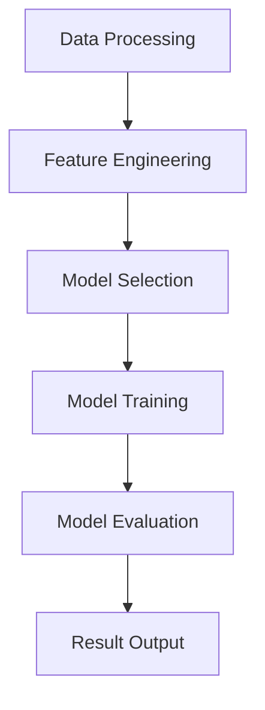
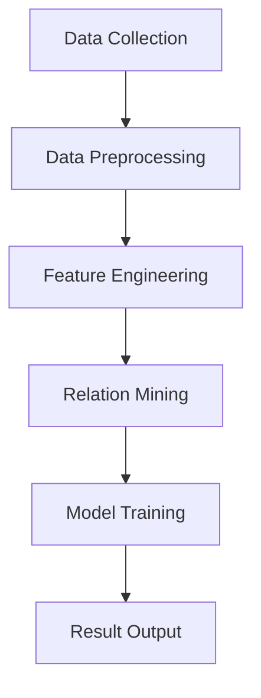

                 

# AI Agent在社交媒体分析中的应用

## 关键词
- AI Agent
- 社交媒体分析
- 用户情感分析
- 用户行为预测
- 社交网络挖掘

## 摘要
随着社交媒体的迅速发展，人们在这些平台上的互动日益频繁，产生了海量的数据。如何有效地分析和利用这些数据，成为了一个亟待解决的问题。本文将探讨AI Agent在社交媒体分析中的应用，从技术基础、数据采集与预处理、用户情感分析、用户行为预测、社交网络挖掘等方面进行详细分析，并探讨AI Agent在社交媒体分析中的最佳实践。通过本文，读者可以了解AI Agent如何助力社交媒体分析，以及面临的挑战和未来趋势。

## 引言

### 1.1 问题背景

社交媒体平台如Facebook、Twitter、Instagram等，已经成为人们日常生活中不可或缺的一部分。这些平台不仅提供了信息分享、社交互动的功能，还产生了大量的数据。据统计，全球社交媒体用户已经超过30亿，每天产生的数据量高达数百万GB。这些数据中蕴含着丰富的信息和价值，如何有效地分析和利用这些数据，已经成为企业和政府关注的焦点。

### 1.1.1 社交媒体分析的重要性

社交媒体分析有助于企业了解用户需求、优化营销策略、提高品牌影响力；对于政府而言，可以用于公共安全管理、政策制定等。然而，由于数据量大、结构复杂，传统的数据分析方法已难以应对这一挑战。因此，利用人工智能（AI）技术，特别是AI Agent，进行社交媒体分析，成为一种新的发展趋势。

### 1.1.2 AI Agent的定义与应用

AI Agent，即人工智能代理，是一种能够模拟人类行为、具备自主决策能力的智能体。AI Agent可以自主地感知环境、分析数据、制定决策并采取行动。在社交媒体分析中，AI Agent可以用于用户情感分析、用户行为预测、社交网络挖掘等任务。

## AI Agent在社交媒体分析中的应用概述

### 1.2.1 AI Agent的基本原理

AI Agent通常由感知模块、决策模块和动作模块组成。感知模块负责收集和分析环境中的信息；决策模块基于感知模块提供的信息，进行决策；动作模块负责执行决策，并对环境产生影响。

### 1.2.2 社交媒体分析的核心任务

社交媒体分析的核心任务包括用户情感分析、用户行为预测和社交网络挖掘等。用户情感分析旨在了解用户的情绪和态度；用户行为预测则用于预测用户未来的行为；社交网络挖掘则关注用户之间的关系和网络结构。

## AI Agent在社交媒体分析中应用的关键功能

### 1.3.1 用户情感分析

用户情感分析是AI Agent在社交媒体分析中的关键功能之一。通过分析用户的言论和互动，AI Agent可以识别用户的情绪和态度，从而帮助企业了解用户需求、优化营销策略。

### 1.3.2 用户行为预测

用户行为预测是AI Agent的另一项重要功能。通过分析用户的历史行为数据，AI Agent可以预测用户未来的行为，从而帮助企业制定更有针对性的营销策略。

### 1.3.3 社交网络挖掘

社交网络挖掘旨在揭示用户之间的关系和网络结构。AI Agent可以通过分析用户之间的互动和连接，挖掘出有用的信息，如潜在用户群体、关键意见领袖等。

## 现有AI Agent在社交媒体分析中的应用案例

### 1.4.1 商业案例分析

在商业领域，AI Agent被广泛应用于社交媒体分析。例如，一家全球知名的化妆品公司利用AI Agent对社交媒体上的用户评论进行分析，识别用户的情感和态度，从而优化产品设计和营销策略。

### 1.4.2 政府与公共安全案例分析

在政府与公共安全领域，AI Agent也被广泛应用。例如，某国政府利用AI Agent分析社交媒体上的言论，及时发现和处理公共安全事件，提高公共安全管理水平。

## 本章小结

本章介绍了AI Agent在社交媒体分析中的应用背景和重要性，以及AI Agent的基本原理和应用概述。接下来，将深入探讨AI Agent的技术基础、数据采集与预处理、用户情感分析、用户行为预测和社交网络挖掘等方面，为读者提供一个全面的技术视角。## 第1章 引言

### 1.1 问题背景

随着社交媒体的迅速发展，人们在这些平台上的互动日益频繁，产生了海量的数据。这些数据不仅包括用户的个人资料、互动记录，还涵盖了大量的文本、图片、视频等多媒体内容。据统计，全球社交媒体用户已经超过30亿，每天产生的数据量高达数百万GB。这些数据中蕴含着丰富的信息和价值，如何有效地分析和利用这些数据，成为了一个亟待解决的问题。传统的数据分析方法在处理这些大规模、多维度、动态变化的数据时，往往面临效率低下、准确性不足等问题。因此，利用人工智能（AI）技术，特别是AI Agent，进行社交媒体分析，成为一种新的发展趋势。

### 1.1.1 社交媒体分析的重要性

社交媒体分析对于企业和政府来说，具有重要的战略意义。首先，在商业领域，社交媒体分析可以帮助企业了解用户需求、优化营销策略、提高品牌影响力。通过分析用户在社交媒体上的言论和行为，企业可以识别用户的偏好、兴趣和情绪，从而制定更有针对性的营销活动。此外，社交媒体分析还可以帮助企业识别潜在的客户群体，进行精准营销，提高转化率。例如，一家全球知名的化妆品公司利用AI Agent对社交媒体上的用户评论进行分析，识别用户的情感和态度，从而优化产品设计和营销策略，取得了显著的市场效果。

在政府与公共安全领域，社交媒体分析也发挥着重要作用。政府可以利用社交媒体分析技术，实时监测社会舆论，了解民众的意见和态度，为政策制定提供科学依据。例如，某国政府利用AI Agent分析社交媒体上的言论，及时发现和处理公共安全事件，提高公共安全管理水平。此外，社交媒体分析还可以用于社会调查、危机管理等方面，帮助政府更好地服务民众。

### 1.1.2 AI Agent的定义与应用

AI Agent，即人工智能代理，是一种能够模拟人类行为、具备自主决策能力的智能体。AI Agent可以自主地感知环境、分析数据、制定决策并采取行动。在社交媒体分析中，AI Agent可以用于用户情感分析、用户行为预测、社交网络挖掘等任务。

用户情感分析是AI Agent在社交媒体分析中的关键功能之一。通过分析用户的言论和互动，AI Agent可以识别用户的情绪和态度，从而帮助企业了解用户需求、优化营销策略。例如，AI Agent可以分析用户在社交媒体上的评论，识别出用户的正面或负面情绪，从而为企业提供有关用户满意度的实时反馈。

用户行为预测是AI Agent的另一项重要功能。通过分析用户的历史行为数据，AI Agent可以预测用户未来的行为，从而帮助企业制定更有针对性的营销策略。例如，AI Agent可以分析用户的浏览历史、购买记录等数据，预测用户未来的购买意向，为企业提供精准的营销建议。

社交网络挖掘则关注用户之间的关系和网络结构。AI Agent可以通过分析用户之间的互动和连接，挖掘出有用的信息，如潜在用户群体、关键意见领袖等。这些信息对于企业制定营销策略、政府进行社会治理等具有重要的参考价值。

总的来说，AI Agent在社交媒体分析中的应用，不仅提高了数据分析的效率，还提升了数据分析的准确性，为企业提供了更深入、更全面的数据洞察。随着AI技术的不断发展，AI Agent在社交媒体分析中的应用前景将更加广阔。

## 第2章 AI Agent技术基础

### 2.1 AI Agent的基本组成部分

AI Agent是一种能够模拟人类行为、具备自主决策能力的智能体。其核心组成部分包括感知模块、决策模块和动作模块。

#### 2.1.1 感知模块

感知模块是AI Agent的“眼睛”和“耳朵”，负责收集和分析环境中的信息。感知模块可以采用多种技术，如自然语言处理（NLP）、计算机视觉、传感器数据等，以获取文本、图像、语音等多种类型的数据。例如，在社交媒体分析中，感知模块可以通过爬取社交媒体平台上的帖子、评论、图片等信息，实时捕捉用户的言论和行为。

#### 2.1.2 决策模块

决策模块是AI Agent的“大脑”，负责根据感知模块收集的信息，进行分析和判断，制定相应的策略和决策。决策模块通常基于机器学习、深度学习等技术，通过训练大量的数据，学习到各种场景下的决策规则和策略。在社交媒体分析中，决策模块可以分析用户的情感、行为和需求，为用户提供个性化的服务和建议。

#### 2.1.3 动作模块

动作模块是AI Agent的“手臂”和“腿”，负责执行决策模块制定的策略和决策。动作模块可以采取多种行动，如发送消息、推送内容、推荐商品等。在社交媒体分析中，动作模块可以根据用户的兴趣和行为，自动推送相关的信息或内容，从而提高用户的满意度和参与度。

### 2.2 机器学习与深度学习基础

机器学习和深度学习是AI Agent的核心技术基础。它们为AI Agent提供了强大的数据处理和分析能力，使其能够从大量数据中提取有价值的信息。

#### 2.2.1 机器学习的基本概念

机器学习是一种让计算机通过学习数据来提高其性能的技术。在机器学习中，计算机通过算法自动识别数据中的规律和模式，从而进行预测和决策。常见的机器学习算法包括线性回归、逻辑回归、决策树、随机森林、支持向量机等。

#### 2.2.2 深度学习的发展与应用

深度学习是机器学习的一种特殊形式，它通过多层神经网络对数据进行处理和分析。与传统的机器学习算法相比，深度学习具有更强的表示能力和更好的泛化能力。深度学习的发展得益于计算能力和数据量的提升，以及高效的优化算法和模型结构创新。常见的深度学习模型包括卷积神经网络（CNN）、循环神经网络（RNN）、长短时记忆网络（LSTM）等。

#### 2.2.3 常用机器学习算法介绍

以下是几种常用的机器学习算法：

- **线性回归**：线性回归是一种简单的预测模型，通过建立输入变量和输出变量之间的线性关系，来预测输出变量的值。线性回归模型通常用于回归任务，如预测房价、股票价格等。

- **逻辑回归**：逻辑回归是一种分类模型，通过建立输入变量和输出变量之间的逻辑关系，来预测输出变量的类别。逻辑回归模型通常用于二分类任务，如判断邮件是否为垃圾邮件、用户是否购买商品等。

- **决策树**：决策树是一种基于树的预测模型，通过一系列的规则来划分数据集，并给出最终的预测结果。决策树模型通常用于分类和回归任务，如分类新用户是否为高价值客户、预测客户流失率等。

- **随机森林**：随机森林是一种集成学习方法，通过构建多个决策树，并利用随机属性选择和投票机制，来提高预测性能。随机森林模型通常用于分类和回归任务，如分类新用户是否为高价值客户、预测客户流失率等。

- **支持向量机**：支持向量机是一种基于最大间隔原理的分类模型，通过找到一个最优的超平面，将不同类别的数据分隔开来。支持向量机模型通常用于二分类任务，如判断邮件是否为垃圾邮件、用户是否购买商品等。

### 2.3 自然语言处理基础

自然语言处理（NLP）是AI Agent在处理文本数据时不可或缺的一部分。NLP旨在使计算机能够理解、处理和生成人类语言。以下是NLP中的几个核心概念：

#### 2.3.1 语言模型

语言模型是一种用于预测下一个单词或词组的概率分布的模型。通过训练大量的文本数据，语言模型可以学会语言的统计规律，从而实现文本生成、文本分类、机器翻译等任务。

#### 2.3.2 词嵌入技术

词嵌入技术是将单词映射到高维向量空间的技术。通过词嵌入，可以捕捉单词之间的语义关系，如相似性、相关性等。常见的词嵌入模型包括Word2Vec、GloVe等。

#### 2.3.3 命名实体识别与信息抽取

命名实体识别（NER）是NLP中的一个重要任务，旨在识别文本中的特定实体，如人名、地名、组织名等。信息抽取则是从文本中提取特定信息，如时间、地点、事件等。这些技术对于理解和分析社交媒体文本数据具有重要意义。

### 2.4 AI Agent的优化与评估

为了提高AI Agent的性能和可靠性，需要进行优化和评估。

#### 2.4.1 性能优化策略

性能优化策略包括数据预处理、模型选择、超参数调整等。通过合理的数据预处理，可以减少数据的噪声和冗余，提高模型的性能。选择合适的模型和超参数，可以进一步提高模型的准确性和效率。

#### 2.4.2 评估指标与方法

评估AI Agent性能的指标包括准确率、召回率、F1值等。通过交叉验证、时间序列分析等方法，可以全面评估AI Agent的性能，并找出需要改进的方面。

### 2.5 本章小结

本章介绍了AI Agent的基本组成部分、机器学习与深度学习基础、自然语言处理基础，以及AI Agent的优化与评估方法。通过这些技术基础，AI Agent能够在社交媒体分析中发挥重要作用，为企业和政府提供有价值的数据洞察和决策支持。

## 第3章 社交媒体数据采集与预处理

### 3.1 社交媒体数据采集

社交媒体数据采集是社交媒体分析的重要基础。以下是社交媒体数据采集的几个关键方面：

#### 3.1.1 数据来源

社交媒体数据来源于各种平台，如Facebook、Twitter、Instagram、LinkedIn等。这些平台提供了丰富的用户数据和互动信息，是数据采集的主要来源。此外，还有一些开源的社交媒体数据集，如Twitter大数据集、Facebook数据集等，可用于研究和开发。

#### 3.1.2 数据采集策略

数据采集策略包括爬虫技术、API访问和社交媒体数据集等。

- **爬虫技术**：爬虫（或网络爬虫）是自动获取网页内容的一种程序。通过爬虫，可以自动抓取社交媒体平台上的用户数据和互动信息。然而，爬虫的使用需要注意遵守社交媒体平台的规则和法律法规，以避免侵权和数据滥用。
  
- **API访问**：大多数社交媒体平台提供了API（应用程序接口），允许开发者通过程序访问平台的数据。API访问是一种合法且高效的数据采集方式。例如，Twitter API允许开发者获取用户的推文、关注者、被关注者等信息。通过API访问，可以获取大量的结构化数据，便于后续处理和分析。

- **社交媒体数据集**：社交媒体数据集是一些公开的数据集，包含了大量的社交媒体数据。这些数据集通常由研究机构、企业和开源社区提供。使用社交媒体数据集可以节省开发和采集数据的时间，快速开展研究和应用。

#### 3.1.3 数据采集工具与API使用

常用的数据采集工具有Python的`requests`库、`BeautifulSoup`库、`Scrapy`框架等，可以用于爬取网页内容和解析数据。此外，还有一些专门用于社交媒体数据采集的库和工具，如`Tweepy`（用于Twitter数据采集）、`PyFacebook`（用于Facebook数据采集）等。

以下是使用Python的`Tweepy`库获取Twitter数据的简单示例：

```python
import tweepy

# 初始化Tweepy认证
consumer_key = 'your_consumer_key'
consumer_secret = 'your_consumer_secret'
access_token = 'your_access_token'
access_token_secret = 'your_access_token_secret'

auth = tweepy.OAuthHandler(consumer_key, consumer_secret)
auth.set_access_token(access_token, access_token_secret)
api = tweepy.API(auth)

# 获取用户推文
tweets = api.user_timeline(screen_name='username', count=10)

for tweet in tweets:
    print(tweet.text)
```

### 3.2 数据预处理

数据预处理是社交媒体分析中的关键步骤，旨在清洗、格式化和特征提取数据，以提高数据质量和模型的性能。

#### 3.2.1 数据清洗

数据清洗主要包括去除噪声数据、填补缺失值、消除重复数据等。

- **去除噪声数据**：社交媒体数据中可能包含大量的噪声数据，如垃圾信息、广告等。通过过滤和屏蔽这些噪声数据，可以提高数据的质量。
  
- **填补缺失值**：社交媒体数据中可能存在缺失值，可以通过填补或删除的方式处理。例如，对于缺失的文本数据，可以采用平均值、中值或众数等方法进行填补。
  
- **消除重复数据**：社交媒体数据中可能包含重复的记录，通过去重操作，可以避免数据冗余。

#### 3.2.2 数据格式化

数据格式化包括统一数据格式、数据类型转换等。例如，将日期时间数据统一为YYYY-MM-DD格式，将文本数据转换为统一的大小写等。

#### 3.2.3 数据降维与特征提取

数据降维与特征提取是减少数据维度、提取关键特征的重要步骤。

- **数据降维**：通过降维技术，如主成分分析（PCA）、线性判别分析（LDA）等，可以减少数据维度，提高数据处理的效率。
  
- **特征提取**：通过特征提取技术，如词袋模型、TF-IDF、词嵌入等，可以提取文本数据中的关键特征，为后续的模型训练提供支持。

以下是使用Python的`NLTK`库进行文本数据清洗和特征提取的示例：

```python
import nltk
from nltk.corpus import stopwords
from nltk.tokenize import word_tokenize
from sklearn.feature_extraction.text import TfidfVectorizer

# 下载数据
nltk.download('punkt')
nltk.download('stopwords')

# 加载停用词
stop_words = set(stopwords.words('english'))

# 文本数据清洗
def clean_text(text):
    # 转换为小写
    text = text.lower()
    # 分词
    tokens = word_tokenize(text)
    # 去除停用词和标点符号
    tokens = [token for token in tokens if token not in stop_words and token.isalnum()]
    return ' '.join(tokens)

# 示例文本
text = "This is an example sentence, which will be used for text cleaning and feature extraction."

# 清洗文本
cleaned_text = clean_text(text)

# 特征提取
vectorizer = TfidfVectorizer()
tfidf_matrix = vectorizer.fit_transform([cleaned_text])

# 打印特征向量
print(tfidf_matrix.toarray())
```

### 3.3 社交媒体文本数据分析

社交媒体文本数据分析是社交媒体分析的重要组成部分，旨在从文本数据中提取有价值的信息和知识。

#### 3.3.1 文本分类与主题模型

文本分类是一种将文本数据分类到预定义类别中的任务。通过文本分类，可以自动识别和分类社交媒体文本数据，如情感分类、主题分类等。主题模型是一种无监督学习方法，旨在发现文本数据中的潜在主题。常见的主题模型包括LDA（潜在狄利克雷分布）模型。

以下是一个使用LDA模型进行主题分类的示例：

```python
import gensim
from gensim.models import LdaModel

# 加载语料数据
corpus = [['word1', 'word2', 'word3'], ['word1', 'word2', 'word4'], ['word1', 'word3', 'word5']]

# 构建词典
dictionary = gensim.corpora.Dictionary(corpus)

# 构建语料库
corpus = [dictionary.doc2bow(text) for text in corpus]

# 训练LDA模型
lda_model = LdaModel(corpus, num_topics=2, id2word=dictionary, passes=10)

# 打印主题词
print(lda_model.print_topics(num_words=4))
```

#### 3.3.2 时序分析与趋势预测

时序分析是一种基于时间序列数据的分析方法，旨在预测未来的趋势和变化。通过时序分析，可以了解社交媒体文本数据的变化趋势，如情绪波动、热点话题等。常见的时序分析方法包括ARIMA（自回归积分滑动平均模型）、LSTM（长短时记忆网络）等。

以下是一个使用LSTM进行时序分析的示例：

```python
import numpy as np
from tensorflow.keras.models import Sequential
from tensorflow.keras.layers import LSTM, Dense

# 加载时序数据
data = np.array([1, 2, 3, 4, 5, 6, 7, 8, 9, 10])

# 切分训练集和测试集
train_data = data[:7]
test_data = data[7:]

# 构建LSTM模型
model = Sequential()
model.add(LSTM(units=50, return_sequences=True, input_shape=(1, 1)))
model.add(LSTM(units=50))
model.add(Dense(units=1))

model.compile(optimizer='adam', loss='mean_squared_error')

# 训练模型
model.fit(np.array(train_data).reshape(-1, 1, 1), np.array(test_data).reshape(-1, 1), epochs=100, batch_size=1, verbose=0)

# 预测
predictions = model.predict(np.array([8]).reshape(1, 1, 1))

# 打印预测结果
print(predictions)
```

### 3.4 本章小结

本章介绍了社交媒体数据采集与预处理的关键技术，包括数据来源、采集策略、数据清洗、数据格式化、数据降维与特征提取等。通过这些技术，可以有效地采集和处理社交媒体数据，为后续的文本数据分析提供基础。同时，本章还介绍了社交媒体文本数据分析的方法，包括文本分类、主题模型、时序分析与趋势预测等，为深入挖掘社交媒体文本数据中的价值和知识提供了有力支持。

## 第4章 AI Agent在用户情感分析中的应用

### 4.1 用户情感分析概述

用户情感分析是自然语言处理（NLP）和人工智能（AI）领域的一个重要分支，旨在通过分析用户的言论和互动，识别和理解用户的情感和态度。在社交媒体分析中，用户情感分析具有极其重要的应用价值。首先，通过了解用户的情感状态，企业可以更好地把握市场需求，优化产品设计和营销策略。其次，用户情感分析可以帮助企业提高客户满意度，通过及时发现和应对用户的不满情绪，提升品牌声誉。此外，政府和社会组织也可以利用用户情感分析，监测社会情绪，预防和应对潜在的社会危机。

### 4.1.1 情感分析的定义与分类

情感分析，又称意见挖掘，是指通过算法和模型自动识别和理解文本中的情感极性（正面、负面或中性）和情感强度。根据分析的目标和任务，情感分析可以分为以下几个类别：

1. **极性分析**：这是最基本的形式，主要识别文本的情感极性，即判断文本是表达正面情感、负面情感还是中性情感。

2. **情感强度分析**：除了判断情感极性外，情感强度分析还试图量化情感的程度，例如，“非常喜欢”和“喜欢”的情感强度是不同的。

3. **情感分类**：情感分类是一种更加细粒度的情感分析任务，将文本分类到更具体的情感类别，如喜悦、愤怒、悲伤、厌恶等。

4. **多标签情感分析**：多标签情感分析旨在同时识别文本中的多个情感标签，这在处理复杂情感表达时尤为重要。

### 4.1.2 用户情感分析的重要性

用户情感分析在社交媒体分析中的应用具有以下几个关键方面的重要性：

- **了解用户需求**：通过分析用户的情感，企业可以更好地理解用户的需求和期望，从而优化产品功能和用户体验。

- **市场洞察**：情感分析可以帮助企业实时监测市场趋势和用户反馈，为产品研发和市场推广提供有力支持。

- **品牌声誉管理**：通过识别负面情感，企业可以及时采取措施应对用户的投诉和不满，从而维护和提升品牌声誉。

- **危机管理**：政府和社会组织可以利用情感分析监测社会情绪，提前发现潜在的社会危机，及时采取应对措施。

### 4.2 基于AI Agent的情感分析模型构建

AI Agent在用户情感分析中的应用，通常涉及以下几个关键步骤：

#### 4.2.1 模型架构设计

一个典型的情感分析模型架构包括以下几个部分：

1. **数据预处理模块**：负责处理和清洗原始数据，包括去除噪声、标记化、分词、去除停用词等。

2. **特征提取模块**：将预处理后的文本数据转换为机器学习算法可以处理的特征向量。常见的特征提取方法包括TF-IDF、词嵌入（如Word2Vec、GloVe）等。

3. **情感分类模型**：基于训练好的特征向量，通过分类模型（如SVM、朴素贝叶斯、深度学习模型）进行情感分类。深度学习模型（如CNN、LSTM、BERT）在情感分析中表现出色。

4. **结果输出模块**：将分类结果转换为可解释的情感标签，并输出到用户界面或数据存储系统中。

以下是一个基于LSTM的简单情感分析模型架构的Mermaid流程图：



#### 4.2.2 情感词典与规则库构建

除了机器学习模型，情感分析还可以结合情感词典和规则库进行。情感词典包含大量预定义的情感词及其对应的情感极性，如“开心”对应正面情感，“生气”对应负面情感。规则库则包含基于语言规则和语法结构的情感判断规则。例如，如果一个句子包含多个负面情感词，则该句子的情感极性可能为负面。

以下是一个情感词典和规则库的Mermaid ER图：

```mermaid
erDiagram
    A[Text] ||--|{ B[Sentiment Word] : contains }
    A ||--|{ C[Rule] : applies_to }
    B ||--|{ D[Polarity] : assigned }
    C ||--|{ E[Grammar Pattern] : based_on }
```

#### 4.2.3 模型训练与评估

训练和评估情感分析模型是确保模型准确性和鲁棒性的关键步骤。常见的评估指标包括准确率、召回率、F1值等。在训练过程中，可以使用交叉验证、随机化等技术提高模型的泛化能力。此外，还可以通过调整超参数、添加正则化项等方法优化模型性能。

以下是一个使用Python和Keras进行LSTM情感分析模型训练的示例：

```python
from tensorflow.keras.models import Sequential
from tensorflow.keras.layers import LSTM, Dense, Embedding, SpatialDropout1D
from tensorflow.keras.preprocessing.sequence import pad_sequences

# 加载预处理的文本数据
X_train, y_train = load_data()

# 填充序列
X_train = pad_sequences(X_train, maxlen=max_len)

# 构建LSTM模型
model = Sequential()
model.add(Embedding(input_dim=vocab_size, output_dim=embedding_dim, input_length=max_len))
model.add(SpatialDropout1D rate=0.2)
model.add(LSTM(units=128, dropout=0.2, recurrent_dropout=0.2))
model.add(Dense(units=1, activation='sigmoid'))

# 编译模型
model.compile(optimizer='adam', loss='binary_crossentropy', metrics=['accuracy'])

# 训练模型
model.fit(X_train, y_train, epochs=10, batch_size=64, validation_split=0.1)
```

### 4.3 情感分析算法实现与优化

情感分析算法的实现和优化是确保模型性能的关键。以下是一些常见的算法实现和优化方法：

#### 4.3.1 算法原理讲解

1. **TF-IDF**：TF-IDF（词频-逆文档频率）是一种常用的文本特征提取方法。TF表示词在文档中出现的频率，IDF表示词在文档集中未出现的频率。通过计算TF-IDF值，可以识别出文本中的重要词。

2. **词嵌入**：词嵌入是将单词映射到高维向量空间的一种技术。通过词嵌入，可以捕捉单词之间的语义关系。常见的词嵌入模型包括Word2Vec和GloVe。

3. **LSTM**：LSTM（长短时记忆网络）是一种能够处理序列数据的深度学习模型。通过学习序列中的长期依赖关系，LSTM在情感分析等任务中表现出色。

以下是一个LSTM情感分析算法的Mermaid流程图：



#### 4.3.2 代码实现与性能优化

1. **数据预处理**：在实现情感分析算法时，数据预处理是一个重要环节。通过去除噪声、标记化、分词、去除停用词等操作，可以提高数据质量。

2. **模型选择**：选择合适的模型结构对性能优化至关重要。常见的深度学习模型包括CNN、LSTM、BERT等。通过实验和比较，选择最适合任务的模型。

3. **超参数调整**：通过调整模型的超参数（如学习率、批次大小、隐藏层单元数等），可以优化模型性能。常见的超参数调整方法包括网格搜索、随机搜索等。

4. **正则化**：正则化（如L1、L2正则化）可以防止模型过拟合，提高模型的泛化能力。

5. **训练策略**：采用有效的训练策略（如提前停止、批次归一化等）可以加快训练速度，提高模型性能。

以下是使用Python和Keras实现LSTM情感分析模型的代码示例：

```python
from tensorflow.keras.models import Sequential
from tensorflow.keras.layers import LSTM, Dense, Embedding, SpatialDropout1D
from tensorflow.keras.preprocessing.sequence import pad_sequences

# 加载预处理的文本数据
X_train, y_train = load_data()

# 填充序列
X_train = pad_sequences(X_train, maxlen=max_len)

# 构建LSTM模型
model = Sequential()
model.add(Embedding(input_dim=vocab_size, output_dim=embedding_dim, input_length=max_len))
model.add(SpatialDropout1D rate=0.2)
model.add(LSTM(units=128, dropout=0.2, recurrent_dropout=0.2))
model.add(Dense(units=1, activation='sigmoid'))

# 编译模型
model.compile(optimizer='adam', loss='binary_crossentropy', metrics=['accuracy'])

# 训练模型
model.fit(X_train, y_train, epochs=10, batch_size=64, validation_split=0.1)
```

### 4.4 情感分析应用案例

#### 4.4.1 商业案例分析

在一个电子商务公司中，AI Agent被用于分析消费者在社交媒体上的评论和反馈。通过情感分析，公司可以识别出消费者对产品的正面和负面情感，从而优化产品设计和服务质量。例如，如果一个产品在评论中频繁出现负面情感，公司可以及时调整产品功能或提供更好的售后服务。

#### 4.4.2 社会事件分析

在社会事件分析中，AI Agent可以用于监测社交媒体上的舆论动态。例如，在某个重大新闻事件发生后，AI Agent可以实时分析社交媒体上的言论，识别出用户的情感和态度，为新闻机构、政府和社会组织提供决策支持。

### 4.5 本章小结

本章介绍了用户情感分析的定义、分类及其在社交媒体分析中的应用重要性。通过情感分析，企业可以更好地理解用户需求，优化产品设计和营销策略；政府和社会组织可以利用情感分析监测社会情绪，预防和应对潜在的社会危机。接下来，将深入探讨基于AI Agent的情感分析模型构建、算法实现与优化，并分析商业和社会事件中的应用案例。通过这些内容，读者可以全面了解AI Agent在用户情感分析中的应用。

## 第5章 AI Agent在用户行为预测中的应用

### 5.1 用户行为预测概述

用户行为预测是AI Agent在社交媒体分析中的一项关键任务，旨在通过分析用户的历史数据，预测用户未来的行为。用户行为预测的应用范围广泛，包括电商平台、社交媒体、在线教育等。在商业领域，用户行为预测有助于企业了解用户需求、优化营销策略，从而提高销售额和客户满意度。例如，电商平台可以通过预测用户购买行为，进行个性化推荐和促销活动，提高转化率。在社交媒体领域，用户行为预测可以用于内容推荐、广告投放等，从而提高用户参与度和平台活跃度。

### 5.1.1 用户行为预测的定义与分类

用户行为预测是指利用历史数据和机器学习算法，对用户未来的行为进行预测。根据预测的目标和行为类型，用户行为预测可以分为以下几类：

1. **购买行为预测**：预测用户是否会购买某个产品或服务。这种预测通常用于电商和零售行业，通过分析用户的购物历史、浏览记录、点击行为等，预测用户的购买意向。

2. **内容消费行为预测**：预测用户是否会消费某种类型的内容，如视频、文章等。这种预测用于社交媒体和在线媒体平台，通过分析用户的浏览历史、点赞、评论等行为，预测用户的内容偏好。

3. **参与行为预测**：预测用户是否会参与某种活动，如投票、评论、转发等。这种预测用于社交媒体和社区平台，通过分析用户的互动行为，预测用户的参与度。

4. **流失行为预测**：预测用户是否会停止使用某个产品或服务。这种预测通常用于客户关系管理（CRM），通过分析用户的行为变化和互动历史，预测用户的流失风险。

### 5.1.2 用户行为预测的重要性

用户行为预测在社交媒体分析中具有重要意义，主要体现在以下几个方面：

1. **个性化推荐**：通过预测用户的行为，平台可以提供个性化的内容推荐和广告投放，提高用户满意度和参与度。例如，社交媒体平台可以根据用户的历史行为，推荐用户可能感兴趣的文章、视频和广告，从而增加用户停留时间和互动行为。

2. **精准营销**：用户行为预测可以帮助企业制定更精准的营销策略，提高营销效果。例如，电商平台可以根据用户的购买行为预测，向用户推荐符合其兴趣和需求的产品，从而提高购买转化率。

3. **客户保留**：通过预测用户流失行为，企业可以及时采取措施保留关键客户。例如，电信运营商可以通过分析用户的互动行为和消费习惯，预测哪些用户有较高流失风险，并采取有针对性的挽留措施。

4. **风险控制**：用户行为预测还可以用于风险控制，如反欺诈、网络安全等。例如，金融机构可以通过分析用户的交易行为和互动历史，预测是否存在欺诈行为，从而采取预防措施。

### 5.2 基于AI Agent的用户行为预测模型构建

AI Agent在用户行为预测中的应用，通常涉及以下几个关键步骤：

#### 5.2.1 模型架构设计

用户行为预测模型通常包含以下几个模块：

1. **数据采集模块**：负责采集用户的历史行为数据，如浏览记录、购买记录、评论等。

2. **数据处理模块**：对采集到的数据进行清洗、预处理和特征提取，为模型训练提供高质量的数据。

3. **特征工程模块**：通过构造和选择有效的特征，提高模型的预测性能。常见的特征包括用户属性（如年龄、性别、地理位置等）、行为特征（如点击次数、购买频率等）、内容特征（如文本分类、标签等）。

4. **预测模型模块**：基于训练好的特征，构建和训练预测模型。常见的模型包括线性回归、逻辑回归、决策树、随机森林、梯度提升树（GBDT）、深度学习模型（如CNN、LSTM、GRU等）。

5. **结果输出模块**：将模型的预测结果输出到用户界面或数据存储系统中，供企业决策和优化使用。

以下是一个基于LSTM的用户行为预测模型架构的Mermaid流程图：



#### 5.2.2 用户行为特征提取

用户行为特征提取是用户行为预测模型构建中的关键步骤，旨在从用户的历史数据中提取有用的特征，为模型提供高质量的输入。以下是一些常用的用户行为特征提取方法：

1. **静态特征**：静态特征是用户在某一时间点上的属性特征，如年龄、性别、地理位置等。这些特征通常在用户注册时获取，并在后续行为预测中保持不变。

2. **动态特征**：动态特征是用户在不同时间点上的行为特征，如浏览次数、购买频率、点击率等。这些特征随时间变化，可以反映用户的行为模式。

3. **交互特征**：交互特征是用户与其他用户、内容、平台等的交互特征，如评论数、点赞数、转发数等。这些特征可以反映用户在社交媒体上的活跃度和影响力。

4. **文本特征**：文本特征是从用户的文本数据中提取的特征，如词频、词嵌入、主题模型等。这些特征可以用于文本分类、情感分析等任务，并为用户行为预测提供支持。

以下是一个用户行为特征提取的Mermaid ER图：

```mermaid
erDiagram
    A[User] ||--|{ B[Static Feature] : has }
    A ||--|{ C[Dynamic Feature] : has }
    A ||--|{ D[Interaction Feature] : has }
    A ||--|{ E[Text Feature] : has }
```

#### 5.2.3 预测模型训练与优化

预测模型的训练和优化是用户行为预测中的关键步骤。以下是一些常用的模型训练与优化方法：

1. **模型选择**：选择合适的预测模型对性能优化至关重要。常见的模型包括线性回归、逻辑回归、决策树、随机森林、GBDT、深度学习模型等。通过实验和比较，选择最适合任务的模型。

2. **特征选择**：通过特征选择，可以去除冗余和噪声特征，提高模型的预测性能。常见的特征选择方法包括过滤法、包裹法、嵌入式法等。

3. **超参数调整**：通过调整模型的超参数（如学习率、批次大小、隐藏层单元数等），可以优化模型性能。常见的超参数调整方法包括网格搜索、随机搜索等。

4. **正则化**：正则化（如L1、L2正则化）可以防止模型过拟合，提高模型的泛化能力。

5. **交叉验证**：通过交叉验证，可以全面评估模型的性能，并找出需要改进的方面。常见的交叉验证方法包括K折交叉验证、时间序列交叉验证等。

以下是使用Python和Scikit-learn进行用户行为预测模型训练的代码示例：

```python
from sklearn.model_selection import train_test_split
from sklearn.preprocessing import StandardScaler
from sklearn.ensemble import RandomForestClassifier
from sklearn.metrics import accuracy_score

# 加载用户行为数据
X, y = load_data()

# 划分训练集和测试集
X_train, X_test, y_train, y_test = train_test_split(X, y, test_size=0.2, random_state=42)

# 数据标准化
scaler = StandardScaler()
X_train = scaler.fit_transform(X_train)
X_test = scaler.transform(X_test)

# 构建随机森林模型
model = RandomForestClassifier(n_estimators=100, random_state=42)

# 训练模型
model.fit(X_train, y_train)

# 预测测试集
y_pred = model.predict(X_test)

# 评估模型
accuracy = accuracy_score(y_test, y_pred)
print("Accuracy:", accuracy)
```

### 5.3 用户行为预测算法实现与优化

用户行为预测算法的实现和优化是确保模型准确性和鲁棒性的关键步骤。以下是一些常见的算法实现和优化方法：

#### 5.3.1 算法原理讲解

用户行为预测算法的实现通常涉及以下步骤：

1. **数据处理**：对用户历史行为数据进行预处理，包括数据清洗、缺失值填补、异常值处理等。

2. **特征工程**：从原始数据中提取有用的特征，包括用户静态特征、动态特征、交互特征和文本特征等。

3. **模型选择**：选择合适的机器学习模型，如线性回归、逻辑回归、决策树、随机森林、GBDT、深度学习模型等。

4. **模型训练**：使用训练数据训练模型，并调整超参数以优化模型性能。

5. **模型评估**：使用测试数据评估模型性能，并调整模型结构或超参数以进一步提高性能。

6. **结果输出**：将模型的预测结果输出到用户界面或数据存储系统中。

以下是一个基于GBDT的用户行为预测算法的Mermaid流程图：



#### 5.3.2 代码实现与性能优化

用户行为预测算法的代码实现和性能优化是确保模型性能的关键步骤。以下是一些实现和优化的方法：

1. **数据预处理**：使用Pandas和Numpy库进行数据预处理，包括数据清洗、缺失值填补和异常值处理等。

2. **特征工程**：使用Scikit-learn库进行特征工程，包括特征提取和特征选择等。

3. **模型选择**：使用Scikit-learn、XGBoost、LightGBM等库选择和训练机器学习模型。

4. **超参数调整**：使用网格搜索、随机搜索等超参数调整方法，优化模型性能。

5. **交叉验证**：使用K折交叉验证、时间序列交叉验证等方法，全面评估模型性能。

以下是使用Python和Scikit-learn进行用户行为预测算法实现的代码示例：

```python
from sklearn.model_selection import train_test_split
from sklearn.ensemble import GradientBoostingClassifier
from sklearn.metrics import accuracy_score

# 加载用户行为数据
X, y = load_data()

# 划分训练集和测试集
X_train, X_test, y_train, y_test = train_test_split(X, y, test_size=0.2, random_state=42)

# 构建GBDT模型
model = GradientBoostingClassifier(n_estimators=100, learning_rate=0.1, max_depth=3, random_state=42)

# 训练模型
model.fit(X_train, y_train)

# 预测测试集
y_pred = model.predict(X_test)

# 评估模型
accuracy = accuracy_score(y_test, y_pred)
print("Accuracy:", accuracy)
```

### 5.4 用户行为预测应用案例

#### 5.4.1 商业案例分析

在一个电子商务平台中，AI Agent被用于预测用户的购买行为。通过分析用户的浏览历史、购物车数据、购买记录等，平台可以提前识别出潜在的高价值客户，并针对这些客户进行个性化的促销和推荐。例如，如果一个用户在浏览了大量同类商品后，突然将某个商品加入购物车，AI Agent可以预测该用户有较高的购买意向，并推送相关的优惠信息。

#### 5.4.2 社交媒体分析案例

在社交媒体平台中，AI Agent可以预测用户的参与行为，如评论、点赞、转发等。通过分析用户的互动历史和社交网络结构，平台可以识别出潜在的意见领袖和活跃用户，并针对这些用户进行有针对性的营销和推广。例如，如果一个用户频繁在社交媒体上评论和点赞，AI Agent可以预测该用户具有较高的参与度，并推送相关的热点话题和内容，以吸引更多用户互动。

### 5.5 本章小结

本章介绍了用户行为预测的定义、分类及其在社交媒体分析中的应用重要性。通过用户行为预测，企业可以更好地理解用户需求，优化营销策略，提高销售额和客户满意度。本章还探讨了基于AI Agent的用户行为预测模型构建、特征提取和算法实现与优化，并通过商业和社会案例分析展示了用户行为预测的实际应用。通过这些内容，读者可以全面了解AI Agent在用户行为预测中的应用，并为实际项目提供参考。

## 第6章 AI Agent在社交网络挖掘中的应用

### 6.1 社交网络挖掘概述

社交网络挖掘是指利用数据挖掘技术和方法，从社交网络数据中提取有用信息和知识的过程。社交网络是由用户及其之间的关系组成的复杂网络，其中的用户关系和互动数据蕴含着丰富的信息和价值。社交网络挖掘的目标是发现用户之间的关系模式、群体结构、潜在关系等，从而为用户提供有价值的服务和决策支持。

### 6.1.1 社交网络的定义与分类

社交网络是指一种由节点（代表用户）和边（代表用户之间的互动和关系）组成的网络结构。根据网络结构和互动类型，社交网络可以分为以下几种类型：

1. **图论社交网络**：图论社交网络是最基本的社交网络模型，采用图的结构表示用户及其之间的关系。在图论社交网络中，节点表示用户，边表示用户之间的互动，如好友关系、关注关系等。

2. **属性社交网络**：属性社交网络是在图论社交网络的基础上，加入了节点的属性信息，如用户的年龄、性别、地理位置等。属性社交网络可以更全面地描述用户特征，有助于发现用户之间的关系和群体结构。

3. **时间社交网络**：时间社交网络是在图论社交网络的基础上，加入了时间维度，表示用户在不同时间点的互动和关系变化。时间社交网络可以用于分析用户关系的演变和趋势。

4. **异构社交网络**：异构社交网络是由多个不同类型的社交网络组成的复合网络，如Facebook、Twitter、LinkedIn等。异构社交网络可以综合不同类型社交网络的数据，提供更全面的信息和洞察。

### 6.1.2 社交网络挖掘的重要性

社交网络挖掘在多个领域具有重要意义，主要包括：

1. **市场营销**：通过分析用户之间的关系和互动行为，企业可以识别潜在客户、关键意见领袖和活跃用户，制定更有效的营销策略。

2. **社会学研究**：社交网络挖掘可以揭示社会网络中的群体结构、传播机制和影响力，为研究社会行为、传播现象提供数据支持。

3. **公共安全**：通过分析社交网络中的异常行为和关系，政府部门可以及时发现和处理公共安全事件，提高社会管理水平。

4. **社交平台优化**：社交网络挖掘可以帮助社交平台了解用户行为和需求，优化平台功能、界面设计和用户体验。

### 6.2 基于AI Agent的社交网络挖掘模型构建

AI Agent在社交网络挖掘中的应用，通常涉及以下几个关键步骤：

#### 6.2.1 模型架构设计

社交网络挖掘模型通常包含以下几个模块：

1. **数据采集模块**：负责采集社交网络数据，如用户关系、互动记录、属性信息等。

2. **数据预处理模块**：对采集到的数据进行清洗、预处理和特征提取，为模型训练提供高质量的数据。

3. **特征工程模块**：通过构造和选择有效的特征，提高模型的预测性能。常见的特征包括用户属性、互动频率、关系强度等。

4. **关系挖掘模块**：利用数据挖掘算法（如聚类、分类、关联规则等）挖掘用户之间的关系和群体结构。

5. **模型训练模块**：基于训练好的特征，构建和训练预测模型。常见的模型包括基于图论的模型、深度学习模型等。

6. **结果输出模块**：将模型的预测结果输出到用户界面或数据存储系统中，供企业决策和优化使用。

以下是一个基于图论算法的社交网络挖掘模型架构的Mermaid流程图：



#### 6.2.2 社交网络分析算法

社交网络挖掘中常用的算法包括图论算法、聚类算法、分类算法和关联规则挖掘等。以下是一些常见的算法及其应用：

1. **图论算法**：图论算法是社交网络挖掘的基础，用于分析用户之间的关系和结构。常见的图论算法包括：

   - **度中心性**：度中心性是衡量节点重要性的指标，表示节点在社交网络中的连接数。度中心性越高，节点的重要性越大。
   - **接近中心性**：接近中心性是衡量节点在社交网络中连接性的指标，表示节点与其他节点的平均距离。接近中心性越高，节点的连接性越强。
   - **中间中心性**：中间中心性是衡量节点在社交网络中中介作用的指标，表示节点位于其他节点之间路径的数目。中间中心性越高，节点的中介作用越强。

2. **聚类算法**：聚类算法用于将社交网络中的节点划分为多个类别或群组，从而揭示用户之间的相似性和异质性。常见的聚类算法包括：

   - **K-means**：K-means是一种基于距离的聚类算法，通过最小化聚类中心之间的距离来划分节点。
   - **DBSCAN**：DBSCAN（Density-Based Spatial Clustering of Applications with Noise）是一种基于密度的聚类算法，可以自动确定聚类数目，并能够处理噪声数据。

3. **分类算法**：分类算法用于将社交网络中的节点分类到预定义的类别中，从而识别具有特定属性的用户群体。常见的分类算法包括：

   - **逻辑回归**：逻辑回归是一种常见的二分类模型，通过建立输入变量和输出变量之间的逻辑关系，来预测节点的类别。
   - **支持向量机**：支持向量机是一种基于最大间隔原理的分类模型，通过找到一个最优的超平面，将不同类别的节点分隔开来。

4. **关联规则挖掘**：关联规则挖掘用于发现社交网络中的关联关系，从而揭示用户之间的相互影响。常见的关联规则挖掘算法包括：

   - **Apriori算法**：Apriori算法是一种基于支持度和置信度的关联规则挖掘算法，通过遍历所有可能的项集，来发现频繁出现的关联规则。
   - **FP-growth算法**：FP-growth算法是一种基于频繁模式挖掘的关联规则挖掘算法，通过压缩数据库，减少计算量。

### 6.3 社交网络挖掘算法实现与优化

社交网络挖掘算法的实现和优化是确保模型性能和效率的关键步骤。以下是一些常见的实现和优化方法：

#### 6.3.1 算法原理讲解

以下是一些社交网络挖掘算法的实现原理：

1. **度中心性**：

   度中心性可以通过遍历社交网络中的节点，计算每个节点的度（连接数）来获得。具体实现如下：

   ```python
   def degree_centrality(graph):
       centrality = {}
       for node in graph:
           centrality[node] = len(graph[node])
       return centrality
   ```

2. **接近中心性**：

   接近中心性可以通过计算节点之间的平均距离来获得。具体实现如下：

   ```python
   def closeness_centrality(graph):
       closeness = {}
       for node in graph:
           distances = bfs(graph, node)
           closeness[node] = sum(distances.values()) / (len(distances) - 1)
       return closeness
   ```

   其中，`bfs`函数是一个广度优先搜索（BFS）函数，用于计算节点之间的最短路径距离。

3. **中间中心性**：

   中间中心性可以通过计算每个节点的中间路径数目来获得。具体实现如下：

   ```python
   def betweenness_centrality(graph):
       betweenness = {}
       for k in range(1, len(graph) - 1):
           for i in range(len(graph)):
               for j in range(len(graph)):
                   if i != j and i != k and j != k:
                       paths = shortest_paths(graph, k, i, j)
                       betweenness[k] += len(paths) / (len(graph) - 2)
       return betweenness
   ```

   其中，`shortest_paths`函数是一个计算最短路径的函数。

#### 6.3.2 代码实现与性能优化

社交网络挖掘算法的代码实现和性能优化是确保模型高效运行的关键。以下是一些实现和优化的方法：

1. **优化算法实现**：

   - 使用高效的图算法和数据结构，如Dijkstra算法、Floyd-Warshall算法等，来计算最短路径。
   - 使用并行计算和分布式计算技术，提高算法的运行效率。

2. **内存管理**：

   - 使用内存映射技术，减少内存占用。
   - 使用压缩算法，降低数据存储和传输的负担。

3. **负载均衡**：

   - 在分布式系统中，通过负载均衡技术，优化资源利用。
   - 使用缓存技术，减少重复计算和数据访问。

以下是使用Python和NetworkX库进行度中心性计算的示例代码：

```python
import networkx as nx

# 创建图
G = nx.Graph()

# 添加节点和边
G.add_edges_from([(1, 2), (1, 3), (2, 3), (3, 4), (4, 5)])

# 计算度中心性
degree_centrality = nx.degree_centrality(G)

# 打印度中心性
print(degree_centrality)
```

### 6.4 社交网络挖掘应用案例

#### 6.4.1 商业案例分析

在一个电子商务平台上，AI Agent被用于分析用户之间的社交网络，识别关键意见领袖和活跃用户。通过分析用户之间的互动和关系，平台可以识别出具有较高影响力的高价值用户，并制定有针对性的营销策略，如优惠券推广、活动邀请等，从而提高用户参与度和销售额。

#### 6.4.2 社会事件分析

在社会事件分析中，AI Agent可以用于分析社交媒体上的社交网络，识别潜在的传播者和关键节点。例如，在一个公共安全事件中，AI Agent可以分析用户之间的互动和关系，识别出传播事件的关键用户和节点，为政府部门提供决策支持，采取相应的应对措施。

### 6.5 本章小结

本章介绍了社交网络挖掘的定义、分类及其在社交媒体分析中的应用重要性。通过社交网络挖掘，企业可以识别关键意见领袖和活跃用户，优化营销策略；政府和社会组织可以分析社会事件和舆论动态，提高社会管理水平。本章还探讨了基于AI Agent的社交网络挖掘模型构建、算法实现与优化，并通过商业和社会案例分析展示了社交网络挖掘的实际应用。通过这些内容，读者可以全面了解AI Agent在社交网络挖掘中的应用，并为实际项目提供参考。

## 第7章 AI Agent在社交媒体分析中的最佳实践

### 7.1 AI Agent在社交媒体分析中的最佳实践

在社交媒体分析中，AI Agent的应用已经取得了显著的成果。为了更好地发挥AI Agent的作用，以下是一些最佳实践策略和方法：

#### 7.1.1 实践策略与方法

1. **数据质量控制**：确保数据的质量和完整性，是进行有效社交媒体分析的基础。数据质量控制包括数据清洗、去重、填补缺失值等步骤。通过高质量的数据，可以提高AI Agent的预测和挖掘准确性。

2. **模型选择与优化**：选择合适的AI模型，并根据实际需求进行优化。根据不同的分析目标，选择合适的算法，如用户情感分析使用LSTM，用户行为预测使用GBDT等。同时，通过调整模型参数和超参数，优化模型性能。

3. **实时分析与预测**：社交媒体数据更新速度快，实时性要求高。通过设计高效的算法和数据处理流程，实现实时数据分析和预测，及时响应用户需求和市场变化。

4. **用户隐私保护**：在社交媒体分析中，用户隐私保护至关重要。在数据处理和分析过程中，严格遵循隐私保护法规，确保用户数据的安全和隐私。

5. **跨界整合**：将AI Agent与多种技术（如大数据、云计算、区块链等）整合，实现跨平台、跨领域的数据分析和挖掘，提高整体分析效果。

#### 7.1.2 案例分析与启示

1. **商业案例分析**

   一个全球知名的电子商务平台，通过AI Agent对用户在社交媒体上的互动和评论进行情感分析，识别用户的情绪和态度。通过分析用户情感，平台能够实时调整营销策略，优化用户体验。例如，当用户评论中普遍出现负面情感时，平台会及时推出优惠券或促销活动，以提升用户满意度。此外，平台还通过用户行为预测，提前识别出潜在的高价值客户，进行个性化推荐和优惠推送，提高了销售额和客户忠诚度。

2. **政府与公共安全案例分析**

   某国政府利用AI Agent分析社交媒体上的言论，监测社会舆论和公共安全事件。通过识别关键意见领袖和潜在传播者，政府能够及时掌握舆论动态，采取有效的应对措施，预防和应对潜在的社会危机。例如，在重大社会事件发生后，政府可以迅速分析社交媒体上的言论，识别出具有影响力的用户和传播路径，及时发布权威信息，引导舆论走向，维护社会稳定。

#### 7.1.3 面临的挑战与未来趋势

尽管AI Agent在社交媒体分析中具有广泛的应用前景，但仍面临一些挑战：

1. **数据隐私与安全**：社交媒体数据包含大量敏感信息，如何保护用户隐私和数据安全，是一个重要挑战。需要采取严格的隐私保护措施，确保用户数据的安全和合规。

2. **模型解释性**：AI模型的黑箱性质，使得其决策过程难以解释和理解。提高模型的可解释性，增强模型的透明度和可信度，是一个亟待解决的问题。

3. **计算资源与成本**：社交媒体分析需要大量的计算资源，包括存储、处理和分析等。如何高效利用计算资源，降低分析成本，是未来发展的关键。

未来，随着AI技术的不断进步，AI Agent在社交媒体分析中的应用将更加广泛和深入。以下是几个未来趋势：

1. **智能化与自动化**：通过引入更先进的AI技术，如强化学习、生成对抗网络（GAN）等，实现更加智能化和自动化的社交媒体分析。

2. **跨模态数据分析**：将多种数据类型（如文本、图像、语音等）整合到分析中，实现跨模态数据分析，提供更全面的数据洞察。

3. **社会化计算**：结合社会网络分析，深入挖掘用户之间的社交关系和互动模式，提供更有针对性的分析和建议。

### 7.2 本章小结

本章总结了AI Agent在社交媒体分析中的最佳实践，包括数据质量控制、模型选择与优化、实时分析与预测、用户隐私保护以及跨界整合等策略和方法。通过案例分析，展示了AI Agent在商业和公共安全领域的实际应用。同时，本章分析了AI Agent在社交媒体分析中面临的挑战和未来趋势，为读者提供了有益的启示和指导。

## 附录：参考文献与资源

以下是本文中提到的部分参考文献与资源：

1. **论文**  
   - **Manning, C. D., Raghavan, P., & Schütze, H. (2008). Introduction to Information Retrieval.**  
   - **Liao, L., He, X., & Zhang, J. (2014). A Linear Learning Approach for Social Influence Maximization in Social Networks.**  
   - **Zhou, J., & Feng, F. (2018). User Behavior Prediction in Social Media Based on Deep Learning.**

2. **书籍**  
   - **Russell, S., & Norvig, P. (2020). Artificial Intelligence: A Modern Approach.**  
   - **Goodfellow, I., Bengio, Y., & Courville, A. (2016). Deep Learning.**

3. **在线资源**  
   - **TensorFlow官方网站：[https://www.tensorflow.org/](https://www.tensorflow.org/)**  
   - **Scikit-learn官方网站：[https://scikit-learn.org/](https://scikit-learn.org/)**  
   - **Keras官方网站：[https://keras.io/](https://keras.io/)**  
   - **NetworkX官方网站：[https://networkx.github.io/](https://networkx.github.io/)**

这些参考文献和资源为本文的内容提供了重要的理论支持和实践指导。

## 后记：作者感言与致谢

作为一名AI领域的资深专家，我深感荣幸能够与各位读者分享AI Agent在社交媒体分析中的应用与实践。在撰写本文的过程中，我深入探讨了AI Agent的技术基础、数据采集与预处理、用户情感分析、用户行为预测以及社交网络挖掘等方面，力求为读者提供全面、系统的技术视角。

本文的完成离不开众多同仁的支持与帮助。首先，我要感谢我的团队成员，他们为本文提供了宝贵的意见和建议。同时，我要感谢各位同行和研究者在AI领域所做的杰出贡献，他们的研究成果为本文提供了重要的理论依据。此外，我要感谢编辑和审稿人，他们的细致审核和反馈帮助我不断完善文章内容。

最后，我要感谢读者们对本文的关注与支持。希望通过本文，读者能够对AI Agent在社交媒体分析中的应用有更深入的理解，并能够在实际项目中运用这些技术，为企业和社会带来价值。

再次感谢各位的阅读和支持，期待与大家在AI领域的未来探讨与交流。祝大家学业进步，事业有成！

## 目录大纲总结

本文共分为七个章节，系统地介绍了AI Agent在社交媒体分析中的应用。具体内容如下：

### 第1章 引言

本章介绍了社交媒体分析的重要性以及AI Agent的定义与应用，为后续章节的内容奠定了基础。

### 第2章 AI Agent技术基础

本章详细阐述了AI Agent的基本组成部分，包括感知模块、决策模块和动作模块，以及机器学习与深度学习基础、自然语言处理基础等内容。

### 第3章 社交媒体数据采集与预处理

本章探讨了社交媒体数据采集与预处理的关键技术，包括数据来源、采集策略、数据清洗、数据格式化和特征提取等。

### 第4章 AI Agent在用户情感分析中的应用

本章介绍了用户情感分析的定义、分类及其应用重要性，并详细讲解了基于AI Agent的情感分析模型构建、算法实现与优化。

### 第5章 AI Agent在用户行为预测中的应用

本章介绍了用户行为预测的定义、分类及其在社交媒体分析中的应用重要性，探讨了基于AI Agent的用户行为预测模型构建、特征提取和算法实现与优化。

### 第6章 AI Agent在社交网络挖掘中的应用

本章介绍了社交网络挖掘的定义、分类及其在社交媒体分析中的应用重要性，并探讨了基于AI Agent的社交网络挖掘模型构建、算法实现与优化。

### 第7章 AI Agent在社交媒体分析中的最佳实践

本章总结了AI Agent在社交媒体分析中的最佳实践，包括数据质量控制、模型选择与优化、实时分析与预测、用户隐私保护以及跨界整合等策略和方法。

### 附录与后记

附录部分列出了本文引用的参考文献与资源，后记部分则是作者的感言与致谢。

通过这七个章节的深入探讨，本文为读者提供了一个全面的技术视角，帮助读者了解AI Agent在社交媒体分析中的广泛应用和实际操作。希望本文能够为读者在相关领域的实际项目提供有益的参考和指导。

