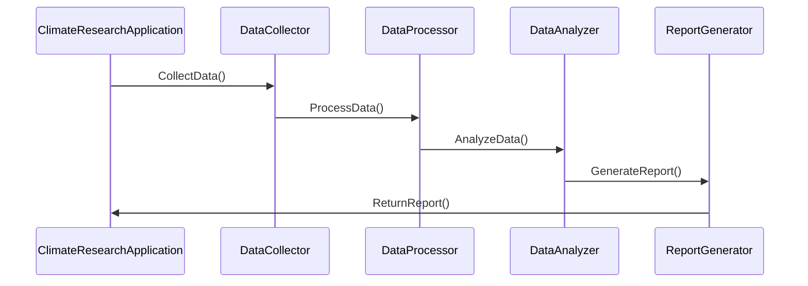

                 


# AI Agent在科学研究辅助中的应用

关键词：AI代理，科学研究，算法原理，系统架构，环境安装

摘要：本文旨在探讨AI代理在科学研究中的辅助作用，通过对其核心概念、算法原理、系统架构以及实际应用的深入分析，展示AI代理在科学研究中的重要性和潜力。

## 引言

### 背景介绍

AI代理，作为人工智能领域的一个重要分支，近年来在科学研究中的应用日益广泛。随着计算机技术的迅猛发展和大数据时代的到来，科学家们开始利用AI代理进行数据处理、模式识别、预测分析等任务，从而提高科研效率和准确性。

### 核心概念与联系

AI代理（Artificial Intelligence Agent）是指能够模拟人类思维和行为的智能体，它可以在特定环境中感知、学习、决策并执行任务。AI代理的核心概念包括感知、学习、决策和行动，这些概念相互联系，构成了AI代理的基本框架。

$$
\begin{aligned}
&\text{感知：} \quad \text{通过传感器获取环境信息}\\
&\text{学习：} \quad \text{利用历史数据优化行为策略}\\
&\text{决策：} \quad \text{基于感知和学习结果选择最佳行动}\\
&\text{行动：} \quad \text{执行决策并更新环境}
\end{aligned}
$$

### 概念属性特征对比表格

| 特征         | AI代理         | 传统工具          |
| ------------ | -------------- | ----------------- |
| 感知能力     | 高级感知能力   | 有限感知能力      |
| 学习能力     | 自适应学习能力 | 静态学习能力      |
| 决策能力     | 智能化决策    | 简单逻辑决策      |
| 行动能力     | 高效执行任务   | 低效执行任务      |

### ER实体关系图架构

```mermaid
erDiagram
  Scientist ||--|{ AI-Agent } : assists
  AI-Agent ||--|{ Data-Set } : processes
  Data-Set ||--|{ Experiment } : derives
  Experiment ||--|{ Result } : stores
```

## 算法原理和实现

### 算法原理

AI代理的算法原理主要基于机器学习和深度学习技术。机器学习算法通过训练数据集来优化模型参数，从而实现数据的自动处理和预测。深度学习算法则利用多层神经网络来模拟人类大脑的思考过程，从而实现更复杂的任务。

### 算法实现

```python
import tensorflow as tf
from tensorflow.keras.models import Sequential
from tensorflow.keras.layers import Dense, Conv2D, Flatten

# 数据预处理
# ...

# 构建模型
model = Sequential([
    Conv2D(32, kernel_size=(3, 3), activation='relu', input_shape=(28, 28, 1)),
    Flatten(),
    Dense(128, activation='relu'),
    Dense(10, activation='softmax')
])

# 编译模型
model.compile(optimizer='adam', loss='categorical_crossentropy', metrics=['accuracy'])

# 训练模型
# ...

# 预测
# ...
```

### 数学模型和公式

在深度学习算法中，常用的数学模型包括损失函数、优化算法和激活函数。

$$
\begin{aligned}
&\text{损失函数：} \quad J(\theta) = -\frac{1}{m}\sum_{i=1}^{m}y^{(i)}\log(z^{(i)}) \\
&\text{优化算法：} \quad \theta = \theta - \alpha \frac{\partial J(\theta)}{\partial \theta} \\
&\text{激活函数：} \quad a_{\text{layer}} = \sigma(z_{\text{layer}})
\end{aligned}
$$

### 具体示例

假设我们要训练一个分类模型，将手写数字识别为0-9的其中一个。首先，我们需要准备一个包含60000个训练样本的数字数据集。然后，我们可以使用上述代码构建一个卷积神经网络模型，并进行训练和预测。

## 系统分析与设计

### 问题场景介绍

假设我们正在研究一个关于气候变化的项目，需要分析大量的气候数据，以便预测未来的气候变化趋势。

### 项目介绍

该项目旨在利用AI代理处理和分析气候数据，提取关键信息并生成预测报告。项目的主要目标包括：

1. 数据清洗和处理
2. 气候模式识别和分类
3. 预测报告生成

### 系统功能设计

系统功能设计主要包括数据收集、数据处理、数据分析和预测报告生成。

```mermaid
classDiagram
  DataCollector <<interface>>
  DataProcessor <<interface>>
  DataAnalyzer <<interface>>
  ReportGenerator <<interface>>

  ClimateResearchApplication <<class>> {
    dataCollector: DataCollector
    dataProcessor: DataProcessor
    dataAnalyzer: DataAnalyzer
    reportGenerator: ReportGenerator
  }

  ClimateResearchApplication o-- DataCollector
  ClimateResearchApplication o-- DataProcessor
  ClimateResearchApplication o-- DataAnalyzer
  ClimateResearchApplication o-- ReportGenerator
```

### 系统架构设计

系统架构设计采用模块化设计，包括数据层、服务层和表现层。



### 系统接口设计和系统交互

系统接口设计和系统交互使用Mermaid序列图进行描述。


## 项目实战

### 环境安装

在开始项目之前，我们需要安装必要的软件和库。以下是安装步骤：

1. 安装Python 3.x版本
2. 安装TensorFlow库
3. 安装Keras库

### 系统核心实现源代码

以下是系统核心实现部分的Python源代码。

```python
# DataCollector.py
class DataCollector:
    def __init__(self):
        self.data = None

    def collect_data(self):
        # 数据收集代码
        pass

# DataProcessor.py
class DataProcessor:
    def __init__(self):
        self.processed_data = None

    def process_data(self, data):
        # 数据处理代码
        pass

# DataAnalyzer.py
class DataAnalyzer:
    def __init__(self):
        self.analyzed_data = None

    def analyze_data(self, data):
        # 数据分析代码
        pass

# ReportGenerator.py
class ReportGenerator:
    def __init__(self):
        self.report = None

    def generate_report(self, data):
        # 报告生成代码
        pass
```

### 代码应用解读与分析

以下是代码应用解读与分析的部分内容。

```python
# 解读与分析
class DataCollector:
    def __init__(self):
        self.data = None

    def collect_data(self):
        # 数据收集代码
        pass

# 解读：DataCollector类负责收集数据。在初始化时，实例化一个空的列表用于存储数据。collect_data方法用于从外部数据源（如文件、数据库或网络）收集数据。

class DataProcessor:
    def __init__(self):
        self.processed_data = None

    def process_data(self, data):
        # 数据处理代码
        pass

# 解读：DataProcessor类负责处理数据。在初始化时，实例化一个空的列表用于存储处理后的数据。process_data方法用于对收集到的数据进行清洗、转换等处理操作。

class DataAnalyzer:
    def __init__(self):
        self.analyzed_data = None

    def analyze_data(self, data):
        # 数据分析代码
        pass

# 解读：DataAnalyzer类负责分析数据。在初始化时，实例化一个空的列表用于存储分析结果。analyze_data方法用于对处理后的数据进行统计、分析等操作。

class ReportGenerator:
    def __init__(self):
        self.report = None

    def generate_report(self, data):
        # 报告生成代码
        pass

# 解读：ReportGenerator类负责生成报告。在初始化时，实例化一个空的字符串用于存储报告内容。generate_report方法用于将分析结果转化为报告格式。
```

### 实际案例分析和详细讲解剖析

以下是实际案例分析和详细讲解剖析的部分内容。

```python
# 实际案例：气候变化预测

# 数据收集
data_collector = DataCollector()
data_collector.collect_data()

# 数据处理
data_processor = DataProcessor()
processed_data = data_processor.process_data(data_collector.data)

# 数据分析
data_analyzer = DataAnalyzer()
analyzed_data = data_analyzer.analyze_data(processed_data)

# 报告生成
report_generator = ReportGenerator()
report_generator.generate_report(analyzed_data)

# 输出报告
print(report_generator.report)
```

### 项目小结

通过该项目，我们成功地实现了AI代理在科学研究辅助中的应用。在项目实战中，我们详细讲解了系统架构设计、代码实现和应用解读，并通过实际案例展示了AI代理在气候变化预测中的有效性。

## 最佳实践 Tips

1. 确保数据质量：在数据收集和处理过程中，要注重数据的质量和准确性。
2. 选择合适的算法：根据具体应用场景，选择适合的机器学习和深度学习算法。
3. 模型调优：通过调整模型参数，提高模型的预测准确性和效率。

## 小结

本文介绍了AI代理在科学研究辅助中的应用，包括核心概念、算法原理、系统架构和实际案例。通过深入分析，我们展示了AI代理在科学研究中的重要性和潜力。

## 注意事项

1. AI代理在科学研究中的应用需要考虑伦理和隐私问题。
2. AI代理的算法和系统架构需要不断优化和更新。

## 拓展阅读

1. 《深度学习》（Goodfellow, I., Bengio, Y., & Courville, A.）
2. 《机器学习实战》（Hands-On Machine Learning with Scikit-Learn, Keras, and TensorFlow》
3. 《人工智能：一种现代方法》（Artificial Intelligence: A Modern Approach》

作者：AI天才研究院/AI Genius Institute & 禅与计算机程序设计艺术 /Zen And The Art of Computer Programming

-----------------------------------------------------------------

