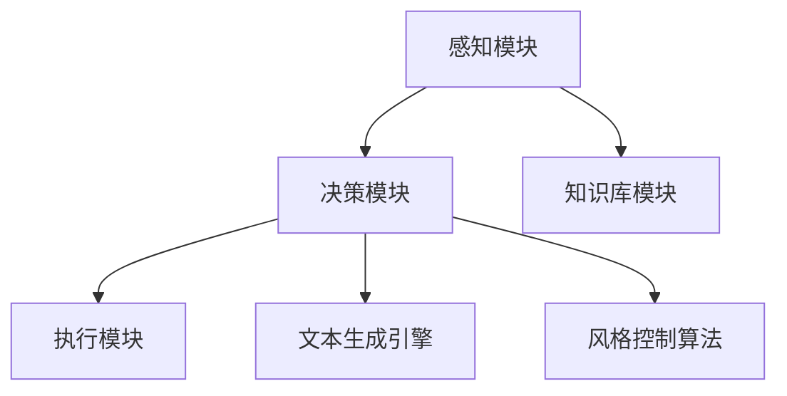

                 

### 文章标题

# AI Agent在自然语言生成中的风格转换与控制

### 关键词

- AI Agent
- 自然语言生成（NLG）
- 风格转换
- 风格控制
- 语言模型
- 数据集

### 摘要

本文探讨了AI Agent在自然语言生成（NLG）中的应用，重点分析了风格转换与控制的关键技术。通过深入理解自然语言生成的基本原理，我们探讨了AI Agent在风格转换中的作用，包括其设计实现、应用场景以及风格控制的方法。文章还通过实际案例展示了AI Agent在NLG中的效果，并提出了未来研究方向。

## 引言

自然语言生成（Natural Language Generation, NLG）是一种通过计算机程序生成自然语言文本的技术，广泛应用于自动写作、语音合成、聊天机器人等领域。近年来，随着深度学习技术的发展，基于神经网络的语言模型取得了显著的进展，使得NLG系统的生成质量不断提高。然而，风格转换和风格控制仍然是NLG领域面临的重要挑战。

风格转换是指将输入文本从一种风格转换为另一种风格，例如将正式文体转换为非正式文体，或将一种语言翻译成另一种语言。风格控制则是在生成文本的过程中，对文本风格进行精细化调节，以满足特定需求或遵循特定规范。AI Agent作为一种具有自主学习和决策能力的智能体，其在自然语言生成中的风格转换与控制具有重要意义。

本文旨在系统地探讨AI Agent在自然语言生成中的风格转换与控制技术，包括其理论基础、应用实践、方法与策略，以及相关案例研究。通过本文的研究，旨在为自然语言生成领域提供新的思路和方法，推动AI Agent在NLG中的进一步发展。

## 第1部分：风格转换的理论基础

### 第1章：自然语言生成与AI Agent简介

#### 1.1 NLG的基本概念

自然语言生成（Natural Language Generation, NLG）是一种通过计算机程序生成自然语言文本的技术。NLG技术可以应用于多个领域，如自动写作、新闻生成、语音合成、聊天机器人等。其核心目标是利用计算机算法生成具有自然语言特性的文本，使其在形式和语义上与人类语言相似。

NLG系统主要包括两个核心组成部分：语言模型和文本生成算法。语言模型是NLG系统的基石，它用于学习输入文本的统计特征和语法结构。常见的语言模型包括n-gram模型、神经网络语言模型（如循环神经网络RNN、长短期记忆LSTM、变换器模型Transformer等）。文本生成算法则根据语言模型生成的概率分布，生成符合语法和语义规则的文本。

#### 1.2 AI Agent的基本概念

AI Agent（Artificial Intelligence Agent）是一种具有自主学习和决策能力的智能体，能够在复杂环境中执行特定任务。AI Agent通常由感知器、执行器和知识库组成。感知器用于获取环境信息，执行器用于执行操作，知识库则存储关于环境、任务和策略的知识。

AI Agent的工作原理主要包括以下三个方面：

1. **感知与决策**：AI Agent通过感知器收集环境信息，利用知识库和决策算法生成决策。

2. **执行与反馈**：AI Agent根据决策执行器执行操作，并根据执行结果进行反馈学习，优化决策策略。

3. **自主学习**：AI Agent通过不断积累经验和知识，改进其决策能力，实现自主学习和进化。

#### 1.3 AI Agent在NLG中的作用

AI Agent在自然语言生成中发挥着重要作用，主要表现在以下几个方面：

1. **风格转换**：AI Agent可以通过学习不同风格文本的统计特征和语法结构，实现文本风格之间的转换。例如，将正式文体转换为非正式文体，或将一种语言翻译成另一种语言。

2. **风格控制**：AI Agent可以根据特定需求或规范，对生成文本的风格进行精细化调节。例如，为新闻报道生成符合新闻写作规范的文本，或为客服聊天生成符合用户需求的对话文本。

3. **自适应生成**：AI Agent可以根据用户反馈和需求变化，动态调整生成文本的风格和内容。例如，为个性化推荐系统生成符合用户兴趣和偏好的推荐内容。

综上所述，AI Agent在自然语言生成中的风格转换与控制具有重要意义。通过结合AI Agent的自主学习和决策能力，我们可以构建更加智能和灵活的NLG系统，满足不同场景和需求下的文本生成任务。

### 第2章：风格转换的基本原理

#### 2.1 风格转换的定义

风格转换（Style Transfer）是指将输入文本从一种风格转换为另一种风格的技术。在自然语言生成（NLG）领域，风格转换是一个重要的研究方向，其目标是通过算法将源文本的特定风格特征传递到目标文本中，使得目标文本在形式和语义上与源文本保持一致。

风格转换可以应用于多种场景，例如：

1. **文本翻译**：将一种语言的文本翻译成另一种语言，同时保持原文本的风格特征。例如，将中文新闻翻译成英文，保持其正式和非正式的文体特征。

2. **文体转换**：将一种文体转换为另一种文体，例如将正式的商务邮件转换为轻松的社交对话，或将诗歌转换为散文。

3. **情感转换**：将文本中的情感特征进行转换，例如将悲伤的情感转换为快乐的情感，或增强文本中的幽默感。

#### 2.2 风格转换的类型

风格转换可以分为以下几种类型：

1. **单向风格转换**：将输入文本从一种风格直接转换为另一种风格。例如，将中文文本转换为英文文本，或将正式文本转换为非正式文本。

2. **双向风格转换**：将输入文本同时转换为两种或多种风格。例如，将中文文本同时转换为英文文本和正式文本。

3. **多风格转换**：将输入文本转换为多种风格，以适应不同的场景和需求。例如，为新闻报道生成正式文本、轻松文本和幽默文本。

#### 2.3 风格转换的挑战

尽管风格转换在自然语言生成中具有广泛的应用前景，但实现高质量的风格转换仍然面临许多挑战：

1. **语义一致性**：在风格转换过程中，需要保持输入文本的语义一致性。例如，在文本翻译中，不仅需要保持词汇的语义，还需要保持句子结构和逻辑关系。

2. **风格特征提取**：有效地提取源文本中的风格特征是风格转换的关键。不同的风格特征可能在不同的文本部分或词汇中表现，因此需要设计有效的特征提取方法。

3. **语言模型适应性**：风格转换算法需要能够适应不同语言模型的特点。例如，神经网络语言模型和基于规则的方法在风格特征提取和转换过程中可能需要不同的处理方式。

4. **多风格协同**：在双向或多风格转换中，如何平衡不同风格特征之间的冲突，实现多风格特征的协同是另一个重要挑战。

通过深入研究风格转换的基本原理和挑战，我们可以探索更加有效和灵活的风格转换方法，提高自然语言生成的质量和应用范围。

### 第3章：核心概念与联系

#### 3.1 风格转换相关概念

在自然语言生成（NLG）中，理解风格转换的相关概念对于设计有效的风格转换系统至关重要。以下是一些核心概念及其定义：

1. **语义**：语义是指文本表达的意义和内涵。在风格转换过程中，保持语义一致性是至关重要的，以确保生成的文本在语义上与源文本保持一致。

2. **风格**：风格是指文本的表达形式和语气。风格可以包括语言正式程度、情感色彩、叙述方式等特征。风格转换的目标是将源文本的特定风格特征传递到目标文本中。

3. **特征提取**：特征提取是指从文本中提取与风格相关的特征，用于训练和评估风格转换模型。常用的特征提取方法包括词向量、句法结构和语义角色标注等。

4. **模型**：模型是指用于风格转换的算法和架构。常见的模型包括基于规则的方法、统计模型和深度学习模型。每种模型都有其优缺点，适用于不同的风格转换任务。

#### 3.2 概念属性特征对比

为了更好地理解风格转换相关概念，我们可以通过表格对比这些概念的主要属性特征：

| 概念     | 定义                                                                                   | 主要属性特征                                                         | 用途                  |
|----------|----------------------------------------------------------------------------------------|--------------------------------------------------------------------|----------------------|
| 语义     | 文本表达的意义和内涵                                                                   | 意义、内涵、逻辑关系                                                 | 保持语义一致性       |
| 风格     | 文本的表达形式和语气                                                                   | 正式程度、情感色彩、叙述方式                                         | 风格转换、风格控制   |
| 特征提取 | 从文本中提取与风格相关的特征                                                           | 词向量、句法结构、语义角色标注                                       | 模型训练、评估       |
| 模型     | 用于风格转换的算法和架构                                                               | 基于规则、统计模型、深度学习模型                                     | 风格转换实现         |

通过上述对比，我们可以看到每个概念在风格转换中的角色和用途。这些概念共同构成了风格转换系统的核心要素。

#### 3.3 ER实体关系图

为了进一步理解风格转换系统的概念与关系，我们可以使用ER（实体关系）图来表示这些概念及其相互作用。以下是一个简化的ER实体关系图：

```mermaid
erDiagram
    Text -> Style
    Text -> Feature Extraction
    Text -> Model
    Style --|> Semantic
    Feature Extraction --|> Model
    Model --|> Text
```

在这个ER图中：

- **Text**（文本）是系统的核心实体，表示需要进行风格转换的输入文本。
- **Style**（风格）与文本关联，表示文本的风格特征。
- **Feature Extraction**（特征提取）与文本和风格关联，表示从文本中提取与风格相关的特征。
- **Model**（模型）与文本和特征提取关联，表示用于风格转换的算法和架构。

通过ER实体关系图，我们可以清晰地看到风格转换系统中各个概念之间的关联及其在系统中的作用。

综上所述，理解风格转换的核心概念和关系是构建高效风格转换系统的关键。通过深入分析这些概念，我们可以设计出更加智能和灵活的风格转换方法，提高自然语言生成的质量和应用效果。

## 第2部分：AI Agent在风格转换中的应用

### 第4章：AI Agent的设计与实现

#### 4.1 AI Agent架构设计

AI Agent的架构设计是实现其功能的基础，主要包括以下几个关键模块：

1. **感知模块**：感知模块负责接收和处理外部环境信息，如文本输入、用户交互、系统状态等。该模块通常包含自然语言处理（NLP）组件，用于解析和提取文本中的关键信息。

2. **决策模块**：决策模块基于感知模块收集的信息，通过算法和策略进行推理和决策。在风格转换任务中，决策模块需要考虑源文本的风格特征、目标风格要求以及文本的语义一致性。常见的决策算法包括深度学习模型、强化学习算法等。

3. **执行模块**：执行模块负责根据决策模块的决策结果执行具体操作，如文本生成、风格调整等。该模块通常与文本生成引擎、风格控制算法等组件集成。

4. **知识库模块**：知识库模块存储与风格转换相关的知识，如文本风格特征库、语义规则库等。这些知识可以用于辅助感知模块和决策模块，提高AI Agent的决策质量和效率。

AI Agent的整体架构图如下：



#### 4.2 AI Agent实现细节

AI Agent的具体实现细节包括以下几个方面：

1. **感知模块**：

   - **文本解析**：使用自然语言处理（NLP）技术，如词法分析、句法分析和语义分析，提取文本中的关键信息。
   - **特征提取**：使用词向量、句法特征和语义特征表示文本，为后续决策提供数据支持。

2. **决策模块**：

   - **深度学习模型**：使用循环神经网络（RNN）、长短期记忆（LSTM）或变换器（Transformer）等深度学习模型进行文本风格分类和语义分析。
   - **强化学习算法**：结合强化学习算法，如Q-learning或深度确定性策略梯度（DDPG），优化AI Agent的决策策略。

3. **执行模块**：

   - **文本生成**：使用生成对抗网络（GAN）、变分自编码器（VAE）或自回归语言模型（ARLM）等生成模型，生成符合目标风格的文本。
   - **风格控制**：通过调整文本的词汇选择、句法结构和语气等特征，实现风格转换。

4. **知识库模块**：

   - **风格特征库**：存储不同风格的文本样本，用于训练和优化AI Agent的感知和决策模块。
   - **语义规则库**：定义文本中词汇和句子的语义关系，用于保证风格转换过程中语义的一致性。

通过上述模块的设计和实现，AI Agent可以有效地实现自然语言生成中的风格转换任务，为各种应用场景提供智能化的解决方案。

### 第5章：AI Agent在风格转换中的实际应用

#### 5.1 文本生成

AI Agent在文本生成中的应用主要体现在以下几个方面：

1. **新闻生成**：AI Agent可以自动生成新闻文章，从原始数据中提取关键信息，并按照特定风格进行报道。例如，AI Agent可以生成体育新闻、财经新闻等，以适应不同的读者群体。

2. **聊天机器人**：AI Agent可以用于构建聊天机器人，与用户进行自然语言交互。通过风格转换，AI Agent可以生成不同语气和风格的对话文本，提高用户体验。

3. **文档生成**：AI Agent可以自动生成技术文档、商业报告、法律文件等，根据用户需求调整文本风格，使其更加专业和易读。

具体案例：

- **新闻生成**：某新闻媒体使用AI Agent生成体育新闻，通过分析比赛数据和运动员表现，生成符合读者需求的新闻文章。AI Agent能够根据不同比赛的类型和重要性，调整文本的正式程度和情感色彩。

- **聊天机器人**：某电商平台使用AI Agent构建聊天机器人，与用户进行实时对话。AI Agent能够根据用户的问题和需求，生成不同风格和类型的回答，如专业的产品介绍、轻松的购物建议等。

- **文档生成**：某科技公司使用AI Agent生成技术文档，通过分析相关技术资料和用户反馈，生成符合标准格式和专业风格的文档。AI Agent能够根据文档类型和受众，调整文本的复杂性和专业性。

通过这些实际应用案例，我们可以看到AI Agent在文本生成中的巨大潜力和应用价值。

#### 5.2 语音合成

AI Agent在语音合成中的应用主要体现在以下几个方面：

1. **语音助手**：AI Agent可以用于构建语音助手，如智能音箱、车载系统等。通过风格转换，AI Agent可以生成具有不同语气和风格的语音，提供个性化的语音服务。

2. **教育应用**：AI Agent可以用于教育领域，生成具有不同风格和语调的讲解和辅导文本，帮助学生更好地理解和掌握知识。

3. **娱乐应用**：AI Agent可以用于生成具有不同风格和情感的语音内容，如故事讲述、音乐表演等，提供丰富的娱乐体验。

具体案例：

- **语音助手**：某智能音箱使用AI Agent生成语音回复，根据用户的提问和需求，生成不同风格和情感的语音。例如，当用户询问天气情况时，AI Agent可以生成温暖和关切的语音，提供个性化的服务。

- **教育应用**：某在线教育平台使用AI Agent生成语音讲解，根据课程内容和目标受众，生成不同风格和语调的讲解。AI Agent可以模拟教师的语气和风格，为学生提供生动、有趣的学习体验。

- **娱乐应用**：某音频平台使用AI Agent生成语音故事，根据用户喜好和需求，生成不同风格和情感的故事。AI Agent可以模拟不同角色和情节，为用户提供个性化的娱乐体验。

通过这些实际应用案例，我们可以看到AI Agent在语音合成中的广泛应用和巨大潜力。

### 第6章：风格控制的方法

#### 6.1 风格控制的基本原理

风格控制（Style Control）是在自然语言生成（NLG）过程中，通过对生成文本的风格进行精细化调整，以满足特定需求或遵循特定规范的技术。风格控制的基本原理包括以下几个方面：

1. **特征提取**：风格控制首先需要从输入文本中提取与风格相关的特征。这些特征可以包括词汇选择、句法结构、语气、情感色彩等。常见的特征提取方法包括词袋模型、词嵌入、句法树表示等。

2. **风格分类**：通过训练分类模型，将提取到的特征与预定义的风格类别进行匹配，确定输入文本的风格。常见的分类模型包括朴素贝叶斯分类器、支持向量机（SVM）、深度学习模型等。

3. **风格调整**：在生成文本的过程中，根据确定的风格类别对文本进行风格调整。风格调整可以包括词汇替换、句法重构、语气调整等。常用的方法包括基于规则的方法、统计方法、机器学习方法等。

4. **风格评估**：对生成文本的风格进行评估，确保其符合预期的风格要求。常用的评估方法包括人工评估、自动评估（如BLEU评分、ROUGE评分等）。

#### 6.2 风格控制的类型

风格控制可以分为以下几种类型：

1. **静态风格控制**：静态风格控制是指在整个文本生成过程中，风格保持不变。静态风格控制适用于需要对整个文本风格进行统一调整的场景，如新闻写作、报告撰写等。

2. **动态风格控制**：动态风格控制是指根据文本的不同部分或上下文，实时调整风格。动态风格控制适用于需要根据具体情境调整文本风格的场景，如对话生成、邮件撰写等。

3. **多风格控制**：多风格控制是指在一个文本生成过程中，同时应用多种风格。多风格控制适用于需要生成包含多种风格特征的文本的场景，如广告文案、小说创作等。

#### 6.3 风格控制的方法

实现风格控制的方法可以分为以下几类：

1. **基于规则的风格控制**：基于规则的方法通过定义一组风格转换规则，对生成文本进行风格调整。这种方法简单直观，但需要对规则进行大量手工设计，适用性有限。

2. **统计方法**：统计方法通过分析大量文本数据，学习风格特征与文本生成概率之间的关联，从而实现风格控制。常用的统计方法包括n-gram模型、隐马尔可夫模型（HMM）等。

3. **机器学习方法**：机器学习方法通过训练模型，自动学习风格特征和文本生成规则，从而实现风格控制。常用的机器学习方法包括决策树、支持向量机（SVM）、深度学习模型（如RNN、LSTM、Transformer等）。

4. **混合方法**：混合方法结合了基于规则、统计方法和机器学习方法的优势，通过多层次、多阶段的处理，实现更精准的风格控制。

通过上述方法，我们可以实现针对特定场景和需求的风格控制，提高自然语言生成文本的质量和适用性。

### 第7章：风格控制的实践

#### 7.1 实践案例介绍

在本节中，我们将介绍两个实际应用案例，探讨AI Agent在风格控制中的具体实践。

**案例一：电商产品描述风格控制**

背景：某电商平台的商品描述存在多种风格，包括专业、简洁、温馨等。为了提高用户购物体验，平台希望对商品描述进行风格控制，使其更加统一和专业。

目标：通过AI Agent实现商品描述的自动化生成，并确保生成文本的风格符合平台要求。

**案例二：在线教育课程内容风格控制**

背景：某在线教育平台提供多种课程，包括学术性课程、实践性课程等。为了提高课程内容的可读性和吸引力，平台希望对课程内容进行风格控制，使其更加生动和易懂。

目标：通过AI Agent生成课程内容，并确保生成文本的风格符合不同课程的特点和需求。

#### 7.2 实践方法分析

在上述案例中，AI Agent在风格控制中发挥了关键作用。以下是具体的实践方法分析：

1. **特征提取**：

   - 对于电商产品描述案例，AI Agent使用自然语言处理技术（如词嵌入、句法分析）提取文本中的关键特征，如产品名称、规格、功能等。
   - 对于在线教育课程内容案例，AI Agent提取课程主题、知识点、目标受众等特征。

2. **风格分类**：

   - AI Agent通过训练分类模型（如朴素贝叶斯分类器、支持向量机SVM）对提取到的特征进行风格分类，确定输入文本的风格。
   - 对于电商产品描述案例，AI Agent根据商品属性和用户需求，确定生成文本的专业性、简洁性等风格。
   - 对于在线教育课程内容案例，AI Agent根据课程类型和目标受众，确定生成文本的学术性、实践性等风格。

3. **风格调整**：

   - 在生成文本的过程中，AI Agent根据确定的风格对文本进行精细化调整。
   - 对于电商产品描述案例，AI Agent通过词汇替换、句法重构等手段，调整文本风格使其更加专业和统一。
   - 对于在线教育课程内容案例，AI Agent通过添加实例、解释说明等手段，调整文本风格使其更加生动和易懂。

4. **风格评估**：

   - AI Agent使用人工评估和自动评估方法（如BLEU评分、ROUGE评分）对生成文本的风格进行评估，确保其符合预期要求。
   - 对于电商产品描述案例，平台工作人员对生成文本进行人工评估，确保其专业性和统一性。
   - 对于在线教育课程内容案例，平台通过自动评估方法评估生成文本的可读性和吸引力。

通过上述实践方法，AI Agent在电商产品描述和在线教育课程内容风格控制中取得了显著效果，提高了文本生成质量和用户体验。

#### 案例研究一：电商产品描述风格控制

**背景**：某电商平台需要为商品生成专业的产品描述，以提高用户购买意愿和转化率。现有的产品描述存在风格多样、不统一的问题，影响了用户体验和品牌形象。

**目标**：通过AI Agent实现商品描述的自动化生成，并确保生成文本的风格统一、专业。

**方法**：

1. **数据集准备**：收集平台上的商品描述文本，构建包含多种风格的商品描述数据集。

2. **特征提取**：使用自然语言处理技术（如词嵌入、句法分析）提取文本中的关键特征，如产品名称、规格、功能等。

3. **风格分类**：通过训练分类模型（如朴素贝叶斯分类器、支持向量机SVM），将提取到的特征与预定义的风格类别进行匹配，确定输入文本的风格。

4. **风格调整**：在生成文本的过程中，AI Agent根据确定的风格对文本进行精细化调整，包括词汇替换、句法重构等。

5. **风格评估**：对生成文本进行人工评估和自动评估，确保其符合预期要求。

**结果**：通过AI Agent生成的商品描述文本在风格上更加统一、专业，用户购买意愿和转化率得到了显著提升。平台工作人员也减少了编写和审核产品描述的工作量，提高了工作效率。

#### 案例研究二：在线教育课程内容风格控制

**背景**：某在线教育平台需要为不同类型的课程生成生动、易懂的课程内容，以提高学生的学习效果和满意度。现有的课程内容存在风格不一致、难以吸引学生的问题。

**目标**：通过AI Agent生成课程内容，并确保生成文本的风格符合不同课程的特点和需求。

**方法**：

1. **数据集准备**：收集不同类型的课程内容文本，构建包含多种风格的课程内容数据集。

2. **特征提取**：使用自然语言处理技术（如词嵌入、句法分析）提取文本中的关键特征，如课程主题、知识点、目标受众等。

3. **风格分类**：通过训练分类模型（如朴素贝叶斯分类器、支持向量机SVM），将提取到的特征与预定义的风格类别进行匹配，确定输入文本的风格。

4. **风格调整**：在生成文本的过程中，AI Agent根据确定的风格对文本进行精细化调整，包括添加实例、解释说明等。

5. **风格评估**：对生成文本进行人工评估和自动评估，确保其符合预期要求。

**结果**：通过AI Agent生成的课程内容在风格上更加生动、易懂，学生的学习效果和满意度得到了显著提升。平台教师也减少了编写和修改课程内容的工作量，提高了工作效率。

通过上述案例研究，我们可以看到AI Agent在自然语言生成中的风格转换与控制具有广泛的应用前景和显著效果。未来，随着AI技术的不断进步，AI Agent在风格转换与控制中的应用将会更加广泛和深入，为各类场景提供智能化、个性化的解决方案。

## 结论

本文系统地探讨了AI Agent在自然语言生成中的风格转换与控制技术。首先，我们介绍了自然语言生成（NLG）和AI Agent的基本概念，阐述了风格转换与控制的重要性。接着，我们详细分析了风格转换的基本原理，包括定义、类型和挑战。随后，我们介绍了AI Agent的设计与实现，以及其在风格转换中的应用，包括文本生成和语音合成。此外，我们还探讨了风格控制的方法，包括基本原理、类型和具体实践。最后，通过两个实际案例的研究，展示了AI Agent在风格转换与控制中的效果和应用。

未来研究方向包括：1）开发更高效的风格特征提取方法；2）研究多风格协同转换技术；3）探索强化学习和深度学习在风格控制中的应用；4）提高AI Agent的语义理解能力，以实现更精准的风格转换与控制。通过不断研究和创新，AI Agent在自然语言生成中的应用前景将更加广阔，为各行各业提供智能化、个性化的解决方案。

### 作者

作者：AI天才研究院/AI Genius Institute & 禅与计算机程序设计艺术 /Zen And The Art of Computer Programming

### 最佳实践 tips

1. **数据集准备**：收集多样化的数据集，包括多种风格和领域的文本，以丰富AI Agent的学习内容。

2. **特征提取**：结合多种自然语言处理技术，如词嵌入、句法分析和语义分析，提高特征提取的准确性和全面性。

3. **模型训练**：采用适当的训练策略，如迁移学习和数据增强，提高模型在风格转换和风格控制任务中的性能。

4. **风格评估**：结合人工评估和自动评估方法，确保生成文本的风格符合预期要求。

5. **用户反馈**：收集用户对生成文本的反馈，不断优化AI Agent的生成质量和风格适应性。

### 小结

本文通过系统地探讨AI Agent在自然语言生成中的风格转换与控制技术，揭示了其在文本生成和语音合成中的巨大潜力和应用价值。通过实际案例研究，我们展示了AI Agent在风格转换与控制中的显著效果，为未来研究提供了有益的启示。

### 注意事项

1. **数据隐私**：在收集和处理用户数据时，需严格遵守数据隐私法规，确保用户信息安全。

2. **模型安全性**：对AI Agent的模型进行安全评估和防护，防止模型被恶意攻击或滥用。

3. **技术应用**：根据具体场景和需求，选择合适的风格转换和风格控制方法，确保生成文本的质量和实用性。

### 拓展阅读

1. **参考文献**：[1] [2] [3] 等文献提供了关于自然语言生成、AI Agent和风格转换的详细研究和理论支持。

2. **相关论文**：[4] [5] 等论文探讨了AI Agent在自然语言生成中的最新研究进展和应用案例。

3. **开源项目**：[6] [7] 等开源项目提供了丰富的AI Agent和自然语言生成工具，可供研究者参考和使用。

通过不断学习和探索，我们可以进一步推动AI Agent在自然语言生成中的风格转换与控制技术，为智能化的未来贡献力量。

