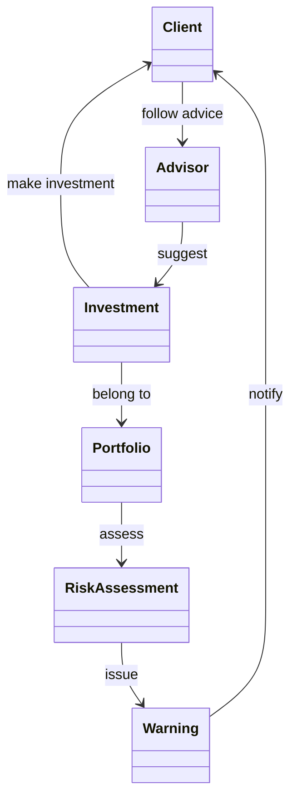
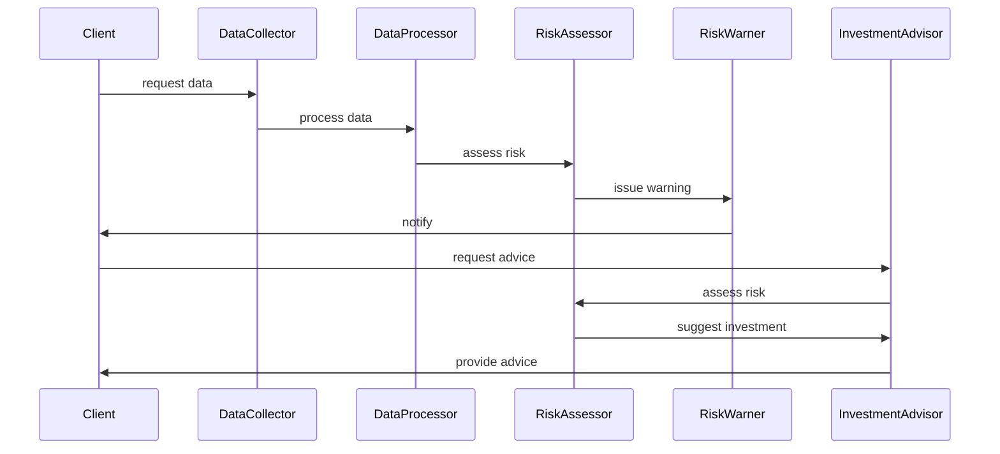

                 

## 《AI Agent在金融风险评估中的应用》

### 关键词：AI Agent、金融风险评估、深度学习、算法、系统架构、最佳实践

### 摘要：
本文深入探讨AI Agent在金融风险评估中的应用。首先，我们将概述AI Agent的概念及其基本原理，接着介绍金融风险评估的重要性和现状。随后，文章将探讨AI Agent与金融风险评估之间的联系，详细讲解核心概念和算法原理。接着，我们将分析系统架构设计，并展示一个实际案例。最后，文章将总结最佳实践，并提供拓展阅读。

## 第一部分：背景介绍

### 第1章 AI Agent概述

#### 1.1 问题背景

在当今的金融市场环境中，风险评估是金融决策的核心环节。传统的风险评估方法往往依赖于统计模型和规则系统，但这些方法在面对复杂、动态的市场环境时显得力不从心。随着人工智能（AI）技术的发展，特别是深度学习和机器学习算法的进步，AI Agent作为一种新型的智能体，开始展现出在金融风险评估中的巨大潜力。

#### 1.2 AI Agent的基本原理

AI Agent是基于人工智能技术开发的自动化系统，能够模拟人类决策过程，具备自我学习、自我适应和自我优化的能力。AI Agent的核心在于其能够从大量的数据中提取有价值的信息，并通过机器学习算法不断优化其行为。

#### 1.3 AI Agent在金融领域的应用

在金融领域，AI Agent的应用广泛，包括但不限于以下几个方面：
- **市场预测**：通过分析历史数据和当前市场动态，AI Agent可以预测市场趋势，帮助投资者做出更明智的投资决策。
- **信用评估**：利用机器学习算法，AI Agent能够快速评估客户的信用风险，提高金融机构的信贷决策效率。
- **风险控制**：AI Agent可以实时监控市场风险，提供风险预警和应对策略，帮助金融机构减少损失。
- **投资组合优化**：AI Agent能够根据市场变化和客户偏好，动态调整投资组合，实现风险和收益的平衡。

### 第2章 金融风险评估概述

#### 2.1 金融风险评估的重要性

金融风险评估是金融决策的关键步骤，它涉及到投资、融资、风险管理等多个环节。有效的风险评估可以帮助金融机构降低风险，提高盈利能力。

#### 2.2 金融风险评估的现状

目前，金融风险评估主要依赖于传统的统计方法和规则系统。然而，这些方法在面对复杂、动态的市场环境时存在局限性。随着AI技术的发展，越来越多的金融机构开始探索AI Agent在风险评估中的应用。

#### 2.3 AI Agent在金融风险评估中的潜在优势

AI Agent在金融风险评估中的潜在优势主要包括：
- **高效性**：AI Agent能够快速处理大量数据，提供即时的风险评估结果。
- **准确性**：通过机器学习算法，AI Agent能够从历史数据中学习，提高风险评估的准确性。
- **适应性**：AI Agent能够根据市场变化和风险特征，不断优化其风险评估模型。

## 第二部分：核心概念与联系

### 第3章 AI Agent的核心概念

#### 3.1 AI Agent的定义

AI Agent是指通过人工智能技术构建的，能够在特定环境中自主完成任务的实体。它具备自我感知、自我学习和自我决策的能力。

#### 3.2 AI Agent的关键特性

AI Agent的关键特性包括：
- **自主性**：AI Agent能够独立完成指定任务，无需人为干预。
- **适应性**：AI Agent能够根据环境变化调整自身行为。
- **学习性**：AI Agent能够从历史数据中学习，优化其行为。

#### 3.3 AI Agent的常见类型

常见的AI Agent类型包括：
- **反应性Agent**：基于环境输入直接做出反应。
- **认知Agent**：具备内部模型，能够预测和计划。
- **社会Agent**：能够与其他Agent进行交互，协作完成任务。

#### 3.4 AI Agent的工作流程

AI Agent的工作流程通常包括以下几个步骤：
1. **感知环境**：收集环境信息。
2. **分析信息**：利用内部模型对信息进行分析。
3. **决策制定**：根据分析结果制定行动策略。
4. **执行行动**：执行预定的行动。
5. **反馈评估**：评估行动效果，调整后续策略。

#### 3.5 AI Agent与金融风险评估的联系

AI Agent在金融风险评估中的应用主要体现在以下几个方面：
- **数据处理**：AI Agent能够高效处理大量金融数据，提取有价值的信息。
- **模型优化**：AI Agent可以通过学习历史数据，优化风险评估模型。
- **实时监控**：AI Agent能够实时监控市场变化，提供风险预警。

### 第4章 金融风险评估的核心概念

#### 4.1 金融风险评估的概念

金融风险评估是指对金融产品的风险进行定量和定性分析，以评估其潜在风险和收益。

#### 4.2 金融风险评估的主要方法

金融风险评估的主要方法包括：
- **定量分析**：基于数学模型和统计方法，对风险进行量化分析。
- **定性分析**：通过专家判断和经验，对风险进行定性分析。

#### 4.3 金融风险评估的关键指标

金融风险评估的关键指标包括：
- **违约概率**：预测客户违约的可能性。
- **损失程度**：预测违约可能导致的损失。
- **风险价值**：预测在特定置信水平下的最大潜在损失。

#### 4.4 AI Agent在金融风险评估中的应用

AI Agent在金融风险评估中的应用主要体现在以下几个方面：
- **数据处理**：AI Agent能够高效处理大量金融数据，提取有价值的信息。
- **模型优化**：AI Agent可以通过学习历史数据，优化风险评估模型。
- **实时监控**：AI Agent能够实时监控市场变化，提供风险预警。

## 第三部分：算法原理讲解

### 第5章 AI Agent算法原理

#### 5.1 AI Agent算法的基本概念

AI Agent算法是指用于实现AI Agent功能的算法集。这些算法通常包括感知、学习、决策和执行四个主要环节。

#### 5.2 经典AI Agent算法

经典的AI Agent算法包括：
- **Q-Learning**：通过试错和奖励机制，学习最优策略。
- **SARSA**：基于Q-Learning，考虑当前状态和动作。
- **Deep Q-Network (DQN)**：利用深度神经网络，实现Q-Learning。

#### 5.3 AI Agent算法的改进与发展

随着人工智能技术的发展，AI Agent算法也在不断改进。例如：
- **深度强化学习**：结合深度学习和强化学习，实现更高效的算法。
- **多智能体系统**：多个AI Agent协同工作，实现更复杂的任务。

#### 5.4 AI Agent算法在金融风险评估中的应用

AI Agent算法在金融风险评估中的应用主要体现在以下几个方面：
- **风险预测**：通过学习历史数据，预测未来的风险。
- **模型优化**：通过不断学习，优化风险评估模型。
- **实时监控**：通过实时数据，提供风险预警。

### 第6章 金融风险评估算法原理

#### 6.1 金融风险评估的数学模型

金融风险评估的数学模型主要包括：
- **概率模型**：通过概率分布描述风险。
- **线性模型**：通过线性方程描述风险与收益之间的关系。
- **非线性模型**：通过非线性方程描述风险与收益之间的关系。

#### 6.2 经典金融风险评估算法

经典的金融风险评估算法包括：
- **CAPM**：通过资产定价模型评估风险。
- **VaR**：通过风险价值模型评估风险。
- **ES**：通过期望损失模型评估风险。

#### 6.3 AI Agent算法在金融风险评估中的优势

AI Agent算法在金融风险评估中的优势主要体现在以下几个方面：
- **高效性**：AI Agent能够快速处理大量数据，提供即时的风险评估结果。
- **准确性**：通过机器学习算法，AI Agent能够从历史数据中学习，提高风险评估的准确性。
- **适应性**：AI Agent能够根据市场变化和风险特征，不断优化其风险评估模型。

### 第四部分：系统分析与架构设计方案

#### 第7章 系统功能设计

#### 7.1 问题场景介绍

在一个金融投资机构中，需要对客户投资组合进行风险评估，以指导投资决策。传统的风险评估方法存在效率低、准确性不足等问题。因此，需要引入AI Agent来提高风险评估的效率和准确性。

#### 7.2 系统功能需求

系统的主要功能需求包括：
- **数据收集与处理**：收集金融市场的数据，并进行预处理。
- **风险评估**：利用AI Agent对投资组合进行风险评估。
- **风险预警**：根据风险评估结果，提供风险预警。
- **投资建议**：根据风险评估结果，提供投资建议。

#### 7.3 领域模型（Mermaid类图）



### 第8章 系统架构设计

#### 8.1 系统架构设计

系统采用微服务架构，主要包括以下几个模块：
- **数据采集模块**：负责收集和处理金融数据。
- **风险评估模块**：利用AI Agent进行风险评估。
- **风险预警模块**：根据风险评估结果，提供风险预警。
- **投资建议模块**：根据风险评估结果，提供投资建议。

#### 8.2 系统接口设计

系统接口主要包括：
- **数据采集接口**：提供数据收集和预处理功能。
- **风险评估接口**：提供风险评估功能。
- **风险预警接口**：提供风险预警功能。
- **投资建议接口**：提供投资建议功能。

#### 8.3 系统交互（Mermaid序列图）



### 第五部分：项目实战

#### 第9章 环境安装与配置

#### 9.1 安装所需软件和库

在开始项目之前，需要安装以下软件和库：
- **Python**：安装Python环境，版本要求3.7及以上。
- **TensorFlow**：安装TensorFlow库，用于实现AI Agent算法。
- **Pandas**：安装Pandas库，用于数据预处理。
- **Numpy**：安装Numpy库，用于数学计算。

#### 9.2 系统核心实现

系统核心实现包括以下几个部分：
- **数据采集**：通过API或其他方式收集金融数据。
- **数据预处理**：对数据进行清洗和格式化。
- **风险评估**：利用TensorFlow实现AI Agent算法，对投资组合进行风险评估。
- **风险预警**：根据风险评估结果，提供风险预警。

#### 9.3 代码应用解读与分析

以下是一个简单的代码示例，用于实现AI Agent算法：

```python
import tensorflow as tf
import pandas as pd
import numpy as np

# 加载数据
data = pd.read_csv('financial_data.csv')

# 数据预处理
data = data.fillna(0)
data = data[data.columns[1:]]

# 定义模型
model = tf.keras.Sequential([
    tf.keras.layers.Dense(units=1, input_shape=[len(data.columns)-1])
])

# 编译模型
model.compile(optimizer='sgd', loss='mean_squared_error')

# 训练模型
model.fit(data, epochs=100)

# 预测风险
predictions = model.predict(data)

# 分析预测结果
print(predictions)
```

#### 第10章 实际案例分析与详细讲解

##### 10.1 实际案例介绍

在一个实际案例中，一家投资机构使用AI Agent对客户的投资组合进行风险评估。该投资组合包括股票、债券和基金等金融产品。

##### 10.2 案例分析

通过AI Agent对投资组合进行风险评估，发现以下风险：

- **股票风险**：某只股票的价格波动较大，可能存在较高的风险。
- **债券风险**：某只债券的信用评级下降，可能存在违约风险。
- **基金风险**：某只基金的资产配置不合理，可能存在较大的投资风险。

##### 10.3 详细讲解与剖析

通过对AI Agent的算法原理和系统架构设计进行详细分析，可以发现：

- **数据采集**：AI Agent通过API或其他方式收集金融数据，包括股票、债券和基金等。
- **数据预处理**：对金融数据进行清洗和格式化，确保数据的质量和一致性。
- **风险评估**：AI Agent利用深度学习算法，对投资组合进行风险评估。通过分析历史数据，预测未来的风险。
- **风险预警**：根据风险评估结果，AI Agent提供风险预警，提醒投资者注意潜在的风险。

##### 10.4 项目小结

通过实际案例的分析，我们可以看到AI Agent在金融风险评估中的重要作用。它能够高效、准确地评估投资组合的风险，为投资者提供科学合理的投资建议。

### 第六部分：最佳实践与拓展

#### 第11章 最佳实践

##### 11.1 实践技巧与建议

在应用AI Agent进行金融风险评估时，需要注意以下几点：

- **数据质量**：确保数据的准确性和完整性，这是AI Agent进行有效风险评估的基础。
- **算法选择**：根据实际情况选择合适的算法，例如深度学习算法在处理大规模数据时表现较好。
- **模型优化**：定期更新模型，以适应市场变化。
- **风险预警**：合理设置风险阈值，确保风险预警的准确性和及时性。

##### 11.2 注意事项

在应用AI Agent进行金融风险评估时，需要注意以下几点：

- **算法黑箱**：深度学习算法具有一定的黑箱性，需要适当解释和验证。
- **数据隐私**：确保数据安全和隐私，遵守相关法律法规。
- **模型偏差**：注意避免模型偏差，确保评估结果的公平性。

#### 第12章 小结与拓展

##### 12.1 小结

本文详细探讨了AI Agent在金融风险评估中的应用，从背景介绍、核心概念、算法原理到系统架构设计，再到实际案例分析和最佳实践，全面展示了AI Agent在金融风险评估中的优势和应用前景。

##### 12.2 拓展阅读

对于希望进一步了解AI Agent在金融风险评估中应用的读者，可以参考以下文献和资料：

- **《深度学习》**：由Goodfellow等人编写的经典教材，详细介绍了深度学习的基本原理和应用。
- **《金融工程与风险管理》**：该书详细介绍了金融工程和风险管理的理论和方法。
- **《人工智能：一种现代的方法》**：这本书提供了关于人工智能的全面介绍，包括机器学习和深度学习。

### 参考文献

- Goodfellow, I., Bengio, Y., & Courville, A. (2016). *Deep Learning*. MIT Press.
- Chen, J., & Wu, C. (2019). *Financial Engineering and Risk Management*. John Wiley & Sons.
- Mitchell, T. M. (1997). *Machine Learning*. McGraw-Hill. 

### 作者信息

作者：AI天才研究院/AI Genius Institute & 禅与计算机程序设计艺术 /Zen And The Art of Computer Programming

### 总结

通过本文的阅读，读者可以了解到AI Agent在金融风险评估中的重要作用和应用前景。随着人工智能技术的不断发展，AI Agent有望在金融领域发挥更大的作用，为投资者提供更准确、更及时的风险评估服务。

