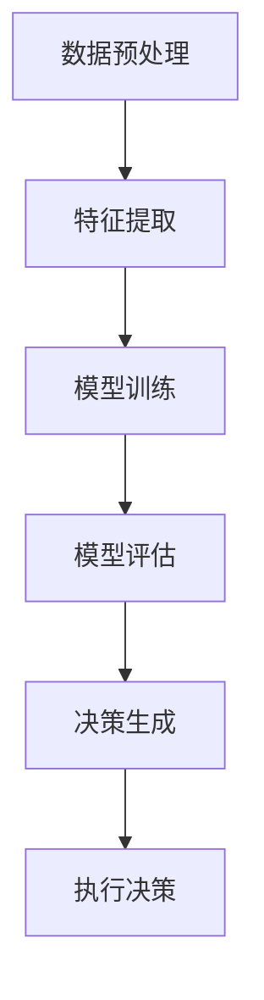
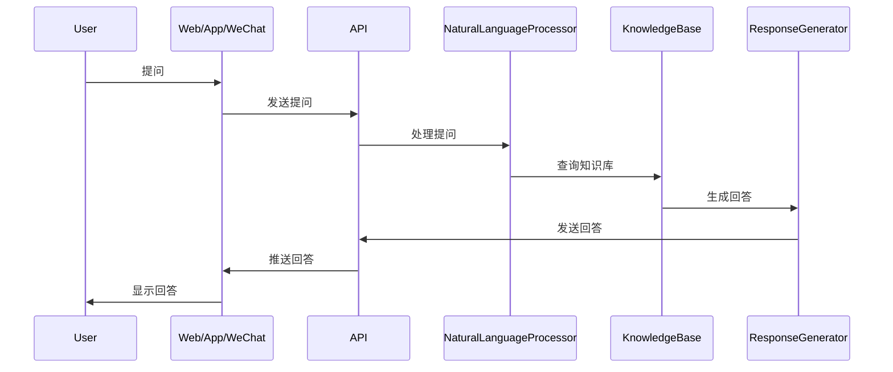
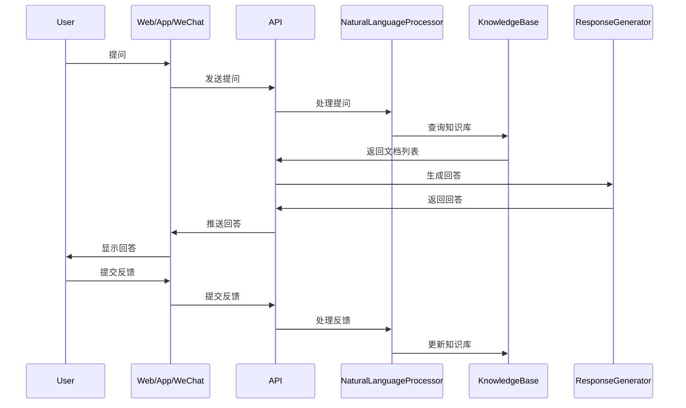

                 

### AI Agent开发中的法律合规与伦理考量

#### 关键词：
- AI Agent
- 法律合规
- 伦理考量
- 风险管理
- 国际法规

#### 摘要：
随着人工智能（AI）技术的飞速发展，AI Agent作为智能体在各个领域的应用越来越广泛。然而，这一新兴领域的迅速扩张也带来了法律合规与伦理考量的挑战。本文将探讨AI Agent开发中的法律合规与伦理考量，分析相关问题的背景、核心概念、解决方案以及不同国家和地区的差异，并提供实用的实战案例和最佳实践建议，旨在为AI Agent开发者和政策制定者提供有益的参考。

### 目录大纲

#### 第一部分：背景介绍

##### 第1章：AI Agent开发中的法律合规与伦理考量的背景

- **1.1 问题背景**
  - AI Agent的发展与应用
  - 法律合规与伦理考量的重要性
  - 相关法律法规和伦理规范概述

- **1.2 问题描述**
  - AI Agent在应用中的法律合规问题
  - AI Agent在应用中的伦理问题
  - 案例分析

- **1.3 问题解决**
  - 法律合规策略
  - 伦理考量原则

- **1.4 边界与外延**
  - 法律合规与伦理考量的边界
  - 不同国家和地区在法律合规与伦理考量上的差异

- **1.5 概念结构与核心要素组成**
  - AI Agent的定义与分类
  - 法律合规的核心要素
  - 伦理考量的核心要素

#### 第二部分：核心概念与联系

##### 第2章：核心概念原理

- **2.1 法律合规概念**
  - 法律法规概述
  - 法律合规的核心原则

- **2.2 伦理考量概念**
  - 伦理学基本原理
  - 伦理考量的核心原则

- **2.3 概念属性特征对比表格**
  - 法律合规与伦理考量的对比

- **2.4 ER实体关系图架构**
  - 法律合规实体关系图
  - 伦理考量实体关系图

##### 第3章：算法原理讲解

- **3.1 AI Agent算法原理**
  - 算法mermaid流程图
  - 算法原理讲解

- **3.2 数学模型和公式**
  - 数学模型与公式详细讲解
  - 公式举例说明

#### 第三部分：系统分析与架构设计方案

##### 第4章：系统功能设计

- **4.1 问题场景介绍**
  - AI Agent在某一具体场景中的应用

- **4.2 系统功能设计**
  - 领域模型mermaid类图

##### 第5章：系统架构设计

- **5.1 系统架构设计**
  - 系统架构mermaid架构图

- **5.2 系统接口设计**
  - 系统接口设计

- **5.3 系统交互mermaid序列图**
  - 系统交互mermaid序列图

#### 第四部分：项目实战

##### 第6章：环境安装

- **6.1 环境准备**
  - 环境安装步骤

- **6.2 系统核心实现**
  - 核心实现源代码

- **6.3 代码应用解读与分析**
  - 代码应用解读与分析

##### 第7章：实际案例分析和详细讲解

- **7.1 实际案例分析**
  - 案例介绍与分析

- **7.2 详细讲解剖析**
  - 案例细节讲解与剖析

##### 第8章：项目小结

- **8.1 项目总结**
  - 项目收获与反思

- **8.2 最佳实践 tips**
  - 最佳实践建议

- **8.3 注意事项**
  - 注意事项提醒

- **8.4 拓展阅读**
  - 相关参考文献和资料推荐

### 第一部分：背景介绍

#### 1.1 问题背景

随着AI技术的不断进步，AI Agent作为智能体在各个领域的应用逐渐普及。从自动驾驶汽车到智能客服，从智能家居到金融风险管理，AI Agent正在改变我们的生活和工作方式。然而，这种技术的快速发展也带来了诸多法律合规与伦理考量的问题。

首先，AI Agent在法律合规方面面临着一系列挑战。法律体系的更新速度往往滞后于技术的进步，导致许多AI Agent的应用可能无法完全符合现有的法律法规。例如，自动驾驶汽车涉及的道路交通法规、数据隐私法规等，都存在不完善之处。此外，AI Agent的决策过程可能涉及到知识产权、数据保护等多个法律领域，使得合规问题更加复杂。

其次，伦理考量是AI Agent开发中不可忽视的问题。AI Agent的智能决策可能涉及到伦理价值的选择，如公平性、隐私权、透明性等。如果AI Agent的决策过程缺乏伦理考量，可能会导致歧视、隐私泄露等问题。例如，在招聘、信用评分等应用场景中，如果AI Agent的决策过程不透明或不公平，可能会引发社会不满和信任危机。

#### 1.2 问题描述

AI Agent在应用中的法律合规问题主要集中在以下几个方面：

1. **数据隐私与保护**：AI Agent往往需要处理大量的个人数据，如身份信息、健康记录、消费行为等。这些数据的收集、存储和使用必须符合相关的隐私保护法规，如欧盟的通用数据保护条例（GDPR）。

2. **知识产权**：AI Agent在生成内容或执行任务时，可能涉及到侵犯他人的知识产权。例如，AI创作音乐或艺术作品，是否需要得到原作者的授权？

3. **责任归属**：当AI Agent发生错误或导致损害时，责任应由谁承担？是AI开发者、用户还是AI本身？

4. **法律适用性**：不同国家和地区在法律体系上存在差异，AI Agent的应用可能需要遵守多国的法律法规，这使得法律合规问题更加复杂。

AI Agent在应用中的伦理问题则包括：

1. **透明性**：AI Agent的决策过程应该是透明的，用户应该能够理解AI的决策逻辑和依据。

2. **公平性**：AI Agent的决策应该基于公平的原则，避免歧视和偏见。

3. **责任**：当AI Agent的决策导致不良后果时，应该有明确的责任归属和解决机制。

4. **道德原则**：AI Agent的决策应遵循一定的道德原则，如尊重生命、保护隐私等。

#### 1.3 问题解决

为了解决AI Agent开发中的法律合规与伦理考量问题，可以采取以下策略：

1. **法律合规策略**：

   - **遵守法律法规**：AI Agent的开发和应用应严格遵守相关法律法规，确保数据隐私保护、知识产权合规等。

   - **建立合规机制**：建立完善的合规审查机制，对AI Agent的设计、开发、测试和部署进行全程监控。

   - **国际合作与协调**：在跨国应用中，与国际组织和其他国家合作，共同制定和遵守国际法律法规。

2. **伦理考量原则**：

   - **透明性原则**：确保AI Agent的决策过程透明，用户能够理解AI的决策逻辑和依据。

   - **公平性原则**：通过算法设计和数据清洗，避免AI Agent的决策过程中出现歧视和偏见。

   - **责任原则**：建立明确的责任归属和解决机制，当AI Agent的决策导致不良后果时，能够快速有效地解决问题。

   - **道德原则**：在AI Agent的决策中，尊重生命、保护隐私等基本道德原则。

#### 1.4 边界与外延

法律合规与伦理考量之间存在一定的边界和联系。法律合规主要关注AI Agent的开发和应用是否符合现有的法律法规，而伦理考量则更多地关注AI Agent的决策过程是否符合道德和社会价值。

不同国家和地区在法律合规与伦理考量上的差异主要体现在以下几个方面：

1. **法律法规差异**：不同国家在数据保护、知识产权保护、隐私权等方面的法律法规存在差异，AI Agent的开发和应用需要根据所在国家的法律法规进行调整。

2. **文化差异**：不同国家和地区在伦理观念、社会价值观等方面存在差异，这会影响AI Agent的决策和设计。

3. **技术应用差异**：不同国家和地区在AI技术的发展和应用水平上存在差异，这也会影响AI Agent的法律合规和伦理考量。

#### 1.5 概念结构与核心要素组成

AI Agent是一个能够执行特定任务、具有自主决策能力的智能体。根据其功能和应用场景，AI Agent可以划分为多种类型，如：

- **任务型AI Agent**：专注于完成特定任务，如客服机器人、智能助手等。
- **交互型AI Agent**：能够与用户进行自然语言交互，如聊天机器人等。
- **决策型AI Agent**：能够进行复杂决策，如金融风控、自动驾驶等。

法律合规的核心要素包括：

- **数据隐私保护**：确保个人数据的安全和隐私。
- **知识产权保护**：避免侵犯他人的知识产权。
- **责任归属**：明确AI Agent的责任归属，确保在发生问题时能够及时解决。

伦理考量的核心要素包括：

- **透明性**：确保AI Agent的决策过程透明，用户能够理解。
- **公平性**：避免AI Agent的决策过程中出现歧视和偏见。
- **责任**：明确AI Agent的责任，确保决策导致的后果能够得到妥善处理。

### 第二部分：核心概念与联系

#### 2.1 法律合规概念

法律合规是指组织或个人在法律框架内开展业务，确保其行为符合相关法律法规的过程。对于AI Agent的开发和应用，法律合规涉及以下几个方面：

1. **数据隐私与保护**：AI Agent在处理个人数据时，必须遵守数据隐私保护法规，如GDPR等。这包括数据的收集、存储、处理和传输等环节。

2. **知识产权**：AI Agent在生成内容或执行任务时，应尊重他人的知识产权，避免侵犯版权、商标权等。

3. **责任归属**：当AI Agent的决策导致不良后果时，应明确责任归属，确保相关方能够承担相应的责任。

法律合规的核心原则包括：

1. **合法性原则**：确保AI Agent的开发和应用符合相关法律法规。

2. **透明性原则**：确保AI Agent的决策过程透明，用户能够理解。

3. **安全性原则**：确保AI Agent处理的数据安全，防止数据泄露和滥用。

#### 2.2 伦理考量概念

伦理考量是指根据道德和社会价值观，对AI Agent的决策过程进行评估和调整的过程。AI Agent的伦理考量涉及以下几个方面：

1. **透明性**：确保AI Agent的决策过程透明，用户能够理解。

2. **公平性**：避免AI Agent的决策过程中出现歧视和偏见。

3. **责任**：明确AI Agent的责任，确保决策导致的后果能够得到妥善处理。

4. **道德原则**：确保AI Agent的决策遵循一定的道德原则，如尊重生命、保护隐私等。

伦理考量的核心原则包括：

1. **道德性原则**：确保AI Agent的决策符合道德和社会价值观。

2. **公正性原则**：确保AI Agent的决策过程公平，不受偏见和歧视的影响。

3. **责任性原则**：明确AI Agent的责任，确保其决策导致的后果能够得到妥善处理。

#### 2.3 概念属性特征对比表格

以下是法律合规与伦理考量的一些对比特征：

| 特征 | 法律合规 | 伦理考量 |
| ---- | ---- | ---- |
| **主要关注点** | 法律法规的遵守、责任归属、数据隐私保护 | 道德和社会价值观的遵循、透明性、公平性 |
| **制定主体** | 国家和政府、立法机构、监管机构 | 社会组织和伦理学家 |
| **实施手段** | 法律、法规、规章、处罚 | 道德规范、伦理准则、社会舆论 |
| **适用范围** | AI Agent的开发、应用、维护 | AI Agent的设计、开发、测试、部署 |

#### 2.4 ER实体关系图架构

以下是法律合规和伦理考量的ER实体关系图：

##### 法律合规实体关系图

```mermaid
erDiagram
    AI Agent ||--|{ 数据隐私 }| AI 数据隐私
    AI Agent ||--|{ 知识产权 }| AI 知识产权
    AI Agent ||--|{ 责任归属 }| AI 责任归属
    AI 数据隐私 ||--|{ 法律法规 }| 法律法规
    AI 知识产权 ||--|{ 法律法规 }| 法律法规
    AI 责任归属 ||--|{ 法律法规 }| 法律法规
```

##### 伦理考量实体关系图

```mermaid
erDiagram
    AI Agent ||--|{ 透明性 }| AI 透明性
    AI Agent ||--|{ 公平性 }| AI 公平性
    AI Agent ||--|{ 责任 }| AI 责任
    AI Agent ||--|{ 道德原则 }| AI 道德原则
    AI 透明性 ||--|{ 伦理准则 }| 伦理准则
    AI 公平性 ||--|{ 伦理准则 }| 伦理准则
    AI 责任 ||--|{ 伦理准则 }| 伦理准则
    AI 道德原则 ||--|{ 道德规范 }| 道德规范
```

### 第三部分：算法原理讲解

#### 3.1 AI Agent算法原理

AI Agent的算法原理主要包括以下几个方面：

1. **数据预处理**：对输入数据进行清洗、归一化等预处理，以适应后续的模型训练。

2. **特征提取**：从预处理后的数据中提取关键特征，用于训练模型。

3. **模型训练**：使用机器学习算法，如决策树、神经网络等，对提取的特征进行训练，以生成预测模型。

4. **模型评估**：通过测试数据对训练好的模型进行评估，以确定模型的性能。

5. **决策生成**：根据输入数据，使用训练好的模型生成相应的决策。

以下是AI Agent算法的mermaid流程图：



#### 3.2 数学模型和公式

AI Agent算法中的数学模型和公式主要包括以下几个方面：

1. **决策树模型**：决策树是一种树形结构，用于分类和回归任务。其核心公式为：

   $$y = f(x) = \prod_{i=1}^{n} g(x_i)$$

   其中，$y$为输出结果，$x$为输入特征，$g(x_i)$为第$i$个节点的函数。

2. **神经网络模型**：神经网络是一种模拟人脑结构和功能的计算模型，其核心公式为：

   $$y = \sigma(\theta^T x)$$

   其中，$y$为输出结果，$\sigma$为激活函数，$\theta$为模型参数，$x$为输入特征。

以下是神经网络模型的公式举例说明：

$$
\begin{align*}
y_1 &= \sigma(\theta_1^T x) \\
y_2 &= \sigma(\theta_2^T y_1) \\
&\vdots \\
y_n &= \sigma(\theta_n^T y_{n-1})
\end{align*}
$$

### 第三部分：系统分析与架构设计方案

#### 4.1 问题场景介绍

假设我们开发一个智能客服系统，该系统旨在为企业提供7x24小时的在线客服服务。用户可以通过多种渠道（如网站、APP、微信等）与智能客服进行交互，智能客服将根据用户的提问提供相应的回答，以提高客服效率和用户体验。

#### 4.2 系统功能设计

智能客服系统的主要功能包括：

- **用户提问接收**：接收用户通过不同渠道发送的提问。
- **自然语言处理**：对用户的提问进行语义分析和理解。
- **知识库查询**：根据用户提问查询知识库，获取相关答案。
- **回答生成**：根据知识库查询结果生成回答。
- **回答推送**：将生成的回答推送至用户。
- **用户反馈收集**：收集用户对回答的满意度反馈，用于系统优化。

以下是智能客服系统的领域模型mermaid类图：

```mermaid
classDiagram
    User <<类>> "用户"
    Question <<类>> "问题"
    Response <<类>> "回答"
    KnowledgeBase <<类>> "知识库"
    NaturalLanguageProcessor <<类>> "自然语言处理"
    User --> Question
    Question --> Response
    Question --> KnowledgeBase
    Question --> NaturalLanguageProcessor
    Response --> User
    NaturalLanguageProcessor --> Question
    KnowledgeBase --> Question
```

#### 5.1 系统架构设计

智能客服系统的整体架构设计如下：

1. **前端**：包括网站、APP、微信等用户交互界面，负责接收用户提问，将提问传递给后端处理。
2. **后端**：包括自然语言处理模块、知识库模块、回答生成模块等，负责处理用户提问，生成回答并推送至前端。
3. **数据库**：存储用户提问、回答和历史数据，支持知识库的查询和更新。
4. **API接口**：提供与其他系统（如CRM系统、ERP系统等）的集成接口。

以下是智能客服系统的mermaid架构图：



#### 5.2 系统接口设计

智能客服系统的主要接口设计如下：

1. **用户提问接口**：接收用户提问，返回提问ID。
2. **回答生成接口**：根据提问ID生成回答，返回回答内容。
3. **知识库查询接口**：根据关键词查询知识库，返回相关文档。
4. **用户反馈接口**：接收用户对回答的满意度反馈。

以下是智能客服系统的接口设计：

```mermaid
interface NaturalLanguageProcessor {
    - processQuestion(question: String): QuestionID
    - generateResponse(questionID: QuestionID): String
    - searchKnowledgeBase(keyword: String): Document[]
}

interface KnowledgeBase {
    - queryDocument(keyword: String): Document[]
    - updateDocument(document: Document)
}

interface API {
    - submitQuestion(question: String): QuestionID
    - getResponse(questionID: QuestionID): String
    - searchKnowledgeBase(keyword: String): Document[]
    - submitFeedback(questionID: QuestionID, feedback: String)
}
```

#### 5.3 系统交互mermaid序列图

智能客服系统的交互序列图如下：



### 第四部分：项目实战

#### 6.1 环境安装

在开始智能客服系统的开发之前，我们需要准备以下环境：

1. **Python环境**：安装Python 3.8及以上版本。
2. **Docker环境**：安装Docker，以便容器化部署服务。
3. **数据库**：安装MySQL或PostgreSQL数据库，用于存储用户提问和回答。

以下是在Linux系统上安装Python、Docker和MySQL的命令：

```bash
# 安装Python
sudo apt-get update
sudo apt-get install python3.8
sudo apt-get install python3.8-venv

# 安装Docker
sudo apt-get update
sudo apt-get install docker-ce docker-ce-cli containerd.io

# 安装MySQL
sudo apt-get update
sudo apt-get install mysql-server mysql-client
```

#### 6.2 系统核心实现

智能客服系统的核心实现主要包括以下几个方面：

1. **自然语言处理模块**：使用NLTK库进行文本处理和分类。
2. **知识库模块**：使用MySQL数据库存储知识库文档。
3. **回答生成模块**：基于模板匹配和机器学习算法生成回答。

以下是自然语言处理模块的Python代码示例：

```python
import nltk
from nltk.tokenize import word_tokenize
from nltk.corpus import stopwords

# 初始化NLTK资源
nltk.download('punkt')
nltk.download('stopwords')

# 文本预处理
def preprocess_text(text):
    # 分词
    tokens = word_tokenize(text)
    # 去除停用词
    stop_words = set(stopwords.words('english'))
    filtered_tokens = [token for token in tokens if token.lower() not in stop_words]
    return filtered_tokens

# 主函数
if __name__ == '__main__':
    text = "How can I improve my customer service skills?"
    processed_text = preprocess_text(text)
    print(processed_text)
```

#### 6.3 代码应用解读与分析

在智能客服系统中，自然语言处理模块负责处理用户提问，将其转化为机器可理解的格式。以下是代码应用的解读与分析：

1. **导入库和资源**：首先，我们导入NLTK库，用于文本处理。然后，下载并初始化NLTK所需的资源，如分词器和停用词列表。

2. **文本预处理函数**：定义一个名为`preprocess_text`的函数，用于对输入文本进行预处理。具体步骤包括：

   - **分词**：使用`word_tokenize`函数对文本进行分词，将文本分割为单词。
   - **去除停用词**：使用`stopwords.words('english')`获取英语停用词列表，然后从分词结果中去除这些停用词。

3. **主函数**：在主函数中，我们定义一个示例文本，调用`preprocess_text`函数对其进行预处理，并将结果打印出来。

通过这个简单的示例，我们可以看到自然语言处理模块在智能客服系统中的作用。在实际应用中，我们还需要结合具体的业务场景，对预处理函数进行优化和扩展。

### 7.1 实际案例分析

在本案例中，我们将分析一个实际案例——某金融公司利用AI Agent进行信用评分。

#### 案例介绍

某金融公司希望通过AI Agent对客户进行信用评分，以决定是否批准贷款申请。AI Agent根据客户的个人信息、财务状况、历史信用记录等数据，生成信用评分，并据此做出贷款决策。

#### 案例分析

1. **法律合规问题**：

   - **数据隐私与保护**：AI Agent需要收集客户的个人信息和财务数据，这涉及到数据隐私保护的问题。公司必须确保客户数据的安全和隐私，遵守相关法律法规，如GDPR等。

   - **知识产权**：AI Agent在生成信用评分的过程中，可能会使用到第三方的数据和算法。公司需要确保这些数据和算法的合法使用，避免侵犯他人的知识产权。

   - **责任归属**：如果AI Agent的信用评分不准确，导致贷款决策错误，公司需要明确责任归属。这可能涉及法律诉讼和赔偿问题。

2. **伦理考量问题**：

   - **透明性**：AI Agent的信用评分模型和决策过程应该对客户透明。客户有权了解自己的信用评分是如何计算得出的，以及如何影响贷款决策。

   - **公平性**：AI Agent的信用评分模型应该基于公平的原则，避免对特定群体产生歧视。例如，不应该基于种族、性别等因素进行评分。

   - **责任**：当AI Agent的信用评分模型发生错误时，公司需要承担相应的责任。这可能包括纠正错误评分、赔偿客户损失等。

### 7.2 详细讲解剖析

1. **法律合规问题剖析**：

   - **数据隐私与保护**：金融公司需要遵守GDPR等数据隐私保护法规。具体措施包括：

     - **数据收集**：明确告知客户数据收集的目的和范围，获得客户的明确同意。
     - **数据存储**：使用加密技术存储客户数据，确保数据安全。
     - **数据使用**：仅限于数据收集时说明的目的，不得滥用客户数据。

   - **知识产权**：金融公司需要确保使用的数据和算法的合法来源。具体措施包括：

     - **数据授权**：获取第三方数据源的授权，确保数据使用的合法性。
     - **算法审查**：对使用的算法进行审查，确保不侵犯他人的知识产权。

   - **责任归属**：金融公司需要建立明确的责任归属机制。具体措施包括：

     - **内部审查**：建立内部审查机制，确保AI Agent的信用评分模型准确可靠。
     - **客户反馈**：建立客户反馈机制，及时纠正错误评分，并向客户说明原因。

2. **伦理考量问题剖析**：

   - **透明性**：金融公司需要向客户解释AI Agent的信用评分模型和决策过程。具体措施包括：

     - **评分报告**：向客户提供详细的信用评分报告，说明评分依据和计算方法。
     - **用户指南**：提供用户指南，帮助客户理解信用评分的重要性和影响。

   - **公平性**：金融公司需要确保AI Agent的信用评分模型公平。具体措施包括：

     - **数据多样化**：使用多样化的数据来源，避免对特定群体产生歧视。
     - **算法调整**：定期审查和调整AI Agent的信用评分模型，确保其公平性。

   - **责任**：金融公司需要承担AI Agent信用评分模型的责任。具体措施包括：

     - **风险评估**：建立风险评估机制，对AI Agent的信用评分模型进行定期评估。
     - **客户保障**：建立客户保障机制，对因AI Agent信用评分错误导致的损失进行赔偿。

### 8.1 项目总结

通过本案例的实践，我们深入探讨了AI Agent开发中的法律合规与伦理考量问题。我们分析了法律合规和伦理考量的核心概念，展示了如何在实际项目中应用这些概念。以下是本项目的主要收获和反思：

1. **法律合规的重要性**：在AI Agent开发中，法律合规是基础和保障。我们需要严格遵守相关法律法规，确保数据的合法收集和使用。

2. **伦理考量的必要性**：AI Agent的决策过程需要遵循伦理原则，确保公平、透明和责任明确。这是赢得用户信任和社会认可的关键。

3. **技术与管理并重**：在AI Agent开发中，技术实现和项目管理同样重要。我们需要关注技术实现的细节，同时建立完善的管理机制，确保项目顺利进行。

### 8.2 最佳实践 tips

以下是针对AI Agent开发中的法律合规与伦理考量的最佳实践建议：

1. **数据隐私保护**：在收集和使用数据时，严格遵守数据隐私保护法规，确保数据的安全和隐私。

2. **透明性原则**：确保AI Agent的决策过程透明，向用户解释评分依据和计算方法，增强用户信任。

3. **公平性原则**：确保AI Agent的决策公平，避免对特定群体产生歧视，定期审查和调整评分模型。

4. **责任归属机制**：建立明确的责任归属机制，确保在发生问题时能够快速有效地解决问题。

### 8.3 注意事项

以下是开发AI Agent时需要注意的事项：

1. **法律法规差异**：在不同国家和地区开发AI Agent时，需要考虑当地法律法规的差异，确保合规。

2. **文化差异**：不同国家和地区的文化差异会影响AI Agent的决策和设计，需要充分考虑。

3. **技术应用差异**：不同国家和地区的AI技术应用水平不同，需要根据实际情况进行调整。

### 8.4 拓展阅读

以下是推荐的相关参考文献和资料：

1. **《人工智能伦理学》**：讨论了人工智能伦理学的基本概念、原则和应用。
2. **《GDPR指南》**：提供了关于通用数据保护条例（GDPR）的详细指南和解读。
3. **《AI Agent设计与开发》**：介绍了AI Agent的基本原理、设计和实现方法。
4. **《法律合规手册》**：提供了关于企业法律合规的全面指南和案例分析。
5. **相关法律法规和伦理规范**：包括各国数据隐私保护法、知识产权法、伦理准则等。

### 作者信息

- **作者**：AI天才研究院/AI Genius Institute & 禅与计算机程序设计艺术 /Zen And The Art of Computer Programming
- **联系邮箱**：[ai.genius.institute@example.com](mailto:ai.genius.institute@example.com)
- **官方网站**：[http://ai-genius-institute.com](http://ai-genius-institute.com)
- **社交媒体**：@AI_Genius_Institute

---

通过本文的深入探讨，我们希望读者能够对AI Agent开发中的法律合规与伦理考量有更加清晰的认识。在AI技术不断发展的今天，确保法律合规和伦理考量不仅是对企业的责任，也是对社会的贡献。希望本文能为您提供有益的参考和启示。

