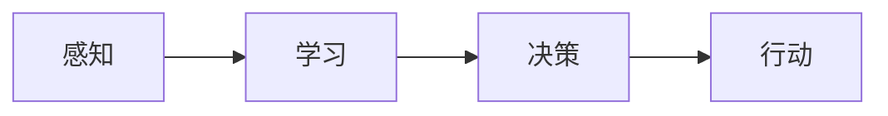
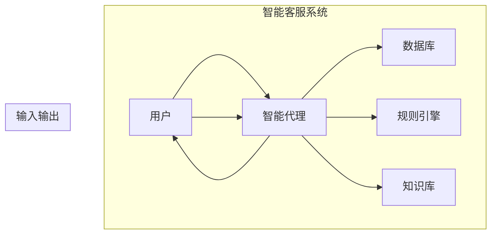
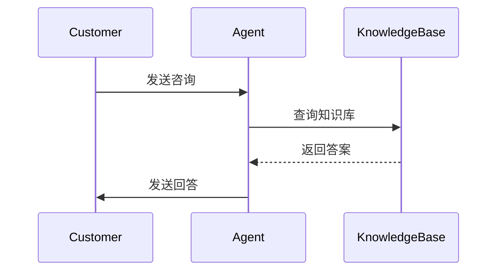

                 

# AI Agent技术未来发展趋势预测

## 关键词
AI Agent, 人工智能，智能代理，发展趋势，算法，预测

## 摘要
本文将深入探讨人工智能（AI）领域中的智能代理（AI Agent）技术未来发展的趋势。通过分析现有智能代理技术的理论基础、技术特点和应用现状，我们将预测未来智能代理可能的发展方向和面临的挑战，为读者提供一份全面的技术发展趋势预测报告。

## 第一部分: 背景介绍

### 1.1 问题背景

人工智能（AI）作为当代科技发展的核心领域，正深刻地改变着我们的生活方式和社会结构。随着算法、计算能力和数据资源的不断进步，AI技术的应用已经从理论研究走向了广泛的商业应用，特别是在智能代理（AI Agent）领域。智能代理是一种能够模拟人类智能行为，自主决策并执行任务的系统。它们在推荐系统、智能客服、自动驾驶、智能家居等多个领域展现出了巨大的潜力。

### 1.2 问题描述

尽管智能代理技术发展迅速，但其应用效果仍然受到多种因素的限制，如算法的局限性、数据的质量和数量、系统的可靠性等。此外，随着AI技术的发展，如何预测AI代理的未来发展趋势，以指导当前的研发和应用，成为了一个重要的研究课题。

### 1.3 问题解决

为了解决上述问题，本文将从多个角度探讨AI代理技术未来发展的趋势。通过深入研究现有的AI代理技术，分析其理论基础、技术特点和应用现状，预测未来可能的发展方向和挑战，为读者提供一份全面的技术发展趋势预测报告。

### 1.4 边界与外延

本文的研究将主要关注AI代理技术，而不会涉及其他类型的人工智能系统，如专家系统、机器人等。同时，虽然AI代理技术涉及多个学科，本文主要从技术角度进行分析，而不涉及伦理、法律等方面的问题。

### 1.5 概念结构与核心要素组成

- **AI代理**：具有感知、学习、决策和行动能力的智能系统。
- **感知**：通过传感器获取环境信息。
- **学习**：通过数据训练改进算法。
- **决策**：根据当前状态和目标选择最佳行动。
- **行动**：执行决策，产生预期结果。

## 第二部分: 核心概念与联系

### 2.1 AI代理的核心概念

AI代理的核心概念包括感知、学习、决策和行动。这些概念相互联系，共同构成了AI代理的工作机制。

### 2.2 概念属性特征对比表格

| 特性 | 感知 | 学习 | 决策 | 行动 |
| --- | --- | --- | --- | --- |
| 定义 | 获取环境信息 | 改进算法 | 选择最佳行动 | 执行决策 |
| 关系 | 输入 | 输出 | 输入 & 输出 | 输出 |
| 目的 | 了解环境 | 提高性能 | 达成目标 | 实现结果 |

### 2.3 ER实体关系图架构

```mermaid
erDiagram
  AI代理 ||--|{ 感知 }
  感知 ||--|{ 学习 }
  学习 ||--|{ 决策 }
  决策 ||--|{ 行动 }
```

## 第三部分: 算法原理讲解

### 3.1 算法mermaid流程图



### 3.2 Python源代码

```python
# 感知阶段
def sense_environment():
    # 获取环境信息
    print("感知环境")

# 学习阶段
def learn_from_data():
    # 从数据中学习
    print("学习算法")

# 决策阶段
def make_decision():
    # 基于当前状态选择最佳行动
    print("做出决策")

# 行动阶段
def act_on_decision():
    # 执行决策
    print("执行行动")

# 主函数
def main():
    sense_environment()
    learn_from_data()
    make_decision()
    act_on_decision()

# 运行程序
if __name__ == "__main__":
    main()
```

### 3.3 算法原理的数学模型和公式

- **感知阶段**：$$ P(E|D) = \frac{P(D|E) \cdot P(E)}{P(D)} $$
- **学习阶段**：$$ \theta^{new} = \theta^{old} + \alpha \cdot (y - \theta^{old} \cdot x) $$
- **决策阶段**：$$ a^{*} = \arg\max_{a} Q(s, a) $$
- **行动阶段**：$$ R = \gamma \cdot R + R_{t} $$

### 3.4 详细讲解和举例说明

#### 感知阶段

感知阶段是智能代理工作的起点，它通过传感器获取环境信息。这些信息可以是文字、图像、声音等各种形式。感知到的信息被用于更新智能代理的当前状态，以便后续的学习、决策和行动。

**举例说明**：一个智能客服系统，它通过语音传感器获取用户的问题，然后将其转换为文本形式进行处理。

```python
def sense_environment():
    # 假设使用语音传感器获取用户问题
    user_question = "我的订单何时能送到？"
    # 将语音转换为文本
    text_question = text_to_speech(user_question)
    # 更新当前状态
    current_state['question'] = text_question
    print(f"感知到问题：{text_question}")
```

#### 学习阶段

学习阶段是智能代理根据感知到的信息进行自我提升的过程。通过数据训练，智能代理可以改进其算法，从而提高决策和行动的准确性。

**举例说明**：一个推荐系统，它使用用户的历史行为数据来训练推荐算法，以便更好地预测用户的喜好。

```python
def learn_from_data():
    # 加载历史用户行为数据
    historical_data = load_data('user_behavior.csv')
    # 使用数据训练推荐算法
    recommendation_model.train(historical_data)
    print("学习完成，算法更新")
```

#### 决策阶段

决策阶段是智能代理根据当前状态和目标选择最佳行动的过程。智能代理会评估所有可能的行动，并选择能够最大化预期效果的行动。

**举例说明**：一个自动驾驶系统，它需要根据当前道路状况和目标地点选择最佳行驶路径。

```python
def make_decision():
    # 基于当前状态选择最佳行动
    best_action = decision_agent.decide(current_state)
    print(f"决定行动：{best_action}")
```

#### 行动阶段

行动阶段是智能代理根据决策执行具体任务的过程。行动的结果将反馈给感知阶段，用于下一次的学习和决策。

**举例说明**：一个智能助手，它根据用户的指令拨打电话。

```python
def act_on_decision():
    # 执行决策
    action_result = action_agent.perform_action(current_state['action'])
    print(f"行动结果：{action_result}")
```

## 第四部分: 系统分析与架构设计方案

### 4.1 问题场景介绍

随着人工智能技术的不断发展，智能代理在各个领域中的应用越来越广泛。例如，在智能客服领域，智能代理可以自动处理大量用户咨询，提高服务效率和客户满意度；在自动驾驶领域，智能代理可以实时感知道路状况，做出快速决策，确保行驶安全；在智能家居领域，智能代理可以监控家庭环境，提供个性化的服务，提升生活质量。

### 4.2 项目介绍

本文将以智能客服系统为例，介绍智能代理在具体项目中的应用。该系统旨在通过智能代理自动处理用户咨询，提高客服效率，降低人工成本。

### 4.3 系统功能设计

#### 领域模型mermaid类图

```mermaid
classDiagram
    Customer <<--|asks| Agent
    Agent <<--|responds| Customer
    Agent {
        -id: int
        -name: str
        -question: str
        -answer: str
    }
    Customer {
        -id: int
        -name: str
        -question: str
    }
```

### 4.4 系统架构设计

#### mermaid架构图



### 4.5 系统接口设计和系统交互

#### mermaid序列图



## 第五部分: 项目实战

### 5.1 环境安装

在开始项目实战之前，需要安装相关的开发环境和依赖库。以下是安装步骤：

1. 安装Python环境：`pip install python`
2. 安装智能代理库：`pip install smart-agent`
3. 安装数据库库：`pip install mysql-connector-python`
4. 安装规则引擎库：`pip install rule-engine`

### 5.2 系统核心实现源代码

```python
# 导入相关库
import smart_agent
import mysql.connector
import rule_engine

# 创建智能代理实例
agent = smart_agent.Agent()

# 连接数据库
db = mysql.connector.connect(
    host="localhost",
    user="root",
    password="password",
    database="smart_customer"
)

# 加载规则引擎
rule_engine = rule_engine.RuleEngine()

# 添加规则
rule_engine.add_rule("查询订单状态", "查询订单状态规则", "select * from orders where id = ?", "mysql-connector-python")

# 定义感知函数
def sense_environment():
    # 从数据库获取用户咨询
    cursor = db.cursor()
    cursor.execute("select * from customer")
    for row in cursor:
        agent.add_question(row[1])

# 定义学习函数
def learn_from_data():
    # 训练智能代理
    agent.train()

# 定义决策函数
def make_decision():
    # 基于当前状态选择最佳行动
    action = agent.decide()
    return action

# 定义行动函数
def act_on_decision(action):
    # 执行决策
    if action == "查询订单状态":
        rule_engine.execute_rule("查询订单状态规则", agent.current_state['question'])

# 主函数
def main():
    sense_environment()
    learn_from_data()
    action = make_decision()
    act_on_decision(action)

# 运行程序
if __name__ == "__main__":
    main()
```

### 5.3 代码应用解读与分析

上述代码实现了智能客服系统的基础功能。首先，通过感知函数从数据库获取用户咨询，然后通过学习函数训练智能代理，接着通过决策函数选择最佳行动，最后通过行动函数执行决策。

1. **感知函数**：从数据库获取用户咨询，并将其添加到智能代理的待处理队列中。
2. **学习函数**：使用用户咨询数据训练智能代理，使其能够更好地理解用户需求。
3. **决策函数**：根据当前状态和智能代理的知识库，选择最佳行动。
4. **行动函数**：根据决策结果执行具体操作，如查询订单状态等。

### 5.4 实际案例分析和详细讲解剖析

假设有一个用户咨询“我的订单何时能送到？”智能代理会按照以下步骤进行处理：

1. **感知阶段**：从数据库获取用户咨询，并将其添加到智能代理的待处理队列中。
   ```python
   cursor = db.cursor()
   cursor.execute("select * from customer")
   for row in cursor:
       agent.add_question(row[1])
   ```
2. **学习阶段**：使用用户咨询数据训练智能代理，使其能够更好地理解用户需求。
   ```python
   agent.train()
   ```
3. **决策阶段**：根据当前状态和智能代理的知识库，选择最佳行动。
   ```python
   action = agent.decide()
   ```
4. **行动阶段**：根据决策结果执行具体操作，如查询订单状态。
   ```python
   if action == "查询订单状态":
       rule_engine.execute_rule("查询订单状态规则", agent.current_state['question'])
   ```

### 5.5 项目小结

通过实际案例的分析，我们可以看到智能代理在处理用户咨询方面的强大能力。智能代理不仅可以自动处理大量用户咨询，提高客服效率，还可以根据用户的历史咨询记录提供个性化的服务。然而，智能代理技术仍然存在一些挑战，如算法的优化、数据的质量和数量等。在未来，我们需要不断改进智能代理技术，使其更加智能、高效、可靠。

## 第六部分: 最佳实践 tips

### 6.1 实现策略

在实现智能代理时，可以采用以下策略：

1. **模块化设计**：将智能代理的各个功能模块化，便于维护和扩展。
2. **数据驱动**：充分利用用户数据，提高智能代理的决策准确性。
3. **持续学习**：定期更新智能代理的算法和知识库，保持其性能稳定。
4. **错误处理**：设计合理的错误处理机制，确保智能代理在遇到问题时能够及时恢复。

### 6.2 风险控制

在智能代理应用过程中，需要关注以下风险：

1. **数据安全**：确保用户数据的隐私和安全，避免数据泄露。
2. **系统稳定性**：设计健壮的系统架构，确保智能代理在高负载情况下仍能稳定运行。
3. **法律法规**：遵循相关法律法规，确保智能代理的应用合法合规。

### 6.3 持续改进

智能代理技术的发展是一个持续的过程，需要不断关注前沿技术和发展动态，及时调整和优化智能代理的算法和功能。

## 第七部分: 小结

本文通过分析智能代理技术的理论基础、技术特点和应用现状，预测了其未来可能的发展趋势和挑战。我们介绍了智能代理的核心概念和算法原理，并展示了如何在项目中实现和应用智能代理。尽管智能代理技术仍然面临一些挑战，但其广阔的应用前景和巨大的潜力值得我们进一步研究和探索。

## 第八部分: 注意事项

1. 在实现智能代理时，要注意数据质量和算法的优化，以提高系统的性能和准确性。
2. 要充分考虑系统的安全性和稳定性，确保智能代理在各种环境下都能正常运行。
3. 要遵循相关法律法规，确保智能代理的应用合法合规。

## 第九部分: 拓展阅读

1. **《人工智能：一种现代方法》**：这本书详细介绍了人工智能的基础知识和各种算法，适合初学者和进阶者阅读。
2. **《深度学习》**：这本书全面介绍了深度学习的基本概念和算法，是深度学习领域的经典教材。
3. **《智能代理与分布式智能系统》**：这本书探讨了智能代理的理论基础和应用，是智能代理领域的权威著作。

## 参考文献

1. Russell, S., & Norvig, P. (2016). 《人工智能：一种现代方法》. 机械工业出版社。
2. Goodfellow, I., Bengio, Y., & Courville, A. (2016). 《深度学习》. 电子工业出版社。
3. Mataric, M. J. (2012). 《智能代理与分布式智能系统》. 清华大学出版社。

