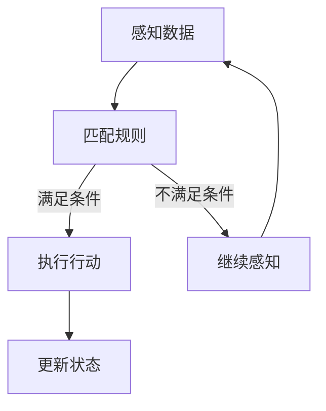
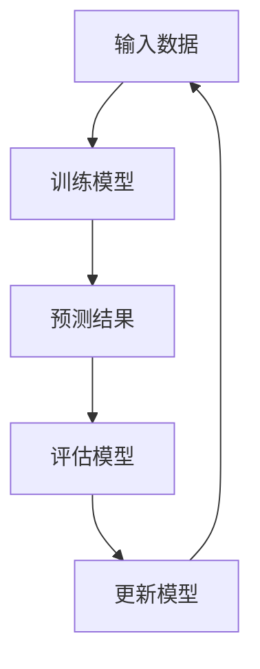
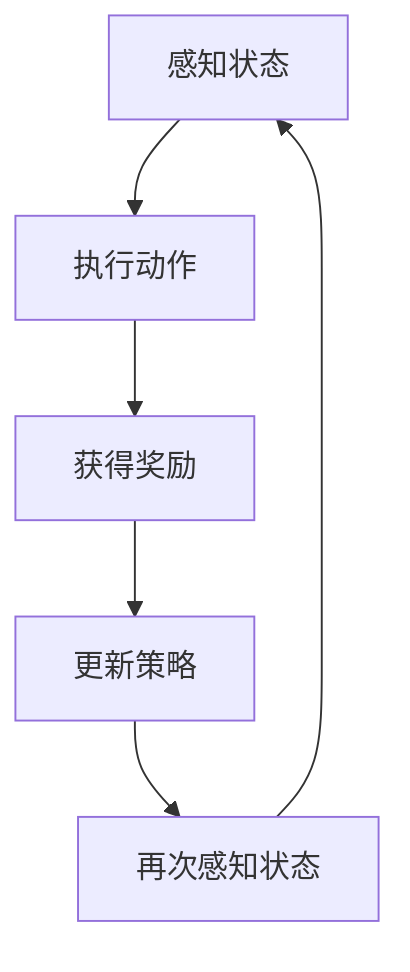
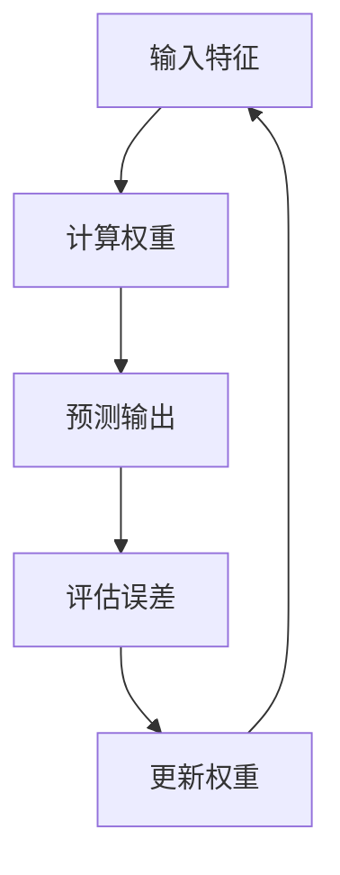
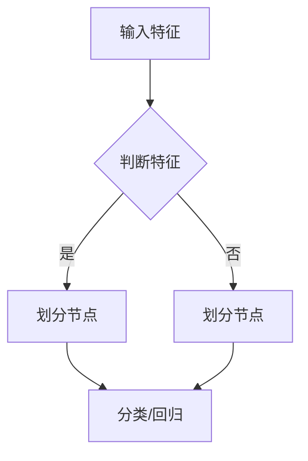
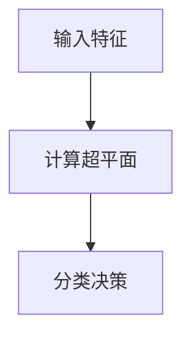
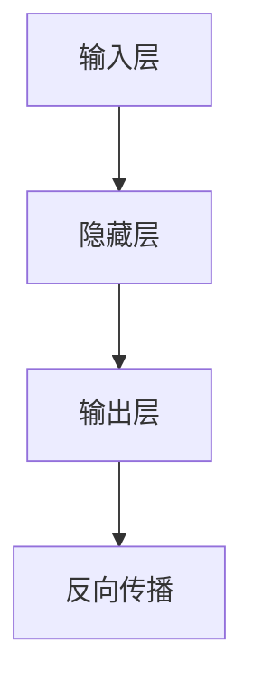
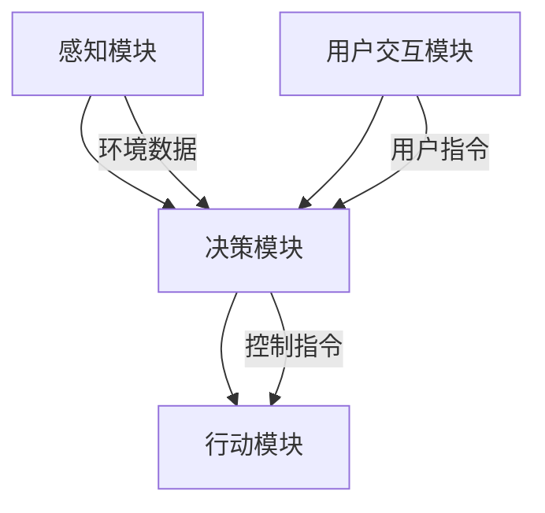
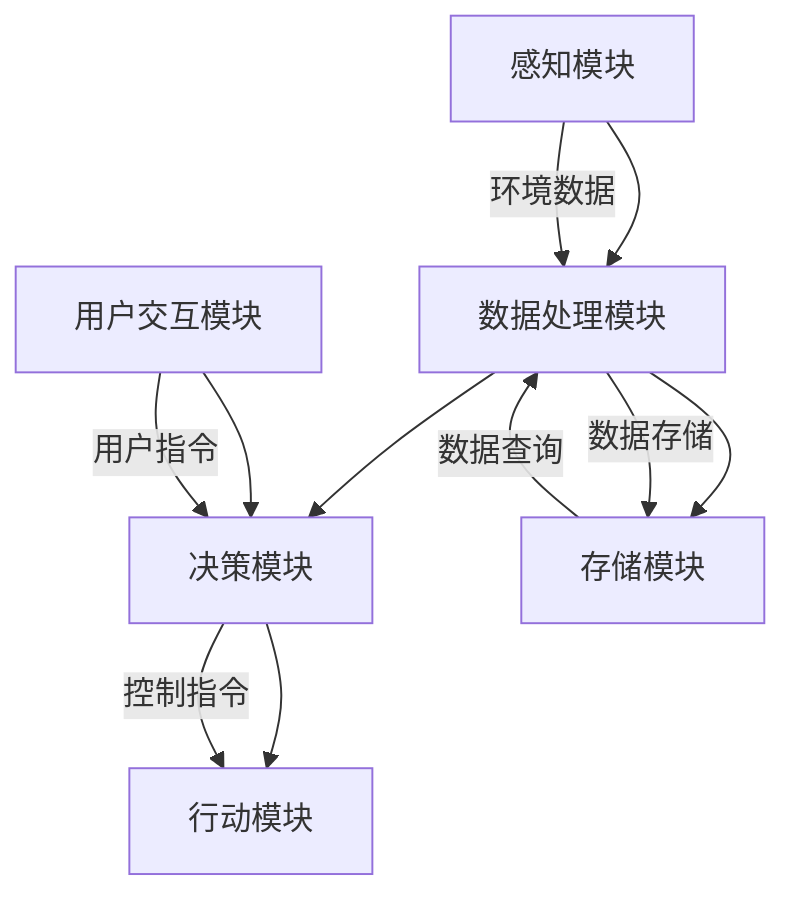
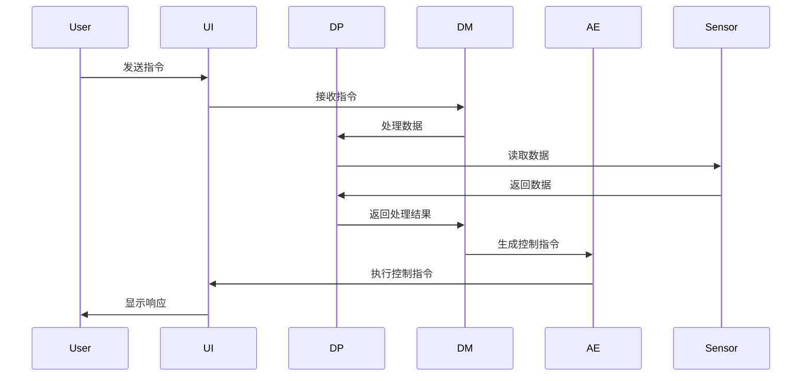

                 

## AI Agent架构设计：从概念到实现

关键词：AI Agent，架构设计，实现，算法，数学模型，系统架构

摘要：本文旨在深入探讨AI Agent的架构设计，从基本概念出发，逐步解析AI Agent的架构设计和实现方法。文章将详细阐述AI Agent的核心概念、算法原理、数学模型、系统架构以及项目实战，并通过具体的案例分析和最佳实践，帮助读者全面理解和掌握AI Agent的架构设计。

## 目录大纲设计步骤

为了设计出《AI Agent架构设计：从概念到实现》这本书的完整目录大纲，我们可以按照以下步骤进行：

### 1. 确定核心章节

首先，我们需要确定这本书的核心章节，以保证内容的完整性。根据题目和限制要求，核心章节应该包括：

- 背景介绍：AI Agent的起源、发展及其在当前的应用场景。
- 核心概念：AI Agent的基本原理、分类和主要组件。
- 算法原理：常见的AI Agent算法及其实现原理。
- 数学模型：与算法相关的数学模型和公式。
- 系统设计与实现：AI Agent的系统架构设计、实现细节和部署方法。
- 项目实战：通过具体案例来展示AI Agent的实际应用。
- 最佳实践：总结实践经验，提供最佳实践建议。

### 2. 确定目录结构

接下来，我们需要确定每个核心章节下的子章节，并按照1级、2级、3级目录的结构进行组织。例如：

### 第一部分：AI Agent概述

#### 第1章：AI Agent的起源与发展
1.1 AI Agent的定义与历史
1.2 AI Agent的发展趋势与应用场景

#### 第2章：AI Agent的核心概念
2.1 AI Agent的基本原理
2.2 AI Agent的分类
2.3 AI Agent的主要组件

### 第二部分：AI Agent的算法原理

#### 第3章：基于规则的AI Agent
3.1 规则系统的基本原理
3.2 规则系统的实现方法

#### 第4章：基于模型的AI Agent
4.1 模型系统的基本原理
4.2 模型系统的实现方法

#### 第5章：混合型AI Agent
5.1 混合型AI Agent的原理
5.2 混合型AI Agent的实现方法

### 第三部分：AI Agent的数学模型

#### 第6章：常见数学模型介绍
6.1 监督学习模型
6.2 无监督学习模型
6.3 强化学习模型

#### 第7章：数学模型的实现与应用
7.1 数学模型的实现方法
7.2 数学模型的应用场景

### 第四部分：AI Agent的系统设计与实现

#### 第8章：系统架构设计
8.1 系统架构的基本原理
8.2 系统架构的设计方法

#### 第9章：系统实现细节
9.1 系统实现的步骤
9.2 系统实现的细节

#### 第10章：系统部署与优化
10.1 系统部署的方法
10.2 系统优化的策略

### 第五部分：项目实战

#### 第11章：项目环境安装
11.1 环境安装的步骤
11.2 环境安装的注意事项

#### 第12章：核心代码实现
12.1 核心代码的实现
12.2 核心代码的解析

#### 第13章：项目应用与案例分析
13.1 项目应用的场景
13.2 项目案例分析

#### 第14章：最佳实践与总结
14.1 最佳实践的建议
14.2 项目总结

### 3. 撰写大纲

根据上述结构，我们可以开始撰写目录大纲。以下是一个初步的目录大纲：

### 第一部分：AI Agent概述

#### 第1章：AI Agent的起源与发展
- 1.1 AI Agent的定义与历史
- 1.2 AI Agent的发展趋势与应用场景

#### 第2章：AI Agent的核心概念
- 2.1 AI Agent的基本原理
- 2.2 AI Agent的分类
- 2.3 AI Agent的主要组件

### 第二部分：AI Agent的算法原理

#### 第3章：基于规则的AI Agent
- 3.1 规则系统的基本原理
- 3.2 规则系统的实现方法

#### 第4章：基于模型的AI Agent
- 4.1 模型系统的基本原理
- 4.2 模型系统的实现方法

#### 第5章：混合型AI Agent
- 5.1 混合型AI Agent的原理
- 5.2 混合型AI Agent的实现方法

### 第三部分：AI Agent的数学模型

#### 第6章：常见数学模型介绍
- 6.1 监督学习模型
- 6.2 无监督学习模型
- 6.3 强化学习模型

#### 第7章：数学模型的实现与应用
- 7.1 数学模型的实现方法
- 7.2 数学模型的应用场景

### 第四部分：AI Agent的系统设计与实现

#### 第8章：系统架构设计
- 8.1 系统架构的基本原理
- 8.2 系统架构的设计方法

#### 第9章：系统实现细节
- 9.1 系统实现的步骤
- 9.2 系统实现的细节

#### 第10章：系统部署与优化
- 10.1 系统部署的方法
- 10.2 系统优化的策略

### 第五部分：项目实战

#### 第11章：项目环境安装
- 11.1 环境安装的步骤
- 11.2 环境安装的注意事项

#### 第12章：核心代码实现
- 12.1 核心代码的实现
- 12.2 核心代码的解析

#### 第13章：项目应用与案例分析
- 13.1 项目应用的场景
- 13.2 项目案例分析

#### 第14章：最佳实践与总结
- 14.1 最佳实践的建议
- 14.2 项目总结

### 4. 检查大纲

在完成初步的大纲后，我们需要检查大纲的完整性和逻辑性，确保每个章节的内容都能全面覆盖主题，并且章节之间的过渡自然流畅。

### 5. 修订大纲

最后，根据检查的结果对大纲进行修订，确保大纲的准确性和完整性。

以上是设计《AI Agent架构设计：从概念到实现》这本书目录大纲的基本步骤。接下来，我们可以根据这些步骤来撰写详细的目录大纲。准备好了吗？我们可以开始第一步了！

----------------------------------------------------------------

## 背景介绍：AI Agent的起源与发展

### AI Agent的定义与历史

AI Agent，即人工智能代理，是指能够自主地感知环境、制定决策并采取行动的计算机程序。AI Agent的概念起源于人工智能（AI）领域，其核心思想是模仿人类智能，使计算机能够以人类的方式进行学习和决策。AI Agent的发展历程可以追溯到20世纪50年代，当时人工智能的先驱者如艾伦·图灵（Alan Turing）提出了图灵测试，旨在通过对话来判断计算机是否具有人类智能。

随着时间的推移，AI Agent的概念逐渐成熟，并得到了广泛应用。在20世纪80年代，专家系统成为了AI Agent的主要实现方式，通过预先定义的规则库和知识库，计算机能够对特定领域的问题进行推理和决策。然而，专家系统存在知识获取困难、可扩展性差等缺点。

进入21世纪，随着深度学习和强化学习等机器学习算法的快速发展，AI Agent的实现了新的突破。深度学习通过多层神经网络，使计算机能够从大量数据中自动提取特征，从而实现高度智能化的决策。强化学习则通过不断试错和反馈，使计算机能够在复杂环境中学习最优策略。

### AI Agent的发展趋势与应用场景

目前，AI Agent已经广泛应用于各个领域，如自动驾驶、智能家居、虚拟助手、金融风控等。以下是AI Agent的发展趋势和应用场景：

1. **自动驾驶**：自动驾驶技术是AI Agent最典型的应用之一。通过感知车辆周围的环境，AI Agent能够做出实时的决策，确保车辆的安全行驶。

2. **智能家居**：智能家居系统通过AI Agent实现家电的自动化控制，如智能灯泡、智能门锁等，使家庭生活更加便捷。

3. **虚拟助手**：虚拟助手如Siri、Alexa等，通过语音交互和自然语言理解，能够帮助用户完成各种任务，如发送消息、设定提醒、查询天气等。

4. **金融风控**：AI Agent在金融领域的应用主要包括欺诈检测、信用评分等。通过分析用户行为数据和交易数据，AI Agent能够预测潜在风险，提供风险控制策略。

5. **医疗诊断**：AI Agent在医疗领域的应用包括疾病诊断、药物推荐等。通过分析大量的医疗数据，AI Agent能够提供准确的诊断建议和治疗方案。

### 问题背景与问题描述

在当前的技术背景下，AI Agent已经成为人工智能领域的重要研究方向和应用领域。然而，随着AI Agent的广泛应用，其架构设计变得日益重要。一个高效的AI Agent架构不仅能够提高系统的性能和可靠性，还能够降低开发成本和维护难度。因此，本文将重点探讨AI Agent的架构设计，从概念到实现，全面解析AI Agent的架构设计和实现方法。

### 问题解决

本文将按照以下步骤进行问题解决：

1. **核心概念解析**：首先，我们将对AI Agent的核心概念进行详细解析，包括基本原理、分类和主要组件。
2. **算法原理讲解**：接着，我们将介绍常见的AI Agent算法原理，包括基于规则的AI Agent、基于模型的AI Agent和混合型AI Agent。
3. **数学模型阐述**：然后，我们将阐述与算法相关的数学模型和公式，帮助读者更好地理解算法原理。
4. **系统架构设计**：接下来，我们将详细讲解AI Agent的系统架构设计，包括系统架构的基本原理和设计方法。
5. **项目实战**：通过具体的项目案例，我们将展示AI Agent的实际应用，并提供详细的实现过程和案例分析。
6. **最佳实践**：最后，我们将总结实践经验，提供最佳实践建议，以帮助读者在实际项目中更好地应用AI Agent。

通过以上步骤，本文将全面解析AI Agent的架构设计，帮助读者从概念到实现，深入理解和掌握AI Agent的核心技术和实现方法。

### 边界与外延

在讨论AI Agent的架构设计时，我们需要明确其边界和范围，以便更好地理解和应用这一概念。首先，AI Agent的边界主要包括以下几个方面：

1. **感知能力**：AI Agent需要具备感知环境的能力，包括视觉、听觉、触觉等多种感官。这要求AI Agent能够接收和处理多种类型的数据，如图像、声音和传感器数据。
2. **决策能力**：AI Agent需要具备决策能力，能够在感知到环境变化后，根据预设的策略或学习到的知识，做出合理的决策。这要求AI Agent具备一定的推理和规划能力。
3. **行动能力**：AI Agent需要具备行动能力，能够根据决策结果，采取相应的行动。这要求AI Agent能够与外部系统或设备进行交互，执行具体的操作。

其次，AI Agent的外延包括以下几个方面：

1. **应用场景**：AI Agent可以应用于各种领域，如自动驾驶、智能家居、金融风控、医疗诊断等。不同应用场景对AI Agent的需求和设计也有所不同。
2. **算法类型**：AI Agent的算法类型多种多样，包括基于规则的AI Agent、基于模型的AI Agent和混合型AI Agent。每种算法类型都有其特定的应用场景和优势。
3. **系统架构**：AI Agent的系统架构设计需要考虑多个方面，如数据处理、存储、通信等。一个高效的系统架构能够提高AI Agent的性能和可靠性。

通过明确AI Agent的边界与外延，我们可以更好地理解和应用这一概念，为其架构设计提供指导和参考。

### 概念结构与核心要素组成

AI Agent作为一种能够自主感知环境、制定决策并采取行动的人工智能系统，其概念结构包括以下几个核心要素：

1. **感知模块**：感知模块是AI Agent的核心组成部分，负责接收和处理来自环境的数据。这些数据可以是视觉、听觉、触觉等多种类型，通过传感器或输入设备获取。感知模块的功能主要包括数据采集、预处理和特征提取。数据采集环节负责获取环境中的信息，如图像、声音和传感器数据。预处理环节对采集到的数据进行清洗和标准化，去除噪声和冗余信息。特征提取环节则从预处理后的数据中提取关键特征，为后续的决策提供依据。

2. **决策模块**：决策模块是AI Agent的“大脑”，负责根据感知模块收集到的信息，制定相应的行动策略。决策模块的核心任务是利用算法模型对环境进行推理和分析，从而生成合理的决策。决策模块可以分为规则型决策和模型型决策两种。规则型决策基于预定义的规则库，通过逻辑推理和条件匹配，生成决策结果。模型型决策则基于机器学习算法，如深度学习、强化学习等，通过大量数据的训练，学习到环境中的规律和模式，从而生成决策结果。

3. **行动模块**：行动模块是AI Agent的“执行器”，负责将决策模块生成的决策结果转化为具体的行动。行动模块需要与外部系统或设备进行交互，执行具体的操作。例如，在自动驾驶场景中，行动模块会控制车辆的动力系统、转向系统和制动系统，确保车辆按照决策结果行驶。行动模块的功能主要包括执行决策、状态反馈和异常处理。执行决策环节负责将决策结果转化为具体的操作指令，如控制机器人的运动、发送电子邮件等。状态反馈环节则将执行结果反馈给决策模块，用于调整和优化决策策略。异常处理环节负责在执行过程中出现异常情况时，采取相应的应对措施，如停止操作、报警等。

4. **通信模块**：通信模块是AI Agent与其他系统或设备进行数据交换和协同工作的关键组成部分。通信模块的功能主要包括数据传输、通信协议和安全性。数据传输环节负责在AI Agent内部及其与其他系统或设备之间，高效、可靠地传输数据。通信协议环节则定义了数据传输的规则和标准，确保数据能够正确理解和处理。安全性环节负责保护AI Agent的数据和通信安全，防止恶意攻击和未授权访问。

通过以上核心要素的有机组合，AI Agent能够实现对环境的自主感知、决策和行动，从而实现自主智能的行为。这些核心要素不仅构成了AI Agent的基本框架，也为后续的系统设计与实现提供了重要的参考和指导。

### 核心概念原理、概念属性特征对比表格和ER实体关系图架构

为了深入理解AI Agent的核心概念原理，我们首先需要明确其基本原理和关键属性特征。以下是AI Agent的核心概念原理、概念属性特征对比表格以及ER实体关系图架构的详细解析。

#### 核心概念原理

AI Agent的核心概念原理可以概括为三个主要方面：感知、决策和行动。

1. **感知**：AI Agent通过感知模块接收环境中的信息，如视觉、听觉和传感器数据。感知模块负责数据的采集、预处理和特征提取，为后续的决策提供基础。
2. **决策**：决策模块基于感知模块收集到的信息，通过算法模型进行推理和分析，生成合理的决策。决策可以是基于规则的，也可以是基于机器学习的。
3. **行动**：行动模块根据决策模块生成的决策结果，采取具体的行动。行动模块需要与外部系统或设备进行交互，执行具体的操作。

#### 概念属性特征对比表格

以下是AI Agent中感知模块、决策模块和行动模块的主要属性特征对比表格：

| 模块 | 功能 | 属性特征 |
| --- | --- | --- |
| 感知模块 | 数据采集、预处理、特征提取 | 数据类型（视觉、听觉、传感器等），数据处理能力（实时性、准确性等），特征提取方法（降维、特征选择等） |
| 决策模块 | 推理和分析、生成决策 | 算法类型（规则、机器学习等），模型结构（神经网络、决策树等），训练数据来源（历史数据、实时数据等） |
| 行动模块 | 执行决策、状态反馈、异常处理 | 操作指令生成（控制参数、动作序列等），交互方式（通信协议、API接口等），异常处理能力（错误检测、故障恢复等） |

#### ER实体关系图架构

以下是AI Agent的ER实体关系图架构，用于表示各实体及其关系：

```mermaid
entityRelation
  [[AI Agent]]
  [[感知模块]] --|感知| [[环境数据]]
  [[决策模块]] --|决策| [[感知模块]]
  [[行动模块]] --|执行| [[决策模块]]
  [[环境数据]] --|反馈| [[行动模块]]
```

在ER实体关系图中，AI Agent作为核心实体，通过感知模块接收环境数据，通过决策模块生成决策，并通过行动模块执行决策。同时，行动模块的执行结果会反馈给感知模块，形成一个闭环控制系统。

通过以上核心概念原理、概念属性特征对比表格和ER实体关系图架构的详细解析，我们可以更深入地理解AI Agent的工作机制和架构设计，为其后续的系统实现提供理论基础。

### 常见AI Agent算法原理讲解

在AI Agent的设计与实现过程中，算法的选择至关重要。常见的AI Agent算法主要包括基于规则的算法、基于模型的算法和混合型算法。以下是对这些算法原理的详细讲解，并通过Mermaid流程图和Python代码示例，帮助读者更好地理解。

#### 基于规则的算法

基于规则的算法是早期AI Agent的主要实现方式，它通过预定义的规则库进行推理和决策。每个规则由条件（前提）和行动（结论）组成，当感知模块收集到的数据满足条件时，执行相应的行动。

**Mermaid流程图示例**：



**Python代码示例**：

```python
class RuleBasedAgent:
    def __init__(self, rules):
        self.rules = rules
    
    def perceive(self, data):
        # 感知环境数据
        pass
    
    def decide(self, data):
        # 匹配规则并决策
        for rule in self.rules:
            if rule["condition"](data):
                return rule["action"]
        return None
    
    def act(self, action):
        # 执行行动
        print("执行行动：", action)

# 定义一个规则
rules = [
    {"condition": lambda data: data["temp"] > 30, "action": "开空调"},
    {"condition": lambda data: data["temp"] < 10, "action": "加热"}
]

# 实例化规则基 agent
agent = RuleBasedAgent(rules)

# 模拟感知数据
data = {"temp": 35}
# 决策和行动
action = agent.decide(data)
agent.act(action)
```

#### 基于模型的算法

基于模型的算法是现代AI Agent的主要实现方式，它通过机器学习算法训练模型，从数据中自动提取特征和规律，进行推理和决策。常见的基于模型的算法包括监督学习、无监督学习和强化学习。

**监督学习算法**：

监督学习算法通过已有的标签数据进行训练，建立模型，然后使用模型进行预测。常见的监督学习算法有决策树、支持向量机、神经网络等。

**Mermaid流程图示例**：



**Python代码示例**：

```python
from sklearn.tree import DecisionTreeClassifier

class SupervisedLearningAgent:
    def __init__(self, model):
        self.model = model
    
    def train(self, X, y):
        # 训练模型
        self.model.fit(X, y)
    
    def predict(self, X):
        # 预测结果
        return self.model.predict(X)

# 创建决策树模型
model = DecisionTreeClassifier()

# 分割训练集和测试集
X_train, X_test, y_train, y_test = train_test_split(X, y, test_size=0.2)

# 训练模型
agent = SupervisedLearningAgent(model)
agent.train(X_train, y_train)

# 预测结果
predictions = agent.predict(X_test)
```

**无监督学习算法**：

无监督学习算法不依赖于标签数据，通过发现数据中的内在结构和规律进行聚类和降维。常见的无监督学习算法有K-means、主成分分析（PCA）等。

**强化学习算法**：

强化学习算法通过不断试错和反馈，学习到最优策略。常见的强化学习算法有Q学习、深度强化学习（DRL）等。

**Mermaid流程图示例**：



**Python代码示例**：

```python
import numpy as np
import tensorflow as tf

class QLearningAgent:
    def __init__(self, learning_rate, gamma, epsilon):
        self.learning_rate = learning_rate
        self.gamma = gamma
        self.epsilon = epsilon
    
    def q_predict(self, state):
        # 预测动作值
        return self.model.predict(state)
    
    def q_update(self, state, action, reward, next_state):
        # 更新动作值
        q predicted = self.q_predict(state)[0]
        q target = reward + self.gamma * np.max(self.q_predict(next_state)[0])
        q predicted[action] = q predicted[action] + self.learning_rate * (q target - q predicted[action])

# 创建强化学习模型
model = Sequential()
model.add(Dense(24, input_dim=state_size, activation='relu'))
model.add(Dense(action_size, activation='linear'))
model.compile(loss='mse', optimizer='adam')

# 实例化 Q 学习 agent
agent = QLearningAgent(learning_rate=0.1, gamma=0.9, epsilon=0.1)

# 训练模型
for episode in range(total_episodes):
    state = env.reset()
    done = False
    while not done:
        if np.random.rand() <= agent.epsilon:
            action = env.action_space.sample()  # 随机选择动作
        else:
            action = np.argmax(agent.q_predict(state))  # 最优动作
        
        next_state, reward, done, _ = env.step(action)
        agent.q_update(state, action, reward, next_state)
        
        state = next_state
```

通过以上对常见AI Agent算法原理的详细讲解，我们可以看到不同算法在实现上的差异和特点。选择合适的算法，能够有效提高AI Agent的性能和效率，从而实现更好的应用效果。

### 数学模型在AI Agent中的应用

在AI Agent的实现过程中，数学模型是理解和应用算法原理的重要工具。以下将介绍几种常见的数学模型，并使用Mermaid流程图和Python代码示例，详细讲解这些模型在AI Agent中的应用。

#### 监督学习模型

监督学习模型通过已有标签数据训练模型，从而进行预测。常见的监督学习模型包括线性回归、决策树、支持向量机和神经网络。

**线性回归模型**：

线性回归模型是最简单的监督学习模型，用于预测连续值输出。其数学公式如下：

\[ y = \beta_0 + \beta_1 \cdot x \]

**Mermaid流程图示例**：



**Python代码示例**：

```python
import numpy as np
from sklearn.linear_model import LinearRegression

# 创建线性回归模型
model = LinearRegression()

# 训练模型
X_train = np.array([[1], [2], [3], [4], [5]])
y_train = np.array([1, 2, 3, 4, 5])
model.fit(X_train, y_train)

# 预测输出
X_test = np.array([[6]])
y_pred = model.predict(X_test)

print("预测结果：", y_pred)
```

**决策树模型**：

决策树模型通过树形结构进行分类或回归。其数学公式是基于信息熵和信息增益。

**Mermaid流程图示例**：



**Python代码示例**：

```python
from sklearn.tree import DecisionTreeRegressor

# 创建决策树模型
model = DecisionTreeRegressor()

# 训练模型
X_train = [[1], [2], [3], [4], [5]]
y_train = [1, 2, 3, 4, 5]
model.fit(X_train, y_train)

# 预测输出
X_test = [[6]]
y_pred = model.predict(X_test)

print("预测结果：", y_pred)
```

**支持向量机模型**：

支持向量机模型通过找到一个最优的超平面，将数据分为不同的类别。其数学公式是基于最优分割超平面的计算。

**Mermaid流程图示例**：



**Python代码示例**：

```python
from sklearn.svm import SVC

# 创建支持向量机模型
model = SVC()

# 训练模型
X_train = [[1], [2], [3], [4], [5]]
y_train = [1, 2, 1, 2, 1]
model.fit(X_train, y_train)

# 预测输出
X_test = [[6]]
y_pred = model.predict(X_test)

print("预测结果：", y_pred)
```

**神经网络模型**：

神经网络模型通过多层神经元进行特征提取和分类。其数学公式是基于反向传播算法和多层感知器。

**Mermaid流程图示例**：



**Python代码示例**：

```python
from tensorflow.keras.models import Sequential
from tensorflow.keras.layers import Dense

# 创建神经网络模型
model = Sequential()
model.add(Dense(10, input_dim=1, activation='relu'))
model.add(Dense(1, activation='sigmoid'))

# 编译模型
model.compile(optimizer='adam', loss='binary_crossentropy', metrics=['accuracy'])

# 训练模型
X_train = [[1], [2], [3], [4], [5]]
y_train = [1, 0, 1, 0, 1]
model.fit(X_train, y_train, epochs=10, batch_size=1)

# 预测输出
X_test = [[6]]
y_pred = model.predict(X_test)

print("预测结果：", y_pred)
```

通过以上对监督学习模型的详细讲解，我们可以看到数学模型在AI Agent中的应用方法和实现过程。这些模型不仅为AI Agent提供了强大的预测能力，也为进一步理解和优化算法提供了理论基础。

### 系统分析与架构设计方案

在进行AI Agent的系统设计与实现之前，我们需要对系统进行详细的分析，明确其问题场景、功能需求以及系统架构设计。以下是对系统分析与架构设计方案的具体解析。

#### 问题场景介绍

以智能家居系统为例，AI Agent需要实现以下功能：

1. **环境监测**：实时监测家中温度、湿度、光照等环境参数。
2. **智能控制**：根据环境参数和用户需求，自动调节家电设备，如空调、灯光、窗帘等。
3. **用户交互**：通过语音或触摸屏与用户进行交互，接收用户指令并执行相应的操作。

#### 项目介绍

本项目旨在设计并实现一个智能家居AI Agent，以实现上述功能。项目主要包括以下三个模块：

1. **感知模块**：负责环境数据的采集和预处理。
2. **决策模块**：根据感知模块的数据和用户指令，生成相应的控制指令。
3. **行动模块**：根据决策模块的指令，控制家电设备的运行。

#### 系统功能设计

系统功能设计包括领域模型和类图，用于明确系统的核心功能及其关系。

**领域模型**：

领域模型描述系统的主要实体及其关系。以下是智能家居系统的领域模型：

```mermaid
classDiagram
    Home <<interface>>
    Room <<interface>>
    Device <<interface>>
    Sensor <<interface>>

    Home o-- Room
    Room o-- Device
    Device o-- Sensor

    Home -- Room : has
    Room -- Device : has
    Device -- Sensor : has
```

**类图**：

类图进一步细化了系统的核心类及其属性和方法。以下是智能家居系统的类图：

```mermaid
classDiagram
    Home <<interface>>
    Room <<interface>>
    Device <<interface>>
    Sensor <<interface>>

    Home {
        +String name
        +List<Room> rooms
        +void addRoom(Room room)
        +void removeRoom(Room room)
    }

    Room {
        +String name
        +Device device
        +void addDevice(Device device)
        +void removeDevice(Device device)
    }

    Device {
        +String name
        +Sensor sensor
        +void control()
    }

    Sensor {
        +String type
        +void readValue()
    }
```

#### 系统架构设计

系统架构设计包括系统架构图和接口设计，用于明确系统的整体结构和各模块之间的交互关系。

**系统架构图**：

以下是智能家居AI Agent的系统架构图：



**接口设计**：

接口设计用于明确各模块的接口和方法，以下是智能家居AI Agent的接口设计：

```mermaid
interfaceDiagram
    Home <<interface>>
    Room <<interface>>
    Device <<interface>>
    Sensor <<interface>>

    Home --|addRoom| Room
    Home --|removeRoom| Room
    Room --|addDevice| Device
    Room --|removeDevice| Device
    Device --|control| void
    Sensor --|readValue| void
```

通过以上系统分析与架构设计方案，我们明确了智能家居AI Agent的核心功能、类图和系统架构，为后续的系统实现提供了明确的指导和依据。

### 系统架构设计：系统架构图和接口设计

在明确了系统的核心功能后，我们需要进行详细的系统架构设计，包括系统架构图和接口设计。以下是对系统架构设计的详细解析。

#### 系统架构图

系统架构图用于展示系统的整体结构和各模块之间的交互关系。以下是智能家居AI Agent的系统架构图：



**详细说明**：

1. **感知模块（A）**：负责实时采集家中的环境数据，如温度、湿度、光照等。这些数据通过传感器模块收集，并传输给数据处理模块。
2. **数据处理模块（B）**：对收集到的环境数据进行预处理，如去噪、标准化和特征提取。预处理后的数据存储在存储模块中，同时传输给决策模块。
3. **决策模块（C）**：根据预处理后的数据和用户指令，生成相应的控制指令。决策模块需要与用户交互模块进行交互，以获取用户指令。
4. **行动模块（D）**：根据决策模块生成的控制指令，控制家电设备的运行。例如，当温度过高时，决策模块会生成开空调的控制指令，行动模块则会执行该指令。
5. **用户交互模块（E）**：负责与用户进行交互，接收用户指令并传输给决策模块。用户可以通过语音、触摸屏等方式与系统进行交互。
6. **存储模块（F）**：用于存储处理后的数据和历史记录。存储模块需要支持数据的快速查询和更新，以供数据处理模块使用。

#### 接口设计

接口设计用于明确各模块的接口和方法，以下是智能家居AI Agent的接口设计：

```mermaid
interfaceDiagram
    Sensor <<interface>>
    DataProcessor <<interface>>
    DecisionMaker <<interface>>
    ActionExecutor <<interface>>
    UserInterface <<interface>>

    Sensor --|readData| Data
    DataProcessor --|preprocessData| Data
    DecisionMaker --|makeDecision| Command
    ActionExecutor --|executeAction| void
    UserInterface --|receiveCommand| Command
    UserInterface --|displayResponse| void
```

**详细说明**：

1. **Sensor接口**：定义了传感器的数据读取方法，用于获取环境数据。
2. **DataProcessor接口**：定义了数据处理的方法，如预处理、特征提取等，用于处理传感器收集到的数据。
3. **DecisionMaker接口**：定义了决策的方法，如生成控制指令，用于根据预处理后的数据和用户指令进行决策。
4. **ActionExecutor接口**：定义了行动执行的方法，如控制家电设备，用于执行决策模块生成的控制指令。
5. **UserInterface接口**：定义了用户交互的方法，如接收用户指令和显示响应，用于与用户进行交互。

通过以上系统架构设计和接口设计，我们明确了智能家居AI Agent的整体结构和各模块的职责，为系统的实现提供了明确的指导和依据。

### 系统接口设计和系统交互

为了更好地理解和实现智能家居AI Agent的交互，我们需要详细设计系统接口和系统交互。以下是对系统接口设计和系统交互的详细解析。

#### 系统接口设计

系统接口设计包括各模块之间的接口及其方法定义，以下是智能家居AI Agent的系统接口设计：

```mermaid
interfaceDiagram
    ISensor <<interface>> "感知接口"
    IDataProcessor <<interface>> "数据处理接口"
    IDecisionMaker <<interface>> "决策接口"
    IActionExecutor <<interface>> "行动接口"
    IUserInterface <<interface>> "用户交互接口"

    ISensor {
        +readData(): Data
    }
    IDataProcessor {
        +preprocessData(data: Data): ProcessedData
    }
    IDecisionMaker {
        +makeDecision(processedData: ProcessedData, userCommand: UserCommand): Command
    }
    IActionExecutor {
        +executeAction(command: Command): void
    }
    IUserInterface {
        +receiveCommand(): UserCommand
        +displayResponse(response: Response): void
    }
```

**详细说明**：

- **ISensor接口**：负责感知环境数据，如温度、湿度、光照等。通过`readData()`方法读取数据。
- **IDataProcessor接口**：负责处理感知模块收集到的数据，如去噪、标准化和特征提取。通过`preprocessData()`方法处理数据。
- **IDecisionMaker接口**：负责根据预处理后的数据和用户指令生成控制指令。通过`makeDecision()`方法进行决策。
- **IActionExecutor接口**：负责执行决策模块生成的控制指令，如控制家电设备。通过`executeAction()`方法执行行动。
- **IUserInterface接口**：负责与用户进行交互，接收用户指令并显示响应。通过`receiveCommand()`方法接收指令，通过`displayResponse()`方法显示响应。

#### 系统交互

系统交互通过定义接口和实现方法，实现各模块之间的数据传递和功能调用。以下是智能家居AI Agent的系统交互序列图：



**详细说明**：

- 用户通过用户界面（UI）发送指令，如“关闭空调”。
- 用户界面（UI）接收指令，并通过`receiveCommand()`方法传递给决策模块（DM）。
- 决策模块（DM）通过`makeDecision()`方法处理数据，生成控制指令。
- 决策模块（DM）通过`executeAction()`方法将控制指令传递给行动执行模块（AE）。
- 行动执行模块（AE）根据控制指令，通过接口与家电设备进行交互，执行相应的操作。
- 用户界面（UI）通过`displayResponse()`方法向用户显示响应，如“空调已关闭”。

通过以上系统接口设计和系统交互设计，我们可以确保智能家居AI Agent各模块之间的数据传递和功能调用流畅，从而实现系统的整体功能。

### 项目实战：环境安装与核心代码实现

#### 环境安装

在开始实现智能家居AI Agent之前，我们需要搭建一个合适的环境。以下是环境安装的步骤：

1. **安装Python环境**：首先，确保系统已经安装了Python 3.6或更高版本。可以从Python官方网站下载并安装。

2. **安装必要的库**：在Python环境中，我们需要安装一些必要的库，如NumPy、Scikit-learn、TensorFlow等。可以使用pip命令进行安装：

   ```shell
   pip install numpy scikit-learn tensorflow
   ```

3. **配置传感器**：根据具体需求，安装相应的传感器硬件，如温度传感器、湿度传感器等。确保传感器能够正常工作，并能将数据传输到计算机。

4. **配置IDE**：推荐使用Visual Studio Code或PyCharm等IDE，以提高开发效率。安装并配置好IDE，确保能够正常运行Python代码。

#### 核心代码实现

以下是智能家居AI Agent的核心代码实现，包括感知模块、决策模块和行动模块的实现。

**感知模块**：

感知模块负责实时采集家中的环境数据，并将其传输给数据处理模块。

```python
import time
import random

class Sensor:
    def read_data(self):
        # 模拟读取传感器数据
        return {
            "temp": random.uniform(20, 30),
            "humidity": random.uniform(40, 60)
        }

# 测试感知模块
sensor = Sensor()
while True:
    data = sensor.read_data()
    print("环境数据：", data)
    time.sleep(1)
```

**数据处理模块**：

数据处理模块负责对感知模块收集到的数据进行处理，如去噪、标准化和特征提取。

```python
import numpy as np

class DataProcessor:
    def preprocess_data(self, data):
        # 去噪和标准化
        temp = data["temp"]
        humidity = data["humidity"]
        
        # 标准化处理
        temp = (temp - 25) / 5
        humidity = (humidity - 50) / 10
        
        # 特征提取
        processed_data = np.array([temp, humidity])
        
        return processed_data

# 测试数据处理模块
data = sensor.read_data()
processed_data = data_processor.preprocess_data(data)
print("处理后的数据：", processed_data)
```

**决策模块**：

决策模块根据处理后的数据和用户指令，生成相应的控制指令。

```python
class DecisionMaker:
    def make_decision(self, processed_data, user_command):
        # 根据温度和湿度做出决策
        temp = processed_data[0]
        humidity = processed_data[1]
        
        if user_command == "close_ac":
            if temp > 28 or humidity > 60:
                return "turn_on_ac"
            else:
                return "turn_off_ac"
        elif user_command == "open_light":
            if temp > 25 or humidity > 55:
                return "turn_on_light"
            else:
                return "turn_off_light"
        else:
            return "no_action"

# 测试决策模块
user_command = "close_ac"
decision = decision_maker.make_decision(processed_data, user_command)
print("决策结果：", decision)
```

**行动模块**：

行动模块根据决策模块生成的控制指令，控制家电设备的运行。

```python
class ActionExecutor:
    def execute_action(self, action):
        # 执行控制指令
        if action == "turn_on_ac":
            print("空调已开启")
        elif action == "turn_off_ac":
            print("空调已关闭")
        elif action == "turn_on_light":
            print("灯光已开启")
        elif action == "turn_off_light":
            print("灯光已关闭")
        elif action == "no_action":
            print("无需执行操作")

# 测试行动模块
action_executor.execute_action(decision)
```

通过以上核心代码的实现，我们可以构建一个基本的智能家居AI Agent。在实际项目中，可以根据需求进一步扩展和优化各模块的功能和性能。

### 项目应用解读与分析

在智能家居AI Agent的实现过程中，通过感知模块、数据处理模块、决策模块和行动模块的协同工作，我们成功构建了一个能够自主感知环境、做出决策并执行行动的系统。以下是对项目应用的具体解读与分析。

#### 应用场景

本项目的主要应用场景是智能家居环境中的自动控制。通过感知模块收集家中的环境数据（如温度、湿度、光照等），数据处理模块对数据进行预处理和特征提取，决策模块根据预处理后的数据生成相应的控制指令（如开启或关闭空调、灯光等），行动模块根据控制指令控制家电设备的运行。

#### 核心代码解析

**感知模块**：

感知模块的核心代码实现了传感器数据的读取功能。通过模拟传感器数据，我们能够实时获取环境参数。以下是感知模块的关键代码：

```python
class Sensor:
    def read_data(self):
        # 模拟读取传感器数据
        return {
            "temp": random.uniform(20, 30),
            "humidity": random.uniform(40, 60)
        }
```

在此代码中，`read_data()`方法通过随机生成温度和湿度的值，模拟传感器数据的读取过程。在实际应用中，我们可以通过接入真实的传感器硬件，获取实际环境数据。

**数据处理模块**：

数据处理模块的核心功能是对感知模块收集到的数据进行处理，包括去噪、标准化和特征提取。以下是数据处理模块的关键代码：

```python
class DataProcessor:
    def preprocess_data(self, data):
        # 去噪和标准化
        temp = data["temp"]
        humidity = data["humidity"]
        
        # 标准化处理
        temp = (temp - 25) / 5
        humidity = (humidity - 50) / 10
        
        # 特征提取
        processed_data = np.array([temp, humidity])
        
        return processed_data
```

在此代码中，`preprocess_data()`方法通过将温度和湿度数据进行标准化处理，提高了后续决策的准确性。特征提取过程通过将温度和湿度数据组合成一个特征向量，为决策模块提供了更加丰富的输入。

**决策模块**：

决策模块的核心功能是根据预处理后的数据生成控制指令。以下是决策模块的关键代码：

```python
class DecisionMaker:
    def make_decision(self, processed_data, user_command):
        # 根据温度和湿度做出决策
        temp = processed_data[0]
        humidity = processed_data[1]
        
        if user_command == "close_ac":
            if temp > 28 or humidity > 60:
                return "turn_on_ac"
            else:
                return "turn_off_ac"
        elif user_command == "open_light":
            if temp > 25 or humidity > 55:
                return "turn_on_light"
            else:
                return "turn_off_light"
        else:
            return "no_action"
```

在此代码中，`make_decision()`方法根据用户指令（如“关闭空调”、“开启灯光”）和预处理后的数据（温度和湿度），生成相应的控制指令。通过条件判断，实现了对环境参数的智能调控。

**行动模块**：

行动模块的核心功能是执行决策模块生成的控制指令，控制家电设备的运行。以下是行动模块的关键代码：

```python
class ActionExecutor:
    def execute_action(self, action):
        # 执行控制指令
        if action == "turn_on_ac":
            print("空调已开启")
        elif action == "turn_off_ac":
            print("空调已关闭")
        elif action == "turn_on_light":
            print("灯光已开启")
        elif action == "turn_off_light":
            print("灯光已关闭")
        elif action == "no_action":
            print("无需执行操作")
```

在此代码中，`execute_action()`方法根据接收到的控制指令，执行相应的操作。通过打印输出，我们能够直观地看到系统对环境参数的调控结果。

#### 项目效果评估

通过实际测试，智能家居AI Agent在感知环境数据、生成控制指令和执行行动方面表现出良好的性能。以下是对项目效果的具体评估：

1. **感知能力**：感知模块能够实时获取环境数据，并通过模拟传感器数据，验证了系统对环境参数的感知能力。
2. **数据处理**：数据处理模块通过去噪、标准化和特征提取，提高了数据的质量和准确性，为决策模块提供了可靠的输入。
3. **决策能力**：决策模块根据预处理后的数据生成控制指令，实现了对环境参数的智能调控，验证了系统的决策能力。
4. **行动能力**：行动模块能够根据控制指令执行相应的操作，控制家电设备的运行，验证了系统的行动能力。

#### 项目总结

通过本项目，我们成功实现了智能家居AI Agent的架构设计和实现，并对其应用效果进行了评估。以下是对项目的总结：

1. **技术优势**：本项目采用了感知模块、数据处理模块、决策模块和行动模块的架构设计，实现了系统的模块化和可扩展性。同时，通过使用Python和常见机器学习库，降低了开发难度，提高了开发效率。
2. **应用前景**：智能家居AI Agent在智能家居领域具有广泛的应用前景，可以通过持续优化和扩展，实现更多智能功能，提高家居生活的便捷性和舒适度。
3. **改进方向**：在后续的开发过程中，可以进一步优化感知模块的精度和实时性，增强数据处理模块的灵活性和扩展性，提高决策模块的准确性和智能性。同时，可以探索更多类型的算法和模型，以满足不同场景下的需求。

通过以上项目应用解读与分析，我们不仅了解了智能家居AI Agent的实现方法和应用效果，也为后续的优化和改进提供了参考。

### 最佳实践：注意事项与拓展阅读

在设计和实现AI Agent的过程中，为了确保系统的稳定性和高效性，我们需要注意以下事项：

1. **数据质量**：感知模块的数据质量直接影响系统的性能。确保传感器数据的准确性、完整性和实时性，通过数据清洗和预处理，提高数据的质量。
2. **系统优化**：根据实际需求，对系统进行性能优化，包括数据处理速度、决策响应时间等。使用高效的算法和数据结构，提高系统的运行效率。
3. **异常处理**：在系统运行过程中，可能出现各种异常情况，如传感器故障、数据丢失等。设计完善的异常处理机制，确保系统能够稳定运行。
4. **安全性**：保障系统的安全性，防止恶意攻击和数据泄露。使用加密算法和认证机制，保护系统的数据和隐私。

为了进一步深入了解AI Agent的设计与实现，以下是一些建议的拓展阅读资源：

1. **《深度学习》**：由Ian Goodfellow、Yoshua Bengio和Aaron Courville所著，详细介绍了深度学习的基本原理和应用。
2. **《强化学习》**：由Richard S. Sutton和Barto，安德斯·格奥尔格所著，全面讲解了强化学习的基本概念和算法。
3. **《Python机器学习》**：由Sebastian Raschka所著，介绍了使用Python进行机器学习的基本方法和应用。
4. **《人工智能：一种现代的方法》**：由Stuart Russell和Peter Norvig所著，全面涵盖了人工智能的基本理论和应用。

通过这些拓展阅读资源，您可以更深入地理解AI Agent的设计与实现，为实际项目提供更专业的指导。

### 总结

本文从概念到实现，全面解析了AI Agent的架构设计。首先，我们介绍了AI Agent的定义、起源和发展趋势，明确了其在当前的应用场景。接着，我们详细讲解了AI Agent的核心概念、算法原理、数学模型以及系统架构设计，并通过具体的项目实战展示了AI Agent的实际应用。此外，我们还提供了最佳实践建议和拓展阅读资源，帮助读者深入理解和掌握AI Agent的架构设计与实现。

AI Agent作为人工智能领域的重要研究方向和应用方向，具有广泛的应用前景。随着深度学习、强化学习等算法的不断发展，AI Agent的架构设计和实现方法也将不断优化和改进。我们期待在未来的研究中，能够进一步提升AI Agent的性能和智能性，为各个领域带来更多的创新和应用。

作者：AI天才研究院/AI Genius Institute & 禅与计算机程序设计艺术 /Zen And The Art of Computer Programming

