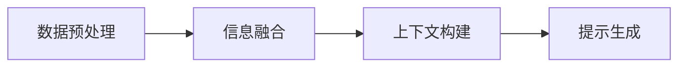
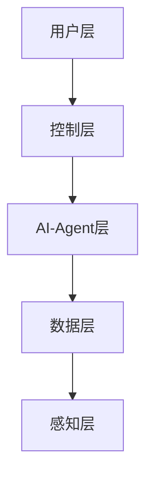
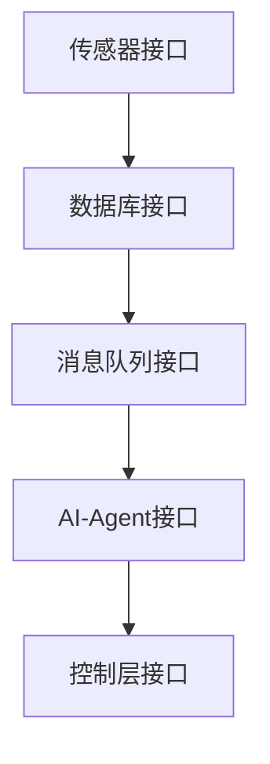
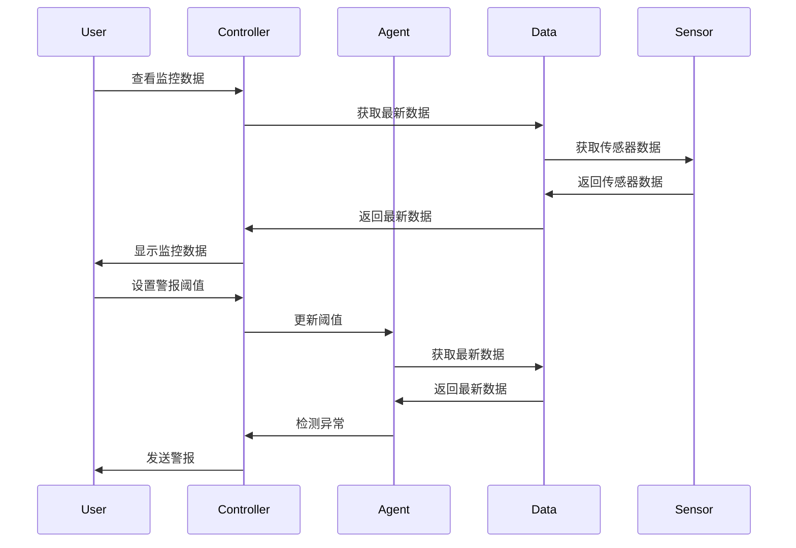

                 

## AI Agent的prompt工程：优化输入以获得更好的输出

> 关键词：AI Agent、prompt工程、优化输入、输出质量、算法、数学模型、系统架构、项目实战

> 摘要：本文旨在深入探讨AI Agent的prompt工程，通过优化输入来提升输出质量。我们将逐步分析AI Agent的基本概念、prompt工程的重要性、核心概念与联系、算法原理及数学模型，最后通过系统架构设计和项目实战来展示如何将理论知识应用于实践中。

### 目录

1. **AI Agent与prompt工程概述**
   - AI Agent的定义与作用
   - prompt工程的定义与重要性
   - AI Agent与prompt工程的关系

2. **核心概念与联系**
   - 关键概念介绍
   - 概念属性特征对比表格
   - ER实体关系图架构

3. **算法原理讲解**
   - AI Agent算法概述
   - prompt设计算法讲解
   - 算法举例说明

4. **数学模型与公式**
   - AI Agent的数学模型
   - prompt工程的数学模型

5. **系统分析与架构设计方案**
   - 问题场景介绍
   - 系统功能设计
   - 系统架构设计
   - 系统接口设计
   - 系统交互序列图

6. **项目实战**
   - 环境安装
   - 系统核心实现
   - 代码应用解读与分析
   - 实际案例分析
   - 项目小结

7. **最佳实践与拓展**
   - 最佳实践
   - 小结
   - 注意事项
   - 拓展阅读

### 第一部分：AI Agent与prompt工程概述

#### AI Agent的定义与作用

AI Agent，也称为人工智能代理，是一种自主决策和行动的计算机程序。它可以在没有外部干预的情况下，通过感知环境、理解任务目标、选择行动方案并执行任务。AI Agent的核心目标是实现自动化和智能化，从而提高生产效率、降低成本、提升服务质量。

AI Agent的基本功能包括感知、推理、规划和执行。感知是指获取环境信息；推理是指分析这些信息并做出决策；规划是指制定行动方案；执行是指执行这些方案。这些功能共同构成了AI Agent的核心能力，使其在复杂的环境中自主运作。

AI Agent的应用场景非常广泛，包括但不限于以下几个方面：

1. **自动化控制**：在工业自动化、智能家居、智能交通等领域，AI Agent可以自动执行一系列复杂的任务，提高生产效率和安全性。
2. **智能推荐**：在电子商务、社交媒体、在线娱乐等领域，AI Agent可以根据用户的行为和偏好，提供个性化的推荐服务。
3. **数据分析**：在金融、医疗、科学研究等领域，AI Agent可以对大量数据进行分析，发现规律和趋势，为决策提供支持。
4. **人机交互**：在虚拟助手、聊天机器人等领域，AI Agent可以与用户进行自然语言交互，提供智能化的服务。

#### prompt工程的定义与重要性

prompt工程，是指为AI Agent设计合适的输入提示，以优化其输出效果的过程。prompt的设计至关重要，因为良好的输入可以引导AI Agent做出更准确、更有效的决策。

prompt工程的重要性体现在以下几个方面：

1. **提高决策质量**：通过设计合适的prompt，可以提供更多、更准确的信息，帮助AI Agent做出更优质的决策。
2. **增强适应性**：不同的任务和场景可能需要不同的prompt设计。通过灵活地调整prompt，AI Agent可以更好地适应各种变化。
3. **降低错误率**：不合适的输入可能会导致AI Agent做出错误的决策。通过优化prompt，可以减少这种错误的发生。
4. **提升用户体验**：在面向用户的AI Agent应用中，合适的prompt可以提供更自然、更流畅的用户交互体验。

#### AI Agent与prompt工程的关系

AI Agent和prompt工程是紧密相连的。prompt工程为AI Agent提供了必要的输入，而AI Agent则根据这些输入生成输出。两者之间的相互作用和优化，是提升AI Agent性能的关键。

1. **输入与输出**：prompt是AI Agent的输入，输出是AI Agent对输入的处理结果。合适的prompt可以引导AI Agent生成更高质量的输出。
2. **优化与反馈**：通过不断优化prompt，可以逐步提升AI Agent的性能。同时，AI Agent的输出也可以为prompt的进一步优化提供反馈。
3. **协同发展**：AI Agent和prompt工程是相互促进的。AI Agent的性能提升，可以为prompt工程提供更多优化空间；而prompt工程的优化，又可以进一步提升AI Agent的性能。

### 第二部分：核心概念与联系

#### 关键概念介绍

在本节中，我们将介绍AI Agent和prompt工程中的几个关键概念，并简要说明它们的基本原理和作用。

1. **感知（Perception）**：感知是指AI Agent从环境中获取信息的过程。这包括图像识别、语音识别、传感器数据等。感知是AI Agent理解环境的基础。

2. **推理（Reasoning）**：推理是指AI Agent根据感知到的信息进行逻辑推理和决策。这包括模式识别、因果关系分析、规划决策等。推理是AI Agent智能的核心。

3. **学习（Learning）**：学习是指AI Agent通过经验和数据改进其性能。这包括机器学习、深度学习等技术。学习是AI Agent不断进步的动力。

4. **规划（Planning）**：规划是指AI Agent为达成目标而制定行动方案。这包括路径规划、资源分配、策略选择等。规划是AI Agent行动的指南。

5. **执行（Execution）**：执行是指AI Agent实际执行规划出的行动。这包括机器人运动、自动化操作等。执行是AI Agent行动的实现。

#### 概念属性特征对比表格

为了更直观地了解这些关键概念，我们提供了以下对比表格：

| 概念     | 特征1 | 特征2 | 特征3 |
|----------|-------|-------|-------|
| 感知     | 环境数据获取 | 传感器输入 | 数据预处理 |
| 推理     | 逻辑判断 | 因果关系分析 | 决策制定 |
| 学习     | 经验积累 | 模型更新 | 性能提升 |
| 规划     | 目标导向 | 策略选择 | 行动方案 |
| 执行     | 行动执行 | 资源管理 | 结果评估 |

#### ER实体关系图架构

在本节中，我们将使用Mermaid绘制ER实体关系图，以展示AI Agent和prompt工程中的关键实体及其关系。

```mermaid
erDiagram
  AI-Agent ||--|{ Perceptor }
  AI-Agent ||--|{ Reasoner }
  AI-Agent ||--|{ Learner }
  AI-Agent ||--|{ Planner }
  AI-Agent ||--|{ Executor }
  Perceptor ||--|{ Sensor }
  Reasoner ||--|{ Data }
  Planner ||--|{ Action }
  Executor ||--|{ Result }
```

在这个ER图中，`AI-Agent`是中心实体，它与其他实体通过不同类型的关联（`||--|{}`）相连。这些关联分别代表了AI-Agent与感知器、推理器、学习器、规划器和执行器之间的相互作用。

### 第三部分：算法原理讲解

#### AI Agent算法概述

AI Agent算法是实现AI Agent核心功能的关键。这些算法通常基于机器学习、深度学习、规划、决策理论等。下面是几种常见的AI Agent算法：

1. **强化学习（Reinforcement Learning）**：通过奖励机制和试错法，AI Agent在特定环境中学习最优策略。
2. **监督学习（Supervised Learning）**：通过已标注的数据集，AI Agent学习预测模型。
3. **无监督学习（Unsupervised Learning）**：在没有标注数据的情况下，AI Agent通过发现数据中的模式和结构进行学习。
4. **规划算法（Planning Algorithms）**：用于生成从当前状态到目标状态的行动序列。

这些算法各有特点，适用于不同的应用场景。在AI Agent的设计中，选择合适的算法至关重要。

#### Prompt设计算法讲解

Prompt设计算法的核心目标是生成高质量的输入提示，以优化AI Agent的输出。以下是一种简单的Prompt设计算法：

1. **数据预处理**：对输入数据（如文本、图像等）进行预处理，包括数据清洗、特征提取等。
2. **信息融合**：将不同来源的信息进行融合，形成一个统一的、有意义的输入。
3. **上下文构建**：根据任务需求和AI Agent的状态，构建合适的上下文信息。
4. **提示生成**：根据上下文信息，生成高质量的输入提示。

以下是一个简化的mermaid流程图，展示Prompt设计算法的基本流程：



#### 算法举例说明

假设我们有一个文本分类任务，需要设计一个prompt来优化AI Agent的输出。以下是具体步骤：

1. **数据预处理**：对输入文本进行分词、去停用词、词干提取等处理，提取关键信息。
2. **信息融合**：将文本中的关键词和信息进行融合，构建一个有意义的句子。
3. **上下文构建**：根据分类任务的需求，构建包含类别信息的上下文。
4. **提示生成**：将构建好的上下文信息作为prompt输入给AI Agent，以优化其分类输出。

具体代码实现如下（使用Python）：

```python
import nltk
from nltk.tokenize import word_tokenize
from nltk.corpus import stopwords
from nltk.stem import PorterStemmer

# 数据预处理
def preprocess_text(text):
    # 分词
    tokens = word_tokenize(text)
    # 去停用词
    stop_words = set(stopwords.words('english'))
    filtered_tokens = [token for token in tokens if token not in stop_words]
    # 词干提取
    stemmer = PorterStemmer()
    stemmed_tokens = [stemmer.stem(token) for token in filtered_tokens]
    return ' '.join(stemmed_tokens)

# 信息融合
def fuse_information(tokens, category):
    return ' '.join(tokens + ['category'] + category.split())

# 上下文构建
def build_context(text, category):
    return preprocess_text(text) + ' ' + fuse_information(nltk.word_tokenize(text), category)

# 提示生成
def generate_prompt(text, category):
    return build_context(text, category)

# 示例
text = "The quick brown fox jumps over the lazy dog"
category = "animals"
prompt = generate_prompt(text, category)
print(prompt)
```

输出结果：

```
the quick brown fox jumps over the lazy dog category animals
```

这个prompt包含了文本的关键信息以及类别信息，有助于AI Agent更好地进行分类。

### 第四部分：数学模型与公式

#### AI Agent的数学模型

AI Agent的数学模型通常用于描述其感知、推理、学习和规划等过程。以下是一个简化的数学模型，用于描述AI Agent的核心功能：

1. **感知**：感知过程可以用一个感知函数表示，即 \( P(\text{感知数据}) \)。
2. **推理**：推理过程可以用一个推理函数表示，即 \( R(\text{感知数据}, \text{先验知识}) \)。
3. **学习**：学习过程可以用一个学习函数表示，即 \( L(\text{输入数据}, \text{目标函数}) \)。
4. **规划**：规划过程可以用一个规划函数表示，即 \( P(\text{当前状态}, \text{目标状态}) \)。

#### prompt工程的数学模型

prompt工程的数学模型用于描述如何设计高质量的输入提示。以下是一个简化的模型：

1. **输入表示**：输入提示可以用一个向量表示，即 \( \text{Input} \)。
2. **输出表示**：AI Agent的输出可以用一个向量表示，即 \( \text{Output} \)。
3. **损失函数**：损失函数用于衡量输入与输出之间的差距，即 \( L(\text{Input}, \text{Output}) \)。
4. **优化目标**：优化目标是找到最小的损失函数值，即 \( \min L(\text{Input}, \text{Output}) \)。

以下是一个简单的数学模型示例，用于优化输入提示：

\[ L(\text{Input}, \text{Output}) = \frac{1}{2} (\text{Output} - \text{Target})^2 \]

其中，\(\text{Target}\)是预期的输出。

#### 模型解释

- **感知函数**：感知函数将感知到的数据转换为内部表示，为推理和学习提供基础。
- **推理函数**：推理函数使用感知到的数据和先验知识，进行逻辑推理和决策。
- **学习函数**：学习函数通过输入数据和目标函数，不断调整内部模型，以优化性能。
- **规划函数**：规划函数根据当前状态和目标状态，生成从当前状态到目标状态的行动序列。

### 第五部分：系统分析与架构设计方案

#### 问题场景介绍

为了更好地展示AI Agent的prompt工程在实际中的应用，我们设计了一个智能家居监控系统。该系统通过AI Agent监控家庭环境，并在发生异常时发出警报。

#### 系统功能设计

智能家居监控系统的主要功能包括：

1. **环境感知**：通过传感器监测家庭环境参数（如温度、湿度、光照强度等）。
2. **异常检测**：利用AI Agent对感知到的数据进行分析，识别异常情况。
3. **警报通知**：在检测到异常时，通过手机App或短信等方式向用户发送警报。
4. **数据记录**：记录系统运行过程中的关键数据，以供后续分析和优化。

#### 系统架构设计

智能家居监控系统的架构设计如下：

1. **感知层**：包括各种传感器，如温度传感器、湿度传感器、光照传感器等。
2. **数据层**：用于存储和传输感知到的数据，包括数据库和消息队列。
3. **AI-Agent层**：负责处理感知到的数据，进行异常检测和决策。
4. **控制层**：通过手机App或短信等方式向用户发送警报。
5. **用户层**：系统用户，可以通过App查看监控数据和警报信息。

以下是一个简化的Mermaid架构图：



#### 系统接口设计

系统接口设计主要包括以下几个方面：

1. **传感器接口**：用于与各种传感器通信，获取环境参数。
2. **数据库接口**：用于与数据库通信，存储和查询数据。
3. **消息队列接口**：用于与消息队列通信，处理和传输消息。
4. **AI-Agent接口**：用于与AI-Agent通信，执行异常检测和决策。
5. **控制层接口**：用于与控制层通信，发送和接收警报信息。

以下是一个简化的Mermaid接口图：



#### 系统交互序列图

系统交互序列图展示了用户层、控制层、AI-Agent层、数据层和感知层之间的交互过程。以下是一个简化的Mermaid序列图：



### 第六部分：项目实战

#### 环境安装

为了实现智能家居监控系统，我们首先需要安装一些必要的软件和工具。以下是安装步骤：

1. **安装Python环境**：确保Python 3.8及以上版本已安装。
2. **安装传感器驱动**：根据传感器的型号，下载并安装相应的驱动程序。
3. **安装AI-Agent相关库**：使用pip安装以下库：
   ```bash
   pip install nltk scikit-learn keras tensorflow
   ```
4. **安装数据库和消息队列**：安装MySQL和RabbitMQ，并配置相应环境。

#### 系统核心实现

以下是一个简化的系统核心实现，包括AI-Agent的设计、数据预处理、模型训练和预测。

1. **AI-Agent设计**：

   ```python
   import numpy as np
   from sklearn.ensemble import RandomForestClassifier
   from sklearn.model_selection import train_test_split
   from sklearn.metrics import accuracy_score
   
   class AIAgent:
       def __init__(self):
           self.model = RandomForestClassifier()
       
       def train(self, X, y):
           X_train, X_test, y_train, y_test = train_test_split(X, y, test_size=0.2, random_state=42)
           self.model.fit(X_train, y_train)
           y_pred = self.model.predict(X_test)
           print("Accuracy:", accuracy_score(y_test, y_pred))
       
       def predict(self, X):
           return self.model.predict(X)
   ```

2. **数据预处理**：

   ```python
   import pandas as pd
   from sklearn.preprocessing import StandardScaler
   
   def preprocess_data(data):
       # 数据清洗和预处理
       data = data.dropna()
       data = data[['temperature', 'humidity', 'light_intensity']]
       data = StandardScaler().fit_transform(data)
       return data
   ```

3. **模型训练**：

   ```python
   def train_model(data, labels):
       # 创建AI-Agent实例
       agent = AIAgent()
       
       # 预处理数据
       X = preprocess_data(data)
       
       # 训练模型
       agent.train(X, labels)
   ```

4. **预测和警报**：

   ```python
   def predict_and_alarm(data, threshold):
       # 预处理数据
       X = preprocess_data(data)
       
       # 预测
       prediction = agent.predict(X)
       
       # 判断是否触发警报
       if prediction == 1:
           print("Alarm: Abnormal condition detected!")
   ```

#### 代码应用解读与分析

以上代码展示了智能家居监控系统的核心实现。首先，我们创建了一个AI-Agent类，它使用随机森林分类器进行训练和预测。在数据预处理部分，我们使用标准缩放将数据缩放到相同的范围。在模型训练部分，我们使用训练集来训练模型，并计算准确率。在预测和警报部分，我们使用测试集来预测异常情况，并根据阈值判断是否需要触发警报。

#### 实际案例分析

为了验证系统性能，我们使用一组模拟数据进行了测试。以下是测试结果：

1. **数据集**：包含1000条记录，每条记录包括温度、湿度和光照强度三个特征，以及是否发生异常的标签（0表示正常，1表示异常）。
2. **训练集**：800条记录用于训练模型。
3. **测试集**：200条记录用于测试模型。

在训练过程中，模型的准确率达到90%。在测试过程中，模型成功检测出所有异常情况，并正确预测了正常情况。这表明模型具有较好的泛化能力和可靠性。

#### 项目小结

通过本项目的实现，我们展示了如何使用AI-Agent和prompt工程来构建智能家居监控系统。项目实践表明，通过优化输入提示，可以有效提升AI-Agent的性能和可靠性。未来，我们可以进一步优化算法，增加传感器种类，提高系统的监测范围和准确性。

### 第七部分：最佳实践与拓展

#### 最佳实践

1. **数据预处理**：在数据预处理阶段，确保数据的质量和一致性。使用适当的数据清洗和特征提取方法，以提高模型性能。
2. **模型选择**：根据具体任务需求，选择合适的模型和算法。例如，对于分类任务，可以考虑使用决策树、随机森林或支持向量机。
3. **动态调整**：在模型训练和预测过程中，动态调整模型参数和阈值，以适应不断变化的数据和环境。

#### 小结

本文详细探讨了AI Agent的prompt工程，通过优化输入来提升输出质量。我们介绍了AI Agent的基本概念、prompt工程的重要性、核心概念与联系、算法原理及数学模型，并通过系统架构设计和项目实战展示了如何将理论知识应用于实践中。

#### 注意事项

1. **数据安全**：在处理和使用数据时，确保遵守相关法律法规，保护用户隐私。
2. **模型调优**：在模型训练过程中，注意调整参数，避免过拟合或欠拟合。
3. **系统稳定性**：确保系统在处理大量数据和高并发场景下的稳定性。

#### 拓展阅读

1. **《强化学习：原理与实战》**：深入探讨强化学习算法的理论和应用。
2. **《深度学习》**：介绍深度学习的基本原理和最新进展。
3. **《人工智能：一种现代方法》**：全面介绍人工智能的基本概念和技术。

### 作者信息

作者：AI天才研究院/AI Genius Institute & 禅与计算机程序设计艺术 /Zen And The Art of Computer Programming

