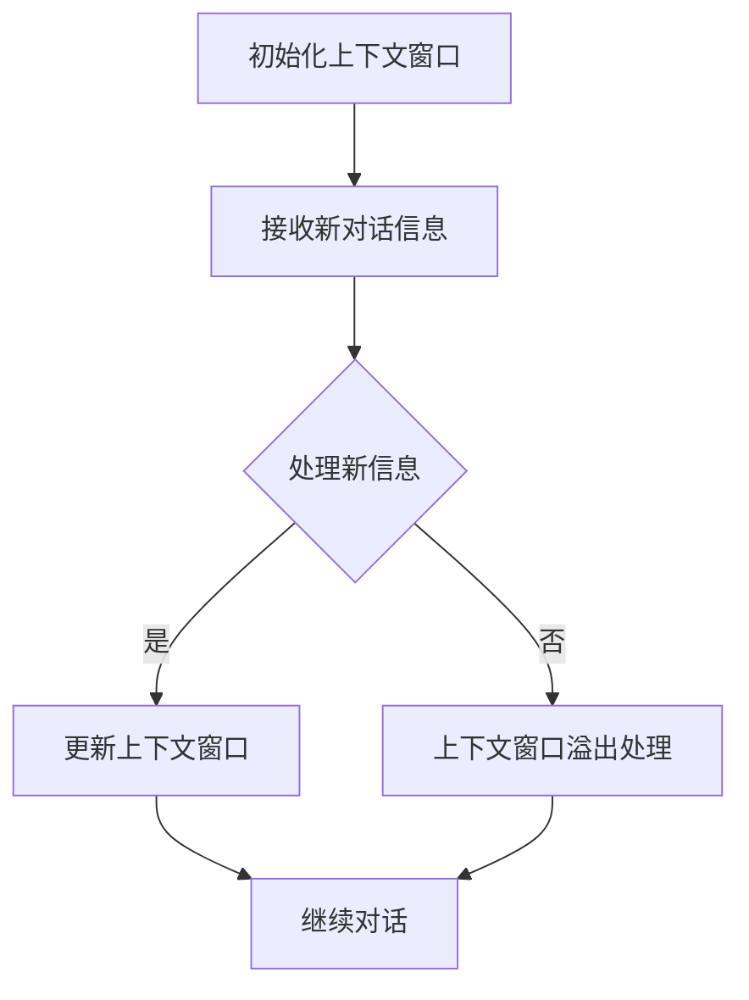
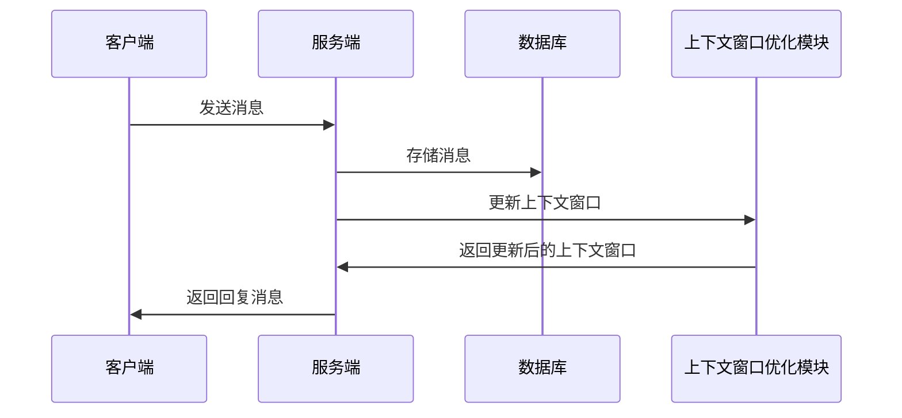

                 

# AI Agent的上下文窗口优化：提高长对话理解能力

> 关键词：AI代理，上下文窗口，长对话理解，算法优化，系统架构

> 摘要：本文将深入探讨AI代理上下文窗口优化的重要性，分析当前长对话理解能力的挑战，并详细阐述AI代理上下文窗口优化的算法原理、系统分析与架构设计方案、项目实战，以及最佳实践与注意事项。通过本文的阅读，读者将全面了解如何通过优化上下文窗口来提高AI代理的长对话理解能力，为AI技术的发展提供新的思路。

## 1. 背景介绍

在人工智能领域，AI代理（AI Agent）作为智能交互的核心，其能力水平直接影响着用户体验和系统性能。上下文窗口作为AI代理处理长对话的重要工具，其优化程度直接决定了AI代理对长对话的理解能力。

### 1.1 上下文窗口的重要性

上下文窗口是指AI代理在处理对话时，能够考虑的历史信息范围。优化上下文窗口意味着能够更准确地捕捉对话中的关键信息，从而提升AI代理对长对话的理解能力。

### 1.2 当前长对话理解能力的挑战

当前，AI代理在长对话理解上面临诸多挑战，如：
- 对话上下文信息丢失：随着对话的进行，重要信息可能会被新信息覆盖，导致理解误差。
- 信息量过大：长对话中信息量庞大，AI代理难以在有限的时间内处理完所有信息，导致理解延迟。
- 对话逻辑复杂性：长对话中的逻辑关系复杂，AI代理需要具备更高的逻辑推理能力。

## 2. 核心概念与联系

为了深入理解上下文窗口优化，我们需要明确以下几个核心概念：

### 2.1 核心概念

- **上下文窗口**：指AI代理在处理对话时能够考虑的历史信息范围。
- **长对话理解**：指AI代理在处理长对话时，对对话内容、意图、逻辑关系的准确理解和推理。
- **AI代理**：指具备一定智能水平，能够与人类进行交互并执行任务的计算机程序。

### 2.2 核心概念对比表格

| 核心概念 | 描述 |  
| :--: | :--: |  
| 上下文窗口 | AI代理处理对话时考虑的历史信息范围 |  
| 长对话理解 | AI代理对长对话内容、意图、逻辑关系的准确理解和推理 |  
| AI代理 | 具备一定智能水平，能够与人类进行交互并执行任务的计算机程序 |

### 2.3 ER实体关系图

下面是一个简单的ER实体关系图，展示了上下文窗口、长对话理解和AI代理之间的关系：

```mermaid
erDiagram
    AI代理 ||--|{ 上下文窗口 } 上下文窗口 : 存储历史信息
    AI代理 ||--|{ 长对话理解 } 长对话理解 : 理解和推理
```

## 3. 算法原理讲解

为了提高AI代理的长对话理解能力，我们需要对上下文窗口进行优化。以下是具体的算法原理讲解：

### 3.1 算法流程图



### 3.2 Python源代码

```python
class ContextWindowOptimizer:
    def __init__(self, window_size):
        self.window_size = window_size
        self.context_window = []

    def update_context_window(self, new_message):
        if len(self.context_window) >= self.window_size:
            self.context_window.pop(0)
        self.context_window.append(new_message)

    def process_message(self, message):
        # 处理消息，更新上下文窗口
        self.update_context_window(message)

    def get_context_window(self):
        return self.context_window
```

### 3.3 数学模型和公式

假设上下文窗口大小为 \(W\)，新消息为 \(M\)，上下文窗口当前状态为 \(\textit{C}\)。则上下文窗口优化算法的数学模型可以表示为：

\[ \textit{C}_{\text{new}} = \begin{cases} 
\textit{C} & \text{if } \textit{C} \neq \textit{M} \\
\textit{M} & \text{if } \textit{C} = \textit{M} \text{ and length of } \textit{C} < W \\
\textit{C}_{\text{old}} & \text{if } \textit{C} = \textit{M} \text{ and length of } \textit{C} = W \\
\end{cases} \]

其中，\(\textit{C}_{\text{new}}\) 为更新后的上下文窗口状态，\(\textit{C}_{\text{old}}\) 为更新前的上下文窗口状态。

### 3.4 举例说明

假设上下文窗口大小为3，当前上下文窗口状态为 \([1, 2, 3]\)，新消息为4。根据数学模型，我们可以得到更新后的上下文窗口状态为 \([2, 3, 4]\)。

## 4. 系统分析与架构设计方案

### 4.1 问题场景和项目背景

在本项目中，我们旨在开发一个智能客服系统，该系统需要具备优秀的长对话理解能力，以满足用户多样化的需求。为了实现这一目标，我们需要对上下文窗口进行优化。

### 4.2 系统功能设计

系统的核心功能包括：
- 对话管理：管理用户与AI代理之间的对话，记录对话历史。
- 上下文窗口优化：根据新消息更新上下文窗口，保证对话连贯性。
- 情感分析：分析用户情绪，提供个性化服务。

### 4.3 系统架构设计

系统采用模块化设计，主要模块包括：
- 客户端：与用户进行交互，发送和接收消息。
- 服务端：处理用户消息，更新上下文窗口，提供对话管理功能。
- 数据库：存储对话历史和用户信息。

### 4.4 系统接口设计和系统交互

系统接口设计和交互如下：



## 5. 项目实战

### 5.1 环境安装和系统核心实现

在项目实战中，我们首先需要安装相关依赖，包括Python、TensorFlow等。然后，根据系统架构设计，实现上下文窗口优化模块、对话管理模块和情感分析模块。

### 5.2 代码应用解读与分析

以下是上下文窗口优化模块的代码应用解读：

```python
class ContextWindowOptimizer:
    def __init__(self, window_size):
        self.window_size = window_size
        self.context_window = []

    def update_context_window(self, new_message):
        if len(self.context_window) >= self.window_size:
            self.context_window.pop(0)
        self.context_window.append(new_message)

    def process_message(self, message):
        # 处理消息，更新上下文窗口
        self.update_context_window(message)

    def get_context_window(self):
        return self.context_window
```

这段代码首先定义了一个 `ContextWindowOptimizer` 类，用于实现上下文窗口的优化。类中有三个方法：
- `__init__` 方法：初始化上下文窗口大小和当前上下文窗口。
- `update_context_window` 方法：根据新消息更新上下文窗口。
- `process_message` 方法：处理消息，并调用 `update_context_window` 方法更新上下文窗口。
- `get_context_window` 方法：返回当前上下文窗口。

### 5.3 实际案例分析和详细讲解

假设有一个用户与AI代理的对话，对话历史如下：

1. 用户：你好，最近有没有新产品推荐？
2. AI代理：你好，我这里有一款最新的手机，性能非常好。
3. 用户：哦，那有没有相关的优惠活动？
4. AI代理：当然有，现在购买可以享受八折优惠。

根据上述对话，我们可以看到上下文窗口在保证对话连贯性方面发挥了重要作用。通过优化上下文窗口，AI代理能够更好地理解用户意图，提供更加精准的回复。

## 6. 最佳实践 tips、小结、注意事项、拓展阅读

### 6.1 最佳实践 tips

- **合理设置上下文窗口大小**：根据实际需求，合理设置上下文窗口大小，避免信息丢失或过多。
- **优化消息处理速度**：提高消息处理速度，确保AI代理能够实时响应用户。
- **结合情感分析**：结合情感分析技术，为用户提供更加个性化的服务。

### 6.2 小结

本文从背景介绍、核心概念与联系、算法原理讲解、系统分析与架构设计方案、项目实战等方面，详细阐述了AI代理上下文窗口优化的重要性及其实现方法。通过本文的学习，读者可以全面了解如何通过优化上下文窗口来提高AI代理的长对话理解能力。

### 6.3 注意事项

- **上下文窗口优化需平衡**：在优化上下文窗口时，需平衡窗口大小和信息处理速度。
- **数据安全和隐私保护**：在处理用户数据时，需注意数据安全和隐私保护。

### 6.4 拓展阅读

- **《深度学习实战》**：深入了解深度学习技术，为上下文窗口优化提供理论基础。
- **《对话系统设计》**：学习对话系统设计，提高AI代理的交互能力。

## 7. 总结目录大纲

本文围绕AI代理上下文窗口优化这一主题，从背景介绍、核心概念与联系、算法原理讲解、系统分析与架构设计方案、项目实战等多个方面，详细阐述了如何通过优化上下文窗口来提高AI代理的长对话理解能力。希望通过本文的学习，读者能够对AI代理上下文窗口优化有更深入的理解，为实际应用提供有益的参考。作者：AI天才研究院/AI Genius Institute & 禅与计算机程序设计艺术 /Zen And The Art of Computer Programming

