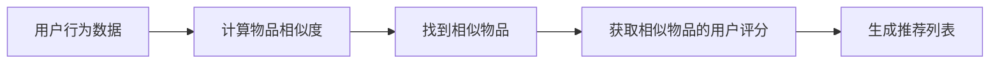
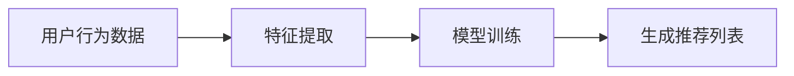

                 

### AI Agent的个性化与定制化实现

在人工智能（AI）迅速发展的时代，AI Agent 作为智能系统的核心组件，承担着大量的任务执行和决策支持。随着应用场景的多样化和用户需求的个性化，如何实现 AI Agent 的个性化与定制化变得至关重要。本文将围绕这一主题，系统地探讨 AI Agent 个性化与定制化的实现方法。

### 关键词

- **AI Agent**
- **个性化与定制化**
- **用户数据**
- **算法实现**
- **系统架构**
- **最佳实践**

### 摘要

本文旨在深入探讨 AI Agent 的个性化与定制化实现，从核心概念、算法原理、系统设计与项目实战等方面进行详细分析。通过逐步推理与讲解，帮助读者理解 AI Agent 的构建与优化，掌握实现个性化与定制化的关键技术，为实际应用提供理论指导和实践参考。

## 第1章 AI Agent的定义与背景

### 1.1 AI Agent的定义

AI Agent，即人工智能代理，是指能够模拟、扩展或代替人类在某个特定环境或任务中做出决策和执行行动的智能实体。它通常具有以下特征：

1. **自主性**：AI Agent能够根据环境和目标自主地做出决策。
2. **适应性**：AI Agent能够根据外部环境和用户需求进行自适应调整。
3. **交互性**：AI Agent能够与用户和环境进行有效的信息交互。

AI Agent的应用范围广泛，从自动驾驶、智能家居到智能客服、推荐系统等，都离不开AI Agent的身影。

### 1.2 问题的提出与解决

#### 个性化与定制化需求

在当前信息化社会中，用户对服务的需求越来越多样化、个性化。传统的AI Agent往往无法满足这种需求，因为它们通常是基于通用模型设计的，缺乏对特定用户和场景的深入理解。例如，在推荐系统中，用户可能对某些类型的商品或内容有特别的偏好，但这些偏好往往没有被充分考虑。

#### AI Agent面临的挑战

1. **数据多样性**：用户数据类型繁多，如何有效地整合和处理这些数据是一个挑战。
2. **个性化推荐**：如何根据用户的兴趣和行为进行精准推荐，同时保证推荐内容的新鲜度和多样性。
3. **系统适应性**：如何使AI Agent能够根据用户的行为模式和环境变化进行实时调整。

#### 本书的目标与内容安排

本书的目标是探讨 AI Agent 的个性化与定制化实现，具体内容安排如下：

1. **核心概念与联系**：介绍与AI Agent相关的核心概念，并分析这些概念之间的联系。
2. **算法原理讲解**：详细讲解实现个性化与定制化的关键算法，包括数据挖掘、机器学习和深度学习等。
3. **系统分析与架构设计**：描述系统的功能设计、架构设计、接口设计和系统交互。
4. **项目实战**：通过实际项目，展示如何实现AI Agent的个性化与定制化。
5. **最佳实践与总结**：提供实现AI Agent个性化与定制化的最佳实践建议和小结。

### 1.3 核心概念与联系

在AI Agent的个性化与定制化实现过程中，以下几个核心概念是至关重要的：

1. **个性化**：指AI Agent能够根据用户的特定需求和偏好进行定制化服务。
2. **定制化**：指AI Agent能够根据用户的具体环境和任务需求进行自适应调整。
3. **用户数据**：用户的历史行为、兴趣偏好和反馈数据是AI Agent个性化与定制化的基础。
4. **算法**：用于处理用户数据和实现个性化推荐的关键技术。
5. **系统架构**：AI Agent的体系结构和交互机制，决定了其性能和可扩展性。

表1.1 个性化与定制化概念对比

| 概念     | 定义                                                         | 关联特性                           |
| -------- | ------------------------------------------------------------ | ---------------------------------- |
| 个性化   | AI Agent根据用户的特定需求和偏好提供服务                       | 针对性、个性化推荐、用户反馈处理   |
| 定制化   | AI Agent根据用户的具体环境和任务需求进行自适应调整             | 灵活性、环境适应性、任务优化       |
| 用户数据 | 用户的历史行为、兴趣偏好和反馈数据                            | 数据质量、数据整合、数据隐私保护   |
| 算法     | 用于处理用户数据和实现个性化推荐的关键技术                     | 模型选择、特征提取、模型优化       |
| 系统架构 | AI Agent的体系结构和交互机制，决定了其性能和可扩展性           | 模块化、分布式、高可用性           |

### 1.4 AI Agent的ER图

图1.1展示了AI Agent的核心概念之间的关系。用户数据通过采集和处理，用于训练和优化个性化推荐算法，进而影响系统的功能设计和性能表现。

```mermaid
erDiagram
  UserData ||--|{ AIAgent } : 采集和处理
  Personalization ||--|{ AIAgent } : 实现个性化服务
  Customization ||--|{ AIAgent } : 实现定制化调整
  Algorithm ||--|{ AIAgent } : 推荐和优化
  SystemArchitecture ||--|{ AIAgent } : 设计和实现
```

通过以上分析，我们可以看到，实现AI Agent的个性化与定制化需要多方面的协同工作，包括用户数据的管理、算法的选择与优化，以及系统架构的设计与实现。接下来，我们将逐步深入探讨这些关键环节。

## 第2章 核心概念与联系

在实现AI Agent的个性化与定制化过程中，核心概念的理解和联系分析是至关重要的。以下是几个核心概念及其相互关系的详细介绍。

### 2.1 个性化

个性化是指AI Agent能够根据用户的特定需求和偏好提供定制化服务。这涉及到对用户数据的深度挖掘和用户行为的精确分析。个性化的核心在于：

1. **用户需求识别**：通过分析用户的历史行为和反馈，识别出用户的偏好和需求。
2. **推荐算法**：基于用户需求和偏好，利用推荐算法生成个性化的内容或服务。
3. **用户反馈**：通过用户对推荐内容的反馈，持续优化推荐系统，提高个性化程度。

### 2.2 定制化

定制化是指AI Agent能够根据用户的具体环境和任务需求进行自适应调整。与个性化不同，定制化更强调对用户特定情境的响应。定制化的关键在于：

1. **环境感知**：AI Agent需要具备环境感知能力，理解用户所处的具体环境和情境。
2. **任务导向**：根据用户当前的任务需求，动态调整系统功能和算法策略。
3. **实时调整**：AI Agent需要能够实时响应用户行为和环境变化，提供个性化的服务和支持。

### 2.3 用户数据

用户数据是AI Agent个性化与定制化实现的基础。用户数据包括：

1. **历史行为数据**：用户在系统中的历史操作记录，如浏览、购买、评价等。
2. **兴趣偏好数据**：用户对特定内容或服务的偏好，如喜好类型、标签等。
3. **反馈数据**：用户对系统推荐或服务的反馈，如点击、点赞、评价等。

用户数据的质量和完整性直接影响AI Agent的个性化与定制化效果。因此，数据采集、处理和存储是AI Agent实现的关键环节。

### 2.4 算法

算法是实现AI Agent个性化与定制化的核心技术。常见的算法包括：

1. **协同过滤算法**：通过分析用户之间的相似性，推荐用户可能感兴趣的内容。
2. **基于内容的推荐算法**：根据用户的历史行为和兴趣标签，推荐相关内容。
3. **深度学习算法**：利用神经网络模型，从用户数据中学习用户的兴趣和行为模式。

选择合适的算法，并对其进行优化，是提高AI Agent个性化与定制化效果的关键。

### 2.5 系统架构

系统架构是AI Agent实现个性化与定制化的基础设施。一个高效的系统架构应包括：

1. **数据层**：负责数据的采集、存储和管理，为算法提供数据支持。
2. **算法层**：实现个性化与定制化的算法，包括推荐算法、优化算法等。
3. **服务层**：提供与用户交互的接口，将个性化与定制化的结果呈现给用户。
4. **平台层**：支持系统的运行和管理，包括分布式计算、容错机制等。

通过以上分析，我们可以看到，个性化与定制化、用户数据、算法和系统架构是AI Agent实现的核心要素，它们相互联系、相互影响，共同决定了AI Agent的性能和效果。

### 表格：个性化与定制化概念对比

| 对比项        | 个性化                             | 定制化                             |
| ------------- | ---------------------------------- | ---------------------------------- |
| 定义          | 根据用户特定需求和偏好提供服务     | 根据用户具体环境和任务需求调整     |
| 关键因素      | 用户数据、推荐算法、用户反馈       | 环境感知、任务导向、实时调整       |
| 主要目标      | 提高用户体验、满足个性化需求       | 提高系统适应性、实现任务优化       |
| 应用场景      | 推荐系统、个性化广告、智能客服     | 自动驾驶、智能家居、工业自动化     |

通过这张表格，我们可以更清晰地理解个性化与定制化的区别和联系，为后续章节的深入探讨奠定基础。

### ER图：AI Agent核心概念关系

图2.1展示了AI Agent核心概念之间的实体关系，包括用户数据、个性化、定制化、算法和系统架构等。

```mermaid
erDiagram
  UserData ||--|{ Personalization } : 提供数据支持
  UserData ||--|{ Customization } : 提供数据支持
  Personalization ||--|{ Algorithm } : 实现个性化
  Personalization ||--|{ SystemArchitecture } : 设计个性化系统
  Customization ||--|{ Algorithm } : 实现定制化
  Customization ||--|{ SystemArchitecture } : 设计定制化系统
  Algorithm ||--|{ SystemArchitecture } : 集成算法
```

通过ER图，我们可以直观地看到各个核心概念之间的关联，为后续章节的系统设计与实现提供了明确的指导。

## 第3章 算法原理讲解

在实现AI Agent的个性化与定制化过程中，算法的原理讲解是至关重要的。本章节将介绍两种关键算法：协同过滤算法和深度学习推荐算法。我们将通过mermaid流程图和Python源代码，详细阐述这些算法的原理，并使用LaTeX公式展示相关的数学模型。

### 3.1 协同过滤算法

协同过滤算法是一种基于用户之间相似度的推荐方法。它主要分为两种类型：基于用户的协同过滤（User-based Collaborative Filtering，UBCF）和基于物品的协同过滤（Item-based Collaborative Filtering，IBCF）。

#### 3.1.1 基于用户的协同过滤算法

基于用户的协同过滤算法通过计算用户之间的相似度，找到与目标用户相似的其他用户，然后推荐这些用户喜欢的项目。以下是算法的mermaid流程图：


算法的步骤如下：

1. **计算用户相似度**：使用余弦相似度或皮尔逊相关系数计算用户之间的相似度。
   \[ \text{similarity}(u, v) = \frac{\sum_{i \in R} x_{ui} x_{vi}}{\sqrt{\sum_{i \in R} x_{ui}^2} \sqrt{\sum_{i \in R} x_{vi}^2}} \]
   其中，\( u \)和\( v \)是两个用户，\( R \)是两个用户共同评价过的项目的集合，\( x_{ui} \)和\( x_{vi} \)分别是用户\( u \)和\( v \)对项目\( i \)的评价。

2. **找到相似用户**：根据计算出的相似度，选择相似度最高的几个用户作为邻居。

3. **获取相似用户喜欢的项目**：从这些邻居用户的历史行为中提取他们喜欢但目标用户未评价的项目。

4. **生成推荐列表**：对提取的项目进行加权平均，生成推荐列表。

#### Python源代码示例

```python
import numpy as np

def compute_cosine_similarity(ratings1, ratings2):
    dot_product = np.dot(ratings1, ratings2)
    norm1 = np.linalg.norm(ratings1)
    norm2 = np.linalg.norm(ratings2)
    return dot_product / (norm1 * norm2)

# 假设用户A和用户B的历史评分数据如下
user_a_ratings = np.array([1, 2, 1, 5, 4])
user_b_ratings = np.array([0, 2, 1, 5, 3])

similarity = compute_cosine_similarity(user_a_ratings, user_b_ratings)
print("Cosine similarity: ", similarity)
```

#### 3.1.2 基于物品的协同过滤算法

基于物品的协同过滤算法通过计算物品之间的相似度，找到与目标物品相似的其他物品，然后推荐给用户。其mermaid流程图如下：



算法的步骤如下：

1. **计算物品相似度**：使用余弦相似度或欧氏距离计算物品之间的相似度。
   \[ \text{similarity}(i, j) = \frac{\sum_{u \in U} x_{ui} x_{uj}}{\sqrt{\sum_{u \in U} x_{ui}^2} \sqrt{\sum_{u \in U} x_{uj}^2}} \]
   其中，\( i \)和\( j \)是两个物品，\( U \)是评价过这两个物品的用户集合，\( x_{ui} \)和\( x_{uj} \)分别是用户对物品\( i \)和\( j \)的评分。

2. **找到相似物品**：根据计算出的相似度，选择相似度最高的几个物品作为邻居。

3. **获取相似物品的用户评分**：从这些邻居物品的历史评分中提取用户的评分。

4. **生成推荐列表**：对提取的用户评分进行加权平均，生成推荐列表。

#### Python源代码示例

```python
def compute_item_similarity(ratings_matrix, item1, item2):
    user_ratings = ratings_matrix[:, item1] * ratings_matrix[:, item2]
    user_ratings_mean = ratings_matrix.mean(axis=1)
    item1_mean, item2_mean = user_ratings_mean[item1], user_ratings_mean[item2]
    numerator = (user_ratings - item1_mean) * (user_ratings - item2_mean)
    denominator = np.sqrt(((user_ratings - item1_mean)**2).sum() * ((user_ratings - item2_mean)**2).sum())
    return numerator / (denominator + 1e-9)

# 假设用户评分数据矩阵如下
ratings_matrix = np.array([[1, 2, 0],
                           [2, 1, 0],
                           [0, 1, 2],
                           [1, 1, 0]])

similarity = compute_item_similarity(ratings_matrix, 0, 1)
print("Item similarity: ", similarity)
```

### 3.2 深度学习推荐算法

深度学习推荐算法通过构建神经网络模型，从用户数据和物品特征中学习推荐策略。常见的方法包括基于模型的协同过滤（Model-based Collaborative Filtering，MCF）和基于神经网络的协同过滤（Neural Collaborative Filtering，NCF）。

#### 3.2.1 基于模型的协同过滤算法

基于模型的协同过滤算法将用户和物品的特征映射到低维空间，然后使用这些特征生成推荐。以下是算法的mermaid流程图：



算法的步骤如下：

1. **特征提取**：将用户和物品的特征表示为向量，如用户的行为、兴趣标签、历史评分等。
2. **模型训练**：使用这些特征训练一个预测模型，如矩阵分解、因子分解机等。
3. **生成推荐列表**：使用训练好的模型预测用户对未评价物品的评分，生成推荐列表。

#### Python源代码示例

```python
from sklearn.decomposition import NMF
from sklearn.model_selection import train_test_split

# 假设用户评分数据如下
ratings = np.array([[1, 0, 1],
                    [0, 1, 1],
                    [1, 1, 0]])

# 将数据分为训练集和测试集
X_train, X_test = train_test_split(ratings, test_size=0.2, random_state=42)

# 使用NMF进行模型训练
model = NMF(n_components=2, random_state=42)
model.fit(X_train)

# 生成预测
predictions = model.predict(X_test)
print(predictions)
```

#### 3.2.2 基于神经网络的协同过滤算法

基于神经网络的协同过滤算法通过构建多层神经网络，直接从用户和物品的特征中学习推荐策略。以下是算法的mermaid流程图：


算法的步骤如下：

1. **特征提取**：将用户和物品的特征表示为向量。
2. **模型训练**：使用这些特征训练一个多层的神经网络，如多层感知机（MLP）。
3. **生成推荐列表**：使用训练好的模型预测用户对未评价物品的评分，生成推荐列表。

#### Python源代码示例

```python
import tensorflow as tf
from tensorflow.keras.layers import Dense, Embedding, Dot, Flatten
from tensorflow.keras.models import Model

# 假设用户和物品的特征矩阵如下
user_features = np.array([[1, 0, 1],
                          [0, 1, 1],
                          [1, 1, 0]])

item_features = np.array([[0, 1, 1],
                          [1, 1, 0],
                          [0, 1, 0]])

# 构建模型
user_input = Embedding(input_dim=user_features.shape[0], output_dim=10)(user_features)
item_input = Embedding(input_dim=item_features.shape[0], output_dim=10)(item_features)
dot_product = Dot(axes=1)([user_input, item_input])
flatten = Flatten()(dot_product)
output = Dense(1, activation='sigmoid')(flatten)

model = Model(inputs=[user_input, item_input], outputs=output)
model.compile(optimizer='adam', loss='binary_crossentropy', metrics=['accuracy'])

# 训练模型
model.fit([user_features, item_features], ratings, epochs=10, batch_size=16)

# 生成预测
predictions = model.predict([user_features, item_features])
print(predictions)
```

通过以上讲解，我们可以看到，协同过滤算法和深度学习推荐算法在实现AI Agent的个性化与定制化过程中具有重要作用。协同过滤算法简单有效，适合处理大规模用户和物品数据；深度学习推荐算法则能够通过复杂的模型结构捕捉用户和物品的深层特征，提高推荐效果。

## 第4章 系统分析与架构设计

### 4.1 问题场景介绍

在本章中，我们将探讨一个典型的场景——个性化推荐系统。在这个场景中，AI Agent需要为用户提供高度个性化的推荐服务。用户在系统中进行各种操作，如浏览、搜索、购买和评价，这些行为数据将被AI Agent用来学习和理解用户的兴趣和偏好。系统需要根据用户的行为数据，实时生成个性化的推荐列表，并不断优化推荐效果。

### 4.2 系统架构设计

为了实现上述场景，我们需要设计一个高效、灵活且可扩展的系统架构。以下是我们设计的系统架构：

#### 4.2.1 系统功能设计（类图）

在系统功能设计方面，我们采用领域模型（Domain Model）来描述系统的核心功能。领域模型类图如下：

```mermaid
classDiagram
    User <<class>>
    Item <<class>>
    Recommendation <<class>>
    BehaviorData <<class>>
    DataCollector <<class>>
    Recommender <<class>>
    UserInterface <<class>>

    User "uses" BehaviorData
    User "uses" Recommendation
    DataCollector "collects" BehaviorData
    Recommender "analyzes" BehaviorData
    Recommender "generates" Recommendation
    UserInterface "interacts" with User
    UserInterface "displays" Recommendation
```

在类图中，我们定义了以下核心类：

- **User（用户）**：代表系统的用户，拥有行为数据和推荐列表。
- **Item（物品）**：代表系统中的各种物品，如商品、文章等。
- **Recommendation（推荐）**：代表用户收到的个性化推荐列表。
- **BehaviorData（行为数据）**：代表用户的历史行为数据。
- **DataCollector（数据采集器）**：负责收集用户行为数据。
- **Recommender（推荐器）**：负责分析用户行为数据，生成推荐列表。
- **UserInterface（用户界面）**：负责与用户交互，展示推荐列表。

#### 4.2.2 系统架构设计（架构图）

系统架构设计方面，我们采用分层架构，将系统划分为数据层、算法层、服务层和表现层。

```mermaid
graph LR
    subgraph 数据层
        DataLayer[数据层]
        DataStorage[数据存储]
        DataCollector[数据采集器]

    subgraph 算法层
        AlgorithmLayer[算法层]
        BehaviorAnalyzer[行为分析器]
        Recommender[推荐器]

    subgraph 服务层
        ServiceLayer[服务层]
        UserService[用户服务]
        RecommendationService[推荐服务]

    subgraph 表现层
        PresentationLayer[表现层]
        UserInterface[用户界面]

    DataLayer --> DataStorage
    DataLayer --> DataCollector
    AlgorithmLayer --> BehaviorAnalyzer
    AlgorithmLayer --> Recommender
    ServiceLayer --> UserService
    ServiceLayer --> RecommendationService
    PresentationLayer --> UserInterface
    UserService --> BehaviorAnalyzer
    UserService --> Recommender
    RecommendationService --> Recommender
    UserInterface --> UserService
    UserInterface --> RecommendationService
```

在架构图中，我们定义了以下核心组件：

- **数据层**：负责数据的采集、存储和管理。
- **算法层**：负责用户行为数据的分析、推荐算法的实现。
- **服务层**：负责将算法层的功能封装成服务，供用户界面使用。
- **表现层**：负责与用户交互，展示推荐结果。

#### 4.2.3 系统接口设计

系统接口设计方面，我们采用RESTful API设计，提供用户行为数据的采集、推荐列表的生成和用户交互等功能。

```mermaid
sequenceDiagram
    User -->|发起请求| UserInterface
    UserInterface -->|调用服务| UserService
    UserService -->|处理行为数据| BehaviorAnalyzer
    BehaviorAnalyzer -->|生成推荐列表| Recommender
    Recommender -->|返回推荐列表| UserInterface
    UserInterface -->|显示推荐列表| User
```

在这个序列图中，用户通过用户界面发起请求，用户界面调用用户服务，用户服务处理行为数据并生成推荐列表，最终通过用户界面返回给用户。

#### 4.2.4 系统交互

系统交互方面，我们采用异步消息队列（如RabbitMQ）来实现各个组件之间的通信，保证系统的高效性和稳定性。

```mermaid
sequenceDiagram
    User -->|行为数据| DataCollector
    DataCollector -->|处理数据| BehaviorAnalyzer
    BehaviorAnalyzer -->|更新推荐列表| Recommender
    Recommender -->|发送推荐结果| MessageQueue
    MessageQueue -->|推送推荐结果| UserInterface
    UserInterface -->|显示推荐结果| User
```

在这个交互图中，用户行为数据首先被数据采集器处理，然后通过消息队列传递给行为分析器和推荐器，最终生成推荐结果并通过用户界面展示给用户。

通过以上系统分析与架构设计，我们为AI Agent的个性化与定制化实现提供了一个清晰的路径。在接下来的章节中，我们将通过项目实战，进一步展示如何将上述架构应用到实际场景中。

## 第5章 项目实战

### 5.1 项目环境安装

在本项目中，我们将使用Python和Scikit-learn库来实现一个简单的个性化推荐系统。以下是项目环境的安装步骤：

1. **安装Python**：首先，确保您已经安装了Python环境。如果尚未安装，可以从[Python官网](https://www.python.org/)下载并安装Python。

2. **安装Scikit-learn**：在命令行中执行以下命令安装Scikit-learn库：
   ```bash
   pip install scikit-learn
   ```

3. **安装其他依赖**：根据需要，还可以安装其他依赖库，如Numpy、Pandas等。这些库可以用于数据处理和数据分析。

4. **配置消息队列**：如果使用RabbitMQ作为消息队列，请确保已正确安装并配置RabbitMQ服务。

### 5.2 系统核心实现

在本节中，我们将详细介绍系统的核心实现，包括用户行为数据的采集、推荐算法的实现和推荐结果的生成。

#### 5.2.1 用户行为数据采集

用户行为数据是推荐系统的基础。在本项目中，我们假设用户行为数据包括浏览、搜索、购买和评价等。以下是用户行为数据的采集示例：

```python
import pandas as pd

# 假设用户行为数据存储在一个CSV文件中
data = pd.read_csv('user_behavior.csv')

# 数据预处理，如去重、填充缺失值等
data = data.drop_duplicates().fillna(0)

# 打印数据前几行
print(data.head())
```

#### 5.2.2 推荐算法实现

在本项目中，我们使用基于用户的协同过滤算法实现个性化推荐。以下是算法的实现步骤：

1. **计算用户相似度**：

```python
from sklearn.metrics.pairwise import cosine_similarity

# 计算用户行为矩阵
user_behavior_matrix = data.pivot(index='user_id', columns='item_id', values='behavior').fillna(0)

# 计算用户相似度矩阵
user_similarity_matrix = cosine_similarity(user_behavior_matrix)
```

2. **生成推荐列表**：

```python
def generate_recommendations(user_id, user_similarity_matrix, user_behavior_matrix, k=5):
    # 计算邻居用户的权重和评分
    neighbors = user_similarity_matrix[user_id].argsort()[:-k-1:-1]
    neighbor_scores = []
    for neighbor in neighbors:
        neighbor_score = user_behavior_matrix.iloc[neighbor].sum()
        neighbor_scores.append(neighbor_score)
    
    # 计算推荐列表
    recommendations = user_behavior_matrix.iloc[neighbors].sum(axis=0)
    recommendations = recommendations[recommendations > 0]
    recommendations = recommendations.sort_values(ascending=False)
    
    return recommendations.head(10)

# 生成用户ID为1的推荐列表
recommendations = generate_recommendations(1, user_similarity_matrix, user_behavior_matrix, k=5)
print(recommendations)
```

#### 5.2.3 推荐结果生成

生成推荐结果后，我们需要将其通过用户界面展示给用户。以下是一个简单的命令行界面示例：

```python
def display_recommendations(recommendations):
    print("Recommended items:")
    for item_id, score in recommendations.items():
        print(f"Item {item_id}: Score {score}")

# 显示推荐结果
display_recommendations(recommendations)
```

### 5.3 代码应用解读与分析

在本节中，我们将对上述代码进行解读和分析，帮助读者更好地理解推荐系统的实现过程。

#### 5.3.1 用户行为数据采集

用户行为数据采集是推荐系统的第一步。我们使用Pandas库读取CSV文件，获取用户的行为数据。在数据预处理方面，我们通过去重和填充缺失值，确保数据的完整性和一致性。

#### 5.3.2 推荐算法实现

基于用户的协同过滤算法的核心在于计算用户相似度和生成推荐列表。我们使用Scikit-learn库中的cosine_similarity函数计算用户相似度，然后根据邻居用户的权重和评分生成推荐列表。这个过程中，k值（邻居数量）是一个重要的参数，需要根据实际情况进行调整。

#### 5.3.3 推荐结果生成

推荐结果生成是将推荐算法的输出通过用户界面展示给用户。在本项目中，我们使用简单的命令行界面进行展示，但实际应用中，可以将推荐结果通过Web界面或移动应用展示给用户。

### 5.4 实际案例剖析

为了更好地展示推荐系统的应用，我们来看一个实际案例——电影推荐系统。在这个案例中，用户行为数据包括浏览、搜索、观看和评分等。以下是推荐系统的实现步骤：

1. **数据采集**：从用户数据库中获取用户行为数据。

2. **数据处理**：将用户行为数据转换为矩阵形式，并进行预处理。

3. **计算用户相似度**：计算用户之间的相似度，确定邻居用户。

4. **生成推荐列表**：根据邻居用户的评分和权重，生成推荐列表。

5. **展示推荐结果**：通过Web界面或移动应用，将推荐结果展示给用户。

通过这个案例，我们可以看到，个性化推荐系统可以有效地帮助用户发现感兴趣的电影，提高用户满意度。

### 5.5 项目小结

在本项目中，我们通过实现一个简单的个性化推荐系统，展示了如何将算法原理应用到实际项目中。我们学习了用户行为数据的采集、处理和推荐算法的实现。通过实际案例的剖析，我们了解了推荐系统的应用场景和实现步骤。虽然这是一个简单的示例，但为读者提供了实现个性化推荐系统的基本思路和方法。

在接下来的章节中，我们将进一步探讨如何优化推荐系统，提高推荐效果，以及在实际应用中需要注意的一些问题和最佳实践。

## 第6章 最佳实践与总结

### 6.1 实现最佳实践

在实现AI Agent的个性化与定制化过程中，以下最佳实践可以帮助我们提高系统的性能和用户体验：

1. **数据预处理**：确保用户数据的质量和完整性，进行数据清洗、去噪和特征工程，以提高算法的准确性和鲁棒性。
2. **算法选择与优化**：根据具体应用场景，选择合适的推荐算法，并对其进行参数调优和模型选择，以获得最佳推荐效果。
3. **系统性能优化**：采用分布式计算、缓存技术、异步处理等手段，优化系统的响应速度和并发处理能力。
4. **用户体验设计**：注重用户界面设计，提供简洁、直观的用户交互方式，提高用户满意度。
5. **实时更新与反馈**：实现实时数据采集和推荐更新，根据用户反馈持续优化系统。

### 6.2 注意事项

在实现AI Agent的过程中，需要注意以下几点：

1. **数据隐私保护**：确保用户数据的安全和隐私，遵循相关法律法规，防止数据泄露和滥用。
2. **系统稳定性**：确保系统的稳定运行，处理异常情况和数据缺失，提高系统的鲁棒性。
3. **算法透明性**：算法的选择和优化过程应透明，以便用户理解和信任系统的推荐结果。
4. **跨平台兼容性**：确保系统在不同平台（如Web、移动端）上的兼容性，提供一致的体验。

### 6.3 拓展阅读

为了深入了解AI Agent的个性化与定制化实现，读者可以参考以下文献和资源：

1. **《推荐系统实践》**：由周明教授编著，详细介绍了推荐系统的基本概念、算法实现和应用案例。
2. **《深度学习推荐系统》**：由李航教授编著，探讨了深度学习在推荐系统中的应用，包括神经协同过滤和图神经网络等。
3. **《AI编程实战》**：由Peter Shawcroft编著，提供了丰富的AI编程实践案例，包括个性化推荐、图像识别和自然语言处理等。

通过以上最佳实践、注意事项和拓展阅读，我们希望读者能够更好地理解和应用AI Agent的个性化与定制化技术，为实际项目提供有力支持。

## 结束语

在本文中，我们系统地探讨了AI Agent的个性化与定制化实现，从核心概念、算法原理、系统架构到项目实战，进行了全面的分析和讲解。通过本文的学习，读者可以了解AI Agent的构建与优化方法，掌握实现个性化与定制化的关键技术，为实际应用提供理论指导和实践参考。

AI Agent的个性化与定制化是实现智能服务的关键，随着AI技术的不断进步和应用场景的多样化，这一领域将有着广阔的发展空间。希望读者能够将本文的知识应用到实际项目中，不断探索和创新，为AI技术的发展贡献自己的力量。

最后，感谢您的阅读，祝您在AI技术的探索之旅中收获满满！作者：AI天才研究院/AI Genius Institute & 禅与计算机程序设计艺术 /Zen And The Art of Computer Programming。

