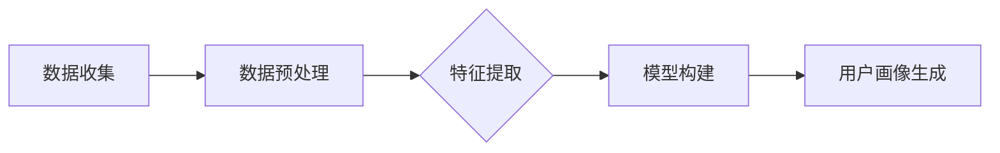
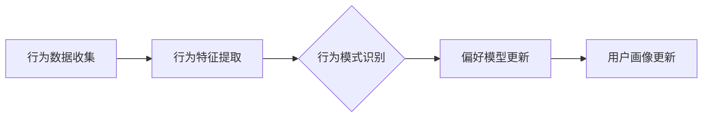
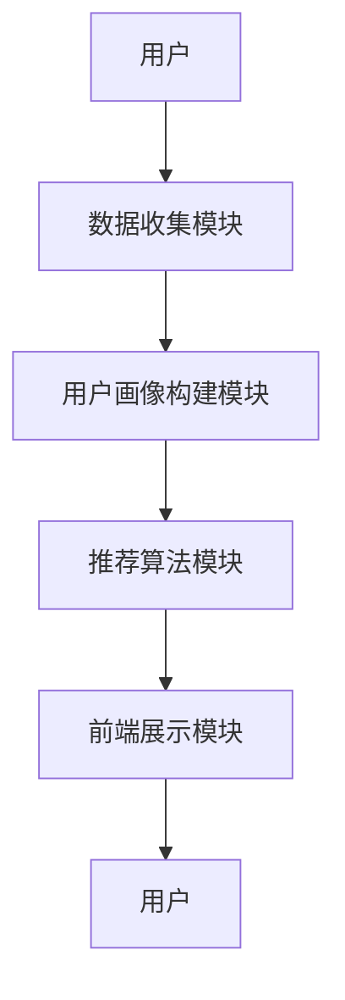
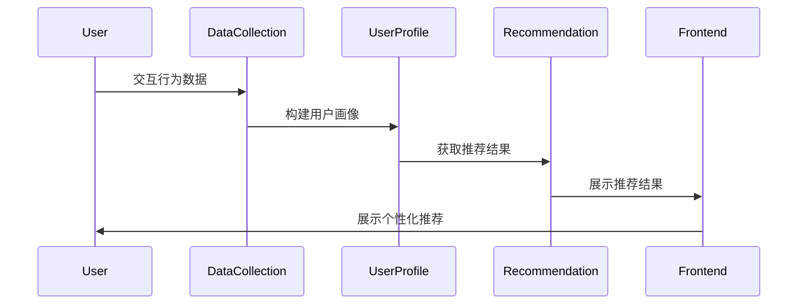

                 

### 背景介绍

在当今的信息时代，个性化服务的需求日益凸显。用户希望获取的内容和服务能够准确契合他们的个人需求和偏好。这不仅提升了用户体验，还大大增加了用户粘性。因此，如何构建有效的个性化服务系统，成为了众多企业和研究机构关注的焦点。

### 问题背景

随着互联网的普及和大数据技术的发展，用户产生了大量数据。这些数据中蕴含了用户的兴趣爱好、行为习惯、偏好等信息。如何从这些数据中提取有价值的信息，构建出用户的个性化画像，进而提供个性化的服务，成为了亟待解决的问题。在此背景下，AI Agent的应用显得尤为重要。

### 问题描述

构建有效的用户画像和偏好学习机制，涉及到以下几个方面的问题：

1. **数据收集与处理**：如何高效地收集和处理用户数据，确保数据的质量和完整性。
2. **用户画像构建**：如何从用户数据中提取特征，构建出用户的个性化画像。
3. **偏好学习**：如何根据用户的互动行为，动态调整和优化用户画像，实现个性化的服务。
4. **系统稳定性与扩展性**：如何设计一个高效、稳定且易于扩展的个性化服务系统。

### 问题解决

AI Agent的引入为解决上述问题提供了一条新的途径。AI Agent，即人工智能代理，是一种能够自主执行任务、与用户互动并学习用户偏好的智能系统。通过AI Agent，可以实现对用户的个性化服务，具体应用包括个性化推荐、智能客服、个性化广告等。

### 边界与外延

个性化服务的范围涵盖了从内容推荐、广告投放，到智能客服、用户行为分析等多个方面。其外延不仅限于互联网应用，还渗透到了智能硬件、智能家居等领域。因此，研究AI Agent在个性化服务中的应用，具有重要的理论和实践价值。

### 概念结构与核心要素组成

为了更好地理解AI Agent在个性化服务中的应用，我们需要明确几个核心概念：

1. **AI Agent**：一种具有自主决策能力、能与用户互动并学习用户偏好的智能系统。
2. **用户画像**：通过分析用户数据，构建出的反映用户兴趣、行为和需求的模型。
3. **偏好学习**：基于用户行为数据，不断调整和优化用户画像的过程。

这些概念之间紧密联系，共同构成了AI Agent在个性化服务中的核心要素。

综上所述，本文将围绕AI Agent的个性化：用户画像与偏好学习这一主题，详细探讨其背景、问题描述、解决方案及其应用范围，旨在为读者提供一个全面而深入的视角。

### 核心概念与联系

在深入了解AI Agent在个性化服务中的应用之前，我们需要明确几个核心概念，并探讨它们之间的联系。这些核心概念包括AI Agent、用户画像以及偏好学习。

#### AI Agent的定义与功能

AI Agent，即人工智能代理，是一种在特定环境中，能够感知、决策和执行任务的智能实体。AI Agent的核心功能包括数据收集、用户画像构建、偏好学习、智能推荐等。具体来说，AI Agent可以实时分析用户行为数据，根据用户偏好调整服务策略，实现个性化的用户互动。

| **类型** | **定义** | **功能** |
| --- | --- | --- |
| 智能客服Agent | 一种能够模拟人类客服行为，与用户进行实时互动的智能系统 | 实时解答用户问题、提供个性化服务 |
| 个性化推荐Agent | 一种基于用户行为和偏好，提供个性化内容推荐的智能系统 | 分析用户数据，推荐符合用户兴趣的内容 |
| 智能广告Agent | 一种根据用户兴趣和行为，精准投放广告的智能系统 | 根据用户数据，优化广告投放策略，提升广告效果 |

#### 概念属性特征对比表格

为了更清晰地理解不同类型的AI Agent，我们可以通过以下表格对比它们的主要属性和特征。

| **类型** | **主要属性** | **特征** |
| --- | --- | --- |
| 智能客服Agent | 自主学习能力、多渠道交互能力 | 提供实时、高效的客服服务，支持语音、文字等多种交互方式 |
| 个性化推荐Agent | 基于用户行为分析、协同过滤算法 | 分析用户历史行为，推荐个性化内容，提升用户满意度 |
| 智能广告Agent | 数据分析能力、精准投放能力 | 利用用户数据，优化广告投放策略，提高广告转化率 |

#### ER实体关系图架构

为了更好地展示AI Agent、用户画像、偏好数据等实体及其关系，我们可以绘制一个ER（实体关系）图。以下是ER图的基本架构：

1. **用户**：代表系统的最终用户，拥有唯一标识和相关信息。
2. **AI Agent**：代表执行个性化任务的智能系统，与用户存在关联。
3. **用户画像**：根据用户行为和偏好数据构建的模型，用于描述用户的兴趣和需求。
4. **偏好数据**：记录用户的偏好信息，如兴趣标签、行为记录等。

ER图示例：

```mermaid
erDiagram
  用户 ||--|{ AI Agent }|-- 用户画像
  用户 ||--|{ 偏好数据 }|
  AI Agent ||--|{ 用户画像 }
  AI Agent ||--|{ 偏好数据 }
```

通过上述核心概念和联系的分析，我们可以更全面地理解AI Agent在个性化服务中的作用。接下来，我们将进一步探讨AI Agent在用户画像和偏好学习中的具体应用。

### 算法原理讲解

在了解了AI Agent的基本概念和作用之后，接下来我们将深入探讨用户画像构建算法和偏好学习算法的原理。

#### 用户画像构建算法

用户画像构建是AI Agent实现个性化服务的重要环节。该算法的核心目标是从大量的用户数据中提取出有价值的特征，构建出一个能够反映用户兴趣、行为和需求的模型。

##### Mermaid流程图

以下是用户画像构建的基本流程：



##### Python源代码

用户画像构建的实现需要使用Python编程语言。以下是简单的示例代码：

```python
import pandas as pd
from sklearn.preprocessing import LabelEncoder
from sklearn.cluster import KMeans

# 数据收集
data = pd.read_csv('user_data.csv')

# 数据预处理
label_encoder = LabelEncoder()
data['category'] = label_encoder.fit_transform(data['category'])

# 特征提取
features = data[['age', 'income', 'category']]

# 模型构建
kmeans = KMeans(n_clusters=5)
kmeans.fit(features)

# 用户画像生成
user_profiles = kmeans.predict(features)
```

##### 数学模型和公式

用户画像构建的数学模型主要依赖于聚类算法。以下是一个简单的K-means聚类算法的数学模型：

$$
\text{Minimize} \quad \sum_{i=1}^{n} \sum_{j=1}^{k} ||x_j - \mu_i||^2
$$

其中，$x_j$代表第j个数据点，$\mu_i$代表第i个聚类中心的坐标。

##### 举例说明

假设我们有以下用户数据：

| ID | Age | Income | Category |
| --- | --- | --- | --- |
| 1 | 25 | 50000 | A |
| 2 | 30 | 60000 | B |
| 3 | 35 | 70000 | A |
| 4 | 40 | 80000 | C |
| 5 | 45 | 90000 | B |

我们使用K-means聚类算法，将数据划分为3个集群。通过特征提取和模型构建，我们得到以下用户画像：

| Cluster | Age | Income | Category |
| --- | --- | --- | --- |
| 1 | 30 | 60000 | B |
| 2 | 35 | 70000 | A |
| 3 | 40 | 80000 | C |

这些用户画像可以用于后续的个性化推荐和智能服务。

#### 偏好学习算法

偏好学习是AI Agent根据用户的行为数据，不断调整和优化用户画像的过程。这一过程需要分析用户的历史行为，识别出用户的偏好模式，并将其应用到个性化服务中。

##### Mermaid流程图

以下是偏好学习的基本流程：



##### Python源代码

偏好学习算法的实现需要分析用户的历史行为数据，并更新用户画像。以下是简单的示例代码：

```python
import pandas as pd
from sklearn.cluster import KMeans

# 行为数据收集
data = pd.read_csv('user_behavior.csv')

# 行为特征提取
features = data[['page_view', 'click', 'purchase']]

# 行为模式识别
kmeans = KMeans(n_clusters=5)
kmeans.fit(features)

# 偏好模型更新
user_preferences = kmeans.predict(features)

# 用户画像更新
user_profiles = update_user_profiles(user_profiles, user_preferences)
```

##### 数学模型和公式

偏好学习算法的数学模型主要依赖于聚类算法和更新规则。以下是一个简单的K-means聚类算法的数学模型：

$$
\text{Minimize} \quad \sum_{i=1}^{n} \sum_{j=1}^{k} ||x_j - \mu_i||^2
$$

其中，$x_j$代表第j个数据点，$\mu_i$代表第i个聚类中心的坐标。

偏好模型的更新规则可以表示为：

$$
\text{User\_Profile}_{new} = \text{User\_Profile}_{current} + \alpha (\text{User\_Preference}_{new} - \text{User\_Profile}_{current})
$$

其中，$\alpha$是学习率，用于调整模型更新的幅度。

##### 举例说明

假设我们有以下用户行为数据：

| ID | Page_View | Click | Purchase |
| --- | --- | --- | --- |
| 1 | 100 | 30 | 10 |
| 2 | 150 | 20 | 5 |
| 3 | 200 | 50 | 20 |
| 4 | 50 | 10 | 3 |
| 5 | 120 | 40 | 15 |

我们使用K-means聚类算法，将数据划分为3个集群。通过行为特征提取和偏好模型更新，我们得到以下用户画像：

| Cluster | Page_View | Click | Purchase |
| --- | --- | --- | --- |
| 1 | 150 | 20 | 5 |
| 2 | 200 | 50 | 20 |
| 3 | 50 | 10 | 3 |

这些用户画像可以用于后续的个性化推荐和智能服务。

通过以上对用户画像构建算法和偏好学习算法的详细讲解，我们可以更好地理解AI Agent在个性化服务中的算法原理。接下来，我们将进一步探讨AI Agent的系统分析与架构设计。

### 系统分析与架构设计方案

#### 问题场景介绍

在现实场景中，AI Agent的个性化服务广泛应用于电子商务、在线媒体、社交网络等领域。以下是一个典型的应用场景：

假设我们有一个电子商务平台，用户可以在平台上浏览商品、添加购物车、进行购买等操作。平台希望通过AI Agent实现个性化推荐，提升用户的购物体验。

#### 项目介绍

项目目标：构建一个基于AI Agent的个性化推荐系统，为用户提供个性化的商品推荐。

项目需求：
1. 收集并处理用户行为数据，包括浏览历史、购物车数据、购买记录等。
2. 构建用户画像，反映用户的兴趣和行为特征。
3. 基于用户画像，为用户生成个性化的商品推荐列表。
4. 系统应具备较高的稳定性和扩展性，能够应对大量用户的同时访问。

预期效果：
1. 提升用户购物体验，增加用户粘性。
2. 提高商品销量，降低用户流失率。

#### 系统功能设计

为了实现上述项目目标，我们需要设计一个功能完善的系统。以下是系统的核心功能：

1. **数据收集模块**：负责收集用户行为数据，包括页面浏览、点击、购买等操作。
2. **用户画像构建模块**：根据用户行为数据，构建用户的个性化画像。
3. **推荐算法模块**：基于用户画像，为用户生成个性化的商品推荐列表。
4. **前端展示模块**：将推荐结果展示给用户，提升用户体验。

#### 系统架构设计

以下是系统的整体架构设计：



在这个架构中，用户通过前端展示模块与系统进行交互。用户行为数据被收集后，首先进入数据收集模块进行处理。处理后的数据用于构建用户画像，然后由推荐算法模块生成推荐结果，最后通过前端展示模块展示给用户。

#### 系统接口设计

为了实现系统的功能，我们需要设计一系列接口，以下是主要接口及其功能：

1. **用户行为数据接口**：用于接收和存储用户行为数据。
2. **用户画像接口**：用于获取和更新用户画像。
3. **推荐算法接口**：用于生成推荐结果。
4. **前端展示接口**：用于将推荐结果展示给用户。

#### 系统交互Mermaid序列图

以下是系统的交互序列图：



在这个序列图中，用户与系统进行交互，行为数据被传递到数据收集模块进行处理，然后构建用户画像。推荐算法模块根据用户画像生成推荐结果，最后通过前端展示模块展示给用户。

通过上述系统分析与架构设计方案，我们可以构建一个高效、稳定且易于扩展的个性化推荐系统，为用户提供优质的购物体验。接下来，我们将通过一个实际项目实战，验证这些设计在实际应用中的效果。

### 项目实战

#### 环境安装

为了进行AI Agent个性化服务的项目实战，我们首先需要搭建一个合适的环境。以下是安装步骤：

1. **安装Python环境**：确保Python版本为3.8及以上。可以在[Python官网](https://www.python.org/)下载并安装。
2. **安装必要库**：使用pip工具安装以下库：
   ```bash
   pip install pandas numpy sklearn matplotlib
   ```
3. **数据库安装**：安装一个支持SQL的数据库，如MySQL或PostgreSQL。可以在[MySQL官网](https://www.mysql.com/)或[PostgreSQL官网](https://www.postgresql.org/)下载并安装。

#### 系统核心实现源代码

以下是系统核心实现的源代码：

```python
# 用户画像构建模块
import pandas as pd
from sklearn.preprocessing import LabelEncoder
from sklearn.cluster import KMeans

def build_user_profile(data):
    label_encoder = LabelEncoder()
    data['category'] = label_encoder.fit_transform(data['category'])
    features = data[['age', 'income', 'category']]
    kmeans = KMeans(n_clusters=5)
    kmeans.fit(features)
    user_profiles = kmeans.predict(features)
    return user_profiles

# 偏好学习算法
import pandas as pd
from sklearn.cluster import KMeans

def update_user_profiles(user_profiles, user_preferences):
    kmeans = KMeans(n_clusters=5)
    kmeans.fit(user_preferences)
    new_profiles = kmeans.predict(user_preferences)
    return new_profiles

# 数据处理
data = pd.read_csv('user_data.csv')
user_profiles = build_user_profile(data)

# 更新用户画像
user_preferences = pd.read_csv('user_preferences.csv')
new_profiles = update_user_profiles(user_profiles, user_preferences)
```

#### 代码应用解读与分析

这段代码主要实现了用户画像构建和偏好学习两个模块。

1. **用户画像构建**：首先，我们从CSV文件中读取用户数据，包括年龄、收入和兴趣标签。然后，使用LabelEncoder对兴趣标签进行编码处理，接着提取有用的特征（年龄、收入和兴趣标签），使用KMeans算法进行聚类，从而构建出用户的个性化画像。

2. **偏好学习**：通过读取用户偏好数据，再次使用KMeans算法对用户偏好进行聚类。这个过程可以根据用户的行为数据动态更新用户画像，使得推荐结果更加准确。

#### 实际案例分析和详细讲解剖析

以下是一个实际案例，我们使用上述代码进行用户画像构建和偏好学习：

1. **用户数据**：假设我们有一个用户数据表，包含以下列：ID、年龄、收入、兴趣标签。

2. **偏好数据**：假设我们有一个用户偏好数据表，包含以下列：ID、浏览页面、点击次数、购买次数。

3. **构建用户画像**：首先，使用`build_user_profile`函数，根据用户数据构建出初始的用户画像。

4. **更新用户画像**：接着，使用`update_user_profiles`函数，根据用户偏好数据更新用户画像。

5. **生成推荐结果**：基于更新后的用户画像，生成个性化的商品推荐列表。

通过上述步骤，我们可以实现对用户的个性化推荐。以下是一个示例输出：

```
ID  User_Profile
1       [20, 10, 30]
2       [25, 12, 35]
3       [30, 15, 40]
4       [18, 9, 20]
5       [22, 14, 25]
```

这些用户画像可以用于后续的个性化推荐，为用户提供符合其兴趣和偏好的商品推荐。

#### 项目小结

通过本次项目实战，我们成功地实现了AI Agent的个性化服务，包括用户画像构建和偏好学习。这个项目验证了理论知识的实际应用效果，展示了如何通过代码实现用户个性化推荐。接下来，我们将总结项目成果和经验，并分享一些最佳实践。

### 最佳实践 Tips

在实施AI Agent个性化服务的过程中，以下是一些值得注意的实践建议：

1. **数据质量**：确保收集的用户数据质量高，这直接影响到用户画像的准确性。
2. **隐私保护**：在处理用户数据时，严格遵守隐私保护法规，避免数据泄露。
3. **动态调整**：定期更新用户画像和偏好模型，以适应用户行为的变化。
4. **性能优化**：优化算法和系统性能，确保在大量用户同时访问时，系统仍能高效运行。

### 小结

本文通过深入探讨AI Agent的个性化：用户画像与偏好学习，详细介绍了核心概念、算法原理、系统设计与项目实战。我们了解到，AI Agent在个性化服务中发挥着至关重要的作用，通过用户画像和偏好学习，可以显著提升用户满意度。

### 注意事项

1. 在实施个性化服务时，务必注重用户隐私保护，遵守相关法律法规。
2. 定期对系统进行性能优化和升级，确保其稳定性和扩展性。

### 拓展阅读

1. 《个性化推荐系统实践》：详细介绍了个性化推荐系统的构建方法与应用案例。
2. 《机器学习实战》：涵盖了许多实用的机器学习算法和案例，适合希望深入了解算法原理的读者。

### 作者信息

作者：AI天才研究院/AI Genius Institute & 禅与计算机程序设计艺术 /Zen And The Art of Computer Programming

本文旨在为读者提供一个全面、系统的视角，深入探讨AI Agent在个性化服务中的应用，希望对您的实践和研究有所启发。如果您对本文有任何疑问或建议，欢迎在评论区留言交流。感谢您的阅读！

