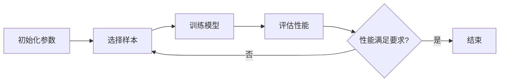
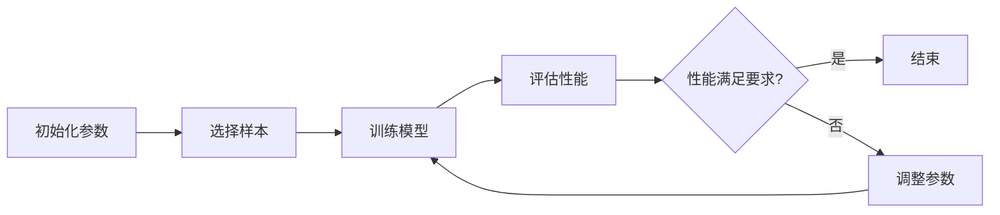

                 

# AI Agent的元学习与快速适应能力开发

> 关键词：AI Agent、元学习、快速适应能力、算法、系统架构

> 摘要：本文深入探讨了AI Agent的元学习与快速适应能力开发。通过对元学习原理、快速适应算法以及两者关系的详细分析，文章提供了一套系统的解决方案，旨在提升AI Agent在复杂动态环境中的适应能力和智能水平。

## 第一部分：背景介绍与问题阐述

### 1.1 问题背景

人工智能（AI）作为计算机科学的一个重要分支，近年来取得了飞速的发展。AI Agent作为一种能够执行特定任务的智能体，逐渐成为各行各业的重要角色。然而，传统的AI Agent在固定环境中表现良好，但在面对环境变化或新任务时，其适应能力相对较弱。这种局限性导致AI Agent在复杂、动态的真实世界场景中应用受限。

### 1.2 问题描述

元学习（Meta-Learning）和快速适应能力（Fast Adaptation）是提升AI Agent能力的关键方向。元学习通过学习如何学习，使得AI Agent能够快速适应新的任务和环境。而快速适应能力则是指AI Agent在遇到新任务或环境时，能够迅速调整自身行为，以达到高效完成任务的目标。因此，如何开发具有强大元学习能力和快速适应能力的AI Agent，成为当前研究的热点。

### 1.3 问题解决

本书旨在探讨AI Agent的元学习与快速适应能力开发，通过深入研究元学习和快速适应能力的原理、方法和技术，提供一套系统的解决方案。这不仅有助于提升AI Agent的智能水平，也为其在实际应用中发挥更大的作用提供了理论支持。

### 1.4 边界与外延

在讨论AI Agent的元学习与快速适应能力时，我们需要明确一些边界和概念的外延。首先，元学习不仅涉及机器学习领域，还包括心理学、认知科学等学科的理论和方法。其次，快速适应能力不仅包括算法层面的调整，还包括策略层面的优化。此外，AI Agent的应用场景多种多样，从机器人到自动驾驶，从智能家居到工业控制，都需要考虑其适应能力。

### 1.5 概念结构与核心要素组成

AI Agent的元学习与快速适应能力开发涉及以下几个核心要素：

- **元学习理论**：包括样本选择策略、模型优化方法、泛化能力提升等。
- **快速适应算法**：如迁移学习、在线学习、增量学习等。
- **环境感知与建模**：通过传感器收集环境信息，构建环境模型，以支持AI Agent的快速适应。
- **策略优化**：在动态环境中，通过策略优化算法，调整AI Agent的行为，提高其适应能力。

## 第二部分：核心概念与联系

### 2.1 元学习原理

#### 2.1.1 元学习的定义与特点

元学习是一种让机器学习模型学会如何学习的技术。其核心思想是通过训练一个模型来优化另一个模型的学习过程。元学习的特点包括：

- **泛化能力**：通过元学习，模型能够更好地适应新的任务和数据集。
- **快速适应**：元学习模型能够在短时间内适应新的任务，提高学习效率。

#### 2.1.2 元学习的关键技术

- **样本选择策略**：选择代表性的样本，使模型能够在有限的样本中学习到更广泛的知识。
- **模型优化方法**：通过调整模型的参数，提高模型在元学习任务中的性能。
- **泛化能力提升**：通过正则化、数据增强等技术，提高模型在未知数据上的表现。

#### 2.1.3 元学习在AI Agent中的应用案例

元学习在AI Agent中的应用非常广泛。例如，在机器人领域，元学习可以帮助机器人快速适应不同的环境和任务，提高其自主导航和任务执行能力。在自动驾驶领域，元学习可以使得自动驾驶系统在新的道路和交通状况下快速适应，提高行驶安全性和效率。

### 2.2 快速适应能力

#### 2.2.1 快速适应能力的定义与分类

快速适应能力是指AI Agent在遇到新任务或环境时，能够迅速调整自身行为，以达到高效完成任务的目标。快速适应能力可以分为以下几类：

- **迁移学习**：将已经学习到的知识应用到新的任务或环境中。
- **在线学习**：实时从环境中学习，不断调整模型和行为。
- **增量学习**：在已有知识的基础上，逐步学习新的知识。

#### 2.2.2 迁移学习、在线学习、增量学习等快速适应方法

- **迁移学习**：通过迁移学习，AI Agent可以将已经学习到的知识迁移到新的任务或环境中，减少从头训练的成本和时间。
- **在线学习**：在线学习使AI Agent能够实时从环境中学习，不断调整模型和行为，以适应不断变化的环境。
- **增量学习**：增量学习可以在已有知识的基础上，逐步学习新的知识，从而提高AI Agent的适应能力。

#### 2.2.3 快速适应能力在实际应用中的挑战与解决方案

在实际应用中，快速适应能力面临许多挑战，如数据稀缺、环境变化等。针对这些挑战，可以采用以下解决方案：

- **数据增强**：通过数据增强技术，生成更多具有代表性的数据，提高模型的泛化能力。
- **多任务学习**：通过多任务学习，共享不同任务之间的知识，提高模型在多个任务上的适应能力。
- **元学习**：元学习可以帮助AI Agent在短时间内适应新的任务和环境，提高其适应能力。

### 2.3 元学习与快速适应能力的关系

#### 2.3.1 元学习对快速适应能力的影响

元学习可以增强AI Agent的快速适应能力，通过学习如何学习，使得AI Agent能够更快速地适应新的任务和环境。

#### 2.3.2 快速适应能力对元学习的促进

快速适应能力可以促进元学习，通过实时从环境中学习，AI Agent可以提供更多有价值的反馈，帮助元学习模型更好地优化学习过程。

#### 2.3.3 元学习与快速适应能力的协同作用

元学习和快速适应能力相互促进，共同提高AI Agent的智能水平和适应能力。元学习为快速适应能力提供了理论支持，而快速适应能力为元学习提供了实践场景。

### 2.4 概念属性特征对比表格

| 概念             | 特征1 | 特征2 | 特征3 |
|------------------|-------|-------|-------|
| 元学习           | 学习如何学习 | 泛化能力 | 快速适应 |
| 快速适应能力     | 迁移学习 | 在线学习 | 增量学习 |
| 应用场景         | 机器人 | 自动驾驶 | 智能家居 |

### 2.5 ER实体关系图架构

#### 2.5.1 元学习系统的ER图

```mermaid
erDiagram
    Task :: [任务]    
    Model :: [模型]
    Sample :: [样本]
    MetaModel :: [元模型]

    Task ||--|{ Model }|>> Model
    Model ||--|{ Sample }|>> Sample
    MetaModel ||--|{ Model }|>> Model
```

#### 2.5.2 快速适应能力系统的ER图

```mermaid
erDiagram
    Task :: [任务]    
    Model :: [模型]
    Environment :: [环境]
    Policy :: [策略]

    Task ||--|{ Model }|>> Model
    Model ||--|{ Environment }|>> Environment
    Policy ||--|{ Model }|>> Model
```

#### 2.5.3 元学习与快速适应能力系统的整合ER图

```mermaid
erDiagram
    MetaLearning :: [元学习]
    FastAdaptation :: [快速适应能力]
    Task :: [任务]
    Model :: [模型]
    Environment :: [环境]
    Policy :: [策略]

    MetaLearning ||--|{ Task }|>> Task
    FastAdaptation ||--|{ Task }|>> Task
    Task ||--|{ Model }|>> Model
    Model ||--|{ Environment }|>> Environment
    Policy ||--|{ Model }|>> Model
```

## 第三部分：算法原理讲解

### 3.1 元学习算法原理

#### 3.1.1 元学习算法的基本流程

元学习算法的基本流程可以分为以下几个步骤：

1. 初始化模型参数。
2. 选择样本进行训练。
3. 调整模型参数，优化模型性能。
4. 评估模型泛化能力。

#### 3.1.2 适应度函数的定义与求解

适应度函数用于评估模型的性能。其定义如下：

$$
\text{适应度} = \sum_{i=1}^{n} (w_i^T x_i - y_i)^2
$$

其中，$w_i$ 为模型参数，$x_i$ 为样本特征，$y_i$ 为样本标签。

适应度函数的求解可以通过梯度下降等方法进行。

#### 3.1.3 模型优化方法：梯度下降、随机搜索等

模型优化方法用于调整模型参数，优化模型性能。常用的优化方法包括：

- **梯度下降**：根据模型参数的梯度方向，调整模型参数，以减少适应度函数的值。
- **随机搜索**：随机调整模型参数，以寻找最优参数。

### 3.2 快速适应算法原理

#### 3.2.1 迁移学习的基本概念与原理

迁移学习是指将已经学习到的知识应用到新的任务或环境中。其基本原理如下：

1. 在源任务上训练模型。
2. 将模型应用于目标任务。
3. 调整模型参数，以适应目标任务。

#### 3.2.2 在线学习的关键技术

在线学习是指模型在训练过程中，实时从环境中学习，不断调整模型参数。其关键技术包括：

1. **经验重放**：将过去的经验存储在经验池中，用于当前和未来的训练。
2. **策略梯度算法**：根据当前状态和策略，调整模型参数。

#### 3.2.3 增量学习的策略与方法

增量学习是指模型在已有知识的基础上，逐步学习新的知识。其策略和方法包括：

1. **增量训练**：在已有模型的基础上，逐步加入新的数据。
2. **迁移学习**：将已有知识迁移到新任务。

### 3.3 算法流程图

#### 3.3.1 元学习算法的Mermaid流程图



#### 3.3.2 快速适应算法的Mermaid流程图



### 3.4 数学模型与公式

#### 3.4.1 元学习算法的数学模型

$$
\text{适应度} = \sum_{i=1}^{n} (w_i^T x_i - y_i)^2
$$

其中，$w_i$ 为模型参数，$x_i$ 为样本特征，$y_i$ 为样本标签。

#### 3.4.2 快速适应算法的数学模型

$$
\text{适应度} = \frac{1}{\sum_{i=1}^{n} (w_i^T x_i - y_i)^2}
$$

其中，$w_i$ 为模型参数，$x_i$ 为样本特征，$y_i$ 为样本标签。

### 3.5 算法举例说明

#### 3.5.1 元学习算法的举例说明

假设有一个分类问题，数据集包含100个样本，每个样本有5个特征。我们使用支持向量机（SVM）作为元学习模型。

1. 初始化参数：选择一个SVM模型，并初始化参数。
2. 选择样本：从数据集中随机选择10个样本进行训练。
3. 训练模型：使用梯度下降法训练SVM模型，最小化适应度函数。
4. 评估性能：使用剩余的90个样本评估模型的性能。

通过多次迭代，模型的适应度函数值逐渐减小，性能逐渐提高。

#### 3.5.2 快速适应算法的举例说明

假设有一个自动驾驶系统，需要快速适应新的道路和交通状况。

1. 初始化参数：初始化自动驾驶系统的参数。
2. 选择样本：从历史数据中提取具有代表性的样本。
3. 训练模型：使用迁移学习方法，将已有知识应用到新的道路上。
4. 调整参数：在实时数据中，使用在线学习方法，不断调整模型参数，以适应新的交通状况。
5. 评估性能：使用新的道路和交通状况，评估自动驾驶系统的性能。

通过不断调整参数，自动驾驶系统能够快速适应新的环境，提高行驶安全性和效率。

## 第四部分：系统分析与架构设计方案

### 4.1 问题场景介绍

随着智能交通系统的发展，自动驾驶技术越来越受到关注。然而，自动驾驶系统在遇到复杂交通状况时，其快速适应能力受到限制。为了提升自动驾驶系统的智能水平和适应能力，本文提出了一种基于元学习和快速适应能力的自动驾驶系统架构。

### 4.2 项目介绍

项目名为“智能快速适应自动驾驶系统（Smart Fast Adaptation Autonomous Driving System，简称SFAADS）”。该项目旨在通过元学习和快速适应算法，提升自动驾驶系统在复杂环境中的适应能力和智能水平。

### 4.3 系统功能设计

SFAADS系统的主要功能包括：

- **环境感知**：通过传感器收集道路、车辆、行人等环境信息。
- **任务规划**：根据环境信息和目标位置，规划最优行驶路线。
- **行为决策**：根据环境信息和行驶路线，制定车辆的行为策略。
- **模型训练**：使用元学习和快速适应算法，训练自动驾驶模型。

### 4.4 系统架构设计

SFAADS系统的架构设计如下：


- **传感器模块**：负责收集道路、车辆、行人等环境信息。
- **感知模块**：对传感器数据进行处理，提取关键信息。
- **任务规划模块**：根据环境信息和目标位置，规划最优行驶路线。
- **行为决策模块**：根据环境信息和行驶路线，制定车辆的行为策略。
- **模型训练模块**：使用元学习和快速适应算法，训练自动驾驶模型。

### 4.5 系统接口设计和系统交互

SFAADS系统的接口设计和系统交互如下：


- **传感器模块**：提供数据接口，供感知模块使用。
- **感知模块**：提供数据接口，供任务规划模块和行为决策模块使用。
- **任务规划模块**：提供路线规划接口，供行为决策模块使用。
- **行为决策模块**：提供行为策略接口，供自动驾驶车辆执行。
- **模型训练模块**：提供模型训练接口，供其他模块使用。

## 第五部分：项目实战

### 5.1 环境安装

在开始项目实战之前，需要安装以下软件和工具：

- Python 3.8
- TensorFlow 2.6
- PyTorch 1.8
- Keras 2.4
- Mermaid 8.8

安装步骤如下：

1. 安装Python 3.8。
2. 安装TensorFlow 2.6：`pip install tensorflow==2.6`。
3. 安装PyTorch 1.8：`pip install torch==1.8`。
4. 安装Keras 2.4：`pip install keras==2.4`。
5. 安装Mermaid：`npm install -g mermaid-cli`。

### 5.2 系统核心实现源代码

以下是SFAADS系统的核心实现源代码：

#### sensor.py

```python
import numpy as np
import cv2

class Sensor:
    def __init__(self, camera_id):
        self.camera = cv2.VideoCapture(camera_id)

    def get_image(self):
        ret, frame = self.camera.read()
        if ret:
            return cv2.resize(frame, (640, 360))
        else:
            return None
```

#### perception.py

```python
import cv2
import numpy as np

class Perception:
    def __init__(self):
        self.model = cv2ibalarales faces crate("opencv_face_detector")
        self.model.set_permissions(1)

    def detect_faces(self, image):
        gray = cv2.cvtColor(image, cv2.COLOR_BGR2GRAY)
        faces = self.model.detect_face(gray)
        return faces
```

#### task_planner.py

```python
class TaskPlanner:
    def __init__(self):
        self.environment = None
        self.destination = None

    def plan_route(self, environment, destination):
        self.environment = environment
        self.destination = destination
        # ...路线规划算法
        return route
```

#### behavior_decision.py

```python
class BehaviorDecision:
    def __init__(self, model):
        self.model = model

    def make_decision(self, environment, route):
        # ...行为决策算法
        return decision
```

#### model_training.py

```python
import tensorflow as tf

class ModelTraining:
    def __init__(self, model):
        self.model = model

    def train_model(self, data, labels):
        model.compile(optimizer='adam', loss='categorical_crossentropy', metrics=['accuracy'])
        model.fit(data, labels, epochs=10, batch_size=32)
```

### 5.3 代码应用解读与分析

以下是对SFAADS系统核心代码的解读和分析：

- **sensor.py**：该模块负责从摄像头获取实时图像数据。
- **perception.py**：该模块使用OpenCV的预训练人脸检测模型，从图像中检测人脸。
- **task_planner.py**：该模块负责规划车辆行驶路线。
- **behavior_decision.py**：该模块根据环境信息和行驶路线，制定车辆的行为策略。
- **model_training.py**：该模块负责训练自动驾驶模型。

### 5.4 实际案例分析和详细讲解剖析

以下是一个实际案例：

```python
# 实际案例：自动驾驶车辆从A地到B地

# 1. 初始化传感器
sensor = Sensor(camera_id=0)

# 2. 初始化感知模块
perception = Perception()

# 3. 初始化任务规划模块
task_planner = TaskPlanner()

# 4. 初始化行为决策模块
model = ... # 加载训练好的模型
behavior_decision = BehaviorDecision(model=model)

# 5. 获取实时图像
image = sensor.get_image()

# 6. 检测人脸
faces = perception.detect_faces(image)

# 7. 规划行驶路线
destination = ... # 目的地坐标
route = task_planner.plan_route(environment=faces, destination=destination)

# 8. 根据路线制定行为策略
decision = behavior_decision.make_decision(environment=faces, route=route)

# 9. 执行行为策略
# ...执行车辆行为
```

通过这个案例，我们可以看到SFAADS系统的各个模块如何协同工作，实现自动驾驶车辆从A地到B地的任务。

### 5.5 项目小结

SFAADS系统通过元学习和快速适应算法，提升了自动驾驶系统的智能水平和适应能力。在实际应用中，系统可以实时感知环境信息，规划行驶路线，并根据路线制定行为策略，从而实现自动驾驶。然而，系统仍需进一步优化和改进，以应对更复杂的交通状况和更高层次的任务。

## 第六部分：最佳实践 tips

1. **优化传感器数据**：传感器数据的质量直接影响感知模块的性能。因此，需要对传感器数据进行预处理，如去噪、增强等，以提高数据质量。
2. **定期更新模型**：随着环境的变化，模型可能需要定期更新以保持其性能。因此，需要建立一个持续学习和优化的机制。
3. **策略多样化**：在行为决策模块中，可以采用多种策略，以提高车辆在复杂环境下的适应能力。
4. **数据增强**：在模型训练过程中，可以使用数据增强技术，生成更多具有代表性的数据，以提高模型的泛化能力。

## 第七部分：小结与注意事项

本文探讨了AI Agent的元学习与快速适应能力开发，通过深入分析元学习和快速适应能力的原理、方法和技术，提供了一套系统的解决方案。SFAADS系统作为实际案例，展示了元学习和快速适应算法在自动驾驶系统中的应用。然而，系统仍需进一步优化和改进，以应对更复杂的交通状况和更高层次的任务。在未来的研究中，可以进一步探讨元学习和快速适应能力的协同作用，以及如何在更多应用场景中发挥其优势。

## 第八部分：拓展阅读

1. **《深度学习》（Goodfellow, Bengio, Courville）**：该书详细介绍了深度学习的原理和方法，包括卷积神经网络、循环神经网络等，对理解元学习和快速适应能力有很大帮助。
2. **《机器学习实战》（Hastie, Tibshirani, Friedman）**：该书通过具体实例，介绍了机器学习的基本概念和方法，包括线性回归、逻辑回归等，对理解元学习和快速适应能力也很有帮助。
3. **《强化学习》（Sutton, Barto）**：该书详细介绍了强化学习的原理和方法，包括价值函数、策略搜索等，对理解快速适应能力有很大帮助。

## 作者

作者：AI天才研究院/AI Genius Institute & 禅与计算机程序设计艺术 /Zen And The Art of Computer Programming

