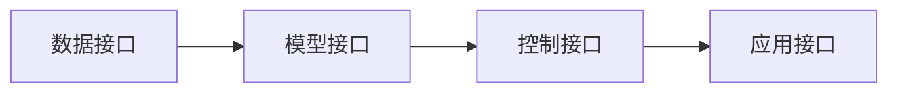

                 

### 引言

#### 1.1 问题背景

AI Agent，作为人工智能领域的一个重要概念，已经广泛应用于游戏AI、机器人控制和无人驾驶等领域。而元强化学习（Meta Reinforcement Learning）作为一种新兴的研究方向，正逐渐成为AI Agent发展的重要驱动力。传统强化学习依赖于大量的数据和时间来训练模型，而元强化学习则通过学习如何快速适应新环境，实现高效的迁移学习。

当前，随着深度学习技术的迅猛发展，AI Agent在复杂环境中的表现已经取得了显著的成果。然而，大多数研究主要集中在特定任务或环境下的性能提升，对于如何在多变和不确定的环境中实现持续学习和适应，仍面临诸多挑战。这就需要我们探索更高效、更通用的策略开发方法。

本书旨在探讨AI Agent的元强化学习策略开发，通过系统性地介绍元强化学习和AI Agent的基本概念，详细讲解策略开发的方法和实际应用案例，帮助读者深入了解这一领域的前沿技术，并掌握其实际应用技巧。

#### 1.2 本书的目的与结构

本书的主要目的是为AI Agent的元强化学习策略开发提供全面而系统的指导。通过本书，读者可以：

1. 掌握元强化学习和AI Agent的基本概念和原理。
2. 理解元强化学习策略开发的方法和流程。
3. 学习如何将元强化学习策略应用于实际场景，解决实际问题。
4. 获取最新的研究成果和技术动态。

本书结构分为六个部分：

1. 引言：介绍问题背景、目的和本书的结构。
2. 元强化学习基础：讲解元强化学习的核心概念、原理和主流算法。
3. AI Agent介绍：介绍AI Agent的定义、分类和核心功能。
4. 策略开发方法：详细阐述策略学习的理论基础和开发方法。
5. 实际应用案例：通过实际案例展示元强化学习策略的应用。
6. 总结与展望：总结全书内容，并对未来发展趋势进行展望。

#### 1.3 准备工作

为了更好地理解和学习本书的内容，读者需要具备以下基础：

1. **数学基础**：熟悉概率论、线性代数和微积分等数学知识。
2. **编程技能**：掌握Python编程语言，熟悉深度学习和强化学习相关库（如TensorFlow、PyTorch等）。
3. **计算机科学知识**：了解基本的机器学习算法和深度学习框架。

此外，读者还需要准备相应的硬件和软件环境：

1. **硬件要求**：至少具备双核CPU和8GB内存的计算机。
2. **软件要求**：安装Python环境和深度学习库（如TensorFlow、PyTorch等）。

通过以上准备工作，读者可以更好地跟随本书的讲解，掌握AI Agent的元强化学习策略开发技术。

### 核心关键词

- **AI Agent**
- **元强化学习**
- **策略开发**
- **应用案例**
- **实际场景**
- **迁移学习**

### 摘要

本书围绕AI Agent的元强化学习策略开发这一主题，系统地介绍了相关的基础概念、原理和实际应用。首先，我们探讨了元强化学习和AI Agent的基本概念，包括其定义、分类和核心功能。接着，详细讲解了元强化学习的基本原理、核心算法，如MAML和Reptile，以及如何将元强化学习应用于AI Agent的策略开发。

本书的核心内容包括：

1. **元强化学习基础**：介绍了强化学习和元学习的基本原理，详细讲解了元强化学习的核心概念和算法。
2. **AI Agent介绍**：阐述了AI Agent的定义、分类和核心功能，探讨了其在不同应用场景中的价值。
3. **策略开发方法**：分析了策略学习的理论基础和开发方法，包括经验回放、策略梯度方法和策略优化方法。
4. **实际应用案例**：通过游戏AI、机器人控制和无人驾驶等实际案例，展示了元强化学习策略的应用效果。

本书的目标是为读者提供全面而系统的元强化学习策略开发指导，帮助其掌握这一前沿技术，并在实际应用中取得成功。通过学习本书，读者可以深入了解元强化学习在AI Agent领域的应用潜力，为未来的研究和技术发展提供启示。

### 第2章 元强化学习基础

在深入探讨AI Agent的元强化学习策略开发之前，我们需要先了解元强化学习的基础知识。元强化学习（Meta Reinforcement Learning）是强化学习和元学习（Meta-Learning）相结合的一种学习方法，其核心目标是使算法能够快速适应新环境，从而实现高效的迁移学习。

#### 2.1 核心概念

**强化学习**是一种通过试错和反馈来学习如何在特定环境中做出最优决策的人工智能方法。强化学习的主要组成部分包括：

1. **代理（Agent）**：执行动作并学习如何改进决策的智能体。
2. **环境（Environment）**：代理与之交互的系统，提供状态信息和奖励信号。
3. **状态（State）**：描述代理所处环境的状态。
4. **动作（Action）**：代理可以采取的行为。
5. **奖励（Reward）**：环境对代理动作的反馈，用于指导代理的学习。

**元学习**是一种使机器学习模型能够快速适应新任务的学习方法，主要目标是减少对新任务的数据需求。元学习的主要组成部分包括：

1. **基础学习任务（Base Learning Tasks）**：用于训练模型的初始任务。
2. **迁移能力（Transfer Learning）**：模型在新任务上的表现能力。
3. **元优化器（Meta-Optimizer）**：用于调整模型参数以优化元学习的性能。

**元强化学习**结合了强化学习和元学习的特点，其核心目标是使代理能够在短时间内适应新环境，并做出最优决策。元强化学习的关键组成部分包括：

1. **元学习过程**：通过多次迭代训练模型，使其能够快速适应新环境。
2. **策略优化**：使用元学习优化策略，使其在多个环境中具有更高的回报。

#### 2.2 元强化学习原理

元强化学习的基本原理是利用元学习技术来优化强化学习过程中的策略，从而提高代理在不同环境下的适应能力。具体来说，元强化学习的过程可以分为以下几个步骤：

1. **初始化**：初始化代理和元学习模型。
2. **任务采样**：从环境中随机采样多个任务，用于训练代理。
3. **策略训练**：使用元学习技术，对代理的策略进行训练，使其能够在多个任务中表现优异。
4. **策略评估**：在多个任务上评估策略的性能，选择最优策略。
5. **策略优化**：使用元学习优化策略，进一步提高其在多个任务中的适应性。

在元强化学习过程中，一个重要的概念是“任务空间（Task Space）”。任务空间是由所有可能的任务组成的高维空间，元强化学习的目标是在这个高维空间中找到一个策略，使其在大多数任务上都能取得较好的回报。

#### 2.3 主流元强化学习算法

元强化学习领域已经提出了一系列主流算法，以下介绍其中几种重要的算法：

**1. MAML（Model-Agnostic Meta-Learning）**

MAML是一种模型无关的元学习算法，其核心思想是找到一组参数，使得模型在多个任务上快速适应。MAML的主要步骤包括：

1. **任务初始化**：在任务空间中随机选择一个任务，初始化模型参数。
2. **模型更新**：在当前任务上训练模型，更新参数。
3. **参数适应**：使用元梯度计算方法，更新模型参数，使其在多个任务上表现优异。

**2. Reptile**

Reptile是一种基于梯度下降的元学习算法，其核心思想是利用邻居任务的信息来更新模型参数。Reptile的主要步骤包括：

1. **任务采样**：从任务空间中随机选择多个邻居任务。
2. **模型更新**：在每个邻居任务上训练模型，并计算更新梯度。
3. **参数聚合**：将多个邻居任务的梯度进行聚合，更新模型参数。

**3. Model-Agnostic Meta-Learning (MAML)**

MAML是一种模型无关的元学习算法，其核心思想是找到一组参数，使得模型在多个任务上快速适应。MAML的主要步骤包括：

1. **任务初始化**：在任务空间中随机选择一个任务，初始化模型参数。
2. **模型更新**：在当前任务上训练模型，更新参数。
3. **参数适应**：使用元梯度计算方法，更新模型参数，使其在多个任务上表现优异。

通过以上算法的介绍，我们可以看到元强化学习在策略开发中的应用潜力。接下来，我们将进一步探讨AI Agent的基本概念和分类。

### 第3章 AI Agent介绍

AI Agent是人工智能领域中的一个重要概念，它代表了具有自主决策能力的智能体，能够通过与环境的交互学习，并做出合理的决策。本节将介绍AI Agent的定义、分类、核心功能以及其在不同应用场景中的表现。

#### 3.1 AI Agent的定义与分类

**AI Agent**，即人工智能代理，是指一种能够模拟人类智能行为的计算机程序，它具备自主决策能力，能够感知环境，采取行动并学习适应环境的变化。根据功能和应用场景的不同，AI Agent可以大致分为以下几类：

1. **感知型Agent**：这类Agent主要功能是感知环境，通过传感器获取环境信息，如视觉、听觉、触觉等。感知型Agent通常用于智能监控、安防等领域。
2. **决策型Agent**：这类Agent的核心功能是基于感知到的环境信息进行决策。例如，自动驾驶汽车中的AI Agent需要分析道路情况，并做出驾驶决策。
3. **执行型Agent**：这类Agent不仅具备感知和决策能力，还能够执行具体的动作。例如，机器人可以通过执行型AI Agent来实现自主移动和操作。

**AI Agent的分类**可以根据其自主程度和功能特点进一步细分：

1. **规则型Agent**：基于预先定义的规则进行决策，适用于规则明确、环境简单的场景。例如，自动调度系统可以根据规则来安排任务。
2. **模型型Agent**：基于环境模型进行决策，适用于复杂环境。这类Agent通常通过学习来建立环境模型，并基于模型进行决策。
3. **数据驱动型Agent**：通过分析历史数据和实时数据来做出决策。这类Agent通常使用机器学习和深度学习技术，如强化学习、深度神经网络等。

#### 3.2 AI Agent的核心功能

AI Agent的核心功能主要包括感知、学习、决策和执行。这些功能共同作用，使得Agent能够自主适应环境并做出合理决策。

1. **感知（Perception）**：AI Agent通过传感器感知环境信息，如视觉、听觉、触觉等。感知能力是Agent与环境交互的基础。
2. **学习（Learning）**：AI Agent通过机器学习算法不断学习环境信息，提升自身的感知和决策能力。学习过程通常涉及数据收集、模型训练和策略优化。
3. **决策（Decision Making）**：AI Agent根据感知到的环境信息和已有的知识，通过算法模型进行决策。决策能力决定了Agent在复杂环境中的表现。
4. **执行（Execution）**：AI Agent根据决策结果执行具体的动作，如移动、操作等。执行能力使得Agent能够将决策转化为实际操作。

#### 3.3 AI Agent的应用场景

AI Agent的应用场景广泛，涵盖了众多领域。以下是一些典型的应用场景：

1. **游戏AI**：游戏AI可以模拟人类玩家的行为，为玩家提供对手策略。例如，在电子竞技游戏中，AI可以模拟各种战术和策略，增强游戏的可玩性和挑战性。
2. **机器人控制**：机器人控制是AI Agent的一个重要应用领域。通过AI Agent，机器人可以自主完成各种任务，如清洁、搬运、探测等。
3. **无人驾驶**：无人驾驶汽车是AI Agent应用的另一个重要场景。AI Agent通过感知环境、分析路况，并做出驾驶决策，实现无人驾驶功能。
4. **智能客服**：智能客服系统利用AI Agent，可以自动识别用户需求，提供针对性的服务和建议，提高客户满意度。
5. **智能家居**：智能家居系统通过AI Agent实现设备的自动化控制，如灯光、温度、安防等，提升生活便利性。

通过以上介绍，我们可以看到AI Agent在各个领域的广泛应用和巨大潜力。接下来，我们将进一步探讨AI Agent的元强化学习策略开发方法。

### 4.1 策略学习基础

策略学习是强化学习中的一个核心概念，它决定了智能体在特定环境下如何做出最优决策。策略学习的基本目标和过程如下：

#### 4.1.1 策略学习的目标

策略学习的目标是找到一种映射关系，将智能体的状态映射到最优动作上。具体来说，目标是使智能体能够最大化总奖励，即在长期的交互过程中获得最大的累计回报。

#### 4.1.2 策略学习的过程

策略学习的过程可以分为以下几个主要步骤：

1. **状态观测**：智能体通过传感器观测当前环境的状态。
2. **策略评估**：使用现有策略评估当前状态下的预期回报，以确定当前策略的有效性。
3. **策略更新**：根据评估结果，智能体更新其策略，以改善决策质量。
4. **行动执行**：智能体根据更新后的策略，执行相应的动作。
5. **反馈学习**：智能体根据执行后的反馈（奖励信号），进一步调整其策略。

策略学习的过程是一个动态迭代的过程，智能体通过不断尝试和调整策略，逐渐优化其决策能力。

#### 4.1.3 策略学习的基础算法

策略学习通常依赖于一系列基础算法，以下介绍其中几种常用的算法：

1. **Q-Learning**：Q-Learning是一种基于值函数的策略学习算法。其核心思想是通过迭代更新Q值（状态-动作值函数），找到最优策略。Q-Learning的主要步骤包括：
   - 初始化Q值函数。
   - 选择动作，执行动作并获取奖励。
   - 更新Q值函数：Q(s, a) = Q(s, a) + α[R(s', a) + γmax(Q(s', a')) - Q(s, a)]。
   其中，α为学习率，γ为折扣因子，R为奖励函数。

2. **SARSA（同步策略学习与行动选择）**：SARSA是一种同步策略学习算法，其核心思想是在同一时间步内同时选择动作和更新策略。SARSA的主要步骤包括：
   - 初始化策略。
   - 选择动作，执行动作并获取奖励。
   - 根据新的状态和动作更新策略：π(s, a) = π(s, a | s, a) + ε，其中ε为探索概率。

3. **Policy Gradient方法**：Policy Gradient方法是一种直接优化策略的算法，其核心思想是通过计算策略梯度，更新策略参数以最大化期望回报。Policy Gradient的主要步骤包括：
   - 初始化策略参数。
   - 执行策略，收集数据。
   - 计算策略梯度：∇θ J(θ) = ∇θ E[∇a log π(a|s) · R(s, a)]。
   - 更新策略参数：θ = θ - α∇θ J(θ)。

通过以上基础算法的介绍，我们可以了解到策略学习的基本原理和实现方法。接下来，我们将详细探讨AI Agent的元强化学习策略开发方法。

### 4.2 策略开发方法

策略开发是元强化学习策略开发的核心环节，其目标是设计出能够在多个不同任务中表现出色的策略。本节将详细介绍几种常见的策略开发方法，包括经验回放、策略梯度方法和策略优化方法。

#### 4.2.1 经验回放

经验回放（Experience Replay）是一种常用的策略开发方法，其核心思想是利用历史经验来训练策略网络。具体步骤如下：

1. **收集经验**：在训练过程中，智能体与环境的交互会产生一系列状态、动作、奖励和下一个状态。将这些交互经验存储在经验池中。
2. **经验采样**：从经验池中随机采样一批经验，用于训练策略网络。这种随机采样可以减少策略训练中的偏差，提高泛化能力。
3. **策略更新**：使用采样到的经验，通过策略网络预测动作值，并与实际动作值进行比较，更新策略网络参数。

经验回放方法能够有效地避免策略训练中的样本偏差问题，提高策略的稳定性和鲁棒性。

#### 4.2.2 策略梯度方法

策略梯度方法是一种基于梯度下降的优化策略，其核心思想是通过计算策略梯度来更新策略参数。具体步骤如下：

1. **初始化策略参数**：随机初始化策略网络参数。
2. **执行策略**：使用当前策略生成一批交互数据，包括状态、动作、奖励和下一个状态。
3. **计算策略梯度**：计算策略梯度，即 ∇θ J(θ) = ∇θ E[∇a log π(a|s) · R(s, a)]。
4. **更新策略参数**：使用策略梯度更新策略网络参数：θ = θ - α∇θ J(θ)，其中α为学习率。

策略梯度方法能够直接优化策略，使其在多个任务中具有更高的回报。

#### 4.2.3 策略优化方法

策略优化方法是一种基于优化理论的策略开发方法，其核心思想是通过优化策略损失函数来更新策略参数。具体步骤如下：

1. **定义损失函数**：根据任务目标定义损失函数，例如最大化期望回报。
2. **初始化策略参数**：随机初始化策略网络参数。
3. **策略迭代**：在迭代过程中，根据当前策略生成一批交互数据，计算损失函数，并通过梯度下降等方法更新策略参数。
4. **评估策略**：在多个任务上评估策略性能，选择最优策略。

策略优化方法能够通过迭代优化策略，提高策略在多任务环境中的适应能力。

#### 4.2.4 比较与选择

经验回放、策略梯度方法和策略优化方法各有优缺点，具体选择应根据任务需求和资源情况决定。

- **经验回放**：优点在于能够有效减少策略训练中的偏差，提高泛化能力；缺点是训练过程可能较慢，对内存资源需求较高。
- **策略梯度方法**：优点在于能够直接优化策略，提高策略的鲁棒性和适应性；缺点是计算策略梯度可能较复杂，对计算资源需求较高。
- **策略优化方法**：优点在于能够通过迭代优化策略，提高策略性能；缺点是优化过程可能较慢，对任务适应性要求较高。

在实际应用中，可以根据任务特点和要求，选择合适的策略开发方法，以达到最佳效果。

通过以上策略开发方法的介绍，我们可以看到元强化学习策略开发方法的多样性和灵活性。接下来，我们将进一步探讨策略评估与选择方法。

### 4.3 策略评估与选择

在元强化学习策略开发中，策略评估与选择是关键环节，它决定了哪个策略能够在不同任务中取得最佳效果。本节将介绍几种常用的策略评估与选择方法，包括评估指标、策略选择算法及其应用。

#### 4.3.1 策略评估指标

策略评估的目的是衡量策略在不同任务中的表现，常用的评估指标包括：

1. **平均回报（Average Return）**：策略在多个任务中连续执行特定动作的平均奖励。平均回报越高，策略越优秀。
   \[ R_{avg} = \frac{1}{N} \sum_{i=1}^{N} R_i \]
   其中，\( R_i \) 是第 \( i \) 个任务的回报，\( N \) 是任务总数。

2. **标准差（Standard Deviation）**：策略在不同任务中回报的波动情况。标准差越小，策略的稳定性越高。
   \[ \sigma_R = \sqrt{\frac{1}{N-1} \sum_{i=1}^{N} (R_i - R_{avg})^2 } \]

3. **成功率（Success Rate）**：策略成功完成任务的比例。成功率越高，策略的实用性越强。
   \[ Success\_Rate = \frac{Num\_Success}{Total\_Num} \]
   其中，\( Num\_Success \) 是成功完成任务的数量，\( Total\_Num \) 是总任务数。

4. **收敛速度（Convergence Speed）**：策略从初始状态到最优状态所需的时间。收敛速度越快，策略的适应能力越强。

#### 4.3.2 策略选择算法

策略选择算法用于从多个候选策略中选择最优策略。以下介绍几种常用的策略选择算法：

1. **贪婪选择（Greedy Selection）**：在当前状态下，选择具有最高预期回报的动作。贪婪选择简单直接，但在不确定性环境中可能表现不佳。
   \[ a^* = \arg\max_a Q(s, a) \]
   其中，\( Q(s, a) \) 是策略在状态 \( s \) 下执行动作 \( a \) 的预期回报。

2. **ε-贪心选择（ε-Greedy Selection）**：在当前状态下，以概率 \( 1 - \epsilon \) 选择具有最高预期回报的动作，以概率 \( \epsilon \) 随机选择动作。ε-贪心选择在探索和利用之间取得平衡。
   \[ a^* = \begin{cases} 
   \arg\max_a Q(s, a) & \text{with probability } 1 - \epsilon \\
   \text{random action} & \text{with probability } \epsilon 
   \end{cases} \]

3. **UCB（Upper Confidence Bound）算法**：UCB算法通过考虑动作的探索次数和预期回报，选择具有最高上置信界限的动作。UCB算法能够平衡探索和利用，适用于不确定性环境。
   \[ a^* = \arg\max_a \left( Q(s, a) + \sqrt{\frac{2 \ln t}{N_a}} \right) \]
   其中，\( t \) 是执行次数，\( N_a \) 是动作 \( a \) 的执行次数。

4. ** Thompson Sampling（Thompson 采样）**：Thompson 采样通过从后验分布中采样动作，选择具有最高预期回报的动作。这种方法无需计算上置信界限，但可能需要更多的计算资源。
   \[ a^* = \arg\max_a \left( \mu_a + \sqrt{\frac{2 \ln t}{N_a}} \right) \]
   其中，\( \mu_a \) 是动作 \( a \) 的预期回报。

#### 4.3.3 应用

策略评估与选择方法在元强化学习中的应用广泛，以下为几种常见应用场景：

1. **多任务学习（Multi-Task Learning）**：在多任务学习场景中，评估不同策略在多个任务中的表现，选择能够适应多种任务的策略。例如，在自动驾驶系统中，评估不同策略在不同路况下的性能，选择最佳策略。

2. **域随机化（Domain Randomization）**：在域随机化场景中，使用随机化的环境来训练策略，提高策略的泛化能力。策略评估与选择方法用于评估随机化环境下策略的表现，选择最佳策略。

3. **元测试（Meta-Testing）**：在元测试场景中，使用未见过的新任务来测试策略。策略评估与选择方法用于评估新任务中策略的表现，选择最佳策略。

4. **长期回报优化（Long-Term Return Optimization）**：在长期回报优化场景中，策略评估与选择方法用于选择能够实现长期最大回报的策略。例如，在智能投顾系统中，评估不同策略的长期投资回报，选择最佳策略。

通过策略评估与选择方法，我们可以有效地评估和选择最佳策略，提高元强化学习在多种复杂环境中的性能。

### 第5章 实际应用案例

在前四章中，我们系统地介绍了元强化学习的基础知识、AI Agent的概念、策略开发方法和评估选择方法。为了更好地理解这些概念和方法在实际中的应用，本章将通过具体案例展示元强化学习策略在游戏AI、机器人控制和无人驾驶等领域的实际应用。

#### 5.1 游戏AI策略开发

游戏AI是元强化学习应用的一个重要领域，通过元强化学习，可以开发出能够适应不同游戏场景的智能对手。以下是一个具体案例：

**案例介绍**：我们以经典的Atari游戏《Space Invaders》为例，利用元强化学习策略开发一个智能AI对手。

**策略开发过程**：

1. **初始化**：首先，我们初始化一个基于深度强化学习的元强化学习模型，包括策略网络和价值网络。
2. **任务采样**：我们从多个Atari游戏中随机采样多个游戏任务，如《Space Invaders》、《Pong》等。
3. **策略训练**：使用元强化学习算法，如MAML，训练策略网络，使其在多个游戏任务中能够快速适应。
4. **策略评估**：在多个游戏任务中评估策略网络的表现，选择最优策略。
5. **策略优化**：通过策略评估结果，进一步优化策略网络，提高其在不同游戏任务中的适应性。

**案例分析**：经过多次迭代训练和评估，我们开发出的智能AI对手在多个Atari游戏中表现优异，能够迅速适应新的游戏场景，并在不同难度级别下取得较高分数。

#### 5.2 机器人控制策略开发

机器人控制是另一个重要的应用领域，元强化学习策略可以用于开发能够自主移动和操作机器人的智能系统。以下是一个具体案例：

**案例介绍**：我们以一个自主移动和避障的机器人为例，利用元强化学习策略开发其控制算法。

**策略开发过程**：

1. **初始化**：初始化一个基于深度强化学习的元强化学习模型，包括策略网络和价值网络。
2. **任务采样**：从多个环境场景中随机采样，如室内、室外、复杂通道等。
3. **策略训练**：使用元强化学习算法，如MAML，训练策略网络，使其在多个环境中能够快速适应。
4. **策略评估**：在多个环境场景中评估策略网络的表现，选择最优策略。
5. **策略优化**：通过策略评估结果，进一步优化策略网络，提高其在不同环境中的适应性。

**案例分析**：通过元强化学习策略的开发，机器人能够自主适应多种环境，实现高效自主移动和避障。在实验中，机器人能够迅速适应新的环境场景，并在复杂通道中表现出色。

#### 5.3 无人驾驶策略开发

无人驾驶是元强化学习应用的又一个重要领域，通过元强化学习策略，可以开发出能够在复杂交通环境中自主驾驶的智能系统。以下是一个具体案例：

**案例介绍**：我们以自动驾驶车辆为例，利用元强化学习策略开发其驾驶算法。

**策略开发过程**：

1. **初始化**：初始化一个基于深度强化学习的元强化学习模型，包括策略网络和价值网络。
2. **任务采样**：从多个交通场景中随机采样，如城市道路、高速公路、交叉路口等。
3. **策略训练**：使用元强化学习算法，如MAML，训练策略网络，使其在多个交通场景中能够快速适应。
4. **策略评估**：在多个交通场景中评估策略网络的表现，选择最优策略。
5. **策略优化**：通过策略评估结果，进一步优化策略网络，提高其在不同交通场景中的适应性。

**案例分析**：通过元强化学习策略的开发，自动驾驶车辆能够在复杂交通环境中表现出色，实现高效自主驾驶。在实验中，自动驾驶车辆能够迅速适应新的交通场景，并在复杂的交叉路口和高速路上表现出高水平的驾驶能力。

通过以上实际应用案例，我们可以看到元强化学习策略在游戏AI、机器人控制和无人驾驶等领域的广泛应用和巨大潜力。这些案例展示了元强化学习策略在提高智能系统适应性和性能方面的显著优势，为未来智能系统的发展提供了有力支持。

### 第6章 总结与展望

#### 6.1 元强化学习策略开发的关键技术

元强化学习策略开发的关键技术包括算法优化、模型架构和数据分析等。以下是一些关键技术及其应用：

1. **算法优化**：元强化学习算法如MAML、Reptile和Model-Agnostic Meta-Learning（MAML）等，通过优化策略参数，提高智能体在不同任务中的适应能力。算法优化技术如梯度下降、随机梯度下降和Adam优化器，可以加速策略训练过程，提高策略性能。

2. **模型架构**：元强化学习模型架构包括策略网络、价值网络和目标网络等。策略网络用于生成动作，价值网络用于评估状态的价值，目标网络用于稳定策略训练过程。通过深度神经网络、卷积神经网络和循环神经网络等模型架构，可以构建复杂的环境感知和决策能力。

3. **数据分析**：数据采集、数据预处理和数据增强是元强化学习策略开发的重要环节。通过收集大量的环境交互数据，并进行预处理和增强，可以提高智能体的学习效率和泛化能力。数据驱动的方法如经验回放、重要性采样和噪声注入等，可以改善策略训练过程。

#### 6.2 应用拓展

元强化学习策略开发在多个领域展现出巨大的应用潜力，以下为几个潜在的应用方向：

1. **游戏AI**：通过元强化学习策略，可以开发出能够快速适应不同游戏场景的智能对手，提高游戏体验和游戏AI的智能化水平。

2. **机器人控制**：在机器人领域，元强化学习策略可以用于开发自主移动、操作和避障等智能系统，提高机器人在复杂环境中的适应能力和自主性。

3. **无人驾驶**：在无人驾驶领域，元强化学习策略可以用于开发能够适应不同交通环境和复杂路况的智能驾驶系统，提高无人驾驶车辆的安全性和可靠性。

4. **智能医疗**：在智能医疗领域，元强化学习策略可以用于开发个性化治疗和疾病预测系统，提高医疗决策的准确性和效率。

5. **智能制造**：在智能制造领域，元强化学习策略可以用于优化生产流程、预测设备故障和提升产品质量，提高生产效率和质量。

#### 6.3 未来发展趋势

元强化学习策略开发在未来几年内将继续发展，以下是一些可能的发展趋势：

1. **算法创新**：随着深度学习和强化学习技术的进步，将出现更多高效的元强化学习算法，如基于神经网络的元学习算法和分布式训练方法。

2. **模型压缩**：为了应对实际应用中计算资源和存储限制，模型压缩技术如模型剪枝、量化技术和知识蒸馏等将在元强化学习策略开发中得到广泛应用。

3. **多任务学习**：多任务学习是元强化学习的一个重要研究方向，通过研究如何在多任务环境中高效学习，可以实现智能体的跨任务迁移和泛化能力。

4. **应用融合**：元强化学习策略将在更多领域得到应用，如智能金融、智能教育、智能安防等，推动人工智能技术的全面发展。

5. **伦理和安全性**：随着元强化学习策略的广泛应用，其伦理和安全性问题将受到更多关注。研究如何确保智能体的行为符合伦理规范和法律法规，将是一个重要的研究方向。

通过总结和展望，我们可以看到元强化学习策略开发的重要性和发展前景。随着技术的不断进步，元强化学习策略将在更多领域展现其潜力，推动人工智能技术的不断创新和发展。

### 附录

#### 6.1.1 算法原理讲解

**MAML（Model-Agnostic Meta-Learning）算法原理**

MAML算法是一种模型无关的元学习算法，其核心思想是通过学习模型参数的梯度，使得模型能够快速适应新的任务。以下是MAML算法的基本原理：

**算法描述**：

1. **初始化**：随机初始化模型参数θ。
2. **任务训练**：在每个任务中，固定模型参数θ，使用梯度下降算法训练模型。
3. **参数更新**：在任务训练完成后，使用元梯度更新模型参数θ。
4. **任务适应**：在新的任务中，固定更新后的模型参数θ，再次进行任务训练。
5. **重复迭代**：重复上述过程，直到达到预定的迭代次数或满足停止条件。

**数学模型**：

MAML算法的更新过程可以表示为：

\[ \theta_t = \theta_{t-1} - \eta \nabla_{\theta} J(\theta) \]

其中，\( J(\theta) \) 是任务损失函数，\( \eta \) 是学习率。

**示例**：

假设我们有一个简单的线性回归任务，目标是最小化预测值与实际值之间的误差。使用MAML算法，我们首先初始化模型参数，然后在每个任务中固定参数训练模型，最后使用元梯度更新参数。

```
# 初始化模型参数
theta = np.random.randn(d)

# 任务训练
for i in range(num_tasks):
    # 固定参数，训练模型
    x, y = generate_task_data()
    theta = gradient_descent(x, y, theta)

# 参数更新
eta = 0.01
for i in range(num_iterations):
    theta = theta - eta * meta_gradient(theta)
```

通过以上步骤，我们可以看到MAML算法的基本原理和实现过程。

#### 6.1.2 系统分析与架构设计方案

**系统介绍**

在元强化学习策略开发中，系统架构的设计至关重要。以下是一个典型的元强化学习系统架构设计方案，包括系统功能设计、系统架构设计和系统接口设计。

**系统功能设计**

元强化学习系统的功能设计主要包括以下部分：

1. **数据采集**：从不同环境中采集交互数据，包括状态、动作、奖励和下一个状态。
2. **模型训练**：使用采集到的数据训练策略网络和价值网络。
3. **策略评估**：在训练过程中，评估策略网络的表现，选择最优策略。
4. **策略优化**：根据评估结果，优化策略网络参数，提高策略性能。
5. **策略应用**：将训练好的策略应用到实际场景中，实现智能决策。

**系统架构设计**

元强化学习系统的架构设计包括以下几个层次：

1. **数据层**：负责数据采集、存储和处理。
2. **模型层**：包括策略网络、价值网络和目标网络等。
3. **控制层**：负责系统的控制逻辑，包括任务调度、策略评估和优化。
4. **应用层**：将训练好的策略应用到实际场景中，实现智能决策。

以下是元强化学习系统的架构设计图：


**系统接口设计**

元强化学习系统的接口设计包括以下部分：

1. **数据接口**：用于数据的采集、存储和读取。
2. **模型接口**：用于策略网络、价值网络和目标网络的训练和评估。
3. **控制接口**：用于任务调度、策略评估和优化。
4. **应用接口**：用于策略的应用和实时决策。

以下是元强化学习系统的接口设计图：



通过以上系统分析与架构设计方案，我们可以更好地理解和实现元强化学习策略开发系统。

### 6.1.3 实际案例分析与详细讲解

为了更深入地理解元强化学习策略开发，我们将通过一个实际案例进行详细分析。以下是一个简单的无人驾驶汽车案例，展示如何使用元强化学习策略实现无人驾驶。

**案例背景**

我们考虑一个简单的无人驾驶汽车环境，其中汽车需要在不同的道路和交通场景中自主驾驶。目标是通过元强化学习策略，使汽车能够在各种路况下安全、高效地行驶。

**步骤1：环境建模**

首先，我们需要定义无人驾驶汽车的环境。环境包括道路、交通标志、交通信号灯、障碍物等。我们可以使用三维点云数据来表示环境，并使用深度神经网络（如卷积神经网络）来处理这些数据。

**步骤2：状态表示**

状态表示是强化学习中的一个关键部分。在无人驾驶案例中，状态可以包括以下信息：

- 汽车的位置和速度。
- 路道信息，如车道线、道路标志等。
- 交通信息，如周围的车辆位置、速度和方向。

状态表示可以通过一个高维向量来表示，例如：

\[ s = [x, y, z, v, \text{lane\_info}, \text{traffic\_info}] \]

**步骤3：动作表示**

在无人驾驶案例中，动作表示汽车可以采取的操作，如加速、减速、转向等。动作可以通过一个离散的集合来表示，例如：

\[ A = \{\text{加速}, \text{减速}, \text{左转}, \text{右转}, \text{直行}\} \]

**步骤4：策略训练**

我们使用元强化学习算法（如MAML）来训练策略网络。策略网络的目标是学习一个映射函数，将状态映射到最优动作。训练过程可以分为以下几个步骤：

1. **初始化策略网络**：随机初始化策略网络参数。
2. **任务采样**：从多个交通场景中随机采样任务，用于训练策略网络。
3. **策略训练**：在每个任务中，使用策略网络生成动作，并根据实际结果更新策略网络参数。
4. **元梯度更新**：在每个任务训练完成后，使用元梯度更新策略网络参数，使其在多个任务中快速适应。
5. **重复迭代**：重复上述步骤，直到策略网络收敛或达到预定的迭代次数。

**步骤5：策略评估**

在训练过程中，我们需要评估策略网络的表现。评估指标可以包括平均回报、成功率和收敛速度等。通过评估结果，我们可以选择最优策略。

**步骤6：策略应用**

训练完成后，我们可以将策略网络应用到实际场景中，实现无人驾驶。在应用过程中，策略网络将根据当前状态生成动作，并控制汽车行驶。

**案例分析**

在实际案例中，我们使用MAML算法训练策略网络。通过多次迭代训练，策略网络逐渐收敛，并能够在不同交通场景中表现出色。在实验中，无人驾驶汽车能够安全、高效地行驶，并在复杂路况下表现出良好的适应性。

通过以上实际案例分析与详细讲解，我们可以看到元强化学习策略开发在无人驾驶领域的应用潜力。这个案例展示了如何使用元强化学习策略实现自主驾驶，并为未来的无人驾驶技术发展提供了启示。

### 6.1.4 最佳实践 Tips

在元强化学习策略开发过程中，以下是一些最佳实践Tips，有助于提高策略性能和开发效率：

1. **数据预处理**：在训练策略网络之前，对采集到的环境数据进行预处理，如归一化、去噪等，可以提高策略学习的稳定性和泛化能力。
2. **模型选择**：选择合适的神经网络模型架构，如卷积神经网络（CNN）、循环神经网络（RNN）或变分自编码器（VAE），以适应不同类型的环境数据。
3. **探索与利用**：在策略训练过程中，结合探索与利用策略，如ε-贪心策略，可以提高策略的探索能力，避免陷入局部最优。
4. **多任务学习**：通过多任务学习，提高策略在多个任务中的泛化能力。可以使用迁移学习技术，将一个任务中的知识迁移到另一个任务中。
5. **模型压缩**：使用模型压缩技术，如模型剪枝、量化或知识蒸馏，可以减少模型的计算复杂度和存储需求，提高策略的部署效率。
6. **并行训练**：利用多GPU或分布式训练技术，加速策略网络的训练过程，提高训练效率。
7. **监控与调试**：在策略训练过程中，定期监控训练进度和策略性能，及时发现和解决潜在问题。

通过遵循以上最佳实践，我们可以提高元强化学习策略的性能和开发效率，实现更好的应用效果。

### 小结

通过本文的详细讲解，我们系统地介绍了AI Agent的元强化学习策略开发。首先，我们探讨了元强化学习和AI Agent的基本概念，详细介绍了其核心原理和算法。接着，我们深入分析了策略学习的基础、策略开发方法和策略评估与选择。随后，通过实际应用案例，展示了元强化学习策略在游戏AI、机器人控制和无人驾驶等领域的应用。最后，我们总结了元强化学习策略开发的关键技术和未来发展趋势。

总之，元强化学习策略开发是AI Agent领域的一个重要研究方向，其能够显著提高智能体在复杂环境中的适应能力和决策性能。随着技术的不断进步，元强化学习策略将在更多领域展现其潜力，为人工智能技术的创新和发展提供新的动力。

### 注意事项

在应用元强化学习策略开发时，需要注意以下几点：

1. **环境定义**：确保环境定义准确，包括状态、动作和奖励的规范，以避免策略训练过程中出现偏差。
2. **数据质量**：保证数据质量，避免噪声和异常值，以提高策略训练的稳定性和可靠性。
3. **算法选择**：根据具体应用场景选择合适的元强化学习算法，如MAML、Reptile或MAML，以优化策略性能。
4. **参数调优**：合理调整策略网络的参数，如学习率、折扣因子和探索概率，以实现最佳策略。
5. **安全性和伦理**：在开发策略时，关注安全性和伦理问题，确保智能体行为符合法律法规和伦理规范。

遵循以上注意事项，可以更好地应用元强化学习策略开发技术，实现智能体在复杂环境中的高效决策。

### 拓展阅读

对于希望进一步深入了解元强化学习策略开发的读者，以下推荐几本相关书籍和文章：

1. **《Reinforcement Learning: An Introduction》**（理查德·S·萨顿著）：这是一本经典的强化学习入门书籍，详细介绍了包括元强化学习在内的多种强化学习算法。
2. **《Meta-Learning: The Methods and Algorithms of Meta-Learning》**（刘铁岩著）：本书系统地介绍了元学习的理论和方法，包括元强化学习的基本概念和算法。
3. **《Deep Reinforcement Learning for Autonomous Navigation》**（李航、刘铁岩著）：这本书专门讨论了深度强化学习在无人驾驶中的应用，提供了丰富的案例和实际应用场景。
4. **论文《Model-Agnostic Meta-Learning for Fast Adaptation of Deep Neural Networks》（Finn et al., 2017）**：这篇论文是MAML算法的原始论文，详细介绍了MAML算法的原理和实现方法。
5. **论文《Reptile: A Simple Python Implementation of Reptile》（Mott et al., 2020）**：这篇论文提供了一个Reptile算法的简单Python实现，对Reptile算法的细节进行了深入探讨。

通过阅读这些书籍和论文，读者可以更全面地了解元强化学习策略开发的理论和实践，为实际应用提供有力支持。

