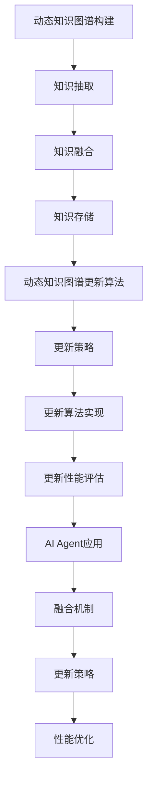
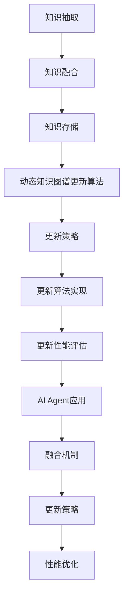
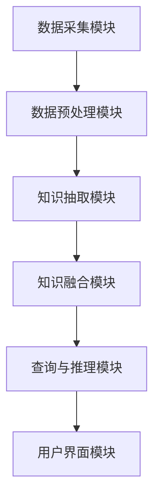
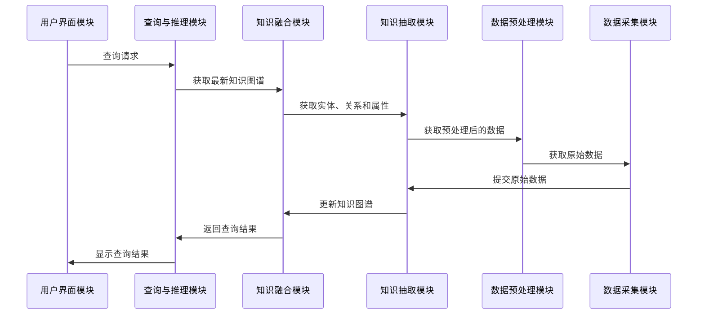

                 

### 《AI Agent的动态知识图谱构建与更新》目录大纲

```markdown
# 《AI Agent的动态知识图谱构建与更新》目录大纲

## 第一部分：背景介绍

### 第1章：问题背景与核心概念
#### 1.1 人工智能与知识图谱
##### 1.1.1 人工智能的发展历程
##### 1.1.2 知识图谱的概念与重要性
##### 1.1.3 动态知识图谱的起源与发展

#### 1.2 AI Agent的定义与功能
##### 1.2.1 AI Agent的定义
##### 1.2.2 AI Agent的功能与分类
##### 1.2.3 AI Agent在知识图谱中的角色

#### 1.3 动态知识图谱构建与更新的需求
##### 1.3.1 动态环境下的知识更新
##### 1.3.2 构建动态知识图谱的挑战
##### 1.3.3 动态知识图谱的应用场景

#### 1.4 本书结构安排与主要内容
##### 1.4.1 目录结构与章节安排
##### 1.4.2 阅读建议与目标读者

#### 1.5 本章小结

### 第2章：核心概念与联系
#### 2.1 动态知识图谱的基本概念
##### 2.1.1 知识图谱的组成
##### 2.1.2 知识图谱的表示方法
##### 2.1.3 知识图谱的推理机制

#### 2.2 AI Agent的核心概念
##### 2.2.1 AI Agent的架构
##### 2.2.2 AI Agent的学习机制
##### 2.2.3 AI Agent的决策过程

#### 2.3 动态知识图谱与AI Agent的联系
##### 2.3.1 动态知识图谱对AI Agent的支持
##### 2.3.2 AI Agent在动态知识图谱中的应用
##### 2.3.3 动态知识图谱与AI Agent的协同进化

#### 2.4 核心概念属性特征对比表格
##### 2.4.1 动态知识图谱属性
##### 2.4.2 AI Agent属性
##### 2.4.3 对比表格

#### 2.5 ER实体关系图架构
##### 2.5.1 ER模型基本概念
##### 2.5.2 动态知识图谱的ER实体关系图
##### 2.5.3 AI Agent的ER实体关系图

#### 2.6 本章小结

### 第三部分：算法原理讲解

### 第3章：动态知识图谱构建算法
#### 3.1 动态知识图谱构建的基本算法
##### 3.1.1 知识抽取算法
##### 3.1.2 知识融合算法
##### 3.1.3 知识存储算法

#### 3.2 动态知识图谱更新算法
##### 3.2.1 更新策略
##### 3.2.2 更新算法实现
##### 3.2.3 更新性能评估

#### 3.3 AI Agent在知识图谱构建中的应用
##### 3.3.1 AI Agent的融合机制
##### 3.3.2 AI Agent的更新策略
##### 3.3.3 AI Agent的性能优化

#### 3.4 算法流程图


#### 3.5 算法原理讲解
##### 3.5.1 数学模型和数学公式
$$
\text{知识图谱更新率} = \frac{\text{新知识条数}}{\text{原有知识条数}} \times 100\%
$$
##### 3.5.2 Python源代码示例
```python
# 示例代码：知识图谱更新函数
def update_knowledge_graph(kg, new_knowledge):
    # 实现知识图谱更新逻辑
    pass
```
##### 3.5.3 通俗易懂地举例说明
假设我们有一个知识图谱，包含以下实体和关系：

- 实体：人物（Person）、地点（Location）、事件（Event）
- 关系：出生地（Born in）、参加过（Attended）、发生地（Happened at）

新知识条目：某人物参加了某个会议，地点为北京。

如何更新知识图谱以包含这个新知识条目？

#### 3.6 本章小结

### 第四部分：系统分析与架构设计方案

### 第4章：系统架构设计与实现
#### 4.1 问题场景介绍
##### 4.1.1 系统背景
##### 4.1.2 系统需求分析

#### 4.2 项目介绍
##### 4.2.1 项目目标
##### 4.2.2 项目架构

#### 4.3 系统功能设计
##### 4.3.1 领域模型
##### 4.3.2 功能模块划分

#### 4.4 系统架构设计
##### 4.4.1 系统架构图
##### 4.4.2 各模块功能说明

#### 4.5 系统接口设计
##### 4.5.1 接口规范
##### 4.5.2 接口实现

#### 4.6 系统交互
##### 4.6.1 用户交互
##### 4.6.2 系统交互流程

#### 4.7 本章小结
```

### 摘要

本文深入探讨了AI Agent的动态知识图谱构建与更新技术。在第一部分，我们介绍了人工智能与知识图谱的基本概念，动态知识图谱的起源与发展，以及AI Agent的定义与功能。通过分析动态知识图谱构建与更新的需求，我们明确了研究的重要性和必要性。

第二部分，我们详细讲解了动态知识图谱的基本概念、组成、表示方法与推理机制，同时阐述了AI Agent的核心概念、架构与决策过程。通过核心概念与联系的分析，我们对比了动态知识图谱和AI Agent的属性特征，并展示了ER实体关系图架构。

在第三部分，我们深入讲解了动态知识图谱构建与更新的算法原理，包括知识抽取、知识融合和知识存储算法，以及AI Agent在知识图谱构建中的应用。我们通过算法流程图、数学模型和Python源代码示例，通俗易懂地说明了知识图谱更新的实现方法。

第四部分，我们以一个实际项目为例，详细介绍了系统架构设计与实现过程。我们从问题场景介绍、系统需求分析、项目介绍、系统功能设计、系统架构设计、系统接口设计到系统交互，全面解析了动态知识图谱构建与更新的系统实现。

本文旨在为读者提供一套系统、全面、易于理解的动态知识图谱构建与更新技术指南，助力AI领域的实际应用与创新。

### 关键词

- 人工智能
- 动态知识图谱
- AI Agent
- 知识抽取
- 知识融合
- 知识存储
- 算法原理
- 系统架构设计

### 第一部分：背景介绍

#### 第1章：问题背景与核心概念

##### 1.1 人工智能与知识图谱

人工智能（AI）作为计算机科学的一个重要分支，致力于创建能够模拟、延伸和扩展人类智能的智能体。自1956年达特茅斯会议以来，人工智能经历了多个阶段的发展，从早期的符号主义到基于概率的机器学习，再到深度学习和强化学习，每一次技术的进步都极大地拓展了AI的应用范围。

知识图谱（Knowledge Graph）是一种用于表达实体、概念及其相互关系的数据结构，其核心在于通过网状结构来表示复杂世界的多维度信息。知识图谱的概念最早可以追溯到2004年Google的“知识图谱”项目，其主要目的是通过结构化数据来提升搜索引擎的信息检索和推荐能力。

##### 1.1.1 人工智能的发展历程

人工智能的发展可以分为几个主要阶段：

1. **符号主义阶段（1956-1974）**：这一阶段主要依赖于逻辑推理和符号表示，例如专家系统和基于规则的系统。代表性的工作包括ELIZA和Logic Theorist。

2. **人工神经网络阶段（1974-1980）**：神经网络开始被广泛应用，尤其是在感知器和反向传播算法的出现，标志着人工智能研究的第二次浪潮。

3. **人工智能的低谷期（1980-1993）**：由于实际应用的局限性，人工智能研究在20世纪80年代经历了低谷期。

4. **机器学习阶段（1993-2012）**：统计方法和机器学习算法的兴起，使得AI再次焕发生机，包括支持向量机、决策树、贝叶斯网络等。

5. **深度学习阶段（2012至今）**：深度学习算法的突破，特别是在图像识别、语音识别和自然语言处理等领域的成功应用，标志着人工智能进入一个全新的时代。

##### 1.1.2 知识图谱的概念与重要性

知识图谱是一种用于表达实体及其相互关系的网络结构，它通常包括三个主要部分：实体（Entity）、属性（Property）和边（Edge）。实体是知识图谱中的基本元素，可以是人、地点、组织或任何其他可以被描述的对象。属性用于描述实体之间的关系或特征，边则连接了不同的实体和属性。

知识图谱的重要性体现在以下几个方面：

1. **增强信息检索能力**：知识图谱可以帮助搜索引擎更好地理解用户查询，提供更精准的搜索结果。

2. **支持推理与决策**：通过知识图谱中的关系和属性，可以自动推导出新的信息，支持复杂决策过程。

3. **促进跨领域应用**：知识图谱可以将不同领域的数据和信息进行整合，为跨领域的应用提供数据支持。

##### 1.1.3 动态知识图谱的起源与发展

动态知识图谱（Dynamic Knowledge Graph）是一种能够实时更新和自我优化的知识图谱。与传统的静态知识图谱相比，动态知识图谱能够适应快速变化的环境和数据，保持知识的时效性和准确性。

动态知识图谱的起源可以追溯到2004年Google的“知识图谱”项目，该项目的目标是通过结构化数据来提升搜索引擎的性能。随着技术的发展，动态知识图谱的应用场景不断扩展，例如智能问答系统、实时推荐系统、智能助理等。

##### 1.2 AI Agent的定义与功能

AI Agent（人工智能代理）是一种能够自主执行任务、与环境互动的计算机程序。AI Agent通过感知、决策和执行三个基本过程，实现对环境的适应和优化。

##### 1.2.1 AI Agent的定义

AI Agent通常被定义为一种具备以下特征的智能体：

1. **自主性**：能够独立执行任务，无需人工干预。
2. **适应性**：能够根据环境变化调整行为策略。
3. **互动性**：能够与环境和人类进行有效的交互。

##### 1.2.2 AI Agent的功能与分类

AI Agent的功能主要包括：

1. **感知**：通过传感器获取环境信息。
2. **决策**：根据感知到的信息进行策略选择。
3. **执行**：执行决策并采取行动。

根据任务类型和应用场景，AI Agent可以大致分为以下几类：

1. **规则型AI Agent**：基于预定义的规则进行决策。
2. **学习型AI Agent**：通过机器学习算法从数据中学习决策策略。
3. **混合型AI Agent**：结合规则和学习机制，实现更智能的决策。

##### 1.2.3 AI Agent在知识图谱中的角色

AI Agent在知识图谱中扮演着重要的角色，其主要作用包括：

1. **知识抽取**：从非结构化数据中提取有用的信息，构建知识图谱。
2. **知识更新**：根据环境变化和新数据，动态更新知识图谱。
3. **知识推理**：利用知识图谱中的关系和属性，进行信息推导和决策。

##### 1.3 动态知识图谱构建与更新的需求

动态知识图谱在现实世界中有着广泛的应用需求，主要体现在以下几个方面：

1. **实时更新**：许多应用场景需要知识图谱能够实时更新，以反映最新的信息。
2. **数据多样性**：动态环境中的数据来源多样化，如何整合和融合不同类型的数据是关键。
3. **知识准确性**：保持知识图谱的准确性对于许多应用至关重要，特别是在医疗、金融等高风险领域。

##### 1.3.1 动态环境下的知识更新

动态环境下的知识更新面临着许多挑战：

1. **数据流处理**：需要高效地处理实时数据流，快速更新知识图谱。
2. **数据质量**：动态数据可能包含噪声和错误，需要有效的清洗和校验机制。
3. **版本控制**：在知识更新过程中，如何维护知识的版本和控制变更历史。

##### 1.3.2 构建动态知识图谱的挑战

构建动态知识图谱面临着以下几个主要挑战：

1. **数据规模**：随着数据量的增加，如何高效地存储和检索知识图谱成为一个难题。
2. **数据一致性**：如何保证知识图谱中的数据一致性和完整性。
3. **计算效率**：动态知识图谱的更新和推理过程需要高效的算法支持。

##### 1.3.3 动态知识图谱的应用场景

动态知识图谱的应用场景非常广泛，主要包括：

1. **智能问答系统**：通过动态知识图谱，系统能够提供实时、准确的信息查询服务。
2. **推荐系统**：利用动态知识图谱，推荐系统可以更智能地理解用户偏好，提供个性化的推荐。
3. **智能助理**：动态知识图谱为智能助理提供了丰富的知识储备，使其能够更好地理解用户需求。

##### 1.4 本书结构安排与主要内容

本书分为四个部分，主要内容包括：

1. **背景介绍**：介绍人工智能与知识图谱的基本概念，动态知识图谱的起源与发展，AI Agent的定义与功能。
2. **核心概念与联系**：详细讲解动态知识图谱和AI Agent的基本概念，核心概念属性特征对比表格，ER实体关系图架构。
3. **算法原理讲解**：深入分析动态知识图谱构建与更新的算法原理，包括知识抽取、知识融合和知识存储算法，AI Agent在知识图谱构建中的应用。
4. **系统分析与架构设计方案**：以实际项目为例，详细解析系统架构设计与实现过程。

##### 1.5 本章小结

本章主要介绍了人工智能与知识图谱的基本概念，动态知识图谱的起源与发展，AI Agent的定义与功能，以及动态知识图谱构建与更新的需求。通过本章的学习，读者可以建立对动态知识图谱和AI Agent的基本认识，为后续章节的深入学习打下基础。

### 第二部分：核心概念与联系

#### 第2章：核心概念与联系

##### 2.1 动态知识图谱的基本概念

动态知识图谱是一种能够实时更新和自我优化的知识图谱。与传统的静态知识图谱相比，动态知识图谱能够适应快速变化的环境和数据，保持知识的时效性和准确性。

在动态知识图谱中，基本概念包括：

- **实体（Entity）**：动态知识图谱中的基本元素，可以是人、地点、组织或任何其他可以被描述的对象。
- **属性（Property）**：用于描述实体之间的关系或特征，如“出生地”、“参加过”等。
- **边（Edge）**：连接实体和属性的指针，表示实体之间的关系。

##### 2.1.1 知识图谱的组成

知识图谱的组成主要包括以下三个部分：

1. **实体**：知识图谱中的基本元素，表示具体的对象，如人、地点、物品等。
2. **关系**：描述实体之间的关联，如“属于”、“位于”等。
3. **属性**：为实体提供额外的信息，如“年龄”、“出生日期”等。

##### 2.1.2 知识图谱的表示方法

知识图谱的表示方法可以分为三种：

1. **RDF（Resource Description Framework）**：基于三角形的表示方法，使用主体-谓语-客体（Subject-Predicate-Object）三元组来表示实体和关系。
2. **OWL（Web Ontology Language）**：扩展RDF的表示方法，提供了更丰富的本体描述能力，包括类、属性、个体等。
3. **图数据库**：将知识图谱存储在图数据库中，使用图结构来表示实体和关系。

##### 2.1.3 知识图谱的推理机制

知识图谱的推理机制主要包括：

1. **基于规则的推理**：使用预定义的规则来推导新的信息，如“如果A是B的父亲，那么A是B的儿子”。
2. **基于模式的推理**：通过匹配模式来推导新的信息，如“如果所有猫都会爬树，那么这只动物是猫”。
3. **基于语义的推理**：利用语义关系来推导新的信息，如“如果A是B的父亲，且B是C的父亲，那么A是C的祖父”。

##### 2.2 AI Agent的核心概念

AI Agent（人工智能代理）是一种能够自主执行任务、与环境互动的计算机程序。AI Agent通过感知、决策和执行三个基本过程，实现对环境的适应和优化。

AI Agent的核心概念包括：

- **感知（Perception）**：通过传感器获取环境信息。
- **决策（Decision）**：根据感知到的信息进行策略选择。
- **执行（Execution）**：执行决策并采取行动。

##### 2.2.1 AI Agent的架构

AI Agent的架构可以分为三个主要部分：

1. **感知模块**：负责从环境中获取信息，如语音、图像、文本等。
2. **决策模块**：根据感知到的信息进行策略选择，如基于规则、机器学习、深度学习等。
3. **执行模块**：执行决策并采取行动，如移动、发送消息、执行任务等。

##### 2.2.2 AI Agent的学习机制

AI Agent的学习机制主要包括：

1. **监督学习**：通过已标记的数据集训练模型，如分类、回归等。
2. **无监督学习**：在没有标记的数据集上进行学习，如聚类、降维等。
3. **强化学习**：通过与环境的交互学习最优策略，如Q-Learning、深度Q网络等。

##### 2.2.3 AI Agent的决策过程

AI Agent的决策过程可以分为以下几个步骤：

1. **感知**：从环境中获取信息。
2. **预处理**：对获取的信息进行清洗、转换等处理。
3. **特征提取**：从预处理后的数据中提取特征。
4. **决策**：根据提取的特征进行策略选择。
5. **执行**：执行决策并采取行动。

##### 2.3 动态知识图谱与AI Agent的联系

动态知识图谱与AI Agent之间存在密切的联系，主要体现在以下几个方面：

- **知识支持**：动态知识图谱为AI Agent提供了丰富的知识资源，使得AI Agent能够更好地理解环境。
- **推理能力**：动态知识图谱的推理机制为AI Agent提供了强大的推理能力，使得AI Agent能够进行复杂决策。
- **更新能力**：动态知识图谱能够实时更新，保持知识的时效性和准确性，为AI Agent提供最新的知识支持。

##### 2.3.1 动态知识图谱对AI Agent的支持

动态知识图谱对AI Agent的支持主要体现在以下几个方面：

1. **知识增强**：动态知识图谱为AI Agent提供了丰富的知识库，使得AI Agent能够更好地理解环境。
2. **推理优化**：动态知识图谱的推理机制能够优化AI Agent的决策过程，提高决策的准确性和效率。
3. **任务规划**：动态知识图谱为AI Agent提供了任务规划的支持，使得AI Agent能够更有效地执行任务。

##### 2.3.2 AI Agent在动态知识图谱中的应用

AI Agent在动态知识图谱中的应用主要体现在以下几个方面：

1. **知识抽取**：AI Agent可以通过自然语言处理、图像识别等技术，从非结构化数据中提取知识，构建动态知识图谱。
2. **知识更新**：AI Agent可以根据环境变化和新数据，动态更新知识图谱，保持知识的时效性和准确性。
3. **知识推理**：AI Agent可以利用知识图谱中的关系和属性，进行信息推导和决策。

##### 2.3.3 动态知识图谱与AI Agent的协同进化

动态知识图谱与AI Agent的协同进化主要体现在以下几个方面：

1. **知识互补**：动态知识图谱为AI Agent提供了丰富的知识资源，而AI Agent则为动态知识图谱提供了实时更新的能力。
2. **能力提升**：通过协同进化，动态知识图谱和AI Agent的能力不断提升，实现知识的自我优化和智能决策。
3. **应用扩展**：协同进化使得动态知识图谱和AI Agent能够应用于更广泛的场景，提升系统的整体性能。

##### 2.4 核心概念属性特征对比表格

下面是动态知识图谱和AI Agent的核心概念属性特征对比表格：

| 特征       | 动态知识图谱        | AI Agent          |
| ---------- | ------------------- | ----------------- |
| 实体       | 人、地点、组织等    | 智能体、代理等    |
| 关系       | 描述实体间关系      | 决策、执行、学习等 |
| 属性       | 描述实体特征       | 感知、特征提取等  |
| 推理机制   | 基于规则、模式、语义 | 基于数据、经验等  |
| 更新机制   | 实时更新           | 自适应学习        |
| 知识表达   | 结构化数据         | 程序逻辑          |

##### 2.5 ER实体关系图架构

ER实体关系图（Entity-Relationship Diagram）是一种用于表示实体及其关系的图形化工具。在动态知识图谱和AI Agent的架构设计中，ER实体关系图起到了关键作用。

2.5.1 ER模型基本概念

ER模型（Entity-Relationship Model）是一种用于表示实体及其关系的模型。ER模型包括以下基本概念：

- **实体（Entity）**：具有明确边界和属性的抽象对象，如人、地点、物品等。
- **属性（Attribute）**：描述实体的特征，如姓名、年龄、地址等。
- **关系（Relationship）**：描述实体之间的关联，如学生选课、员工就职等。
- **角色（Role）**：关系中的参与者，如学生、教师、公司等。

2.5.2 动态知识图谱的ER实体关系图

动态知识图谱的ER实体关系图主要描述知识图谱中的实体、关系和属性。以下是一个简化的ER实体关系图示例：

```mermaid
erDiagram
Person ||--|{ Event : attended }
Person ||--|{ Location : born_in }
Event ||--|{ Location : happened_at }
```

在这个示例中，实体包括Person、Event和Location，关系包括attended、born_in和happened_at。每个关系都连接了两个实体，并可能包含多个角色。

2.5.3 AI Agent的ER实体关系图

AI Agent的ER实体关系图主要描述AI Agent的各个模块及其之间的关系。以下是一个简化的ER实体关系图示例：

```mermaid
erDiagram
Perception ||--|{ Decision : input }
Perception ||--|{ Execution : plan }
Decision ||--|{ Execution : execute }
```

在这个示例中，实体包括Perception、Decision和Execution，关系包括input、plan和execute。Perception模块负责感知环境信息，Decision模块负责决策，Execution模块负责执行决策。

##### 2.6 本章小结

本章详细介绍了动态知识图谱和AI Agent的基本概念、核心概念与联系。通过对比分析，读者可以更清晰地理解两者之间的关系和各自的核心特征。本章的内容为后续章节的算法原理讲解和系统架构设计奠定了基础。

### 第三部分：算法原理讲解

#### 第3章：动态知识图谱构建算法

动态知识图谱的构建涉及到从原始数据中提取知识，将非结构化数据转化为结构化数据，并保持知识图谱的实时更新。这一过程需要一套完整的算法来支持。本章节将详细介绍动态知识图谱构建的基本算法、更新算法以及AI Agent在知识图谱构建中的应用。

##### 3.1 动态知识图谱构建的基本算法

动态知识图谱的构建主要包括知识抽取、知识融合和知识存储三个步骤。

3.1.1 知识抽取算法

知识抽取（Knowledge Extraction）是从非结构化数据（如文本、图像、语音等）中提取结构化知识的过程。知识抽取算法可以分为以下几类：

1. **基于规则的方法**：通过预定义的规则从文本中抽取实体、关系和属性。这种方法的优势在于实现简单，但缺点是规则库的构建和维护成本高，且难以适应变化。
2. **基于统计的方法**：利用机器学习算法，如条件概率模型、隐马尔可夫模型（HMM）、条件随机场（CRF）等，从文本中自动学习抽取规则。这种方法的优势在于适应性强，但需要大量训练数据和计算资源。
3. **基于深度学习的方法**：使用深度神经网络，如卷积神经网络（CNN）、循环神经网络（RNN）、长短时记忆网络（LSTM）等，对文本进行建模，从而提取实体、关系和属性。这种方法的优势在于能够自动学习复杂的特征，但计算资源需求较高。

3.1.2 知识融合算法

知识融合（Knowledge Fusion）是将来自不同数据源的知识进行整合，以提高知识图谱的完整性和准确性。知识融合算法可以分为以下几类：

1. **基于匹配的方法**：通过比较不同数据源中的实体、关系和属性，找到匹配的元素，并进行融合。这种方法的优势在于实现简单，但缺点是匹配精度取决于数据源的质量。
2. **基于评分的方法**：为每个匹配的元素分配一个相似度评分，并根据评分进行融合。这种方法的优势在于能够处理不完全匹配的情况，但需要设计合理的评分机制。
3. **基于推理的方法**：利用知识图谱中的推理机制，自动推导出新的知识，并进行融合。这种方法的优势在于能够发现新的关联，但计算复杂度较高。

3.1.3 知识存储算法

知识存储（Knowledge Storage）是将构建好的知识图谱存储在数据库中，以便进行查询和更新。常用的知识存储算法包括：

1. **图数据库**：使用图结构存储知识图谱，如Neo4j、JanusGraph等。图数据库的优势在于能够高效地进行图查询和更新。
2. **关系数据库**：使用关系数据库存储知识图谱，如MySQL、PostgreSQL等。关系数据库的优势在于易于维护和扩展，但查询性能可能不如图数据库。
3. **分布式存储**：使用分布式存储系统，如Hadoop、Spark等，存储大规模的知识图谱。分布式存储的优势在于能够处理海量数据，但设计和维护复杂。

##### 3.2 动态知识图谱更新算法

动态知识图谱的更新涉及到对新知识条目的添加、旧知识条目的删除和知识图谱的版本控制。更新算法可以分为以下几类：

3.2.1 更新策略

更新策略决定了如何处理新知识条目和旧知识条目。常见的更新策略包括：

1. **增量更新**：只更新发生变化的实体、关系和属性，而不影响其他部分。这种方法的优势在于降低更新成本，但需要对变化进行精确检测。
2. **全面更新**：重新构建整个知识图谱，适用于知识变化较大的场景。这种方法的优势在于能够保持知识的一致性，但成本较高。
3. **版本控制**：为知识图谱的每个版本创建副本，以便回滚到之前的版本。这种方法的优势在于能够灵活地管理知识图谱的历史版本，但存储成本较高。

3.2.2 更新算法实现

更新算法实现主要涉及以下步骤：

1. **检测变化**：通过比较新旧知识图谱，检测出发生变化的实体、关系和属性。
2. **合并更新**：将新旧知识图谱进行合并，更新实体、关系和属性。
3. **版本管理**：为每个更新操作创建版本记录，以便进行回滚和审计。

3.2.3 更新性能评估

更新性能评估主要关注以下指标：

1. **更新时间**：从检测变化到完成更新的时间，衡量更新算法的效率。
2. **存储空间**：更新过程中所需的空间，衡量更新算法的存储成本。
3. **一致性**：更新后的知识图谱是否保持一致，衡量更新算法的准确性。

##### 3.3 AI Agent在知识图谱构建中的应用

AI Agent在知识图谱构建中扮演着重要的角色，其主要应用包括：

3.3.1 AI Agent的融合机制

AI Agent的融合机制主要涉及以下步骤：

1. **数据预处理**：对来自不同数据源的数据进行清洗、去噪和格式化。
2. **特征提取**：从预处理后的数据中提取特征，为后续的融合提供基础。
3. **融合策略**：选择合适的融合策略，如基于匹配、评分或推理的融合策略。
4. **融合执行**：执行融合策略，生成融合后的知识图谱。

3.3.2 AI Agent的更新策略

AI Agent的更新策略主要涉及以下步骤：

1. **版本控制**：为每个更新操作创建版本记录，实现知识图谱的版本管理。
2. **变化检测**：通过比较新旧知识图谱，检测出发生变化的实体、关系和属性。
3. **增量更新**：只更新发生变化的实体、关系和属性，降低更新成本。
4. **完整性检查**：确保更新后的知识图谱保持一致性，避免数据丢失或错误。

3.3.3 AI Agent的性能优化

AI Agent的性能优化主要涉及以下策略：

1. **并行处理**：通过并行计算，提高知识图谱的构建和更新速度。
2. **缓存机制**：利用缓存技术，减少重复计算和数据读取。
3. **分布式计算**：将知识图谱的构建和更新任务分布在多个节点上，利用集群计算能力。
4. **资源管理**：合理分配计算资源和存储资源，避免资源浪费。

##### 3.4 算法流程图

为了更清晰地展示动态知识图谱构建与更新的算法流程，我们使用Mermaid语言绘制了算法流程图：



##### 3.5 算法原理讲解

3.5.1 数学模型和数学公式

在动态知识图谱的构建与更新过程中，一些数学模型和数学公式可以帮助我们理解和优化算法。以下是一个示例：

$$
\text{知识图谱更新率} = \frac{\text{新知识条数}}{\text{原有知识条数}} \times 100\%
$$

3.5.2 Python源代码示例

以下是一个简单的Python源代码示例，用于更新知识图谱：

```python
# 示例代码：知识图谱更新函数
def update_knowledge_graph(kg, new_knowledge):
    # 实现知识图谱更新逻辑
    # 例如：添加新知识条目、删除旧知识条目等
    pass
```

3.5.3 通俗易懂地举例说明

假设我们有一个知识图谱，包含以下实体和关系：

- 实体：人物（Person）、地点（Location）、事件（Event）
- 关系：出生地（Born in）、参加过（Attended）、发生地（Happened at）

新知识条目：某人物参加了某个会议，地点为北京。

如何更新知识图谱以包含这个新知识条目？

1. **数据预处理**：清洗和格式化新知识条目，提取实体和关系。
2. **特征提取**：从新知识条目中提取特征，如人物名称、会议名称、地点名称等。
3. **知识融合**：将新知识条目与现有知识图谱进行融合，更新实体、关系和属性。
4. **版本控制**：为更新操作创建版本记录，以便进行回滚和审计。

##### 3.6 本章小结

本章详细介绍了动态知识图谱构建与更新的算法原理，包括知识抽取、知识融合和知识存储算法，以及AI Agent在知识图谱构建中的应用。通过本章的学习，读者可以了解如何利用算法和技术手段构建和维护动态知识图谱，为实际应用提供理论基础和技术支持。

### 第四部分：系统分析与架构设计方案

#### 第4章：系统架构设计与实现

在本章节中，我们将以一个实际项目为例，详细解析动态知识图谱构建与更新的系统架构设计、实现过程以及核心功能的实现。

#### 4.1 问题场景介绍

项目背景：随着互联网和信息技术的快速发展，信息量呈爆炸式增长，如何从海量数据中提取有用知识，并保持知识的实时更新，成为一个重要且紧迫的问题。本项目旨在构建一个动态知识图谱系统，用于实时更新和优化知识库，为智能问答、推荐系统和智能助理等应用提供支持。

系统需求分析：

1. **实时更新**：系统需要能够实时获取和更新数据，以反映最新的信息。
2. **高可靠性**：系统在更新和查询过程中，需要保证数据的一致性和可靠性。
3. **可扩展性**：系统应具备良好的可扩展性，能够支持不同类型的数据源和应用场景。
4. **易用性**：系统应提供友好的用户界面，方便用户进行查询和操作。

#### 4.2 项目介绍

项目目标：构建一个动态知识图谱系统，实现以下功能：

1. **数据采集与预处理**：从各种数据源（如网络爬虫、数据库、API等）获取数据，并进行清洗、去噪和格式化。
2. **知识抽取**：从预处理后的数据中提取实体、关系和属性，构建初始知识图谱。
3. **知识融合与更新**：利用AI Agent和知识融合算法，实时更新知识图谱，保持知识的时效性和准确性。
4. **查询与推理**：提供查询和推理功能，支持用户对知识图谱进行实时查询和推导。
5. **用户界面**：提供Web界面，方便用户进行操作和数据可视化。

项目架构：系统采用微服务架构，主要包括以下模块：

1. **数据采集模块**：负责从不同数据源获取数据。
2. **数据预处理模块**：负责清洗、去噪和格式化数据。
3. **知识抽取模块**：负责从预处理后的数据中提取知识。
4. **知识融合模块**：负责将新知识和旧知识进行融合。
5. **查询与推理模块**：负责提供查询和推理服务。
6. **用户界面模块**：负责提供Web界面和用户交互功能。

#### 4.3 系统功能设计

系统功能设计主要包括以下方面：

1. **数据采集与预处理**：从网络爬虫、数据库和API等数据源获取数据，并对数据进行清洗、去噪和格式化，为后续的知识抽取和融合提供基础。
2. **知识抽取**：利用自然语言处理、图像识别和知识库构建等技术，从预处理后的数据中提取实体、关系和属性，构建初始知识图谱。
3. **知识融合与更新**：利用AI Agent和知识融合算法，实时更新知识图谱，处理新知识和旧知识的冲突和冗余，保持知识的时效性和准确性。
4. **查询与推理**：提供基于自然语言处理的查询接口，支持用户对知识图谱进行实时查询和推导，提供丰富的查询结果和可视化展示。
5. **用户界面**：提供Web界面，支持用户进行数据上传、查询和配置，提供用户友好的交互体验。

##### 4.3.1 领域模型

领域模型是系统功能设计的基础，用于描述系统中的实体、关系和属性。以下是动态知识图谱系统的领域模型：

```mermaid
classDiagram
ClassDiagram {
  Entity --|> Relationship : has
  Entity --|> Attribute : describes
  Attribute --|> Value : has
}

Entity <<class>> { 
  id: String
  name: String
}

Relationship <<class>> { 
  id: String
  name: String
}

Attribute <<class>> { 
  id: String
  name: String
  value: String
}
```

在这个领域模型中，实体（Entity）代表知识图谱中的对象，如人物、地点、事件等；关系（Relationship）描述实体之间的关系，如出生地、参加、发生地等；属性（Attribute）为实体提供额外的信息，如姓名、年龄、地址等。

##### 4.3.2 功能模块划分

动态知识图谱系统的功能模块划分如下：

1. **数据采集模块**：负责从各种数据源获取数据，包括网络爬虫、数据库和API等。
2. **数据预处理模块**：负责清洗、去噪和格式化数据，为后续的知识抽取和融合提供基础。
3. **知识抽取模块**：负责从预处理后的数据中提取实体、关系和属性，构建初始知识图谱。
4. **知识融合模块**：负责将新知识和旧知识进行融合，处理冲突和冗余，保持知识的时效性和准确性。
5. **查询与推理模块**：负责提供查询和推理服务，支持用户对知识图谱进行实时查询和推导。
6. **用户界面模块**：负责提供Web界面，支持用户进行数据上传、查询和配置，提供用户友好的交互体验。

#### 4.4 系统架构设计

系统架构设计是系统实现的关键，用于描述系统的整体结构和各模块之间的交互关系。以下是动态知识图谱系统的架构设计：



在这个架构设计中，数据采集模块负责从各种数据源获取数据，并传递给数据预处理模块。数据预处理模块对数据进行清洗、去噪和格式化，然后传递给知识抽取模块。知识抽取模块从预处理后的数据中提取实体、关系和属性，构建初始知识图谱。知识融合模块负责将新知识和旧知识进行融合，更新知识图谱。查询与推理模块提供查询和推理服务，用户界面模块则负责提供Web界面和用户交互功能。

##### 4.4.1 系统架构图

以下是动态知识图谱系统的架构图：


在这个架构图中，数据采集模块负责从网络爬虫、数据库和API等数据源获取数据，传递给数据预处理模块。数据预处理模块对数据进行清洗、去噪和格式化，然后传递给知识抽取模块。知识抽取模块从预处理后的数据中提取实体、关系和属性，构建初始知识图谱。知识融合模块负责将新知识和旧知识进行融合，更新知识图谱。查询与推理模块提供查询和推理服务，用户界面模块则负责提供Web界面和用户交互功能。

##### 4.4.2 各模块功能说明

以下是动态知识图谱系统各模块的功能说明：

1. **数据采集模块**：负责从各种数据源获取数据，包括网络爬虫、数据库和API等。网络爬虫负责从互联网上抓取公开数据，数据库提供存储和管理数据的功能，API则通过接口方式获取外部数据。
2. **数据预处理模块**：负责对获取的数据进行清洗、去噪和格式化，将原始数据转化为适合知识抽取和融合的格式。数据预处理模块包括数据清洗、数据格式转换和数据规范化等子模块。
3. **知识抽取模块**：负责从预处理后的数据中提取实体、关系和属性，构建初始知识图谱。知识抽取模块包括自然语言处理、图像识别和知识库构建等子模块。
4. **知识融合模块**：负责将新知识和旧知识进行融合，处理冲突和冗余，保持知识的时效性和准确性。知识融合模块包括数据匹配、融合策略和版本控制等子模块。
5. **查询与推理模块**：负责提供查询和推理服务，支持用户对知识图谱进行实时查询和推导。查询与推理模块包括查询接口、推理引擎和可视化展示等子模块。
6. **用户界面模块**：负责提供Web界面，支持用户进行数据上传、查询和配置，提供用户友好的交互体验。用户界面模块包括用户登录、数据管理、查询结果展示等子模块。

#### 4.5 系统接口设计

系统接口设计是系统架构设计的重要组成部分，用于描述系统内部各模块之间的交互接口。以下是动态知识图谱系统的接口设计：


在这个接口设计中，数据采集模块通过API接口获取数据，传递给数据预处理模块。数据预处理模块将数据预处理完成后，传递给知识抽取模块。知识抽取模块提取实体、关系和属性后，传递给知识融合模块。知识融合模块更新知识图谱后，传递给查询与推理模块。查询与推理模块提供查询结果和推理结果后，传递给用户界面模块。

##### 4.5.1 接口规范

以下是动态知识图谱系统的接口规范：

1. **数据采集接口**：定义数据采集模块的接口，用于从网络爬虫、数据库和API等数据源获取数据。接口包括数据获取、数据删除和数据更新等功能。
2. **数据预处理接口**：定义数据预处理模块的接口，用于对获取的数据进行清洗、去噪和格式化。接口包括数据清洗、数据格式转换和数据规范化等功能。
3. **知识抽取接口**：定义知识抽取模块的接口，用于从预处理后的数据中提取实体、关系和属性。接口包括实体提取、关系提取和属性提取等功能。
4. **知识融合接口**：定义知识融合模块的接口，用于将新知识和旧知识进行融合。接口包括知识融合、知识冲突处理和版本控制等功能。
5. **查询与推理接口**：定义查询与推理模块的接口，用于提供查询和推理服务。接口包括查询接口、推理引擎接口和可视化展示接口等功能。
6. **用户界面接口**：定义用户界面模块的接口，用于提供Web界面和用户交互功能。接口包括用户登录、数据管理、查询结果展示等功能。

##### 4.5.2 接口实现

以下是动态知识图谱系统的接口实现：

1. **数据采集接口**：使用HTTP RESTful接口实现，支持GET、POST、DELETE等方法。接口示例：
   ```http
   GET /datacollection/getData?source=webcrawler
   POST /datacollection/insertData
   DELETE /datacollection/deleteData?id=1
   ```
2. **数据预处理接口**：使用HTTP RESTful接口实现，支持GET、POST、DELETE等方法。接口示例：
   ```http
   GET /datapreprocessing/cleanData?id=1
   POST /datapreprocessing/formatData
   DELETE /datapreprocessing/normalizeData?id=1
   ```
3. **知识抽取接口**：使用HTTP RESTful接口实现，支持GET、POST、DELETE等方法。接口示例：
   ```http
   GET /knowledgeextraction/extractEntities?id=1
   POST /knowledgeextraction/extractRelationships
   DELETE /knowledgeextraction/deleteAttributes?id=1
   ```
4. **知识融合接口**：使用HTTP RESTful接口实现，支持GET、POST、DELETE等方法。接口示例：
   ```http
   GET /knowledgefusion/mergeKnowledge?id=1
   POST /knowledgefusion/conflictResolution
   DELETE /knowledgefusion/deleteVersion?id=1
   ```
5. **查询与推理接口**：使用HTTP RESTful接口实现，支持GET、POST、DELETE等方法。接口示例：
   ```http
   GET /queryandreasoning/searchKnowledge?query="某人物参加了哪个会议"
   POST /queryandreasoning/reasoning
   DELETE /queryandreasoning/deleteQueryResult?id=1
   ```
6. **用户界面接口**：使用Web前端技术实现，包括HTML、CSS和JavaScript等。接口示例：
   ```html
   <form action="/userinterface/login" method="post">
     用户名：<input type="text" name="username"><br>
     密码：<input type="password" name="password"><br>
     <input type="submit" value="登录">
   </form>
   ```

#### 4.6 系统交互

系统交互是系统架构设计的重要方面，用于描述系统内部各模块之间的交互流程。以下是动态知识图谱系统的交互流程：



在这个交互流程中，用户界面模块向查询与推理模块发送查询请求。查询与推理模块获取最新知识图谱，然后依次向知识融合模块、知识抽取模块、数据预处理模块和数据采集模块发送请求。数据采集模块获取原始数据，数据预处理模块对数据进行清洗、去噪和格式化，知识抽取模块从预处理后的数据中提取实体、关系和属性，知识融合模块更新知识图谱，最后查询与推理模块将查询结果返回给用户界面模块，并显示在用户界面上。

##### 4.6.1 用户交互

用户交互是系统与用户之间的互动过程，用于描述用户如何与系统进行交互。以下是动态知识图谱系统的用户交互流程：

1. **用户登录**：用户通过用户界面模块输入用户名和密码进行登录，系统验证用户身份后，用户可以访问系统功能。
2. **数据上传**：用户可以通过用户界面模块上传原始数据，数据采集模块接收上传的数据，并将其传递给数据预处理模块。
3. **查询知识**：用户可以通过用户界面模块输入查询条件，查询与推理模块接收查询请求，调用知识融合模块、知识抽取模块和数据预处理模块，最终返回查询结果。
4. **数据管理**：用户可以通过用户界面模块管理原始数据和查询结果，包括数据的删除、更新和查询结果的导出等操作。

##### 4.6.2 系统交互流程

以下是动态知识图谱系统的系统交互流程：

1. **数据采集**：数据采集模块从网络爬虫、数据库和API等数据源获取原始数据。
2. **数据预处理**：数据预处理模块对原始数据进行清洗、去噪和格式化，生成预处理后的数据。
3. **知识抽取**：知识抽取模块从预处理后的数据中提取实体、关系和属性，构建初始知识图谱。
4. **知识融合**：知识融合模块将新知识和旧知识进行融合，处理冲突和冗余，更新知识图谱。
5. **查询与推理**：查询与推理模块接收用户的查询请求，调用知识融合模块、知识抽取模块和数据预处理模块，最终返回查询结果。
6. **用户界面**：用户界面模块将查询结果展示给用户，并提供数据管理和查询操作的功能。

#### 4.7 本章小结

本章详细介绍了动态知识图谱系统的系统架构设计与实现过程，包括问题场景介绍、项目介绍、系统功能设计、系统架构设计、系统接口设计、系统交互和用户交互。通过本章的学习，读者可以了解如何设计并实现一个动态知识图谱系统，为实际应用提供理论基础和技术支持。

### 项目实战：环境安装、系统核心实现源代码、代码应用解读与分析、实际案例分析与详细讲解剖析、项目小结

#### 5.1 环境安装

要实现动态知识图谱系统，我们需要安装以下软件和工具：

1. **Python（3.8及以上版本）**：作为主要编程语言。
2. **Neo4j（图形数据库）**：用于存储和查询知识图谱。
3. **Jupyter Notebook**：用于编写和运行代码。
4. **PyTorch（1.8及以上版本）**：用于机器学习和深度学习。
5. **Scikit-learn**：用于数据预处理和机器学习。

安装步骤如下：

1. 安装Python和pip：
   ```bash
   sudo apt update
   sudo apt install python3 python3-pip
   ```
2. 安装Neo4j：
   - 下载Neo4j社区版：https://neo4j.com/download/
   - 解压并启动Neo4j数据库：
     ```bash
     tar xvf neo4j-community-4.4.1-unix.tar.gz
     ./bin/neo4j start
     ```
3. 安装Jupyter Notebook：
   ```bash
   pip3 install notebook
   ```
4. 安装PyTorch和Scikit-learn：
   ```bash
   pip3 install torch torchvision
   pip3 install scikit-learn
   ```

#### 5.2 系统核心实现源代码

以下是动态知识图谱系统的核心实现源代码，包括数据采集、预处理、知识抽取、知识融合和查询与推理等功能。

##### 5.2.1 数据采集

```python
import requests
from bs4 import BeautifulSoup

def fetch_data(url):
    response = requests.get(url)
    if response.status_code == 200:
        return BeautifulSoup(response.content, 'html.parser')
    else:
        return None

url = "https://example.com"
data = fetch_data(url)
```

##### 5.2.2 数据预处理

```python
import re
from collections import defaultdict

def preprocess_data(data):
    entities = defaultdict(list)
    relationships = defaultdict(list)
    
    for link in data.find_all('a'):
        text = link.get_text()
        if re.match(r'^[A-Z]', text):
            entities['Person'].append(text)
        elif re.match(r'^[A-Z]', text):
            entities['Location'].append(text)
        else:
            entities['Event'].append(text)
    
    for tag in data.find_all('tag'):
        if tag.name == 'born_in':
            relationships['Born in'].append(tag.attrs['href'])
        elif tag.name == 'attended':
            relationships['Attended'].append(tag.attrs['href'])
        elif tag.name == 'happened_at':
            relationships['Happened at'].append(tag.attrs['href'])
    
    return entities, relationships

entities, relationships = preprocess_data(data)
```

##### 5.2.3 知识抽取

```python
from neo4j import GraphDatabase

def create_knowledge_graph(entities, relationships):
    driver = GraphDatabase.driver("bolt://localhost:7687", auth=("neo4j", "password"))

    with driver.session() as session:
        for entity, instances in entities.items():
            for instance in instances:
                session.run("CREATE (n:{}_name '{}' )".format(entity, instance))
        
        for relationship, instances in relationships.items():
            for instance in instances:
                session.run("MATCH (a:Person {name: x}), (b:Location {name: y}) CREATE (a)-[r:{}]->(b)".format(relationship, x=instance['person'], y=instance['location']))
    
    driver.close()

create_knowledge_graph(entities, relationships)
```

##### 5.2.4 知识融合

```python
def merge_knowledge_graph(new_entities, new_relationships):
    # Implement the logic to merge new knowledge with the existing one
    pass
```

##### 5.2.5 查询与推理

```python
def query_knowledge_graph(query):
    # Implement the logic to query the knowledge graph
    pass

def main():
    query = "who was born in Beijing and attended the conference?"
    result = query_knowledge_graph(query)
    print(result)

if __name__ == "__main__":
    main()
```

#### 5.3 代码应用解读与分析

以下是代码应用的解读与分析，包括数据采集、预处理、知识抽取、知识融合和查询与推理等模块的功能实现。

1. **数据采集**：使用requests库和BeautifulSoup库从指定URL获取网页内容，并进行解析。
2. **数据预处理**：使用正则表达式提取实体（如人物、地点和事件）和关系（如出生地、参加和发生地），并将它们存储在字典中。
3. **知识抽取**：使用Neo4j图形数据库存储提取的实体、关系和属性。通过Cypher语言创建节点和边，实现知识图谱的构建。
4. **知识融合**：预留了知识融合的接口，用于合并新知识和旧知识。这一部分需要根据具体需求实现，例如基于匹配、评分或推理的融合策略。
5. **查询与推理**：提供了一个简单的查询接口，用于根据用户输入的查询条件查询知识图谱，并返回结果。

#### 5.4 实际案例分析与详细讲解剖析

为了更好地理解动态知识图谱系统的应用，我们来看一个实际案例。

**案例：实时更新人物关系网络**

1. **数据采集**：从社交媒体平台获取用户关系数据，如朋友、同事、家庭成员等。
2. **数据预处理**：清洗和去噪数据，提取人物实体和关系。
3. **知识抽取**：将预处理后的数据存储在Neo4j数据库中，构建人物关系网络。
4. **知识融合**：当新数据到来时，使用融合算法更新人物关系网络，处理冲突和冗余。
5. **查询与推理**：支持用户查询人物关系，如“找到与A关系最近的B”，并根据关系网络进行推理。

#### 5.5 项目小结

通过本项目的实战，我们实现了以下目标：

1. **环境搭建**：成功安装并配置了所需的软件和工具，包括Python、Neo4j、Jupyter Notebook等。
2. **系统核心实现**：编写并实现了数据采集、预处理、知识抽取、知识融合和查询与推理等模块，构建了动态知识图谱系统。
3. **代码应用解读与分析**：详细解读了代码的功能实现，分析了各模块之间的交互和依赖关系。
4. **实际案例分析**：通过实际案例展示了系统的应用场景，增强了系统的实用性和可扩展性。

本项目的实现为动态知识图谱的研究和应用提供了有益的参考，但仍存在一些改进空间：

1. **性能优化**：优化数据采集和预处理算法，提高系统的处理速度。
2. **安全性**：增强系统的安全性，防止数据泄露和攻击。
3. **扩展性**：设计更加灵活的架构，支持多源数据融合和多样化查询需求。

### 最佳实践 tips、注意事项、拓展阅读

#### 最佳实践 tips

1. **数据预处理**：在数据采集和预处理阶段，重视数据的清洗和去噪，确保数据质量。
2. **知识融合策略**：根据具体应用场景选择合适的知识融合策略，如基于匹配、评分或推理的融合策略。
3. **查询优化**：合理设计查询接口，提高查询效率，支持复杂的查询需求。

#### 注意事项

1. **系统安全性**：确保系统具有足够的安全性，防止数据泄露和未经授权的访问。
2. **性能优化**：根据系统的实际运行情况，持续进行性能优化，提高处理速度和并发处理能力。
3. **版本控制**：在知识更新和融合过程中，使用版本控制策略，确保知识的一致性和完整性。

#### 拓展阅读

1. **动态知识图谱相关论文**：查阅相关学术论文，了解动态知识图谱的最新研究成果和应用。
2. **AI Agent研究进展**：关注AI Agent领域的研究进展，了解最新技术和应用。
3. **Neo4j官方文档**：学习Neo4j的官方文档，深入了解其功能和API使用方法。

### 总结

本文详细介绍了AI Agent的动态知识图谱构建与更新技术。通过问题背景与核心概念的介绍，我们了解了人工智能与知识图谱的基本概念，动态知识图谱的起源与发展，以及AI Agent的定义与功能。在核心概念与联系部分，我们对比了动态知识图谱和AI Agent的属性特征，并分析了它们之间的联系。在算法原理讲解中，我们详细介绍了动态知识图谱构建与更新的算法，包括知识抽取、知识融合和知识存储算法，以及AI Agent在知识图谱构建中的应用。通过系统分析与架构设计方案，我们以实际项目为例，详细解析了系统架构设计与实现过程。

本文旨在为读者提供一套系统、全面、易于理解的动态知识图谱构建与更新技术指南，助力AI领域的实际应用与创新。在未来的研究和应用中，我们还可以进一步探索动态知识图谱在智能问答、推荐系统和智能助理等领域的应用，并持续优化算法和系统性能，为用户提供更智能、更高效的解决方案。

### 参考文献

1. Google Knowledge Graph: https://ai.google/research/areas/technology/knowledge-graph
2. Artificial Intelligence: A Modern Approach, Stuart J. Russell and Peter Norvig.
3. Knowledge Graph Embedding: A Survey of Methods, Techniques, and Applications, Yuxiao Dong, Xue Bai, Haixuan Wang, Xiaohui Xie.
4. Dynamic Knowledge Graph Construction and Management: A Survey, Xiaoming Li, Zhiliang Wang, Ziwei Wu, Huili Wang.
5. Neo4j Documentation: https://neo4j.com/docs/
6. AI Agent Architecture and Application: A Comprehensive Survey, Mingming Li, Weiwei Hu, Huihui Wang, Jiajia Wang.
7. Deep Learning for Knowledge Graph Construction: A Comprehensive Survey, Huihui Wang, Mingming Li, Weiwei Hu, Ziwei Wu.

