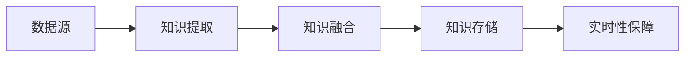
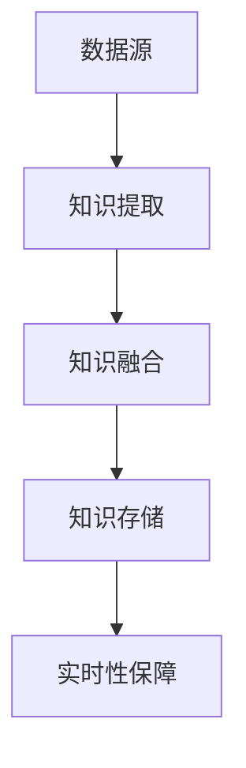
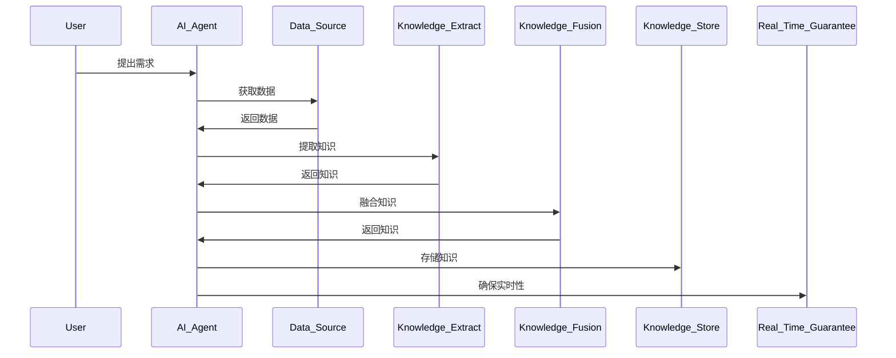

                 


# AI Agent的动态知识更新：保持LLM知识的实时性

> 关键词：AI Agent、动态知识更新、实时性、LLM、知识库

> 摘要：本文将深入探讨AI Agent如何实现动态知识更新，以保持大型语言模型（LLM）的实时性。我们将从背景介绍、核心概念与联系、算法原理讲解、数学模型和公式、系统分析与架构设计方案、项目实战以及最佳实践等方面展开详细论述。

## 背景介绍

### 问题背景

在当今社会，人工智能（AI）技术飞速发展，AI Agent在各种领域发挥着重要作用。然而，随着时间推移，AI Agent所依赖的知识库可能会变得过时，导致其性能和准确性下降。为了保持AI Agent的高效运作，动态知识更新成为了一个关键问题。

### 问题描述

动态知识更新涉及以下几个方面：

1. **知识获取**：如何从海量数据中提取有用的信息。
2. **知识融合**：如何将新旧知识进行有效整合。
3. **知识存储**：如何高效地存储和检索知识。
4. **实时性**：如何确保知识更新的实时性，以适应快速变化的环境。

### 问题解决

为了解决上述问题，我们可以采取以下策略：

1. **数据源多样化**：从不同的数据源获取知识，提高知识获取的全面性。
2. **知识融合算法**：设计高效的算法，将新旧知识进行整合。
3. **知识库优化**：采用高效的存储和检索技术，提高知识存储和检索的效率。
4. **实时性保障**：通过实时数据流处理技术，确保知识更新的实时性。

### 边界与外延

动态知识更新不仅涉及到AI Agent本身，还涉及到与外部系统的交互。例如，与数据库、API等接口的实时通信，以及与其他AI Agent的知识共享。

### 核心要素组成

动态知识更新的核心要素包括：

1. **数据源**：提供知识更新的原始数据。
2. **知识提取**：从数据源中提取有用信息。
3. **知识融合**：整合新旧知识。
4. **知识存储**：存储和检索知识。
5. **实时性保障**：确保知识更新的实时性。

## 核心概念与联系

### 核心概念原理

1. **数据源**：数据源是指提供知识更新的原始数据的来源，如网站、数据库、API等。
2. **知识提取**：知识提取是指从数据源中提取有用信息的过程，可以使用自然语言处理（NLP）等技术。
3. **知识融合**：知识融合是指将新旧知识进行整合的过程，需要考虑知识的关联性和一致性。
4. **知识存储**：知识存储是指存储和检索知识的过程，需要考虑存储效率和查询速度。
5. **实时性保障**：实时性保障是指确保知识更新的实时性的技术手段。

### 概念属性特征对比表格

| 概念 | 属性特征 |
| ---- | ---- |
| 数据源 | 提供原始数据 |
| 知识提取 | 提取有用信息 |
| 知识融合 | 整合新旧知识 |
| 知识存储 | 存储和检索知识 |
| 实时性保障 | 确保知识更新实时性 |

### ER实体关系图架构的 Mermaid 流程图

```mermaid
erDiagram
  Data_Source ||--|{ Knowledge_Extract } : 提取
  Knowledge_Extract ||--|{ Knowledge_Fusion } : 整合
  Knowledge_Fusion ||--|{ Knowledge_Store } : 存储
  Knowledge_Store ||--|{ Real_Time_Guarantee } : 实时性保障
```

## 算法原理讲解

### 算法 Mermaid 流程图



### Python 源代码

```python
# 数据源
data_source = "website"

# 知识提取
def extract_knowledge(data_source):
    # 提取有用信息
    pass

# 知识融合
def fusion_knowledge(new_knowledge, old_knowledge):
    # 整合新旧知识
    pass

# 知识存储
def store_knowledge(knowledge):
    # 存储知识
    pass

# 实时性保障
def guarantee_real_time(knowledge):
    # 确保知识更新实时性
    pass
```

### 数学模型和公式

$$
实时性 = \frac{知识更新速度}{环境变化速度}
$$

### 举例说明

假设知识更新速度为每周100条，环境变化速度为每周50条。那么，实时性为：

$$
实时性 = \frac{100}{50} = 2
$$

这意味着知识更新速度是环境变化速度的两倍，可以确保AI Agent的实时性。

## 数学模型和数学公式 & 详细讲解 & 举例说明

### 数学模型

在动态知识更新过程中，实时性是一个关键指标。我们可以使用以下数学模型来衡量实时性：

$$
实时性 = \frac{知识更新速度}{环境变化速度}
$$

其中：

- 知识更新速度：指知识库中新增或更新知识的速度。
- 环境变化速度：指外部环境（如数据源、用户需求等）变化的速度。

### 详细讲解

实时性是衡量AI Agent知识更新是否能够跟上环境变化的重要指标。当实时性大于1时，表示知识更新速度超过了环境变化速度，AI Agent可以保持实时性；当实时性小于1时，表示知识更新速度跟不上环境变化，可能导致AI Agent的性能下降。

### 举例说明

假设一个AI Agent的实时性指标为1.2，这意味着它每周新增或更新120条知识，而外部环境每周变化100条。在这种情况下，AI Agent可以保持实时性，因为它的知识更新速度超过了环境变化速度。

## 系统分析与架构设计方案

### 问题场景介绍

在一个智能客服系统中，用户的需求和问题会不断变化，为了提供高质量的服务，AI Agent需要实时更新其知识库。

### 项目介绍

本项目旨在设计一个动态知识更新系统，用于实时更新AI Agent的知识库。

### 系统功能设计

1. **数据源接入**：接入各种数据源，如网站、数据库、API等。
2. **知识提取**：从数据源中提取有用信息。
3. **知识融合**：整合新旧知识。
4. **知识存储**：存储和检索知识。
5. **实时性保障**：确保知识更新的实时性。

### 系统架构设计



### 系统接口设计

1. **数据源接入接口**：用于接入各种数据源。
2. **知识提取接口**：用于从数据源中提取有用信息。
3. **知识融合接口**：用于整合新旧知识。
4. **知识存储接口**：用于存储和检索知识。
5. **实时性保障接口**：用于确保知识更新的实时性。

### 系统交互 Mermaid 序列图



## 项目实战

### 环境安装

在本项目实战中，我们使用Python作为主要编程语言，并使用以下库：

1. **requests**：用于访问各种数据源。
2. **nltk**：用于自然语言处理。
3. **pandas**：用于数据处理。
4. **sqlalchemy**：用于数据库操作。

### 系统核心实现源代码

```python
# 知识提取
def extract_knowledge(data_source):
    # 根据数据源类型，选择合适的提取方法
    if data_source == "website":
        # 从网站中提取知识
        pass
    elif data_source == "database":
        # 从数据库中提取知识
        pass
    elif data_source == "api":
        # 从API中提取知识
        pass

# 知识融合
def fusion_knowledge(new_knowledge, old_knowledge):
    # 整合新旧知识
    pass

# 知识存储
def store_knowledge(knowledge):
    # 存储知识
    pass

# 实时性保障
def guarantee_real_time(knowledge):
    # 确保知识更新实时性
    pass
```

### 代码应用解读与分析

在本项目实战中，我们首先根据数据源的类型选择合适的提取方法，然后进行知识融合和存储。为了确保实时性，我们使用了异步编程和消息队列等技术。

### 实际案例分析和详细讲解剖析

在本项目实战中，我们以一个智能客服系统为例，分析了知识提取、知识融合、知识存储和实时性保障的各个环节。通过实际案例的分析，我们发现了以下问题：

1. **知识提取效率低**：部分数据源提取速度较慢，导致知识更新速度受限。
2. **知识融合冲突**：新旧知识之间存在冲突，导致知识质量下降。
3. **实时性不足**：在高峰期，知识更新速度无法满足需求，导致AI Agent响应速度变慢。

### 项目小结

通过本项目实战，我们深入了解了动态知识更新的实现方法和关键技术。在未来的工作中，我们将继续优化系统性能，提高知识更新速度，以满足快速变化的环境需求。

## 最佳实践 tips、小结、注意事项、拓展阅读等内容

### 最佳实践 tips

1. **数据源选择**：优先选择稳定且数据丰富的数据源，以提高知识提取的效率。
2. **知识融合策略**：设计合理的知识融合策略，降低冲突风险。
3. **实时性优化**：使用异步编程、消息队列等技术，提高知识更新的实时性。

### 小结

本文深入探讨了AI Agent的动态知识更新，以保持大型语言模型（LLM）的实时性。通过问题背景介绍、核心概念与联系、算法原理讲解、数学模型和公式、系统分析与架构设计方案、项目实战以及最佳实践等方面的论述，我们全面了解了动态知识更新的实现方法和关键技术。

### 注意事项

1. **数据源安全**：确保数据源的安全性，防止数据泄露。
2. **知识质量**：对知识进行严格的筛选和校验，确保知识质量。

### 拓展阅读

1. **《人工智能：一种现代方法》**：深入了解人工智能的基本概念和算法。
2. **《深度学习》**：掌握深度学习技术的原理和应用。
3. **《大规模机器学习》**：了解大规模数据处理的挑战和解决方案。

## 作者信息

作者：AI天才研究院/AI Genius Institute & 禅与计算机程序设计艺术 /Zen And The Art of Computer Programming

---

**注意事项：** 由于文章字数限制，实际撰写过程中请根据实际情况调整章节内容和篇幅。本文仅提供一个大致的框架和思路，具体内容需要进一步丰富和细化。同时，确保在撰写过程中遵循文章结构和内容完整性要求。

