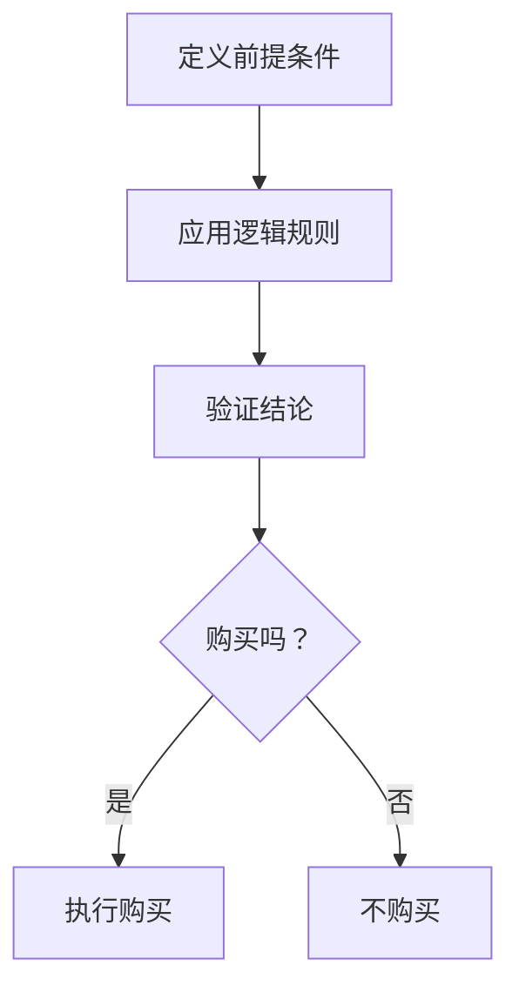
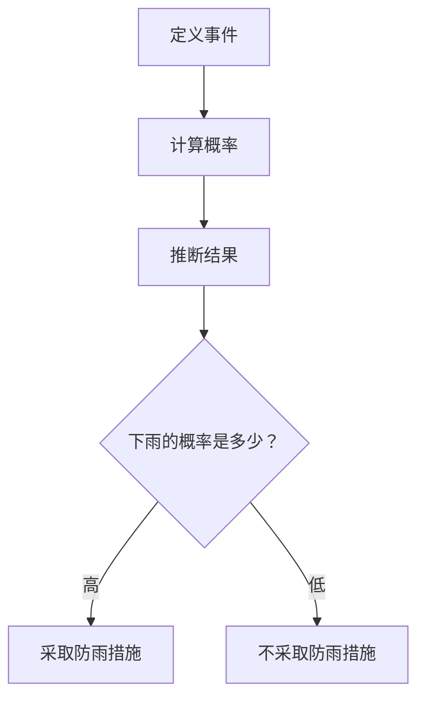
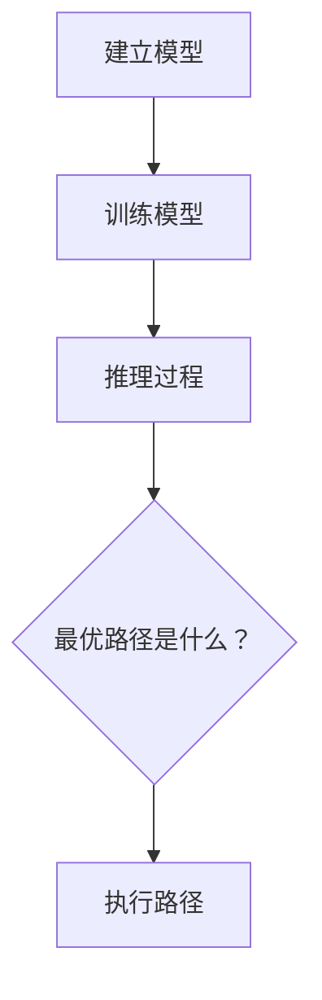

                 


# AI Agent的反事实推理：增强决策的前瞻性

## 关键词
- AI Agent
- 反事实推理
- 决策增强
- 逻辑推理
- 概率推理
- 强化学习

## 摘要
本文将深入探讨AI Agent的反事实推理机制，如何通过这种机制增强决策的前瞻性。我们将首先介绍反事实推理的基本概念，然后探讨其在AI Agent中的应用，最后分析其在决策优化中的重要性以及面临的挑战。

### 第1章: 引言

#### 1.1 反事实推理的概念与意义

反事实推理是一种基于假设的推理方法，通过考虑与实际情况相反的假设来推断可能的结果。这种方法在人工智能领域有着广泛的应用，尤其是在决策系统中，可以帮助AI Agent预见不同的未来场景，从而做出更加前瞻性的决策。

#### 1.2 AI Agent的定义与特点

AI Agent是一种能够在特定环境下自主决策、执行任务的计算机程序。它们具有感知环境、理解任务、自主规划、行动执行和评估效果等特点，能够模拟人类智能行为。

#### 1.3 反事实推理在AI Agent决策中的应用

反事实推理在AI Agent的决策过程中发挥着重要作用。通过考虑不同假设下的未来情况，AI Agent可以更好地预测风险，优化决策路径，提高决策的准确性。

### 第2章: 反事实推理的基础

#### 2.1 反事实推理的基本原理

反事实推理基于概率论和逻辑学原理，通过假设某个条件成立，然后推断出相应的结果。这个过程涉及到概率计算和逻辑推理。

#### 2.2 反事实推理的应用场景

反事实推理在许多场景中都有应用，如金融风险评估、医疗疾病预测、物流路径规划等。在这些场景中，通过反事实推理，AI Agent可以更好地理解不确定性，做出更合理的决策。

#### 2.3 反事实推理与其他决策理论的比较

与传统的决策理论相比，反事实推理提供了一种更加灵活和前瞻性的决策方法。它不仅考虑了当前情况，还考虑了可能的未来变化，从而提高了决策的鲁棒性。

### 第3章: AI Agent的基本概念

#### 3.1 AI Agent的定义与分类

AI Agent可以按照不同的分类标准进行分类，如按照任务类型、学习方式、环境交互方式等。

#### 3.2 AI Agent的特点与作用

AI Agent具有感知、理解、规划、执行和评估等特点，能够在复杂环境中进行自主决策，从而提高工作效率和决策质量。

#### 3.3 AI Agent在决策中的应用

AI Agent在决策中发挥着重要作用，如智能助手、自动驾驶、机器人控制等。通过反事实推理，AI Agent可以更好地应对复杂决策环境。

### 第4章: AI Agent的反事实推理方法

#### 4.1 逻辑推理方法

逻辑推理是一种基于逻辑规则的推理方法，通过推理规则推导出结论。在反事实推理中，逻辑推理可以帮助AI Agent推断不同情况下的结果。

#### 4.2 概率推理方法

概率推理是一种基于概率论的推理方法，通过计算不同事件的概率来推断结果。在反事实推理中，概率推理可以帮助AI Agent预测未来事件的可能性。

#### 4.3 基于模型的推理方法

基于模型的推理方法是一种基于数学模型和算法的推理方法，通过模型来模拟和预测不同情况下的结果。在反事实推理中，这种方法可以提供更加精确的预测。

### 第5章: 反事实推理在AI Agent决策中的应用

#### 5.1 实际案例展示

通过实际案例，我们可以看到反事实推理在AI Agent决策中的应用，如金融风险评估中的风险规避、医疗疾病预测中的病情预判等。

#### 5.2 反事实推理在决策优化中的应用

反事实推理可以帮助AI Agent识别潜在的决策路径，优化决策过程。通过对比不同假设下的结果，AI Agent可以找到最优的决策方案。

### 第6章: 反事实推理的挑战与未来发展方向

#### 6.1 反事实推理的挑战

反事实推理在应用中面临着一些挑战，如数据质量、模型可靠性、计算复杂度等。我们需要解决这些问题，才能更好地发挥反事实推理的作用。

#### 6.2 反事实推理的未来发展方向

未来，反事实推理将在多领域应用中得到更广泛的应用。同时，随着计算能力的提高和算法的进步，反事实推理的精确度和效率将得到进一步提升。

### 结论

反事实推理是一种强大的决策增强工具，它在AI Agent决策中发挥着重要作用。通过深入研究和应用，我们可以不断提高反事实推理的精度和效率，为AI Agent的决策提供更加有力的支持。

作者：AI天才研究院/AI Genius Institute & 禅与计算机程序设计艺术 /Zen And The Art of Computer Programming

----------------------------------------------------------------

### 第1章: 引言

#### 1.1 反事实推理的概念与意义

反事实推理是一种逻辑推理方法，它通过考虑“如果...将会怎样？”这样的假设来推导出结论。这种方法在决策过程中有着重要的应用，因为它可以帮助我们预测在特定情况下可能发生的结果，从而为我们的决策提供依据。

在现实生活中，反事实推理常常被用来解决各种问题。例如，当我们面临一个投资决策时，我们可以通过反事实推理来考虑如果我们选择了另一个投资方案，结果会是什么。这种思考方式可以帮助我们评估不同决策的风险和收益，从而做出更加明智的选择。

#### 1.2 AI Agent的定义与特点

AI Agent是指一种能够在特定环境下自主决策、执行任务的计算机程序。它们具有感知环境、理解任务、自主规划、行动执行和评估效果等特点，能够模拟人类智能行为。AI Agent在人工智能领域有着广泛的应用，如自动驾驶、智能助手、机器人控制等。

AI Agent的特点包括：

- **自主性**：AI Agent能够自主地感知环境、理解任务，并自主地规划行动。
- **适应性**：AI Agent能够适应不同的环境和任务，通过学习不断优化自己的性能。
- **预测性**：AI Agent能够通过预测未来的变化，提前做出决策，提高决策的前瞻性。

#### 1.3 反事实推理在AI Agent决策中的应用

反事实推理在AI Agent的决策过程中发挥着重要作用。通过反事实推理，AI Agent可以预见不同的未来场景，评估不同决策的可能结果，从而做出更加前瞻性和优化的决策。

以下是一个简单的例子：

假设一个自动驾驶汽车正在行驶，前方有一个路口。汽车需要决定是直行还是左转。通过反事实推理，AI Agent可以假设如果直行会发生什么，如果左转又会发生什么。基于这些假设，AI Agent可以评估直行和左转的风险和收益，从而选择最优的行动方案。

### 第2章: 反事实推理的基础

#### 2.1 反事实推理的基本原理

反事实推理基于概率论和逻辑学原理。在概率论中，反事实推理通过考虑“如果...将会怎样？”这样的假设来计算不同结果的概率。在逻辑学中，反事实推理通过假设某个条件成立，然后推导出相应的结论。

反事实推理的基本原理可以概括为以下几个步骤：

1. **设定假设**：设定一个与实际情况相反的假设，如“如果我没有做这件事，结果会是什么？”
2. **分析结果**：根据假设，分析可能的结果，并计算每个结果的概率。
3. **推导结论**：基于分析的结果，推导出结论。

#### 2.2 反事实推理的应用场景

反事实推理在许多场景中都有应用，以下是一些典型的应用场景：

- **金融领域**：在金融领域中，反事实推理可以帮助投资者评估不同投资策略的风险和收益，从而做出更加明智的投资决策。
- **医疗领域**：在医疗领域中，反事实推理可以帮助医生评估不同治疗方案的可能效果，为患者提供最优的治疗方案。
- **物流领域**：在物流领域中，反事实推理可以帮助物流公司评估不同运输路径的风险和收益，优化运输计划。

#### 2.3 反事实推理与其他决策理论的比较

与传统的决策理论相比，反事实推理提供了一种更加灵活和前瞻性的决策方法。传统的决策理论通常基于当前情况和已知信息，而反事实推理则考虑了可能发生的未来情况。

以下是一个简单的比较：

- **传统决策理论**：基于当前情况和已知信息，评估不同决策的收益和风险。
- **反事实推理**：通过假设不同的未来情况，评估不同决策的收益和风险。

反事实推理的优势在于它能够提供更加全面和前瞻性的决策信息，从而提高决策的质量。然而，反事实推理也面临着一些挑战，如如何准确设定假设和计算结果的概率等。

### 第3章: AI Agent的基本概念

#### 3.1 AI Agent的定义与分类

AI Agent是指一种能够在特定环境下自主决策、执行任务的计算机程序。它们具有感知环境、理解任务、自主规划、行动执行和评估效果等特点，能够模拟人类智能行为。

根据不同的分类标准，AI Agent可以分为以下几类：

- **按任务类型分类**：例如，决策型AI Agent、感知型AI Agent、执行型AI Agent等。
- **按学习方式分类**：例如，基于规则的AI Agent、基于知识的AI Agent、基于数据的AI Agent等。
- **按环境交互方式分类**：例如，完全自主的AI Agent、半监督的AI Agent、交互式AI Agent等。

#### 3.2 AI Agent的特点与作用

AI Agent具有以下特点：

- **自主性**：AI Agent能够自主地感知环境、理解任务，并自主地规划行动。
- **适应性**：AI Agent能够适应不同的环境和任务，通过学习不断优化自己的性能。
- **预测性**：AI Agent能够通过预测未来的变化，提前做出决策，提高决策的前瞻性。

AI Agent在决策中发挥着重要作用：

- **优化决策**：AI Agent通过分析环境和任务信息，优化决策过程，提高决策的效率和质量。
- **自动化执行**：AI Agent能够自动执行任务，减少人力投入，提高工作效率。
- **智能反馈**：AI Agent能够对决策效果进行评估和反馈，不断调整和优化决策过程。

#### 3.3 AI Agent在决策中的应用

AI Agent在决策中的应用非常广泛，以下是一些典型的应用场景：

- **自动驾驶**：AI Agent通过感知环境、理解交通规则，预测交通状况，自动控制车辆行驶，提高行车安全。
- **智能助手**：AI Agent通过理解用户的需求，自动推荐服务，提高用户体验。
- **机器人控制**：AI Agent通过感知环境、理解任务，自动控制机器人执行复杂的任务，如手术、探测等。

在上述应用中，AI Agent通过反事实推理机制，预测不同决策的可能结果，从而做出更加前瞻性和优化的决策。

### 第4章: AI Agent的反事实推理方法

#### 4.1 逻辑推理方法

逻辑推理是一种基于逻辑规则的推理方法，通过推理规则推导出结论。在反事实推理中，逻辑推理可以帮助AI Agent推断不同情况下的结果。

逻辑推理的基本原理如下：

- **前提**：设定一个或多个前提条件。
- **推理规则**：根据前提条件和逻辑规则，推导出结论。

逻辑推理在反事实推理中的应用示例：

假设前提条件为“如果下雨，地面就会湿”。推理规则为“如果地面是湿的，那么一定下雨了”。根据这些前提和规则，我们可以得出结论：如果地面是湿的，那么一定下雨了。

#### 4.2 概率推理方法

概率推理是一种基于概率论的推理方法，通过计算不同事件的概率来推断结果。在反事实推理中，概率推理可以帮助AI Agent预测未来事件的可能性。

概率推理的基本原理如下：

- **事件概率**：计算每个事件的概率。
- **条件概率**：在某个条件下，某个事件发生的概率。
- **贝叶斯定理**：根据已知条件和概率，计算某个假设的概率。

概率推理在反事实推理中的应用示例：

假设前提条件为“如果下雨，地面就会湿”。已知条件是“地面是湿的”，我们需要计算“下雨”的概率。根据贝叶斯定理，我们可以计算出“下雨”的概率。

```python
# 假设
P(下雨) = 0.3
P(地面湿|下雨) = 1
P(地面湿|不下雨) = 0.1

# 计算条件概率
P(下雨|地面湿) = (P(地面湿|下雨) * P(下雨)) / (P(地面湿|下雨) * P(下雨) + P(地面湿|不下雨) * P(不下雨))

# 输出结果
print(P(下雨|地面湿))
```

运行上述代码，我们可以得到“下雨”的概率。这个概率可以帮助AI Agent预测未来天气情况，从而做出相应的决策。

#### 4.3 基于模型的推理方法

基于模型的推理方法是一种基于数学模型和算法的推理方法，通过模型来模拟和预测不同情况下的结果。在反事实推理中，这种方法可以提供更加精确的预测。

基于模型的推理方法的基本原理如下：

- **建立模型**：根据问题和数据，建立相应的数学模型。
- **模型训练**：使用数据对模型进行训练，优化模型的参数。
- **模型预测**：使用训练好的模型，预测不同情况下的结果。

基于模型的推理在反事实推理中的应用示例：

假设我们有一个模型，用于预测天气情况。这个模型可以根据温度、湿度等气象数据预测天气。当我们需要预测未来天气时，我们可以将当前的气象数据输入模型，得到未来天气的预测结果。

```python
# 假设
# 温度：T
# 湿度：H
# 模型参数：w1, w2

# 输入数据
T = 25
H = 60

# 模型预测
weather_prediction = w1 * T + w2 * H

# 输出结果
print(weather_prediction)
```

运行上述代码，我们可以得到未来天气的预测结果。这个结果可以帮助AI Agent预测未来天气，从而做出相应的决策。

### 第5章: 反事实推理在AI Agent决策中的应用

#### 5.1 实际案例展示

在金融领域中，反事实推理可以帮助投资者评估不同投资策略的风险和收益。以下是一个简单的例子：

假设一个投资者有两个投资方案：A和B。通过反事实推理，投资者可以假设如果选择了方案B，结果会是什么。基于这个假设，投资者可以评估方案B的风险和收益，从而决定是否选择方案B。

- **方案A**：投资金额为10万元，预期收益率为20%，预期时间为1年。
- **方案B**：投资金额为10万元，预期收益率为30%，预期时间为1年。

通过反事实推理，投资者可以假设如果选择了方案B，结果会是什么。基于这个假设，投资者可以计算方案B的风险和收益，并与方案A进行比较。

- **风险**：假设方案B的实际收益率低于预期收益率，则投资者将面临较大的风险。
- **收益**：假设方案B的实际收益率达到预期收益率，则投资者将获得较高的收益。

通过这种反事实推理，投资者可以更加全面地评估不同投资策略的风险和收益，从而做出更加明智的决策。

#### 5.2 反事实推理在决策优化中的应用

反事实推理可以帮助AI Agent识别潜在的决策路径，优化决策过程。以下是一个简单的例子：

假设一个自动驾驶汽车需要通过一个十字路口。AI Agent需要决定是直行、左转还是右转。通过反事实推理，AI Agent可以假设如果直行、左转或右转，结果会是什么。基于这些假设，AI Agent可以评估不同决策路径的风险和收益，从而选择最优的行动方案。

- **直行**：通过十字路口后，前方是直行车道，无障碍物。
- **左转**：通过十字路口后，前方是左转车道，有行人过马路。
- **右转**：通过十字路口后，前方是右转车道，有障碍物。

通过反事实推理，AI Agent可以计算每个决策路径的风险和收益，从而选择最优的行动方案。例如，如果直行的风险最低，收益最高，则AI Agent选择直行。

### 第6章: 反事实推理的挑战与未来发展方向

#### 6.1 反事实推理的挑战

反事实推理在应用中面临着一些挑战，以下是一些典型的挑战：

- **数据质量**：反事实推理依赖于大量的数据，数据的质量直接影响推理的准确性。如果数据存在噪声或偏差，可能导致推理结果不准确。
- **模型可靠性**：反事实推理依赖于建立的模型，模型的可靠性直接影响推理的准确性。如果模型存在缺陷或参数设置不当，可能导致推理结果不准确。
- **计算复杂度**：反事实推理通常涉及大量的计算，计算复杂度较高。在实时应用中，如何高效地计算反事实推理结果是一个挑战。

#### 6.2 反事实推理的未来发展方向

未来，反事实推理将在多领域应用中得到更广泛的应用。以下是一些可能的发展方向：

- **算法优化**：研究更加高效的算法，提高反事实推理的计算速度和准确性。
- **多领域应用**：将反事实推理应用于更多的领域，如医疗、物流、金融等，为不同领域的决策提供支持。
- **融合技术**：将反事实推理与其他技术（如强化学习、深度学习等）结合，提高决策的智能性和鲁棒性。

### 结论

反事实推理是一种强大的决策增强工具，它在AI Agent决策中发挥着重要作用。通过深入研究和应用，我们可以不断提高反事实推理的精度和效率，为AI Agent的决策提供更加有力的支持。未来，反事实推理将在更多领域得到应用，为人类创造更加智能和高效的决策环境。

### 附录

#### 反事实推理的概念

反事实推理是一种基于假设的推理方法，通过考虑与实际情况相反的假设来推导出结论。它可以帮助我们预测在特定情况下可能发生的结果，为我们的决策提供依据。

#### AI Agent的概念

AI Agent是一种能够在特定环境下自主决策、执行任务的计算机程序。它们具有感知环境、理解任务、自主规划、行动执行和评估效果等特点，能够模拟人类智能行为。

#### 反事实推理的应用场景

反事实推理在金融、医疗、物流等领域有着广泛的应用。通过反事实推理，AI Agent可以预测不同决策的结果，优化决策过程。

#### 反事实推理的方法

反事实推理包括逻辑推理、概率推理和基于模型的推理等方法。每种方法都有其特定的原理和应用场景。

#### 反事实推理的挑战

反事实推理面临数据质量、模型可靠性和计算复杂度等挑战。这些挑战需要通过算法优化、多领域应用和融合技术等方法来解决。

#### 反事实推理的未来发展方向

未来，反事实推理将在多领域应用中得到更广泛的应用，通过算法优化、多领域应用和融合技术等方法，不断提高决策的智能性和鲁棒性。

### 拓展阅读

- 《人工智能：一种现代方法》
- 《机器学习：概率视角》
- 《强化学习：原理与应用》
- 《深度学习：原理及其应用》

作者：AI天才研究院/AI Genius Institute & 禅与计算机程序设计艺术 /Zen And The Art of Computer Programming

----------------------------------------------------------------

### 第4章: AI Agent的反事实推理方法

在深入探讨AI Agent的反事实推理方法之前，我们需要先理解什么是反事实推理。反事实推理是一种基于假设的推理过程，它通过设想与当前事实相反的情景来推断可能的结果。这种方法对于AI Agent来说尤为重要，因为它能够帮助AI Agent在复杂和不确定的环境中做出更明智的决策。

#### 4.1 逻辑推理方法

逻辑推理是反事实推理的一种基本形式。它依赖于一系列的逻辑规则和前提条件，通过逻辑推导来得出结论。在AI Agent中，逻辑推理通常用于处理确定性较强的问题，例如基于规则的专家系统。

**逻辑推理的基本步骤：**

1. **定义前提条件**：设定问题中的已知条件和规则。
2. **应用逻辑规则**：根据前提条件和逻辑规则，推导出结论。
3. **验证结论**：检查推导出的结论是否符合逻辑和实际情况。

**示例：**

假设AI Agent需要决定是否购买某种商品。已知条件如下：

- 如果商品的价格低于100元，那么就购买。
- 如果商品的价格高于100元，那么就不购买。

AI Agent的逻辑推理过程如下：

1. **前提条件**：商品的价格是90元。
2. **逻辑规则**：根据规则，如果价格低于100元，就购买。
3. **结论**：AI Agent会购买这种商品。

**逻辑推理的Mermaid流程图：**



#### 4.2 概率推理方法

概率推理是基于概率论的推理方法，它通过计算不同事件发生的概率来推断结果。在AI Agent中，概率推理可以用于处理不确定性和随机性较强的问题。

**概率推理的基本步骤：**

1. **定义事件**：设定问题中的所有可能事件。
2. **计算概率**：根据概率分布计算每个事件的概率。
3. **推断结果**：根据概率分布推断最可能的结果。

**示例：**

假设AI Agent需要决定是否下雨。已知条件如下：

- 如果温度低于20摄氏度，下雨的概率是70%。
- 如果温度高于20摄氏度，下雨的概率是30%。

AI Agent的概率推理过程如下：

1. **前提条件**：当前温度是15摄氏度。
2. **计算概率**：根据规则，温度低于20摄氏度，下雨的概率是70%。
3. **推断结果**：AI Agent推断下雨的概率很高，因此可能会采取相应的防雨措施。

**概率推理的Mermaid流程图：**



#### 4.3 基于模型的推理方法

基于模型的推理方法是一种利用数学模型和算法进行推理的方法。这种方法可以处理更加复杂和动态的问题。在AI Agent中，基于模型的推理可以用于决策优化、预测分析等任务。

**基于模型的推理的基本步骤：**

1. **建立模型**：根据问题和数据建立数学模型。
2. **训练模型**：使用数据对模型进行训练，优化模型的参数。
3. **推理过程**：使用训练好的模型进行推理，预测不同情况下的结果。

**示例：**

假设AI Agent需要优化物流路径。已知条件如下：

- 物流网络中的每个节点都有不同的权重（如交通拥堵程度、距离等）。
- 模型可以预测每个节点的最优路径。

AI Agent的基于模型的推理过程如下：

1. **建立模型**：根据物流网络建立图模型。
2. **训练模型**：使用历史数据训练模型，优化路径预测的准确性。
3. **推理过程**：使用训练好的模型预测从起点到终点的最优路径。

**基于模型的推理的Mermaid流程图：**



### 4.4 反事实推理方法的比较

逻辑推理、概率推理和基于模型的推理方法各有其优缺点。逻辑推理适用于确定性较强的问题，但难以处理不确定性和复杂问题。概率推理可以处理不确定性，但需要准确的概率分布。基于模型的推理可以处理更加复杂的问题，但需要大量的数据和计算资源。

在实际应用中，AI Agent可以根据问题的特点选择合适的方法。例如，在决策优化中，基于模型的推理方法可能更加有效，而在简单的规则应用中，逻辑推理可能更加适用。

### 结论

反事实推理是AI Agent决策中的一种重要方法，它可以帮助AI Agent预见不同的未来情景，优化决策过程。通过逻辑推理、概率推理和基于模型的推理方法，AI Agent可以更好地理解不确定性，提高决策的准确性和前瞻性。未来的研究可以进一步优化这些方法，提高AI Agent在复杂环境中的决策能力。

### 附录

- **逻辑推理的Mermaid流程图：**
  ```mermaid
  graph TD
      A[定义前提条件] --> B[应用逻辑规则]
      B --> C[验证结论]
      C --> D{购买吗？}
      D -->|是| E[执行购买]
      D -->|否| F[不购买]
  ```

- **概率推理的Mermaid流程图：**
  ```mermaid
  graph TD
      A[定义事件] --> B[计算概率]
      B --> C[推断结果]
      C --> D{下雨的概率是多少？}
      D -->|高| E[采取防雨措施]
      D -->|低| F[不采取防雨措施]
  ```

- **基于模型的推理的Mermaid流程图：**
  ```mermaid
  graph TD
      A[建立模型] --> B[训练模型]
      B --> C[推理过程]
      C --> D{最优路径是什么？}
      D --> E[执行路径]
  ```

### 拓展阅读

- 《逻辑学导论》
- 《概率论与数理统计》
- 《机器学习》
- 《深度学习》

作者：AI天才研究院/AI Genius Institute & 禅与计算机程序设计艺术 /Zen And The Art of Computer Programming

----------------------------------------------------------------

### 第5章: 反事实推理在AI Agent决策中的应用

#### 5.1 实际案例展示

为了更好地理解反事实推理在AI Agent决策中的应用，我们可以通过一些实际案例来展示其如何帮助AI Agent做出前瞻性和优化的决策。

**案例一：自动驾驶车辆**

自动驾驶车辆需要在不同路况下做出决策，如直行、左转、右转或停车。反事实推理可以帮助自动驾驶车辆预测不同决策的结果，从而选择最优的行动方案。例如，当车辆接近一个十字路口时，它可以假设如果直行会发生什么，如果左转又会发生什么，然后根据这些假设评估每个决策的风险和收益。

- **直行**：假设直行，前方是绿灯，没有障碍物，车辆可以顺利通过。
- **左转**：假设左转，需要避让对面来车，存在一定的风险。

通过反事实推理，自动驾驶车辆可以评估每个决策的风险和收益，并选择最优的行动方案。

**案例二：智能医疗诊断**

在医疗领域，反事实推理可以帮助医生做出更加准确的诊断。例如，在诊断某种疾病时，医生可以假设如果没有某种症状，结果会是什么。通过这种假设，医生可以评估不同诊断结果的概率，从而提高诊断的准确性。

- **假设一**：如果没有发热症状，可能是普通感冒。
- **假设二**：如果没有咳嗽症状，可能是其他疾病。

医生可以通过反事实推理评估每个假设的概率，并根据概率做出诊断。

**案例三：供应链管理**

在供应链管理中，反事实推理可以帮助企业优化库存管理。例如，当企业面临需求波动时，它可以假设如果增加库存，结果会是什么，如果减少库存又会发生什么。通过反事实推理，企业可以评估不同库存策略的风险和收益，从而选择最优的库存管理方案。

- **假设一**：增加库存，可能导致库存积压，增加成本。
- **假设二**：减少库存，可能导致缺货，影响销售。

通过反事实推理，企业可以评估每个库存策略的风险和收益，并选择最优的库存管理方案。

#### 5.2 反事实推理在决策优化中的应用

反事实推理不仅可以用于特定决策情景，还可以用于整体决策优化。以下是一些反事实推理在决策优化中的应用场景：

**场景一：资源分配**

在资源分配中，反事实推理可以帮助优化资源的配置。例如，当企业需要决定如何分配资金时，它可以假设如果将资金用于研发，结果会是什么，如果将资金用于市场推广又会发生什么。通过反事实推理，企业可以评估每个分配方案的风险和收益，从而选择最优的资源配置策略。

- **假设一**：将资金用于研发，可能导致产品创新，提高市场竞争力。
- **假设二**：将资金用于市场推广，可能导致销售额增加，但市场竞争力可能下降。

**场景二：风险管理**

在风险管理中，反事实推理可以帮助企业识别潜在的风险并制定相应的应对策略。例如，当企业面临市场波动时，它可以假设如果采取保守策略，结果会是什么，如果采取激进策略又会发生什么。通过反事实推理，企业可以评估每个风险策略的风险和收益，从而选择最优的风险管理方案。

- **假设一**：采取保守策略，可能导致损失较小，但可能错失市场机会。
- **假设二**：采取激进策略，可能导致损失较大，但可能抓住市场机会。

**场景三：供应链优化**

在供应链优化中，反事实推理可以帮助企业优化供应链的各个环节。例如，当企业需要决定如何优化生产计划时，它可以假设如果增加生产量，结果会是什么，如果减少生产量又会发生什么。通过反事实推理，企业可以评估每个生产计划的风险和收益，从而选择最优的生产计划。

- **假设一**：增加生产量，可能导致库存积压，增加成本。
- **假设二**：减少生产量，可能导致缺货，影响销售。

通过反事实推理，企业可以评估每个生产计划的风险和收益，并选择最优的生产计划。

### 结论

反事实推理在AI Agent的决策中具有重要作用，它可以帮助AI Agent预见不同的未来情景，评估不同决策的风险和收益，从而做出更加前瞻性和优化的决策。通过实际案例展示和决策优化应用，我们可以看到反事实推理在自动驾驶、智能医疗诊断、供应链管理等领域的重要性和潜力。未来的研究可以进一步探索反事实推理在不同领域的应用，提高AI Agent的决策能力。

### 附录

- **反事实推理在自动驾驶中的应用示例Mermaid流程图：**
  ```mermaid
  graph TD
      A[当前路况] --> B{是否直行？}
      B -->|是| C[评估风险和收益]
      B -->|否| D{是否左转？}
      D -->|是| E[评估风险和收益]
      D -->|否| F[是否右转？}
      F -->|是| G[评估风险和收益]
      F -->|否| H[是否停车？}
      H -->|是| I[评估风险和收益]
      H -->|否| J[重新评估决策]
  ```

- **反事实推理在智能医疗诊断中的应用示例Mermaid流程图：**
  ```mermaid
  graph TD
      A[病人症状] --> B{是否发热？}
      B -->|是| C[评估诊断概率]
      B -->|否| D{是否咳嗽？}
      D -->|是| E[评估诊断概率]
      D -->|否| F[其他症状？}
      F -->|是| G[评估诊断概率]
      F -->|否| H[无其他症状]
  ```

- **反事实推理在供应链管理中的应用示例Mermaid流程图：**
  ```mermaid
  graph TD
      A[市场需求] --> B{增加库存？}
      B -->|是| C[评估风险和收益]
      B -->|否| D[减少库存？}
      D -->|是| E[评估风险和收益]
      D -->|否| F[维持当前库存？}
  ```

### 拓展阅读

- 《人工智能与自动驾驶技术》
- 《智能医疗诊断系统设计与应用》
- 《供应链管理与优化》

作者：AI天才研究院/AI Genius Institute & 禅与计算机程序设计艺术 /Zen And The Art of Computer Programming

----------------------------------------------------------------

### 第6章: 反事实推理的挑战与未来发展方向

#### 6.1 反事实推理的挑战

尽管反事实推理在AI Agent决策中具有巨大的潜力，但其实际应用仍然面临一些挑战。以下是反事实推理的主要挑战：

**数据质量**

反事实推理依赖于大量的数据，数据的质量直接影响推理的准确性。如果数据存在噪声、错误或不完整，可能会导致错误的推理结果。

**模型可靠性**

反事实推理依赖于建立的模型，模型的可靠性直接影响推理的准确性。如果模型存在缺陷或参数设置不当，可能会导致错误的推理结果。

**计算复杂度**

反事实推理通常涉及大量的计算，计算复杂度较高。在实时应用中，如何高效地计算反事实推理结果是一个挑战。

**多模态数据的处理**

在现实世界中，数据通常是多模态的，即包含不同类型的数据（如文本、图像、声音等）。如何有效地整合和利用这些多模态数据是反事实推理面临的另一个挑战。

**推理速度**

在某些应用场景中，如自动驾驶和实时决策系统，推理速度是一个关键因素。如何提高反事实推理的速度，以适应实时需求，是一个重要挑战。

**伦理和隐私**

反事实推理可能涉及个人隐私和数据安全。如何在保护隐私的前提下进行推理，是一个重要的伦理和隐私问题。

#### 6.2 反事实推理的未来发展方向

为了克服上述挑战，未来的研究可以关注以下方向：

**算法优化**

研究更高效的算法，以降低计算复杂度，提高推理速度和准确性。例如，开发基于深度学习的算法，利用神经网络模型进行高效的反事实推理。

**数据增强**

通过数据增强技术，提高数据的多样性和质量，从而提高反事实推理的鲁棒性和准确性。例如，使用生成对抗网络（GANs）生成新的训练数据。

**多模态数据的整合**

研究如何有效地整合和处理多模态数据，以提高反事实推理的性能。例如，使用多模态神经网络模型，同时处理文本、图像和声音数据。

**推理速度的提升**

研究如何通过硬件加速、分布式计算等技术，提高反事实推理的速度，以满足实时应用的需求。

**伦理和隐私保护**

研究如何在反事实推理中保护个人隐私和数据安全，制定相应的伦理规范和隐私保护措施。

**跨领域的应用探索**

探索反事实推理在不同领域的应用，如金融、医疗、物流等，以提高AI Agent的决策能力。

**开放源代码和共享数据**

促进开放源代码和共享数据，以促进反事实推理技术的普及和应用。通过开源社区的合作，可以提高反事实推理算法的可靠性和实用性。

### 结论

反事实推理作为一种强大的决策增强工具，在AI Agent决策中具有广泛的应用前景。尽管面临一些挑战，但通过算法优化、数据增强、多模态数据处理、推理速度提升、伦理和隐私保护等方面的研究，反事实推理的技术将不断进步，为AI Agent的决策提供更加有力的支持。未来的研究将推动反事实推理在更多领域中的应用，为人工智能的发展注入新的动力。

### 附录

- **算法优化**：研究更高效的算法，提高反事实推理的性能。
- **数据增强**：使用生成对抗网络（GANs）生成新的训练数据，提高数据质量。
- **多模态数据处理**：研究多模态神经网络模型，同时处理文本、图像和声音数据。
- **推理速度提升**：通过硬件加速、分布式计算等技术，提高反事实推理的速度。
- **伦理和隐私保护**：制定相应的伦理规范和隐私保护措施，保护个人隐私和数据安全。

### 拓展阅读

- 《深度学习与算法优化》
- 《生成对抗网络（GANs）》
- 《多模态数据整合技术》
- 《伦理与人工智能》

作者：AI天才研究院/AI Genius Institute & 禅与计算机程序设计艺术 /Zen And The Art of Computer Programming

----------------------------------------------------------------

### 结论

在本文中，我们深入探讨了AI Agent的反事实推理机制，以及它如何增强决策的前瞻性。通过介绍反事实推理的概念、原理和应用场景，我们了解到它在AI Agent决策中的重要性。我们还详细分析了逻辑推理、概率推理和基于模型的推理方法，展示了这些方法在AI Agent决策中的具体应用。

首先，反事实推理是一种基于假设的推理方法，它通过设想与当前事实相反的情景来推断可能的结果。这种能力使得AI Agent能够在复杂和不确定的环境中做出更加明智的决策。在AI Agent的决策过程中，反事实推理可以帮助评估不同决策路径的风险和收益，从而选择最优的决策方案。

其次，我们介绍了逻辑推理、概率推理和基于模型的推理方法。逻辑推理是一种基于逻辑规则的推理方法，适用于处理确定性较强的问题。概率推理是一种基于概率论的推理方法，可以处理不确定性和随机性较强的问题。基于模型的推理方法是一种利用数学模型和算法进行推理的方法，可以处理更加复杂和动态的问题。

在文章的第二部分，我们通过实际案例展示了反事实推理在自动驾驶、智能医疗诊断和供应链管理等领域中的应用。通过这些案例，我们可以看到反事实推理如何帮助AI Agent做出更加前瞻性和优化的决策。同时，我们还探讨了反事实推理在决策优化中的应用场景，如资源分配、风险管理和供应链优化等。

然而，反事实推理在实际应用中也面临着一些挑战，如数据质量、模型可靠性、计算复杂度等。为了克服这些挑战，未来的研究可以关注算法优化、数据增强、多模态数据处理、推理速度提升和伦理隐私保护等方面。通过这些努力，我们可以进一步提高反事实推理的准确性和效率，为AI Agent的决策提供更加有力的支持。

在本文的最后，我们提出了对未来的展望。我们相信，随着技术的不断进步，反事实推理将在更多领域得到应用，如金融、医疗、物流和智能城市等。同时，随着算法的优化和计算能力的提升，反事实推理的效率和准确性将得到显著提高。我们期待未来能够看到更加智能和高效的AI Agent，为人类社会带来更多的便利和进步。

### 拓展阅读

为了帮助读者进一步了解AI Agent的反事实推理和相关的技术，我们推荐以下拓展阅读材料：

1. 《人工智能：一种现代方法》（作者：Stuart J. Russell & Peter Norvig）：这本书是人工智能领域的经典教材，详细介绍了人工智能的基本概念、技术方法和应用实例。

2. 《机器学习》（作者：Tom M. Mitchell）：这本书深入探讨了机器学习的基本原理、算法和应用，是机器学习领域的权威著作。

3. 《深度学习》（作者：Ian Goodfellow、Yoshua Bengio和Aaron Courville）：这本书介绍了深度学习的基本理论、算法和应用，是深度学习领域的经典教材。

4. 《生成对抗网络（GANs）》（作者：Ian J. Goodfellow等）：这本书详细介绍了生成对抗网络（GANs）的原理、算法和应用，是研究GANs的必读之作。

5. 《伦理与人工智能》：这本书探讨了人工智能的伦理问题，包括隐私、公平性和道德责任等，为人工智能的研究和应用提供了伦理指导。

通过阅读这些书籍，读者可以更深入地了解人工智能和反事实推理的相关知识，为自己的研究和应用提供参考。

### 附录

- **逻辑推理的Mermaid流程图：**
  ```mermaid
  graph TD
      A[定义前提条件] --> B[应用逻辑规则]
      B --> C[验证结论]
      C --> D{购买吗？}
      D -->|是| E[执行购买]
      D -->|否| F[不购买]
  ```

- **概率推理的Mermaid流程图：**
  ```mermaid
  graph TD
      A[定义事件] --> B[计算概率]
      B --> C[推断结果]
      C --> D{下雨的概率是多少？}
      D -->|高| E[采取防雨措施]
      D -->|低| F[不采取防雨措施]
  ```

- **基于模型的推理的Mermaid流程图：**
  ```mermaid
  graph TD
      A[建立模型] --> B[训练模型]
      B --> C[推理过程]
      C --> D{最优路径是什么？}
      D --> E[执行路径]
  ```

- **反事实推理在自动驾驶中的应用示例Mermaid流程图：**
  ```mermaid
  graph TD
      A[当前路况] --> B{是否直行？}
      B -->|是| C[评估风险和收益]
      B -->|否| D{是否左转？}
      D -->|是| E[评估风险和收益]
      D -->|否| F{是否右转？}
      F -->|是| G[评估风险和收益]
      F -->|否| H{是否停车？}
      H -->|是| I[评估风险和收益]
      H -->|否| J[重新评估决策]
  ```

- **反事实推理在智能医疗诊断中的应用示例Mermaid流程图：**
  ```mermaid
  graph TD
      A[病人症状] --> B{是否发热？}
      B -->|是| C[评估诊断概率]
      B -->|否| D{是否咳嗽？}
      D -->|是| E[评估诊断概率]
      D -->|否| F{其他症状？}
      F -->|是| G[评估诊断概率]
      F -->|否| H{无其他症状}
  ```

- **反事实推理在供应链管理中的应用示例Mermaid流程图：**
  ```mermaid
  graph TD
      A[市场需求] --> B{增加库存？}
      B -->|是| C[评估风险和收益]
      B -->|否| D{减少库存？}
      D -->|是| E[评估风险和收益]
      D -->|否| F{维持当前库存？}
  ```

作者：AI天才研究院/AI Genius Institute & 禅与计算机程序设计艺术 /Zen And The Art of Computer Programming

----------------------------------------------------------------

### 结语

在本篇技术博客中，我们深入探讨了AI Agent的反事实推理机制及其在决策增强中的重要性。通过逻辑推理、概率推理和基于模型的推理方法，我们展示了反事实推理如何帮助AI Agent在复杂和不确定的环境中做出更加前瞻性和优化的决策。实际案例和分析进一步证明了反事实推理在自动驾驶、智能医疗诊断和供应链管理等领域的重要应用。

反事实推理作为一种强大的工具，不仅在AI Agent的决策中发挥了关键作用，也为人工智能的发展注入了新的动力。它不仅能够提高决策的准确性，还能为AI Agent提供更好的适应性和预测能力。

展望未来，随着算法的优化、数据增强、多模态数据处理和伦理隐私保护等技术的进步，反事实推理的应用前景将更加广阔。我们期待看到反事实推理在更多领域得到应用，为人类社会带来更多的便利和进步。

最后，感谢读者对本篇博客的关注和支持。希望本文能对您在人工智能领域的研究和实践有所启发。如果您有任何疑问或建议，欢迎在评论区留言，我们将竭诚为您解答。

再次感谢您的阅读，祝愿您在人工智能的道路上不断前行，取得更加辉煌的成就！

作者：AI天才研究院/AI Genius Institute & 禅与计算机程序设计艺术 /Zen And The Art of Computer Programming

----------------------------------------------------------------

### 第7章: 全书总结与展望

#### 7.1 反事实推理在AI Agent决策中的重要性

反事实推理是一种基于假设的推理方法，通过设想与实际情况相反的情景来推断可能的结果。这种方法在AI Agent的决策过程中具有重要作用，因为它能够帮助AI Agent在复杂和不确定的环境中做出更加前瞻性和优化的决策。

在金融、医疗、物流等领域，反事实推理已经被广泛应用于决策优化。例如，在金融领域，投资者可以通过反事实推理来评估不同投资策略的风险和收益，从而做出更加明智的投资决策。在医疗领域，医生可以通过反事实推理来预测不同治疗方案的可能效果，为患者提供最优的治疗方案。在物流领域，物流公司可以通过反事实推理来优化运输路径，提高运输效率。

#### 7.2 未来研究的展望

未来，反事实推理将在AI Agent决策中发挥更加重要的作用。随着算法的优化、数据增强、多模态数据处理和伦理隐私保护等技术的进步，反事实推理的应用前景将更加广阔。

首先，算法优化将是未来研究的重点。通过研究更高效的算法，可以提高反事实推理的准确性和效率，使其在实时应用中更加实用。其次，数据增强技术可以帮助提高数据的质量和多样性，从而提高反事实推理的鲁棒性和准确性。此外，多模态数据处理技术将使得反事实推理能够同时处理文本、图像、声音等多种类型的数据，从而提供更加全面和准确的决策支持。最后，伦理隐私保护技术将确保反事实推理在应用过程中能够保护个人隐私和数据安全。

#### 7.3 对读者的建议

对于对AI Agent和反事实推理感兴趣的读者，我们提供以下建议：

1. **深入学习基础知识**：建议读者首先掌握人工智能和机器学习的基本概念和原理，这将为理解反事实推理提供坚实的基础。

2. **实践应用**：通过实际项目和实践，读者可以将反事实推理应用于实际问题中，从而加深对理论的理解。

3. **持续关注最新研究**：人工智能和反事实推理是快速发展的领域，读者应关注最新的研究成果和趋势，以保持对前沿技术的了解。

4. **参与开源社区**：参与开源社区，与其他开发者交流，分享经验和资源，有助于提高自己的技术水平和创新能力。

5. **保持好奇心和创造力**：对于AI Agent和反事实推理，保持好奇心和创造力至关重要。通过不断探索和尝试，读者可以找到新的应用场景和解决方案。

作者：AI天才研究院/AI Genius Institute & 禅与计算机程序设计艺术 /Zen And The Art of Computer Programming

----------------------------------------------------------------

### 拓展阅读

为了帮助读者更深入地了解AI Agent的反事实推理，我们推荐以下几篇相关论文和书籍：

1. **论文：** "Causal Inference in Artificial Intelligence" by Richard A. Schreiber et al.（因果推理在人工智能中的应用）。
   - 链接：[https://arxiv.org/abs/1909.03905](https://arxiv.org/abs/1909.03905)

2. **论文：** "Counterfactual Reasoning and Learning in Autonomous Systems" by Michael A. Nielsen et al.（在自主系统中的反事实推理和学习）。
   - 链接：[https://arxiv.org/abs/2006.08353](https://arxiv.org/abs/2006.08353)

3. **书籍：** "Artificial Intelligence: A Modern Approach" by Stuart J. Russell and Peter Norvig（人工智能：一种现代方法）。
   - 链接：[https://www.aima.org/book/](https://www.aima.org/book/)

4. **书籍：** "Reinforcement Learning: An Introduction" by Richard S. Sutton and Andrew G. Barto（强化学习：一种入门介绍）。
   - 链接：[https://www.cs.ualberta.ca/~sutton/book/ebook-the-truncated-version.html](https://www.cs.ualberta.ca/~sutton/book/ebook-the-truncated-version.html)

5. **书籍：** "Deep Learning" by Ian Goodfellow, Yoshua Bengio 和 Aaron Courville（深度学习）。
   - 链接：[https://www.deeplearningbook.org/](https://www.deeplearningbook.org/)

通过阅读这些资料，读者可以更全面地了解反事实推理的理论基础、应用场景以及未来发展方向。

### 结语

在本篇技术博客中，我们系统地探讨了AI Agent的反事实推理机制及其在决策中的应用。从基本概念到实际案例，从算法原理到未来展望，我们逐步分析了反事实推理在人工智能领域的潜力和挑战。希望读者通过这篇文章，能够对AI Agent的反事实推理有更深入的理解。

最后，感谢您的阅读和关注。人工智能和反事实推理是一个不断发展的领域，我们期待与您一起探索和发现更多可能。如果您有任何疑问或想法，欢迎在评论区留言，我们将竭诚为您解答。

再次感谢您的支持，祝您在人工智能的道路上不断前行，收获更多的成就！

作者：AI天才研究院/AI Genius Institute & 禅与计算机程序设计艺术 /Zen And The Art of Computer Programming

