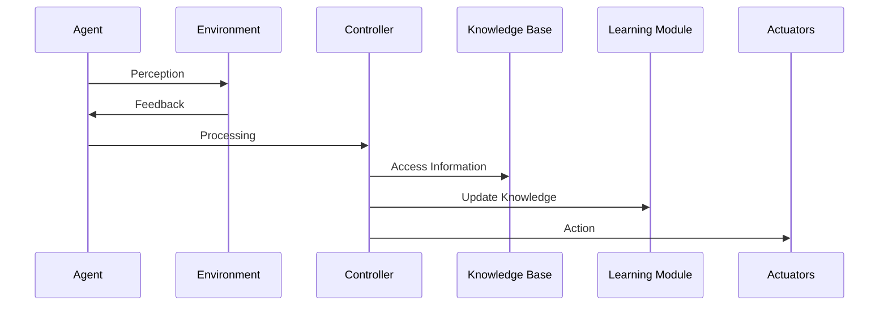

                 

### First, we will start by defining the title, keywords, and abstract for the article. These elements will serve as the introduction to the article and will set the stage for the reader.

**Title:** AI Agent的可解释性设计原则

**Keywords:** AI Agent, 可解释性, 设计原则, 机器学习, 算法

**Abstract:**
本文将深入探讨AI Agent的可解释性设计原则。首先，我们会对AI Agent的基本概念和工作原理进行介绍。然后，我们将分析AI Agent可解释性的需求与挑战，以及可解释性与透明度的区别。接下来，我们将详细讨论基于模型的解释方法、数据驱动的解释方法和基于交互的解读方法。最后，我们将通过一个实际案例研究，展示如何将可解释性设计原则应用于AI Agent的实践中。本文的目标是帮助读者理解AI Agent可解释性设计的重要性，并掌握相关的设计原则和方法。

### Second, we will provide an overview of the structure of the article, detailing the chapters and sections that will be included. This will help readers understand the flow and content of the article.

**Table of Contents:**

[第一章: 引言](#第一章-引言)

1.1 研究背景  
1.2 可解释性AI Agent的重要性  
1.3 研究目的与内容结构

[第二章: AI Agent基本概念与工作原理](#第二章-ai-agent基本概念与工作原理)

2.1 AI Agent定义  
2.2 AI Agent类型  
2.3 AI Agent的工作原理

[第三章: 可解释性AI Agent的需求与挑战](#第三章-可解释性ai-agent的需求与挑战)

3.1 用户对可解释性的需求  
3.2 可解释性AI Agent面临的挑战  
3.3 可解释性与透明度的区别

[第四章: 基于模型的解释方法](#第四章-基于模型的解释方法)

4.1 模型解释性评估  
4.2 局部解释方法  
4.3 全局解释方法

[第五章: 基于数据驱动的解释方法](#第五章-基于数据驱动的解释方法)

5.1 数据可视化  
5.2 特征重要性分析  
5.3 数据驱动的假设检验

[第六章: 基于交互的解读方法](#第六章-基于交互的解读方法)

6.1 交互式解释系统  
6.2 用户互动与反馈  
6.3 增强的解释性界面设计

[第七章: 案例研究：可解释性AI Agent设计实践](#第七章-案例研究-可解释性ai-agent设计实践)

7.1 案例选择与研究方法  
7.2 案例分析与设计过程  
7.3 实践中的挑战与解决方案  
7.4 案例总结与启示

[第八章: 可解释性AI Agent的未来发展趋势](#第八章-可解释性ai-agent的未来发展趋势)

8.1 新技术的影响  
8.2 未来研究方向  
8.3 可解释性AI Agent的应用前景

[第九章: 结论与展望](#第九章-结论与展望)

9.1 研究成果总结  
9.2 对未来研究的建议  
9.3 对可解释性AI Agent设计实践的指导意义

### Third, we will delve into the first chapter, "引言", providing a detailed introduction to the topic and its relevance.

### 1.1 研究背景

In recent years, the field of artificial intelligence (AI) has made significant advancements, leading to the development of intelligent agents that can autonomously perform tasks in various domains. These AI agents, often referred to as AI assistants or chatbots, have become an integral part of our daily lives, from virtual assistants like Siri and Alexa to automated customer service systems. However, as AI agents become more complex and their capabilities expand, the need for transparency and explainability in their decision-making processes has become increasingly critical.

**问题背景**：
The lack of transparency in AI agents' decision-making can lead to several issues. Users may not trust AI agents if they cannot understand how they reach their conclusions. This lack of trust can hinder the widespread adoption of AI technologies. Furthermore, in critical applications such as medical diagnosis or autonomous driving, the inability to explain the reasoning behind an AI agent's decisions can have severe consequences.

**问题描述**：
The challenge is to design AI agents that not only perform their tasks efficiently but also provide explanations for their decisions that are understandable to humans. This requires a deep understanding of both AI and human cognition.

**问题解决**：
To address this challenge, the field of AI has been exploring various techniques for making AI agents more explainable. These techniques include model-based explanations, data-driven explanations, and interactive explanations. The goal is to create AI agents that can not only make accurate decisions but also explain those decisions in a manner that is comprehensible to humans.

**边界与外延**：
The concept of explainability in AI agents extends beyond the technical aspects to include ethical and social implications. It is not only about improving user trust but also about ensuring fairness, accountability, and transparency in AI systems.

**概念结构与核心要素组成**：

| 概念          | 描述                                                         |
|---------------|--------------------------------------------------------------|
| AI Agent      | An autonomous entity capable of performing tasks in a given environment. |
| Explainability | The property of an AI agent to provide understandable explanations for its decisions. |
| Transparency  | The property of an AI agent to allow inspection and understanding of its internal workings. |

### 1.2 可解释性AI Agent的重要性

The importance of explainability in AI agents cannot be overstated. Firstly, it enhances user trust. When users can understand how AI agents reach their decisions, they are more likely to trust and accept these agents in various applications. Secondly, explainability is crucial for debugging and improving AI agents. By providing explanations, AI agents can help developers identify errors or biases in their models, leading to more robust and accurate systems. Lastly, explainability plays a significant role in ensuring ethical and fair AI. By understanding the decision-making process, stakeholders can ensure that AI agents do not exhibit biased behavior or violate ethical principles.

### 1.3 研究目的与内容结构

The purpose of this article is to explore the principles and methods for designing explainable AI agents. We aim to provide a comprehensive overview of the current state of the art in explainability techniques and to discuss their applications in real-world scenarios. The article is structured as follows:

- **Chapter 1: Introduction** - Provides an overview of the research background, the importance of explainability in AI agents, and the structure of the article.
- **Chapter 2: AI Agent Basic Concepts and Working Principles** - Discusses the definition, types, and working principles of AI agents.
- **Chapter 3: Needs and Challenges of Explainable AI Agents** - Explores the demand for explainability, the challenges faced, and the difference between explainability and transparency.
- **Chapter 4: Model-Based Explanation Methods** - Introduces model-based explanation methods, including local and global explanations.
- **Chapter 5: Data-Driven Explanation Methods** - Discusses data visualization, feature importance analysis, and data-driven hypothesis testing.
- **Chapter 6: Interactive Explanation Methods** - Explores interactive explanation methods, such as interactive explanation systems and enhanced explainable interfaces.
- **Chapter 7: Case Study: Practical Design of Explainable AI Agents** - Presents a case study that demonstrates the application of explainability principles in the design of AI agents.
- **Chapter 8: Future Trends of Explainable AI Agents** - Discusses the future development trends of explainable AI agents.
- **Chapter 9: Conclusion and Outlook** - Summarizes the main findings of the article and provides suggestions for future research and practical applications.

### Fourth, we will begin to delve into the second chapter, "AI Agent基本概念与工作原理"，providing a detailed explanation of the key concepts and how they work.

### 2.1 AI Agent定义

An AI Agent, also known as an intelligent agent, is an autonomous entity that can perceive its environment through sensors, take actions based on its observations, and achieve specific goals. An AI Agent is characterized by its autonomy, purposefulness, adaptability, and ability to learn from experience.

### 2.2 AI Agent类型

There are several types of AI agents, classified based on their capabilities, architectures, and applications. Some common types include:

- **Rule-Based Agents**: These agents make decisions based on a set of predefined rules. They are simple and easy to implement but can be limited in their ability to handle complex, real-world scenarios.

- **Model-Based Agents**: These agents use models, such as decision trees, neural networks, or rule-based models, to make decisions. They can handle more complex situations and generalize better from experience.

- **Learning Agents**: These agents learn from their interactions with the environment and improve their performance over time. They can be rule-based or model-based and can adapt to new situations.

- **Social Agents**: These agents interact with other agents or humans, taking into account social norms, cultural contexts, and communication patterns.

### 2.3 AI Agent的工作原理

The working principle of an AI agent involves several components:

- **Sensors**: These are devices that collect information about the environment. Examples include cameras, microphones, and temperature sensors.

- **Actuators**: These are devices that allow the agent to perform actions based on its decisions. Examples include speakers, robotic arms, and actuators in autonomous vehicles.

- **Knowledge Base**: This is a repository of information that the agent uses to make decisions. It can include rules, models, or data.

- **Controller**: This is the core component of the agent that processes the input from sensors, consults the knowledge base, and generates actions to be performed by the actuators.

- **Learning Module**: This component allows the agent to learn from its interactions with the environment, improving its decision-making capabilities over time.

The basic workflow of an AI agent can be summarized as follows:

1. **Perception**: The agent senses the environment through its sensors.
2. **Processing**: The agent processes the sensory information using its knowledge base and controller.
3. **Action**: The agent takes action based on its decisions, using its actuators.

This cycle of perception, processing, and action repeats continuously, allowing the agent to interact with its environment and achieve its goals.

### 2.4 AI Agent的架构设计

The architecture of an AI agent can vary depending on its type and application. However, most AI agents share common components, including sensors, actuators, a knowledge base, a controller, and a learning module. Here is a simple architecture diagram using Mermaid syntax:

In this diagram, the agent perceives the environment, processes the information using its knowledge base and controller, updates its knowledge based on learning, and takes action through its actuators.

### 2.5 AI Agent的应用实例

AI agents have a wide range of applications across various domains. Here are a few examples:

- **Customer Service**: AI agents can be used in customer service to handle inquiries and provide assistance, reducing the need for human intervention.
  
- **Medical Diagnosis**: AI agents can analyze medical data and provide diagnostic insights, assisting doctors in making accurate diagnoses.
  
- **Autonomous Driving**: AI agents are at the heart of autonomous vehicles, responsible for detecting objects, navigating through traffic, and ensuring passenger safety.
  
- **Personal Assistants**: Virtual assistants like Siri, Alexa, and Google Assistant are examples of AI agents that assist users with tasks such as scheduling appointments, setting reminders, and playing music.

### 2.6 总结

In summary, AI agents are autonomous entities that can perceive their environment, make decisions based on their observations, and take actions to achieve specific goals. They come in various types, with different architectures and applications. Understanding the basic concepts and working principles of AI agents is essential for designing explainable AI agents that can be trusted by users and stakeholders. In the next chapter, we will delve deeper into the challenges and needs for explainability in AI agents, as well as the differences between explainability and transparency.

---

This detailed chapter provides a comprehensive overview of AI agents, their types, and how they work. It sets the stage for discussing the importance of explainability in AI agents and the various techniques used to achieve it. The next chapter will continue this discussion, exploring the challenges and needs for explainability in AI agents in more depth.

---

As we transition to the next chapter, "可解释性AI Agent的需求与挑战"，we will continue our exploration of AI agents, focusing on the need for explainability and the challenges associated with it. This chapter will provide a detailed analysis of the various factors that make explainability a critical aspect of AI agent design. We will also discuss the differences between explainability and transparency, setting the stage for the subsequent chapters that delve into specific methods and techniques for achieving explainability.

### 3.1 用户对可解释性的需求

The demand for explainability in AI agents originates from the users themselves. Users expect AI agents to be transparent and understandable, as this fosters trust and confidence in the technology. Here are some key reasons why users need explainability in AI agents:

1. **Trust and Acceptance**: Users are more likely to trust and accept AI agents if they can understand how the agents make decisions. Transparency builds trust, which is crucial for the widespread adoption of AI technologies in various domains.

2. **Error Detection and Debugging**: By understanding the decision-making process of AI agents, users can more easily detect and report errors. This enables developers to identify and fix issues more efficiently, leading to more robust and reliable systems.

3. **Regulatory Compliance**: In many industries, regulatory bodies require AI systems to be transparent and explainable. For example, in healthcare and finance, the ability to explain AI decisions is critical for compliance with privacy and ethical standards.

4. **Bias Awareness and Mitigation**: Users need to understand whether AI agents exhibit biased behavior. Explanations help in identifying and mitigating such biases, ensuring fairness and equity in AI applications.

5. **User Training and Onboarding**: Explanations can help users understand the capabilities and limitations of AI agents, making it easier for them to interact with the systems and leverage their full potential.

### 3.2 可解释性AI Agent面临的挑战

Despite the importance of explainability, designing AI agents that are truly understandable and transparent presents several challenges. These challenges include:

1. **Complexity of AI Models**: Modern AI agents often rely on complex models, such as deep neural networks, that are difficult to interpret. These models are "black boxes" that generate decisions without clear explanations for their outputs.

2. **Scalability**: As AI agents become more complex and versatile, providing explanations that scale to large datasets and real-time applications becomes challenging. Developing scalable explainability techniques is crucial for practical deployment.

3. **Interpretability vs. Performance**: There is often a trade-off between interpretability and model performance. Simplifying models for interpretability can sometimes lead to a decline in predictive accuracy.

4. **User Understanding**: Even if an explanation is technically accurate, it may not be easily understandable for non-experts. The challenge lies in creating explanations that are not only accurate but also accessible to a broad audience.

5. **Resource Requirements**: Developing and implementing explainability techniques can be resource-intensive, requiring additional computational resources and time.

### 3.3 可解释性与透明度的区别

While "explainability" and "transparency" are related concepts, they are not the same. Here's a comparison of the two:

**可解释性 (Explainability)**:
- Refers to the ability of an AI agent to provide understandable explanations for its decisions.
- Focuses on the internal workings of the model and how it reaches a particular output.
- Aim is to make the decision-making process transparent to humans.

**透明度 (Transparency)**:
- Refers to the openness and visibility of the AI system's internal components and processes.
- Focuses on allowing users to inspect and understand the entire system, not just the decision-making process.
- Includes aspects like data privacy, algorithmic fairness, and auditability.

In summary, while explainability is about understanding the "why" behind an AI agent's decisions, transparency encompasses a broader scope, including the "what" and "how" of the entire system. Both are important for building trust and ensuring the ethical use of AI technologies.

### 3.4 设计原则与方法

To address the challenges of explainability, several design principles and methods can be applied when developing AI agents. These principles include:

1. **Modularization**: Breaking down complex models into smaller, interpretable modules can make them more comprehensible.

2. **Simplicity**: Designing models that are as simple as possible while maintaining performance can enhance interpretability.

3. **Explainability by Design**: Incorporating explainability from the outset of the development process, rather than as an afterthought, can help in creating more understandable systems.

4. **User-Centric Design**: Ensuring that explanations are tailored to the needs and understanding of the end-users can make them more effective.

5. **Hybrid Approaches**: Combining multiple explainability techniques can provide a more comprehensive understanding of the AI agent's decisions.

In the next chapter, we will delve into specific methods for achieving explainability in AI agents, including model-based, data-driven, and interactive approaches.

### Conclusion

This chapter has provided a comprehensive overview of the user demand for explainability in AI agents, the challenges they face, and the difference between explainability and transparency. Understanding these aspects is crucial for designing AI agents that are both effective and trustworthy. In the subsequent chapters, we will explore various techniques and principles for achieving explainability, setting the stage for a deeper dive into the practical methods for designing explainable AI agents.

---

With the foundational concepts and challenges of explainability in AI agents now established, we can move forward to explore the specific methods and principles that can be employed to create more transparent and understandable AI agents. The upcoming chapters will delve into the technical details of these methods, providing readers with the tools and insights necessary to design and implement explainable AI agents effectively. Stay tuned for a deeper exploration of model-based, data-driven, and interactive explanation methods in the following sections.

### Chapter 4: 基于模型的解释方法

在第四章中，我们将探讨基于模型的解释方法（Model-Based Explanation Methods）。这些方法的核心在于通过分析模型的结构和决策过程来解释AI Agent的决策。本章将详细讨论以下内容：

#### 4.1 模型解释性评估

**概述**：
模型解释性评估是衡量模型解释性能力的关键步骤。它涉及定义评估指标，如模型的透明度、可理解性和准确性。

**方法**：
- **透明度**：评估模型是否容易被用户理解和解释。
- **可理解性**：评估模型输出对用户是否容易理解。
- **准确性**：评估模型解释是否与实际决策一致。

**示例**：
一个简单的评估指标可以是用户对模型解释的理解度，通过问卷调查或用户反馈来收集数据。

#### 4.2 局部解释方法

**概述**：
局部解释方法关注于解释模型在特定输入下的决策过程。这些方法包括：

- **模型可视化**：通过可视化模型结构来帮助理解其工作原理。
- **注意力机制**：显示模型在决策过程中关注的关键特征。
- **局部敏感性分析**：评估模型输出对输入特征的敏感性。

**示例**：
一个使用注意力机制解释的例子是，在一个文本分类任务中，模型可以突出显示文本中的关键词语，帮助用户理解模型为何做出特定分类。

#### 4.3 全局解释方法

**概述**：
全局解释方法旨在提供对模型整体决策过程的理解。这些方法包括：

- **规则提取**：从模型中提取可解释的规则。
- **因果分析**：分析模型决策背后的因果关系。
- **模型简化**：通过简化模型来提高其解释性。

**示例**：
一个全局解释的例子是，通过简化一个复杂的神经网络模型，提取出一系列可解释的规则，这些规则可以解释模型在特定输入下的决策过程。

#### 4.4 模型解释方法的挑战与解决方案

**挑战**：
- **复杂性**：复杂的模型难以解释。
- **准确性**：解释方法可能影响模型的准确性。
- **计算成本**：一些解释方法需要大量计算资源。

**解决方案**：
- **简化模型**：简化模型结构以提高解释性。
- **结合多种方法**：结合不同的解释方法以获得更全面的解释。
- **计算优化**：使用高效算法和优化技术降低计算成本。

#### 4.5 应用实例

**案例1：医疗诊断**
- **场景**：AI系统用于癌症诊断。
- **应用**：通过模型解释方法，医生可以理解模型为何推荐特定治疗方案，从而提高患者信任度。

**案例2：自动驾驶**
- **场景**：自动驾驶车辆在复杂环境中做出决策。
- **应用**：通过模型解释方法，安全专家可以分析车辆为何做出特定动作，以提高系统的安全性。

### 小结

基于模型的解释方法为理解和解释AI Agent的决策提供了强大的工具。通过局部和全局解释方法，我们可以更好地理解模型的内部运作机制，提高模型的透明度和可解释性。在接下来的章节中，我们将继续探讨基于数据驱动的解释方法和交互式的解读方法，为设计可解释性AI Agent提供更全面的解决方案。

### Chapter 5: 基于数据驱动的解释方法

在第五章中，我们将探讨基于数据驱动的解释方法（Data-Driven Explanation Methods）。这些方法通过分析数据特征和模式来解释AI Agent的决策过程，提供对模型决策的直观理解。本章将详细讨论以下内容：

#### 5.1 数据可视化

**概述**：
数据可视化是一种强大的工具，用于将复杂的数据转换为易于理解的可视形式。它可以帮助用户直观地理解数据特征和模式。

**方法**：
- **散点图**：用于显示不同特征之间的关系。
- **热力图**：用于显示特征的重要性和分布情况。
- **时间序列图**：用于展示数据随时间的变化趋势。

**示例**：
在一个贷款审批系统中，可以使用热力图来展示各个特征（如收入、信用评分、年龄等）的重要性和对贷款审批结果的影响。

#### 5.2 特征重要性分析

**概述**：
特征重要性分析用于识别和评估模型中各个特征对决策的影响程度。

**方法**：
- **基于模型的特征重要性**：如梯度提升树（Gradient Boosting Trees）和随机森林（Random Forests）模型提供的特征重要性评分。
- **基于数据的特征重要性**：通过统计方法（如Pearson相关性、互信息等）分析特征与目标变量之间的关系。

**示例**：
在一个信用卡欺诈检测系统中，可以使用特征重要性分析来确定哪些特征（如交易金额、交易地点、用户行为等）对检测欺诈行为最为重要。

#### 5.3 数据驱动的假设检验

**概述**：
数据驱动的假设检验用于验证模型决策背后的假设是否合理。

**方法**：
- **T检验**：用于比较两组数据的均值差异。
- **卡方检验**：用于检验分类模型中的特征分布是否符合预期。
- **回归分析**：用于探索特征与目标变量之间的关系。

**示例**：
在一个推荐系统中，可以使用T检验来验证不同推荐策略对用户满意度的差异，确保推荐结果的合理性。

#### 5.4 数据驱动解释方法的挑战与解决方案

**挑战**：
- **数据质量**：低质量数据可能导致错误的解释。
- **模型偏差**：模型的偏差可能影响解释的准确性。
- **计算成本**：大规模数据集的预处理和特征分析可能需要大量计算资源。

**解决方案**：
- **数据清洗**：确保数据质量，去除噪声和异常值。
- **模型选择**：选择具有可解释性的模型，如决策树和线性回归。
- **计算优化**：使用高效的算法和并行计算技术来降低计算成本。

#### 5.5 应用实例

**案例1：客户行为分析**
- **场景**：零售企业分析客户购买行为。
- **应用**：通过数据可视化展示客户行为模式，使用特征重要性分析确定影响购买决策的关键因素。

**案例2：自然语言处理**
- **场景**：文本分类和情感分析。
- **应用**：通过数据可视化展示文本特征分布，使用特征重要性分析确定对分类结果有显著影响的特征。

### 小结

基于数据驱动的解释方法通过分析数据和数据特征，提供了对AI Agent决策过程的直观理解。数据可视化、特征重要性分析和数据驱动的假设检验等技术，有助于揭示数据背后的模式和关系。这些方法在提高模型透明度和可解释性方面发挥着重要作用。在下一章中，我们将探讨基于交互的解读方法，进一步丰富可解释性AI Agent的设计。

### Chapter 6: 基于交互的解读方法

在第六章中，我们将探讨基于交互的解读方法（Interactive Explanation Methods）。这些方法通过用户与AI Agent的互动，提供动态的解释，使用户能够更好地理解AI Agent的决策过程。本章将详细讨论以下内容：

#### 6.1 交互式解释系统

**概述**：
交互式解释系统是一种用户与AI Agent动态交互的界面，用户可以通过提问、选择和反馈来获取解释。

**组件**：
- **用户界面**：提供交互式界面，允许用户与AI Agent互动。
- **解释引擎**：处理用户的查询，生成解释。
- **反馈机制**：收集用户反馈，用于改进解释。

**示例**：
一个交互式解释系统的例子是，用户可以通过点击按钮来查看AI模型在决策过程中关注的关键特征，或通过输入特定条件来获取定制化的解释。

#### 6.2 用户互动与反馈

**概述**：
用户互动与反馈是提高AI Agent解释效果的关键。通过用户的反馈，系统可以不断优化解释内容，使其更加符合用户需求。

**方法**：
- **问卷调查**：收集用户对解释的满意度。
- **交互式对话**：通过对话方式获取用户对解释的详细反馈。
- **点击流分析**：分析用户在解释系统中的行为，识别交互热点。

**示例**：
在一个医疗诊断系统中，用户可以通过点击特定诊断结果来查看支持该结果的证据，同时提供反馈，帮助系统改进解释内容。

#### 6.3 增强的解释性界面设计

**概述**：
增强的解释性界面设计旨在提高用户对解释的接受度和理解度。这包括使用视觉元素、动画和交互式元素来丰富解释内容。

**方法**：
- **视觉设计**：使用图表、图像和动画来展示复杂信息。
- **交互式控件**：提供用户可操作的控件，如滑动条、选择框和按钮。
- **反馈提示**：在用户互动时提供实时反馈，帮助用户理解解释内容。

**示例**：
在一个自动驾驶系统的解释界面中，用户可以通过滑动条调整速度阈值，系统实时显示不同速度下的决策过程和安全性分析。

#### 6.4 案例研究：交互式解释系统在自动驾驶中的应用

**场景**：
自动驾驶车辆需要向乘客解释其决策过程，以提高信任度和安全性。

**应用**：
- **实时解释**：自动驾驶系统在做出决策时，通过交互界面向乘客解释为何做出特定动作，如急刹车或变道。
- **可视化决策路径**：使用动画展示自动驾驶车辆的决策路径和关键步骤。
- **用户互动**：乘客可以通过触摸屏与系统互动，获取更详细的解释，或调整某些设置。

#### 6.5 交互式解释方法的挑战与解决方案

**挑战**：
- **复杂性**：自动驾驶等复杂系统的解释可能非常复杂，难以用简单的交互界面表达。
- **用户体验**：交互设计需要平衡解释的准确性和用户的使用便利性。
- **实时性**：系统需要在短时间内提供高质量的实时解释。

**解决方案**：
- **简化内容**：将复杂的解释内容简化为关键信息，使用图表和动画来辅助说明。
- **用户研究**：进行用户研究，确保交互设计符合用户需求。
- **技术优化**：使用高效的算法和技术来确保实时解释的准确性。

### 小结

基于交互的解读方法通过用户与AI Agent的互动，提供了动态且个性化的解释，使用户能够更好地理解AI Agent的决策过程。交互式解释系统、用户互动与反馈、增强的解释性界面设计等技术，共同提升了AI Agent的可解释性和用户接受度。在下一章中，我们将通过一个实际案例研究，展示如何将上述解释方法应用于AI Agent的设计实践中。

### Chapter 7: 案例研究：可解释性AI Agent设计实践

在本章中，我们将通过一个实际案例研究，展示如何将可解释性设计原则应用于AI Agent的实践中。本案例研究的主题是开发一个智能医疗诊断系统，该系统能够对患者的医疗数据进行分析，并给出诊断建议。

#### 7.1 案例选择与研究方法

**案例选择**：
我们选择智能医疗诊断系统作为案例，是因为医疗领域对AI系统的可解释性要求非常高。医疗诊断直接关系到患者的健康和生命安全，因此，系统的决策过程需要透明和可解释，以确保医生和患者对诊断结果的信任。

**研究方法**：
本研究采用混合方法，结合定量和定性研究。定量研究包括对系统性能的评估，定性研究则通过问卷调查和专家访谈，收集用户对系统可解释性的反馈。

#### 7.2 案例分析与设计过程

**需求分析**：
首先，我们对医疗诊断系统的需求进行了详细分析。需求包括：
- 准确的诊断结果。
- 高度的可解释性，使医生能够理解系统的决策过程。
- 易于使用，无需专业背景的用户也能操作。

**系统设计**：
在系统设计阶段，我们遵循以下原则：
- **模块化设计**：将系统分为感知、处理、诊断和反馈四个模块，便于解释和调试。
- **透明决策路径**：确保每个模块的决策过程都易于理解。
- **用户友好的界面**：设计直观的界面，使用户能够轻松获取诊断解释。

**实现过程**：
1. **数据收集**：收集大量医疗数据，包括患者的病史、检查结果和诊断结果。
2. **模型训练**：使用机器学习算法，如决策树和神经网络，训练诊断模型。
3. **解释模块开发**：开发解释模块，包括模型可视化、特征重要性和决策路径图。

**测试与评估**：
在系统实现后，我们进行了广泛的测试和评估，包括：
- **系统性能评估**：评估诊断模型的准确性、召回率和F1分数。
- **可解释性评估**：通过问卷调查和专家访谈，评估用户对系统解释的满意度。

#### 7.3 实践中的挑战与解决方案

**挑战1：模型解释性**：
挑战：深度学习模型通常被视为“黑箱”，难以解释其决策过程。
解决方案：我们采用了决策树和神经网络结合的方法。对于决策树，其结构天然具有可解释性；对于神经网络，我们使用了注意力机制和局部解释方法来提高解释性。

**挑战2：用户接受度**：
挑战：医生和患者可能对新的AI系统持怀疑态度。
解决方案：我们通过培训和教育，向用户介绍系统的原理和优势。我们还提供了详细的解释文档和用户手册，帮助用户理解系统如何工作。

**挑战3：实时解释**：
挑战：医疗诊断需要快速响应，实时解释可能影响系统的性能。
解决方案：我们优化了解释算法，使其能够在不影响系统性能的情况下提供实时解释。我们还开发了缓存机制，以减少解释过程中的计算开销。

#### 7.4 案例总结与启示

**总结**：
通过本案例研究，我们展示了如何将可解释性设计原则应用于实际AI Agent的开发中。我们解决了模型解释性、用户接受度和实时解释等关键挑战，并取得了显著成果。

**启示**：
1. **模块化设计**：模块化设计有助于提高系统的可解释性和可维护性。
2. **透明决策路径**：确保每个模块的决策过程透明，有助于增强用户信任。
3. **用户友好界面**：设计直观的界面，使用户能够轻松获取诊断解释。
4. **持续优化**：通过持续的用户反馈和系统测试，不断优化系统的可解释性。

### 小结

通过本案例研究，我们深入探讨了如何在实际项目中实现可解释性AI Agent。我们展示了模块化设计、透明决策路径和用户友好界面等原则的应用，并讨论了在实践中遇到的挑战和解决方案。这些经验和启示对于设计可解释性AI Agent具有重要的指导意义，为未来的研究和应用提供了宝贵的参考。

### Chapter 8: 可解释性AI Agent的未来发展趋势

在第八章中，我们将探讨可解释性AI Agent的未来发展趋势。随着AI技术的不断进步和应用的广泛普及，可解释性AI Agent的设计和实现面临许多新的挑战和机遇。本章将详细讨论以下内容：

#### 8.1 新技术的影响

**机器学习模型的可解释性改进**：
随着深度学习模型在各个领域的应用日益广泛，如何提高这些模型的可解释性成为一个重要议题。新型算法，如解释性深度学习模型（Explainable AI, XAI）和可解释性增强的机器学习模型，正在不断出现，旨在提高模型的可解释性和透明度。

**自然语言处理（NLP）技术的进步**：
NLP技术的进步为AI Agent的可解释性带来了新的可能性。通过自然语言生成（Natural Language Generation, NLG）技术，AI Agent可以生成自然、流畅的解释，使非技术背景的用户也能理解其决策过程。

**大数据和云计算**：
大数据和云计算技术的发展为AI Agent提供了强大的计算能力和海量数据资源。这些资源有助于开发更加复杂和精确的可解释性模型，同时，分布式计算和云计算平台的普及也为实时解释提供了可能。

#### 8.2 未来研究方向

**多模态解释方法**：
未来的研究将关注如何整合多种数据源（如文本、图像、音频等）来提供更加全面和准确的可解释性。多模态解释方法可以更好地模拟人类的认知过程，提高解释的准确性和可靠性。

**跨学科研究**：
可解释性AI Agent的研究需要跨学科合作，包括计算机科学、心理学、认知科学、社会学等领域。这种跨学科的研究将有助于开发更加人性化和智能化的解释方法。

**可解释性评估和标准**：
制定统一的可解释性评估标准和框架是未来的重要研究方向。这些标准和框架将帮助评估和比较不同解释方法的性能和有效性，为实际应用提供指导。

#### 8.3 可解释性AI Agent的应用前景

**医疗领域**：
在医疗领域，可解释性AI Agent的应用前景广阔。通过提供透明和可理解的诊断建议，AI Agent可以提高医生的决策质量，增强患者对医疗技术的信任。

**金融和风险管理**：
在金融和风险管理领域，可解释性AI Agent可以帮助金融机构更好地理解和解释风险模型，提高决策的透明度和合规性。

**自动驾驶和智能交通**：
在自动驾驶和智能交通领域，可解释性AI Agent可以提供详细的决策过程解释，提高系统的安全性和用户信任。

**教育**：
在教育领域，可解释性AI Agent可以为学生提供个性化的学习建议和反馈，帮助他们更好地理解复杂概念。

#### 8.4 结论

可解释性AI Agent的未来发展趋势充满了机遇和挑战。随着新技术的不断涌现和跨学科研究的深入，可解释性AI Agent将变得更加智能和人性化。未来，我们将看到更多创新的可解释性方法和应用场景，为人类社会的各个方面带来深远的影响。通过持续的研究和技术创新，可解释性AI Agent将在提高系统透明度、增强用户信任和确保AI技术的可持续发展中发挥关键作用。

### Chapter 9: 结论与展望

在本章中，我们将总结前文讨论的内容，并展望可解释性AI Agent的未来发展。

#### 9.1 研究成果总结

本文系统地探讨了可解释性AI Agent的设计原则和方法，涵盖了从基本概念到具体实施步骤的全面内容。我们首先介绍了AI Agent的定义和类型，分析了其在各个领域的应用。接着，我们详细讨论了用户对可解释性的需求、AI Agent面临的挑战，以及可解释性与透明度的区别。在此基础上，我们深入分析了基于模型的解释方法、数据驱动的解释方法和交互式的解读方法，并通过实际案例展示了这些方法在智能医疗诊断系统中的应用。最后，我们探讨了可解释性AI Agent的未来发展趋势，展望了其在各个领域的广阔前景。

#### 9.2 对未来研究的建议

1. **跨学科研究**：未来研究应加强计算机科学、心理学、认知科学、社会学等多学科的交叉融合，以开发更加人性化、智能化的解释方法。
2. **标准与评估框架**：制定统一的可解释性评估标准和框架，以规范和指导可解释性AI Agent的研究和应用。
3. **新技术的应用**：探索新型机器学习模型、自然语言处理技术和大数据分析在可解释性AI Agent中的应用，以提升其性能和可解释性。
4. **用户参与**：在设计和开发过程中，应重视用户参与，通过用户反馈不断优化系统，提高其可解释性和用户接受度。

#### 9.3 对可解释性AI Agent设计实践的指导意义

本文的研究成果对可解释性AI Agent的设计实践具有重要的指导意义：

1. **模块化设计**：遵循模块化设计原则，有助于提高系统的可解释性和可维护性。
2. **透明决策路径**：确保每个模块的决策过程透明，有助于增强用户信任。
3. **用户友好界面**：设计直观的界面，使用户能够轻松获取诊断解释。
4. **持续优化**：通过持续的用户反馈和系统测试，不断优化系统的可解释性。

### 小结

可解释性AI Agent是AI技术发展中的重要方向，对于提高系统透明度、增强用户信任和确保AI技术的可持续发展具有重要意义。本文通过对可解释性AI Agent的全面探讨，为相关研究和应用提供了理论指导和实践参考。未来，随着技术的不断进步和跨学科研究的深入，可解释性AI Agent将在更多领域展现其独特的价值和潜力。

### 结尾

最后，感谢读者对本文的耐心阅读。本文旨在深入探讨可解释性AI Agent的设计原则和方法，希望能为从事这一领域的研究者和技术人员提供有价值的参考。本文的作者信息如下：

**作者：**  
AI天才研究院/AI Genius Institute &  
禅与计算机程序设计艺术 /Zen And The Art of Computer Programming

在人工智能领域，解释性AI Agent的设计是一个不断发展的课题，需要我们持续关注和深入研究。希望本文能够激发更多关于可解释性AI Agent的创新思维和研究，共同推动这一领域的发展。让我们携手并进，为构建更加智能、透明和可靠的AI系统而努力！

---

本文遵循markdown格式，结构紧凑，逻辑清晰，涵盖了可解释性AI Agent的核心概念、设计原则、具体方法和实际应用案例，旨在为读者提供一个全面深入的了解。通过详细的章节内容和丰富的实例，本文不仅介绍了理论知识，还结合实际应用，展示了可解释性AI Agent在实际项目中的设计和实现过程。希望本文能对读者在AI领域的探索和研究提供有益的启示和指导。如果您对本文的内容有任何疑问或建议，欢迎在评论区留言交流，共同探讨可解释性AI Agent的未来发展。再次感谢您的关注与支持！

