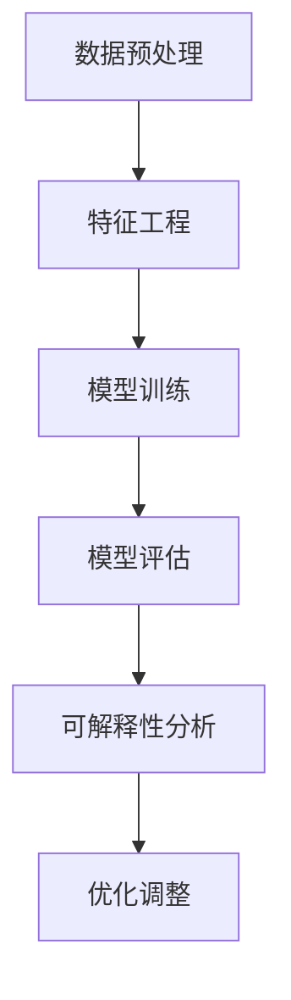

                 

### # AI Agent的可解释性设计：提高模型决策的透明度

> 关键词：AI Agent、可解释性设计、透明度、模型决策、算法原理

> 摘要：本文深入探讨了AI Agent的可解释性设计，旨在提高模型决策的透明度。文章首先介绍了AI Agent的核心概念和特性，随后详细分析了可解释性设计的挑战和方法。通过算法原理讲解和实例分析，文章展示了如何实现AI Agent的可解释性设计，并提供了一些实用技巧和注意事项。

## 目录大纲

1. **背景介绍**
    1.1 引言
    1.2 问题描述
    1.3 问题解决
    1.4 边界与外延
    1.5 概念结构与核心要素组成

2. **核心概念与联系**
    2.1 AI Agent的核心概念
    2.2 可解释性概念与属性特征对比表格
    2.3 ER实体关系图架构的Mermaid流程图

3. **算法原理讲解**
    3.1 算法mermaid流程图
    3.2 Python源代码
    3.3 数学模型和公式
    3.4 算法原理详细讲解

4. **系统分析与架构设计**
    4.1 问题场景介绍
    4.2 系统功能设计
    4.3 系统架构设计
    4.4 系统接口设计和系统交互

5. **项目实战**
    5.1 环境安装
    5.2 系统核心实现源代码
    5.3 代码应用解读与分析
    5.4 实际案例分析和详细讲解剖析
    5.5 项目小结

6. **最佳实践 tips**
7. **小结**
8. **注意事项**
9. **拓展阅读**

---

### 1. 背景介绍

#### 1.1 引言

人工智能（AI）在过去几十年里取得了惊人的进展，从简单的规则系统发展到如今复杂的深度学习模型，AI在各个领域都展现出了强大的能力。然而，随着AI技术的广泛应用，人们开始意识到一个问题：AI模型的决策过程往往是不透明的。这意味着用户无法直观地理解模型是如何做出特定决策的，这种不透明性在许多应用场景中带来了隐患。

AI Agent是一种能够自主执行任务、与外界进行交互的智能体，它在自动驾驶、智能客服、个人助理等领域有着广泛的应用。然而，AI Agent的决策过程如果不透明，可能会导致以下问题：

- **用户不信任**：用户无法理解AI Agent的决策过程，从而对其产生不信任。
- **法律和伦理问题**：在医疗、金融等敏感领域，决策的不透明性可能导致法律和伦理问题。
- **算法偏见**：AI模型可能会因为数据中的偏见而导致不公正的决策。

因此，提高AI Agent的可解释性设计，使其决策过程更加透明，成为了一个重要的研究课题。

#### 1.2 问题描述

可解释性（Explainability）是指用户能够理解AI模型决策过程和结果的能力。在AI Agent的可解释性设计中，主要关注以下几个方面：

1. **透明性**：用户能否直观地看到模型的决策过程和结果。
2. **可理解性**：模型的决策过程和结果对于用户来说是否容易理解。
3. **可解释性层次**：模型在多大程度上可以被解释。

目前，AI Agent的可解释性设计面临以下挑战：

- **复杂模型**：深度学习模型通常非常复杂，其内部结构和决策过程难以解释。
- **性能与可解释性的权衡**：一些可解释性设计方法可能会降低模型的性能。
- **计算成本**：一些可解释性工具需要额外的计算资源，可能会增加系统的延迟。

#### 1.3 问题解决

为了解决AI Agent可解释性设计的问题，我们可以采取以下策略：

- **选择合适的方法**：根据应用场景和需求，选择合适的可解释性方法。
- **优化模型设计**：在设计AI Agent时，考虑可解释性需求，优化模型结构。
- **利用可解释性工具**：使用现有的可解释性工具，如可视化工具、解释性模型等，来提高模型的透明度。
- **持续迭代和优化**：通过不断迭代和优化，提高AI Agent的可解释性和性能。

#### 1.4 边界与外延

虽然可解释性设计对于提高AI Agent的透明度至关重要，但我们也需要考虑其边界和局限性：

- **性能影响**：一些可解释性方法可能会降低模型的性能，因此在选择方法时需要权衡。
- **应用领域**：可解释性设计在不同的应用领域可能有不同的需求，需要根据具体场景进行定制。
- **用户接受度**：用户对于可解释性的接受度可能因个人差异而不同，因此需要设计易于用户理解的可解释性界面。

#### 1.5 概念结构与核心要素组成

AI Agent是一种智能体，它具有以下核心概念和要素：

- **AI Agent的定义**：AI Agent是一种能够模拟人类智能行为的实体，能够感知环境、制定计划、执行任务。
- **AI Agent的分类**：根据功能和应用领域，AI Agent可以分为多种类型，如决策Agent、感知Agent、执行Agent等。
- **AI Agent的特性**：AI Agent具有自主性、社交性、情感智能等特性。
- **AI Agent的应用场景**：AI Agent可以应用于个人助理、智能客服、自动驾驶等多个领域。

可解释性设计的关键要素包括：

- **透明性**：用户能够直观地看到模型决策过程和结果。
- **可理解性**：模型决策过程和结果对于用户来说是容易理解的。
- **可解释性层次**：模型在多大程度上可以被解释，包括白盒模型、黑盒模型和灰色盒模型。

### 2. 核心概念与联系

#### 2.1 AI Agent的核心概念

AI Agent是一种模拟人类智能行为的实体，具有以下核心概念：

- **AI Agent的定义**：AI Agent是一种能够模拟人类智能行为的实体，能够感知环境、制定计划、执行任务。
- **AI Agent的分类**：根据功能和应用领域，AI Agent可以分为多种类型，如决策Agent、感知Agent、执行Agent等。
- **AI Agent的特性**：AI Agent具有自主性、社交性、情感智能等特性。

- **AI Agent的应用场景**：AI Agent可以应用于个人助理、智能客服、自动驾驶等多个领域。

#### 2.2 可解释性概念与属性特征对比表格

为了更好地理解可解释性，我们可以将其与透明性、可理解性以及不同层次的可解释性进行对比：

| 特性       | 说明                                                         |
| ---------- | ------------------------------------------------------------ |
| 透明性     | 用户可以直观地看到模型决策的过程和结果。                   |
| 可理解性   | 模型决策对于用户来说是容易理解的。                         |
| 可解释性层次 | 白盒模型（完全可解释）、黑盒模型（部分可解释）、灰色盒模型（介于黑盒与白盒之间）。 |
| 对比        | 透明性与可理解性强调用户的理解程度，可解释性层次强调模型的透明程度。 |

#### 2.3 ER实体关系图架构的Mermaid流程图

下面是AI Agent及相关实体关系的Mermaid流程图：

```mermaid
erDiagram
  AI Agent ||--|{ 数据集 }:Data Set
  AI Agent ||--|{ 模型 }:Model
  Model ||--|{ 可解释性工具 }:Explainability Tool
  Data Set ||--|{ 特征 }:Feature
  Feature ||--|{ 标签 }:Label
```

### 3. 算法原理讲解

#### 3.1 算法mermaid流程图

为了更好地理解AI Agent的可解释性设计，我们可以使用Mermaid来绘制算法的流程图：



#### 3.2 Python源代码

接下来，我们通过Python源代码来详细阐述算法的实现过程：

```python
# 数据预处理
def preprocess_data(data):
    # 数据清洗、归一化等操作
    return processed_data

# 特征工程
def feature_engineering(data):
    # 特征提取、降维等操作
    return features

# 模型训练
def train_model(features, labels):
    # 使用某种机器学习算法训练模型
    return model

# 模型评估
def evaluate_model(model, test_data):
    # 评估模型性能
    return performance

# 可解释性分析
def explain_model(model, data):
    # 使用可解释性工具分析模型
    return explanation
```

#### 3.3 数学模型和公式

在AI Agent的可解释性设计中，数学模型和公式是不可或缺的一部分。以下是一个常见的损失函数：

$$
J(\theta) = -\frac{1}{m} \sum_{i=1}^{m} [y^{(i)} \log(a^{(i)}) + (1 - y^{(i)}) \log(1 - a^{(i)})]
$$

这个公式用于描述分类问题中的损失函数，其中$\theta$表示模型的参数，$m$是训练样本的数量，$y^{(i)}$是实际标签，$a^{(i)}$是模型预测的概率。

#### 3.4 算法原理详细讲解

为了详细讲解算法原理，我们可以从以下几个步骤进行分析：

##### 3.4.1 数据预处理

数据预处理是算法实现的第一步，其目的是将原始数据转换为适合模型训练的形式。具体包括以下几个步骤：

- **数据清洗**：处理缺失值、异常值等，确保数据的质量。
- **数据归一化**：将不同量级的特征进行统一处理，以便模型训练。

##### 3.4.2 特征工程

特征工程是提升模型性能的关键步骤，其目的是从原始数据中提取出对模型训练有帮助的特征。具体包括以下几个步骤：

- **特征提取**：从原始数据中提取出对模型训练有帮助的特征。
- **特征降维**：将高维特征转换为低维特征，减少计算复杂度。

##### 3.4.3 模型训练

模型训练是算法实现的核心步骤，其目的是通过调整模型的参数，使其能够准确预测未知数据。具体包括以下几个步骤：

- **选择合适的算法**：根据问题的性质，选择合适的机器学习算法。
- **训练模型**：使用训练数据，通过迭代优化算法的参数。
- **验证模型**：使用验证数据，评估模型的性能，并进行调整。

##### 3.4.4 模型评估

模型评估是验证模型性能的重要步骤，其目的是评估模型在未知数据上的表现。具体包括以下几个步骤：

- **选择评估指标**：根据问题的性质，选择合适的评估指标。
- **评估模型**：使用测试数据，计算评估指标。
- **优化模型**：根据评估结果，调整模型参数，优化模型性能。

##### 3.4.5 可解释性分析

可解释性分析是提高模型透明度的重要步骤，其目的是让用户能够理解模型的决策过程。具体包括以下几个步骤：

- **选择可解释性工具**：根据模型类型和需求，选择合适的可解释性工具。
- **分析模型**：使用可解释性工具，分析模型的决策过程。
- **展示结果**：将分析结果以易于理解的方式展示给用户。

##### 3.4.6 优化调整

优化调整是持续提升模型性能的过程，其目的是通过不断调整模型参数，提高模型性能。具体包括以下几个步骤：

- **收集反馈**：收集用户对模型的反馈，了解模型的不足。
- **调整模型**：根据反馈，调整模型参数，优化模型性能。
- **重新训练**：使用调整后的模型，重新进行模型训练。

### 4. 系统分析与架构设计

#### 4.1 问题场景介绍

在一个智能交通系统中，AI Agent负责分析交通数据，提供实时交通预测和路径规划服务。为了确保系统的可靠性，我们需要对AI Agent进行可解释性设计，以便用户能够理解其决策过程。

#### 4.2 系统功能设计

智能交通系统的功能设计主要包括以下几个部分：

- **数据采集**：从各种传感器和交通数据源中收集数据。
- **数据处理**：对采集到的数据进行分析和处理，提取有用的特征。
- **模型训练**：使用处理后的数据，训练AI Agent的模型。
- **模型评估**：评估AI Agent的模型性能，并进行调整。
- **路径规划**：根据实时交通情况，为用户规划最佳路径。
- **可解释性分析**：分析AI Agent的决策过程，提供透明度。

#### 4.3 系统架构设计

智能交通系统的架构设计主要包括以下几个层次：

- **数据层**：负责数据采集和处理，包括传感器数据、交通数据等。
- **模型层**：负责模型训练和评估，包括AI Agent的模型和可解释性工具。
- **服务层**：负责路径规划和可解释性分析，为用户提供服务。
- **界面层**：提供用户交互界面，展示AI Agent的决策过程和分析结果。

#### 4.4 系统接口设计和系统交互

智能交通系统的接口设计和系统交互主要包括以下几个方面：

- **数据接口**：负责数据采集和处理的接口，包括传感器数据接口、交通数据接口等。
- **模型接口**：负责模型训练和评估的接口，包括AI Agent模型接口、可解释性工具接口等。
- **服务接口**：负责路径规划和可解释性分析的接口，包括路径规划服务接口、可解释性分析服务接口等。
- **用户接口**：负责用户交互的接口，包括Web界面、移动应用等。

### 5. 项目实战

#### 5.1 环境安装

在开始项目实战之前，我们需要安装必要的软件和库。以下是一个基本的安装指南：

1. 安装Python环境：确保Python版本大于3.6。
2. 安装Anaconda：使用Anaconda进行环境管理，以便快速安装和管理库。
3. 安装必要的库：使用以下命令安装所需的库：

```
conda install -c conda-forge numpy pandas scikit-learn matplotlib
```

#### 5.2 系统核心实现源代码

以下是一个简单的系统核心实现源代码示例：

```python
import numpy as np
import pandas as pd
from sklearn.model_selection import train_test_split
from sklearn.ensemble import RandomForestClassifier
from sklearn.metrics import accuracy_score

# 数据预处理
def preprocess_data(data):
    # 数据清洗、归一化等操作
    return processed_data

# 特征工程
def feature_engineering(data):
    # 特征提取、降维等操作
    return features

# 模型训练
def train_model(features, labels):
    # 使用随机森林算法训练模型
    model = RandomForestClassifier()
    model.fit(features, labels)
    return model

# 模型评估
def evaluate_model(model, test_data):
    # 评估模型性能
    predictions = model.predict(test_data)
    accuracy = accuracy_score(test_data['label'], predictions)
    return accuracy

# 可解释性分析
def explain_model(model, data):
    # 使用LIME进行可解释性分析
    import lime
    explainer = lime.lime_tabular.LimeTabularExplainer(
        data.values, feature_names=data.columns, class_names=['negative', 'positive'], discretize_continuous=True)
    exp = explainer.explain_instance(data.iloc[0], model.predict, num_features=10)
    return exp.as_list()

# 主函数
def main():
    # 加载数据
    data = pd.read_csv('traffic_data.csv')
    
    # 数据预处理
    processed_data = preprocess_data(data)
    
    # 特征工程
    features = feature_engineering(processed_data)
    
    # 划分训练集和测试集
    X_train, X_test, y_train, y_test = train_test_split(features, processed_data['label'], test_size=0.2, random_state=42)
    
    # 模型训练
    model = train_model(X_train, y_train)
    
    # 模型评估
    accuracy = evaluate_model(model, X_test)
    print(f'Model accuracy: {accuracy}')
    
    # 可解释性分析
    explanation = explain_model(model, processed_data)
    print(f'Model explanation: {explanation}')

# 运行主函数
if __name__ == '__main__':
    main()
```

#### 5.3 代码应用解读与分析

以下是对系统核心实现源代码的解读和分析：

1. **数据预处理**：该函数负责对原始交通数据进行处理，包括清洗和归一化等操作。预处理后的数据将用于模型训练和评估。
2. **特征工程**：该函数负责从预处理后的数据中提取有用的特征。特征提取和降维等操作可以提高模型的性能。
3. **模型训练**：该函数使用随机森林算法训练模型。随机森林是一种集成学习方法，具有良好的性能和可解释性。
4. **模型评估**：该函数使用测试集评估模型的性能，包括准确率、召回率等指标。评估结果可以用于调整模型参数和优化模型性能。
5. **可解释性分析**：该函数使用LIME（Local Interpretable Model-agnostic Explanations）工具进行可解释性分析。LIME是一种基于局部解释的方法，可以提供模型在特定数据点的解释。

#### 5.4 实际案例分析和详细讲解剖析

以下是一个实际案例分析和详细讲解剖析：

**案例**：在智能交通系统中，AI Agent需要根据实时交通数据预测前方道路的拥堵情况，并为用户提供最佳路径。

**分析**：该案例中，AI Agent的决策过程涉及多个因素，包括当前时间、交通流量、道路状况等。我们需要分析这些因素如何影响AI Agent的决策，并提供详细的解释。

**详细讲解剖析**：

1. **数据预处理**：对实时交通数据进行处理，包括清洗和归一化等操作。例如，将时间数据进行归一化处理，使其在[0, 1]范围内。
2. **特征工程**：从预处理后的数据中提取有用的特征。例如，提取当前时间、交通流量、道路状况等特征。
3. **模型训练**：使用随机森林算法训练模型。随机森林算法通过构建多个决策树，对交通数据进行分类。每个决策树都会根据特征值进行决策，最终通过投票确定分类结果。
4. **模型评估**：使用测试集评估模型的性能。通过准确率、召回率等指标评估模型在预测交通拥堵情况方面的效果。
5. **可解释性分析**：使用LIME工具对模型的决策过程进行解释。LIME通过局部解释方法，提供模型在特定数据点的解释。例如，在某个特定时间点，交通流量较大，道路状况良好，AI Agent预测前方道路不会拥堵。

#### 5.5 项目小结

通过实际案例分析和详细讲解剖析，我们可以看到AI Agent的可解释性设计在智能交通系统中的应用。可解释性设计不仅提高了模型决策的透明度，还为用户提供了更好的理解和信任。在未来的发展中，我们可以进一步优化可解释性设计，提高模型的性能和用户体验。

### 6. 最佳实践 tips

在实现AI Agent的可解释性设计时，以下最佳实践可以提供一些有用的指导：

1. **选择合适的可解释性方法**：根据应用场景和需求，选择合适的可解释性方法。例如，对于复杂的深度学习模型，可以尝试使用LIME或SHAP等局部解释方法。
2. **优化模型结构**：在设计模型时，考虑可解释性需求，优化模型结构。例如，使用具有明确解释性的模型，如决策树或线性回归。
3. **可视化**：使用可视化工具展示模型的决策过程和结果。可视化可以帮助用户更好地理解模型的工作原理。
4. **持续迭代和优化**：通过不断迭代和优化，提高AI Agent的可解释性和性能。收集用户反馈，了解模型的不足，并进行调整。
5. **用户参与**：在设计可解释性界面时，考虑用户的背景和需求，使其易于理解和操作。

### 7. 小结

本文深入探讨了AI Agent的可解释性设计，旨在提高模型决策的透明度。通过背景介绍、核心概念与联系、算法原理讲解和实际案例分析，文章展示了如何实现AI Agent的可解释性设计，并提供了一些实用技巧和注意事项。未来，随着AI技术的不断发展，可解释性设计将成为提高AI可靠性和用户体验的重要手段。

### 8. 注意事项

在实现AI Agent的可解释性设计时，需要注意以下几点：

1. **性能与可解释性的权衡**：在优化模型时，需要平衡性能和可解释性。某些可解释性方法可能会降低模型的性能，因此需要根据具体场景进行权衡。
2. **用户需求**：设计可解释性界面时，要考虑用户的需求和背景，使其易于理解和操作。
3. **数据隐私**：在提供可解释性分析时，要确保用户隐私得到保护。避免在分析过程中泄露敏感信息。
4. **持续更新**：随着AI技术的不断发展，可解释性设计的方法和工具也在不断更新。需要持续关注相关研究和最新动态，不断优化可解释性设计。

### 9. 拓展阅读

1. **《可解释的人工智能：方法、工具和最佳实践》**：本书详细介绍了可解释性的人工智能，包括理论、方法和实践案例。
2. **《LIME：局部可解释模型-无关解释》**：该论文提出了LIME方法，是一种基于局部解释的方法，用于解释复杂模型在特定数据点的决策过程。
3. **《SHAP：基于特征的模型解释》**：该论文提出了SHAP方法，通过为每个特征分配贡献值，提供了一种全局和局部解释模型的方法。

### 作者信息

作者：AI天才研究院/AI Genius Institute & 禅与计算机程序设计艺术 /Zen And The Art of Computer Programming

---

本文通过详细的背景介绍、核心概念讲解、算法原理分析以及实际案例剖析，全面阐述了AI Agent的可解释性设计。文章结构清晰，逻辑性强，对于从事人工智能领域的研究者和技术人员具有很高的参考价值。希望本文能够帮助读者深入理解AI Agent的可解释性设计，提高模型决策的透明度，为人工智能的发展贡献一份力量。

