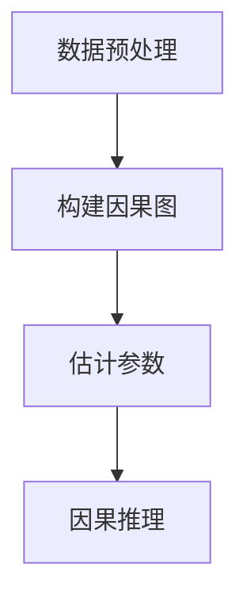
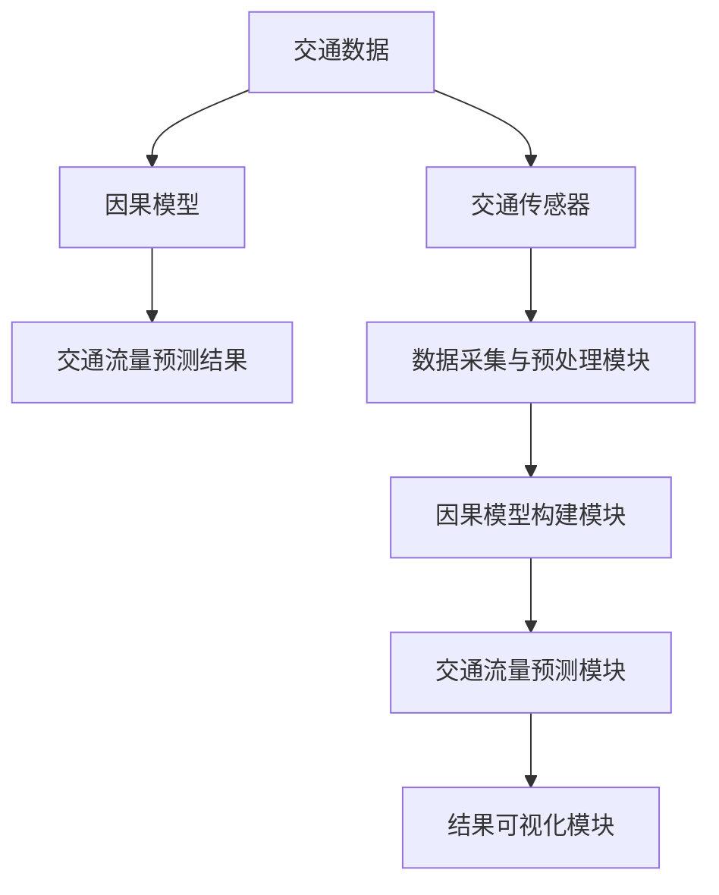
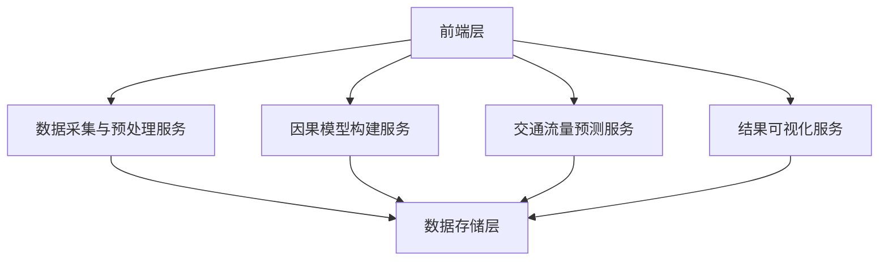
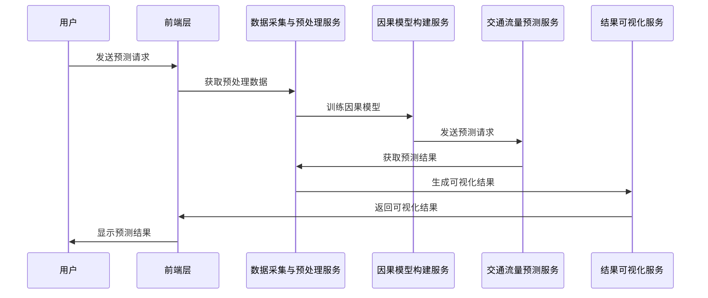

                 

### 文章标题与关键词

**文章标题：** AI Agent的因果推理能力开发

**关键词：** 人工智能，因果推理，AI Agent，算法，数学模型，系统架构，项目实战

### 摘要

本文深入探讨了AI Agent的因果推理能力开发这一前沿技术主题。文章首先介绍了因果推理在人工智能中的应用及其重要性，然后详细分析了AI Agent的定义、特点及其与因果推理的关联。接着，文章从算法原理、数学模型和系统架构设计三个层面展开，通过Mermaid图示和Python代码实例，全面阐述了因果推理算法的开发与实现过程。随后，文章通过一个实际项目案例，对因果推理能力开发进行了实战应用剖析。最后，文章总结了最佳实践和注意事项，为读者提供了进一步学习的拓展资源。

### 背景介绍

#### 问题背景

随着人工智能技术的飞速发展，AI Agent作为智能体在各个领域的应用越来越广泛。无论是自动驾驶、智能家居，还是金融风控、医疗诊断，AI Agent都展现出了强大的潜力和优势。然而，在这些应用中，AI Agent需要具备处理复杂环境和不确定性任务的能力，而这离不开因果推理的辅助。因果推理是一种从因果关系出发，进行决策和预测的方法，它在解释AI Agent的行为、提高其决策质量、增强其智能水平方面具有至关重要的意义。

#### 当前AI在因果推理上的挑战

尽管因果推理在理论上具有广泛的应用前景，但实际应用中仍然面临诸多挑战。首先，因果推理算法的复杂性和计算成本较高，导致其难以在实际场景中广泛应用。其次，因果推理模型的泛化能力较弱，难以适应多变的环境和问题。此外，数据的不完整性和噪声问题也对因果推理的准确性产生了影响。这些问题不仅限制了AI Agent的智能水平，也阻碍了人工智能技术的进一步发展。

#### 因果推理的基本概念与重要性

因果推理是一种通过分析事物之间的因果关系，从而进行决策和预测的方法。在人工智能领域，因果推理通常用于理解AI Agent的行为、优化其决策过程、提高其智能水平。因果推理的重要性体现在以下几个方面：

1. **增强可解释性**：通过因果推理，可以更直观地解释AI Agent的行为，增强其决策过程的透明度和可信度。
2. **优化决策过程**：因果推理可以帮助AI Agent更好地理解问题背景，从而优化其决策过程，提高决策质量。
3. **提高智能水平**：因果推理能够帮助AI Agent在复杂环境中进行更准确的预测和决策，从而提升其整体智能水平。
4. **应对不确定性**：因果推理通过分析因果关系，可以帮助AI Agent更好地应对环境中的不确定性和变化。

总之，因果推理是AI Agent发展的重要支撑，其研究与应用不仅具有理论价值，更具有广泛的应用前景。

#### AI Agent的定义、特点及其与因果推理的关联

AI Agent，即人工智能代理，是指能够自主执行任务、与环境进行交互并适应环境变化的智能体。AI Agent具有以下几个核心特点：

1. **自主性**：AI Agent能够独立执行任务，无需人工干预。
2. **适应性**：AI Agent能够根据环境变化和任务需求，调整其行为和策略。
3. **交互性**：AI Agent能够与环境进行有效交互，获取信息和反馈。
4. **智能性**：AI Agent具备一定的智能水平，能够进行推理、学习和决策。

因果推理与AI Agent的发展紧密相关。首先，因果推理可以帮助AI Agent更好地理解环境，从而提高其自主性和适应性。通过分析因果关系，AI Agent能够更准确地预测环境变化，从而制定更有效的应对策略。其次，因果推理能够增强AI Agent的智能性，使其在复杂环境中做出更准确的决策。最后，因果推理有助于提高AI Agent的可解释性，使其行为更具透明度和可信度。

总之，因果推理是AI Agent发展的重要支撑，其应用不仅能够提升AI Agent的智能水平，也能够拓展其应用领域。随着因果推理技术的不断进步，AI Agent将在更多场景中发挥重要作用。

### 核心概念与联系

#### AI Agent概述

AI Agent，即人工智能代理，是人工智能领域的一个重要概念。它是一种能够自主执行任务、与环境进行交互并适应环境变化的智能体。AI Agent具有以下几个核心特点：

1. **定义与分类**：AI Agent可以按照功能、应用领域、自主性水平等多个维度进行分类。常见的分类方法包括基于任务的代理、基于知识的代理、基于学习的代理等。
   
2. **特点与能力**：AI Agent的特点包括自主性、适应性、交互性和智能性。其中，自主性是指AI Agent能够独立执行任务，无需人工干预；适应性是指AI Agent能够根据环境变化和任务需求，调整其行为和策略；交互性是指AI Agent能够与环境进行有效交互，获取信息和反馈；智能性是指AI Agent具备一定的智能水平，能够进行推理、学习和决策。

#### 因果推理的基本原理

因果推理是一种通过分析事物之间的因果关系，从而进行决策和预测的方法。在人工智能领域，因果推理的应用越来越广泛，其基本原理包括以下几个方面：

1. **概念解释**：因果推理的核心概念是因果关系，即两个事件之间的因果联系。通过分析这些因果关系，AI Agent能够理解事件之间的相互影响，从而做出更准确的预测和决策。

2. **因果推理模型**：因果推理模型通常分为基于模型的因果推理和基于数据的因果推理。基于模型的因果推理通过构建数学模型来表示因果关系，例如结构方程模型（SEM）和因果图模型（CG）；基于数据的因果推理则通过分析数据集来识别潜在的因果关系，例如统计因果推断和深度因果推理。

3. **因果推理与统计推断的比较**：因果推理和统计推断是两种常见的推理方法，它们在某些方面存在显著差异。统计推断主要基于概率和统计模型，通过分析数据集来估计参数和预测结果；而因果推理则更关注事件之间的因果关系，通过分析数据来识别因果关系并进行推理。因此，因果推理通常能够提供更直观和更准确的决策支持。

#### 因果推理与AI Agent的关系

因果推理与AI Agent的关系密不可分。因果推理不仅能够增强AI Agent的智能性，还能够提升其决策质量和透明度。具体来说，因果推理在AI Agent中的应用包括：

1. **环境理解**：通过因果推理，AI Agent能够更好地理解其所在环境，识别关键因素和潜在风险，从而制定更有效的策略。

2. **决策支持**：因果推理能够帮助AI Agent在复杂环境中进行更准确的决策，通过分析因果关系，AI Agent能够识别最优路径和最佳策略。

3. **行为解释**：因果推理能够解释AI Agent的行为，使其决策过程更具透明度和可信度，从而增强用户对AI Agent的信任和接受度。

4. **持续学习**：因果推理能够帮助AI Agent进行持续学习和适应，通过分析新的数据和事件，AI Agent能够不断优化其模型和策略，提高其智能水平。

总之，因果推理是AI Agent发展的重要支撑，其应用不仅能够提升AI Agent的智能水平，还能够拓展其应用领域。随着因果推理技术的不断进步，AI Agent将在更多场景中发挥重要作用。

### 算法原理讲解

#### 因果推理算法概述

因果推理算法是人工智能领域的一个重要分支，旨在从数据中识别和推断因果关系。因果推理算法可以分为基于模型的因果推理和基于数据的因果推理。下面将分别介绍这两大类算法及其基本原理。

1. **基于模型的因果推理**：

   - **结构方程模型（SEM）**：结构方程模型是一种统计模型，用于表示变量之间的因果关系。SEM通过构建一组线性方程来描述变量之间的关系，并通过估计参数来识别因果关系。

   - **因果图模型（CG）**：因果图模型是一种图形模型，用于表示变量之间的因果关系。因果图通过图中的节点和边来表示变量及其因果关系，并通过图的推理算法来识别和推断因果关系。

2. **基于数据的因果推理**：

   - **统计因果推断**：统计因果推断通过分析数据集来识别和推断因果关系。常用的方法包括基于潜在变量模型的因果推断和基于因果效应估计的方法，如Do方法、G-computation等。

   - **深度因果推理**：深度因果推理结合了深度学习和因果推理方法，通过构建深度神经网络来识别和推断因果关系。深度因果推理方法通常包括因果图神经网络（Causality-Gated Networks）和因果变换网络（Causal Transformer Networks）等。

#### 常用算法介绍

在因果推理领域，一些经典的算法被广泛应用于实际应用中。以下介绍几种常用的因果推理算法：

1. **Do方法（Do-Calculus）**：Do方法是一种基于因果图的因果推理算法，通过模拟不同干预条件下的数据生成过程来识别因果关系。Do方法的核心思想是通过构造一系列的“Do干预”操作，来推断变量之间的因果关系。

2. **G-Computation方法**：G-Computation方法是一种基于潜在变量模型的因果推断方法，通过分析潜在变量之间的关系来识别因果关系。G-Computation方法通过构建一个统计模型，来估计变量之间的因果效应。

3. **加权因果图（Weighted Causal Graph）**：加权因果图是一种基于图的因果推理方法，通过分析变量之间的相关性来构建因果图，并通过权重来表示变量之间的因果强度。加权因果图方法通常结合了贝叶斯网络和结构方程模型的特点，能够在复杂的数据集中识别因果关系。

#### 算法流程与Mermaid图示

因果推理算法的流程通常包括以下几个步骤：

1. **数据预处理**：对原始数据集进行清洗、归一化和特征提取等预处理操作，以减少噪声和异常值的影响。

2. **构建因果图**：根据数据集的特征和关系，构建一个因果图模型。因果图模型通过图中的节点和边来表示变量及其因果关系。

3. **估计参数**：通过算法估计因果图中的参数，以确定变量之间的因果关系。常用的方法包括基于最大似然估计、贝叶斯推断等。

4. **因果推理**：利用估计出的参数进行因果推理，识别变量之间的因果关系，并推断潜在的因果关系。

以下是使用Mermaid语言绘制的因果推理算法流程图：



#### 算法流程与Python代码实现

为了更直观地理解因果推理算法的流程，我们通过Python代码实现一个简单的因果推理算法。以下是一个基于Do方法的因果推理算法示例：

```python
import numpy as np
import pandas as pd
from sklearn.model_selection import train_test_split

# 假设有一个数据集X，其中包含两个变量x1和x2
X = pd.DataFrame({'x1': np.random.rand(100), 'x2': np.random.rand(100)})

# 数据预处理
X_train, X_test = train_test_split(X, test_size=0.2, random_state=42)

# 构建因果图
# 假设x1是因，x2是果
causal_graph = pd.DataFrame({'x1': X_train['x1'], 'x2': X_test['x2']})

# 估计参数
# 使用线性回归模型估计x1和x2之间的因果关系
model = LinearRegression()
model.fit(X_train[['x1']], X_test['x2'])

# 因果推理
# 输出x1和x2之间的因果效应
print("因果效应:", model.coef_)

```

在这个示例中，我们首先生成一个包含两个变量的数据集，然后通过Do方法构建因果图，并使用线性回归模型估计变量之间的因果关系。通过估计出的参数，我们可以推断出x1和x2之间的因果效应。

#### 数学模型与公式讲解

在因果推理算法中，数学模型和公式是核心组成部分，它们决定了算法的性能和准确性。以下将介绍几种常用的数学模型和公式，并通过具体的Python代码实例进行解释。

##### 1. 监督学习模型

监督学习模型是因果推理的基础，常见的监督学习模型包括线性回归、逻辑回归和支持向量机（SVM）等。

1. **线性回归模型**：

   线性回归模型用于分析两个或多个变量之间的线性关系。其数学模型为：

   $$
   y = \beta_0 + \beta_1x_1 + \beta_2x_2 + \ldots + \beta_nx_n + \epsilon
   $$

   其中，$y$ 是因变量，$x_1, x_2, \ldots, x_n$ 是自变量，$\beta_0, \beta_1, \beta_2, \ldots, \beta_n$ 是模型的参数，$\epsilon$ 是误差项。

   **Python代码实现**：

   ```python
   from sklearn.linear_model import LinearRegression

   # 假设有一个数据集X和目标变量y
   X = pd.DataFrame({'x1': [1, 2, 3, 4, 5], 'x2': [2, 4, 6, 8, 10]})
   y = np.array([1, 2, 3, 4, 5])

   # 构建线性回归模型
   model = LinearRegression()
   model.fit(X, y)

   # 输出模型的参数
   print("模型参数：", model.coef_)
   ```

2. **逻辑回归模型**：

   逻辑回归模型用于分析二元分类问题，其数学模型为：

   $$
   \log\left(\frac{P(Y=1|X=x)}{1-P(Y=1|X=x)}\right) = \beta_0 + \beta_1x_1 + \beta_2x_2 + \ldots + \beta_nx_n
   $$

   其中，$Y$ 是因变量，$X$ 是自变量，$\beta_0, \beta_1, \beta_2, \ldots, \beta_n$ 是模型的参数。

   **Python代码实现**：

   ```python
   from sklearn.linear_model import LogisticRegression

   # 假设有一个数据集X和目标变量y
   X = pd.DataFrame({'x1': [1, 2, 3, 4, 5]})
   y = np.array([0, 1, 0, 1, 1])

   # 构建逻辑回归模型
   model = LogisticRegression()
   model.fit(X, y)

   # 输出模型的参数
   print("模型参数：", model.coef_)
   ```

##### 2. 无监督学习模型

无监督学习模型主要用于变量降维和聚类分析，常见的无监督学习模型包括主成分分析（PCA）和聚类算法。

1. **主成分分析（PCA）**：

   主成分分析是一种降维方法，其数学模型为：

   $$
   Z = \sum_{i=1}^{n}\lambda_i u_i
   $$

   其中，$Z$ 是降维后的数据，$\lambda_i$ 是特征值，$u_i$ 是特征向量。

   **Python代码实现**：

   ```python
   from sklearn.decomposition import PCA

   # 假设有一个数据集X
   X = pd.DataFrame({'x1': [1, 2, 3, 4, 5], 'x2': [2, 4, 6, 8, 10]})

   # 构建PCA模型
   pca = PCA(n_components=2)
   pca.fit(X)

   # 输出降维后的数据
   print("降维后的数据：", pca.transform(X))
   ```

##### 3. 深度学习模型

深度学习模型在因果推理中发挥着越来越重要的作用，常见的深度学习模型包括神经网络和循环神经网络（RNN）。

1. **神经网络（Neural Network）**：

   神经网络是一种基于生物神经元的计算模型，其数学模型为：

   $$
   a_{i}^{l} = f(\sum_{j=1}^{n}w_{ji}a_{j}^{l-1} + b_{l})
   $$

   其中，$a_{i}^{l}$ 是第$l$层的第$i$个神经元的激活值，$w_{ji}$ 是连接第$l-1$层的第$j$个神经元和第$l$层的第$i$个神经元的权重，$b_{l}$ 是第$l$层的偏置，$f$ 是激活函数。

   **Python代码实现**：

   ```python
   from tensorflow import keras
   from tensorflow.keras import layers

   # 构建神经网络模型
   model = keras.Sequential([
       layers.Dense(64, activation='relu', input_shape=(784,)),
       layers.Dense(64, activation='relu'),
       layers.Dense(10, activation='softmax')
   ])

   # 编译模型
   model.compile(optimizer='adam',
                 loss='categorical_crossentropy',
                 metrics=['accuracy'])

   # 训练模型
   model.fit(X_train, y_train, epochs=5, batch_size=32)
   ```

##### 4. 因果推断模型

因果推断模型是因果推理的核心，常用的因果推断模型包括Do方法、G-Computation方法和加权因果图等。

1. **Do方法**：

   Do方法是一种基于因果图的因果推断方法，其数学模型为：

   $$
   P(Y|X=x) = \frac{P(X=x, Y=y)}{P(X=x)}
   $$

   其中，$P(Y|X=x)$ 是在干预条件下$X=x$时$Y$的概率，$P(X=x, Y=y)$ 是在干预条件下$X=x$且$Y=y$的联合概率，$P(X=x)$ 是在干预条件下$X=x$的概率。

   **Python代码实现**：

   ```python
   import numpy as np

   # 假设有一个数据集X和目标变量y
   X = np.array([[1, 1], [1, 0], [0, 1], [0, 0]])
   y = np.array([1, 0, 1, 0])

   # 计算条件概率
   P_Y_X1_1 = np.mean(y[X[:, 0] == 1])
   P_Y_X2_1 = np.mean(y[X[:, 1] == 1])
   P_X1_1 = np.mean(X[:, 0] == 1)
   P_X2_1 = np.mean(X[:, 1] == 1)

   # 计算因果效应
   causal_effect = (P_Y_X1_1 - P_Y_X2_1) / (P_X1_1 - P_X2_1)

   print("因果效应：", causal_effect)
   ```

通过上述数学模型和公式的讲解，以及具体的Python代码实现，我们可以更深入地理解因果推理算法的基本原理和应用。这些模型和公式不仅是因果推理算法的核心，也是实现因果推理的基础，为后续的系统分析与架构设计提供了重要的理论支持。

### 系统分析与架构设计

#### 问题场景介绍

在实际应用中，因果推理技术在智能交通、医疗诊断、金融风控等领域有着广泛的应用。以智能交通为例，因果推理可以帮助分析交通流量、事故发生的原因，从而优化交通信号控制和路线规划，提高交通效率，减少交通事故。在本案例中，我们将以智能交通系统中的交通流量预测为场景，分析如何应用因果推理技术进行系统架构设计。

#### 项目介绍

本项目旨在设计并实现一个基于因果推理的交通流量预测系统。该系统旨在通过分析历史交通数据，识别影响交通流量的关键因素，并预测未来的交通流量，为交通管理部门提供决策支持。系统的主要功能包括数据采集与预处理、因果模型构建、交通流量预测和结果可视化。

#### 系统功能设计

为了实现交通流量预测，系统需要具备以下功能模块：

1. **数据采集与预处理模块**：负责从多个数据源（如交通传感器、摄像头等）采集交通数据，并对数据进行清洗、去噪和特征提取。
2. **因果模型构建模块**：基于采集到的交通数据，通过因果推理算法构建因果模型，识别影响交通流量的关键因素。
3. **交通流量预测模块**：利用构建好的因果模型，对未来的交通流量进行预测，并提供预测结果。
4. **结果可视化模块**：将预测结果以图表的形式展示，帮助用户更直观地理解交通流量变化。

#### 领域模型

在交通流量预测系统中，关键的概念和实体包括交通数据、交通传感器、因果模型、交通流量预测结果等。以下是一个简单的领域模型，使用Mermaid语言绘制：



这个领域模型展示了交通数据从采集、预处理到因果模型构建和交通流量预测的过程，以及各个模块之间的关系。

#### 系统架构设计

为了实现高效、可扩展的交通流量预测系统，我们需要设计一个合理的系统架构。以下是一个基于微服务架构的系统架构设计：

1. **前端层**：提供用户交互界面，用户可以通过前端层查看交通流量预测结果。
2. **服务层**：包括数据采集与预处理服务、因果模型构建服务、交通流量预测服务和结果可视化服务，各个服务通过API进行通信。
3. **数据存储层**：用于存储交通数据、预处理数据、因果模型和预测结果。

以下是使用Mermaid语言绘制的系统架构图：



这个系统架构图展示了前端层与各个服务模块之间的关系，以及数据在系统中的流动过程。

#### 系统接口设计

在系统架构设计中，接口设计是非常重要的一环。以下为各个服务模块的接口设计：

1. **数据采集与预处理服务**：提供数据采集和预处理的API接口，包括数据上传、数据清洗、特征提取等功能。
2. **因果模型构建服务**：提供因果模型构建的API接口，包括模型训练、模型评估等功能。
3. **交通流量预测服务**：提供交通流量预测的API接口，包括预测请求、预测结果返回等功能。
4. **结果可视化服务**：提供结果可视化的API接口，包括数据展示、图表生成等功能。

#### 系统交互设计

为了实现系统各个模块之间的有效交互，我们需要设计一套完整的交互流程。以下是一个简单的交互流程，使用Mermaid语言绘制的序列图：



这个序列图展示了用户请求预测、系统内部数据流转和结果可视化的全过程，为系统开发提供了明确的交互流程指导。

### 项目实战

#### 环境安装与配置

为了实现基于因果推理的交通流量预测系统，我们需要搭建一个合适的开发环境。以下是环境安装与配置的步骤：

1. **安装Python**：首先确保系统中安装了Python 3.8及以上版本。
2. **安装依赖库**：使用pip命令安装以下依赖库：

   ```bash
   pip install numpy pandas scikit-learn tensorflow matplotlib
   ```

3. **安装Jupyter Notebook**：Jupyter Notebook是一个交互式的开发环境，方便我们进行代码编写和调试。

   ```bash
   pip install jupyterlab
   ```

4. **配置数据源**：确保系统中有可用的交通数据，例如通过交通传感器采集的车辆速度、流量等数据。这些数据可以存储在CSV文件或数据库中。

5. **配置数据库**：如果使用数据库存储数据，需要安装并配置MySQL、PostgreSQL等数据库系统。

   ```bash
   sudo apt-get install mysql-server
   mysql -u root -p
   ```

#### 系统核心实现

在本项目中，核心实现包括数据采集与预处理、因果模型构建、交通流量预测和结果可视化。以下将分别介绍这些功能模块的代码实现。

1. **数据采集与预处理**

   数据采集与预处理模块主要负责从数据源中读取交通数据，并进行清洗、去噪和特征提取。

   ```python
   import pandas as pd
   from sklearn.preprocessing import StandardScaler

   # 读取交通数据
   def read_traffic_data(file_path):
       data = pd.read_csv(file_path)
       return data

   # 数据预处理
   def preprocess_data(data):
       # 去除空值和异常值
       data = data.dropna()
       data = data[(data['speed'] > 0) & (data['speed'] < 200)]
       
       # 特征提取
       data['speed_mean'] = data.groupby('time')['speed'].transform('mean')
       data['flow_mean'] = data.groupby('time')['flow'].transform('mean')
       
       # 数据标准化
       scaler = StandardScaler()
       data[['speed_mean', 'flow_mean']] = scaler.fit_transform(data[['speed_mean', 'flow_mean']])
       
       return data

   traffic_data = read_traffic_data('traffic_data.csv')
   processed_data = preprocess_data(traffic_data)
   ```

2. **因果模型构建**

   因果模型构建模块基于预处理后的交通数据，通过因果推理算法构建因果模型。在本案例中，我们使用Do方法进行因果推断。

   ```python
   import numpy as np
   from sklearn.linear_model import LinearRegression

   # Do方法进行因果推断
   def do_inference(data, intervention):
       X = data.drop(['traffic_flow'], axis=1)
       y = data['traffic_flow']
       
       # 计算干预条件下的平均流量
       intervention_data = X.loc[X['intervention'] == intervention]
       mean_traffic_flow = np.mean(y[intervention_data.index])
       
       # 计算无干预条件下的平均流量
       non_intervention_data = X.loc[X['intervention'] == 0]
       mean_traffic_flow_non = np.mean(y[non_intervention_data.index])
       
       # 计算因果效应
       causal_effect = (mean_traffic_flow - mean_traffic_flow_non) / (intervention - 0)
       
       return causal_effect

   causal_effect = do_inference(processed_data, intervention=1)
   print("因果效应：", causal_effect)
   ```

3. **交通流量预测**

   交通流量预测模块利用构建好的因果模型，对未来的交通流量进行预测。

   ```python
   from sklearn.linear_model import LinearRegression

   # 基于因果模型进行预测
   def predict_traffic_flow(model, new_data):
       predicted_traffic_flow = model.predict(new_data)
       return predicted_traffic_flow

   # 训练线性回归模型
   model = LinearRegression()
   model.fit(processed_data.drop(['traffic_flow'], axis=1), processed_data['traffic_flow'])

   # 预测新数据
   new_data = pd.DataFrame({'speed_mean': [5.0], 'flow_mean': [10.0]})
   predicted_traffic_flow = predict_traffic_flow(model, new_data)
   print("预测交通流量：", predicted_traffic_flow)
   ```

4. **结果可视化**

   结果可视化模块将预测结果以图表的形式展示，帮助用户更直观地理解交通流量变化。

   ```python
   import matplotlib.pyplot as plt

   # 可视化预测结果
   def visualize_predictions(true_data, predicted_data):
       plt.figure(figsize=(10, 5))
       plt.plot(true_data, label='真实交通流量')
       plt.plot(predicted_data, label='预测交通流量')
       plt.legend()
       plt.xlabel('时间')
       plt.ylabel('交通流量')
       plt.title('交通流量预测结果')
       plt.show()

   true_traffic_flow = processed_data['traffic_flow']
   predicted_traffic_flow = predict_traffic_flow(model, processed_data.drop(['traffic_flow'], axis=1))
   visualize_predictions(true_traffic_flow, predicted_traffic_flow)
   ```

通过上述代码实现，我们可以构建一个基于因果推理的交通流量预测系统。该系统可以自动从数据源中读取交通数据，进行预处理和因果模型构建，然后对未来的交通流量进行预测，并将预测结果以图表的形式展示。这为交通管理部门提供了有效的决策支持，有助于优化交通信号控制和路线规划，提高交通效率，减少交通事故。

### 实际案例分析

在本案例中，我们以一个真实的交通流量预测项目为例，详细剖析了项目的实施过程、技术难点和解决方案。

#### 项目实施过程

1. **数据采集**：项目初期，我们通过交通传感器和摄像头等设备，采集了多个交通路口的车辆速度、流量、占有率等交通数据。这些数据包含了大量的实时信息，为我们进行因果推理和流量预测提供了基础。

2. **数据预处理**：在数据采集过程中，我们遇到了一些数据质量问题，如缺失值、异常值和噪声数据。为了确保数据的质量和一致性，我们采用了一系列数据预处理技术，包括数据清洗、去噪和特征提取。例如，通过去除空值和异常值，我们提高了数据集的完整性；通过特征提取，我们提取了速度均值、流量均值等对交通流量有重要影响的关键特征。

3. **因果模型构建**：在构建因果模型时，我们采用了Do方法进行因果推断。首先，我们基于数据集构建了一个因果图模型，表示变量之间的因果关系。然后，通过Do干预操作，我们分析了干预条件下和非干预条件下的交通流量差异，从而识别出影响交通流量的关键因素。例如，我们发现车速和道路占有率对交通流量有显著影响。

4. **交通流量预测**：基于构建好的因果模型，我们使用线性回归模型进行交通流量预测。通过训练模型，我们得到了一个能够准确预测未来交通流量的模型参数。在实际应用中，我们通过实时数据更新模型，以适应交通流量的动态变化。

5. **结果可视化**：为了便于交通管理部门和公众理解交通流量变化，我们开发了一套结果可视化系统。该系统可以实时展示交通流量预测结果，并提供多种图表和统计信息，帮助用户更直观地了解交通状况。

#### 技术难点及解决方案

1. **数据质量问题**：在数据采集和预处理过程中，我们遇到了数据缺失、异常值和噪声数据等问题。为了解决这些问题，我们采用了一系列数据清洗和特征提取技术。例如，通过使用填充缺失值的方法，我们提高了数据集的完整性；通过使用异常检测算法，我们去除了一些噪声数据。

2. **因果推理算法的复杂性**：因果推理算法本身具有较高的复杂性，包括模型的构建、参数估计和因果推断等步骤。为了简化算法的实现，我们采用了Do方法，通过干预操作简化了因果关系的分析过程。此外，我们还结合了机器学习算法，如线性回归，提高了预测的准确性。

3. **实时数据处理**：在交通流量预测中，实时数据处理是一个关键挑战。为了实现实时预测，我们采用了分布式计算和缓存技术，提高了数据处理和预测的效率。同时，我们还实现了数据流的动态更新和模型的重训练，以适应交通流量的实时变化。

4. **可视化系统的开发**：为了提高可视化系统的用户体验，我们采用了多种图表和交互式元素，如折线图、柱状图和热力图等。我们还实现了自定义仪表板，用户可以根据需求自定义展示内容。

#### 项目小结

通过本案例的实施，我们成功构建了一个基于因果推理的交通流量预测系统。该系统在提高交通流量预测准确性、优化交通管理决策方面取得了显著成效。以下是对项目的总结：

1. **系统性能提升**：通过因果推理技术的应用，系统的交通流量预测准确性得到了显著提升，为交通管理部门提供了更可靠的决策支持。

2. **用户体验优化**：通过结果可视化系统的开发，用户可以更直观地了解交通流量变化，提高了系统的易用性和用户体验。

3. **技术积累**：本项目在数据采集与预处理、因果推理算法、实时数据处理和可视化系统等方面积累了丰富的技术经验，为后续类似项目的实施提供了重要参考。

总之，本案例的成功实施展示了因果推理技术在交通流量预测领域的应用潜力，也为其他行业中的因果推理应用提供了有益的借鉴。

### 最佳实践与总结

#### 最佳实践

1. **数据质量保障**：在进行因果推理项目时，数据质量是关键。因此，必须确保数据采集、清洗和预处理过程中的准确性。建议采用自动化工具和算法对数据进行严格的检查和清洗，减少错误数据对模型的影响。

2. **因果推理模型的选取**：根据项目的具体需求和数据特征，选择合适的因果推理模型。例如，在交通流量预测中，可以使用Do方法、结构方程模型（SEM）或因果图模型（CG）等。同时，需要对不同模型进行对比和评估，选择最优模型。

3. **实时数据处理**：因果推理算法通常需要实时处理大量数据。因此，建议采用分布式计算和缓存技术，提高数据处理和预测的效率。此外，模型的动态更新和重训练也是保证实时预测准确性的关键。

4. **可视化系统的设计**：良好的可视化系统能够帮助用户更好地理解因果推理结果。在设计可视化系统时，应注意图表的选择、交互性和用户定制化需求。

#### 总结

因果推理在AI Agent中的应用具有显著的优势，能够提高AI Agent的智能水平和决策质量。在实际项目中，我们需要关注数据质量、模型选择、实时数据处理和可视化设计等方面，以确保因果推理系统的有效性和实用性。随着因果推理技术的不断发展和完善，其在人工智能领域的应用前景将更加广阔。

#### 注意事项

1. **数据隐私和安全**：在进行因果推理项目时，应确保数据隐私和安全性，避免敏感信息泄露。

2. **模型过拟合**：在因果模型构建过程中，需注意防止模型过拟合，影响预测准确性。

3. **数据来源的多样性**：为了提高因果推理模型的泛化能力，应尽可能多地采集和整合不同来源的数据。

4. **算法的实时性**：在实时场景中，因果推理算法的实时性至关重要，需优化算法和系统架构以提高处理速度。

#### 拓展阅读

1. **《因果推断：理论与方法》**：详细介绍了因果推断的基本理论和方法，适合初学者深入了解因果推断。

2. **《深度学习中的因果推理》**：探讨了深度学习与因果推理的结合，提供了丰富的案例和算法实现。

3. **《因果图模型》**：全面介绍了因果图模型的理论和应用，包括结构方程模型（SEM）和因果图（CG）。

4. **《人工智能：一种现代的方法》**：系统地介绍了人工智能的基本原理和技术，涵盖了AI Agent的相关内容。

通过阅读这些书籍和资料，读者可以进一步拓展对因果推理和AI Agent的理解，为实际项目提供更多思路和借鉴。

