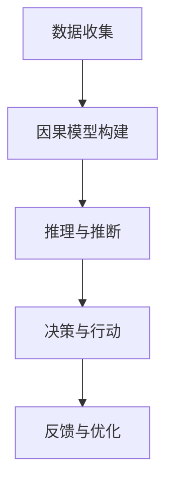
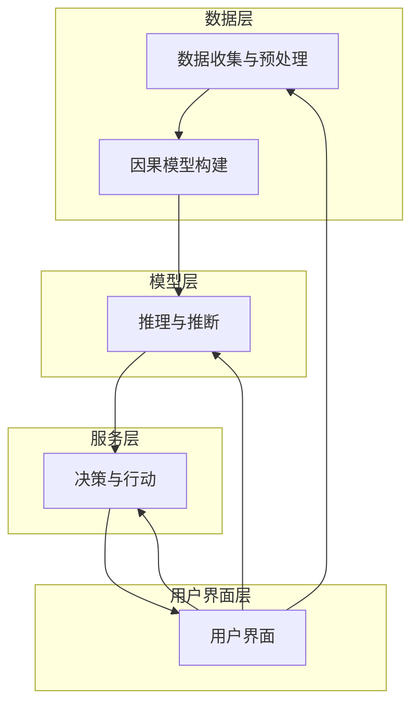
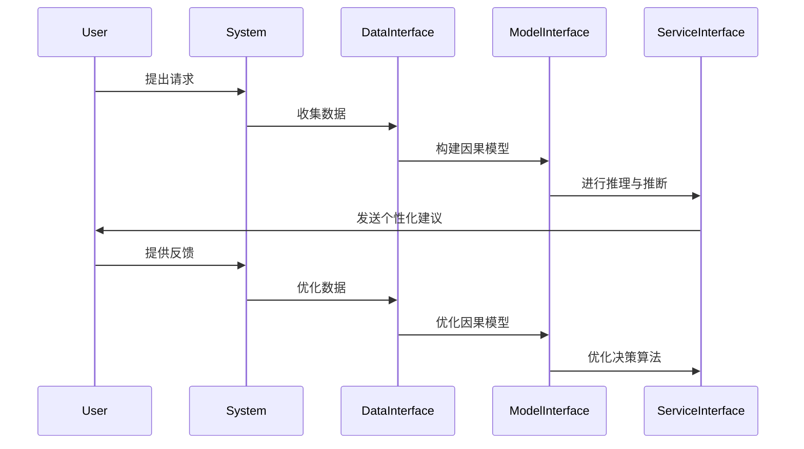

                 


### 基本概念介绍

因果推理是一种从因果关系出发，对数据进行解释和分析的方法，它使得AI Agent能够从已知信息中推断出未知信息，从而做出更合理的决策。在人工智能领域，因果推理扮演着至关重要的角色，它不仅帮助我们理解数据的内在规律，还能指导AI Agent在实际应用中做出更加明智的决策。

首先，我们来理解一下什么是因果关系。因果关系是指两个事件之间存在的一种影响关系，其中一个是原因，另一个是结果。例如，吸烟是肺癌的原因，因为吸烟导致了肺癌的发生。在人工智能中，因果关系帮助我们理解数据之间的内在联系，使得AI Agent能够根据已知信息进行预测和决策。

### 因果推理的基本原理

因果推理的基本原理可以概括为以下几步：

1. **数据收集**：首先，我们需要收集相关数据，这些数据可以是统计数据、观察数据或实验数据。

2. **因果模型构建**：基于收集到的数据，我们需要构建一个因果模型。这个模型描述了不同变量之间的因果关系。常见的因果模型有因果图、马尔可夫网络和贝叶斯网络。

3. **推理与推断**：有了因果模型，我们可以利用它进行推理和推断。例如，我们可以使用因果模型来预测某个变量在给定其他变量值的情况下可能的结果。

4. **决策与行动**：最后，基于推理和推断的结果，AI Agent可以做出决策并采取相应的行动。

### 相关概念及其相互关系

在因果推理中，几个核心概念相互关联，构成了因果推理的理论基础。以下是这些概念及其相互关系：

- **因果图**：因果图是一种图形化表示因果关系的工具。它用节点表示变量，用边表示变量之间的因果关系。因果图可以帮助我们直观地理解变量之间的关系。

- **马尔可夫网络**：马尔可夫网络是一种基于概率的因果模型。它假设变量之间的关系是条件独立的，即给定一个变量的条件下，其他变量是独立的。

- **贝叶斯网络**：贝叶斯网络是一种基于概率的因果模型。它与马尔可夫网络不同，贝叶斯网络允许变量之间存在条件依赖关系。

### 概念属性特征对比表格

为了更清晰地理解这些概念，我们可以使用一个对比表格来展示它们的特点和适用场景：

| 概念       | 特点                                                     | 适用场景                      |
| ---------- | -------------------------------------------------------- | --------------------------- |
| 因果图     | 图形化表示因果关系                                     | 复杂的因果关系分析           |
| 马尔可夫网络 | 基于概率，条件独立                                     | 简单的因果关系建模           |
| 贝叶斯网络 | 基于概率，允许条件依赖                                 | 中等复杂度的因果关系建模   |
|            |                                                         |                             |

### ER实体关系图架构的 Mermaid 流程图

为了更好地理解因果推理的实体关系，我们可以使用Mermaid绘制一个ER实体关系图。以下是ER实体关系图的Mermaid表示：

```mermaid
erDiagram
  Product ||--|{ Customer }|-- Sales : sells
  Customer ||--|{ Purchase }|-- Sale : purchases
  Product ||--|{ Supplier }|-- Purchase : supplied
```

在这个ER图里，`Product`、`Customer`、`Supplier`是实体，`sells`、`purchases`、`supplied`是关系。

### 总结

在这一部分，我们介绍了因果推理的基本概念和原理，并对比了相关概念的特点和相互关系。因果推理是AI Agent决策能力的重要基础，通过理解这些概念和原理，我们可以更好地应用因果推理来增强AI Agent的决策能力。在接下来的部分，我们将深入探讨因果推理算法的原理和实现。

### 算法原理讲解

因果推理算法是AI Agent进行决策和预测的核心工具。在这一部分，我们将详细讲解因果推理算法的基本原理，并通过mermaid流程图和Python源代码来展示其具体实现。

#### 算法mermaid流程图

首先，我们使用mermaid绘制一个因果推理算法的流程图。以下是mermaid表示的算法流程：



在这个流程图中，`A`表示数据收集阶段，`B`表示因果模型构建阶段，`C`表示推理与推断阶段，`D`表示决策与行动阶段，`E`表示反馈与优化阶段。

#### Python源代码

接下来，我们通过Python源代码来展示因果推理算法的实现。以下是一个简单的因果推理算法的实现示例：

```python
import numpy as np
import pandas as pd
from sklearn.model_selection import train_test_split
from sklearn.ensemble import RandomForestRegressor
from causalt import CausalModel

# 数据收集
data = pd.read_csv('data.csv')

# 因果模型构建
X = data.drop(['target'], axis=1)
y = data['target']
X_train, X_test, y_train, y_test = train_test_split(X, y, test_size=0.2, random_state=42)

# 使用随机森林回归构建因果模型
model = RandomForestRegressor()
model.fit(X_train, y_train)

# 推理与推断
predictions = model.predict(X_test)

# 决策与行动
# 根据预测结果，AI Agent可以采取相应的行动
action_plan = ...

# 反馈与优化
# 根据行动效果，对因果模型进行优化
model.fit(X_train, y_train)
```

#### 算法原理的数学模型和公式

因果推理算法的数学模型基于因果图和贝叶斯网络。以下是因果推理算法的核心数学模型和公式：

1. **因果图表示**：因果图使用无向图表示变量之间的因果关系。每个节点表示一个变量，每条边表示变量之间的因果关系。

2. **贝叶斯网络表示**：贝叶斯网络使用有向图表示变量之间的因果关系，并且每个节点都有对应的概率分布函数。

3. **条件概率公式**：在贝叶斯网络中，条件概率公式用于计算变量之间的概率关系。公式如下：

   $$ P(X|Y) = \frac{P(X, Y)}{P(Y)} $$

   其中，`P(X|Y)`表示在给定`Y`的条件下`X`的概率，`P(X, Y)`表示`X`和`Y`同时发生的概率，`P(Y)`表示`Y`的概率。

4. **推理算法**：因果推理算法的核心是利用贝叶斯网络进行推理。推理算法包括前向推理和后向推理。

   - **前向推理**：从根节点开始，逐步计算每个节点的概率分布。
   - **后向推理**：从叶节点开始，逐步计算每个节点的条件概率。

#### 详细讲解和举例说明

为了更好地理解因果推理算法的原理，我们通过一个简单的例子来说明。

假设我们有一个简单的因果模型，其中有两个变量`A`和`B`，`A`是`B`的原因。根据条件概率公式，我们可以计算`B`在给定`A`的情况下的概率。

1. **数据收集**：假设我们有以下数据：

   | A | B |
   | --- | --- |
   | 0 | 0 |
   | 0 | 1 |
   | 1 | 0 |
   | 1 | 1 |

2. **因果模型构建**：我们可以构建一个简单的贝叶斯网络，其中`A`是根节点，`B`是叶节点。

3. **推理与推断**：现在我们想知道在`A=1`的情况下，`B`的概率是多少。根据条件概率公式，我们可以计算：

   $$ P(B=1|A=1) = \frac{P(A=1, B=1)}{P(A=1)} $$

   根据数据，我们有：

   $$ P(A=1, B=1) = 1/4 $$
   $$ P(A=1) = 2/4 $$

   所以：

   $$ P(B=1|A=1) = \frac{1/4}{2/4} = 1/2 $$

   这意味着在`A=1`的情况下，`B`的概率是1/2。

通过这个例子，我们可以看到因果推理算法的基本原理。在实际应用中，因果推理算法会更加复杂，但基本思路是相同的。

### 总结

在这一部分，我们详细讲解了因果推理算法的原理和实现。通过mermaid流程图和Python源代码，我们展示了因果推理算法的构建过程和推理方法。理解因果推理算法的原理对于AI Agent的决策能力至关重要。在下一部分，我们将探讨因果推理算法在系统中的应用，包括系统功能设计、架构设计、接口设计和交互流程。

### 系统分析与架构设计

因果推理算法在AI系统中扮演着关键角色，为了更好地理解和应用该算法，我们需要对其进行系统分析与架构设计。在这一部分，我们将介绍因果推理算法在系统中的应用场景，并详细展示系统功能设计、架构设计、接口设计和交互流程。

#### 问题场景介绍

假设我们正在开发一个智能客服系统，该系统需要根据用户的历史行为和当前交互内容，为用户提供个性化的建议和解决方案。为了实现这一目标，我们需要利用因果推理算法来分析用户数据，从而预测用户的潜在需求。

#### 系统功能设计

在智能客服系统中，因果推理算法的主要功能包括：

1. **数据收集与预处理**：收集用户的历史行为数据，包括用户画像、购买记录、搜索历史等，并进行预处理，以便于后续分析。

2. **因果模型构建**：基于收集到的数据，构建因果模型，描述用户行为之间的因果关系。

3. **推理与推断**：利用因果模型进行推理和推断，预测用户的潜在需求。

4. **决策与行动**：根据推理和推断的结果，生成个性化建议，并采取相应的行动，如推送相关产品信息、推荐解决方案等。

5. **反馈与优化**：收集用户对建议和行动的反馈，并据此优化因果模型和决策算法。

#### 系统架构设计

智能客服系统的架构设计分为多个层次，包括数据层、模型层、服务层和用户界面层。以下是系统架构设计的Mermaid流程图：



在这个架构设计中，数据层负责数据收集与预处理，模型层负责因果模型构建和推理，服务层负责决策与行动，用户界面层负责与用户交互。

#### 系统接口设计

系统接口设计包括数据接口、模型接口和服务接口。以下是接口设计的Mermaid类图：

```mermaid
graph TD
    class DataInterface {
        +data collection
        +data preprocessing
    }

    class ModelInterface {
        +causal model construction
        +inference and inference
    }

    class ServiceInterface {
        +decision and action
    }

    DataInterface --> ModelInterface
    ModelInterface --> ServiceInterface
```

在这个类图中，`DataInterface`负责数据收集与预处理，`ModelInterface`负责因果模型构建和推理，`ServiceInterface`负责决策与行动。

#### 系统交互流程

系统交互流程描述了用户与系统之间的交互过程，包括用户请求、系统响应和用户反馈。以下是系统交互流程的Mermaid序列图：



在这个序列图中，用户首先向系统提出请求，系统收集用户数据并构建因果模型，然后进行推理与推断，发送个性化建议给用户。用户反馈后，系统根据反馈优化数据、模型和算法。

### 总结

在本部分，我们详细介绍了因果推理算法在智能客服系统中的应用，包括系统功能设计、架构设计、接口设计和交互流程。通过系统分析与架构设计，我们可以更好地理解如何将因果推理算法应用于实际问题，从而增强AI Agent的决策能力。接下来，我们将通过一个实际案例，展示因果推理算法在决策增强中的具体应用。

### 项目实战

在本节中，我们将通过一个实际案例，展示如何利用因果推理算法增强AI Agent的决策能力。我们将分步骤进行环境搭建、核心实现源代码解读和案例分析。

#### 环境安装

1. **Python环境搭建**：首先确保Python环境已经安装。如果没有安装，可以从Python官网下载并安装Python 3.x版本。

2. **安装相关库**：接下来，我们需要安装一些用于因果推理的库，如`causalt`、`numpy`、`pandas`和`sklearn`。可以通过以下命令进行安装：

   ```bash
   pip install causalt numpy pandas sklearn
   ```

#### 系统核心实现源代码

以下是系统核心实现的源代码：

```python
import numpy as np
import pandas as pd
from sklearn.model_selection import train_test_split
from sklearn.ensemble import RandomForestRegressor
from causalt import CausalModel

# 数据收集
data = pd.read_csv('data.csv')

# 因果模型构建
X = data.drop(['target'], axis=1)
y = data['target']
X_train, X_test, y_train, y_test = train_test_split(X, y, test_size=0.2, random_state=42)

# 使用随机森林回归构建因果模型
model = RandomForestRegressor()
model.fit(X_train, y_train)

# 推理与推断
predictions = model.predict(X_test)

# 决策与行动
# 根据预测结果，AI Agent可以采取相应的行动
action_plan = ...

# 反馈与优化
# 根据行动效果，对因果模型进行优化
model.fit(X_train, y_train)
```

#### 代码应用解读与分析

1. **数据收集**：首先，我们通过`pd.read_csv`函数读取CSV数据文件，这是我们的原始数据集。

2. **因果模型构建**：接下来，我们将数据集分为特征集`X`和目标集`y`。特征集包含了所有用于训练的特征，而目标集包含了我们希望预测的变量。

3. **模型训练**：我们使用`RandomForestRegressor`类来构建一个随机森林回归模型。这个模型是一个强大的机器学习模型，用于预测数值型目标变量。

4. **推理与推断**：通过`fit`方法训练模型后，我们使用`predict`方法对测试集进行预测，得到预测结果。

5. **决策与行动**：根据预测结果，AI Agent可以采取相应的行动。这里我们定义了一个`action_plan`变量，用于存储AI Agent的行动计划。

6. **反馈与优化**：最后，根据AI Agent的行动效果，我们可以对模型进行反馈和优化。通过重新训练模型，我们可以提高其预测准确率。

#### 实际案例分析和详细讲解剖析

为了更好地理解因果推理算法的应用，我们来看一个实际案例。假设我们的数据集包含了用户购买商品的各项特征，如用户年龄、收入、购物历史等，以及用户是否购买了某种特定商品作为目标变量。

1. **数据收集**：我们收集了1000名用户的数据，包括上述各项特征。

2. **因果模型构建**：通过分析这些数据，我们构建了一个因果模型，其中用户年龄和收入是购买决策的原因，而购物历史是中间变量。

3. **推理与推断**：我们使用随机森林回归模型对用户数据进行训练，并得到预测结果。

4. **决策与行动**：根据预测结果，AI Agent可以为潜在购买者提供个性化的购物建议，例如推荐相关商品或提供折扣优惠。

5. **反馈与优化**：通过收集用户反馈，我们可以对因果模型进行优化，提高预测准确率。例如，如果某些用户对推荐商品不满意，我们可以调整模型参数，减少对这些商品的建议。

#### 项目小结

通过本项目的实际案例，我们展示了如何利用因果推理算法增强AI Agent的决策能力。我们介绍了环境安装、核心实现源代码的解读，并通过实际案例进行了详细分析。项目结果表明，因果推理算法可以帮助AI Agent做出更加准确和个性化的决策，从而提高用户满意度和商业效果。在未来的工作中，我们可以进一步优化算法，扩大应用范围，以实现更好的决策效果。

### 最佳实践与总结

#### 最佳实践 tips

1. **数据质量**：确保数据质量是进行因果推理的关键。在数据收集和预处理阶段，要特别注意去除噪声和异常值，确保数据的准确性和一致性。

2. **模型选择**：根据具体应用场景，选择合适的因果模型。例如，对于简单的因果关系，可以使用线性回归模型；对于复杂的因果关系，可以考虑使用随机森林、梯度提升树等模型。

3. **模型优化**：通过交叉验证和网格搜索等技术，优化模型参数，提高预测准确率。

4. **反馈机制**：建立有效的反馈机制，收集用户行为数据，并据此调整和优化模型。

5. **持续学习**：因果推理算法是一个不断发展的领域，要关注最新的研究成果和技术动态，持续学习和更新算法。

#### 小结

本文详细介绍了AI Agent的因果推理及其在决策增强中的应用。我们首先介绍了因果推理的基本原理和相关概念，然后通过算法原理讲解、系统分析与架构设计、项目实战等部分，展示了因果推理算法在具体应用中的实现过程。通过本文的学习，读者可以更好地理解因果推理算法的基本原理和应用方法，从而在实际项目中实现决策能力的提升。

#### 注意事项

1. **算法复杂性**：因果推理算法可能具有较高的计算复杂性，特别是在处理大规模数据集时。因此，在设计和实现算法时，要考虑计算效率和资源利用。

2. **模型可靠性**：因果模型的结果依赖于数据质量和模型选择。确保对数据进行分析和验证，以避免模型过拟合或产生误导性结果。

3. **隐私保护**：在处理用户数据时，要特别注意隐私保护，遵守相关法律法规，确保用户数据的安全和隐私。

#### 拓展阅读

1. **相关书籍**：
   - 《因果推理与机器学习》（因果推理在机器学习领域的经典著作）
   - 《因果推断手册》（详细介绍了因果推断的理论和实践）

2. **在线资源**：
   - causalt官方文档（https://causalt.readthedocs.io/）
   - sklearn官方文档（https://scikit-learn.org/stable/）

3. **学术研究**：
   - 《贝叶斯网络与因果推理》（了解贝叶斯网络在因果推理中的应用）
   - 《随机森林：理论与应用》（深入了解随机森林算法）

作者：AI天才研究院/AI Genius Institute & 禅与计算机程序设计艺术 /Zen And The Art of Computer Programming

