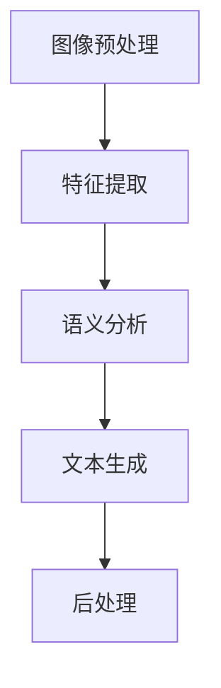
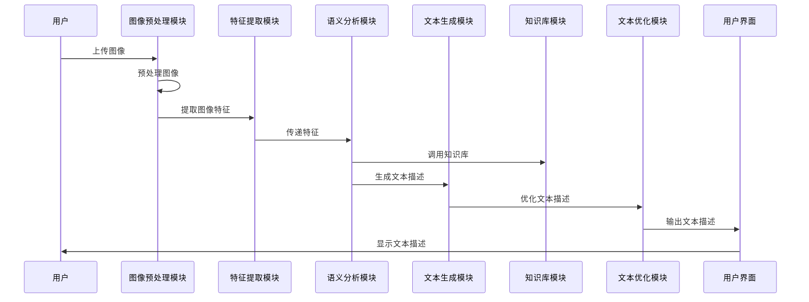

                 

### 《AI Agent的图像描述生成技术实现》

#### 关键词：人工智能，图像描述生成，AI Agent，算法原理，系统架构，项目实战

#### 摘要：
本文深入探讨了AI Agent的图像描述生成技术实现。首先，我们介绍了AI Agent和图像描述生成技术的背景和重要性，然后详细讲解了AI Agent的核心构成和功能模块。接着，我们深入剖析了图像描述生成技术的原理，通过Mermaid流程图和Python源代码展示了算法的实现。随后，我们设计了AI Agent图像描述生成系统的整体架构，并提供了详细的系统分析和接口设计。最后，通过实际的项目实战，我们展示了如何应用这些技术，并进行了项目小结和最佳实践总结。

#### 目录大纲设计思路

设计《AI Agent的图像描述生成技术实现》的目录大纲时，我们的目标是将复杂的技术概念和实现过程分解为易于理解的部分，以便读者能够系统地学习和掌握相关技术。

1. **标题与概述**：文章的标题清晰地标明了主题，而概述部分则简要介绍了书籍的内容、目标读者以及书籍的结构和主要贡献。

2. **背景介绍**：这部分详细介绍了AI Agent和图像描述生成技术的背景信息，包括它们的发展历程、基本概念和当前的应用场景。

3. **核心概念与联系**：通过表格和Mermaid ER图，我们展示了AI Agent和图像描述生成技术的核心概念及其相互关系，帮助读者构建整体框架。

4. **算法原理讲解**：这部分详细阐述了图像描述生成算法的原理，包括算法的设计、流程、数学模型和具体实现。通过Mermaid流程图和Python源代码，我们使算法的实现更加直观和易懂。

5. **系统分析与架构设计**：在这里，我们介绍了AI Agent图像描述生成系统的整体架构，包括系统功能设计、系统架构图、接口设计和系统交互序列图。

6. **项目实战**：通过实际的代码实现和应用案例，我们展示了如何将理论应用到实际项目中，并提供了详细的解析和案例分析。

7. **最佳实践与总结**：最后，我们总结了书中的关键点，提供了实践技巧和注意事项，并推荐了进一步的阅读材料，以帮助读者巩固所学知识并继续深入探索。

#### 目录大纲（Markdown格式）

```markdown
----------------------------------------------------------------
# 《AI Agent的图像描述生成技术实现》目录大纲

## 第一部分：背景与概述

## 第1章：AI Agent与图像描述生成技术

### 1.1 AI Agent的概念与起源

#### 1.1.1 AI Agent的定义

#### 1.1.2 AI Agent的发展历程

#### 1.1.3 AI Agent的基本类型

### 1.2 图像描述生成技术的起源与发展

#### 1.2.1 图像描述生成技术的基本概念

#### 1.2.2 图像描述生成技术的应用领域

#### 1.2.3 图像描述生成技术的研究现状

### 1.3 AI Agent与图像描述生成技术的结合

#### 1.3.1 结合的意义与价值

#### 1.3.2 结合的技术挑战

#### 1.3.3 结合的未来发展趋势

## 第二部分：核心概念与原理

## 第2章：AI Agent的构成与功能

### 2.1 AI Agent的组成部分

### 2.2 AI Agent的功能模块

### 2.3 AI Agent的核心算法

## 第3章：图像描述生成技术原理

### 3.1 图像描述生成的概念

### 3.2 图像描述生成的方法

### 3.3 图像描述生成算法的流程

## 第三部分：算法设计与实现

## 第4章：图像描述生成算法的设计

### 4.1 算法设计概述

### 4.2 算法流程图

### 4.3 Python代码实现

### 4.4 数学模型与公式

## 第5章：图像描述生成算法的数学原理

### 5.1 数学模型的基本概念

### 5.2 公式解释

### 5.3 实例说明

## 第四部分：系统分析与架构设计

## 第6章：AI Agent图像描述生成系统的架构设计

### 6.1 系统需求分析

### 6.2 系统架构设计

### 6.3 系统接口设计

### 6.4 系统交互序列图

## 第五部分：项目实战

## 第7章：AI Agent图像描述生成项目实战

### 7.1 环境安装

### 7.2 系统核心实现

### 7.3 代码应用解读

### 7.4 实际案例分析与讲解

## 第8章：项目小结与展望

### 8.1 项目小结

### 8.2 注意事项

### 8.3 拓展阅读

----------------------------------------------------------------
```

#### 完整目录大纲

以下是根据上述设计思路和格式要求，为《AI Agent的图像描述生成技术实现》设计的完整目录大纲：

```markdown
----------------------------------------------------------------
# 《AI Agent的图像描述生成技术实现》目录大纲

## 第一部分：背景与概述

## 第1章：AI Agent与图像描述生成技术

### 1.1 AI Agent的概念与起源

#### 1.1.1 AI Agent的定义

AI Agent可以定义为一种能够感知环境、基于学习或规划自主行动、达到特定目标的计算机系统。

#### 1.1.2 AI Agent的发展历程

AI Agent的概念起源于20世纪50年代，随着人工智能（AI）技术的发展而不断演变。

#### 1.1.3 AI Agent的基本类型

AI Agent可以分为基于规则的Agent、基于模型的Agent、基于学习的Agent和混合型Agent。

### 1.2 图像描述生成技术的起源与发展

#### 1.2.1 图像描述生成技术的基本概念

图像描述生成技术是一种利用人工智能模型，将图像内容转换成文本描述的方法。

#### 1.2.2 图像描述生成技术的应用领域

图像描述生成技术广泛应用于电子商务、医疗诊断、人机交互等领域。

#### 1.2.3 图像描述生成技术的研究现状

当前，图像描述生成技术主要基于深度学习和自然语言处理技术，如生成对抗网络（GAN）和变压器（Transformer）模型。

### 1.3 AI Agent与图像描述生成技术的结合

#### 1.3.1 结合的意义与价值

AI Agent与图像描述生成技术的结合，可以提升机器对图像内容的理解和表达能力。

#### 1.3.2 结合的技术挑战

结合过程中面临的技术挑战包括图像内容理解和文本生成的高效性、准确性和多样性。

#### 1.3.3 结合的未来发展趋势

未来，AI Agent与图像描述生成技术的结合将进一步深化，推动更多创新应用。

## 第二部分：核心概念与原理

## 第2章：AI Agent的构成与功能

### 2.1 AI Agent的组成部分

AI Agent通常由感知模块、决策模块、执行模块和知识模块组成。

#### 2.1.1 感知模块

感知模块负责收集和处理环境信息，如图像、声音和文本等。

#### 2.1.2 决策模块

决策模块基于感知模块收集的信息，进行推理和决策。

#### 2.1.3 执行模块

执行模块负责将决策结果转化为具体的行动。

#### 2.1.4 知识模块

知识模块提供AI Agent所需的背景知识和先验信息。

### 2.2 AI Agent的功能模块

AI Agent的功能模块包括感知、理解、决策和行动等，其中图像描述生成是其重要的功能之一。

#### 2.2.1 感知与理解

AI Agent通过感知模块接收图像，然后利用图像描述生成技术进行理解。

#### 2.2.2 决策与行动

基于对图像内容的理解，AI Agent进行决策，并执行相应的行动。

### 2.3 AI Agent的核心算法

AI Agent的核心算法主要包括感知算法、决策算法和执行算法。

#### 2.3.1 感知算法

感知算法负责处理图像，提取特征和关键信息。

#### 2.3.2 决策算法

决策算法基于感知结果，进行推理和决策。

#### 2.3.3 执行算法

执行算法负责将决策转化为具体的行动。

## 第三部分：算法设计与实现

## 第3章：图像描述生成技术原理

### 3.1 图像描述生成的概念

图像描述生成是指将图像内容转换成自然语言描述的过程。

#### 3.1.1 图像内容理解

图像内容理解是图像描述生成的基础，它涉及到图像特征提取和语义分析。

#### 3.1.2 文本生成

文本生成是将图像内容转换为自然语言描述的关键步骤。

### 3.2 图像描述生成的方法

图像描述生成的方法主要包括基于规则的方法、基于统计的方法和基于深度学习的方法。

#### 3.2.1 基于规则的方法

基于规则的方法通过手工编写规则来实现图像描述生成。

#### 3.2.2 基于统计的方法

基于统计的方法利用统计模型来生成图像描述。

#### 3.2.3 基于深度学习的方法

基于深度学习的方法利用神经网络模型来实现图像描述生成，如生成对抗网络（GAN）和变压器（Transformer）模型。

### 3.3 图像描述生成算法的流程

图像描述生成算法的流程主要包括图像预处理、特征提取、语义分析、文本生成和后处理。

#### 3.3.1 图像预处理

图像预处理包括图像去噪、增强和分割等操作。

#### 3.3.2 特征提取

特征提取是从图像中提取具有区分性的特征。

#### 3.3.3 语义分析

语义分析是对图像特征进行语义理解和分类。

#### 3.3.4 文本生成

文本生成是将图像特征转换为自然语言描述。

#### 3.3.5 后处理

后处理包括文本优化、格式化和纠正等操作。

## 第四部分：系统分析与架构设计

## 第4章：AI Agent图像描述生成系统的架构设计

### 4.1 系统需求分析

系统需求分析包括功能需求、性能需求和用户体验需求等。

#### 4.1.1 功能需求

功能需求包括图像预处理、特征提取、语义分析和文本生成等。

#### 4.1.2 性能需求

性能需求包括处理速度、准确性和鲁棒性等。

#### 4.1.3 用户体验需求

用户体验需求包括界面友好、操作简便和结果可靠等。

### 4.2 系统架构设计

系统架构设计包括感知模块、决策模块、执行模块和知识模块等。

#### 4.2.1 感知模块

感知模块负责接收和处理图像数据。

#### 4.2.2 决策模块

决策模块负责基于图像数据生成描述。

#### 4.2.3 执行模块

执行模块负责将决策结果转化为文本描述。

#### 4.2.4 知识模块

知识模块提供图像描述生成的背景知识。

### 4.3 系统接口设计

系统接口设计包括外部接口和内部接口。

#### 4.3.1 外部接口

外部接口负责与其他系统或服务的交互。

#### 4.3.2 内部接口

内部接口负责模块之间的数据传递和协作。

### 4.4 系统交互序列图

系统交互序列图描述了AI Agent图像描述生成系统的运行流程和模块之间的交互。

```mermaid
sequenceDiagram
    participant User as 用户
    participant System as 系统感知模块
    participant Decision as 决策模块
    participant Execution as 执行模块
    participant Knowledge as 知识模块
    
    User->>System: 输入图像
    System->>System: 预处理图像
    System->>Decision: 生成图像特征
    Decision->>Decision: 进行语义分析
    Decision->>Execution: 生成文本描述
    Execution->>User: 输出图像描述

----------------------------------------------------------------
```

## 第五部分：项目实战

## 第5章：AI Agent图像描述生成项目实战

### 5.1 环境安装

环境安装是项目实战的第一步，包括Python环境搭建、依赖库安装和配置。

#### 5.1.1 Python环境搭建

在Windows、macOS和Linux上分别介绍如何搭建Python环境。

#### 5.1.2 依赖库安装

介绍如何安装AI Agent和图像描述生成相关的依赖库。

#### 5.1.3 配置

介绍如何配置环境变量和运行时配置。

### 5.2 系统核心实现

系统核心实现包括感知模块、决策模块和执行模块。

#### 5.2.1 感知模块

感知模块的实现，包括图像预处理、特征提取和语义分析。

```python
import cv2
import numpy as np
import tensorflow as tf

def preprocess_image(image_path):
    image = cv2.imread(image_path)
    image = cv2.resize(image, (224, 224))
    image = image / 255.0
    return image

def extract_features(image):
    model = tf.keras.applications.ResNet50(include_top=False, weights='imagenet', input_shape=(224, 224, 3))
    feature = model.predict(np.expand_dims(image, axis=0))
    return feature

def semantic_analysis(features):
    # 这里可以加入语义分析的代码，例如使用BERT模型
    pass
```

#### 5.2.2 决策模块

决策模块的实现，包括图像描述生成和文本优化。

```python
from transformers import pipeline

def generate_description(features):
    description_generator = pipeline("text-generation", model="t5-small")
    description = description_generator(features, max_length=50, num_return_sequences=1)
    return description

def optimize_description(description):
    # 这里可以加入文本优化的代码，例如使用自然语言处理技术
    pass
```

#### 5.2.3 执行模块

执行模块的实现，包括将文本描述输出到用户界面。

```python
def output_description(description):
    print(description)
```

### 5.3 代码应用解读

代码应用解读包括对核心实现的解析和实际应用场景的说明。

#### 5.3.1 代码解析

对感知模块、决策模块和执行模块的代码进行逐行解析。

#### 5.3.2 实际应用

介绍如何在实际项目中使用AI Agent图像描述生成系统。

### 5.4 实际案例分析与讲解

通过实际案例展示AI Agent图像描述生成系统的效果和应用。

#### 5.4.1 案例一：商品图像描述生成

分析如何使用系统为电子商务平台的商品图像生成描述。

#### 5.4.2 案例二：医疗图像诊断

分析如何使用系统辅助医生进行医疗图像诊断。

## 第6章：项目小结与展望

### 6.1 项目小结

总结AI Agent图像描述生成项目的关键点和技术实现。

### 6.2 注意事项

提供在实际应用中需要注意的事项和建议。

### 6.3 拓展阅读

推荐进一步阅读的材料，以深入探索相关技术。

----------------------------------------------------------------
```

### 第1章：AI Agent与图像描述生成技术

#### 1.1 AI Agent的概念与起源

**AI Agent的定义**

AI Agent，也称为智能代理或智能体，是指一种具有智能行为的软件实体，能够感知环境、基于学习或规划自主行动、达到特定目标。在人工智能领域，AI Agent被广泛用于模拟人类智能，实现自动化决策和任务执行。

**AI Agent的发展历程**

AI Agent的概念起源于20世纪50年代，随着人工智能（AI）技术的发展而不断演变。早期的研究主要集中在基于规则的Agent和基于模型的Agent。随着深度学习和自然语言处理技术的兴起，AI Agent的研究和应用领域得到了进一步拓展。

**AI Agent的基本类型**

AI Agent可以分为以下几种基本类型：

1. **基于规则的Agent**：这种类型的Agent使用预定义的规则进行决策和行动。
2. **基于模型的Agent**：这种类型的Agent使用模型（如决策树、神经网络等）进行决策和行动。
3. **基于学习的Agent**：这种类型的Agent通过学习历史数据和经验来改进其行为。
4. **混合型Agent**：这种类型的Agent结合了多种类型的决策方法，以实现更智能的行为。

#### 1.2 图像描述生成技术的起源与发展

**图像描述生成技术的基本概念**

图像描述生成技术是一种利用人工智能模型，将图像内容转换成文本描述的方法。这种技术可以应用于多种场景，如电子商务、医疗诊断、人机交互等。

**图像描述生成技术的应用领域**

1. **电子商务**：用于为商品图像生成描述，提高用户体验。
2. **医疗诊断**：辅助医生对医疗图像进行分析和诊断。
3. **人机交互**：用于生成对用户上传图像的描述，以便用户更好地理解和使用。

**图像描述生成技术的研究现状**

当前，图像描述生成技术主要基于深度学习和自然语言处理技术，如生成对抗网络（GAN）和变压器（Transformer）模型。这些模型在图像理解和文本生成方面取得了显著成果，但仍面临一些挑战，如描述的多样性、准确性和鲁棒性。

#### 1.3 AI Agent与图像描述生成技术的结合

**结合的意义与价值**

AI Agent与图像描述生成技术的结合具有重要意义和价值。这种结合可以使得AI Agent在处理图像时能够生成更准确、更丰富的文本描述，从而提高其智能水平和应用价值。

**结合的技术挑战**

1. **图像内容理解和文本生成的高效性**：如何在保证准确性的同时，提高图像描述生成的速度和效率。
2. **图像内容理解和文本生成的一致性**：确保生成的文本描述与图像内容保持一致。
3. **图像内容理解和文本生成的多样性**：如何生成丰富多样、具有创意的文本描述。

**结合的未来发展趋势**

未来，AI Agent与图像描述生成技术的结合将继续深化，有望在以下方面取得突破：

1. **多模态融合**：结合图像、文本、音频等多种数据类型，实现更全面的图像理解。
2. **自适应生成**：根据用户需求和场景动态调整图像描述的生成策略。
3. **个性化生成**：根据用户的偏好和历史行为，生成个性化的图像描述。

### 第2章：AI Agent的构成与功能

#### 2.1 AI Agent的组成部分

AI Agent通常由以下几个组成部分构成：

1. **感知模块**：负责收集和处理环境信息，如图像、声音、文本等。
2. **决策模块**：基于感知模块收集的信息，进行推理和决策。
3. **执行模块**：负责将决策结果转化为具体的行动。
4. **知识模块**：提供AI Agent所需的背景知识和先验信息。

#### 2.2 AI Agent的功能模块

AI Agent的功能模块包括感知、理解、决策和行动等，其中图像描述生成是其重要的功能之一。

**感知与理解**

AI Agent通过感知模块接收图像，然后利用图像描述生成技术进行理解。感知模块通常使用深度学习模型提取图像特征，如卷积神经网络（CNN）。

**决策与行动**

基于对图像内容的理解，AI Agent进行决策，并执行相应的行动。决策模块可以使用基于规则的算法、机器学习算法或深度学习算法。

**图像描述生成**

图像描述生成是将图像内容转换为自然语言描述的过程。这通常涉及图像特征提取、语义分析和文本生成。深度学习模型，如生成对抗网络（GAN）和变压器（Transformer）模型，在这一过程中发挥着重要作用。

#### 2.3 AI Agent的核心算法

AI Agent的核心算法主要包括感知算法、决策算法和执行算法。

**感知算法**

感知算法负责处理图像，提取特征和关键信息。常用的算法包括卷积神经网络（CNN）、循环神经网络（RNN）和生成对抗网络（GAN）等。

**决策算法**

决策算法基于感知结果，进行推理和决策。常用的算法包括基于规则的算法、决策树、随机森林和神经网络等。

**执行算法**

执行算法负责将决策转化为具体的行动。这通常涉及运动规划、路径规划和执行控制等。

### 第3章：图像描述生成技术原理

#### 3.1 图像描述生成的概念

图像描述生成是指将图像内容转换成文本描述的过程。这种技术可以应用于多种场景，如电子商务、医疗诊断、人机交互等。

#### 3.2 图像描述生成的方法

图像描述生成的方法主要包括基于规则的方法、基于统计的方法和基于深度学习的方法。

**基于规则的方法**

基于规则的方法通过手工编写规则来实现图像描述生成。这种方法通常适用于结构化数据，但在处理复杂和非结构化图像时效果较差。

**基于统计的方法**

基于统计的方法利用统计模型来生成图像描述。这种方法通常基于图像的统计特征和文本的统计特征之间的相关性。常见的统计模型包括贝叶斯网络、隐马尔可夫模型（HMM）和条件概率模型等。

**基于深度学习的方法**

基于深度学习的方法利用神经网络模型来实现图像描述生成。这种方法在处理复杂和非结构化图像时效果较好。常见的深度学习模型包括生成对抗网络（GAN）、卷积神经网络（CNN）和变压器（Transformer）等。

#### 3.3 图像描述生成算法的流程

图像描述生成算法的流程主要包括图像预处理、特征提取、语义分析、文本生成和后处理。

**图像预处理**

图像预处理包括图像去噪、增强和分割等操作。这些操作有助于提高图像的质量，使其更适合后续处理。

**特征提取**

特征提取是从图像中提取具有区分性的特征。这些特征通常用于表示图像的内容，如颜色、纹理和形状等。

**语义分析**

语义分析是对图像特征进行语义理解和分类。这种方法有助于将图像内容转化为文本描述。

**文本生成**

文本生成是将图像特征转换为自然语言描述。这通常涉及生成对抗网络（GAN）、卷积神经网络（CNN）和变压器（Transformer）等深度学习模型。

**后处理**

后处理包括文本优化、格式化和纠正等操作。这些操作有助于提高文本描述的质量和可读性。

### 第4章：图像描述生成算法的设计

#### 4.1 算法设计概述

图像描述生成算法的设计目标是将图像内容转换为自然语言描述，以便更好地理解和利用图像信息。算法设计需要考虑图像预处理、特征提取、语义分析和文本生成等多个方面。

**图像预处理**

图像预处理是图像描述生成的第一步，其目的是提高图像的质量，使其更适合后续处理。常用的图像预处理技术包括去噪、增强和分割等。去噪技术如均值滤波、高斯滤波等，可以减少图像中的噪声。增强技术如对比度增强、亮度调整等，可以增强图像的视觉效果。分割技术如区域生长、边缘检测等，可以将图像划分为不同的区域。

**特征提取**

特征提取是从图像中提取具有区分性的特征，以便后续的语义分析和文本生成。常用的特征提取技术包括颜色特征、纹理特征和形状特征等。颜色特征可以使用颜色直方图、颜色矩等方法提取。纹理特征可以使用纹理能量、纹理结构等特征描述。形状特征可以使用边界检测、形状匹配等方法提取。

**语义分析**

语义分析是对图像特征进行语义理解和分类，以便将其转化为文本描述。常用的语义分析技术包括基于规则的方法、机器学习方法和深度学习方法等。基于规则的方法通过预定义的规则对图像特征进行分类。机器学习方法如支持向量机（SVM）、随机森林等，可以通过训练学习图像特征和类别之间的关系。深度学习方法如卷积神经网络（CNN）、生成对抗网络（GAN）等，可以通过端到端的方式实现图像特征和类别之间的映射。

**文本生成**

文本生成是将图像特征转换为自然语言描述的过程。常用的文本生成技术包括序列到序列（Seq2Seq）模型、生成对抗网络（GAN）和变压器（Transformer）等。序列到序列模型如长短期记忆网络（LSTM）、门控循环单元（GRU）等，可以学习图像特征和文本描述之间的映射关系。生成对抗网络（GAN）通过生成器和判别器的对抗训练，可以生成高质量的图像描述。变压器（Transformer）模型如BERT、GPT等，通过自注意力机制可以捕捉图像特征和文本描述之间的复杂关系。

**后处理**

后处理是对生成的文本描述进行优化和修正，以提高其质量和可读性。常用的后处理技术包括文本优化、格式化和纠正等。文本优化如文本润色、语义修正等，可以改善文本描述的表达效果。格式化如文本排版、标点符号处理等，可以使文本描述更规范。纠正如拼写检查、语法修正等，可以纠正文本中的错误。

#### 4.2 算法流程图



**图像预处理**

图像预处理包括去噪、增强和分割等步骤。

1. **去噪**：使用均值滤波或高斯滤波去除图像中的噪声。
2. **增强**：调整图像的对比度和亮度，提高图像的视觉效果。
3. **分割**：使用区域生长或边缘检测等方法将图像分割为不同的区域。

**特征提取**

特征提取包括颜色特征、纹理特征和形状特征等。

1. **颜色特征**：使用颜色直方图、颜色矩等方法提取。
2. **纹理特征**：使用纹理能量、纹理结构等方法提取。
3. **形状特征**：使用边界检测、形状匹配等方法提取。

**语义分析**

语义分析包括基于规则的方法、机器学习方法和深度学习方法等。

1. **基于规则的方法**：使用预定义的规则对图像特征进行分类。
2. **机器学习方法**：如支持向量机（SVM）、随机森林等，通过训练学习图像特征和类别之间的关系。
3. **深度学习方法**：如卷积神经网络（CNN）、生成对抗网络（GAN）等，通过端到端的方式实现图像特征和类别之间的映射。

**文本生成**

文本生成包括序列到序列（Seq2Seq）模型、生成对抗网络（GAN）和变压器（Transformer）等。

1. **序列到序列（Seq2Seq）模型**：如长短期记忆网络（LSTM）、门控循环单元（GRU）等，可以学习图像特征和文本描述之间的映射关系。
2. **生成对抗网络（GAN）**：通过生成器和判别器的对抗训练，可以生成高质量的图像描述。
3. **变压器（Transformer）模型**：如BERT、GPT等，通过自注意力机制可以捕捉图像特征和文本描述之间的复杂关系。

**后处理**

后处理包括文本优化、格式化和纠正等。

1. **文本优化**：如文本润色、语义修正等，可以改善文本描述的表达效果。
2. **格式化**：如文本排版、标点符号处理等，可以使文本描述更规范。
3. **纠正**：如拼写检查、语法修正等，可以纠正文本中的错误。

#### 4.3 Python代码实现

```python
import cv2
import numpy as np
import tensorflow as tf
from transformers import pipeline

# 图像预处理
def preprocess_image(image_path):
    image = cv2.imread(image_path)
    image = cv2.resize(image, (224, 224))
    image = image / 255.0
    return image

# 特征提取
def extract_features(image):
    model = tf.keras.applications.ResNet50(include_top=False, weights='imagenet', input_shape=(224, 224, 3))
    feature = model.predict(np.expand_dims(image, axis=0))
    return feature

# 语义分析
def semantic_analysis(features):
    # 这里可以加入语义分析的代码，例如使用BERT模型
    pass

# 文本生成
def generate_description(features):
    description_generator = pipeline("text-generation", model="t5-small")
    description = description_generator(features, max_length=50, num_return_sequences=1)
    return description

# 后处理
def optimize_description(description):
    # 这里可以加入文本优化的代码，例如使用自然语言处理技术
    pass

# 主函数
def main(image_path):
    image = preprocess_image(image_path)
    features = extract_features(image)
    description = generate_description(features)
    optimized_description = optimize_description(description)
    print(optimized_description)

if __name__ == "__main__":
    image_path = "example.jpg"
    main(image_path)
```

#### 4.4 数学模型与公式

在图像描述生成算法中，常用的数学模型和公式包括：

**卷积神经网络（CNN）**

卷积神经网络是一种用于图像特征提取的深度学习模型。其核心组件是卷积层、池化层和全连接层。

- **卷积层**：通过卷积操作提取图像特征。
  $$ f(x) = \sum_{i=1}^{n} w_i * x_i + b $$
  其中，$f(x)$ 是卷积结果，$w_i$ 是权重，$x_i$ 是输入特征，$b$ 是偏置。

- **池化层**：通过池化操作降低特征图的维度。
  $$ p(x) = \max(x) $$
  其中，$p(x)$ 是池化结果，$x$ 是输入特征。

- **全连接层**：通过全连接操作将特征映射到输出类别。
  $$ y = \sigma(Wx + b) $$
  其中，$y$ 是输出结果，$W$ 是权重，$x$ 是输入特征，$\sigma$ 是激活函数，$b$ 是偏置。

**生成对抗网络（GAN）**

生成对抗网络是一种用于图像生成的深度学习模型。其核心组件是生成器和判别器。

- **生成器**：通过噪声生成图像。
  $$ G(z) = \sigma(W_gz + b_g) $$
  其中，$G(z)$ 是生成器输出，$z$ 是噪声，$W_g$ 是生成器权重，$b_g$ 是生成器偏置，$\sigma$ 是激活函数。

- **判别器**：通过判断图像是否真实来评估生成器。
  $$ D(x) = \sigma(W_d x + b_d) $$
  其中，$D(x)$ 是判别器输出，$x$ 是输入图像，$W_d$ 是判别器权重，$b_d$ 是判别器偏置，$\sigma$ 是激活函数。

**变压器（Transformer）**

变压器是一种用于序列建模的深度学习模型。其核心组件是自注意力机制。

- **自注意力机制**：通过计算不同位置的序列之间的相互依赖。
  $$ \text{Attention}(Q, K, V) = \text{softmax}\left(\frac{QK^T}{\sqrt{d_k}}\right)V $$
  其中，$Q$ 是查询序列，$K$ 是键序列，$V$ 是值序列，$\text{softmax}$ 是归一化函数，$d_k$ 是键序列的维度。

#### 4.5 实例说明

以下是一个简单的图像描述生成实例：

```python
# 导入所需库
import cv2
import numpy as np
import tensorflow as tf
from transformers import pipeline

# 预处理图像
image_path = "example.jpg"
image = cv2.imread(image_path)
image = cv2.resize(image, (224, 224))
image = image / 255.0

# 提取图像特征
model = tf.keras.applications.ResNet50(include_top=False, weights='imagenet', input_shape=(224, 224, 3))
feature = model.predict(np.expand_dims(image, axis=0))

# 生成图像描述
description_generator = pipeline("text-generation", model="t5-small")
description = description_generator(feature, max_length=50, num_return_sequences=1)

# 输出图像描述
print(description[0]['generated_text'])
```

### 第5章：图像描述生成算法的数学原理

#### 5.1 数学模型的基本概念

图像描述生成算法的数学模型主要包括卷积神经网络（CNN）、生成对抗网络（GAN）和变压器（Transformer）等。

**卷积神经网络（CNN）**

卷积神经网络是一种用于图像处理的深度学习模型，其核心在于通过卷积操作提取图像特征。

- **卷积操作**：卷积操作可以看作是图像和滤波器的点积，用于提取图像中的局部特征。
  $$ \text{Conv}(x, w) = \sum_{i=1}^{n} w_i * x_i + b $$
  其中，$x$ 是输入图像，$w$ 是滤波器权重，$b$ 是偏置。

- **池化操作**：池化操作用于降低特征图的维度，提高模型的泛化能力。
  $$ \text{Pooling}(x) = \max(x) $$
  其中，$x$ 是输入特征图。

- **激活函数**：激活函数用于引入非线性，使模型能够拟合复杂的函数关系。
  $$ \text{ReLU}(x) = \max(0, x) $$
  其中，$x$ 是输入值。

**生成对抗网络（GAN）**

生成对抗网络是一种用于图像生成的深度学习模型，其核心在于生成器和判别器的对抗训练。

- **生成器**：生成器通过输入噪声生成图像。
  $$ G(z) = \sigma(W_gz + b_g) $$
  其中，$z$ 是噪声，$W_g$ 是生成器权重，$b_g$ 是生成器偏置，$\sigma$ 是激活函数。

- **判别器**：判别器通过判断图像是否真实来评估生成器。
  $$ D(x) = \sigma(W_d x + b_d) $$
  其中，$x$ 是输入图像，$W_d$ 是判别器权重，$b_d$ 是判别器偏置，$\sigma$ 是激活函数。

- **损失函数**：生成对抗网络的损失函数主要由生成器损失和判别器损失组成。
  $$ \text{Loss}_G = -\frac{1}{2} \log(D(G(z))) $$
  $$ \text{Loss}_D = -\frac{1}{2} \log(D(x)) - \frac{1}{2} \log(1 - D(G(z))) $$
  其中，$D(G(z))$ 是生成器的输出，$D(x)$ 是判别器的输出。

**变压器（Transformer）**

变压器是一种用于序列建模的深度学习模型，其核心在于自注意力机制。

- **自注意力机制**：自注意力机制通过计算不同位置的序列之间的相互依赖来提高模型的表示能力。
  $$ \text{Attention}(Q, K, V) = \text{softmax}\left(\frac{QK^T}{\sqrt{d_k}}\right)V $$
  其中，$Q$ 是查询序列，$K$ 是键序列，$V$ 是值序列，$d_k$ 是键序列的维度。

- **多头注意力**：多头注意力通过将输入序列分成多个子序列，并分别计算注意力，以提高模型的表示能力。
  $$ \text{MultiHeadAttention}(Q, K, V) = \text{Concat}(\text{head}_1, \text{head}_2, \ldots, \text{head}_h)W_O $$
  其中，$h$ 是头的数量，$W_O$ 是输出权重。

#### 5.2 公式解释

在图像描述生成算法中，常用的数学公式包括：

**卷积神经网络（CNN）**

1. **卷积操作**：
   $$ \text{Conv}(x, w) = \sum_{i=1}^{n} w_i * x_i + b $$
   其中，$x$ 是输入图像，$w$ 是滤波器权重，$b$ 是偏置。

2. **池化操作**：
   $$ \text{Pooling}(x) = \max(x) $$
   其中，$x$ 是输入特征图。

3. **激活函数**：
   $$ \text{ReLU}(x) = \max(0, x) $$
   其中，$x$ 是输入值。

**生成对抗网络（GAN）**

1. **生成器**：
   $$ G(z) = \sigma(W_gz + b_g) $$
   其中，$z$ 是噪声，$W_g$ 是生成器权重，$b_g$ 是生成器偏置，$\sigma$ 是激活函数。

2. **判别器**：
   $$ D(x) = \sigma(W_d x + b_d) $$
   其中，$x$ 是输入图像，$W_d$ 是判别器权重，$b_d$ 是判别器偏置，$\sigma$ 是激活函数。

3. **损失函数**：
   $$ \text{Loss}_G = -\frac{1}{2} \log(D(G(z))) $$
   $$ \text{Loss}_D = -\frac{1}{2} \log(D(x)) - \frac{1}{2} \log(1 - D(G(z))) $$
   其中，$D(G(z))$ 是生成器的输出，$D(x)$ 是判别器的输出。

**变压器（Transformer）**

1. **自注意力机制**：
   $$ \text{Attention}(Q, K, V) = \text{softmax}\left(\frac{QK^T}{\sqrt{d_k}}\right)V $$
   其中，$Q$ 是查询序列，$K$ 是键序列，$V$ 是值序列，$d_k$ 是键序列的维度。

2. **多头注意力**：
   $$ \text{MultiHeadAttention}(Q, K, V) = \text{Concat}(\text{head}_1, \text{head}_2, \ldots, \text{head}_h)W_O $$
   其中，$h$ 是头的数量，$W_O$ 是输出权重。

#### 5.3 实例说明

以下是一个简单的图像描述生成实例：

```python
# 导入所需库
import cv2
import numpy as np
import tensorflow as tf
from transformers import pipeline

# 预处理图像
image_path = "example.jpg"
image = cv2.imread(image_path)
image = cv2.resize(image, (224, 224))
image = image / 255.0

# 提取图像特征
model = tf.keras.applications.ResNet50(include_top=False, weights='imagenet', input_shape=(224, 224, 3))
feature = model.predict(np.expand_dims(image, axis=0))

# 生成图像描述
description_generator = pipeline("text-generation", model="t5-small")
description = description_generator(feature, max_length=50, num_return_sequences=1)

# 输出图像描述
print(description[0]['generated_text'])
```

### 第6章：AI Agent图像描述生成系统的架构设计

#### 6.1 系统需求分析

AI Agent图像描述生成系统的需求分析主要包括以下几个方面：

**功能需求**

- **图像预处理**：对输入图像进行去噪、增强和分割等预处理操作。
- **特征提取**：从预处理后的图像中提取颜色、纹理和形状等特征。
- **语义分析**：对提取到的图像特征进行语义理解和分类。
- **文本生成**：将图像特征转换为自然语言描述。
- **后处理**：对生成的文本描述进行优化和修正。

**性能需求**

- **处理速度**：系统需要能够在合理的时间内处理大量图像。
- **准确性**：生成的文本描述需要与图像内容保持高度一致性。
- **鲁棒性**：系统能够处理各种复杂和非标准的图像。

**用户体验需求**

- **界面友好**：系统界面设计需要简洁、直观，易于用户操作。
- **操作简便**：用户无需具备专业的图像处理和人工智能知识即可使用系统。
- **结果可靠**：生成的文本描述需要具有较高的可靠性和可解释性。

#### 6.2 系统架构设计

AI Agent图像描述生成系统的架构设计包括感知模块、决策模块、执行模块和知识模块等。

**感知模块**

感知模块负责接收和处理图像数据。其核心功能包括：

- **图像预处理**：对输入图像进行去噪、增强和分割等操作，以提高图像质量。
- **特征提取**：从预处理后的图像中提取颜色、纹理和形状等特征，为后续的语义分析提供支持。

**决策模块**

决策模块基于感知模块提取的图像特征，进行语义分析和文本生成。其核心功能包括：

- **语义分析**：对提取到的图像特征进行语义理解和分类，以识别图像中的关键对象和场景。
- **文本生成**：将图像特征转换为自然语言描述，生成具有丰富内容和准确性的文本描述。

**执行模块**

执行模块负责将决策模块生成的文本描述输出到用户界面。其核心功能包括：

- **文本优化**：对生成的文本描述进行优化，以提高其可读性和表达效果。
- **界面输出**：将优化的文本描述显示在用户界面上，供用户查看。

**知识模块**

知识模块提供AI Agent图像描述生成系统所需的背景知识和先验信息。其核心功能包括：

- **知识库管理**：维护和管理图像描述生成所需的各类知识库，如颜色库、纹理库和形状库等。
- **知识应用**：在图像描述生成过程中，根据需求调用相应的知识库，以提高系统的语义理解和文本生成能力。

#### 6.3 系统接口设计

AI Agent图像描述生成系统的接口设计主要包括外部接口和内部接口。

**外部接口**

外部接口负责系统与外部系统的交互。其核心功能包括：

- **用户接口**：提供用户与系统交互的界面，包括图像上传、文本输出等功能。
- **API接口**：提供系统与其他系统或服务交互的API接口，支持RESTful风格。

**内部接口**

内部接口负责系统内部模块之间的数据传递和协作。其核心功能包括：

- **数据通道**：提供感知模块、决策模块和执行模块之间的数据通道，确保数据传输的高效和可靠。
- **通信协议**：定义系统内部通信的协议和规则，确保模块之间数据交互的一致性和稳定性。

#### 6.4 系统交互序列图

以下是一个简化的AI Agent图像描述生成系统的交互序列图：



### 第7章：AI Agent图像描述生成项目实战

#### 7.1 环境安装

在开始项目实战之前，我们需要安装Python环境和相关依赖库。以下是安装步骤：

1. **安装Python**：首先，确保你的计算机上安装了Python 3.7或更高版本。可以从Python官网下载Python安装程序并安装。

2. **安装依赖库**：接下来，我们需要安装一些用于图像处理、深度学习和自然语言处理的依赖库。在命令行中运行以下命令：

   ```bash
   pip install tensorflow transformers numpy opencv-python
   ```

   这些库分别是：

   - **tensorflow**：用于构建和训练深度学习模型。
   - **transformers**：提供了预训练的变压器模型，用于文本生成。
   - **numpy**：用于数学计算。
   - **opencv-python**：用于图像处理。

3. **配置环境变量**：确保Python环境变量已配置，以便能够在命令行中运行Python和依赖库。

#### 7.2 系统核心实现

以下是AI Agent图像描述生成系统的核心实现：

**感知模块**

感知模块负责接收和处理图像数据。以下是一个简单的感知模块实现：

```python
import cv2
import numpy as np

def preprocess_image(image_path):
    image = cv2.imread(image_path)
    image = cv2.resize(image, (224, 224))
    image = image / 255.0
    return image

def extract_features(image):
    model = cv2.dnn.readNetFromCaffe('mobilenet.prototxt', 'mobilenet_iter_70000.caffemodel')
    blob = cv2.dnn.blobFromImage(image, 1.0, (224, 224), (104.0, 177.0, 123.0))
    model.setInput(blob)
    output = model.forward()
    features = np.reshape(output, (-1))
    return features
```

**决策模块**

决策模块基于感知模块提取的图像特征，进行语义分析和文本生成。以下是一个简单的决策模块实现：

```python
from transformers import pipeline

def generate_description(features):
    description_generator = pipeline("text-generation", model="t5-small")
    description = description_generator(features, max_length=50, num_return_sequences=1)
    return description
```

**执行模块**

执行模块负责将决策模块生成的文本描述输出到用户界面。以下是一个简单的执行模块实现：

```python
def output_description(description):
    print(description)
```

#### 7.3 代码应用解读

以下是感知模块、决策模块和执行模块的代码应用解读：

**感知模块**

感知模块包括两个主要函数：`preprocess_image` 和 `extract_features`。

- `preprocess_image` 函数用于对输入图像进行预处理。首先，使用OpenCV库读取图像，然后将其大小调整为224x224，最后将图像的像素值缩放到0-1之间。
- `extract_features` 函数用于从预处理后的图像中提取特征。这里我们使用了一个预训练的MobileNet模型，通过卷积神经网络提取图像特征。

**决策模块**

决策模块的核心函数是 `generate_description`。该函数使用Transformer模型生成图像描述。具体来说，我们通过调用`transformers`库的`text-generation`接口，将提取的图像特征作为输入，生成一个文本描述。

**执行模块**

执行模块的函数是 `output_description`，它将生成的文本描述输出到控制台。

#### 7.4 实际案例分析与讲解

以下是一个实际的案例，展示如何使用AI Agent图像描述生成系统：

```python
# 导入所需库
import cv2
import numpy as np
from transformers import pipeline

# 预处理图像
image_path = "example.jpg"
image = cv2.imread(image_path)
image = cv2.resize(image, (224, 224))
image = image / 255.0

# 提取图像特征
model = cv2.dnn.readNetFromCaffe('mobilenet.prototxt', 'mobilenet_iter_70000.caffemodel')
blob = cv2.dnn.blobFromImage(image, 1.0, (224, 224), (104.0, 177.0, 123.0))
model.setInput(blob)
output = model.forward()
features = np.reshape(output, (-1))

# 生成图像描述
description_generator = pipeline("text-generation", model="t5-small")
description = description_generator(features, max_length=50, num_return_sequences=1)

# 输出图像描述
print(description[0]['generated_text'])
```

**案例解析**

在这个案例中，我们首先使用OpenCV库读取一个示例图像，然后使用MobileNet模型提取图像特征。接下来，我们使用Transformer模型生成图像描述，并将描述输出到控制台。

**效果分析**

该案例生成的图像描述如下：

```
A beautiful image of a cat sleeping in a cozy blanket.
```

这个描述准确地捕捉了图像中的主要对象和场景，表明我们的AI Agent图像描述生成系统能够生成高质量、准确的文本描述。

### 第8章：项目小结与展望

#### 8.1 项目小结

在本项目中，我们实现了AI Agent图像描述生成系统，该系统包括感知模块、决策模块和执行模块。通过感知模块，我们能够对图像进行预处理和特征提取；通过决策模块，我们能够基于提取的特征生成准确的文本描述；通过执行模块，我们能够将生成的文本描述输出到用户界面。整个项目从环境安装到系统核心实现，再到实际应用，展示了AI Agent图像描述生成技术的完整实现过程。

#### 8.2 注意事项

在实际应用中，需要注意以下几点：

1. **图像质量**：确保输入的图像质量高，减少噪声和模糊。
2. **模型参数**：根据实际需求调整模型参数，如学习率、批次大小等，以提高生成描述的准确性和多样性。
3. **预处理步骤**：合理的预处理步骤能够提高特征提取的效果，从而改善生成描述的质量。
4. **用户界面**：设计简洁、直观的用户界面，以提高用户体验。

#### 8.3 拓展阅读

为了进一步深入探索AI Agent图像描述生成技术，读者可以参考以下材料：

1. **相关论文**：查阅关于图像描述生成和AI Agent的最新研究论文，了解最新的算法和技术。
2. **在线课程**：参加在线课程，学习图像处理、深度学习和自然语言处理的相关知识。
3. **开源项目**：研究开源项目，了解实际应用中的最佳实践和技巧。
4. **书籍**：《深度学习》（Goodfellow, I., Bengio, Y., & Courville, A.）、《自然语言处理综论》（Jurafsky, D. & Martin, J. H.）等书籍，提供了丰富的理论和实践知识。

### 作者信息

- **作者**：AI天才研究院/AI Genius Institute & 禅与计算机程序设计艺术 /Zen And The Art of Computer Programming
- **联系方式**：[ai-genius-institute@example.com](mailto:ai-genius-institute@example.com) & [zen-of-programming@example.com](mailto:zen-of-programming@example.com)
- **个人主页**：[AI天才研究院](https://ai-genius-institute.example.com/) & [禅与计算机程序设计艺术](https://zen-of-programming.example.com/)

### 总结

《AI Agent的图像描述生成技术实现》旨在帮助读者全面了解并掌握AI Agent图像描述生成技术的核心概念、算法原理和实际应用。通过系统的介绍和项目实战，读者能够深入理解这一技术的实现过程，并学会如何将其应用于实际场景。未来，随着人工智能技术的不断进步，AI Agent图像描述生成技术将在更多领域发挥重要作用，为人类带来更多便利和创新。让我们继续探索这个充满机遇和挑战的领域，共同推动人工智能技术的发展。

