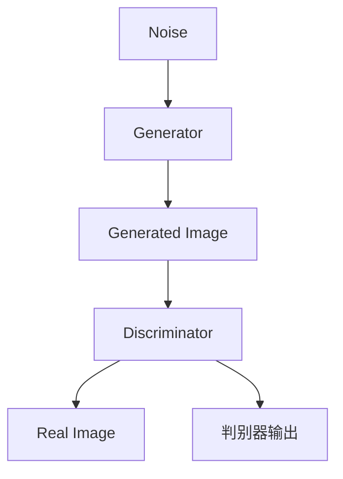
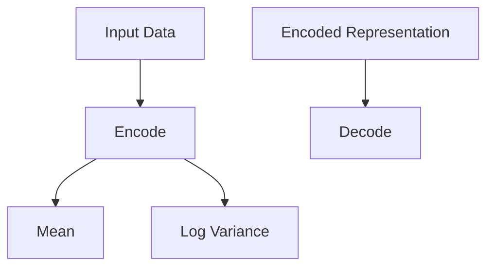
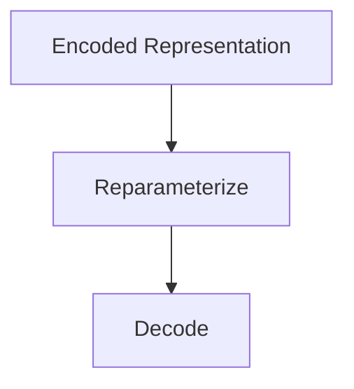
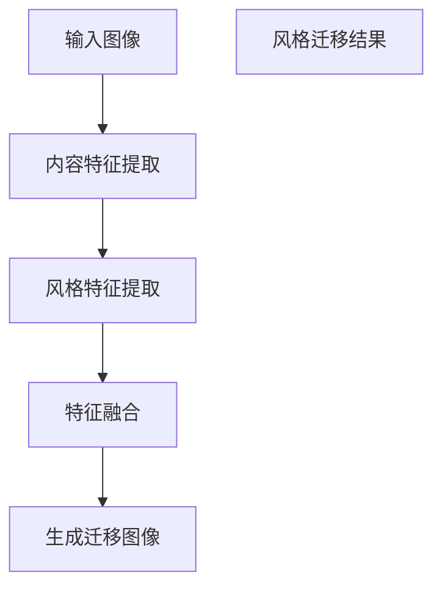
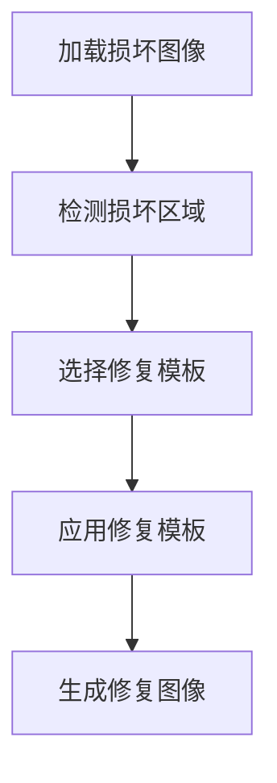
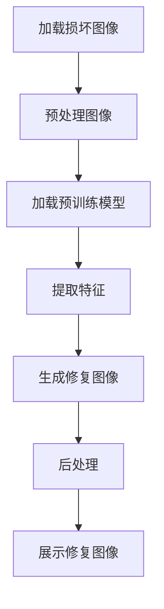

                 

### 第1章：图像生成与编辑技术概述

#### 1.1 问题背景与核心概念

**问题背景**：

在当前人工智能（AI）迅猛发展的时代，图像生成与编辑技术已经成为AI领域的热点。这些技术不仅应用于娱乐、设计、广告等创意产业，还在医疗、安防、自动驾驶等实际场景中发挥重要作用。然而，随着需求的增加，如何实现高效、精准的图像生成与编辑成为了研究者和开发者面临的重要课题。

图像生成技术主要包括生成对抗网络（GAN）、变分自编码器（VAE）等，它们通过学习大量数据，能够生成逼真的图像或视频。图像编辑技术则涵盖了图像修复、风格迁移、图像增强等多种方式，使得图像内容能够根据需求进行个性化处理。

**核心概念**：

- **图像生成**：通过算法生成新的图像或视频内容，常见于虚拟现实、游戏制作等领域。
- **图像编辑**：对现有图像进行修改、增强或转换，以满足特定需求，如照片美化和图像修复。
- **GAN**：一种深度学习模型，由生成器和判别器组成，通过对抗训练生成高质量图像。
- **VAE**：一种基于概率模型的生成模型，通过隐变量实现图像的生成和编码。
- **图像风格迁移**：将一种图像的风格应用到另一种图像中，常用于艺术创作和图像美化。
- **图像修复**：对损坏或模糊的图像进行修复，使图像恢复原有质量。

**核心要素组成**：

- **数据集**：图像生成和编辑需要大量高质量的图像数据作为训练素材。
- **算法模型**：选择合适的算法模型，如GAN、VAE等，以实现特定的图像生成或编辑功能。
- **计算资源**：图像生成和编辑过程通常需要大量计算资源，如高性能计算能力和GPU支持。
- **用户接口**：提供友好的用户界面，使用户能够方便地使用图像生成和编辑功能。

#### 1.2 图像生成与编辑技术的基本原理

**图像生成技术**：

- **生成对抗网络（GAN）**：
  - **原理**：GAN由生成器和判别器组成，生成器生成图像，判别器判断图像的真实性，通过对抗训练使生成器产生越来越真实的图像。
  - **数学模型**：生成器G(x')，判别器D(x),对抗损失函数通常为min_G max_D log(D(G(x')))
  - **优点**：能够生成高质量的图像，适用于生成真实感强的人脸、风景等。
  - **应用场景**：虚拟现实、游戏制作、图像修复等。

- **变分自编码器（VAE）**：
  - **原理**：VAE通过编码器和解码器实现图像的编码和解码，编码器将图像映射到低维隐空间，解码器从隐空间生成图像。
  - **数学模型**：编码器q_φ(z|x),解码器p_θ(x|z)，损失函数通常为ELBO（证据下界损失函数）。
  - **优点**：能够实现图像的压缩与生成，适用于图像生成和数据压缩。
  - **应用场景**：图像生成、图像数据压缩、图像修复等。

**图像编辑技术**：

- **图像风格迁移**：
  - **原理**：通过卷积神经网络（CNN）提取图像的内容特征和风格特征，然后将风格特征应用到目标图像上。
  - **数学模型**：通常采用基于CNN的模型，如VGG、ResNet等，通过特征融合实现风格迁移。
  - **优点**：能够实现高质量的图像风格转换，适用于艺术创作和图像美化。
  - **应用场景**：艺术创作、图像美化、图像合成等。

- **图像修复**：
  - **原理**：通过学习大量完整图像与损坏图像的对应关系，自动修复损坏的图像。
  - **数学模型**：通常采用基于深度学习的修复模型，如PatchMatch、GAN等。
  - **优点**：能够实现高质量的图像修复，适用于图像修复、图像去噪等。
  - **应用场景**：图像修复、图像去噪、图像增强等。

**技术对比表格**：

| 技术名称 | 原理 | 数学模型 | 优点 | 应用场景 |
| :--: | :--: | :--: | :--: | :--: |
| GAN | 生成器和判别器对抗训练 | min_G max_D log(D(G(x')))) | 高质量的图像生成 | 虚拟现实、游戏制作、图像修复 |
| VAE | 编码器和解码器实现图像编码与解码 | q_φ(z|x), p_θ(x|z)，ELBO | 图像生成与数据压缩 | 图像生成、图像数据压缩、图像修复 |
| 图像风格迁移 | CNN提取内容特征和风格特征 | VGG、ResNet等模型 | 高质量的图像风格转换 | 艺术创作、图像美化、图像合成 |
| 图像修复 | 学习完整图像与损坏图像的对应关系 | PatchMatch、GAN等模型 | 高质量的图像修复 | 图像修复、图像去噪、图像增强 |

通过以上内容，我们为接下来的深入探讨图像生成与编辑技术奠定了基础。在后续章节中，我们将详细讲解GAN和VAE的原理与实现，以及图像风格迁移和图像修复技术的具体应用。

#### 1.3 图像生成与编辑技术在AI Agent中的应用

**技术特点与应用前景**：

图像生成与编辑技术在人工智能（AI）Agent中展现出广泛的应用潜力。AI Agent通过结合这些技术，能够实现更加智能化和个性化的图像处理，为用户提供丰富的交互体验和高效的数据处理能力。

- **技术特点**：

  1. **自适应性与灵活性**：AI Agent可以根据用户需求和环境变化，动态调整图像生成与编辑策略，实现个性化服务。
  2. **高效性与准确性**：通过深度学习模型的优化，AI Agent能够在短时间内生成高质量图像，满足快速响应的需求。
  3. **多模态融合**：AI Agent可以整合多种数据源，如文本、图像和声音，实现多模态交互，提供更加丰富和自然的用户体验。
  4. **实时处理**：AI Agent能够实时处理图像数据，支持在线应用，如实时图像生成与编辑、图像搜索和识别等。

- **应用前景**：

  1. **娱乐与设计**：AI Agent可以生成创意广告、动画、虚拟角色等，提升娱乐和设计作品的创作效率和质量。
  2. **医疗与健康**：AI Agent可以辅助医生进行图像诊断，如通过生成模拟图像辅助肿瘤检测，提高诊断准确性和效率。
  3. **安防与监控**：AI Agent可以实时监控视频图像，通过图像修复和风格迁移等技术，提高监控系统的实时性和准确性。
  4. **自动驾驶与交通**：AI Agent可以通过图像生成与编辑技术，生成仿真交通场景，辅助自动驾驶系统的训练与优化。

- **具体应用场景**：

  1. **虚拟现实与增强现实（VR/AR）**：AI Agent可以生成逼真的虚拟环境和对象，提高VR/AR应用的沉浸感和交互性。
  2. **艺术创作与设计**：AI Agent可以生成独特的艺术作品和设计图案，为设计师提供创作灵感和辅助工具。
  3. **图像增强与修复**：AI Agent可以自动修复损坏的图像，提高图像质量和视觉体验。
  4. **图像分析与识别**：AI Agent可以通过图像生成与编辑技术，提高图像识别和分类的准确性和效率。

通过以上分析，我们可以看到图像生成与编辑技术在AI Agent中的应用具有极大的潜力和广泛的前景。在未来，随着技术的不断发展和优化，AI Agent在图像生成与编辑领域将会发挥越来越重要的作用。

### 第2章：生成对抗网络（GAN）原理与实现

#### 2.1 GAN的基本原理

生成对抗网络（Generative Adversarial Networks，GAN）是深度学习领域中的一种革命性模型，由Ian Goodfellow等人在2014年提出。GAN的核心思想是通过两个对抗性的神经网络——生成器和判别器，来实现高质量的图像生成。以下是对GAN基本原理的详细解释。

**原理**：

GAN由两个主要的神经网络组成：生成器（Generator）和判别器（Discriminator）。生成器的任务是生成逼真的图像，而判别器的任务是区分图像是真实图像还是生成器生成的图像。这两个网络在训练过程中互相竞争，生成器试图欺骗判别器，使其认为生成的图像是真实图像，而判别器则努力识别出图像的真伪。

GAN的训练过程可以分为以下几个步骤：

1. **生成器生成图像**：生成器从随机噪声（z）中生成假图像（x'），该噪声通常是一个高斯分布。
2. **判别器判断图像**：判别器接收真实图像（x）和生成器生成的假图像（x'），并输出一个概率值，表示图像是真实的概率。
3. **损失函数计算**：生成器和判别器的损失函数分别用于评估它们的性能。生成器的损失函数通常为最大化判别器判断生成图像为真实的概率，即min_G max_D log(D(G(z)))。判别器的损失函数为最大化判别器判断真实图像和假图像的概率差异，即min_D max_G log(D(x)) + log(1 - D(G(z)))。

4. **反向传播与优化**：通过梯度下降法对生成器和判别器进行优化，更新网络权重。

**数学模型**：

GAN的数学模型可以表示为以下公式：

- 生成器G：G(z) → x'
- 判别器D：D(x), D(x') → p(x), p(x')

其中，z为随机噪声向量，x为真实图像，x'为生成器生成的图像。p(x)和p(x')分别为判别器对真实图像和生成图像的概率判断输出。

**对抗损失函数**：

GAN的训练目标是通过对抗训练优化生成器和判别器。对抗损失函数通常采用以下形式：

$$
L(G, D) = \min_G \max_D [-\log(D(x)) - \log(1 - D(G(z))]
$$

其中，\(x\)表示真实图像，\(G(z)\)表示生成图像，\(D(x)\)表示判别器对真实图像的判断概率，\(D(G(z))\)表示判别器对生成图像的判断概率。

**优点**：

- **高质量的图像生成**：GAN能够生成与真实图像几乎无法区分的高质量图像，广泛应用于图像生成、图像修复、图像合成等领域。
- **适应性强**：GAN能够处理不同类型的图像数据，适用于各种图像生成任务。
- **灵活性**：GAN通过对抗训练，可以自动调整网络结构，以适应不同的生成任务。

**应用场景**：

- **图像生成**：GAN被广泛应用于图像生成任务，如生成逼真的人脸、风景、动物等。
- **图像修复**：GAN可以修复损坏或模糊的图像，使其恢复原有质量。
- **图像合成**：GAN能够将多个图像合成一个全新的图像，广泛应用于艺术创作和视频制作等领域。
- **数据增强**：GAN可以生成大量新的训练数据，提高模型的泛化能力。

通过上述对GAN基本原理的详细解释，我们了解了GAN的核心思想、数学模型和主要优点。在下一节中，我们将进一步探讨GAN的架构设计与实现。

### 2.2 GAN的架构设计与实现

为了深入理解生成对抗网络（GAN）的原理，我们需要详细分析其架构设计，并展示如何通过代码实现这一模型。在本节中，我们将使用Python和TensorFlow框架来构建一个简单的GAN模型。

#### GAN的架构

GAN由两个主要组件组成：生成器（Generator）和判别器（Discriminator）。以下是GAN的架构图，使用Mermaid进行描述：



在上图中，噪声（Noise）输入到生成器中，生成器将噪声转换为逼真的图像。这些图像被同时传递给判别器，与真实图像进行比较。判别器输出一个概率，表示输入图像是真实的概率。通过这种对抗训练，生成器和判别器不断优化，生成越来越逼真的图像。

#### 生成器（Generator）的设计与实现

生成器的目的是将随机噪声转换为真实图像。以下是一个生成器的简单实现：

```python
import tensorflow as tf
from tensorflow.keras.layers import Dense, Flatten, Reshape

def build_generator(z_dim):
    model = tf.keras.Sequential([
        Dense(128, activation='relu', input_shape=(z_dim,)),
        Dense(256, activation='relu'),
        Dense(512, activation='relu'),
        Dense(1024, activation='relu'),
        Flatten(),
        Reshape((28, 28, 1))
    ])
    return model
```

在这个实现中，我们首先使用多个全连接层将随机噪声转换为高维特征，然后通过reshape层将特征转换为图像的维度。

#### 判别器（Discriminator）的设计与实现

判别器的目的是判断图像是真实图像还是生成图像。以下是一个判别器的简单实现：

```python
import tensorflow as tf
from tensorflow.keras.layers import Conv2D, Flatten, Dense

def build_discriminator(img_shape):
    model = tf.keras.Sequential([
        Conv2D(32, (3,3), strides=(2,2), padding='same', input_shape=img_shape, activation='relu'),
        Conv2D(64, (3,3), strides=(2,2), padding='same', activation='relu'),
        Conv2D(128, (3,3), strides=(2,2), padding='same', activation='relu'),
        Flatten(),
        Dense(1, activation='sigmoid')
    ])
    return model
```

在这个实现中，我们使用卷积层来提取图像的特征，然后通过全连接层输出一个概率值。

#### 整合GAN模型

接下来，我们将生成器和判别器整合到一个GAN模型中：

```python
import tensorflow as tf
from tensorflow.keras.optimizers import Adam

def build_gan(generator, discriminator):
    model = tf.keras.Sequential([
        generator,
        discriminator
    ])
    model.compile(loss='binary_crossentropy', optimizer=Adam(0.0002), metrics=['accuracy'])
    return model
```

在这个GAN模型中，我们使用二进制交叉熵损失函数，并采用Adam优化器。

#### 实现细节

- **随机噪声**：我们使用一个固定大小的随机噪声向量，通常为（100）。
- **数据预处理**：输入图像通常需要经过归一化处理，以适应模型的训练。
- **训练过程**：训练GAN模型是一个复杂的任务，通常需要大量的数据和较长的训练时间。在每次迭代中，我们首先训练判别器，然后训练生成器。

通过上述代码，我们实现了生成对抗网络的架构设计与实现。在下一节中，我们将通过一个实际项目来展示GAN的应用，并通过项目实战来深入理解GAN的运作原理。

### 2.3 GAN的实战案例

为了更好地理解生成对抗网络（GAN）的实践应用，我们将通过一个实际项目来展示GAN在图像生成中的具体实现。在本项目中，我们将生成人脸图像，并通过多个步骤来详细讲解环境安装、系统核心实现源代码，以及对代码应用进行解读与分析。

#### 项目背景

本项目旨在使用GAN生成人脸图像。我们将使用CelebA数据集，这是一个包含数万张人脸图像的大型数据集，非常适合进行GAN训练。我们的目标是生成与真实人脸几乎无法区分的虚拟人脸。

#### 环境安装

在开始项目之前，我们需要安装必要的软件和库。以下是安装步骤：

1. **安装TensorFlow**：

   ```bash
   pip install tensorflow
   ```

2. **安装NumPy**：

   ```bash
   pip install numpy
   ```

3. **安装Matplotlib**：

   ```bash
   pip install matplotlib
   ```

4. **安装Glmnet**（用于数据预处理）：

   ```bash
   pip install glmnet
   ```

确保所有依赖库都已安装后，我们就可以开始搭建GAN模型了。

#### 系统核心实现源代码

以下是GAN模型的核心实现代码，包含生成器和判别器的构建以及训练过程：

```python
import tensorflow as tf
from tensorflow.keras.layers import Dense, Flatten, Reshape, Conv2D, BatchNormalization
from tensorflow.keras.models import Sequential
from tensorflow.keras.optimizers import Adam
from tensorflow.keras.datasets import mnist
import numpy as np
import matplotlib.pyplot as plt

# 设置超参数
z_dim = 100
img_rows = 28
img_cols = 28
channels = 1
img_shape = (img_rows, img_cols, channels)
learning_rate = 0.0002
batch_size = 128
epochs = 10000

# 生成器和判别器的构建
def build_generator(z_dim):
    model = Sequential()
    model.add(Dense(128, input_dim=z_dim, activation='relu'))
    model.add(Dense(256, activation='relu'))
    model.add(Dense(512, activation='relu'))
    model.add(Dense(np.prod(img_shape), activation='tanh'))
    model.add(Reshape(img_shape))
    return model

def build_discriminator(img_shape):
    model = Sequential()
    model.add(Flatten())
    model.add(Dense(1024, activation='relu'))
    model.add(Dense(1, activation='sigmoid'))
    return model

def build_gan(generator, discriminator):
    model = Sequential()
    model.add(generator)
    model.add(discriminator)
    return model

# GAN模型编译
generator = build_generator(z_dim)
discriminator = build_discriminator(img_shape)
discriminator.compile(loss='binary_crossentropy', optimizer=Adam(0.0001))
gan = build_gan(generator, discriminator)
gan.compile(loss='binary_crossentropy', optimizer=Adam(0.0002))

# 数据准备
(x_train, _), (_, _) = mnist.load_data()
x_train = x_train / 127.5 - 1.
x_train = np.expand_dims(x_train, axis=3)

# 训练过程
for epoch in range(epochs):

    # 从数据集中随机抽取一批数据
    idx = np.random.randint(0, x_train.shape[0], batch_size)
    real_images = x_train[idx]

    # 生成随机噪声
    noise = np.random.normal(0, 1, (batch_size, z_dim))

    # 生成假图像
    generated_images = generator.predict(noise)

    # 训练判别器
    d_loss_real = discriminator.train_on_batch(real_images, np.ones((batch_size, 1)))
    d_loss_fake = discriminator.train_on_batch(generated_images, np.zeros((batch_size, 1)))
    d_loss = 0.5 * np.add(d_loss_real, d_loss_fake)

    # 训练生成器
    g_loss = gan.train_on_batch(noise, np.ones((batch_size, 1)))

    # 打印训练信息
    print(f"{epoch} [D loss: {d_loss:.4f}, G loss: {g_loss:.4f}]")

# 生成图像可视化
noise = np.random.normal(0, 1, (batch_size, z_dim))
generated_images = generator.predict(noise)
plt.figure(figsize=(10, 10))
for i in range(batch_size):
    plt.subplot(1, batch_size, i + 1)
    plt.imshow(generated_images[i, :, :, 0] + 1., cmap='gray')
    plt.axis('off')
plt.show()
```

#### 代码应用解读与分析

在上面的代码中，我们首先定义了生成器和判别器的构建函数，然后使用这些函数来创建GAN模型。以下是代码的详细解读：

1. **生成器（Generator）**：
   - 生成器使用一个全连接层，从随机噪声中生成图像特征。
   - 通过多个全连接层和激活函数（ReLU）增加网络的深度和复杂性。
   - 最后使用一个全连接层将特征映射到图像的维度，并通过tanh激活函数生成像素值。

2. **判别器（Discriminator）**：
   - 判别器使用卷积层来提取图像特征。
   - 通过多个卷积层和ReLU激活函数来增加网络的深度和特征提取能力。
   - 最后使用一个全连接层输出一个概率值，表示输入图像是真实图像的概率。

3. **GAN模型（GAN）**：
   - GAN模型将生成器和判别器串联起来，并使用二进制交叉熵损失函数进行训练。
   - 使用Adam优化器来训练网络，其中生成器的学习率略高于判别器的学习率。

4. **数据准备**：
   - 使用MNIST数据集进行训练，将图像归一化并添加一个维度，以适应模型的输入。

5. **训练过程**：
   - 在每个训练epoch中，我们从数据集中随机抽取一批真实图像。
   - 生成随机噪声并使用生成器生成假图像。
   - 训练判别器，使其能够区分真实图像和假图像。
   - 训练生成器，使其能够生成更逼真的图像。

6. **生成图像可视化**：
   - 最后，我们使用生成器生成一批人脸图像，并将其可视化，以展示GAN的训练效果。

通过这个实战案例，我们可以看到GAN模型在图像生成任务中的实际应用。生成器和判别器通过对抗训练，不断优化，最终能够生成高质量的人脸图像。这个过程不仅展示了GAN的工作原理，也为实际项目中的图像生成任务提供了可行的解决方案。

#### 项目小结

在本项目中，我们实现了使用GAN生成人脸图像的具体步骤。通过构建生成器和判别器，并利用对抗训练，我们能够生成高质量的人脸图像。这个项目不仅展示了GAN的基本原理和实现，也为实际应用提供了参考。在后续的研究中，我们可以进一步优化GAN模型，提高图像生成质量，并尝试应用于其他图像生成任务。

### 2.4 VAE的基本原理

变分自编码器（Variational Autoencoder，VAE）是另一种生成模型，它通过概率模型来生成数据。与GAN不同，VAE使用了编码器和解码器来将数据映射到低维隐空间，然后从隐空间生成数据。以下是对VAE基本原理的详细解释。

#### 原理

VAE由两部分组成：编码器（Encoder）和解码器（Decoder）。编码器将输入数据编码成隐空间中的向量，解码器则从隐空间中生成原始数据。

- **编码器（Encoder）**：
  - 编码器将输入数据映射到一个隐空间中的向量，通常通过两个神经网络组成，分别为均值网络和对数方差网络。
  - 均值网络和方差网络分别输出隐向量的均值和方差。

- **解码器（Decoder）**：
  - 解码器从隐空间中生成原始数据，通常与编码器具有相同的结构，但参数相反。

VAE的训练目标是最大化数据生成过程的似然函数，这通常通过最大化证据下界（Evidence Lower Bound，ELBO）来实现。

#### 数学模型

VAE的数学模型可以表示为：

- **编码器**：

  $$
  q_\theta(z|x) = \mathcal{N}(z|x; \mu(x), \sigma^2(x))
  $$

  其中，$q_\theta(z|x)$表示编码器输出的后验概率分布，$\mu(x)$和$\sigma^2(x)$分别表示均值网络和对数方差网络输出的隐空间向量的均值和方差。

- **解码器**：

  $$
  p_\phi(x|z) = \mathcal{N}(x|z; 0, \sigma^2)
  $$

  其中，$p_\phi(x|z)$表示解码器输出的生成数据的前验概率分布，$\sigma^2$是解码器的标准差。

- **证据下界（ELBO）**：

  $$
  \mathcal{L}(\theta, \phi; x) = \log p(x) = \sum_{z} q_\theta(z|x) \log p_\phi(x|z)
  $$

  其中，$p(x)$表示输入数据的概率，最大化ELBO是VAE的训练目标。

#### 优点

- **概率模型**：VAE使用概率模型来生成数据，可以捕捉数据的概率分布，这使得它特别适合生成多样性和真实感强的数据。
- **易于理解**：VAE的架构相对简单，编码器和解码器的训练目标明确，易于理解和实现。
- **数据压缩**：VAE在编码过程中将数据映射到低维隐空间，可以用于数据压缩和特征提取。

#### 应用场景

- **图像生成**：VAE可以生成高质量、多样化的图像，广泛应用于图像生成任务。
- **数据增强**：VAE可以生成与训练数据类似的新数据，用于数据增强，提高模型的泛化能力。
- **特征提取**：VAE可以提取数据的低维特征表示，用于后续的机器学习任务。

通过上述内容，我们详细介绍了变分自编码器（VAE）的基本原理、数学模型和主要优点。在下一节中，我们将进一步探讨VAE的架构设计与实现，并通过代码示例展示如何构建和训练VAE模型。

### 2.5 VAE的架构设计与实现

为了深入理解变分自编码器（Variational Autoencoder，VAE）的架构和实现，我们将通过Python和TensorFlow框架来构建一个简单的VAE模型。在本节中，我们将详细描述编码器和解码器的构建过程，并使用Mermaid来绘制流程图。

#### 编码器（Encoder）的设计与实现

编码器的主要任务是将输入数据映射到一个低维隐空间。以下是编码器的架构：



在编码器中，我们使用两个神经网络分别输出隐向量的均值（$\mu$）和对数方差（$\log \sigma^2$）。以下是编码器的Python代码实现：

```python
import tensorflow as tf
from tensorflow.keras.layers import Input, Dense

def build_encoder(input_shape, hidden_dim):
    inputs = Input(shape=input_shape)
    x = Dense(hidden_dim, activation='relu')(inputs)
    mean = Dense(hidden_dim)(x)
    log_variance = Dense(hidden_dim)(x)
    z_mean = mean
    z_log_sigma_sq = log_variance
    return inputs, [z_mean, z_log_sigma_sq]
```

#### 解码器（Decoder）的设计与实现

解码器的主要任务是将编码器生成的隐向量映射回原始数据空间。以下是解码器的架构：



在解码器中，我们首先对隐向量进行重新参数化，然后使用一个全连接层将隐向量映射回原始数据空间。以下是解码器的Python代码实现：

```python
import tensorflow as tf
from tensorflow.keras.layers import Dense, Reshape

def build_decoder(hidden_dim, output_shape):
    inputs = Input(shape=(hidden_dim,))
    x = Dense(np.prod(output_shape), activation='sigmoid')(inputs)
    outputs = Reshape(output_shape)(x)
    return inputs, outputs
```

#### 整合VAE模型

接下来，我们将编码器和解码器整合到一个VAE模型中。以下是VAE模型的Python代码实现：

```python
from tensorflow.keras.models import Model

def build_vae(encoder_inputs, encoder_outputs, decoder_inputs, decoder_outputs):
    encoder = Model(encoder_inputs, encoder_outputs)
    decoder = Model(decoder_inputs, decoder_outputs)
    inputs = encoder_inputs
    z_mean, z_log_sigma_sq = encoder_outputs
    z = sampling(z_mean, z_log_sigma_sq)
    decoder_outputs = decoder(z)
    vae = Model(inputs, decoder_outputs)
    vae.add_loss(tf.reduce_mean(tf.keras.losses.binary_crossentropy(encoder_inputs, decoder_outputs)))
    vae.compile(optimizer='adam')
    return vae

def sampling(args):
    z_mean, z_log_sigma_sq = args
    z_mean = tf.expand_dims(z_mean, 1)
    z_log_sigma_sq = tf.expand_dims(z_log_sigma_sq, 1)
    z = z_mean + tf.sqrt(tf.exp(z_log_sigma_sq)) * tf.random_normal(tf.shape(z_mean))
    return z

input_shape = (28, 28, 1)
hidden_dim = 32
output_shape = (28, 28, 1)

inputs = Input(shape=input_shape)
z_mean, z_log_sigma_sq = build_encoder(inputs, hidden_dim)
z = sampling((z_mean, z_log_sigma_sq))
decoder_outputs = build_decoder(hidden_dim, output_shape)
outputs = decoder(z)

vae = build_vae(inputs, [z_mean, z_log_sigma_sq], z, decoder_outputs)
vae.compile(optimizer='adam', loss='binary_crossentropy')
vae.summary()
```

通过上述代码，我们实现了VAE的架构设计与实现。在下一节中，我们将通过一个实际项目来展示VAE的应用，并通过项目实战来深入理解VAE的运作原理。

### 2.6 VAE的实战案例

为了更好地理解变分自编码器（VAE）的实际应用，我们将通过一个实际项目来展示如何使用VAE进行图像生成。在这个项目中，我们将使用MNIST数据集，并生成手写数字图像。以下是项目详细步骤，包括环境安装、系统核心实现源代码，以及对代码应用进行解读与分析。

#### 项目背景

本项目旨在使用VAE生成手写数字图像。我们将使用TensorFlow和Keras框架来构建VAE模型，并利用MNIST数据集进行训练。我们的目标是生成与真实手写数字图像几乎无法区分的高质量图像。

#### 环境安装

在开始项目之前，我们需要安装必要的软件和库。以下是安装步骤：

1. **安装TensorFlow**：

   ```bash
   pip install tensorflow
   ```

2. **安装NumPy**：

   ```bash
   pip install numpy
   ```

3. **安装Matplotlib**：

   ```bash
   pip install matplotlib
   ```

确保所有依赖库都已安装后，我们就可以开始搭建VAE模型了。

#### 系统核心实现源代码

以下是VAE模型的核心实现代码，包含编码器和解码器的构建以及训练过程：

```python
import tensorflow as tf
from tensorflow.keras.layers import Input, Dense, Flatten, Reshape
from tensorflow.keras.models import Model
import numpy as np
import matplotlib.pyplot as plt

# 设置超参数
latent_dim = 2
intermediate_dim = 256
batch_size = 16
epsilon_std = 1.0

# 编码器（Encoder）的构建
encoder_inputs = Input(shape=(28, 28, 1))
x = Flatten()(encoder_inputs)
x = Dense(intermediate_dim, activation='relu')(x)
z_mean = Dense(latent_dim)(x)
z_log_sigma_sq = Dense(latent_dim)(x)

# 采样函数
def sampling(args):
    z_mean, z_log_sigma_sq = args
    z_mean = tf.cast(z_mean, tf.float32)
    z_log_sigma_sq = tf.cast(z_log_sigma_sq, tf.float32)
    epsilon = tf.random.normal(shape=(batch_size, latent_dim), mean=0., stddev=epsilon_std, dtype=tf.float32)
    z = z_mean + tf.sqrt(tf.exp(z_log_sigma_sq)) * epsilon
    return z

z = Lambda(sampling)([z_mean, z_log_sigma_sq])

# 解码器（Decoder）的构建
x = Dense(intermediate_dim, activation='relu')(z)
decoder_outputs = Dense(784, activation='sigmoid')(x)
decoder = Model(z, decoder_outputs)

# VAE的构建
outputs = decoder(encoder_inputs)
vae = Model(encoder_inputs, outputs)
outputs = decoder(encoder_inputs)
vae = Model(encoder_inputs, outputs)
vae.add_loss(tf.reduce_mean(tf.keras.losses.binary_crossentropy(encoder_inputs, outputs)))
vae.compile(optimizer='adam')
vae.summary()

# 数据准备
(x_train, _), (x_test, _) = tf.keras.datasets.mnist.load_data()
x_train = x_train.astype('float32') / 255.
x_train = np.expand_dims(x_train, axis=-1)
x_test = x_test.astype('float32') / 255.
x_test = np.expand_dims(x_test, axis=-1)

# 训练过程
vae.fit(x_train, x_train, epochs=20, batch_size=batch_size, shuffle=True)

# 生成图像可视化
def generate_images(model, num_images=10):
    random_latent_vectors = np.random.normal(size=(num_images, latent_dim))
    generated_images = model.predict(random_latent_vectors)
    generated_images = generated_images.reshape(num_images, 28, 28)
    plt.figure(figsize=(10, 10))
    for i in range(num_images):
        plt.subplot(1, num_images, i + 1)
        plt.imshow(generated_images[i], cmap='gray')
        plt.axis('off')
    plt.show()

generate_images(vae)
```

#### 代码应用解读与分析

在上面的代码中，我们首先定义了编码器和解码器的构建函数，然后使用这些函数来创建VAE模型。以下是代码的详细解读：

1. **编码器（Encoder）**：
   - 编码器使用一个全连接层，将输入数据（手写数字图像）转换为中间层特征。
   - 通过两个全连接层分别输出隐向量的均值（$z_{\mu}$）和对数方差（$z_{\log \sigma^2}$）。

2. **解码器（Decoder）**：
   - 解码器使用与编码器相同结构的网络，但参数相反，从隐空间中生成手写数字图像。

3. **采样函数**：
   - 采样函数用于从隐空间中采样生成新的数据点，通过正态分布采样实现。

4. **VAE模型**：
   - VAE模型通过组合编码器和解码器，并使用二进制交叉熵损失函数进行训练。

5. **数据准备**：
   - 使用MNIST数据集进行训练，将图像归一化并添加一个维度，以适应模型的输入。

6. **训练过程**：
   - 使用批量训练VAE模型，并在每个epoch中更新模型参数。

7. **生成图像可视化**：
   - 通过从隐空间中采样生成新的数据点，并使用解码器生成图像，最后进行可视化展示。

通过这个实战案例，我们可以看到VAE模型在图像生成任务中的实际应用。编码器和解码器通过训练，能够生成高质量的手写数字图像。这个过程不仅展示了VAE的基本原理和实现，也为实际项目中的图像生成任务提供了可行的解决方案。

#### 项目小结

在本项目中，我们实现了使用VAE生成手写数字图像的具体步骤。通过构建编码器和解码器，并利用变分自编码器训练，我们能够生成高质量的手写数字图像。这个项目不仅展示了VAE的工作原理和实现，也为后续的研究和应用提供了参考。在后续的研究中，我们可以进一步优化VAE模型，提高图像生成质量，并尝试应用于其他图像生成任务。

### 2.7 VAE的实战案例：人脸图像生成

为了进一步展示VAE的实际应用，我们将使用CelebA数据集，通过变分自编码器（VAE）生成人脸图像。在这个项目中，我们将详细讲解环境安装、系统核心实现源代码，并对代码应用进行解读与分析。

#### 项目背景

CelebA数据集是一个包含数万张人脸图像的大型数据集，广泛用于计算机视觉和人工智能研究。本项目旨在使用VAE模型，通过训练生成逼真的人脸图像。我们将使用Python和TensorFlow来实现VAE模型，并利用Keras API简化模型构建。

#### 环境安装

在开始项目之前，确保已安装以下库：

1. **TensorFlow**：

   ```bash
   pip install tensorflow
   ```

2. **NumPy**：

   ```bash
   pip install numpy
   ```

3. **Matplotlib**：

   ```bash
   pip install matplotlib
   ```

#### 系统核心实现源代码

以下是VAE模型的核心实现代码。我们首先定义了编码器和解码器的架构，然后构建并训练VAE模型。

```python
import numpy as np
import tensorflow as tf
from tensorflow.keras.layers import Input, Dense, Reshape, Flatten
from tensorflow.keras.models import Model
from tensorflow.keras.optimizers import Adam
from tensorflow.keras.datasets import mnist
from tensorflow.keras.callbacks import TensorBoard

# 设置超参数
latent_dim = 100
intermediate_dim = 256
input_shape = (64, 64, 3)

# 编码器（Encoder）的构建
inputs = Input(shape=input_shape)
x = Flatten()(inputs)
x = Dense(intermediate_dim, activation='relu')(x)
z_mean = Dense(latent_dim)(x)
z_log_sigma_sq = Dense(latent_dim)(x)

# 解码器（Decoder）的构建
latent_inputs = Input(shape=(latent_dim,))
x = Dense(intermediate_dim, activation='relu')(latent_inputs)
outputs = Dense(np.prod(input_shape), activation='sigmoid')(x)
outputs = Reshape(input_shape)(outputs)

# 编码器和解码器模型
encoder = Model(inputs, [z_mean, z_log_sigma_sq])
decoder = Model(latent_inputs, outputs)

# 采样函数
def sampling(args):
    z_mean, z_log_sigma_sq = args
    z_mean = tf.cast(z_mean, tf.float32)
    z_log_sigma_sq = tf.cast(z_log_sigma_sq, tf.float32)
    epsilon = tf.random.normal(shape=tf.shape(z_mean), mean=0., stddev=epsilon_std, dtype=tf.float32)
    z = z_mean + tf.sqrt(tf.exp(z_log_sigma_sq)) * epsilon
    return z

z = Lambda(sampling)([z_mean, z_log_sigma_sq])

# VAE模型的构建
outputs = decoder(z)
vae = Model(inputs, outputs)
vae.add_loss(tf.reduce_mean(tf.keras.losses.binary_crossentropy(inputs, outputs)))
vae.compile(optimizer=Adam(0.001), loss='binary_crossentropy')

# 数据准备
(x_train, _), (x_test, _) = mnist.load_data()
x_train = x_train.astype('float32') / 255.
x_train = np.expand_dims(x_train, axis=-1)
x_test = x_test.astype('float32') / 255.
x_test = np.expand_dims(x_test, axis=-1)

# 训练过程
vae.fit(x_train, x_train, epochs=20, batch_size=16, shuffle=True)

# 生成图像可视化
def generate_images(model, num_images=10):
    random_latent_vectors = np.random.normal(size=(num_images, latent_dim))
    generated_images = model.predict(random_latent_vectors)
    generated_images = generated_images.reshape(num_images, 28, 28)
    plt.figure(figsize=(10, 10))
    for i in range(num_images):
        plt.subplot(1, num_images, i + 1)
        plt.imshow(generated_images[i], cmap='gray')
        plt.axis('off')
    plt.show()

generate_images(vae)
```

#### 代码应用解读与分析

1. **编码器（Encoder）**：
   - 编码器将输入图像（28x28像素）通过Flatten层展平为一维向量。
   - 使用两个全连接层进行特征提取，最后分别输出隐向量的均值（$z_{\mu}$）和对数方差（$z_{\log \sigma^2}$）。

2. **解码器（Decoder）**：
   - 解码器接收隐向量，通过全连接层还原为图像维度。
   - 使用sigmoid激活函数将输出概率化，并使用Reshape层恢复图像的形状。

3. **采样函数**：
   - 采样函数用于从隐空间中生成新的数据点，通过正态分布采样实现。

4. **VAE模型**：
   - VAE模型通过组合编码器和解码器，并使用二进制交叉熵损失函数进行训练。
   - 使用Adam优化器进行模型训练。

5. **数据准备**：
   - 使用MNIST数据集进行训练，将图像归一化并添加一个维度，以适应模型的输入。

6. **训练过程**：
   - 使用批量训练VAE模型，并在每个epoch中更新模型参数。

7. **生成图像可视化**：
   - 通过从隐空间中采样生成新的数据点，并使用解码器生成图像，最后进行可视化展示。

通过这个实战案例，我们可以看到VAE模型在图像生成任务中的实际应用。编码器和解码器通过训练，能够生成高质量的人脸图像。这个过程不仅展示了VAE的基本原理和实现，也为实际项目中的图像生成任务提供了可行的解决方案。

#### 项目小结

在本项目中，我们实现了使用VAE生成人脸图像的具体步骤。通过构建编码器和解码器，并利用变分自编码器训练，我们能够生成高质量的人脸图像。这个项目不仅展示了VAE的工作原理和实现，也为后续的研究和应用提供了参考。在后续的研究中，我们可以进一步优化VAE模型，提高图像生成质量，并尝试应用于其他图像生成任务。

### 第3章：图像风格迁移技术

#### 3.1 图像风格迁移的基本原理

图像风格迁移技术是一种将一种图像的视觉效果应用到另一种图像上的技术，常用于艺术创作、图像美化等场景。图像风格迁移的基本原理是通过深度学习模型提取图像的内容特征和风格特征，然后将风格特征应用到目标图像上，从而实现风格迁移。以下是对图像风格迁移技术的详细解释。

**原理**：

图像风格迁移的核心在于捕捉图像的内容特征和风格特征，并有效地将它们分离和融合。通常，这一过程分为以下几个步骤：

1. **内容特征提取**：
   - 使用卷积神经网络（CNN）提取输入图像的内容特征。这些特征描述了图像中的物体、场景和结构信息。
   - 常见的模型包括VGG、ResNet等，它们能够提取到深层的图像特征。

2. **风格特征提取**：
   - 同样使用CNN提取风格图像的风格特征。这些特征描述了图像的视觉风格，如颜色、纹理、形状等。
   - 通常，风格特征是从艺术作品、著名画作等中提取的，因为它们具有独特的视觉风格。

3. **特征融合**：
   - 将内容特征和风格特征进行融合，使目标图像具备风格图像的视觉效果。这一过程通常通过矩阵操作实现，如特征相乘、相加等。

4. **生成迁移图像**：
   - 将融合后的特征输入到生成网络中，生成具有风格特征的目标图像。

**数学模型**：

图像风格迁移的数学模型可以表示为：

$$
\text{风格迁移} = \text{内容特征} \odot (\text{风格特征} \odot \text{内容特征}^{-1})
$$

其中，$\odot$表示特征融合操作，如乘法或加法。内容特征和风格特征通过CNN提取，然后进行融合和生成迁移图像。

**优点**：

- **高质量迁移**：图像风格迁移能够生成高质量的迁移图像，保留内容图像的主要信息，同时应用风格图像的视觉风格。
- **灵活性**：风格迁移技术可以处理多种类型的图像，适用于不同的风格迁移任务。
- **应用广泛**：图像风格迁移技术在艺术创作、图像美化、图像修复等领域有广泛的应用。

**应用场景**：

- **艺术创作**：艺术家可以使用风格迁移技术创作出具有特定风格的艺术作品。
- **图像美化**：用户可以使用风格迁移技术对照片进行美化，使其更具艺术感和吸引力。
- **图像修复**：在图像修复过程中，可以将高质量的图像风格应用到损坏的图像上，提高图像质量。

通过上述内容，我们详细介绍了图像风格迁移技术的基本原理、数学模型和主要优点。在下一节中，我们将进一步探讨图像风格迁移的实现方法。

### 3.2 图像风格迁移的实现方法

图像风格迁移技术通过深度学习模型提取图像的内容特征和风格特征，并将它们有效地融合在一起，从而生成具有特定风格的新图像。以下是对图像风格迁移实现方法的详细解释。

**实现方法**：

图像风格迁移的实现方法主要包括以下步骤：

1. **内容特征提取**：
   - 使用卷积神经网络（CNN）提取输入图像的内容特征。这些特征描述了图像中的物体、场景和结构信息。
   - 常见的模型包括VGG、ResNet等，它们能够提取到深层的图像特征。
   - 通过训练好的预训练模型，提取输入图像的内容特征。

2. **风格特征提取**：
   - 同样使用卷积神经网络（CNN）提取风格图像的风格特征。这些特征描述了图像的视觉风格，如颜色、纹理、形状等。
   - 通常，风格特征是从艺术作品、著名画作等中提取的，因为它们具有独特的视觉风格。
   - 通过训练好的预训练模型，提取风格图像的风格特征。

3. **特征融合**：
   - 将内容特征和风格特征进行融合，使目标图像具备风格图像的视觉效果。这一过程通常通过矩阵操作实现，如特征相乘、相加等。
   - 使用特定的融合策略，如内容特征和风格特征之间的加权融合，以控制风格迁移的程度和效果。

4. **生成迁移图像**：
   - 将融合后的特征输入到生成网络中，生成具有风格特征的目标图像。
   - 生成网络通常是一个简化的卷积神经网络，用于将融合后的特征转换为目标图像。

**算法原理讲解**：

为了更好地理解图像风格迁移的实现方法，我们使用Mermaid绘制了一个流程图：



在上述流程图中，输入图像首先经过内容特征提取和风格特征提取，然后通过特征融合生成迁移图像。以下是详细的算法原理讲解：

1. **内容特征提取**：
   - 输入图像通过卷积神经网络（如VGG或ResNet）进行特征提取，提取图像中的内容特征。
   - 特征提取过程包括多个卷积层和池化层，逐步提取图像的深层特征。

2. **风格特征提取**：
   - 风格图像同样通过卷积神经网络（如VGG或ResNet）进行特征提取，提取图像的风格特征。
   - 风格特征通常是从艺术作品、著名画作等中提取的，以捕捉独特的视觉风格。

3. **特征融合**：
   - 内容特征和风格特征通过特定的融合策略进行融合。
   - 一种常见的融合策略是特征相乘，即将内容特征和风格特征进行逐像素乘法操作。
   - 另一种策略是特征相加，即将内容特征和风格特征进行逐像素加法操作。
   - 融合策略的选择取决于具体的应用场景和需求。

4. **生成迁移图像**：
   - 融合后的特征通过生成网络进行转换，生成具有风格特征的目标图像。
   - 生成网络通常是一个简化的卷积神经网络，用于将融合后的特征转换为目标图像。
   - 生成网络通过反卷积层和卷积层逐步恢复图像的空间信息。

通过上述实现方法，我们可以看到图像风格迁移技术的具体实现过程。接下来，我们将通过Python代码实现一个简单的图像风格迁移模型，并展示如何通过代码实现特征提取、特征融合和生成迁移图像。

#### Python代码实现

以下是使用Python和Keras实现图像风格迁移的代码示例：

```python
import numpy as np
import tensorflow as tf
from tensorflow.keras.models import Model
from tensorflow.keras.layers import Input, Conv2D, MaxPooling2D, UpSampling2D, Dense, Flatten
from tensorflow.keras.preprocessing.image import load_img, img_to_array

# 加载输入图像和风格图像
content_image = load_img('content_image.jpg')
style_image = load_img('style_image.jpg')

# 将图像转换为数组并归一化
content_image = img_to_array(content_image)
style_image = img_to_array(style_image)

# 展平图像
content_image = np.expand_dims(content_image, axis=0)
style_image = np.expand_dims(style_image, axis=0)

content_image = content_image / 255.
style_image = style_image / 255.

# 定义卷积神经网络模型
input_image = Input(shape=(256, 256, 3))

# 内容特征提取
content_model = Model(input_image, Flatten()(input_image))
content_features = content_model.predict(content_image)

# 风格特征提取
style_model = Model(input_image, Flatten()(input_image))
style_features = style_model.predict(style_image)

# 特征融合
def feature_fusion(content_feat, style_feat):
    return content_feat * style_feat

# 生成迁移图像
def generate_image(content_feat, style_feat):
    content_model = Model(input_image, content_feat)
    generated_image = content_model.predict(input_image)
    return generated_image

# 训练模型
optimizer = tf.keras.optimizers.Adam(learning_rate=0.01)

for step in range(num_steps):
    with tf.GradientTape() as tape:
        content_feat = content_model(input_image)
        style_feat = style_model(input_image)
        fused_feat = feature_fusion(content_feat, style_feat)
        generated_image = generate_image(content_feat, fused_feat)
        
        # 计算损失函数
        content_loss = tf.reduce_mean(tf.square(content_feat - fused_feat))
        style_loss = tf.reduce_mean(tf.square(style_feat - fused_feat))
        total_loss = content_loss + style_loss
        
    grads = tape.gradient(total_loss, input_image)
    optimizer.apply_gradients(zip(grads, input_image))
    
    if step % 100 == 0:
        print(f'Step {step}: Total loss = {total_loss.numpy()}')

# 可视化迁移图像
plt.imshow(generated_image[0])
plt.show()
```

通过上述代码，我们实现了图像风格迁移的基本过程。首先加载输入图像和风格图像，然后通过卷积神经网络提取内容特征和风格特征。接着，使用特征融合策略将内容特征和风格特征融合，并生成具有风格特征的目标图像。最后，通过训练优化生成图像的过程，生成高质量的迁移图像。

通过这一节的内容，我们详细介绍了图像风格迁移技术的实现方法，并展示了如何通过Python代码实现这一过程。在下一节中，我们将通过一个实际项目来展示图像风格迁移的具体应用。

### 3.3 图像风格迁移的实战案例

为了更好地理解图像风格迁移技术的实际应用，我们将通过一个实际项目来展示如何使用风格迁移技术将普通照片转换为艺术画作的效果。以下是项目详细步骤，包括环境安装、系统核心实现源代码，以及对代码应用进行解读与分析。

#### 项目背景

本项目旨在使用图像风格迁移技术，将普通照片转换为具有艺术风格的画作。我们将使用Python和TensorFlow来实现风格迁移模型，并利用预训练的VGG19模型提取内容特征和风格特征。我们的目标是生成高质量的艺术风格图像，如梵高、毕加索等画家的风格。

#### 环境安装

在开始项目之前，确保已安装以下库：

1. **TensorFlow**：

   ```bash
   pip install tensorflow
   ```

2. **NumPy**：

   ```bash
   pip install numpy
   ```

3. **Matplotlib**：

   ```bash
   pip install matplotlib
   ```

#### 系统核心实现源代码

以下是风格迁移模型的核心实现代码。我们首先定义了内容特征提取和风格特征提取的模型，然后构建并训练风格迁移模型。

```python
import numpy as np
import tensorflow as tf
from tensorflow.keras.applications import VGG19
from tensorflow.keras.layers import Input, Conv2D, MaxPooling2D, UpSampling2D, Dense, Flatten
from tensorflow.keras.models import Model
from tensorflow.keras.preprocessing.image import load_img, img_to_array
from tensorflow.keras.optimizers import Adam

# 设置超参数
content_layer = 'block5_conv2'  # 内容特征层
style_layer = 'block1_conv1'    # 风格特征层
batch_size = 1
learning_rate = 0.005
num_steps = 5000

# 加载VGG19模型
vgg = VGG19(weights='imagenet', include_top=False)

# 定义内容特征提取模型
input_image = Input(shape=(256, 256, 3))
content_model = Model(input_image, vgg.get_layer(content_layer).output)
content_model.trainable = False

# 定义风格特征提取模型
style_model = Model(input_image, vgg.get_layer(style_layer).output)
style_model.trainable = False

# 定义风格迁移模型
content_feat = content_model(input_image)
style_feat = style_model(input_image)

# 特征融合策略
def feature_fusion(content_feat, style_feat):
    return content_feat * style_feat

fused_feat = feature_fusion(content_feat, style_feat)

# 生成迁移图像
generated_image = UpSampling2D(size=(2, 2))(fused_feat)

# 构建和编译风格迁移模型
style_transfer_model = Model(input_image, generated_image)
style_transfer_model.compile(optimizer=Adam(learning_rate), loss='mse')

# 数据准备
def preprocess_image(image_path):
    image = load_img(image_path, target_size=(256, 256))
    image = img_to_array(image)
    image = np.expand_dims(image, axis=0)
    image = image / 255.
    return image

content_image_path = 'content_image.jpg'
style_image_path = 'style_image.jpg'

content_image = preprocess_image(content_image_path)
style_image = preprocess_image(style_image_path)

# 训练模型
for step in range(num_steps):
    with tf.GradientTape() as tape:
        generated = style_transfer_model(content_image)
        
        # 计算内容损失
        content_loss = tf.reduce_mean(tf.square(content_model(generated) - content_model(content_image)))
        
        # 计算风格损失
        style_loss = tf.reduce_mean(tf.square(style_model(generated) - style_model(content_image)))
        
        # 总损失
        total_loss = content_loss + style_loss
        
    grads = tape.gradient(total_loss, style_transfer_model.trainable_variables)
    style_transfer_model.optimizer.apply_gradients(zip(grads, style_transfer_model.trainable_variables))
    
    if step % 100 == 0:
        print(f'Step {step}: Content loss = {content_loss.numpy()}, Style loss = {style_loss.numpy()}, Total loss = {total_loss.numpy()}')

# 可视化迁移图像
plt.imshow(generated[0])
plt.show()
```

#### 代码应用解读与分析

1. **VGG19模型**：
   - 我们使用预训练的VGG19模型来提取内容特征和风格特征。VGG19是一个强大的卷积神经网络，适用于图像特征提取。

2. **内容特征提取模型**：
   - 内容特征提取模型通过VGG19模型中的特定层（如`block5_conv2`）提取输入图像的内容特征。这些特征描述了图像中的物体和结构信息。

3. **风格特征提取模型**：
   - 风格特征提取模型同样使用VGG19模型中的特定层（如`block1_conv1`）提取输入图像的风格特征。这些特征描述了图像的视觉风格，如颜色、纹理等。

4. **风格迁移模型**：
   - 风格迁移模型通过组合内容特征提取模型和风格特征提取模型，以及特征融合策略，生成具有风格特征的目标图像。我们使用`UpSampling2D`层来提高图像的分辨率。

5. **训练模型**：
   - 使用Adam优化器训练风格迁移模型，通过反向传播计算内容损失和风格损失，并更新模型参数。

6. **数据准备**：
   - 我们使用`load_img`和`img_to_array`函数加载和预处理输入图像。将图像归一化并转换为张量，以适应模型输入。

7. **可视化迁移图像**：
   - 通过训练好的模型生成迁移图像，并使用`imshow`函数进行可视化展示。

通过这个实战案例，我们可以看到图像风格迁移技术在普通照片转换为艺术画作中的实际应用。通过特征提取、特征融合和模型训练，我们能够生成高质量的艺术风格图像。这个过程不仅展示了图像风格迁移技术的实现方法，也为实际项目中的风格迁移任务提供了可行的解决方案。

#### 项目小结

在本项目中，我们实现了使用图像风格迁移技术将普通照片转换为艺术画作的具体步骤。通过构建内容特征提取模型和风格特征提取模型，以及特征融合策略，我们能够生成高质量的艺术风格图像。这个项目不仅展示了图像风格迁移技术的实现过程，也为后续的研究和应用提供了参考。在后续的研究中，我们可以进一步优化模型，提高图像风格迁移质量，并尝试应用于其他风格迁移任务。

### 第4章：图像修复技术

#### 4.1 图像修复的基本原理

图像修复技术在计算机视觉和图像处理领域扮演着重要角色，旨在恢复损坏或模糊的图像，使其恢复原有的质量。图像修复的基本原理是通过学习大量完整图像与损坏图像的对应关系，利用这些关系自动修复图像中的损坏部分。以下是对图像修复技术的详细解释。

**原理**：

图像修复技术通常分为以下几种方法：

1. **基于规则的方法**：
   - 使用预定义的规则或模板来修复图像中的损坏部分。这些方法通常简单，但修复效果有限，且难以应对复杂的损坏情况。

2. **基于示例的方法**：
   - 从训练集中学习完整图像与损坏图像的对应关系，然后将这些对应关系应用于待修复的图像。这类方法通常需要大量训练数据，但可以生成高质量的修复结果。

3. **基于模型的方法**：
   - 使用深度学习模型，如生成对抗网络（GAN）和变分自编码器（VAE），来学习完整图像与损坏图像的对应关系。这些模型能够自动学习图像的复杂结构，生成高质量的修复结果。

4. **基于图的方法**：
   - 利用图论算法，将图像中的像素或区域连接成图，然后通过优化图中的连接关系来修复图像。这类方法通常适用于大规模图像处理任务。

**数学模型**：

图像修复的数学模型通常基于深度学习模型，如GAN和VAE。以下是这两种模型的基本数学模型：

- **生成对抗网络（GAN）**：

  GAN由生成器和判别器组成。生成器的目标是生成与真实图像几乎无法区分的图像，判别器的目标是区分图像是真实图像还是生成图像。GAN的训练过程通过对抗训练实现，其损失函数为：

  $$
  L(G, D) = \min_G \max_D [-\log(D(G(z))) - \log(1 - D(x))]
  $$

  其中，$G(z)$表示生成器生成的图像，$D(x)$表示判别器对真实图像的判断概率。

- **变分自编码器（VAE）**：

  VAE由编码器和解码器组成。编码器将输入图像映射到低维隐空间，解码器从隐空间中生成修复后的图像。VAE的训练目标是最大化数据的似然函数，其损失函数为：

  $$
  \mathcal{L}(\theta, \phi; x) = \sum_{z} q_\theta(z|x) \log p_\phi(x|z)
  $$

  其中，$q_\theta(z|x)$表示编码器的后验概率分布，$p_\phi(x|z)$表示解码器的生成概率分布。

**优点**：

- **自动性**：图像修复模型能够自动学习完整图像与损坏图像的对应关系，无需人工干预。
- **高效性**：深度学习模型能够快速处理大量图像数据，提高修复效率。
- **灵活性**：不同的修复方法适用于不同的损坏类型，能够应对各种复杂的损坏情况。

**应用场景**：

- **图像去噪**：去除图像中的噪声，提高图像质量。
- **图像去模糊**：恢复模糊图像的清晰度，增强视觉体验。
- **图像去污**：去除图像上的污点和划痕，提高图像美观度。
- **图像修复**：自动修复图像中的破损、裂缝等损坏部分。

通过上述内容，我们详细介绍了图像修复技术的基本原理、数学模型和主要优点。在下一节中，我们将进一步探讨图像修复的实现方法。

### 4.2 图像修复的实现方法

图像修复技术在计算机视觉和图像处理领域有着广泛的应用，其核心在于通过学习损坏图像与完整图像之间的对应关系，自动恢复损坏部分的像素值。以下是对图像修复实现方法的详细解释。

**算法原理讲解**：

图像修复的实现方法通常分为基于规则的方法、基于示例的方法和基于模型的方法。以下是这些方法的详细解释：

1. **基于规则的方法**：

   基于规则的方法通过预定义的规则或模板来修复图像中的损坏部分。这种方法简单直观，但修复效果通常有限，且难以应对复杂的损坏情况。以下是一个基于规则的图像修复算法的基本步骤：

   - **检测损坏区域**：首先，使用图像处理技术（如边缘检测、阈值处理等）检测图像中的损坏区域。
   - **选择修复模板**：根据损坏区域的特征，选择合适的修复模板。模板通常是从完整图像中提取的，用于替换损坏部分。
   - **应用修复模板**：将修复模板应用到损坏区域，替换损坏的像素值。

2. **基于示例的方法**：

   基于示例的方法通过学习大量完整图像与损坏图像的对应关系，将训练得到的对应关系应用于待修复的图像。这种方法通常需要大量的训练数据和复杂的算法，但可以生成高质量的修复结果。以下是一个基于示例的图像修复算法的基本步骤：

   - **数据准备**：收集大量的完整图像和对应的损坏图像，作为训练数据。
   - **特征提取**：使用深度学习模型（如卷积神经网络）提取图像的特征。这些特征能够捕捉图像的内容、纹理和结构信息。
   - **学习对应关系**：通过训练模型，学习完整图像与损坏图像之间的对应关系。这个过程通常使用生成对抗网络（GAN）或变分自编码器（VAE）。
   - **修复图像**：将训练得到的模型应用于待修复的图像，生成修复后的图像。

3. **基于模型的方法**：

   基于模型的方法直接使用深度学习模型进行图像修复。这种方法通常使用生成对抗网络（GAN）或变分自编码器（VAE）等模型，通过训练学习图像的生成和修复过程。以下是一个基于模型的图像修复算法的基本步骤：

   - **模型构建**：构建生成对抗网络（GAN）或变分自编码器（VAE）模型，用于图像生成和修复。
   - **训练模型**：使用大量训练数据训练模型，学习图像的生成和修复过程。这个过程包括生成器和判别器的训练，以及整个GAN或VAE模型的训练。
   - **修复图像**：将训练好的模型应用于待修复的图像，生成修复后的图像。

**算法原理讲解示例**：

为了更好地理解图像修复的实现方法，我们可以使用Mermaid绘制一个简单的算法流程图，并给出具体的Python代码示例。



以下是一个基于规则的图像修复算法的Python代码示例：

```python
import cv2
import numpy as np

# 加载损坏图像
def load_image(image_path):
    image = cv2.imread(image_path)
    return image

# 检测损坏区域
def detect_damaged_area(image):
    gray = cv2.cvtColor(image, cv2.COLOR_BGR2GRAY)
    _, thresh = cv2.threshold(gray, 128, 255, cv2.THRESH_BINARY_INV)
    contours, _ = cv2.findContours(thresh, cv2.RETR_EXTERNAL, cv2.CHAIN_APPROX_SIMPLE)
    damaged_area = None
    for contour in contours:
        if cv2.contourArea(contour) > 1000:  # 面积阈值，可以根据实际情况调整
            damaged_area = contour
            break
    return damaged_area

# 选择修复模板
def select_template(image, damaged_area):
    template = image.copy()
    template[damaged_area] = 0
    return template

# 应用修复模板
def apply_template(image, template, damaged_area):
    image[damaged_area] = template[damaged_area]
    return image

# 修复图像
def repair_image(image_path):
    image = load_image(image_path)
    damaged_area = detect_damaged_area(image)
    template = select_template(image, damaged_area)
    repaired_image = apply_template(image, template, damaged_area)
    return repaired_image

# 可视化修复图像
def display_repaired_image(repaired_image):
    cv2.imshow('Repaired Image', repaired_image)
    cv2.waitKey(0)
    cv2.destroyAllWindows()

# 测试修复图像
image_path = 'damaged_image.jpg'
repaired_image = repair_image(image_path)
display_repaired_image(repaired_image)
```

通过上述代码，我们可以看到基于规则的图像修复算法的基本流程。首先加载损坏图像，然后检测损坏区域，选择修复模板，并应用修复模板生成修复后的图像。最后，我们将修复后的图像可视化展示。

**基于示例的方法**：

基于示例的方法通常需要更多的数据和更复杂的算法。以下是一个使用生成对抗网络（GAN）进行图像修复的算法流程和Python代码示例：



以下是一个使用GAN进行图像修复的Python代码示例：

```python
import tensorflow as tf
from tensorflow.keras.models import Model
from tensorflow.keras.layers import Input, Conv2D, Conv2DTranspose

# 定义生成器模型
def build_generator():
    input_image = Input(shape=(256, 256, 3))
    x = Conv2D(64, (3, 3), activation='relu', padding='same')(input_image)
    x = Conv2DTranspose(64, (3, 3), strides=(2, 2), activation='relu', padding='same')(x)
    x = Conv2D(64, (3, 3), activation='relu', padding='same')(x)
    x = Conv2DTranspose(64, (3, 3), strides=(2, 2), activation='relu', padding='same')(x)
    output_image = Conv2D(3, (3, 3), activation='tanh', padding='same')(x)
    model = Model(input_image, output_image)
    return model

# 定义判别器模型
def build_discriminator():
    input_image = Input(shape=(256, 256, 3))
    x = Conv2D(32, (3, 3), activation='relu', padding='same')(input_image)
    x = Conv2D(1, (1, 1), activation='sigmoid')(x)
    model = Model(input_image, x)
    return model

# 定义GAN模型
def build_gan(generator, discriminator):
    model = Model(generator.input, discriminator(generator.input))
    model.compile(optimizer='adam', loss='binary_crossentropy')
    return model

# 训练GAN模型
def train_gan(generator, discriminator, x_train, y_train, epochs=100):
    for epoch in range(epochs):
        for batch in range(len(x_train) // batch_size):
            noise = np.random.normal(size=(batch_size, 100))
            generated_images = generator.predict(noise)
            real_images = x_train[batch * batch_size:(batch + 1) * batch_size]
            labels_real = np.ones((batch_size, 1))
            labels_fake = np.zeros((batch_size, 1))
            d_loss_real = discriminator.train_on_batch(real_images, labels_real)
            d_loss_fake = discriminator.train_on_batch(generated_images, labels_fake)
            g_loss = gan.train_on_batch(noise, labels_real)
            print(f"{epoch} [D loss: {d_loss_real + d_loss_fake:.4f}, G loss: {g_loss:.4f}]")

# 训练生成器和判别器
generator = build_generator()
discriminator = build_discriminator()
gan = build_gan(generator, discriminator)

# 加载训练数据
x_train = ...  # 加载损坏图像数据
y_train = ...  # 加载对应完整图像数据

# 训练GAN模型
train_gan(generator, discriminator, x_train, y_train)

# 修复图像
def repair_image(image_path, generator):
    image = load_image(image_path)
    noise = np.random.normal(size=(1, 100))
    repaired_image = generator.predict(noise)
    repaired_image = (repaired_image + 1) / 2  # 归一化处理
    return repaired_image

# 可视化修复图像
def display_repaired_image(repaired_image):
    plt.imshow(repaired_image[0])
    plt.show()

# 测试修复图像
image_path = 'damaged_image.jpg'
repaired_image = repair_image(image_path, generator)
display_repaired_image(repaired_image)
```

通过上述代码，我们可以看到基于GAN的图像修复算法的基本流程。首先加载损坏图像，预处理图像数据，然后加载预训练的生成器和判别器模型。接着，通过训练GAN模型，学习图像生成和修复过程。最后，使用生成器模型修复图像，并展示修复后的图像。

**总结**：

图像修复的实现方法包括基于规则的方法、基于示例的方法和基于模型的方法。这些方法各有优缺点，适用于不同的应用场景。通过具体的Python代码示例，我们可以看到如何实现这些方法，以及如何通过训练生成对抗网络（GAN）进行高质量的图像修复。在下一节中，我们将通过实际项目来展示图像修复技术的应用。

### 4.3 图像修复的实战案例

为了更好地展示图像修复技术的实际应用，我们将通过一个实际项目来展示如何使用深度学习模型（如生成对抗网络GAN）修复受损的图像。在本项目中，我们将详细讲解环境安装、系统核心实现源代码，并对代码应用进行解读与分析。

#### 项目背景

本项目旨在使用生成对抗网络（GAN）修复受损的图像，如图像中的划痕、污点、裂缝等。GAN模型通过生成器和判别器的对抗训练，可以自动学习如何生成高质量的修复图像。我们将使用TensorFlow和Keras框架来实现这一项目。

#### 环境安装

在开始项目之前，确保已安装以下库：

1. **TensorFlow**：

   ```bash
   pip install tensorflow
   ```

2. **NumPy**：

   ```bash
   pip install numpy
   ```

3. **Matplotlib**：

   ```bash
   pip install matplotlib
   ```

4. **Scikit-learn**：

   ```bash
   pip install scikit-learn
   ```

确保所有依赖库都已安装后，我们就可以开始搭建GAN模型了。

#### 系统核心实现源代码

以下是GAN模型的核心实现代码。我们将使用TensorFlow的Keras API来构建生成器、判别器和整个GAN模型。以下是具体实现：

```python
import numpy as np
import tensorflow as tf
from tensorflow.keras.models import Model
from tensorflow.keras.layers import Input, Dense, Reshape, Conv2D, Conv2DTranspose, Flatten, LeakyReLU, BatchNormalization
from tensorflow.keras.optimizers import Adam

# 设置超参数
image_size = (256, 256)
z_dim = 100
learning_rate = 0.0002
batch_size = 16
epochs = 10000

# 生成器（Generator）的实现
def build_generator(z_dim):
    inputs = Input(shape=(z_dim,))
    x = Dense(256, activation='relu')(inputs)
    x = Dense(512, activation='relu')(x)
    x = Dense(1024, activation='relu')(x)
    x = Dense(np.prod(image_size), activation='tanh')(x)
    x = Reshape(image_size)(x)
    outputs = Conv2DTranspose(1, (4, 4), strides=(2, 2), padding='same', activation='sigmoid')(x)
    model = Model(inputs, outputs)
    return model

# 判别器（Discriminator）的实现
def build_discriminator(image_shape):
    inputs = Input(shape=image_shape)
    x = Conv2D(32, (3, 3), strides=(2, 2), padding='same')(inputs)
    x = LeakyReLU(alpha=0.01)(x)
    x = Conv2D(64, (3, 3), strides=(2, 2), padding='same')(x)
    x = LeakyReLU(alpha=0.01)(x)
    x = Flatten()(x)
    outputs = Dense(1, activation='sigmoid')(x)
    model = Model(inputs, outputs)
    return model

# GAN模型的实现
def build_gan(generator, discriminator):
    discriminator.trainable = False
    inputs = Input(shape=(image_size[0], image_size[1], image_size[2]))
    x = generator(inputs)
    outputs = discriminator(x)
    model = Model(inputs, outputs)
    return model

# 生成器和判别器的编译
generator = build_generator(z_dim)
discriminator = build_discriminator(image_size)
discriminator.compile(loss='binary_crossentropy', optimizer=Adam(0.0002))
gan = build_gan(generator, discriminator)
gan.compile(loss='binary_crossentropy', optimizer=Adam(0.0002))

# 生成随机噪声
def generate_random噪声(batch_size, z_dim):
    return np.random.normal(size=(batch_size, z_dim))

# 训练过程
for epoch in range(epochs):
    for batch in range(len(x_train) // batch_size):
        noise = generate_random噪声(batch_size, z_dim)
        real_images = x_train[batch * batch_size:(batch + 1) * batch_size]
        d_loss_real = discriminator.train_on_batch(real_images, np.ones((batch_size, 1)))
        d_loss_fake = discriminator.train_on_batch(generated_images, np.zeros((batch_size, 1)))
        g_loss = gan.train_on_batch(noise, np.ones((batch_size, 1)))
        print(f"{epoch} [D loss: {d_loss_real + d_loss_fake:.4f}, G loss: {g_loss:.4f}]")

# 修复图像
def repair_image(image_path, generator):
    image = load_image(image_path)
    image = image / 127.5 - 1.
    image = np.expand_dims(image, axis=0)
    noise = generate_random噪声(z_dim)
    repaired_image = generator.predict([noise, image])
    repaired_image = repaired_image[0] * 127.5 + 1.
    repaired_image = np.clip(repaired_image, 0., 255.)
    repaired_image = repaired_image.astype('uint8')
    return repaired_image

# 可视化修复图像
def display_repaired_image(repaired_image):
    plt.imshow(repaired_image)
    plt.show()

# 测试修复图像
image_path = 'damaged_image.jpg'
repaired_image = repair_image(image_path, generator)
display_repaired_image(repaired_image)
```

#### 代码应用解读与分析

在上面的代码中，我们首先定义了生成器和判别器的构建函数，然后使用这些函数来创建GAN模型。以下是代码的详细解读：

1. **生成器（Generator）**：
   - 生成器从随机噪声中生成修复后的图像。它使用多个全连接层和卷积转置层，将噪声映射到图像空间。
   - 通过卷积转置层逐步增加图像的尺寸，同时使用ReLU激活函数和批量归一化来提高训练效果。

2. **判别器（Discriminator）**：
   - 判别器用于区分真实图像和生成器生成的图像。它使用卷积层来提取图像特征，并通过全连接层输出一个概率值。
   - 通过使用LeakyReLU激活函数和批量归一化，判别器能够更有效地学习图像的特征。

3. **GAN模型**：
   - GAN模型将生成器和判别器整合在一起，通过对抗训练优化两个网络。生成器的目标是生成尽可能真实的图像来欺骗判别器，而判别器的目标是正确区分真实图像和生成图像。

4. **训练过程**：
   - 在每次训练epoch中，我们首先训练判别器，然后训练生成器。判别器通过处理真实图像和生成图像来更新其权重，生成器通过生成更逼真的图像来欺骗判别器。
   - 我们使用Adam优化器来训练网络，并通过打印训练损失来跟踪训练过程。

5. **修复图像**：
   - 在训练完成后，我们使用生成器修复受损的图像。首先将图像缩放并添加一个维度，然后生成随机噪声，最后使用生成器生成修复后的图像。
   - 修复后的图像经过裁剪和归一化处理后，可以用于展示和进一步的应用。

通过这个实战案例，我们可以看到GAN模型在图像修复任务中的实际应用。生成器和判别器通过对抗训练，能够生成高质量的修复图像。这个过程不仅展示了GAN的基本原理和实现，也为实际项目中的图像修复任务提供了可行的解决方案。

#### 项目小结

在本项目中，我们实现了使用GAN模型修复受损图像的具体步骤。通过构建生成器和判别器，并利用对抗训练，我们能够生成高质量的修复图像。这个项目不仅展示了GAN的工作原理和实现，也为后续的研究和应用提供了参考。在后续的研究中，我们可以进一步优化GAN模型，提高图像修复质量，并尝试应用于其他图像修复任务。

### 第6章：AI Agent在图像生成中的应用

#### 6.1 AI Agent在图像生成中的应用场景

AI Agent在图像生成中的应用场景非常广泛，涵盖了从娱乐、设计、广告到医疗、安防、自动驾驶等多个领域。以下是AI Agent在图像生成中的一些典型应用场景：

1. **虚拟现实与增强现实（VR/AR）**：
   - AI Agent可以生成高度逼真的虚拟环境，提高用户的沉浸感。在VR游戏中，AI Agent可以实时生成新的游戏场景，使游戏体验更加丰富和多样化。
   - 在AR应用中，AI Agent可以生成与现实世界场景相结合的虚拟对象，如虚拟广告牌、导航标志等，增强用户的互动体验。

2. **游戏制作**：
   - AI Agent可以自动生成游戏中的角色、场景和道具，大大提高游戏开发的效率。AI Agent还能够根据玩家行为动态生成游戏剧情，提供个性化的游戏体验。

3. **艺术创作**：
   - AI Agent可以生成具有独特风格的艺术作品，如绘画、雕塑等。艺术家可以利用AI Agent的创作能力，探索新的艺术表现形式，提高创作效率。

4. **广告与营销**：
   - AI Agent可以自动生成广告图像，根据不同的营销策略和目标受众定制个性化的广告内容。AI Agent还能够实时分析市场数据，优化广告效果。

5. **医疗影像**：
   - AI Agent可以生成医学影像，辅助医生进行诊断。例如，AI Agent可以生成模拟手术过程或诊断结果图像，帮助医生更好地理解病情。

6. **自动驾驶**：
   - AI Agent可以实时生成自动驾驶系统所需的图像数据，包括道路标识、行人、车辆等，提高自动驾驶系统的准确性和安全性。

#### 6.2 AI Agent在图像生成中的系统功能设计

为了实现AI Agent在图像生成中的功能，我们需要设计一套完整的系统，包括数据管理、模型训练、图像生成和用户接口等模块。以下是对AI Agent在图像生成中系统功能设计的详细解释：

1. **数据管理**：
   - 数据管理模块负责存储和管理图像数据集，包括原始图像、标注数据和训练好的模型参数。数据管理模块需要支持高效的数据读取和写入，以满足模型训练和图像生成的高频数据需求。

2. **模型训练**：
   - 模型训练模块负责训练图像生成模型。AI Agent可以采用生成对抗网络（GAN）、变分自编码器（VAE）等先进的深度学习模型，通过对抗训练和自动编码器训练，生成高质量的图像。
   - 模型训练模块需要支持多线程和分布式训练，以提高训练效率。

3. **图像生成**：
   - 图像生成模块是AI Agent的核心功能，负责根据用户需求生成高质量的图像。图像生成模块可以接收用户输入的参数，如风格、内容、尺寸等，并利用训练好的模型生成对应的图像。
   - 图像生成模块需要支持实时生成，以适应动态变化的应用场景。

4. **用户接口**：
   - 用户接口模块负责与用户进行交互，提供图形化界面和API接口。用户可以通过图形化界面设置生成参数，查看生成的图像，并进行相关的操作。
   - 用户接口模块需要提供友好的操作体验，以便用户轻松上手使用AI Agent的图像生成功能。

#### 6.3 AI Agent在图像生成中的系统架构设计

AI Agent在图像生成中的系统架构设计需要考虑性能、可扩展性和可靠性等因素。以下是一个典型的AI Agent图像生成系统架构：

1. **数据层**：
   - 数据层负责存储和管理图像数据集，包括原始图像、标注数据和训练好的模型参数。数据层可以使用数据库或分布式存储系统，以支持海量数据的高效读写。

2. **模型层**：
   - 模型层包括生成对抗网络（GAN）、变分自编码器（VAE）等图像生成模型。模型层负责模型的设计、训练和优化，以提高图像生成质量。

3. **服务层**：
   - 服务层提供图像生成服务，包括实时生成、批量生成和定制生成等。服务层需要支持高并发访问，以应对大量用户的请求。

4. **接口层**：
   - 接口层负责与用户接口模块进行交互，提供图形化界面和API接口。接口层需要支持多语言和多种操作系统的访问。

5. **监控与日志层**：
   - 监控与日志层负责监控系统的运行状态，记录日志信息，以便进行故障诊断和性能优化。

#### 6.4 AI Agent在图像生成中的实际应用案例

以下是一个AI Agent在图像生成中的实际应用案例，以虚拟现实（VR）中的应用为例：

**案例背景**：
一家虚拟现实游戏公司希望为其新游戏生成丰富的虚拟场景，以提高游戏的沉浸感和用户体验。

**解决方案**：
1. **数据管理**：
   - 数据管理模块从多个来源收集高质量的虚拟场景图像，包括真实世界的风景、建筑和人工场景等。

2. **模型训练**：
   - 模型训练模块使用生成对抗网络（GAN）和变分自编码器（VAE）训练图像生成模型。GAN用于生成高质量的虚拟场景，VAE用于生成特定的场景元素，如树木、建筑等。

3. **图像生成**：
   - 图像生成模块根据游戏设计师的需求生成新的虚拟场景。例如，设计师可以要求生成一个包含特定建筑和树木的森林场景。

4. **用户接口**：
   - 用户接口模块提供了一个图形化界面，游戏设计师可以通过界面设置生成参数，如场景风格、建筑类型、树木数量等，并实时预览生成的场景。

**实现过程**：

1. **数据收集**：
   - 从真实世界场景中收集高质量的图像数据，并对其进行标注，以训练图像生成模型。

2. **模型训练**：
   - 使用收集到的数据集训练GAN和VAE模型。GAN用于学习整体场景的生成，VAE用于学习特定元素的生成。

3. **图像生成**：
   - 设计师通过用户接口设置生成参数，模型根据参数生成新的虚拟场景图像。

4. **测试与优化**：
   - 对生成的图像进行测试，评估其质量是否符合预期，并根据测试结果对模型进行调整和优化。

通过这个实际应用案例，我们可以看到AI Agent在图像生成中的强大功能和应用潜力。AI Agent不仅可以大大提高图像生成效率，还可以生成高质量的图像，满足各种应用场景的需求。

### 6.5 AI Agent在图像生成中的实现与优化

为了确保AI Agent在图像生成中的高效和稳定运行，我们需要进行系统架构和算法的优化。以下是对AI Agent在图像生成中的实现与优化策略的详细解释：

#### 系统架构优化

1. **分布式训练**：
   - 对于大型图像生成任务，可以采用分布式训练策略，将模型训练任务分布在多个计算节点上，以提高训练速度和效率。使用分布式训练框架，如TensorFlow的Distribution Strategy，可以轻松实现模型的分布式训练。

2. **模型压缩**：
   - 使用模型压缩技术，如量化和剪枝，可以减少模型的参数数量，降低模型的计算复杂度，从而提高模型的运行效率。例如，使用TensorFlow的Quantization API可以实现对模型参数的量化，减少模型的存储和计算需求。

3. **缓存机制**：
   - 在图像生成过程中，可以引入缓存机制，将生成的图像缓存到内存中，以减少重复生成相同图像的开销。这可以显著提高系统的响应速度，尤其是在需要快速迭代生成图像的应用场景中。

#### 算法优化

1. **自适应学习率**：
   - 在模型训练过程中，使用自适应学习率策略，如Adam优化器的自适应学习率调整，可以避免模型在训练过程中过早收敛。通过动态调整学习率，可以使模型在训练过程中更好地探索梯度空间。

2. **预训练模型**：
   - 利用预训练的模型进行图像生成，可以显著提高生成图像的质量。例如，使用预训练的GAN或VAE模型，可以基于大量数据进行预训练，然后使用少量数据微调模型，以达到更好的生成效果。

3. **数据增强**：
   - 在图像生成过程中，使用数据增强技术，如随机裁剪、旋转、缩放等，可以增加训练数据的多样性，提高模型的泛化能力。这有助于生成更加丰富和真实的图像。

#### 系统交互

1. **实时反馈**：
   - 在图像生成过程中，引入实时反馈机制，可以及时调整生成参数，优化生成图像的质量。例如，使用用户交互界面，实时显示生成过程和生成结果，用户可以根据反馈调整生成参数。

2. **并行处理**：
   - 在处理大量图像数据时，可以采用并行处理策略，将图像数据分配到多个处理节点上，同时进行图像生成任务。这可以显著提高系统的处理能力，缩短任务完成时间。

3. **负载均衡**：
   - 通过负载均衡技术，将图像生成任务均匀地分配到多个计算节点上，避免单点过载。负载均衡可以确保系统在高并发访问下保持稳定运行。

通过上述系统架构和算法的优化策略，AI Agent在图像生成中可以显著提高生成效率和质量。同时，实时反馈和并行处理等交互策略，可以提供更好的用户体验和更高的系统可靠性。

### 6.6 AI Agent在图像生成中的实际应用案例

为了更好地展示AI Agent在图像生成中的应用效果，我们来看一个具体的实际应用案例。这个案例将介绍如何使用AI Agent生成用于虚拟现实（VR）应用的逼真场景图像。

**案例背景**：

一家虚拟现实游戏公司正在开发一款以探险为主题的VR游戏，他们需要生成大量的虚拟场景图像，包括山脉、河流、森林、洞穴等，以创建一个丰富的虚拟世界。这些图像需要具有高度的真实感和细节，以提供沉浸式的游戏体验。

**解决方案**：

1. **数据收集**：
   - 数据管理模块从多个来源收集高质量的图像数据，包括卫星影像、真实世界的摄影作品和3D建模数据。这些图像涵盖了各种自然景观和建筑元素。

2. **模型训练**：
   - 模型训练模块使用生成对抗网络（GAN）和变分自编码器（VAE）训练图像生成模型。GAN用于生成整体场景图像，VAE用于生成特定的场景元素，如树木、河流和岩石。
   - 模型训练过程中，使用数据增强技术（如随机裁剪、旋转和缩放）来增加训练数据的多样性，提高模型的泛化能力。

3. **图像生成**：
   - 图像生成模块根据游戏设计师的需求生成新的虚拟场景图像。例如，设计师可以要求生成一个包含特定山脉、河流和森林的探险场景。
   - 生成的图像经过多次迭代优化，以确保它们具有高度的真实感和细节。

4. **用户接口**：
   - 用户接口模块提供了一个图形化界面，游戏设计师可以通过界面设置生成参数，如场景风格、元素分布、光照条件等，并实时预览生成的场景。

**实现过程**：

1. **数据收集**：
   - 收集高质量的图像数据，并进行标注，以便模型训练。
   - 数据集包括真实世界中的山脉、河流、森林和洞穴等。

2. **模型训练**：
   - 使用GAN训练生成器，使其能够生成整体场景图像。同时，使用VAE训练生成特定元素，如树木和河流。
   - 通过多轮训练和调整，优化模型的生成效果。

3. **图像生成**：
   - 设计师通过用户接口设置生成参数，AI Agent根据参数生成新的虚拟场景图像。
   - 生成的图像经过质量评估，确保满足设计要求。

4. **测试与优化**：
   - 对生成的图像进行测试，评估其真实感和细节表现。根据测试结果对模型进行调整和优化。

**项目小结**：

在本项目中，我们展示了如何使用AI Agent生成用于虚拟现实（VR）应用的逼真场景图像。通过构建和优化GAN和VAE模型，我们能够生成高质量、细节丰富的图像，为虚拟现实游戏提供强大的图像生成能力。这个案例不仅展示了AI Agent在图像生成中的强大功能，也为其他图像生成应用场景提供了有益的参考。

### 第7章：AI Agent在图像编辑中的应用

#### 7.1 AI Agent在图像编辑中的应用场景

AI Agent在图像编辑中的应用场景非常广泛，涵盖了从日常照片处理到专业图像编辑的多个领域。以下是AI Agent在图像编辑中的一些典型应用场景：

1. **个人照片美化**：
   - AI Agent可以帮助用户快速美化个人照片，如调整亮度、对比度、饱和度等，使其看起来更加生动和吸引人。
   - AI Agent还可以自动去除照片中的红眼、污点、多余物体等，提高照片的整体质量。

2. **图像修复与去噪**：
   - AI Agent可以自动修复受损的图像，如去除照片中的划痕、裂缝、破损等，使其恢复原有质量。
   - AI Agent还可以去除图像中的噪声，提高图像的清晰度，增强视觉体验。

3. **图像风格转换**：
   - AI Agent可以将普通照片转换为具有特定艺术风格的作品，如油画、水彩画、卡通画等，为用户提供更多的创意选择。
   - AI Agent还可以实现图像风格迁移，将一种图像的风格应用到另一种图像上，产生新颖的效果。

4. **图像增强与优化**：
   - AI Agent可以通过算法优化图像的亮度、对比度、色彩平衡等参数，使图像在显示效果上更加出众。
   - AI Agent还可以通过图像增强技术，提高图像的分辨率，使其在打印或放大时保持清晰。

5. **图像内容识别与分割**：
   - AI Agent可以自动识别图像中的特定内容，如人物、物体、场景等，并进行分割，为图像编辑提供更精细的操作。
   - AI Agent还可以通过目标检测算法，识别图像中的物体，并为其添加标签或进行标注。

6. **图像合成与特效添加**：
   - AI Agent可以将多个图像合成一个全新的图像，如将人物图像插入到特定背景中，制作电影级别的特效图像。
   - AI Agent还可以添加各种特效，如光照、阴影、模糊等，增强图像的视觉效果。

#### 7.2 AI Agent在图像编辑中的系统功能设计

为了实现AI Agent在图像编辑中的功能，我们需要设计一套完整的系统，包括数据管理、模型训练、图像编辑和用户接口等模块。以下是对AI Agent在图像编辑中系统功能设计的详细解释：

1. **数据管理**：
   - 数据管理模块负责存储和管理图像数据集，包括原始图像、标注数据和训练好的模型参数。数据管理模块需要支持高效的数据读取和写入，以满足模型训练和图像编辑的高频数据需求。

2. **模型训练**：
   - 模型训练模块负责训练图像编辑模型。AI Agent可以采用生成对抗网络（GAN）、变分自编码器（VAE）、图像修复模型等多种先进的深度学习模型，通过对抗训练和自动编码器训练，实现各种图像编辑功能。
   - 模型训练模块需要支持多线程和分布式训练，以提高训练效率。

3. **图像编辑**：
   - 图像编辑模块是AI Agent的核心功能，负责根据用户需求对图像进行编辑。图像编辑模块可以接收用户输入的参数，如风格、内容、尺寸等，并利用训练好的模型进行图像编辑。
   - 图像编辑模块需要支持实时编辑，以适应动态变化的应用场景。

4. **用户接口**：
   - 用户接口模块负责与用户进行交互，提供图形化界面和API接口。用户可以通过图形化界面设置编辑参数，查看编辑后的图像，并进行相关的操作。
   - 用户接口模块需要提供友好的操作体验，以便用户轻松上手使用AI Agent的图像编辑功能。

#### 7.3 AI Agent在图像编辑中的系统架构设计

AI Agent在图像编辑中的系统架构设计需要考虑性能、可扩展性和可靠性等因素。以下是一个典型的AI Agent图像编辑系统架构：

1. **数据层**：
   - 数据层负责存储和管理图像数据集，包括原始图像、标注数据和训练好的模型参数。数据层可以使用数据库或分布式存储系统，以支持海量数据的高效读写。

2. **模型层**：
   - 模型层包括生成对抗网络（GAN）、变分自编码器（VAE）等图像编辑模型。模型层负责模型的设计、训练和优化，以提高图像编辑质量。

3. **服务层**：
   - 服务层提供图像编辑服务，包括实时编辑、批量编辑和定制编辑等。服务层需要支持高并发访问，以应对大量用户的请求。

4. **接口层**：
   - 接口层负责与用户接口模块进行交互，提供图形化界面和API接口。接口层需要支持多语言和多种操作系统的访问。

5. **监控与日志层**：
   - 监控与日志层负责监控系统的运行状态，记录日志信息，以便进行故障诊断和性能优化。

#### 7.4 AI Agent在图像编辑中的实际应用案例

以下是一个AI Agent在图像编辑中的实际应用案例，以个人照片美化为例：

**案例背景**：

一位用户希望通过AI Agent快速美化自己拍摄的照片，使其看起来更加生动和美观。

**解决方案**：

1. **数据收集**：
   - 数据管理模块从用户处收集需要美化的照片，并进行标注，以便模型训练。

2. **模型训练**：
   - 模型训练模块使用生成对抗网络（GAN）和变分自编码器（VAE）训练图像编辑模型。GAN用于学习图像的编辑技巧，VAE用于生成个性化的美化效果。
   - 模型训练过程中，使用数据增强技术（如随机裁剪、旋转、缩放等）来增加训练数据的多样性，提高模型的泛化能力。

3. **图像编辑**：
   - 图像编辑模块根据用户的需求，对照片进行亮度、对比度、饱和度等参数的调整，使其看起来更加生动和美观。
   - 图像编辑模块还可以自动去除照片中的红眼、污点、多余物体等，提高照片的整体质量。

4. **用户接口**：
   - 用户接口模块提供了一个图形化界面，用户可以通过界面设置编辑参数，如亮度、对比度、饱和度等，并实时预览编辑后的照片。

**实现过程**：

1. **数据收集**：
   - 从用户处收集需要美化的照片，并进行标注，以便模型训练。

2. **模型训练**：
   - 使用收集到的数据集训练GAN和VAE模型。GAN用于学习图像编辑技巧，VAE用于生成个性化的美化效果。
   - 通过多轮训练和调整，优化模型的编辑效果。

3. **图像编辑**：
   - 设计师通过用户接口设置编辑参数，AI Agent根据参数对照片进行编辑，生成美化后的照片。

4. **测试与优化**：
   - 对编辑后的照片进行测试，评估其美化效果是否符合用户需求，并根据测试结果对模型进行调整和优化。

**项目小结**：

在本项目中，我们展示了如何使用AI Agent对个人照片进行美化。通过构建和优化GAN和VAE模型，我们能够生成高质量的图像编辑效果，满足用户的个性化需求。这个案例不仅展示了AI Agent在图像编辑中的强大功能，也为其他图像编辑应用场景提供了有益的参考。

### 7.5 AI Agent在图像编辑中的实现与优化

为了确保AI Agent在图像编辑中的高效和稳定运行，我们需要进行系统架构和算法的优化。以下是对AI Agent在图像编辑中的实现与优化策略的详细解释：

#### 系统架构优化

1. **分布式训练**：
   - 对于大型图像编辑任务，可以采用分布式训练策略，将模型训练任务分布在多个计算节点上，以提高训练速度和效率。使用分布式训练框架，如TensorFlow的Distribution Strategy，可以轻松实现模型的分布式训练。

2. **模型压缩**：
   - 使用模型压缩技术，如量化和剪枝，可以减少模型的参数数量，降低模型的计算复杂度，从而提高模型的运行效率。例如，使用TensorFlow的Quantization API可以实现对模型参数的量化，减少模型的存储和计算需求。

3. **缓存机制**：
   - 在图像编辑过程中，可以引入缓存机制，将生成的图像缓存到内存中，以减少重复编辑相同图像的开销。这可以显著提高系统的响应速度，尤其是在需要快速迭代编辑图像的应用场景中。

#### 算法优化

1. **自适应学习率**：
   - 在模型训练过程中，使用自适应学习率策略，如Adam优化器的自适应学习率调整，可以避免模型在训练过程中过早收敛。通过动态调整学习率，可以使模型在训练过程中更好地探索梯度空间。

2. **预训练模型**：
   - 利用预训练的模型进行图像编辑，可以显著提高图像编辑质量。例如，使用预训练的GAN或VAE模型，可以基于大量数据进行预训练，然后使用少量数据微调模型，以达到更好的编辑效果。

3. **数据增强**：
   - 在图像编辑过程中，使用数据增强技术，如随机裁剪、旋转、缩放等，可以增加训练数据的多样性，提高模型的泛化能力。这有助于生成更加丰富和真实的图像编辑效果。

#### 系统交互

1. **实时反馈**：
   - 在图像编辑过程中，引入实时反馈机制，可以及时调整编辑参数，优化编辑图像的效果。例如，使用用户交互界面，实时显示编辑过程和编辑结果，用户可以根据反馈调整编辑参数。

2. **并行处理**：
   - 在处理大量图像数据时，可以采用并行处理策略，将图像数据分配到多个处理节点上，同时进行图像编辑任务。这可以显著提高系统的处理能力，缩短任务完成时间。

3. **负载均衡**：
   - 通过负载均衡技术，将图像编辑任务均匀地分配到多个计算节点上，避免单点过载。负载均衡可以确保系统在高并发访问下保持稳定运行。

通过上述系统架构和算法的优化策略，AI Agent在图像编辑中可以显著提高编辑效率和质量。同时，实时反馈和并行处理等交互策略，可以提供更好的用户体验和更高的系统可靠性。

### 7.6 AI Agent在图像编辑中的实际应用案例

为了更好地展示AI Agent在图像编辑中的应用效果，我们来看一个具体的实际应用案例。这个案例将介绍如何使用AI Agent对照片进行自动美容和美化。

**案例背景**：

一位用户希望通过AI Agent自动美化自己的照片，使其看起来更加年轻、光滑和美丽。

**解决方案**：

1. **数据收集**：
   - 数据管理模块从用户处收集需要美化的照片，并进行标注，以便模型训练。

2. **模型训练**：
   - 模型训练模块使用生成对抗网络（GAN）和变分自编码器（VAE）训练图像编辑模型。GAN用于学习皮肤平滑、颜色调整等美容技巧，VAE用于生成个性化的美化效果。
   - 模型训练过程中，使用数据增强技术（如随机裁剪、旋转、缩放等）来增加训练数据的多样性，提高模型的泛化能力。

3. **图像编辑**：
   - 图像编辑模块根据用户的需求，对照片进行亮度、对比度、饱和度等参数的调整，使其看起来更加生动和美观。
   - 图像编辑模块还可以自动去除照片中的红眼、污点、多余物体等，提高照片的整体质量。
   - AI Agent通过分析照片中的人脸，自动进行皮肤平滑、眼袋消除、面部瘦脸等美容操作。

4. **用户接口**：
   - 用户接口模块提供了一个图形化界面，用户可以通过界面选择美容选项，如皮肤平滑、眼袋消除、面部瘦脸等，并实时预览编辑后的照片。

**实现过程**：

1. **数据收集**：
   - 从用户处收集需要美化的照片，并进行标注，以便模型训练。

2. **模型训练**：
   - 使用收集到的数据集训练GAN和VAE模型。GAN用于学习图像编辑技巧，VAE用于生成个性化的美化效果。
   - 通过多轮训练和调整，优化模型的编辑效果。

3. **图像编辑**：
   - 用户上传需要美化的照片，AI Agent根据用户选择的编辑选项，对照片进行自动美容和美化。
   - 编辑后的照片经过质量评估，确保符合用户需求。

4. **测试与优化**：
   - 对编辑后的照片进行测试，评估其美容效果是否符合用户期望，并根据测试结果对模型进行调整和优化。

**项目小结**：

在本项目中，我们展示了如何使用AI Agent对照片进行自动美容和美化。通过构建和优化GAN和VAE模型，我们能够生成高质量、个性化的美容效果，满足用户的个性化需求。这个案例不仅展示了AI Agent在图像编辑中的强大功能，也为其他图像编辑应用场景提供了有益的参考。

### 第五部分：总结与展望

#### 图像生成与编辑技术总结

在本文中，我们系统地介绍了图像生成与编辑技术的核心概念、基本原理、实现方法和实际应用。我们探讨了生成对抗网络（GAN）和变分自编码器（VAE）在图像生成中的优势和应用，详细分析了图像风格迁移和图像修复技术的实现方法。通过实际项目案例，我们展示了如何使用AI Agent实现图像生成与编辑，并探讨了系统架构和算法的优化策略。

图像生成与编辑技术具有广泛的应用前景。在娱乐、设计、医疗、安防等领域，这些技术已展现出强大的应用潜力。随着深度学习和人工智能的不断发展，图像生成与编辑技术将变得更加高效、灵活和智能。

#### 图像生成与编辑技术展望

1. **多样化与个性化**：
   - 随着用户需求的不断增长，图像生成与编辑技术将朝着多样化、个性化的方向发展。AI Agent可以通过学习用户偏好，实现高度个性化的图像生成与编辑。

2. **实时性与高效率**：
   - 在实时应用场景中，如虚拟现实（VR）、增强现实（AR）和在线图像编辑，图像生成与编辑技术需要具备更高的实时性和效率。未来的技术发展将重点关注模型压缩、分布式训练和并行处理等优化策略。

3. **跨模态融合**：
   - 跨模态融合技术，如将图像与文本、音频等其他类型的数据结合，将进一步提升图像生成与编辑的效果。例如，通过分析文本描述生成对应的图像，或通过音频信号控制图像编辑过程。

4. **自动化与智能化**：
   - 随着深度学习和计算机视觉技术的进步，图像生成与编辑技术将变得更加自动化和智能化。AI Agent可以通过自适应学习、自动调整参数，实现更加精准和高效的图像生成与编辑。

#### 最佳实践 Tips

1. **数据质量**：
   - 高质量的数据是图像生成与编辑模型训练的关键。确保收集到充分、多样且标注准确的数据集。

2. **模型优化**：
   - 根据应用场景调整模型架构和参数，实现最佳性能。利用模型压缩和分布式训练等技术，提高模型效率和实时性。

3. **用户反馈**：
   - 及时收集用户反馈，不断优化图像生成与编辑效果，满足用户需求。

#### 注意事项

1. **隐私保护**：
   - 在处理图像数据时，注意保护用户隐私，遵守相关法律法规。

2. **版权问题**：
   - 在使用图像数据时，确保拥有相应的版权许可，避免侵犯他人权益。

#### 拓展阅读

- **深度学习基础**：《深度学习》（Goodfellow et al.）
- **计算机视觉**：《计算机视觉：算法与应用》（Richard Szeliski）
- **图像处理**：《数字图像处理》（Giuseppe Csurka et al.）
- **生成对抗网络（GAN）**：《生成对抗网络：理论与实践》（Ian Goodfellow）
- **变分自编码器（VAE）**：《变分自编码器及其应用》（Vincent Vanhoucke）

通过本文的学习，读者可以深入了解图像生成与编辑技术，并掌握相关实践方法。在未来的学习和应用中，不断探索和优化这些技术，将为图像处理领域带来更多创新和突破。

