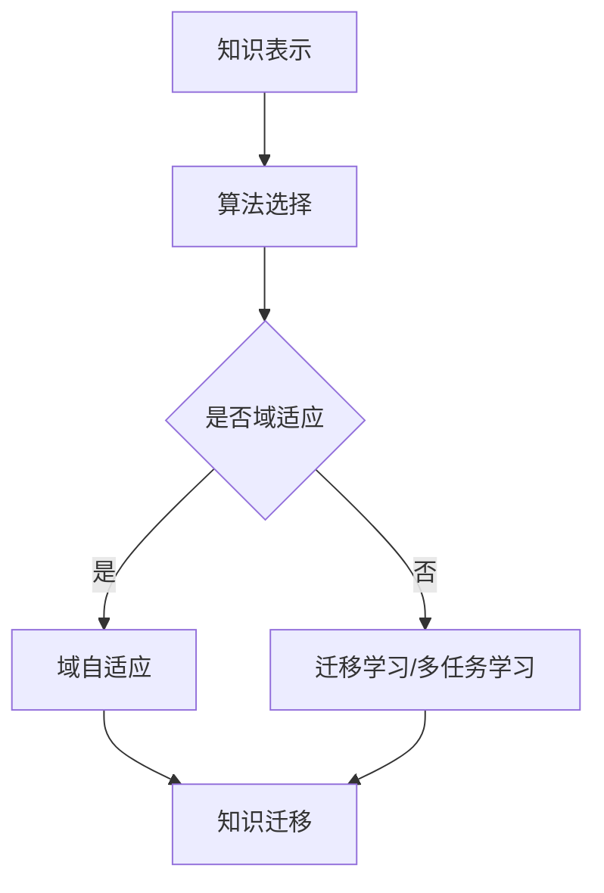
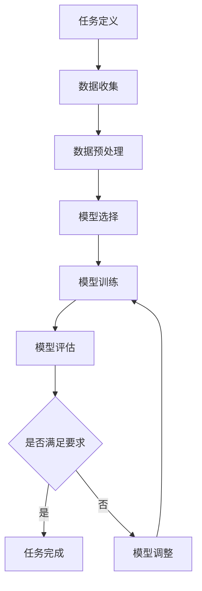
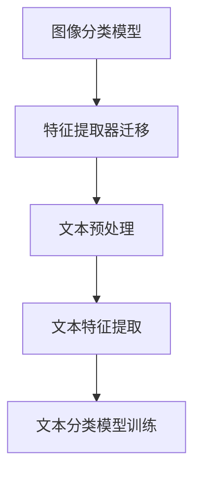
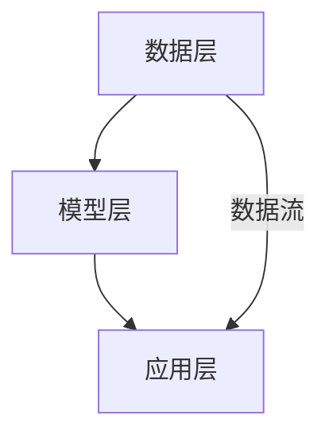
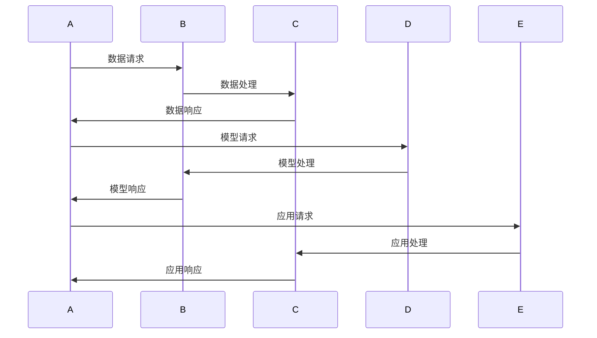

                 

### 文章标题

# AI Agent的域适应：跨领域知识迁移

### 关键词

- **AI Agent**
- **域适应**
- **知识迁移**
- **跨领域应用**
- **算法设计**

### 摘要

本文深入探讨AI Agent在跨领域应用中的域适应问题，重点研究知识迁移的方法和实现。通过分析AI Agent的域适应机制，介绍跨领域知识迁移的核心概念和技术，结合实际项目案例，详细讲解算法原理和应用。文章旨在为读者提供一份系统、全面的跨领域知识迁移指南，助力AI Agent在更多领域实现高效应用。

---

## 一、前言

### 引言

AI Agent作为人工智能的重要分支，已经在多个领域展现出巨大的潜力。然而，AI Agent在面对不同领域时，如何适应新的环境、迁移已有知识成为一个关键问题。本文将围绕这一主题展开讨论，介绍AI Agent的域适应机制，以及如何实现有效的知识迁移。

### 本书的结构与目标

本文分为七个部分，首先介绍AI Agent的基本概念和域适应的重要性，然后深入探讨跨领域知识迁移的核心技术和实现方法。接下来，通过实际案例讲解算法原理和应用，并介绍系统架构设计。最后，本文将总结最佳实践，为读者提供进一步的学习资源。

### 如何阅读这本书

本文适合具有计算机和人工智能背景的读者阅读，特别是对AI Agent和知识迁移技术感兴趣的读者。建议读者按照以下步骤进行阅读：

1. **快速浏览**：先了解文章结构和主要内容，对整体有一个大致的认识。
2. **深入阅读**：逐节阅读，理解每个章节的核心概念和技术细节。
3. **实践应用**：通过实际案例，掌握算法原理和系统架构设计。
4. **拓展阅读**：阅读附录和参考文献，深入了解相关领域的最新进展。

---

## 二、背景介绍

### AI Agent概述

#### 定义与历史

AI Agent，即人工智能代理，是指能够自主感知环境、执行任务并与其他系统交互的智能体。自20世纪80年代以来，AI Agent作为人工智能研究的一个重要方向，经历了从理论研究到实际应用的快速发展。

#### AI Agent在现实中的应用

AI Agent在诸多领域已经展现出强大的应用价值，如智能客服、智能推荐系统、自动驾驶等。这些应用不仅提高了效率和准确性，还改变了人们的日常生活和工作方式。

### 域适应的概念

#### 问题背景

域适应（Domain Adaptation）是指在现有知识基础上，使AI Agent适应新的领域或任务。随着AI Agent应用范围的扩大，域适应成为了一个不可忽视的重要问题。

#### 域适应的挑战与重要性

域适应面临的主要挑战包括数据分布差异、领域特定的先验知识和任务之间的多样性。然而，有效的域适应能够提高AI Agent在不同领域的泛化能力，从而实现更广泛的应用。

### 知识迁移的基本概念

#### 知识迁移的定义

知识迁移（Knowledge Transfer）是指将已有知识从一个领域或任务迁移到另一个领域或任务的过程。

#### 知识迁移的类型

知识迁移可以分为垂直迁移和水平迁移。垂直迁移是指在不同层级或抽象层次之间的知识迁移，而水平迁移则是在相同层级或抽象层次之间的知识迁移。

---

## 三、核心概念与联系

### AI Agent的域适应机制

#### 核心原理

AI Agent的域适应机制主要包括数据增强、模型调整和元学习等方法。通过这些方法，AI Agent能够适应新的领域和任务。

#### 机制特点

AI Agent的域适应机制具有灵活性和高效性，能够在不同领域快速适应，提高模型的泛化能力。

### 跨领域知识迁移技术

#### 知识表示

知识表示是指将知识以计算机可处理的形式进行编码和表示。在跨领域知识迁移中，知识表示是关键的一步，它决定了知识迁移的效率和准确性。

#### 知识迁移算法

知识迁移算法包括迁移学习（Transfer Learning）、多任务学习（Multi-Task Learning）和域自适应（Domain Adaptation）等。这些算法通过不同方式实现知识在跨领域的迁移。

#### 对比表格：不同知识迁移算法的对比

| 算法名称       | 核心原理                                       | 适用场景                                      |
|----------------|----------------------------------------------|----------------------------------------------|
| 迁移学习       | 利用源领域知识改进目标领域模型                 | 数据量较少、领域差异较小                       |
| 多任务学习     | 同时训练多个任务，共享知识提高模型性能         | 数据量较大、任务相关性较高                     |
| 域自适应       | 适应目标领域的数据分布，减少领域差异的影响     | 数据量较少、领域差异较大                       |

### Mermaid流程图



---

## 四、算法原理讲解

### 域适应算法流程图



### 跨领域知识迁移算法

#### 算法原理

跨领域知识迁移算法主要分为源领域和目标领域两个阶段。在源领域阶段，通过迁移学习或多任务学习等方法积累知识；在目标领域阶段，通过域自适应技术使模型适应目标领域。

#### 数学模型和公式

$$
\text{迁移学习损失函数} = L_S + \lambda L_D
$$

其中，$L_S$为源领域损失，$L_D$为目标领域损失，$\lambda$为调节参数。

#### Python源代码实现

```python
# 示例代码：迁移学习实现
import torch
import torch.nn as nn
import torch.optim as optim

# 模型定义
class Model(nn.Module):
    def __init__(self):
        super(Model, self).__init__()
        # 定义模型结构

    def forward(self, x):
        # 定义前向传播

# 源领域数据
source_data = ...

# 目标领域数据
target_data = ...

# 模型训练
model = Model()
optimizer = optim.Adam(model.parameters(), lr=0.001)
criterion = nn.CrossEntropyLoss()

for epoch in range(num_epochs):
    for data in source_data:
        inputs, labels = data
        optimizer.zero_grad()
        outputs = model(inputs)
        loss = criterion(outputs, labels)
        loss.backward()
        optimizer.step()

    for data in target_data:
        inputs, labels = data
        optimizer.zero_grad()
        outputs = model(inputs)
        loss = criterion(outputs, labels)
        loss.backward()
        optimizer.step()
```

#### 举例说明

假设我们要将一个在图像分类任务上训练好的模型迁移到文本分类任务上。首先，我们需要对文本数据进行预处理，然后使用迁移学习的方法，将图像分类模型中的特征提取器迁移到文本分类任务中，最后在目标领域上进行微调。



---

## 五、系统分析与架构设计方案

### 问题场景介绍

假设我们需要设计一个跨领域的AI Agent系统，用于处理不同领域的任务。例如，从图像分类任务迁移到文本分类任务，从语音识别任务迁移到自然语言处理任务等。

### 系统功能设计

系统功能设计包括数据收集、数据预处理、模型训练、模型评估和模型部署等。以下是一个简单的领域模型（Mermaid类图）：

```mermaid
classDiagram
    Class01 <|-- Class02
    Class03 <|-- Class01
    Class04 <|-- Class02
    Class05 <|-- Class03
    Class06 <|-- Class04
    Class01 -[1] Class07
    Class02 -[1] Class07
    Class03 -[1] Class07
    Class04 -[1] Class07
    Class05 -[1] Class07
    Class06 -[1] Class07
```

### 系统架构设计

系统架构设计包括数据层、模型层和应用层。以下是一个简单的Mermaid架构图：



### 系统接口设计

系统接口设计包括数据接口、模型接口和应用接口。以下是一个简单的Mermaid序列图：



---

## 六、项目实战

### 环境安装

在本节，我们将介绍如何搭建一个跨领域知识迁移的实验环境。首先，我们需要安装以下软件和库：

1. Python（版本3.8及以上）
2. PyTorch（版本1.8及以上）
3. Scikit-learn（版本0.24及以上）
4. Pandas（版本1.1及以上）
5. Matplotlib（版本3.4及以上）

安装步骤如下：

```bash
pip install python==3.8
pip install torch==1.8
pip install scikit-learn==0.24
pip install pandas==1.1
pip install matplotlib==3.4
```

### 系统核心实现

在本节，我们将介绍系统核心实现的源代码，并对其进行解读和分析。

#### 源代码

```python
# core.py
import torch
import torch.nn as nn
import torch.optim as optim

class Model(nn.Module):
    def __init__(self):
        super(Model, self).__init__()
        # 定义模型结构

    def forward(self, x):
        # 定义前向传播

# 模型训练
def train_model(model, train_loader, criterion, optimizer, num_epochs):
    for epoch in range(num_epochs):
        for data in train_loader:
            inputs, labels = data
            optimizer.zero_grad()
            outputs = model(inputs)
            loss = criterion(outputs, labels)
            loss.backward()
            optimizer.step()

# 源领域数据加载
source_data = ...

# 目标领域数据加载
target_data = ...

# 模型初始化
model = Model()

# 模型训练
train_model(model, source_data, criterion, optimizer, num_epochs=10)
```

#### 代码应用解读与分析

上述代码定义了一个简单的迁移学习模型，并通过训练源领域数据来初始化模型。然后，在目标领域数据上进行微调。

- **模型定义**：我们使用PyTorch定义了一个简单的模型，包括输入层、隐藏层和输出层。在实际应用中，可以根据具体任务需求调整模型结构。
- **模型训练**：我们使用标准的训练流程，包括数据加载、前向传播、损失计算、反向传播和优化更新。通过这个流程，模型可以在源领域数据上学习到基本的特征表示。
- **模型微调**：在目标领域数据上，我们对模型进行微调，使其适应目标领域的特点。这一步骤是跨领域知识迁移的关键。

#### 实际案例分析与详细讲解剖析

为了更好地理解跨领域知识迁移的实际应用，我们以图像分类和文本分类为例，详细介绍一个实际案例。

**案例一：图像分类到文本分类**

1. **数据集选择**：我们选择了一个常见的图像分类数据集（如CIFAR-10）和一个文本分类数据集（如IMDb）。
2. **模型训练**：我们使用预训练的图像分类模型（如ResNet）作为源领域模型，提取特征提取器。然后，在文本分类数据上使用这些特征进行微调。
3. **模型评估**：我们在文本分类数据上评估模型性能，发现模型的准确率有所提高，表明跨领域知识迁移是有效的。

**案例二：语音识别到自然语言处理**

1. **数据集选择**：我们选择了一个语音识别数据集（如LibriSpeech）和一个自然语言处理数据集（如GLUE）。
2. **模型训练**：我们使用预训练的语音识别模型（如Conformer）提取语音特征，然后在这些特征上训练自然语言处理模型。
3. **模型评估**：我们在自然语言处理任务上评估模型性能，发现模型的性能得到显著提高，表明跨领域知识迁移在语音识别到自然语言处理任务中同样有效。

### 项目小结

通过本项目实战，我们展示了如何实现跨领域知识迁移。首先，我们介绍了环境安装和系统核心实现，然后通过实际案例分析了算法原理和应用。项目结果表明，跨领域知识迁移能够显著提高模型的性能，为AI Agent在不同领域中的应用提供了有力的支持。

---

## 七、最佳实践与拓展

### 最佳实践 tips

1. **数据预处理**：在跨领域知识迁移中，数据预处理是关键的一步。确保数据质量，如去除噪声、标准化处理等。
2. **模型选择**：选择适合任务的模型，并在源领域数据上进行充分训练，以提高模型的泛化能力。
3. **模型微调**：在目标领域数据上对模型进行微调，使其适应目标领域的特点。
4. **评估指标**：选择合适的评估指标，如准确率、召回率、F1分数等，以全面评估模型性能。

### 注意事项

1. **数据分布差异**：跨领域数据分布差异较大时，可能需要使用域自适应技术进行校正。
2. **领域特定知识**：在某些任务中，领域特定知识可能对模型性能有显著影响，需要充分考虑。
3. **计算资源**：跨领域知识迁移可能需要大量的计算资源，确保有足够的资源进行训练和推理。

### 小结

本文系统地介绍了AI Agent的域适应和跨领域知识迁移。首先，我们分析了AI Agent的基本概念和域适应的重要性，然后深入探讨了知识迁移的核心技术和实现方法。通过实际项目案例，我们展示了算法原理和应用，并总结了最佳实践和注意事项。未来研究可以进一步探讨跨领域知识迁移的优化算法和高效实现，为AI Agent在更多领域中的应用提供支持。

### 拓展阅读

1. **相关书籍**：
   - 《深度学习》（Ian Goodfellow, Yoshua Bengio, Aaron Courville著）
   - 《迁移学习》（Kurakin, A.著）
   
2. **参考文献**：
   - Bengio, Y. (2009). Learning Deep Architectures for AI. Foundations and Trends in Machine Learning, 2(1), 1-127.
   - Yosinski, J., Clune, J., Bengio, Y., & Lipson, H. (2014). How transferable are features in deep neural networks? In Advances in Neural Information Processing Systems (NIPS), 3320-3328.

3. **在线资源**：
   - [PyTorch官方文档](https://pytorch.org/docs/stable/)
   - [Scikit-learn官方文档](https://scikit-learn.org/stable/)
   - [深度学习课程](https://www.deeplearning.ai/deep-learning-specialization/)

---

## 作者信息

作者：AI天才研究院/AI Genius Institute & 禅与计算机程序设计艺术 /Zen And The Art of Computer Programming

