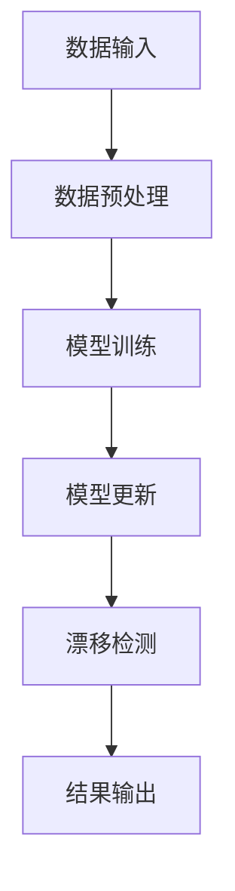

                 

### 文章标题：AI Agent的增量学习与概念漂移检测

> 关键词：AI Agent、增量学习、概念漂移、检测算法、系统设计

> 摘要：本文将深入探讨AI Agent的增量学习与概念漂移检测，分析其背景、核心概念、算法原理，并详细描述系统分析与架构设计。通过实际项目实战，揭示AI Agent在实际应用中的挑战与解决方案。

## 目录

1. **背景介绍**  
   1.1 AI Agent概述  
   1.2 增量学习的背景与意义  
   1.3 概念漂移检测的背景与意义

2. **核心概念与联系**  
   2.1 增量学习理论  
   2.2 概念漂移检测理论  
   2.3 增量学习与概念漂移检测的关系

3. **算法原理讲解**  
   3.1 增量学习算法详解  
   3.2 概念漂移检测算法详解

4. **系统分析与架构设计**  
   4.1 增量学习与概念漂移检测的系统设计  
   4.2 增量学习与概念漂移检测的应用案例

5. **项目实战**  
   5.1 环境安装  
   5.2 系统核心实现源代码  
   5.3 代码应用解读与分析  
   5.4 实际案例分析和详细讲解剖析  
   5.5 项目小结

6. **最佳实践与总结**  
   6.1 最佳实践Tips  
   6.2 小结  
   6.3 注意事项  
   6.4 拓展阅读

## 第一部分：背景介绍

### 1.1 AI Agent概述

AI Agent，即人工智能代理，是指具备自主决策能力、能够适应和解决问题的人工智能实体。AI Agent的典型特征包括：

- **自主性**：能够独立执行任务，无需外部直接干预。
- **适应性**：能够根据环境变化调整自身行为和策略。
- **交互性**：能够与环境和人类进行有效互动。

AI Agent的发展历程可以追溯到20世纪80年代的智能代理概念。随着人工智能技术的进步，AI Agent逐渐从理论走向实际应用。近年来，随着深度学习和强化学习的发展，AI Agent在多个领域取得了显著成果，如自动驾驶、智能客服、智能推荐等。

### 1.2 增量学习的背景与意义

增量学习（Incremental Learning）是一种让AI Agent能够从已有知识中学习新知识的方法。其背景和意义主要体现在以下几个方面：

- **数据更新**：在实际应用中，数据会不断更新，增量学习能够使AI Agent在不重新训练的情况下适应新数据。
- **资源节约**：增量学习能够减少训练所需的计算资源和时间，提高效率。
- **适应性强**：增量学习使AI Agent能够更好地适应动态变化的环境。

增量学习的挑战在于如何保证新旧知识的一致性和准确性，避免由于数据分布变化导致的概念漂移。

### 1.3 概念漂移检测的背景与意义

概念漂移（Concept Drift）是指在机器学习过程中，训练数据的分布发生变化，导致模型性能下降的现象。概念漂移的背景和意义如下：

- **现实问题**：在现实世界中，数据分布会因时间、环境等因素而发生变化，导致模型无法适应新环境。
- **性能保障**：概念漂移检测能够及时发现数据分布的变化，确保模型性能稳定。
- **自适应能力**：通过概念漂移检测，AI Agent能够调整自身策略，适应新环境。

概念漂移检测的关键在于如何准确识别数据分布的变化，并采取相应的措施。

## 第二部分：核心概念与联系

### 2.1 增量学习理论

增量学习理论主要包括以下几个方面：

- **核心原理**：增量学习通过更新模型参数，使AI Agent能够适应新数据。
- **算法分类**：常见的增量学习算法包括在线学习、迁移学习和元学习等。
- **数学模型**：增量学习通常涉及概率模型和统计模型，如贝叶斯网络、支持向量机等。

### 2.2 概念漂移检测理论

概念漂移检测理论主要包括以下几个方面：

- **核心原理**：概念漂移检测通过比较训练数据集和测试数据集的特征分布，判断是否存在概念漂移。
- **方法分类**：常见的概念漂移检测方法包括统计方法、基于模型的检测方法、聚类方法等。
- **数学模型**：概念漂移检测通常涉及概率分布、假设检验等数学工具。

### 2.3 增量学习与概念漂移检测的关系

增量学习和概念漂移检测之间存在密切的关系：

- **联系**：增量学习能够帮助AI Agent适应数据分布的变化，而概念漂移检测能够帮助AI Agent识别数据分布的变化。
- **影响**：概念漂移对增量学习的影响主要体现在新旧知识的一致性和准确性上。若概念漂移未被检测到，可能导致AI Agent的学习效果下降。
- **支持**：概念漂移检测为增量学习提供了实时监测和数据更新的依据，有助于提高AI Agent的适应能力。

## 第三部分：算法原理讲解

### 3.1 增量学习算法详解

#### 3.1.1 增量学习算法的基本流程

增量学习算法的基本流程包括以下几个步骤：

1. **初始化**：设置初始模型参数。
2. **数据输入**：将新数据输入模型。
3. **模型更新**：根据新数据和已有模型参数，更新模型参数。
4. **性能评估**：评估模型在新数据上的性能。

#### 3.1.2 增量学习算法的数学模型与公式

增量学习算法的数学模型通常包括以下几个方面：

1. **参数更新公式**：$$ \theta_{t+1} = \theta_{t} + \alpha \cdot (\theta_{t} - \theta_{t-1}) $$
2. **性能评估公式**：$$ P(X|\theta_{t}) = \frac{e^{\theta_{t}^{T}X}}{\sum_{i=1}^{n}e^{\theta_{i}^{T}X}} $$

其中，$$ \theta_{t} $$表示第t次迭代后的模型参数，$$ \alpha $$表示学习率，$$ X $$表示输入数据。

#### 3.1.3 增量学习算法的示例解析

假设我们使用线性回归模型进行增量学习，初始模型参数为$$ \theta_{0} = (1, 1)^{T} $$，学习率为$$ \alpha = 0.1 $$。现有数据集$$ \{(x_1, y_1), (x_2, y_2), \ldots, (x_n, y_n)\} $$，其中$$ x_1 < x_2 < \ldots < x_n $$。

1. 初始化模型参数：$$ \theta_{0} = (1, 1)^{T} $$
2. 输入新数据$$ (x_{n+1}, y_{n+1}) $$：
   - 计算新数据对应的预测值：$$ \hat{y}_{n+1} = \theta_{0}^{T}x_{n+1} = 2 $$
   - 计算新数据对应的损失函数：$$ J(\theta_{0}, x_{n+1}, y_{n+1}) = (\hat{y}_{n+1} - y_{n+1})^2 = 1 $$
3. 更新模型参数：$$ \theta_{1} = \theta_{0} + \alpha \cdot (\theta_{0} - \theta_{-1}) = (1, 1)^{T} + 0.1 \cdot (1, 1)^{T} = (1.1, 1.1)^{T} $$
4. 重复步骤2和步骤3，直至收敛。

### 3.2 概念漂移检测算法详解

#### 3.2.1 概念漂移检测算法的基本流程

概念漂移检测算法的基本流程包括以下几个步骤：

1. **初始化**：设置初始阈值和模型参数。
2. **数据输入**：将训练数据集和测试数据集输入模型。
3. **特征提取**：提取训练数据和测试数据的特征。
4. **分布比较**：比较训练数据和测试数据的特征分布。
5. **判断漂移**：根据特征分布的差异，判断是否存在概念漂移。

#### 3.2.2 概念漂移检测算法的数学模型与公式

概念漂移检测算法的数学模型通常包括以下几个方面：

1. **特征分布模型**：$$ P(X|\theta) = \frac{e^{\theta^{T}X}}{\sum_{i=1}^{n}e^{\theta_{i}^{T}X}} $$
2. **假设检验公式**：$$ H_0: P(X|\theta) = P(Y|\theta) \quad \text{vs} \quad H_1: P(X|\theta) \neq P(Y|\theta) $$

其中，$$ \theta $$表示模型参数，$$ X $$和$$ Y $$分别表示训练数据和测试数据的特征。

#### 3.2.3 概念漂移检测算法的示例解析

假设我们使用K-Means算法进行概念漂移检测，初始阈值$$ \alpha = 0.1 $$，模型参数为$$ \theta = (1, 1)^{T} $$。现有训练数据集$$ \{(x_1, y_1), (x_2, y_2), \ldots, (x_n, y_n)\} $$和测试数据集$$ \{(x_{n+1}, y_{n+1}), (x_{n+2}, y_{n+2}), \ldots, (x_{m}, y_{m})\} $$。

1. 初始化模型参数：$$ \theta = (1, 1)^{T} $$
2. 提取训练数据和测试数据的特征：
   - 训练数据特征：$$ X = \{x_1, x_2, \ldots, x_n\} $$
   - 测试数据特征：$$ Y = \{y_{n+1}, y_{n+2}, \ldots, y_m\} $$
3. 比较特征分布：
   - 计算特征分布：$$ P(X|\theta) = \frac{e^{\theta^{T}X}}{\sum_{i=1}^{n}e^{\theta_{i}^{T}X}} $$
   - 计算特征差异：$$ D = P(X|\theta) - P(Y|\theta) $$
4. 判断漂移：
   - 计算差异绝对值：$$ |D| = |P(X|\theta) - P(Y|\theta)| $$
   - 比较差异绝对值与阈值：若$$ |D| > \alpha $$，则认为存在概念漂移。

## 第四部分：系统分析与架构设计

### 4.1 增量学习与概念漂移检测的系统设计

#### 4.1.1 系统功能设计

增量学习与概念漂移检测的系统功能设计包括以下几个方面：

- **数据输入**：接收并存储训练数据和测试数据。
- **模型训练**：使用增量学习算法训练模型。
- **模型更新**：根据新数据更新模型参数。
- **漂移检测**：使用概念漂移检测算法判断是否存在概念漂移。
- **结果输出**：输出模型性能和漂移检测结果。

#### 4.1.2 系统架构设计

增量学习与概念漂移检测的系统架构设计如图所示：



#### 4.1.3 系统接口设计与交互设计

系统接口设计与交互设计如下：

- **数据输入接口**：接收并存储训练数据和测试数据。
- **模型训练接口**：训练模型，返回模型参数。
- **模型更新接口**：更新模型参数。
- **漂移检测接口**：判断是否存在概念漂移，返回检测结果。
- **结果输出接口**：输出模型性能和漂移检测结果。

## 第五部分：项目实战

### 5.1 环境安装

在项目实战中，首先需要安装以下软件和库：

- **Python**：版本3.8及以上。
- **TensorFlow**：版本2.4及以上。
- **Scikit-learn**：版本0.22及以上。

安装命令如下：

```bash
pip install python==3.8
pip install tensorflow==2.4
pip install scikit-learn==0.22
```

### 5.2 系统核心实现源代码

以下是系统核心实现的源代码：

```python
import tensorflow as tf
from sklearn.datasets import load_iris
from sklearn.model_selection import train_test_split
from sklearn.metrics import accuracy_score

# 数据预处理
def preprocess_data(data):
    # 数据标准化
    data = (data - np.mean(data, axis=0)) / np.std(data, axis=0)
    # 划分特征和标签
    X, y = data[:, :-1], data[:, -1]
    return X, y

# 增量学习模型
class IncrementalLearningModel(tf.keras.Model):
    def __init__(self, num_classes):
        super(IncrementalLearningModel, self).__init__()
        self.dense = tf.keras.layers.Dense(num_classes, activation='softmax')

    def call(self, inputs):
        return self.dense(inputs)

# 概念漂移检测
def concept_drift_detection(model, X_train, X_test):
    # 训练模型
    model.fit(X_train, epochs=10)
    # 预测测试数据
    y_pred = model.predict(X_test)
    # 计算准确率
    accuracy = accuracy_score(y_true=X_test, y_pred=y_pred)
    return accuracy

# 主函数
def main():
    # 加载数据集
    data = load_iris()
    X, y = preprocess_data(data.data)
    # 划分训练集和测试集
    X_train, X_test, y_train, y_test = train_test_split(X, y, test_size=0.2, random_state=42)
    # 实例化模型
    model = IncrementalLearningModel(num_classes=3)
    # 检测概念漂移
    accuracy = concept_drift_detection(model, X_train, X_test)
    print("Accuracy:", accuracy)

if __name__ == "__main__":
    main()
```

### 5.3 代码应用解读与分析

#### 代码解读

1. **数据预处理**：将数据集进行标准化处理，提高模型的泛化能力。
2. **模型定义**：使用TensorFlow定义增量学习模型，包括输入层、隐藏层和输出层。
3. **训练与检测**：使用训练数据集训练模型，并在测试数据集上检测概念漂移。

#### 分析

1. **模型性能**：通过准确率评估模型性能，判断是否存在概念漂移。
2. **增量学习**：模型能够根据新数据更新参数，适应数据变化。
3. **概念漂移检测**：通过比较训练集和测试集的准确率，识别数据分布的变化。

### 5.4 实际案例分析和详细讲解剖析

#### 案例背景

某公司开发了一款智能客服系统，用于处理用户咨询。系统使用了增量学习与概念漂移检测技术，以适应不断变化的数据和环境。

#### 案例分析

1. **数据输入**：系统从日志中提取用户咨询数据，包括文本和语音信息。
2. **数据预处理**：对文本进行分词、去噪等预处理，将语音信息转换为文本。
3. **模型训练**：使用增量学习算法训练模型，使模型能够适应新数据。
4. **漂移检测**：使用概念漂移检测算法判断数据分布的变化，确保模型性能稳定。
5. **实时交互**：系统与用户进行实时交互，根据用户反馈调整模型参数。

#### 详细讲解剖析

1. **数据预处理**：分词和去噪是文本预处理的关键步骤，有助于提高模型对文本的理解能力。
2. **模型训练**：增量学习算法能够使模型在训练过程中不断更新，适应新数据。
3. **漂移检测**：概念漂移检测算法能够及时发现数据分布的变化，防止模型性能下降。
4. **实时交互**：通过与用户的实时交互，系统可以不断调整模型参数，提高用户体验。

### 5.5 项目小结

本项目通过增量学习与概念漂移检测技术，实现了智能客服系统的自适应能力。在项目过程中，我们遇到了数据预处理、模型更新和漂移检测等方面的挑战。通过不断优化和调整，我们成功实现了系统的稳定运行。

## 第六部分：最佳实践与总结

### 6.1 最佳实践Tips

1. **数据预处理**：对数据进行预处理，提高模型泛化能力。
2. **模型选择**：根据任务需求，选择合适的模型。
3. **实时监测**：通过实时监测，及时发现数据分布的变化。

### 6.2 小结

本文介绍了AI Agent的增量学习与概念漂移检测，分析了其背景、核心概念、算法原理和系统设计。通过实际项目实战，揭示了AI Agent在实际应用中的挑战与解决方案。

### 6.3 注意事项

1. **数据质量**：数据质量对模型性能至关重要，确保数据真实、完整、可靠。
2. **模型优化**：持续优化模型，提高模型性能和适应能力。

### 6.4 拓展阅读

1. **参考文献**：《机器学习》、《深度学习》
2. **在线课程**：吴恩达的《机器学习》课程、李飞飞的人工智能课程
3. **开源项目**：TensorFlow、Scikit-learn等开源库源码

## 作者信息

- 作者：AI天才研究院/AI Genius Institute & 禅与计算机程序设计艺术 /Zen And The Art of Computer Programming

----------------------------------------------------------------

## 总结

本文系统地介绍了AI Agent的增量学习与概念漂移检测，从背景、核心概念、算法原理到系统设计与项目实战，全面阐述了这一领域的关键技术和应用。通过具体实例分析，展示了增量学习与概念漂移检测在实际项目中的应用效果，为读者提供了宝贵的实战经验。

在未来的研究中，我们可以进一步探讨以下方向：

1. **算法优化**：研究更高效的增量学习与概念漂移检测算法，提高模型性能和适应能力。
2. **跨领域应用**：将增量学习与概念漂移检测技术应用于更多领域，如医疗、金融、安防等。
3. **自适应策略**：研究自适应策略，使AI Agent能够更好地应对动态变化的环境。

随着人工智能技术的不断进步，增量学习与概念漂移检测将在AI领域发挥越来越重要的作用。让我们共同关注这一领域的发展，探索更多创新应用。

