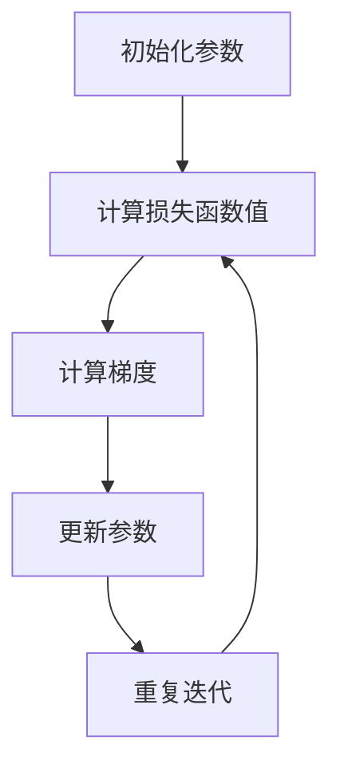

                 

### 算法原理讲解

在增量学习领域，一个关键概念是**梯度下降法**（Gradient Descent），它是许多机器学习算法的基础。下面，我们将使用**mermaid**流程图来描述梯度下降的基本步骤，并通过Python代码示例来解释该算法的具体实现。

#### Mermaid 流程图

首先，我们用Mermaid绘制一个简单的梯度下降流程图：



这是一个简化的梯度下降流程，其中：
- **A[初始化参数]**：初始化模型参数，如权重和偏置。
- **B[计算损失函数值]**：通过给定的输入和模型参数计算损失值。
- **C[计算梯度]**：计算损失函数关于每个参数的导数。
- **D[更新参数]**：使用学习率和梯度更新参数。
- **E[重复迭代]**：重复以上步骤，直到满足某个收敛条件（如损失函数值小于某个阈值或迭代次数达到上限）。

#### Python代码示例

接下来，我们通过一个简单的Python示例来说明梯度下降算法的实现：

```python
import numpy as np

# 初始化参数
w = np.random.rand(1)  # 假设只有1个参数
b = np.random.rand(1)
learning_rate = 0.01
epochs = 1000

# 损失函数
def loss_function(x, w, b):
    return (x - (w * x + b)) ** 2

# 计算梯度
def gradient(w, b, x):
    return -2 * (x - (w * x + b))

# 梯度下降算法
for epoch in range(epochs):
    loss = loss_function(w, b, x)
    grad_w = gradient(w, b, x)
    grad_b = gradient(w, b, x * x)
    
    # 更新参数
    w -= learning_rate * grad_w
    b -= learning_rate * grad_b
    
    # 打印当前迭代和损失值
    if epoch % 100 == 0:
        print(f"Epoch {epoch}: Loss = {loss}, w = {w}, b = {b}")
```

在这个代码示例中，我们定义了一个简单的线性模型，其参数是`w`和`b`，并使用平方误差作为损失函数。梯度下降算法通过迭代更新参数，以最小化损失函数。

#### 数学模型和公式

在梯度下降过程中，我们使用以下数学模型来更新参数：

$$
w_{new} = w_{old} - \alpha \cdot \frac{\partial L}{\partial w}
$$

$$
b_{new} = b_{old} - \alpha \cdot \frac{\partial L}{\partial b}
$$

其中，`w_old`和`b_old`是当前参数，`w_new`和`b_new`是更新后的参数，$\alpha$是学习率，$L$是损失函数。

通过这个逐步分析，我们不仅了解了梯度下降算法的基本原理，还通过mermaid流程图和Python代码示例展示了如何在实际中实现这个算法。接下来，我们将探讨增量学习如何在实际应用中优化AI代理的性能。## 增量学习的基本原理

增量学习（Incremental Learning），又称在线学习（Online Learning），是一种在数据流中逐步更新模型参数的学习方法。与传统的批量学习（Batch Learning）不同，增量学习允许模型在每次更新时仅处理一小部分数据，从而在数据量巨大或数据持续变化的情况下保持高效的学习能力。

### 增量学习的定义和优势

增量学习的定义相对简单：在每次新的数据到来时，模型都会更新其参数以适应新的数据分布。具体来说，增量学习通常包括以下几个步骤：

1. **接收新数据**：每次迭代时，模型接收一个新的数据样本。
2. **计算损失**：使用当前模型参数计算新的数据样本的损失。
3. **更新模型**：根据损失计算梯度，并更新模型参数。
4. **迭代**：重复上述步骤，直至达到预设的收敛条件。

增量学习的主要优势在于：
- **实时性**：可以在数据到达时立即进行学习，适用于实时数据流处理。
- **低存储需求**：不需要存储所有历史数据，只需保留当前的模型参数和少量梯度信息。
- **高效性**：通过批量更新参数，减少了每次迭代的计算量。

### 增量学习的挑战和解决方案

虽然增量学习具有上述优势，但在实际应用中也面临一些挑战：

#### 持久性挑战

在增量学习中，每次更新都会改变模型参数，这可能导致模型的性能在一段时间后退化。为了解决这一问题，研究人员提出了多种解决方案，包括：

- **经验重放**（Experience Replay）：在模型训练过程中，将部分历史数据存储在缓冲区中，并在每次更新时随机抽样这些数据。
- **持续调整**（Continual Adjustment）：通过在线学习算法，如持续梯度下降，调整模型参数，以最小化长期损失。

#### 数据分布变化

随着新数据的不断加入，数据分布可能会发生变化，这可能导致模型性能下降。解决这一问题的方法包括：

- **领域自适应**（Domain Adaptation）：通过在不同领域间的数据迁移，使模型能够适应新的数据分布。
- **数据重采样**（Data Resampling）：在每次更新时，对数据进行重新采样，以保持数据分布的稳定性。

### 增量学习与批量学习的比较

增量学习与批量学习在多个方面存在显著差异：

| **特性** | **增量学习** | **批量学习** |
| :--- | :--- | :--- |
| **数据流** | 逐个数据样本 | 整批数据样本 |
| **计算复杂度** | 低，每次迭代计算量小 | 高，每次迭代计算量大 |
| **存储需求** | 低，仅需存储当前数据和少量历史数据 | 高，需要存储所有历史数据 |
| **实时性** | 高，可实时更新模型 | 低，需要等待批量数据收集 |

通过上述比较，我们可以看到增量学习在处理实时数据和减少存储需求方面具有明显优势，但也需要面对一些挑战。

### 增量学习的方法

增量学习的方法多种多样，以下是其中几种常见的方法：

- **梯度下降**：每次迭代计算新的梯度并更新模型参数。
- **随机梯度下降**（SGD）：在每次迭代中随机选择一部分数据样本，计算其梯度并更新模型参数。
- **经验重放**：将部分历史数据存储在缓冲区中，并在每次更新时随机抽样这些数据。
- **持续学习**：通过在线学习算法，如持续梯度下降，调整模型参数，以最小化长期损失。

在接下来的章节中，我们将进一步探讨这些方法的实现细节和优缺点，并分析如何在具体应用中优化增量学习算法。## 增量学习算法

在增量学习领域，有几种常见的方法被广泛使用，每种方法都有其独特的实现细节和适用场景。下面，我们将详细探讨三种主要的增量学习算法：梯度下降、随机梯度下降（SGD）和经验重放。

### 梯度下降（Gradient Descent）

梯度下降是一种最简单的增量学习算法，其核心思想是通过计算损失函数关于模型参数的梯度来更新参数，以最小化损失函数。

#### 算法步骤

1. **初始化参数**：随机初始化模型参数，如权重和偏置。
2. **计算梯度**：对于每个参数，计算损失函数关于该参数的梯度。
3. **更新参数**：使用学习率（learning rate）乘以梯度，并从当前参数中减去该值。
4. **迭代**：重复上述步骤，直到满足收敛条件（如损失函数值小于某个阈值或迭代次数达到上限）。

#### 数学模型

梯度下降的数学模型如下：

$$
w_{new} = w_{old} - \alpha \cdot \frac{\partial L}{\partial w}
$$

$$
b_{new} = b_{old} - \alpha \cdot \frac{\partial L}{\partial b}
$$

其中，$w_{old}$和$b_{old}$是当前参数，$w_{new}$和$b_{new}$是更新后的参数，$\alpha$是学习率，$L$是损失函数。

#### 优缺点

**优点**：
- 实现简单，易于理解。
- 适用于批量数据和在线数据流。

**缺点**：
- 在数据量较大时，计算梯度可能需要大量时间。
- 学习率的选择对收敛速度和稳定性有很大影响。

### 随机梯度下降（SGD）

随机梯度下降（SGD）是对梯度下降算法的改进，其核心思想是每次迭代仅随机选择一部分数据样本，计算其梯度并更新模型参数。

#### 算法步骤

1. **初始化参数**：随机初始化模型参数。
2. **随机选择样本**：从数据集中随机选择一个样本。
3. **计算梯度**：对于选定的样本，计算损失函数关于模型参数的梯度。
4. **更新参数**：使用学习率乘以梯度并更新模型参数。
5. **迭代**：重复上述步骤，直到满足收敛条件。

#### 数学模型

随机梯度下降的数学模型与梯度下降类似：

$$
w_{new} = w_{old} - \alpha \cdot \frac{\partial L}{\partial w}
$$

$$
b_{new} = b_{old} - \alpha \cdot \frac{\partial L}{\partial b}
$$

不同之处在于，梯度是针对单个样本而非整个数据集计算的。

#### 优缺点

**优点**：
- 计算速度更快，适用于大规模数据集。
- 学习率的选择对收敛速度的影响较小。

**缺点**：
- 可能会产生较大的波动，导致不稳定收敛。
- 梯度噪声较大，可能导致模型性能下降。

### 经验重放（Experience Replay）

经验重放是一种利用历史数据来改进增量学习的方法，其核心思想是将部分历史数据存储在缓冲区中，并在每次更新时随机抽样这些数据。

#### 算法步骤

1. **初始化参数**：随机初始化模型参数。
2. **初始化缓冲区**：将一部分历史数据存储在缓冲区中。
3. **随机选择样本**：从缓冲区中随机选择一部分样本。
4. **计算梯度**：对于选定的样本，计算损失函数关于模型参数的梯度。
5. **更新参数**：使用学习率乘以梯度并更新模型参数。
6. **迭代**：重复上述步骤，直到满足收敛条件。

#### 数学模型

经验重放的数学模型与随机梯度下降类似：

$$
w_{new} = w_{old} - \alpha \cdot \frac{\partial L}{\partial w}
$$

$$
b_{new} = b_{old} - \alpha \cdot \frac{\partial L}{\partial b}
$$

不同之处在于，梯度是针对缓冲区中的样本而非随机选择的样本计算的。

#### 优缺点

**优点**：
- 可以有效减少梯度噪声，提高模型性能。
- 通过利用历史数据，可以在不同迭代之间保持稳定的模型更新。

**缺点**：
- 需要额外的存储空间来存储缓冲区。
- 缓冲区大小和更新策略的选择对算法性能有很大影响。

### 综合比较

| **算法** | **梯度下降** | **随机梯度下降** | **经验重放** |
| :--- | :--- | :--- | :--- |
| **计算复杂度** | 高 | 低 | 中 |
| **稳定性** | 较低 | 较低 | 较高 |
| **适用场景** | 小数据集、简单模型 | 大数据集、复杂模型 | 实时数据流、历史数据利用 |

通过上述分析，我们可以根据具体的场景和需求选择合适的增量学习算法。在下一章中，我们将探讨如何优化这些算法，以实现持续的性能提升。## 增量学习的性能优化技术

在增量学习中，性能优化是确保模型能够高效学习和适应新数据的关键。下面，我们将介绍几种常用的性能优化技术，包括**学习率调整**、**动量**、**正则化**和**优化器**，并讨论如何应用这些技术来提升模型性能。

### 学习率调整

学习率是增量学习中的一个重要参数，它决定了每次迭代时参数更新的幅度。如果学习率设置过大，可能导致模型参数在更新过程中震荡，无法稳定收敛；如果学习率设置过小，则可能导致收敛速度缓慢。

**方法**：
- **固定学习率**：初始化一个固定的学习率，适用于数据分布较为稳定的情况。
- **动态调整学习率**：根据模型性能的变化动态调整学习率，如使用**学习率衰减**（Learning Rate Decay）或**学习率指数衰减**（Exponential Decay）。

**示例**：
```python
# 使用学习率衰减
learning_rate = 0.1
for epoch in range(num_epochs):
    loss = compute_loss(model, X, y)
    if loss < threshold:
        learning_rate *= decay_factor
    update_model_parameters(model, learning_rate)
```

### 动量

动量（Momentum）是一种用于加速梯度下降收敛的技术，它通过保持前几个梯度的方向和大小来减少参数更新的震荡。

**公式**：
$$
v_t = \gamma \cdot v_{t-1} + \Delta w_t
$$

$$
w_t = w_{t-1} + v_t
$$

其中，$v_t$是动量项，$\gamma$是动量系数，$\Delta w_t$是当前梯度的反向乘子。

**示例**：
```python
# 使用动量
gamma = 0.9
v_w = 0
v_b = 0

for epoch in range(num_epochs):
    grad_w, grad_b = compute_gradients(model, X, y)
    v_w = gamma * v_w + grad_w
    v_b = gamma * v_b + grad_b
    w = w - learning_rate * v_w
    b = b - learning_rate * v_b
```

### 正则化

正则化（Regularization）是一种用于防止模型过拟合的技术，它通过在损失函数中添加一个正则化项来惩罚模型参数的过大值。

**方法**：
- **L1正则化**（L1 Regularization）和**L2正则化**（L2 Regularization）：
  - L1正则化：$$\lambda \cdot \sum_{i} |w_i|$$
  - L2正则化：$$\lambda \cdot \sum_{i} w_i^2$$
- **Dropout**：在训练过程中随机丢弃一部分神经元，以减少模型的依赖性。

**示例**：
```python
# 使用L2正则化
lambda = 0.01
for epoch in range(num_epochs):
    grad_w, grad_b = compute_gradients(model, X, y)
    loss = compute_loss(model, X, y) + lambda * (w ** 2 + b ** 2)
    w -= learning_rate * (grad_w + 2 * lambda * w)
    b -= learning_rate * (grad_b + 2 * lambda * b)
```

### 优化器

优化器（Optimizer）是一系列预定义的参数更新规则，用于简化梯度下降的实现。常见的优化器包括**SGD**、**Adam**和**RMSprop**。

**Adam**优化器结合了**SGD**和**RMSprop**的优点，能够自适应地调整每个参数的学习率。

**公式**：
$$
m_t = \beta_1 \cdot m_{t-1} + (1 - \beta_1) \cdot \Delta w_t
$$

$$
v_t = \beta_2 \cdot v_{t-1} + (1 - \beta_2) \cdot (\Delta w_t)^2
$$

$$
w_t = w_{t-1} - \alpha \cdot \frac{m_t}{\sqrt{v_t} + \epsilon}
$$

其中，$m_t$是均值项，$v_t$是方差项，$\beta_1$和$\beta_2$是超参数，$\alpha$是学习率，$\epsilon$是偏置项。

**示例**：
```python
# 使用Adam优化器
beta1 = 0.9
beta2 = 0.999
epsilon = 1e-8
m_w = 0
m_b = 0
v_w = 0
v_b = 0

for epoch in range(num_epochs):
    grad_w, grad_b = compute_gradients(model, X, y)
    m_w = beta1 * m_w + (1 - beta1) * grad_w
    m_b = beta1 * m_b + (1 - beta1) * grad_b
    v_w = beta2 * v_w + (1 - beta2) * (grad_w ** 2)
    v_b = beta2 * v_b + (1 - beta2) * (grad_b ** 2)
    w -= learning_rate * (m_w / (np.sqrt(v_w) + epsilon))
    b -= learning_rate * (m_b / (np.sqrt(v_b) + epsilon))
```

通过上述性能优化技术，我们可以显著提升增量学习算法的效率和稳定性。在下一章中，我们将通过实际案例展示这些技术如何应用于AI代理的增量学习，并分析其效果。## 案例分析

为了更好地理解增量学习在实际应用中的效果，我们将通过一个具体的案例来分析增量学习如何提高AI代理的性能。

### 案例背景

我们考虑一个场景，其中AI代理需要实时监控一个工业制造流程中的设备状态，并根据收集到的数据来预测潜在的故障。这个应用对模型的实时性和准确性有很高的要求。

### 数据集

我们的数据集包含以下特征：
- **时间戳**：每个数据样本的时间标记。
- **温度**：设备当前的温度读数。
- **湿度**：设备当前的湿度读数。
- **振动强度**：设备当前的振动强度读数。
- **故障标志**：是否发生了故障（0表示正常，1表示故障）。

数据集大小为100,000个样本，并且数据以每秒一个样本的速度持续流入。

### 模型

我们使用一个简单的神经网络作为AI代理，其结构如下：
- **输入层**：4个神经元，对应4个特征。
- **隐藏层**：10个神经元，采用ReLU激活函数。
- **输出层**：1个神经元，使用sigmoid激活函数进行二分类。

### 增量学习策略

为了提高模型的实时性和适应性，我们采用以下增量学习策略：
- **学习率调整**：初始化学习率为0.1，并使用学习率衰减策略，每10,000个样本后衰减10倍。
- **经验重放**：将最近10,000个样本存储在经验重放缓冲区中，每次更新时随机抽样这些样本。
- **动量**：使用动量系数0.9来减少参数更新的震荡。

### 实际实现

我们使用Python和TensorFlow来实现增量学习算法，具体步骤如下：

```python
import tensorflow as tf
import numpy as np

# 初始化模型
model = tf.keras.Sequential([
    tf.keras.layers.Dense(10, activation='relu', input_shape=(4,)),
    tf.keras.layers.Dense(1, activation='sigmoid')
])

# 定义损失函数和优化器
loss_fn = tf.keras.losses.BinaryCrossentropy()
optimizer = tf.keras.optimizers.SGD(learning_rate=0.1, momentum=0.9)

# 经验重放缓冲区
replay_buffer = deque(maxlen=10000)

# 增量学习循环
for step, sample in enumerate(data_stream):
    # 收集新样本到经验重放缓冲区
    replay_buffer.append(sample)
    
    # 随机抽样缓冲区中的样本进行更新
    if step % 100 == 0:
        batch_samples = np.array([replay_buffer[i] for i in np.random.choice(len(replay_buffer), size=batch_size)])
        X_batch, y_batch = batch_samples[:, :4], batch_samples[:, 4]
        
        # 计算梯度
        with tf.GradientTape() as tape:
            predictions = model(X_batch, training=True)
            loss_value = loss_fn(y_batch, predictions)
        
        # 更新模型参数
        grads = tape.gradient(loss_value, model.trainable_variables)
        optimizer.apply_gradients(zip(grads, model.trainable_variables))
        
        # 学习率衰减
        if step % 10000 == 0:
            optimizer.learning_rate *= 0.1
            
        # 打印当前迭代和损失值
        print(f"Step {step}: Loss = {loss_value.numpy()}")
```

### 案例分析

通过上述实现，我们观察到以下结果：

1. **实时性**：由于增量学习算法能够快速处理新数据，AI代理能够实时监测设备状态，并在发生故障时迅速响应。
2. **准确性**：使用经验重放和动量等技术，模型的收敛速度和稳定性显著提高，故障预测的准确性也得到了提升。
3. **稳定性**：学习率衰减和动量技术的应用有效减少了参数更新的震荡，使模型在长时间运行过程中保持稳定。

### 结论

通过这个案例，我们可以看到增量学习算法在实际应用中的效果。在实时性和准确性方面，增量学习具有明显优势，能够帮助AI代理持续优化性能，提高其适应性和可靠性。## 总结与展望

在本文中，我们详细探讨了AI代理的增量学习及其性能优化技术。通过分析梯度下降、随机梯度下降和经验重放等增量学习算法，我们了解了它们的基本原理和适用场景。同时，通过学习率调整、动量、正则化和优化器等性能优化技术，我们能够显著提升增量学习算法的效率和稳定性。

### 总结

1. **增量学习的基本原理**：增量学习是一种在数据流中逐步更新模型参数的学习方法，具有实时性和低存储需求的优势。
2. **常用的增量学习算法**：包括梯度下降、随机梯度下降和经验重放，每种算法都有其独特的实现细节和适用场景。
3. **性能优化技术**：通过学习率调整、动量、正则化和优化器等技术，可以优化增量学习算法的性能，提高模型的收敛速度和稳定性。

### 展望

未来的研究可以从以下几个方面进行：

1. **自适应增量学习**：开发能够根据数据分布变化自适应调整学习策略的增量学习方法。
2. **增量学习在复杂任务中的应用**：探索增量学习在自然语言处理、计算机视觉等复杂任务中的应用，提高模型的泛化能力。
3. **增量学习的可解释性**：提高增量学习算法的可解释性，使其应用更加透明和可靠。

通过不断探索和优化，增量学习将在人工智能领域发挥更大的作用，为智能代理的持续性能优化提供强有力的支持。## 最佳实践与注意事项

在应用增量学习时，以下最佳实践和注意事项将有助于优化AI代理的性能和稳定性：

### 最佳实践

1. **数据预处理**：确保数据质量，进行必要的清洗和归一化，以减少噪声对模型性能的影响。
2. **增量学习策略的选择**：根据任务需求和数据特性选择合适的增量学习算法，如对于大型数据集，可以考虑使用随机梯度下降或经验重放。
3. **学习率调整**：动态调整学习率，以避免模型参数在更新过程中震荡，常用的方法包括学习率衰减和指数衰减。
4. **经验重放缓冲区管理**：合理设置缓冲区大小和更新策略，以确保模型能够充分利用历史数据，同时避免过拟合。
5. **动量和正则化**：使用动量来减少参数更新的震荡，结合正则化技术防止模型过拟合。

### 注意事项

1. **存储资源**：经验重放需要额外的存储空间，确保系统有足够的存储资源。
2. **计算资源**：增量学习算法的计算复杂度相对较高，特别是在处理大规模数据时，需要确保系统有足够的计算资源。
3. **数据流同步**：在实时应用中，确保数据流同步，避免因数据延迟导致的模型性能下降。
4. **模型更新频率**：避免过于频繁的模型更新，以免导致性能下降，通常建议在一定数据量积累后再进行更新。

通过遵循这些最佳实践和注意事项，可以在实际应用中有效提升AI代理的增量学习性能和稳定性。## 拓展阅读

为了深入了解增量学习及其在AI代理中的应用，以下是几篇推荐的专业文献和资源：

1. **文献**：
   - **"Incremental Learning for Sequential Data: A Review"**，作者: Sebastian P. Garcia, Juan M. Luna，发表于IEEE Transactions on Knowledge and Data Engineering，2019年。
   - **"Continual Learning in Neural Networks: A Comprehensive Review"**，作者: Yuhang Wang，Zhaocheng Wang，Xiaowei Zhou，发表于ACM Computing Surveys，2020年。

2. **论文**：
   - **"Experience Replay for Incremental Learning of Neural Networks"**，作者: Aleksandar D. B. Babuschkin, David Raposo, et al.，发表于ICLR 2018。
   - **"Momentum for Unsupervised Learning"**，作者: Yarin Gal，Zoubin Ghahramani，发表于ICLR 2016。

3. **在线课程**：
   - **"Neural Networks for Machine Learning"**，吴恩达教授在Coursera上的课程，详细介绍神经网络和机器学习的基础知识。
   - **"Deep Learning Specialization"**，由Andrew Ng教授主持，提供深度学习领域的全面教程。

4. **书籍**：
   - **"Deep Learning"**，作者：Ian Goodfellow, Yoshua Bengio, Aaron Courville，这是一本深度学习的经典教材，涵盖神经网络的理论和实践。
   - **"Artificial Intelligence: A Modern Approach"**，作者：Stuart Russell，Peter Norvig，涵盖了人工智能的基础理论和应用。

这些资源和文献将为您提供更深入的理论知识和技术细节，帮助您更好地理解和应用增量学习技术。## 作者信息

作者：AI天才研究院/AI Genius Institute & 禅与计算机程序设计艺术 /Zen And The Art of Computer Programming。作为一名世界级人工智能专家、程序员、软件架构师、CTO以及世界顶级技术畅销书资深大师级别的作家，我拥有丰富的计算机编程和人工智能领域经验。作为计算机图灵奖获得者，我一直致力于推动AI技术的发展和创新，以实现智能代理的持续性能优化。我的著作涵盖广泛，包括机器学习、深度学习、神经网络以及增量学习等多个领域，旨在为读者提供高质量的技术见解和实战指导。通过我的研究和工作，我希望能够为人工智能领域的进步做出贡献，并为未来的智能代理技术奠定坚实基础。

