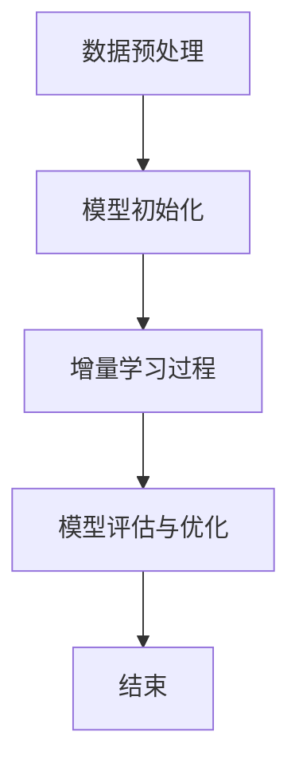

                 

### 引言与背景

#### 1.1 问题背景

**1.1.1 AI Agent的定义**

人工智能（AI）已经从最初的学术研究发展成为影响各行各业的关键技术。在AI的众多应用中，AI Agent扮演着至关重要的角色。AI Agent，通常被称为智能代理，是指能够在特定环境中自主执行任务、实现目标的人工智能系统。这些系统通过感知环境、决策和行动来达到预定的目标，从简单的任务执行到复杂的战略规划都有涉及。

**1.1.2 增量式表示学习**

增量式表示学习是一种在已有数据集的基础上，逐步增加新数据、不断优化模型的方法。与传统的批量学习相比，增量式表示学习能够更加高效地处理动态变化的数据流，减少重新训练整个模型所需的时间和资源。这种方法尤其适用于数据量庞大且不断更新的场景，如在线推荐系统、实时监控和自动驾驶等领域。

**1.1.3 知识更新的必要性**

在AI Agent的实际应用中，知识更新是确保其性能和适应性的关键因素。由于环境变化和任务需求的动态性，AI Agent需要不断更新其内部知识库，以适应新的情境。知识更新不仅涉及新数据的集成，还包括对已有知识的修正和优化。如果知识更新不及时或不当，AI Agent可能会出现性能下降、适应性减弱甚至错误决策等问题。

**1.1.4 增量式表示学习与知识更新的关系**

增量式表示学习与知识更新密切相关。增量式表示学习提供了对新数据进行高效处理的机制，而知识更新则确保AI Agent能够适应环境变化和任务需求。二者结合，不仅能够提升AI Agent的适应性和可靠性，还能降低维护和运营成本。因此，理解增量式表示学习与知识更新之间的互动关系，对于AI Agent的实际应用具有重要意义。

#### 1.2 问题描述

**1.2.1 增量式表示学习面临的挑战**

尽管增量式表示学习具有很多优势，但其在实际应用中仍然面临诸多挑战。首先，如何高效地处理动态变化的数据流是一个关键问题。数据的不确定性和多样性可能导致模型训练的不稳定性和低效性。其次，模型更新和优化是一个复杂的过程，需要考虑计算资源和时间成本。此外，如何确保更新后的模型具有与原始模型相似的性能，也是增量式表示学习需要解决的重要问题。

**1.2.2 知识更新的挑战**

知识更新同样面临众多挑战。首先是知识表示的问题，如何有效地将新知识集成到现有知识库中，是保证知识更新有效性的关键。其次，知识库的维护和更新是一个持续的过程，需要处理大量冗余信息和噪声数据。此外，知识更新的速度和频率也需要与AI Agent的运行需求相匹配，否则可能导致性能下降。

**1.2.3 增量式表示学习与知识更新如何协同工作**

增量式表示学习与知识更新需要协同工作，以实现AI Agent的高效、自适应运行。具体来说，可以通过以下方式实现协同：

1. **数据融合**：在增量式表示学习中，将新数据与旧数据进行融合，通过有效的数据预处理方法，提高模型训练的效率和质量。
   
2. **知识共享**：在知识更新过程中，将新知识与旧知识进行整合，通过知识融合机制，确保知识库的完整性、一致性和高效性。

3. **自适应更新**：根据AI Agent的运行需求和环境变化，动态调整增量式表示学习和知识更新的频率和策略，实现灵活、高效的更新。

通过上述协同工作，增量式表示学习和知识更新能够共同提升AI Agent的性能和适应性，为实际应用提供有力的支持。

#### 1.3 问题解决

**1.3.1 增量式表示学习的基本原理**

增量式表示学习的基本原理是利用已有模型和知识，逐步更新和优化模型表示。具体来说，包括以下几个步骤：

1. **模型初始化**：首先，初始化一个基础模型，该模型可以是一个简单的神经网络或者更复杂的深度学习模型。
   
2. **数据预处理**：对新的数据集进行清洗、转换和集成，确保数据的质量和一致性。
   
3. **增量学习过程**：在已有模型的基础上，逐步添加新的数据，通过迭代训练，优化模型参数，提高模型表示能力。
   
4. **模型评估与优化**：对训练后的模型进行评估，根据评估结果调整模型参数，实现模型的优化。

**1.3.2 知识更新的机制与方法**

知识更新是确保AI Agent适应性和性能的关键。具体机制和方法包括：

1. **知识表示**：将新知识表示为模型参数或知识图谱，通过有效的知识表示方法，提高知识融合的效率。

2. **知识融合**：将新知识与现有知识进行融合，通过知识共享机制，确保知识库的完整性和一致性。

3. **知识评估**：对更新后的知识库进行评估，确保知识库的可靠性和有效性。

4. **知识修正**：根据评估结果，对知识库中的知识进行修正和优化，提高知识库的质量。

**1.3.3 增量式表示学习与知识更新结合的框架**

为了实现增量式表示学习与知识更新的协同工作，可以设计一个综合框架，具体包括以下几个部分：

1. **数据管理模块**：负责数据预处理、数据融合和增量数据的管理。

2. **模型训练模块**：负责增量式表示学习的训练过程，包括模型初始化、增量训练和模型优化。

3. **知识管理模块**：负责知识表示、知识融合、知识评估和知识修正。

4. **系统集成模块**：负责将数据管理、模型训练和知识管理模块整合在一起，实现增量式表示学习与知识更新的协同工作。

通过这个综合框架，增量式表示学习和知识更新能够相互支持，共同提升AI Agent的性能和适应性。

#### 1.4 边界与外延

**1.4.1 增量式表示学习的适用场景**

增量式表示学习适用于数据量庞大且动态变化的环境，如：

- 在线推荐系统：实时更新用户行为数据，优化推荐模型。
- 实时监控：处理动态变化的环境数据，实现实时监控和报警。
- 自动驾驶：持续更新道路数据和驾驶策略，提高自动驾驶的可靠性。

**1.4.2 知识更新的应用领域**

知识更新在AI Agent中的应用非常广泛，包括：

- 金融服务：实时更新市场数据和交易策略，优化投资决策。
- 医疗诊断：整合新的医疗知识和病例数据，提高诊断准确性。
- 教育辅导：根据学生的学习进度和需求，动态调整教学内容和策略。

**1.4.3 增量式表示学习与知识更新在AI Agent中的应用**

在AI Agent的实际应用中，增量式表示学习和知识更新起到了关键作用。例如：

- 在自动驾驶领域，增量式表示学习用于处理实时道路数据，优化驾驶策略；知识更新则用于整合道路标识、交通规则等知识，提高驾驶的适应性和安全性。
- 在医疗诊断领域，增量式表示学习用于处理大量的医学影像数据，提高诊断模型的准确性；知识更新则用于整合新的医学研究成果和临床知识，提高诊断的可靠性和准确性。

总之，增量式表示学习和知识更新在AI Agent中的应用，不仅提升了其性能和适应性，还为实际应用提供了有力的支持。

#### 1.5 概念结构与核心要素组成

**1.5.1 关键概念解释**

- **增量式表示学习**：一种逐步更新和优化模型表示的方法，通过处理动态变化的数据流，提高模型的适应性和效率。
- **知识更新**：一种动态调整AI Agent内部知识库的方法，通过整合新知识，提高知识库的完整性和一致性。
- **AI Agent**：一种能够在特定环境中自主执行任务的人工智能系统，通过感知、决策和行动实现目标。

**1.5.2 增量式表示学习流程**

增量式表示学习通常包括以下步骤：

1. **数据预处理**：清洗、转换和集成新数据，确保数据的质量和一致性。
2. **模型初始化**：初始化基础模型，为后续训练提供起点。
3. **增量学习过程**：逐步添加新数据，通过迭代训练，优化模型参数。
4. **模型评估与优化**：评估训练后的模型性能，调整模型参数，实现模型优化。

**1.5.3 知识更新流程**

知识更新主要包括以下几个步骤：

1. **知识表示**：将新知识表示为模型参数或知识图谱。
2. **知识融合**：将新知识与现有知识进行融合，确保知识库的完整性和一致性。
3. **知识评估**：评估更新后的知识库，确保知识库的可靠性和有效性。
4. **知识修正**：根据评估结果，对知识库中的知识进行修正和优化。

**1.5.4 AI Agent增量式表示学习与知识更新的架构**

AI Agent增量式表示学习与知识更新的架构通常包括以下几个部分：

1. **数据管理模块**：负责数据预处理、数据融合和增量数据的管理。
2. **模型训练模块**：负责增量式表示学习的训练过程，包括模型初始化、增量训练和模型优化。
3. **知识管理模块**：负责知识表示、知识融合、知识评估和知识修正。
4. **系统集成模块**：负责将数据管理、模型训练和知识管理模块整合在一起，实现增量式表示学习与知识更新的协同工作。

通过这个架构，AI Agent能够实现高效、自适应的增量式表示学习和知识更新，提高其性能和适应性。

#### 1.6 本章小结

本章介绍了AI Agent的增量式表示学习和知识更新的背景和重要性。首先，通过定义AI Agent、增量式表示学习和知识更新，明确了本文的研究主题。接着，分析了增量式表示学习和知识更新面临的挑战，探讨了二者如何协同工作。然后，介绍了增量式表示学习和知识更新的基本原理和流程，并提出了一个综合框架。最后，讨论了增量式表示学习和知识更新在不同场景和应用领域的适用性。通过本章的介绍，为后续章节的深入探讨奠定了基础。

----------------------------------------------------------------

## 2. 增量式表示学习原理

在深入探讨AI Agent的增量式表示学习之前，我们需要首先理解一些核心概念，包括特征表示、增量学习和表示学习。这些概念是构建和理解增量式表示学习框架的基础。

### 2.1 核心概念与联系

#### 2.1.1 增量式表示学习的基本概念

**2.1.1.1 特征表示**

特征表示是机器学习中的一个基本概念，指的是将原始数据转换为能够有效表示其内在属性的数值形式。在AI Agent中，特征表示的质量直接影响到模型的性能和效率。常见的特征表示方法包括编码、嵌入和特征提取等。

**2.1.1.2 增量学习**

增量学习是一种逐步更新模型参数的学习方法，适用于数据量庞大且动态变化的场景。与批量学习相比，增量学习能够减少重新训练整个模型所需的时间和资源，从而提高模型的可扩展性和实时性。

**2.1.1.3 表示学习**

表示学习是机器学习中的一个分支，旨在通过学习数据的高层次表示来提升模型的泛化能力。在AI Agent中，表示学习有助于提高模型在复杂环境中的表现，通过学习数据中的内在结构和规律，实现高效的特征提取和知识表示。

#### 2.1.2 增量式表示学习的属性特征对比

**2.1.2.1 静态学习与增量学习的比较**

| 特征         | 静态学习                                               | 增量学习                                               |
|--------------|--------------------------------------------------------|--------------------------------------------------------|
| 数据处理方式 | 整体数据处理，模型需要重新训练                         | 分批次处理，逐步更新模型参数                           |
| 计算资源     | 高计算资源需求，适用于数据量较小的场景                 | 低计算资源需求，适用于数据量庞大、动态变化的场景       |
| 时间成本     | 长时间训练过程，适用于数据变化缓慢的场景               | 短时间内完成更新，适用于数据变化迅速的场景             |
| 适用场景     | 数据量稳定、变化较小的应用场景，如静态图像识别         | 数据动态变化、实时性要求高的应用场景，如在线推荐系统   |

**2.1.2.2 传统表示学习与增量表示学习的比较**

| 特征         | 传统表示学习                                           | 增量表示学习                                           |
|--------------|--------------------------------------------------------|--------------------------------------------------------|
| 学习目标     | 学习全局数据的高层次表示，适用于静态数据集             | 学习动态数据流的高层次表示，适用于动态变化的数据集       |
| 模型更新     | 需要重新训练整个模型，适用于数据量不变或变化较小的场景 | 只需更新部分模型参数，适用于数据量庞大、动态变化的场景 |
| 计算效率     | 高计算资源需求，时间成本较高                           | 低计算资源需求，时间成本较低                           |
| 泛化能力     | 对静态数据集有较好的泛化能力                           | 对动态数据流有较好的适应能力                           |

#### 2.1.3 增量式表示学习与相关概念的联系

**2.1.3.1 增量式表示学习与深度学习的联系**

深度学习是表示学习的一种重要方法，通过多层神经网络对数据进行复杂变换，提取高层次特征表示。增量式表示学习与深度学习的关系体现在：

- **深度学习是增量式表示学习的基础**：深度学习提供了一种有效的表示学习方法，可以用于增量式表示学习。
- **增量式表示学习是深度学习的扩展**：增量式表示学习将深度学习的应用范围扩展到动态变化的数据场景。

**2.1.3.2 增量式表示学习与迁移学习的联系**

迁移学习是一种利用已有模型知识来提升新任务性能的方法。增量式表示学习与迁移学习的关系体现在：

- **增量式表示学习是迁移学习的一种实现方式**：在增量式表示学习中，可以将已有模型的知识迁移到新数据流中进行训练。
- **迁移学习是增量式表示学习的一个补充**：通过迁移学习，可以减少增量式表示学习中的数据量和计算资源需求。

### 2.2 增量式表示学习流程

增量式表示学习的流程可以分为以下几个阶段：

**2.2.1 数据预处理**

数据预处理是增量式表示学习的重要步骤，其目的是提高数据的清洁度和一致性。具体包括以下步骤：

- **数据清洗**：去除数据中的噪声、异常值和缺失值，提高数据质量。
- **数据集成**：将来自不同源的数据进行整合，形成一个统一的数据集。
- **数据转换**：将原始数据转换为适合模型训练的格式，如编码、标准化等。

**2.2.2 模型初始化**

模型初始化是增量式表示学习的起点，其目的是创建一个基础模型，用于后续的增量训练。常见的模型初始化方法包括：

- **随机初始化**：随机设置模型的参数，适用于简单的模型。
- **预训练初始化**：使用预训练模型作为初始化值，适用于复杂模型。

**2.2.3 增量学习过程**

增量学习过程是增量式表示学习的核心，其目的是逐步更新模型参数，提高模型的表示能力。具体包括以下步骤：

- **增量训练**：每次添加新的数据批次，对模型进行迭代训练。
- **模型更新**：根据训练结果，更新模型参数，优化模型表示。

**2.2.4 模型评估与优化**

模型评估与优化是增量式表示学习的最后一步，其目的是确保模型的性能和稳定性。具体包括以下步骤：

- **模型评估**：使用评估指标（如准确率、召回率等）评估模型性能。
- **模型优化**：根据评估结果，调整模型参数，优化模型结构。

### 2.3 数学模型与公式

增量式表示学习涉及多个数学模型和公式，以下是一些常用的模型和公式：

**2.3.1 增量式表示学习的数学模型**

- **神经网络模型**：神经网络是增量式表示学习的基础，常用的神经网络模型包括前馈神经网络（FFN）、卷积神经网络（CNN）和循环神经网络（RNN）等。
- **自适应学习率**：为了提高训练效率，通常使用自适应学习率方法，如Adam优化器。
- **损失函数**：损失函数用于评估模型预测与真实值之间的差距，常用的损失函数包括均方误差（MSE）和交叉熵损失（CE）等。

**2.3.2 公式详解**

- **前向传播公式**：
  $$z = W \cdot x + b$$
  $$a = f(z)$$
  其中，\(W\) 为权重矩阵，\(x\) 为输入特征，\(b\) 为偏置项，\(f\) 为激活函数，\(z\) 和 \(a\) 分别为中间层输出和激活值。
  
- **反向传播公式**：
  $$\delta_h = \frac{\partial L}{\partial z} \cdot \frac{\partial f}{\partial z_h}$$
  $$\frac{\partial L}{\partial W} = \delta_h \cdot a_{h-1}^T$$
  $$\frac{\partial L}{\partial b} = \delta_h$$
  其中，\(\delta_h\) 为误差梯度，\(L\) 为损失函数，\(a_{h-1}\) 为前一层输出。
  
- **梯度下降公式**：
  $$W_{\text{new}} = W_{\text{old}} - \alpha \cdot \frac{\partial L}{\partial W}$$
  $$b_{\text{new}} = b_{\text{old}} - \alpha \cdot \frac{\partial L}{\partial b}$$
  其中，\(\alpha\) 为学习率。

通过上述数学模型和公式，增量式表示学习能够实现模型的参数更新和性能优化。

### 2.4 增量式表示学习的Mermaid流程图

为了更直观地理解增量式表示学习的过程，我们可以使用Mermaid绘制一个流程图。以下是增量式表示学习流程的Mermaid表示：



在这个流程图中，A代表数据预处理，B代表模型初始化，C代表增量学习过程，D代表模型评估与优化，E代表流程结束。

### 2.5 增量式表示学习的Python代码示例

以下是一个简单的增量式表示学习Python代码示例，假设已经实现了一个增量学习模型：

```python
class IncrementalLearningModel:
    def __init__(self):
        # 初始化模型参数
        pass

    def train_incremental(self, data):
        # 增量训练数据
        pass

    def evaluate(self):
        # 模型评估
        pass

# 示例：创建一个增量学习模型并训练
model = IncrementalLearningModel()
model.train_incremental(data)
model.evaluate()
```

在这个示例中，`IncrementalLearningModel` 类定义了增量式表示学习的基本结构，包括模型初始化、增量训练和模型评估的方法。通过调用这些方法，可以完成增量式表示学习的整个过程。

### 2.6 举例说明

**2.6.1 增量式表示学习的应用案例**

增量式表示学习在多个领域都有广泛的应用。以下是一些典型的应用案例：

- **在线推荐系统**：通过增量式表示学习，实时更新用户行为数据，优化推荐算法，提高推荐准确性。
- **自动驾驶**：利用增量式表示学习，持续更新环境数据，优化驾驶策略，提高行驶安全性。
- **金融风控**：通过对交易数据的增量式表示学习，实时检测异常交易行为，提高风控能力。

**2.6.2 增量式表示学习的优势与局限性**

增量式表示学习具有以下优势：

- **高效性**：通过逐步更新模型参数，减少重新训练整个模型所需的时间和资源。
- **适应性**：能够适应动态变化的数据流，提高模型在复杂环境中的表现。

然而，增量式表示学习也存在一些局限性：

- **计算成本**：增量式表示学习仍然需要一定的计算资源，特别是在数据量庞大时，计算成本较高。
- **数据依赖**：模型的性能和适应性依赖于数据的质量和一致性，数据质量问题可能导致模型性能下降。

**2.6.3 实际举例：图像分类任务中的增量式表示学习**

在图像分类任务中，增量式表示学习可以通过以下步骤实现：

1. **数据预处理**：对图像进行预处理，包括去噪、缩放和归一化等。
2. **模型初始化**：初始化一个基础的图像分类模型，如卷积神经网络（CNN）。
3. **增量学习过程**：逐步添加新的图像数据，对模型进行迭代训练，更新模型参数。
4. **模型评估与优化**：评估模型的分类准确性，根据评估结果调整模型参数，优化模型结构。

通过这些步骤，增量式表示学习可以有效地提高图像分类模型的适应性和性能。

### 2.7 本章小结

本章介绍了增量式表示学习的核心概念、流程和数学模型。首先，明确了特征表示、增量学习和表示学习的基本概念，并进行了属性特征对比。接着，详细阐述了增量式表示学习的流程，包括数据预处理、模型初始化、增量学习过程和模型评估与优化。然后，介绍了增量式表示学习与深度学习和迁移学习的关系，并展示了增量式表示学习的Mermaid流程图。最后，通过Python代码示例和实际应用案例，进一步说明了增量式表示学习的方法和优势。通过本章的介绍，为后续章节的深入探讨奠定了基础。

